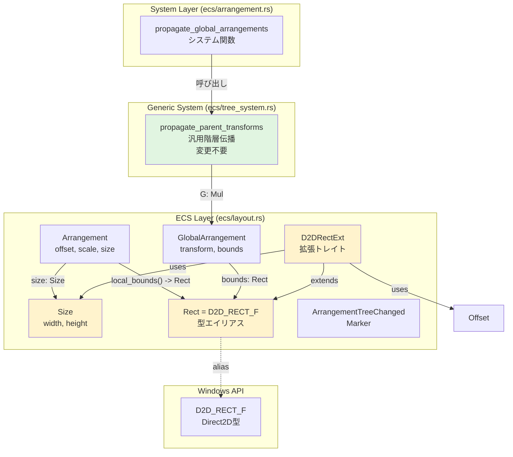

# Design Document: arrangement-bounds-system

## Overview

本機能は、wintfフレームワークのレイアウトシステムにバウンディングボックス管理機能を追加する。現在の`Arrangement`コンポーネントは位置とスケールのみを保持しており、サイズ情報が欠落している。この設計により、軸平行（Axis-Aligned）なバウンディングボックスを階層的に管理し、Surface生成最適化の前提条件を整備する。

**目的**: レイアウト計算結果としてのサイズ（`Arrangement.size`）とワールド座標系でのバウンディングボックス（`GlobalArrangement.bounds`）を提供することで、Surface生成時のサイズ決定と描画領域の把握を可能にする。

**ユーザー**: wintfフレームワークを使用するアプリケーション開発者およびフレームワーク実装者。

**影響**: `Arrangement`と`GlobalArrangement`の構造変更により、既存のすべての`Arrangement`初期化コードで`size`フィールドの追加が必要（破壊的変更）。`cargo build --all-targets`によりexamples/tests含めてコンパイルエラーで漏れなく検出可能。

### Goals

- `Arrangement`コンポーネントにサイズ情報を追加し、位置・スケール・サイズを一体管理
- `GlobalArrangement`にワールド座標系でのバウンディングボックスを追加
- 既存の`propagate_parent_transforms`システムを変更せずに、trait実装拡張のみでbounds伝播を実現
- Direct2D APIとの統合のため、`D2D_RECT_F`の拡張トレイトを提供
- 軸平行変換（平行移動とスケール）専用の最適化された矩形変換（2点変換）を実装

### Non-Goals

- 回転・スキュー変換のサポート（将来のDirectComposition Visual層で実装予定）
- `Arrangement.size`の自動設定（taffyレイアウトエンジン統合は別仕様）
- 子孫boundsの集約機能（Surface生成最適化仕様で実装予定）
- ヒットテストシステムの実装（別仕様、本機能は前提条件のみ提供）

## Architecture

### Existing Architecture Analysis

**現在のアーキテクチャ**:
- **ECSベース**: bevy_ecs 0.17.2を使用したEntity-Component-System
- **階層管理**: `ChildOf`（親参照）と`Children`（子リスト）による親子関係管理
- **汎用階層伝播**: `propagate_parent_transforms<L, G, M>`がジェネリック型パラメータで再利用可能
  - 制約: `G: Mul<L, Output = G>` により、trait実装だけで伝播ロジックが動作
- **変更検知最適化**: `ArrangementTreeChanged`マーカーによるダーティビット伝播

**既存の`Arrangement`システム**:
```rust
// 現在の構造
pub struct Arrangement {
    pub offset: Offset,      // 位置
    pub scale: LayoutScale,  // スケール
}

pub struct GlobalArrangement(pub Matrix3x2);  // タプル構造体

impl Mul<Arrangement> for GlobalArrangement {
    // transform計算のみ
}
```

**保持すべきパターン**:
- ジェネリック階層伝播システムの完全再利用
- trait実装（`Mul`, `From`）による変換計算
- ダーティビット最適化による変更検知
- レイヤードアーキテクチャ（`ecs` → `com` → `windows`）

**技術的制約**:
- `propagate_parent_transforms`システムは変更不可（他の変換システムでも使用中）
- `GlobalArrangement`は`Copy`トレイトを実装する必要がある
- Direct2D APIとの互換性維持（`D2D_RECT_F`の直接使用）

### Architecture Pattern & Boundary Map

**選択パターン**: Trait Extension Pattern（既存trait実装への機能追加）



**アーキテクチャ統合**:
- **選択パターン**: Trait Extension Pattern - 既存のtrait実装（`Mul<Arrangement>`, `From<Arrangement>`）にbounds計算を追加
- **ドメイン境界**: 
  - ECS層（`ecs/layout.rs`）: レイアウトコンポーネント、trait実装、Direct2D型エイリアスと拡張トレイト
  - System層（`ecs/arrangement.rs`）: ECSシステム定義（変更なし）
  - Windows API層: Direct2D APIの直接使用（内部実装の詳細として隠蔽）
- **既存パターンの保持**: 
  - 汎用階層伝播システム（`propagate_parent_transforms`）は完全に再利用
  - 型エイリアス + 拡張トレイトパターン（Direct2D APIとの互換性）
  - ECS Component on_addフック（自動初期化）
- **新規コンポーネントの理由**:
  - `Size`: レイアウトサイズを独立した型として管理（将来のtaffy統合で使用）
  - `Rect`: 既存の`D2D_RECT_F`を型エイリアスとしてラップ
  - `D2DRectExt`: Direct2D矩形に対する便利メソッド群を提供
- **Steering準拠**: レイヤードアーキテクチャと命名規則に準拠、UIフレームワーク利用者の利便性を優先してDirect2D関連の型エイリアスと拡張トレイトを`ecs/layout.rs`に配置

### Technology Stack

| Layer | Choice / Version | Role in Feature | Notes |
|-------|------------------|-----------------|-------|
| ECS Framework | bevy_ecs 0.17.2 | Component定義とtrait実装 | 既存依存、変更なし |
| Numerics | windows_numerics | Matrix3x2点変換 | `transform_point`メソッド使用 |
| Graphics API | windows::Win32::Graphics::Direct2D | D2D_RECT_F型提供 | `ecs/layout.rs`で型エイリアスと拡張トレイト定義 |

**設計判断**: `Rect`型エイリアスと`D2DRectExt`拡張トレイトは`ecs/layout.rs`に配置。UIフレームワーク利用者が`use wintf::ecs::layout::*`だけで完結できるようにするため。Direct2D APIの詳細は内部実装として隠蔽される。

## Requirements Traceability

| Requirement | Summary | Components | Interfaces | Flows |
|-------------|---------|------------|------------|-------|
| 1 | Arrangementへのsizeフィールド追加 | Size, Arrangement | local_bounds() | - |
| 2 | Rect型エイリアスと拡張トレイト | Rect, D2DRectExt | 12メソッド | - |
| 3 | GlobalArrangementへのboundsフィールド | GlobalArrangement | transform, bounds | - |
| 4 | Bounds計算（trait実装拡張） | GlobalArrangement | Mul, From | propagate_parent_transforms |
| 5 | エラーハンドリングとバリデーション | Size, D2DRectExt | validate() | - |
| 6 | テストとドキュメント | - | - | - |

## Components and Interfaces

### Summary

| Component | Domain/Layer | Intent | Req Coverage | Key Dependencies | Contracts |
|-----------|--------------|--------|--------------|------------------|-----------|
| Size | ECS/Layout | レイアウトサイズ保持 | 1 | - | Data Model |
| Arrangement | ECS/Layout | ローカル配置情報拡張 | 1 | Size | Service, State |
| GlobalArrangement | ECS/Layout | グローバル変換拡張 | 3, 4 | Rect | Service, State |
| Rect | ECS/Layout | D2D_RECT_F型エイリアス | 2 | D2D_RECT_F | Data Model |
| D2DRectExt | ECS/Layout | 矩形操作トレイト | 2, 5 | Size, Offset | Service |
| transform_rect_axis_aligned | ECS/Layout | 軸平行矩形変換 | 4 | Matrix3x2 | Service |

### ECS / Layout Layer

#### Size

| Field | Detail |
|-------|--------|
| Intent | レイアウト計算後の確定サイズを保持する値オブジェクト |
| Requirements | 1 |

**Responsibilities & Constraints**
- レイアウトサイズ（幅・高さ）の保持
- 将来的にtaffyレイアウトエンジンの出力として設定される
- 不変値オブジェクト（Copy trait実装）

**Dependencies**
なし（自己完結型）

**Contracts**: Data Model [✓]

##### Data Model
```rust
#[derive(Component, Debug, Clone, Copy, PartialEq, Default)]
pub struct Size {
    pub width: f32,   // 幅（ピクセル単位）
    pub height: f32,  // 高さ（ピクセル単位）
}
```

**Invariants**:
- `width >= 0.0`（負の値は警告ログ出力、ただしmayレベル）
- `height >= 0.0`（負の値は警告ログ出力、ただしmayレベル）

#### Arrangement

| Field | Detail |
|-------|--------|
| Intent | ローカル座標系での配置情報（位置・スケール・サイズ）を一体管理 |
| Requirements | 1, 4 |

**Responsibilities & Constraints**
- ローカル変換情報の保持（offset, scale, size）
- `local_bounds()`メソッドによるローカル矩形の計算
- ECS Component on_addフックにより`GlobalArrangement`と`ArrangementTreeChanged`を自動挿入

**Dependencies**
- Outbound: Size — サイズ情報保持 (P0)
- Outbound: Offset — 位置情報保持 (P0)
- Outbound: LayoutScale — スケール情報保持 (P0)
- Outbound: Rect (D2DRectExt) — local_bounds計算 (P0)

**Contracts**: Service [✓] / State [✓]

##### Service Interface
```rust
impl Arrangement {
    /// ローカル座標系でのバウンディングボックスを返す
    pub fn local_bounds(&self) -> Rect;
}
```

**Preconditions**: なし  
**Postconditions**: `Rect`が`offset`と`size`から構築される  
**Invariants**: 
- `scale.x != 0.0`（ゼロは警告ログ、ただしmayレベル）
- `scale.y != 0.0`（ゼロは警告ログ、ただしmayレベル）

##### State Management
```rust
#[derive(Component, Debug, Clone, Copy, PartialEq)]
pub struct Arrangement {
    pub offset: Offset,
    pub scale: LayoutScale,
    pub size: Size,  // 新規追加
}
```

**Persistence**: ECSコンポーネントとして管理  
**Consistency**: bevy_ecsのComponent変更検知システムで追跡  
**Concurrency**: bevy_ecsの並列クエリ処理で自動管理

**Implementation Notes**
- **Integration**: 既存の`Arrangement`に`size`フィールド追加（破壊的変更）
- **Validation**: `local_bounds()`は`D2DRectExt::from_offset_size()`を呼び出す
- **Risks**: すべての`Arrangement`初期化箇所で`size`フィールド追加が必要（約10-20箇所）

#### GlobalArrangement

| Field | Detail |
|-------|--------|
| Intent | ワールド座標系での累積変換とバウンディングボックスを保持 |
| Requirements | 3, 4 |

**Responsibilities & Constraints**
- 親からの累積変換行列（`transform`）とワールド座標でのバウンディングボックス（`bounds`）を保持
- trait実装（`Mul<Arrangement>`, `From<Arrangement>`）によるbounds自動計算
- タプル構造体から通常の構造体への変更（破壊的変更）

**Dependencies**
- Inbound: Arrangement — 子のローカル変換 (P0)
- Outbound: Matrix3x2 — 累積変換行列 (P0)
- Outbound: Rect — ワールド座標bounds (P0)
- Outbound: transform_rect_axis_aligned — bounds変換 (P0)

**Contracts**: Service [✓] / State [✓]

##### Service Interface
```rust
// Mul trait実装（親 × 子）
impl std::ops::Mul<Arrangement> for GlobalArrangement {
    type Output = GlobalArrangement;
    
    fn mul(self, rhs: Arrangement) -> Self::Output {
        // transform計算
        let child_matrix: Matrix3x2 = rhs.into();
        let result_transform = self.transform * child_matrix;
        
        // bounds計算（新規追加）
        let child_bounds = rhs.local_bounds();
        let result_bounds = transform_rect_axis_aligned(&child_bounds, &result_transform);
        
        GlobalArrangement {
            transform: result_transform,
            bounds: result_bounds,
        }
    }
}

// From trait実装（初期化）
impl From<Arrangement> for GlobalArrangement {
    fn from(arrangement: Arrangement) -> Self {
        Self {
            transform: arrangement.into(),
            bounds: arrangement.local_bounds(),  // 新規追加
        }
    }
}
```

**Preconditions**: 
- `Mul`: 親の`GlobalArrangement`と子の`Arrangement`が有効
- `From`: `Arrangement`が有効

**Postconditions**: 
- `Mul`: 親と子の累積変換とboundsが計算される
- `From`: `Arrangement`から初期`GlobalArrangement`が生成される

**Invariants**: 軸平行変換のみサポート（回転・スキュー変換は警告）

##### State Management
```rust
#[derive(Component, Debug, Clone, Copy, PartialEq)]
pub struct GlobalArrangement {
    pub transform: Matrix3x2,  // 累積変換行列
    pub bounds: Rect,          // ワールド座標bounds
}
```

**Persistence**: ECSコンポーネントとして管理  
**Consistency**: `propagate_parent_transforms`により階層的に伝播  
**Concurrency**: bevy_ecsの並列処理対応（`par_iter_mut`）

**Implementation Notes**
- **Integration**: タプル構造体から通常の構造体への変更
- **Validation**: trait実装の拡張のみで既存システムが動作
- **Risks**: 構造体変更により既存のパターンマッチや`.0`アクセスが影響

#### transform_rect_axis_aligned

| Field | Detail |
|-------|--------|
| Intent | 軸平行変換専用の最適化された矩形変換（2点変換） |
| Requirements | 4 |

**Responsibilities & Constraints**
- 軸平行変換（平行移動とスケール）での矩形変換
- 左上と右下の2点のみを変換（4点変換は不要）
- 変換後の2点からmin/maxで新しい軸平行矩形を構築

**Dependencies**
- Inbound: Matrix3x2 — windows_numerics::Matrix3x2 (P0)
- Inbound: Rect — D2D_RECT_F (P0)

**Contracts**: Service [✓]

##### Service Interface
```rust
/// 軸平行変換専用の矩形変換（2点変換）
pub fn transform_rect_axis_aligned(rect: &Rect, matrix: &Matrix3x2) -> Rect {
    // 左上と右下の2点を変換
    let top_left = matrix.transform_point(Vector2 { X: rect.left, Y: rect.top });
    let bottom_right = matrix.transform_point(Vector2 { X: rect.right, Y: rect.bottom });
    
    // min/maxで新しい軸平行矩形を構築
    Rect {
        left: top_left.X.min(bottom_right.X),
        top: top_left.Y.min(bottom_right.Y),
        right: top_left.X.max(bottom_right.X),
        bottom: top_left.Y.max(bottom_right.Y),
    }
}
```

**Preconditions**: 
- `rect`が有効な矩形（`left <= right`, `top <= bottom`）
- `matrix`が軸平行変換（回転・スキューなし）

**Postconditions**: 変換後の軸平行矩形が返される

**Invariants**: 軸平行変換専用（回転・スキュー変換では正しく動作しない）

**Implementation Notes**
- **Integration**: `ecs/layout.rs`に配置、`GlobalArrangement`のtrait実装から呼び出される
- **Validation**: 回転・スキュー変換が含まれる場合は警告ログ（may）
- **Risks**: 回転・スキュー変換では正しくない結果を返す（将来の拡張で対応）

#### Rect

| Field | Detail |
|-------|--------|
| Intent | D2D_RECT_Fの型エイリアス |
| Requirements | 2 |

**Responsibilities & Constraints**
- `windows::Win32::Graphics::Direct2D::Common::D2D_RECT_F`の型エイリアス
- 既存コードとの互換性維持
- Direct2D APIとの直接統合
- UIフレームワーク利用者に対してDirect2D実装詳細を隠蔽

**Dependencies**
- External: windows crate — D2D_RECT_F型 (P0)

**Contracts**: Data Model [✓]

##### Data Model
```rust
pub type Rect = D2D_RECT_F;

// D2D_RECT_F構造（参考）
// struct D2D_RECT_F {
//     pub left: f32,
//     pub top: f32,
//     pub right: f32,
//     pub bottom: f32,
// }
```

**Implementation Notes**
- **Integration**: `ecs/layout.rs`に配置、UIフレームワーク利用者が`use wintf::ecs::layout::*`だけで使えるようにする
- **Validation**: 既存の`D2D_RECT_F`使用箇所との互換性を完全維持
- **Risks**: なし（型エイリアスのみ）

#### D2DRectExt

| Field | Detail |
|-------|--------|
| Intent | D2D_RECT_Fに対する拡張トレイト（12メソッド） |
| Requirements | 2, 5 |

**Responsibilities & Constraints**
- 矩形の構築・取得・設定・判定・演算メソッドの提供
- `ecs/layout`モジュールの`Size`と`Offset`型を参照（データ構造のみ）
- デバッグビルドでの矩形一貫性検証（`validate()`）

**Dependencies**
- Inbound: D2D_RECT_F (Rect) — 拡張対象 (P0)
- Outbound: Size — from_offset_size引数 (P0)
- Outbound: Offset — from_offset_size引数 (P0)
- Outbound: Vector2 — windows_numerics (P0)

**Contracts**: Service [✓]

##### Service Interface
```rust
pub trait D2DRectExt {
    // 構築
    fn from_offset_size(offset: Offset, size: Size) -> Self;
    
    // 取得
    fn width(&self) -> f32;
    fn height(&self) -> f32;
    fn offset(&self) -> Vector2;
    fn size(&self) -> Vector2;
    
    // 設定
    fn set_offset(&mut self, offset: Vector2);
    fn set_size(&mut self, size: Vector2);
    fn set_left(&mut self, left: f32);
    fn set_top(&mut self, top: f32);
    fn set_right(&mut self, right: f32);
    fn set_bottom(&mut self, bottom: f32);
    
    // 判定
    fn contains(&self, x: f32, y: f32) -> bool;
    
    // 演算
    fn union(&self, other: &Self) -> Self;
    
    // バリデーション（デバッグビルドのみ）
    #[cfg(debug_assertions)]
    fn validate(&self);
}

impl D2DRectExt for D2D_RECT_F {
    fn from_offset_size(offset: Offset, size: Size) -> Self {
        D2D_RECT_F {
            left: offset.x,
            top: offset.y,
            right: offset.x + size.width,
            bottom: offset.y + size.height,
        }
    }
    
    fn width(&self) -> f32 { self.right - self.left }
    fn height(&self) -> f32 { self.bottom - self.top }
    
    fn offset(&self) -> Vector2 {
        Vector2 { X: self.left, Y: self.top }
    }
    
    fn size(&self) -> Vector2 {
        Vector2 { X: self.width(), Y: self.height() }
    }
    
    fn set_offset(&mut self, offset: Vector2) {
        let w = self.width();
        let h = self.height();
        self.left = offset.X;
        self.top = offset.Y;
        self.right = offset.X + w;
        self.bottom = offset.Y + h;
    }
    
    fn set_size(&mut self, size: Vector2) {
        self.right = self.left + size.X;
        self.bottom = self.top + size.Y;
    }
    
    fn set_left(&mut self, left: f32) { self.left = left; }
    fn set_top(&mut self, top: f32) { self.top = top; }
    fn set_right(&mut self, right: f32) { self.right = right; }
    fn set_bottom(&mut self, bottom: f32) { self.bottom = bottom; }
    
    fn contains(&self, x: f32, y: f32) -> bool {
        x >= self.left && x <= self.right && y >= self.top && y <= self.bottom
    }
    
    fn union(&self, other: &Self) -> Self {
        D2D_RECT_F {
            left: self.left.min(other.left),
            top: self.top.min(other.top),
            right: self.right.max(other.right),
            bottom: self.bottom.max(other.bottom),
        }
    }
    
    #[cfg(debug_assertions)]
    fn validate(&self) {
        debug_assert!(self.left <= self.right, "Invalid rect: left > right");
        debug_assert!(self.top <= self.bottom, "Invalid rect: top > bottom");
    }
}
```

**Preconditions**: 
- `from_offset_size`: 有効な`Offset`と`Size`
- その他: 有効な`D2D_RECT_F`

**Postconditions**: 各メソッドの仕様通りの結果

**Invariants**: 
- `left <= right`
- `top <= bottom`
- `validate()`はデバッグビルドでのみアサーション

**Implementation Notes**
- **Integration**: `ecs/layout.rs`に配置、`Size`、`Offset`と同じモジュールで定義することで依存関係を単純化
- **Validation**: デバッグビルドでの一貫性検証
- **Risks**: なし（同一モジュール内での定義）
- **Design Rationale**: UIフレームワーク利用者が`use wintf::ecs::layout::*`だけで完結できるようにするため

## Data Models

### Domain Model

**Aggregates**: なし（既存のECS Component拡張）

**Entities**:
- `Size`: レイアウトサイズを表す値オブジェクト
- `Arrangement`: ローカル配置情報（位置・スケール・サイズ）
- `GlobalArrangement`: グローバル変換とbounds

**Value Objects**:
- `Size`: 幅と高さのペア
- `Offset`: X/Y座標のペア
- `LayoutScale`: X/Yスケールのペア
- `Rect`: 矩形（left, top, right, bottom）

**Domain Events**: なし（ECSの変更検知システムで代替）

**Business Rules**:
- サイズは非負であることが推奨（負の場合は警告）
- スケールはゼロでないことが推奨（ゼロの場合は警告）
- 矩形は一貫性を保つ（`left <= right`, `top <= bottom`）
- 軸平行変換のみサポート（回転・スキュー変換は警告）

### Logical Data Model

**Structure Definition**:
```rust
// Size: レイアウトサイズ
Size { width: f32, height: f32 }

// Arrangement: ローカル配置（拡張）
Arrangement {
    offset: Offset,
    scale: LayoutScale,
    size: Size,  // 新規
}

// GlobalArrangement: グローバル変換（拡張）
GlobalArrangement {
    transform: Matrix3x2,
    bounds: Rect,  // 新規
}

// Rect: 矩形（型エイリアス）
Rect = D2D_RECT_F {
    left: f32,
    top: f32,
    right: f32,
    bottom: f32,
}
```

**Entity Relationships**:
- `Arrangement` has-a `Size` (composition)
- `GlobalArrangement` has-a `Rect` (composition)
- `Arrangement` → `GlobalArrangement` (From trait)
- Parent `GlobalArrangement` × Child `Arrangement` → Child `GlobalArrangement` (Mul trait)

**Referential Integrity**:
- ECSのComponent変更検知により自動追跡
- `ArrangementTreeChanged`マーカーによるダーティビット伝播

**Temporal Aspects**:
- なし（リアルタイム計算、永続化なし）

### Physical Data Model

**適用外**: メモリ内ECSコンポーネントのみ、永続化なし

## Error Handling

### Validation Strategy

**警告ログ出力（mayレベル）**:
- `Size.width` < 0.0 または `Size.height` < 0.0
- `LayoutScale.x` == 0.0 または `LayoutScale.y` == 0.0
- 回転・スキュー変換が含まれる場合（軸平行変換専用）

**デバッグアサーション**:
- `D2DRectExt::validate()`: `left <= right`, `top <= bottom`

### Error Recovery

**適用外**: バリデーションエラーは警告のみ、実行時エラーとして処理しない

## Testing Strategy

### Unit Tests

1. **Size構造体**:
   - Default値のテスト
   - Copy/Clone動作の確認

2. **Arrangement.local_bounds()**:
   - 正常ケース（正のサイズ）
   - エッジケース（ゼロサイズ、負のサイズ）

3. **transform_rect_axis_aligned**:
   - 恒等変換
   - 平行移動のみ
   - スケールのみ
   - 平行移動とスケールの組み合わせ

4. **D2DRectExt**:
   - `from_offset_size`
   - `width`, `height`, `offset`, `size`
   - `set_offset`, `set_size`
   - `contains`
   - `union`（2つの矩形の最小外接矩形）

5. **GlobalArrangement trait実装**:
   - `From<Arrangement>`: 初期bounds設定
   - `Mul<Arrangement>`: 親子bounds計算

### Integration Tests

**階層的バウンディングボックス計算**:
- 親子3階層のWidgetツリーを構築
- 各階層で`Arrangement.size`を設定
- `propagate_global_arrangements`システム実行
- 最終的な`GlobalArrangement.bounds`が正しいことを検証

### Migration Tests

**既存コードの互換性**:
- `Arrangement`初期化時の`size`フィールド追加
- `GlobalArrangement`のパターンマッチ変更（タプル → 構造体）
- `cargo build --all-targets`によるコンパイルエラーで網羅性確認（examples, tests含む）

## Performance Considerations

### Optimization

**2点変換の最適化**:
- 軸平行変換では左上と右下の2点のみを変換
- 4点変換（全頂点）は不要、計算量を半減

**ダーティビット最適化**:
- `ArrangementTreeChanged`マーカーによる変更検知
- 変更がない階層は再計算をスキップ

**並列処理**:
- `propagate_parent_transforms`は既に並列処理対応（`par_iter_mut`）
- trait実装拡張のみで並列処理も自動適用

### Expected Performance

**実装規模**: Small (1-2日、約10時間)

**パフォーマンス影響**:
- trait実装に数行追加のみ、実行時オーバーヘッドは最小
- 既存の階層伝播システムの並列処理性能を維持

## Security Considerations

**適用外**: クライアントサイドのレイアウト計算、セキュリティ上の懸念なし

## Migration Strategy

### Breaking Changes

**Arrangement構造変更**:
- 既存コード: `Arrangement { offset, scale }`
- 新規コード: `Arrangement { offset, scale, size }`
- 影響: すべての`Arrangement`初期化箇所（examples/tests含む約10-20箇所）
- 検出: `cargo build --all-targets`でコンパイルエラーを漏れなく検出

**GlobalArrangement構造変更**:
- 既存コード: `GlobalArrangement(matrix)` (タプル)
- 新規コード: `GlobalArrangement { transform, bounds }` (構造体)
- 影響: パターンマッチや`.0`アクセス
- 検出: `cargo build --all-targets`でコンパイルエラーを漏れなく検出

### Migration Steps

1. **データ構造追加** (0.5時間):
   - `Size`構造体定義（`ecs/layout.rs`）
   - `Rect`型エイリアス定義（`ecs/layout.rs`）

2. **D2DRectExt実装** (2時間):
   - 12メソッドの実装とテスト（`ecs/layout.rs`）

3. **Arrangement拡張** (0.5時間):
   - `size`フィールド追加
   - `local_bounds()`メソッド追加

4. **既存コード修正** (2-3時間):
   - `Arrangement`初期化箇所の`size`フィールド追加
   - `cargo build --all-targets`でコンパイルエラー追跡と修正（examples/tests含む）

5. **GlobalArrangement拡張** (0.5時間):
   - 構造体化（タプル → 構造体）
   - `bounds`フィールド追加

6. **Trait実装拡張** (1時間):
   - `Mul<Arrangement>`にbounds計算追加
   - `From<Arrangement>`にbounds設定追加

7. **ヘルパー関数** (1時間):
   - `transform_rect_axis_aligned`実装

8. **テスト** (2時間):
   - ユニットテスト
   - 統合テスト

### Rollback Plan

**コンパイルエラーベースの検証**:
- 破壊的変更のためロールバックは不要
- `cargo build --all-targets`ですべての変更箇所を検出（examples/tests含む）
- 段階的コミットで部分的ロールバック可能

## Documentation

### Code Documentation

**追加ドキュメント**:
- `Arrangement.size`: taffyレイアウト計算との関係
- `GlobalArrangement.bounds`: 座標系とSurface生成との関連
- `transform_rect_axis_aligned`: 軸平行変換のみサポートすることの説明
- `D2DRectExt`: 各メソッドの使用例とパフォーマンス特性

### API Documentation

**適用外**: 内部API拡張のみ、外部公開APIなし

## Open Questions and Risks

### Open Questions

なし（Gap Analysis完了、技術的な不確実性なし）

### Risks

| Risk | Likelihood | Impact | Mitigation |
|------|-----------|--------|------------|
| 既存コード修正の漏れ | Low | Medium | `cargo build --all-targets`で全箇所検出（examples/tests含む） |
| パフォーマンス劣化 | Low | Low | 2点変換の最適化、ダーティビット保持 |
| 回転・スキュー変換の誤使用 | Medium | Low | 警告ログ出力（将来の拡張で対応） |

## Supporting References

### External Dependencies

**windows_numerics::Matrix3x2**:
- `transform_point(Vector2) -> Vector2`: 点変換メソッド
- 使用箇所: `transform_rect_axis_aligned`

**windows::Win32::Graphics::Direct2D::Common::D2D_RECT_F**:
- Direct2D矩形構造体
- 使用箇所: `Rect`型エイリアス、既存の描画コード

### Related Specifications

- **surface-allocation-optimization**: 子孫bounds集約機能（本仕様の後続）
- **taffy-layout-integration**: `Arrangement.size`の自動設定（別仕様）
- **hit-test-system**: `GlobalArrangement.bounds`を使用（別仕様）
- **transform-layer**: 回転・スキュー変換（将来実装）

---

**Generated**: 2025-11-22  
**Status**: Design Generated  
**Ready for Review**: Yes
