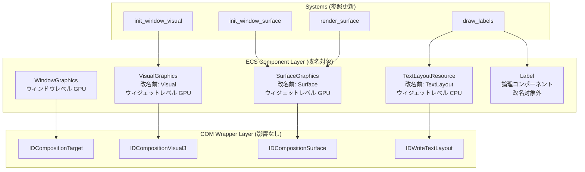
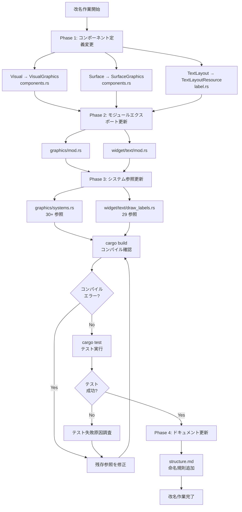
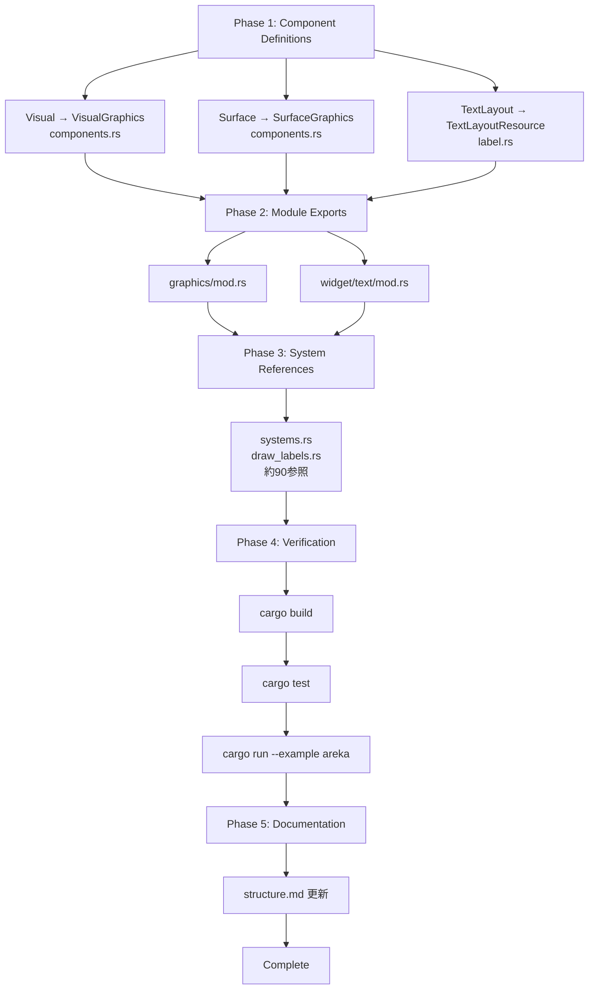

# Design: com-resource-naming-unification

**Feature ID**: `com-resource-naming-unification`  
**Created**: 2025-11-17  
**Status**: Design Generated

---

## Overview

本設計は、COMリソースを保持するECSコンポーネントの命名規則を統一する改名作業の技術設計を定義する。具体的には、`Visual`→`VisualGraphics`、`Surface`→`SurfaceGraphics`、`TextLayout`→`TextLayoutResource`への改名を実施し、GPU資源（デバイス依存）とCPU資源（デバイス非依存）の区別を型名から明確化する。

**Purpose**: コードベースの可読性と保守性を向上させ、将来のCOMリソースコンポーネント追加時の命名一貫性を確保する。

**Users**: wintfライブラリの開発者およびメンテナが、COM資源コンポーネントの役割と特性を型名から即座に理解できるようにする。

**Impact**: 既存の3コンポーネント名を変更し、参照箇所（約90箇所）を更新する。ロジックは変更せず、型システムによる安全性を活用した機械的なリファクタリングとなる。

### Goals
- GPU資源（`XxxGraphics`サフィックス）とCPU資源（`XxxResource`サフィックス）の命名区別
- 既存の3コンポーネント（`Visual`、`Surface`、`TextLayout`）の改名完了
- すべての参照箇所の更新とコンパイル成功
- 既存テストの成功維持
- 命名規則のドキュメント化（`.kiro/steering/structure.md`）

### Non-Goals
- 新規COMリソースコンポーネントの実装
- COMオブジェクトのライフタイム管理ロジックの変更
- デバイスロスト検出・復旧機構の実装
- システム関数名の変更（`draw_labels`等）
- モジュール構造の再編成
- テストコードの追加

---

## Architecture

### Existing Architecture Analysis

**現在のアーキテクチャ**:
- **レイヤー構造**: COM Wrapper層（`com/`） → ECS Component層（`ecs/`） → Message Handling層（ルート）
- **ECSフレームワーク**: bevy_ecs 0.17.2を使用したコンポーネントベース設計
- **GPU資源パターン**: `Option<T>`ラッピング + `invalidate()`メソッド + `generation`フィールドでデバイスロスト対応
- **CPU資源パターン**: `Option<T>`ラッピングのみ（再初期化不要）

**改名の影響範囲**:
- **ECS Component層のみ**: コンポーネント定義（`ecs/graphics/components.rs`、`ecs/widget/text/label.rs`）とその参照箇所
- **COM Wrapper層**: 影響なし（COMインターフェイス自体は変更しない）
- **Message Handling層**: 影響なし（コンポーネント型のみの変更）

**保守する既存パターン**:
- `#[component(storage = "SparseSet")]`ストレージタイプ
- `unsafe impl Send/Sync`スレッド安全性実装
- COMアクセスメソッド名（`visual()`, `surface()`, `get()`）
- `invalidate()`/`generation`パターン（GPU資源のみ）

### Architecture Pattern & Boundary Map



**Architecture Integration**:
- **選択パターン**: 既存ファイル拡張（Option A from gap-analysis.md）
- **境界の尊重**: ECS Component層のみ変更、COM層とMessage層は影響なし
- **既存パターンの維持**: デバイスロスト対応、ストレージタイプ、スレッド安全性すべて保持
- **新規コンポーネントなし**: 型名変更のみ、構造は不変
- **Steering準拠**: レイヤードアーキテクチャとECSパターンの完全維持

### Technology Stack & Alignment

| Layer | Choice / Version | Role in Feature | Notes |
|-------|------------------|-----------------|-------|
| ECS Framework | bevy_ecs 0.17.2 | コンポーネント管理基盤 | 変更なし |
| COM Bindings | windows-rs 0.62.1 | Windows APIバインディング | 変更なし |
| Compiler | Rust 2021 Edition | 型安全性保証 | 改名漏れをコンパイルエラーで検出 |

**既存技術との整合性**:
- すべての既存ライブラリ・フレームワークと完全互換
- 破壊的変更なし（型名のみの変更）
- ビルドシステム変更不要

---

## System Flows

改名作業のため、実行時フローの変更なし。以下は改名作業自体のフローを示す。



---

## Requirements Traceability

| Requirement | Summary | Components | Interfaces | Implementation |
|-------------|---------|------------|------------|----------------|
| 1 | WindowGraphics命名維持 | WindowGraphics | 変更なし | 検証のみ |
| 2.1 | Visual→VisualGraphics | VisualGraphics | visual() | components.rs, systems.rs |
| 2.2 | Surface→SurfaceGraphics | SurfaceGraphics | surface() | components.rs, systems.rs |
| 2.3 | TextLayout→TextLayoutResource | TextLayoutResource | get() | label.rs, draw_labels.rs |
| 3 | 将来の命名規則 | - | - | structure.md |
| 4 | 共有リソース命名規則 | - | - | structure.md |
| 5 | 移行安全性 | All | All | cargo test |
| 6 | ドキュメント更新 | - | - | structure.md |
| 7 | 一貫性検証 | All | All | レビュープロセス |

---

## Components and Interfaces

### 概要

| Component | Domain/Layer | Intent | Req Coverage | Key Dependencies | Contracts |
|-----------|--------------|--------|--------------|------------------|-----------|
| VisualGraphics | ECS/Graphics | IDCompositionVisual3のラップ | 2.1 | Visual (旧名) | State |
| SurfaceGraphics | ECS/Graphics | IDCompositionSurfaceのラップ | 2.2 | Surface (旧名) | State |
| TextLayoutResource | ECS/Widget | IDWriteTextLayoutのラップ | 2.3 | TextLayout (旧名) | State |

### ECS Component Layer

#### VisualGraphics

| Field | Detail |
|-------|--------|
| Intent | DirectCompositionビジュアルノードのECSコンポーネント表現 |
| Requirements | 2.1 |
| Owner / Reviewers | - |

**Responsibilities & Constraints**
- `IDCompositionVisual3`のライフタイム管理
- デバイスロスト時の`invalidate()`による無効化
- ウィジェットレベルのGPU資源（将来は個別Entityに配置）

**Dependencies**
- Inbound: `init_window_visual`, `create_visual_for_target()` — 初期化 (P0)
- Outbound: `IDCompositionVisual3` — COM API (P0)
- External: なし

**Contracts**: State [x]

##### State Management

**改名前の構造**:
```rust
pub struct Visual {
    inner: Option<IDCompositionVisual3>,
}
```

**改名後の構造**:
```rust
pub struct VisualGraphics {
    inner: Option<IDCompositionVisual3>,
}
```

**状態遷移**:
- `Some(visual)` → 有効なGPU資源
- `None` → デバイスロスト後の無効状態

**アクセスメソッド**（維持）:
- `visual()` → `Option<&IDCompositionVisual3>`
- `invalidate()` → `None`化
- `is_valid()` → `bool`

**ストレージ**: `SparseSet`（維持）
**スレッド安全性**: `Send + Sync`（維持）

**Implementation Notes**
- **Integration**: システム関数戻り値型、クエリ型の更新
- **Validation**: コンパイラによる型チェック
- **Risks**: なし（機械的な型名変更のみ）

#### SurfaceGraphics

| Field | Detail |
|-------|--------|
| Intent | DirectCompositionサーフェスのECSコンポーネント表現 |
| Requirements | 2.2 |
| Owner / Reviewers | - |

**Responsibilities & Constraints**
- `IDCompositionSurface`のライフタイム管理
- デバイスロスト時の`invalidate()`による無効化
- ウィジェットレベルのGPU資源（将来は個別Entityに配置）

**Dependencies**
- Inbound: `init_window_surface`, `create_surface_for_window()`, `render_surface` — 初期化・描画 (P0)
- Outbound: `IDCompositionSurface` — COM API (P0)
- External: なし

**Contracts**: State [x]

##### State Management

**改名前の構造**:
```rust
pub struct Surface {
    inner: Option<IDCompositionSurface>,
}
```

**改名後の構造**:
```rust
pub struct SurfaceGraphics {
    inner: Option<IDCompositionSurface>,
}
```

**状態遷移**:
- `Some(surface)` → 有効なGPU資源
- `None` → デバイスロスト後の無効状態

**アクセスメソッド**（維持）:
- `surface()` → `Option<&IDCompositionSurface>`
- `invalidate()` → `None`化
- `is_valid()` → `bool`

**ストレージ**: `SparseSet`（維持）
**スレッド安全性**: `Send + Sync`（維持）

**Implementation Notes**
- **Integration**: システム関数引数型、戻り値型、クエリ型の更新
- **Validation**: コンパイラによる型チェック
- **Risks**: なし（機械的な型名変更のみ）

#### TextLayoutResource

| Field | Detail |
|-------|--------|
| Intent | DirectWriteテキストレイアウトのECSコンポーネント表現 |
| Requirements | 2.3 |
| Owner / Reviewers | - |

**Responsibilities & Constraints**
- `IDWriteTextLayout`のライフタイム管理
- CPU資源のためデバイスロスト対応不要
- 複数ウィジェットタイプ（Label、将来のTextBlock、Button等）で再利用可能

**Dependencies**
- Inbound: `draw_labels` — 生成・挿入 (P0)
- Outbound: `IDWriteTextLayout` — COM API (P0)
- External: なし

**Contracts**: State [x]

##### State Management

**改名前の構造**:
```rust
pub struct TextLayout {
    layout: Option<IDWriteTextLayout>,
}
```

**改名後の構造**:
```rust
pub struct TextLayoutResource {
    layout: Option<IDWriteTextLayout>,
}
```

**状態遷移**:
- `Some(layout)` → 有効なCPU資源
- `None` → 未生成状態

**アクセスメソッド**（維持）:
- `get()` → `Option<&IDWriteTextLayout>`
- `new(layout)` → コンストラクタ
- `empty()` → 空インスタンス

**ストレージ**: `SparseSet`（維持）
**スレッド安全性**: 暗黙的（COM型のため）

**Implementation Notes**
- **Integration**: `draw_labels`システムでの型参照、コンストラクタ呼び出しの更新
- **Validation**: コンパイラによる型チェック
- **Risks**: なし（機械的な型名変更のみ）
- **Reusability**: 将来のTextBlock、Button等で同じコンポーネントを使用可能

---

## Data Models

### Domain Model

改名作業のため、ドメインモデル自体の変更なし。以下は命名規則の概念モデル：

**COMリソースコンポーネントの分類**:
- **GPUリソース** (`XxxGraphics`)
  - デバイス依存
  - デバイスロスト時に再生成必要
  - `invalidate()` + `generation`パターン
  - 例: `WindowGraphics`, `VisualGraphics`, `SurfaceGraphics`

- **CPUリソース** (`XxxResource`)
  - デバイス非依存
  - 永続的、再生成不要
  - 通常の参照カウント管理のみ
  - 例: `TextLayoutResource`, `TextFormatResource`（将来）

**レベル分類**:
- **ウィンドウレベル**: `WindowGraphics`
- **ウィジェットレベル**: `VisualGraphics`, `SurfaceGraphics`, `TextLayoutResource`
- **共有リソース**: 将来の`BrushGraphics`、`GeometryResource`等

---

## Error Handling

### Error Strategy

改名作業は型システムによる静的検証に依存するため、実行時エラーは発生しない。

### Error Categories and Responses

**コンパイルエラー** (型不一致):
- **原因**: 改名漏れの参照箇所
- **検出**: `cargo build`
- **対応**: コンパイラエラーメッセージから該当箇所を特定し、型名を更新

**テスト失敗** (動作変更):
- **原因**: 改名以外の意図しない変更（発生しないはず）
- **検出**: `cargo test`
- **対応**: diffを確認し、ロジック変更を排除

### Monitoring

改名作業のため、実行時モニタリングは不要。以下の検証で十分：
- `cargo build --all-targets` - 全ターゲットのコンパイル成功
- `cargo test` - 既存テストの成功
- `git diff` - 意図しない変更の検出

---

## Testing Strategy

### Unit Tests
改名対象コンポーネントを直接使用するユニットテストは存在しない（gap-analysis.mdより）。既存テストは`WindowGraphics`のみ使用。

**検証項目**:
1. `cargo build` - コンパイル成功（型チェック）
2. `cargo test` - 既存テスト成功（動作不変の確認）
3. サンプルアプリ実行 - `cargo run --example areka` （統合確認）

### Integration Tests
改名作業のため、新規テストは不要。既存テストの成功維持のみ。

**検証対象ファイル**:
- `tests/graphics_core_ecs_test.rs` - WindowGraphics使用（改名対象外）
- `tests/graphics_reinit_unit_test.rs` - WindowGraphics使用（改名対象外）
- `tests/lazy_reinit_pattern_test.rs` - テスト用WindowGraphics定義（独立）

### Regression Prevention
改名作業のため、リグレッションリスクは極めて低い。以下で十分：

1. **型安全性**: Rustコンパイラが未更新箇所をすべて検出
2. **既存テスト**: 動作不変の保証
3. **ロジック不変**: 型名のみ変更、実装は一切変更なし

---

## Migration Strategy

### Phase Breakdown



### Rollback Triggers
- コンパイルエラーが解消できない場合 → `git reset --hard`
- テスト失敗が解消できない場合 → `git reset --hard`
- 意図しないロジック変更が混入した場合 → `git reset --hard`

### Validation Checkpoints
1. **Phase 1完了時**: コンパイルエラー発生（予期通り）
2. **Phase 3完了時**: `cargo build`成功
3. **Phase 4完了時**: `cargo test`成功
4. **Phase 5完了時**: ドキュメント更新完了、レビュー準備完了

---

## Supporting References

### Detailed File Change List

#### Phase 1: Component Definitions

**`crates/wintf/src/ecs/graphics/components.rs`**:
```rust
// Before
pub struct Visual { ... }

// After
pub struct VisualGraphics { ... }

// Before
pub struct Surface { ... }

// After
pub struct SurfaceGraphics { ... }
```

**`crates/wintf/src/ecs/widget/text/label.rs`**:
```rust
// Before
pub struct TextLayout { ... }

// After
pub struct TextLayoutResource { ... }
```

#### Phase 2: Module Exports

**`crates/wintf/src/ecs/graphics/mod.rs`**:
```rust
// Before
pub use components::{Visual, Surface, ...};

// After
pub use components::{VisualGraphics, SurfaceGraphics, ...};
```

**`crates/wintf/src/ecs/widget/text/mod.rs`**:
```rust
// Before
pub use label::{Label, TextLayout};

// After
pub use label::{Label, TextLayoutResource};
```

#### Phase 3: System References

**`crates/wintf/src/ecs/graphics/systems.rs`** (30+ 箇所):
- 関数シグネチャ: `fn create_visual_for_target(...) -> Result<Visual>` → `Result<VisualGraphics>`
- クエリ型: `Query<&Visual>` → `Query<&VisualGraphics>`
- コンストラクタ: `Visual::new(...)` → `VisualGraphics::new(...)`
- 同様に`Surface` → `SurfaceGraphics`

**`crates/wintf/src/ecs/widget/text/draw_labels.rs`** (29 箇所):
- クエリ型更新
- コンストラクタ: `TextLayout::new(...)` → `TextLayoutResource::new(...)`

### Naming Convention Documentation Template

**`.kiro/steering/structure.md`への追加内容**:

```markdown
## Component Naming Conventions

### COMリソースコンポーネント

COMオブジェクトをラップするECSコンポーネントは、以下の命名規則に従う：

#### GPUリソース (`XxxGraphics`)
- **特性**: Direct3D/Direct2D/DirectCompositionデバイスに依存
- **デバイスロスト対応**: `invalidate()`メソッドと`generation`フィールドを実装
- **命名**: `XxxGraphics`サフィックス
- **例**:
  - `WindowGraphics` - ウィンドウレベルGPU資源
  - `VisualGraphics` - ウィジェットレベルGPU資源
  - `SurfaceGraphics` - ウィジェットレベルGPU資源

#### CPUリソース (`XxxResource`)
- **特性**: デバイス非依存、永続的
- **デバイスロスト対応**: 不要（通常の参照カウント管理のみ）
- **命名**: `XxxResource`サフィックス
- **例**:
  - `TextLayoutResource` - テキストレイアウト（Label、TextBlock等で再利用）
  - `TextFormatResource` - テキストフォーマット（将来）
  - `PathGeometryResource` - パスジオメトリ（将来）

#### レベル分類
- **ウィンドウレベル**: Windowエンティティに配置（例: `WindowGraphics`）
- **ウィジェットレベル**: 個別ウィジェットエンティティに配置（例: `VisualGraphics`, `TextLayoutResource`）
- **共有リソース**: 複数ウィジェットで再利用（例: `BrushGraphics`、`GeometryResource`）

#### 非COMコンポーネント
- **論理コンポーネント**: サフィックスなし（例: `Label`, `Rectangle`, `Button`）
- **マーカーコンポーネント**: 用途に応じた名前（例: `HasGraphicsResources`, `GraphicsNeedsInit`）
```
