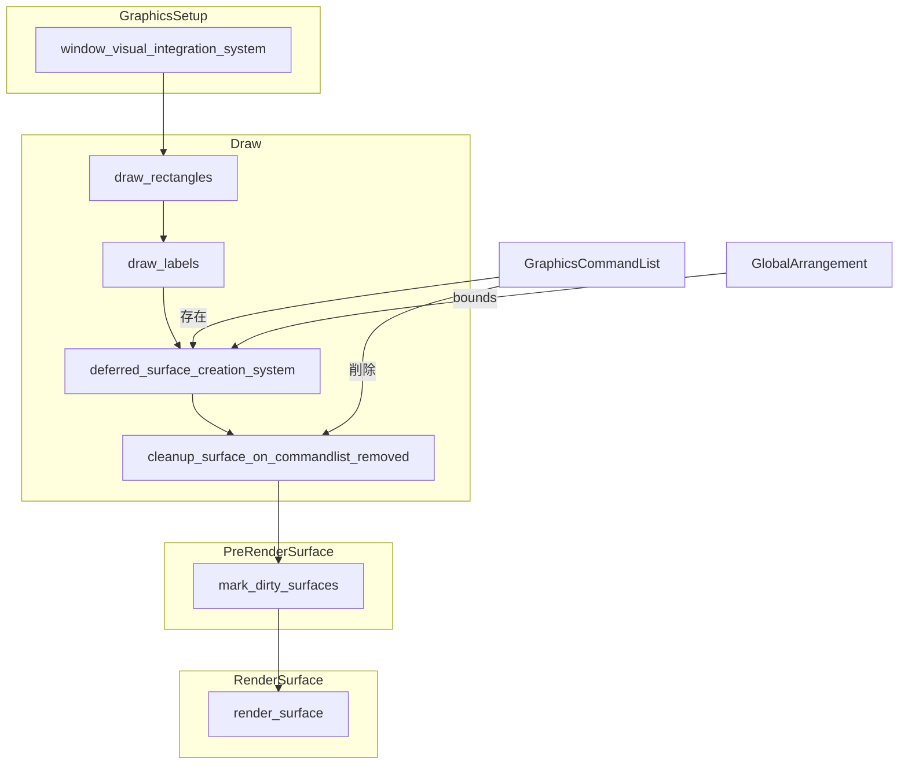
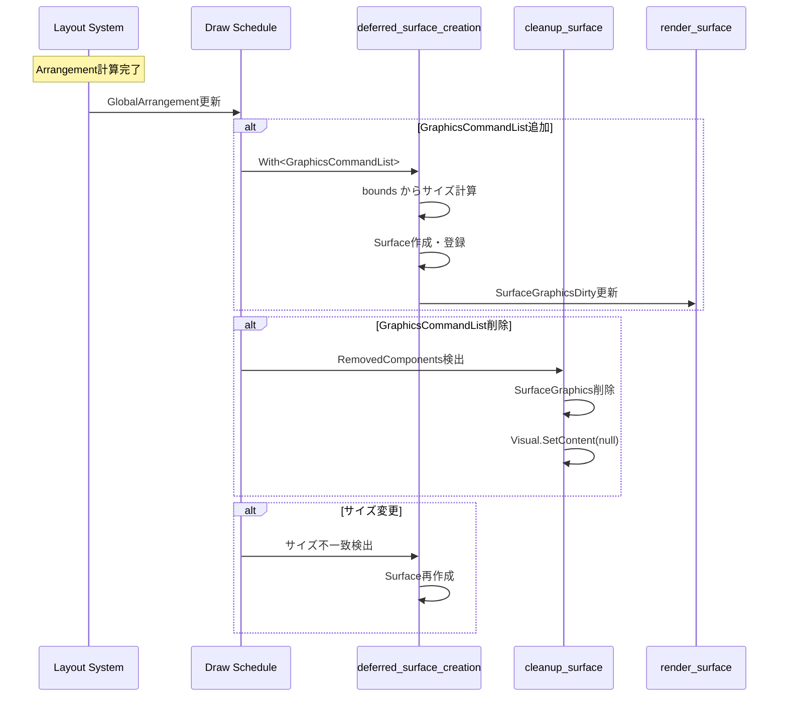

# Design Document: surface-allocation-optimization

## Overview

**Purpose**: Surface生成ロジックの最適化により、GPUリソース（VRAM）の効率的な利用と正確な描画を実現する。

**Users**: wintfライブラリを使用するアプリケーション開発者が、レイアウトコンテナ（FlexContainerなど）を含む複雑なUI階層を構築する際に、不要なSurface生成によるメモリ消費を削減できる。

**Impact**: 現在の二重経路（`sync_surface_from_arrangement` + `deferred_surface_creation_system`）を一本化し、`GraphicsCommandList`の存在に基づく条件付きSurface生成に変更。DPIスケール対応も同時に実施。

### Goals
- GraphicsCommandListを持たないエンティティへのSurface作成をスキップ
- Surface生成システムの一本化（`deferred_surface_creation_system`のみ）
- 物理ピクセルサイズでのSurface作成（DPIスケール対応）
- 診断ログの強化

### Non-Goals
- Visual階層管理の変更（現状維持）
- 描画コマンド自体の最適化
- 新しいウィジェットタイプの追加

## Architecture

### Existing Architecture Analysis

**現在のアーキテクチャパターン**:
- ECSアーキテクチャ（bevy_ecs）でコンポーネント管理
- スケジュールベースのシステム実行（GraphicsSetup → Draw → PreRenderSurface → RenderSurface）
- `Changed<T>`パターンによる変更検出（marker-component-to-changed完了済み）

**既存のSurface生成フロー**:
```
GraphicsSetup:
  sync_surface_from_arrangement  ← Changed<Arrangement>で発火（廃止対象）

Draw:
  deferred_surface_creation_system  ← With<GraphicsCommandList>で発火
```

**維持すべきパターン**:
- `SurfaceGraphicsDirty` + `Changed<T>`による描画トリガー
- `HasGraphicsResources`による初期化状態管理
- `VisualGraphics` / `SurfaceGraphics`の分離

### Architecture Pattern & Boundary Map



**Architecture Integration**:
- **Selected pattern**: 既存ECSパターンの拡張（Option A）
- **Domain boundaries**: Graphics Systems内で完結、Layout Systemsへの変更なし
- **Existing patterns preserved**: `Changed<T>`検出、`RemovedComponents<T>`検出
- **New components rationale**: 新システム`cleanup_surface_on_commandlist_removed`のみ追加
- **Steering compliance**: レイヤー分離（COM → ECS）を維持

### Technology Stack

| Layer | Choice / Version | Role in Feature | Notes |
|-------|------------------|-----------------|-------|
| ECS | bevy_ecs 0.17.2 | コンポーネント管理、システム実行 | `RemovedComponents<T>`使用 |
| Graphics | DirectComposition | Surface作成・管理 | IDCompositionSurface |
| Layout | GlobalArrangement | 物理ピクセルサイズ提供 | `bounds`フィールド |

## System Flows

### Surface Lifecycle Flow



## Requirements Traceability

| Requirement | Summary | Components | Interfaces | Flows |
|-------------|---------|------------|------------|-------|
| 1.1 | CommandList追加時にSurface作成 | deferred_surface_creation_system | - | Surface Lifecycle |
| 1.2 | CommandListなしならスキップ | deferred_surface_creation_system | - | Surface Lifecycle |
| 1.3 | CommandList削除時にSurface解放 | cleanup_surface_on_commandlist_removed | - | Surface Lifecycle |
| 1.4 | 専用クリーンアップシステム | cleanup_surface_on_commandlist_removed | - | - |
| 2.1 | sync_surface_from_arrangement廃止 | world.rs | - | - |
| 2.2 | deferred_surface_creation唯一化 | deferred_surface_creation_system | - | - |
| 2.3 | トリガーをCommandList存在のみに | deferred_surface_creation_system | - | - |
| 2.4 | Arrangement変更時スキップ | - (廃止による自動対応) | - | - |
| 3.1 | GlobalArrangement.boundsから計算 | deferred_surface_creation_system | - | - |
| 3.2 | スケール適用後サイズ | deferred_surface_creation_system | - | - |
| 3.3 | サイズ0ならスキップ | deferred_surface_creation_system | - | - |
| 3.4 | サイズ変更時にSurface再作成 | deferred_surface_creation_system | - | Surface Lifecycle |
| 4.1 | BeginDraw/EndDrawサイクル維持 | render_surface (変更なし) | - | - |
| 4.2 | 子Visual階層維持 | visual_hierarchy_sync_system (変更なし) | - | - |
| 4.3 | VisualGraphics独立性維持 | - (設計による保証) | - | - |
| 4.4 | デバイスロスト対応 | 既存パターン踏襲 | - | - |
| 5.1 | スキップ理由ログ | deferred_surface_creation_system | - | - |
| 5.2 | 作成ログ（物理サイズ） | deferred_surface_creation_system | - | - |
| 5.3 | デバッグ統計 | SurfaceCreationStats (新規リソース) | - | - |

## Components and Interfaces

| Component | Domain/Layer | Intent | Req Coverage | Key Dependencies | Contracts |
|-----------|--------------|--------|--------------|------------------|-----------|
| deferred_surface_creation_system | Graphics | GraphicsCommandList存在時のSurface作成 | 1.1, 1.2, 2.2, 2.3, 3.1-3.4, 5.1, 5.2 | GraphicsCore (P0), GlobalArrangement (P0) | Service |
| cleanup_surface_on_commandlist_removed | Graphics | GraphicsCommandList削除時のSurface解放 | 1.3, 1.4 | RemovedComponents (P0) | Service |
| SurfaceCreationStats | Graphics | デバッグ統計リソース | 5.3 | - | State |

### Graphics Systems

#### deferred_surface_creation_system（改修）

| Field | Detail |
|-------|--------|
| Intent | GraphicsCommandList存在時のみSurfaceを作成し、GlobalArrangement.boundsから物理ピクセルサイズを取得 |
| Requirements | 1.1, 1.2, 2.2, 2.3, 3.1, 3.2, 3.3, 3.4, 5.1, 5.2 |

**Responsibilities & Constraints**
- GraphicsCommandListを持ち、SurfaceGraphicsを持たないEntityにSurfaceを作成
- GlobalArrangement.boundsから物理ピクセルサイズを計算
- サイズ0の場合はスキップ
- 既存SurfaceGraphicsのサイズ不一致時は再作成

**Dependencies**
- Inbound: なし
- Outbound: GraphicsCore — Surface作成 (P0)
- Outbound: GlobalArrangement — サイズ取得 (P0)
- Outbound: SurfaceGraphicsDirty — 描画トリガー (P1)

**Contracts**: Service [x]

##### Service Interface
```rust
pub fn deferred_surface_creation_system(
    mut commands: Commands,
    graphics: Res<GraphicsCore>,
    // 変更点: GlobalArrangementを追加、Arrangementを削除
    query: Query<
        (
            Entity,
            &VisualGraphics,
            &GraphicsCommandList,
            &GlobalArrangement,  // ← Arrangementから変更
            Option<&SurfaceGraphics>,
            Option<&Name>,
        ),
        // 条件: CommandList存在 AND (Surfaceなし OR サイズ変更)
        Or<(Without<SurfaceGraphics>, Changed<GlobalArrangement>)>,
    >,
    mut stats: ResMut<SurfaceCreationStats>,
)
```

- Preconditions: GraphicsCoreが有効、GlobalArrangementが存在
- Postconditions: 条件を満たすEntityにSurfaceGraphicsが作成される
- Invariants: SurfaceGraphicsとVisualGraphicsは1:1（最大）

**Implementation Notes**
- Integration: `world.rs`のDrawスケジュールで`draw_labels`の後に実行
- Validation: サイズ計算時に`bounds`の幅・高さが1以上であることを確認
- Risks: GlobalArrangementが未伝播の場合、サイズ0でスキップされる可能性

#### cleanup_surface_on_commandlist_removed（新規）

| Field | Detail |
|-------|--------|
| Intent | GraphicsCommandList削除時にSurfaceGraphicsを解放 |
| Requirements | 1.3, 1.4 |

**Responsibilities & Constraints**
- RemovedComponents<GraphicsCommandList>を検出
- 対象EntityからSurfaceGraphicsを削除
- VisualGraphicsのSetContent(null)を呼び出し

**Dependencies**
- Inbound: RemovedComponents<GraphicsCommandList> — 削除検出 (P0)
- Outbound: Commands — コンポーネント削除 (P0)

**Contracts**: Service [x]

##### Service Interface
```rust
pub fn cleanup_surface_on_commandlist_removed(
    mut commands: Commands,
    removed: RemovedComponents<GraphicsCommandList>,
    query: Query<(Entity, &VisualGraphics, Option<&Name>), With<SurfaceGraphics>>,
    mut stats: ResMut<SurfaceCreationStats>,
)
```

- Preconditions: GraphicsCommandListが削除されたEntityが存在
- Postconditions: 対象EntityからSurfaceGraphicsが削除される
- Invariants: VisualGraphicsは削除されない（Visual階層は維持）

**Implementation Notes**
- Integration: `world.rs`のDrawスケジュールで`deferred_surface_creation_system`の後に実行
- Validation: SurfaceGraphicsが存在する場合のみ処理
- Risks: 削除タイミングによっては描画途中のSurfaceを解放する可能性

#### SurfaceCreationStats（新規リソース）

| Field | Detail |
|-------|--------|
| Intent | デバッグビルド時のSurface生成統計 |
| Requirements | 5.3 |

**Contracts**: State [x]

##### State Management
```rust
#[derive(Resource, Default, Debug)]
pub struct SurfaceCreationStats {
    pub created_count: u64,
    pub skipped_count: u64,
    pub deleted_count: u64,
    pub resize_count: u64,
}
```

- State model: 累積カウンター
- Persistence: なし（実行時のみ）
- Concurrency: シングルスレッド（ECS World内）

## Data Models

### Domain Model

**変更なし** - 既存のコンポーネント（SurfaceGraphics, GraphicsCommandList, GlobalArrangement）を使用。

### Logical Data Model

**SurfaceGraphicsの作成条件**:
```
Surface作成 = GraphicsCommandList存在 
            AND GlobalArrangement.bounds.width > 0 
            AND GlobalArrangement.bounds.height > 0
```

**サイズ計算**:
```
width = ceil(GlobalArrangement.bounds.right - GlobalArrangement.bounds.left)
height = ceil(GlobalArrangement.bounds.bottom - GlobalArrangement.bounds.top)
```

## Error Handling

### Error Strategy
- Surface作成失敗: ログ出力、次フレームで再試行
- サイズ0: スキップ（正常ケース）
- デバイスロスト: 既存の`HasGraphicsResources`パターンで再初期化

### Error Categories and Responses
**System Errors**:
- DirectComposition API失敗 → ログ出力、処理継続
- メモリ不足 → ログ出力、Surface作成スキップ

## Testing Strategy

### Unit Tests
- `SurfaceCreationStats`の初期化・更新
- サイズ計算ロジック（境界ケース: 0, 小数点, 負値）

### Integration Tests
- GraphicsCommandList追加時のSurface作成確認
- GraphicsCommandList削除時のSurface解放確認
- サイズ変更時のSurface再作成確認
- DPIスケール100%/150%/200%での描画確認

### E2E Tests
- `areka.rs`サンプルでの動作確認
- 複数ウィジェット階層での描画確認
