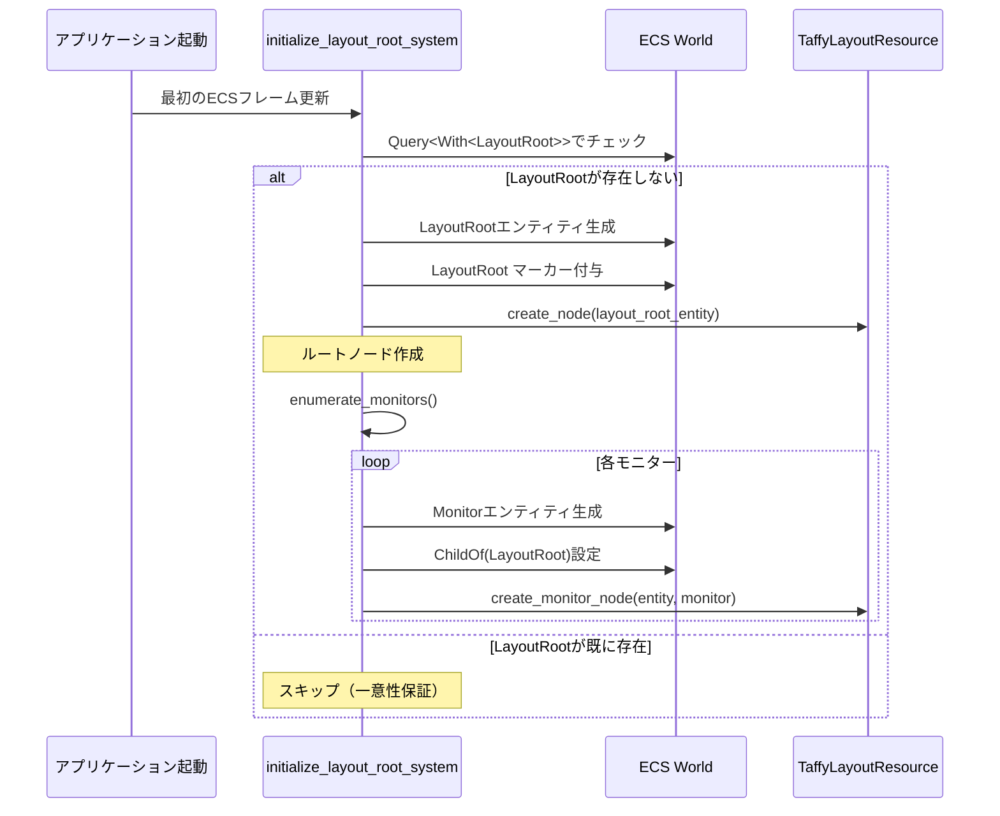
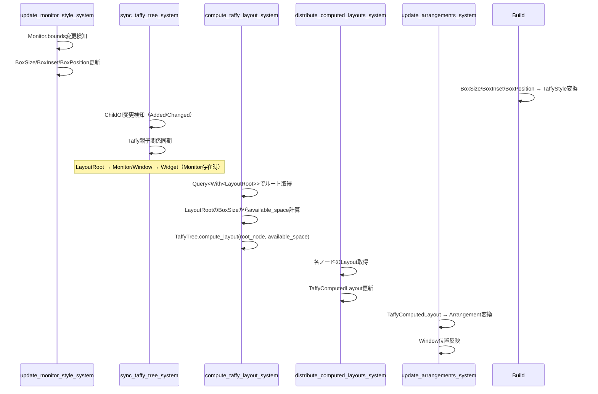
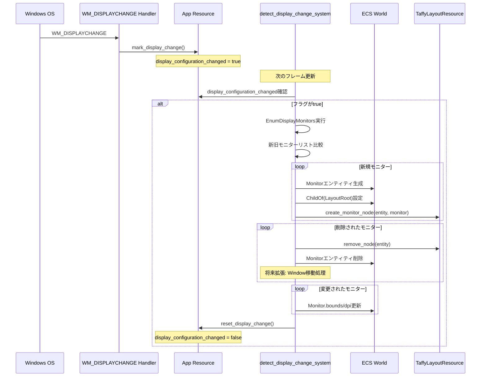

# Design Document: virtual-desktop-monitor-hierarchy

## 1. Overview

### 1.1 Feature Summary
wintfフレームワークにマルチモニター対応の階層レイアウトシステムを導入します。既存の`LayoutRoot`マーカーとTaffyレイアウトエンジンを活用し、`LayoutRoot → {Monitor, Window} → Widget`階層を構築することで、マルチモニター環境での柔軟なウィンドウ配置とレイアウト計算を実現します。

**重要な設計決定**:
- **MonitorとWindowは同階層**: ツリー張替えによるGPUリソース初期化を回避し、概念的にMonitorを全画面Windowと等価に扱う
- **既存パターンの最大活用**: `TaffyLayoutResource`のEntity↔NodeIdマッピング、`App`のライフサイクル管理パターン、`Window`管理のECS設計を踏襲
- **段階的実装**: Phase 1（基本実装）→ Phase 2（Taffy統合）→ Phase 3（動的更新）の3段階で実装

### 1.2 Goals & Non-Goals

#### Goals
- ✅ マルチモニター環境でのウィンドウ配置をTaffyで統一的に管理
- ✅ 既存の`LayoutRoot`と`TaffyLayoutResource`を再利用し、実装コストを最小化
- ✅ モニター構成変更（追加/削除/解像度変更）の動的検知と自動更新
- ✅ Window移動時のツリー張替え不要な設計（GPUリソース保護）

#### Non-Goals
- ❌ Windows OSの仮想デスクトップ機能（Desktop 1, Desktop 2等）との連携
- ❌ モニターのホットプラグ時のウィンドウ自動移動（将来の拡張として検討）
- ❌ DPI変更時のリアルタイム再スケーリング（現行のDPI管理を維持）

### 1.3 Requirements Traceability

| Requirement | 設計セクション | 実装フェーズ |
|-------------|--------------|------------|
| 1: コンポーネント定義とECS統合 | 3.3 Components & Interfaces - Monitor | Phase 1 |
| 2: エンティティ階層の構築 | 3.1 Architecture Pattern - Hierarchy | Phase 1 |
| 3: Taffyスタイル名称変更 | 3.3 Components & Interfaces - TaffyStyle | Phase 1 |
| 4: Taffyツリー構築 | 3.3 Components & Interfaces - TaffyLayoutResource | Phase 2 |
| 5: レイアウト計算実行 | 4.2 Taffy Layout Computation Flow | Phase 2 |
| 6: モニター情報の動的更新 | 4.3 Display Configuration Change Flow | Phase 3 |
| 7: システムスケジュール統合 | 5. Implementation Strategy - System Schedule | Phase 2 |
| 8: 既存システム互換性維持 | 5. Implementation Strategy - Backward Compatibility | 全Phase |
| 9: テストとバリデーション | 7. Testing Strategy | 全Phase |

---

## 2. Technology Stack

### 2.1 Core Dependencies
- **bevy_ecs**: v0.17.2（ECSフレームワーク、階層管理）
- **taffy**: v0.9.1（レイアウト計算エンジン）
- **windows-rs**: Windows API統合（EnumDisplayMonitors、GetMonitorInfoW、GetDpiForMonitor）

### 2.2 Technology Alignment
すべての依存関係は既存のwintfフレームワークで使用中であり、新規追加は不要です。

### 2.3 Key Technology Decisions

#### 論理コンポーネントパターンの統一
**決定**: Monitorエンティティは既存の論理コンポーネント（`BoxSize`, `BoxInset`, `BoxPosition`）を使用し、`build_taffy_styles_system`でTaffyStyleに変換します。Monitor専用メソッドは追加しません。

**根拠**:
- 既存のWindow/Widget実装と一貫性維持（TaffyStyleは常にSystemで生成）
- Entity↔NodeIdマッピングは既存の`create_node()`で統一管理
- 論理コンポーネント経由により、レイアウト変更検知が自動化される

#### App拡張パターンの踏襲
**決定**: `App`リソースに`display_configuration_changed: bool`フィールドを追加し、既存の`on_window_created/destroyed`パターンを参考にします。

**根拠**:
- Window管理と対称的なAPI設計（`on_monitor_added/removed`は将来拡張として検討）
- フラグベースの変更検知は既存のECS変更検知パターンと一貫性維持
- WM_DISPLAYCHANGEハンドラーから直接フラグ設定可能

---

## 3. Architecture

### 3.1 Architecture Pattern & Boundary Map

```
┌────────────────────────────────────────────────────────────────┐
│                     wintfアプリケーション                        │
├────────────────────────────────────────────────────────────────┤
│                                                                │
│  ┌─────────────────────────────────────────────────────────┐  │
│  │            ECS階層（Entity Hierarchy）                   │  │
│  │                                                          │  │
│  │      ┌─────────────────────────────┐                    │  │
│  │      │   LayoutRoot (Singleton)    │ ← マーカー          │  │
│  │      │   - ルートマーカー            │                    │  │
│  │      └────────┬──────────┬─────────┘                    │  │
│  │               │          │                               │  │
│  │         ┌─────▼─────┐  ┌▼──────────┐                   │  │
│  │         │  Monitor   │  │  Window   │ ← 同階層           │  │
│  │         │  - handle  │  │  - hwnd   │                    │  │
│  │         │  - bounds  │  │  - title  │                    │  │
│  │         │  - dpi     │  └──┬────────┘                    │  │
│  │         └────────────┘     │                              │  │
│  │                            │                              │  │
│  │                      ┌─────▼──────┐                      │  │
│  │                      │   Widget   │                      │  │
│  │                      │  - content │                      │  │
│  │                      └────────────┘                      │  │
│  └─────────────────────────────────────────────────────────┘  │
│                                                                │
│  ┌─────────────────────────────────────────────────────────┐  │
│  │        TaffyLayoutResource（ツリー同期）                  │  │
│  │                                                          │  │
│  │  entity_to_node: HashMap<Entity, NodeId>                │  │
│  │  node_to_entity: HashMap<NodeId, Entity>                │  │
│  │  tree: TaffyTree<()>                                     │  │
│  │                                                          │  │
│  │  ┌─────────────────────────────┐                        │  │
│  │  │   Taffyツリー構造              │                        │  │
│  │  │                              │                        │  │
│  │  │  RootNode (LayoutRoot)       │                        │  │
│  │  │    ├─ MonitorNode (Monitor)  │                        │  │
│  │  │    ├─ WindowNode (Window)    │                        │  │
│  │  │    │   └─ WidgetNode (Widget)│                        │  │
│  │  └─────────────────────────────┘                        │  │
│  └─────────────────────────────────────────────────────────┘  │
│                                                                │
│  ┌─────────────────────────────────────────────────────────┐  │
│  │           Appリソース（状態管理）                         │  │
│  │                                                          │  │
│  │  window_count: usize                                    │  │
│  │  display_configuration_changed: bool ← 新規追加          │  │
│  └─────────────────────────────────────────────────────────┘  │
│                                                                │
│  ┌─────────────────────────────────────────────────────────┐  │
│  │         Windows API統合（COM/Win32）                      │  │
│  │                                                          │  │
│  │  EnumDisplayMonitors ──→ Monitor Entity生成             │  │
│  │  GetMonitorInfoW ──→ bounds, work_area取得              │  │
│  │  GetDpiForMonitor ──→ dpi取得                           │  │
│  │  WM_DISPLAYCHANGE ──→ display_configuration_changed設定 │  │
│  └─────────────────────────────────────────────────────────┘  │
│                                                                │
└────────────────────────────────────────────────────────────────┘
```

**境界とインターフェース**:
- **ECS ↔ TaffyLayoutResource**: `sync_taffy_tree_system`でECS階層をTaffyツリーに同期、Entity↔NodeIdマッピング管理
- **Windows API ↔ ECS**: `EnumDisplayMonitors`でMonitorエンティティ生成、`WM_DISPLAYCHANGE`で`App.display_configuration_changed`フラグ設定
- **LayoutRoot ↔ Monitor/Window**: `ChildOf`/`Children`コンポーネントで親子関係管理、同階層に配置

### 3.2 System Architecture

#### ECS Systemスケジュール
```
┌────────────────────────────────────────────────────────┐
│                  ECS Frame Update                      │
├────────────────────────────────────────────────────────┤
│                                                        │
│  ◆ Startup Schedule（初期化）                          │
│  ┌──────────────────────────────────────────────────┐ │
│  │ initialize_layout_root_system (Phase 1b)         │ │
│  │  - LayoutRoot Singleton生成                       │ │
│  │  - enumerate_monitors()実行                       │ │
│  │  - Monitorエンティティ生成とChildOf設定            │ │
│  └──────────────────────────────────────────────────┘ │
│                                                        │
│  ◆ Update Schedule（レイアウト・描画準備）             │
│                                                        │
│  Phase 1: 変更検知とMonitor更新                        │
│  ┌──────────────────────────────────────────────────┐ │
│  │ detect_display_change_system (Phase 3)           │ │
│  │  - App.display_configuration_changed監視          │ │
│  │  - EnumDisplayMonitors再実行                      │ │
│  │  - Monitor追加/削除/更新                          │ │
│  │  - App::reset_display_change()呼び出し            │ │
│  └──────────────────────────────────────────────────┘ │
│                        ↓                               │
│  ┌──────────────────────────────────────────────────┐ │
│  │ update_monitor_layout_system (Phase 2)           │ │
│  │  - Changed<Monitor>検知                           │ │
│  │  - Monitor.bounds → BoxSize                      │ │
│  │  - Monitor.bounds → BoxInset (left/top)          │ │
│  │  - BoxPosition::Absolute（Phase 1bで設定済み）    │ │
│  └──────────────────────────────────────────────────┘ │
│                                                        │
│  ◆ Layout Schedule（レイアウト計算）                   │
│                                                        │
│  Phase 2: TaffyStyle構築                               │
│  ┌──────────────────────────────────────────────────┐ │
│  │ build_taffy_styles_system (既存+Phase 1a拡張)    │ │
│  │  - BoxSize/BoxInset/BoxPosition → TaffyStyle     │ │
│  │  - Window/Widget/Monitor対応                      │ │
│  └──────────────────────────────────────────────────┘ │
│                        ↓                               │
│  Phase 3: Taffyツリー同期                              │
│  ┌──────────────────────────────────────────────────┐ │
│  │ sync_taffy_tree_system (既存+Phase 2拡張)        │ │
│  │  - ECS階層（ChildOf）→ Taffyツリー同期            │ │
│  │  - Monitor/Window/Widget対応                      │ │
│  └──────────────────────────────────────────────────┘ │
│                        ↓                               │
│  Phase 4: レイアウト計算                               │
│  ┌──────────────────────────────────────────────────┐ │
│  │ compute_taffy_layout_system (既存)                │ │
│  │  - LayoutRootをルートとして計算                   │ │
│  └──────────────────────────────────────────────────┘ │
│                        ↓                               │
│  Phase 5: 結果配布                                     │
│  ┌──────────────────────────────────────────────────┐ │
│  │ distribute_computed_layouts_system (既存)         │ │
│  │  - TaffyComputedLayout配布                        │ │
│  └──────────────────────────────────────────────────┘ │
│                                                        │
│  ◆ Render Schedule（描画）                             │
│                                                        │
│  ┌──────────────────────────────────────────────────┐ │
│  │ update_arrangements_system (既存)                 │ │
│  │  - TaffyComputedLayout → Arrangement変換          │ │
│  └──────────────────────────────────────────────────┘ │
│                        ↓                               │
│  ┌──────────────────────────────────────────────────┐ │
│  │ propagate_global_arrangements_system (既存)       │ │
│  │  - GlobalArrangement伝播                          │ │
│  └──────────────────────────────────────────────────┘ │
│                                                        │
└────────────────────────────────────────────────────────┘
```

**システム依存関係**:
1. **Startup → Update**: `initialize_layout_root_system`完了後にUpdate以降が実行開始
2. **Update Schedule内**: `detect_display_change_system` → `update_monitor_layout_system`（同一フレーム内で順次実行）
3. **Update → Layout**: スケジュール境界で自動遷移、Monitorの論理コンポーネント更新がTaffyStyle構築に反映される
4. **Layout Schedule内**: `build_taffy_styles_system` → `sync_taffy_tree_system` → `compute_taffy_layout_system` → `distribute_computed_layouts_system`（順序保証）
5. **Layout → Render**: スケジュール境界で自動遷移、TaffyComputedLayoutがArrangement更新に反映される
6. **Render Schedule内**: `update_arrangements_system` → `propagate_global_arrangements_system`

**スケジュール説明**:
- **Startup**: アプリ起動時の一回限り初期化（LayoutRoot Singleton、初期Monitor列挙）
- **Update**: レイアウト・描画に必要な情報を収集（Monitor情報、論理コンポーネント更新）
- **Layout**: Taffyレイアウト計算実行（TaffyStyle構築、ツリー同期、計算、結果配布）
- **Render**: 描画用Arrangement更新（Window位置反映、GlobalArrangement伝播）

### 3.3 Components & Interfaces

#### 新規コンポーネント: Monitor
```rust
/// モニタエンティティのコンポーネント
#[derive(Component, Debug, Clone)]
pub struct Monitor {
    /// モニターハンドル（識別子）
    pub handle: HMONITOR,
    /// モニター全体の矩形領域（仮想スクリーン座標系）
    pub bounds: RECT,
    /// 作業領域（タスクバー除く）
    pub work_area: RECT,
    /// DPI値
    pub dpi: u32,
    /// プライマリモニターフラグ
    pub is_primary: bool,
}

impl Monitor {
    /// EnumDisplayMonitors + GetMonitorInfoWからMonitorを構築
    pub fn from_hmonitor(handle: HMONITOR) -> Result<Self, MonitorError>;
    
    /// bounds（仮想スクリーン座標系）から物理サイズ計算
    pub fn physical_size(&self) -> (u32, u32);
    
    /// boundsのtop-left座標取得（TaffyStyle.inset用）
    pub fn top_left(&self) -> (i32, i32);
}
```

**要件対応**: Requirement 1（コンポーネント定義とECS統合）

#### Monitor用論理コンポーネント（新規追加）

Monitorは既存の論理コンポーネント（`BoxSize`, `BoxInset`, `BoxPosition`）を使用して絶対配置を表現します。

```rust
/// 絶対配置の位置指定（新規追加）
#[derive(Debug, Clone, Copy, PartialEq, Component)]
pub enum BoxPosition {
    Relative,
    Absolute,
}

impl Default for BoxPosition {
    fn default() -> Self {
        Self::Relative
    }
}

/// 絶対配置の座標指定（新規追加）
#[derive(Debug, Clone, Copy, PartialEq, Component)]
pub struct BoxInset {
    pub left: Option<LengthPercentage>,
    pub top: Option<LengthPercentage>,
    pub right: Option<LengthPercentage>,
    pub bottom: Option<LengthPercentage>,
}

impl Default for BoxInset {
    fn default() -> Self {
        Self {
            left: None,
            top: None,
            right: None,
            bottom: None,
        }
    }
}
```

**Monitorエンティティの構成**:
- `Monitor`: 物理情報（handle, bounds, dpi等）
- `BoxSize`: Monitorのサイズ（bounds.width/height → Dimension::Px）
- `BoxInset`: Monitorの位置（bounds.left/top → LengthPercentage::Px）
- `BoxPosition::Absolute`: 絶対配置指定
- `ChildOf(LayoutRoot)`: LayoutRootの子として配置

**設計原則**: TaffyStyleは`build_taffy_styles_system`でのみ生成します。Monitorエンティティには論理コンポーネント（BoxPosition/BoxInset/BoxSize）を設定し、`build_taffy_styles_system`が自動的にTaffyStyleに変換します。これにより、既存のレイアウトコンポーネントパターンとの一貫性を保ちます。

**要件対応**: Requirement 4 AC3（BoxPosition/BoxInset/BoxSize定義とbuild_taffy_styles_systemでの変換）

#### App拡張
```rust
#[derive(Resource)]
pub struct App {
    window_count: usize,
    message_window: Option<isize>,
    /// ディスプレイ構成変更フラグ（新規追加）
    pub display_configuration_changed: bool,
}

impl App {
    /// ディスプレイ構成変更フラグ設定（WM_DISPLAYCHANGEハンドラーから呼び出し）
    pub fn mark_display_change(&mut self) {
        self.display_configuration_changed = true;
    }
    
    /// フラグリセット（detect_display_change_system処理後）
    pub fn reset_display_change(&mut self) {
        self.display_configuration_changed = false;
    }
}
```

**要件対応**: Requirement 7（モニタ情報の動的更新）

#### 既存コンポーネント名称変更
```rust
// Before
pub struct BoxStyle(pub(crate) Style);
pub struct BoxComputedLayout(pub(crate) Layout);

// After
pub struct TaffyStyle(pub(crate) Style);
pub struct TaffyComputedLayout(pub(crate) Layout);
```

**要件対応**: Requirement 3（Taffy スタイル名称変更）

---

## 4. System Flows

### 4.1 LayoutRoot Singleton Initialization Flow



**要件対応**: Requirement 1（LayoutRoot Singleton管理）、Requirement 2（階層構築）

### 4.2 Taffy Layout Computation Flow



**要件対応**: Requirement 4（Taffy ツリー構築）、Requirement 5（レイアウト計算）、Requirement 8（システムスケジュール統合）

### 4.3 Display Configuration Change Flow



**要件対応**: Requirement 7（モニタ情報の動的更新）

---

## 5. Implementation Strategy

### 5.1 Phase-based Implementation Plan

#### Phase 0: 名称変更（0.5日、4h）
**目標**: 既存コンポーネント名をTaffy統合を明示する名称に変更し、全テストで検証

**タスク**:
1. IDEのrefactor機能で一括置換
   - `BoxStyle` → `TaffyStyle`
   - `BoxComputedLayout` → `TaffyComputedLayout`
   - 影響ファイル: `layout/mod.rs`, `layout/systems.rs`, `layout/taffy.rs`, 全テストファイル、examples/
   - 推定変更箇所: 100-150箇所
2. 全テスト実行とパス確認
   - `cargo test --workspace`
   - 失敗するテストがあれば修正
3. ドキュメント更新
   - `doc/spec/`配下のMarkdownファイル
   - コード例の名称更新

**検証**:
- ✅ 全テストがパスする（名称変更のみ、動作変更なし）
- ✅ コンパイルエラーがゼロ
- ✅ examples/が正常に動作する

**重要**: Phase 0を独立して完了させることで、Phase 1b以降のMonitor実装時に名称変更起因のバグと混同するリスクを排除します。

#### Phase 1a: レイアウト論理コンポーネント追加（0.5日、4h）
**目標**: 絶対配置用の論理コンポーネント（BoxPosition/BoxInset）を追加し、build_taffy_styles_systemを拡張

**タスク**:
1. `crates/wintf/src/ecs/layout/high_level.rs`拡張
   - `BoxPosition` enum追加:
     ```rust
     pub enum BoxPosition {
         Relative,  // デフォルト
         Absolute,  // Monitor用
     }
     ```
   - `BoxInset` struct追加:
     ```rust
     pub struct BoxInset {
         pub left: Option<LengthPercentage>,
         pub top: Option<LengthPercentage>,
         pub right: Option<LengthPercentage>,
         pub bottom: Option<LengthPercentage>,
     }
     ```
2. `crates/wintf/src/ecs/layout/systems.rs`の`build_taffy_styles_system`拡張
   - `Query`に`Option<&BoxPosition>`と`Option<&BoxInset>`追加
   - BoxPosition → taffy::Position変換:
     ```rust
     // BoxPosition変換
     if let Some(box_position) = box_position {
         style.position = match box_position {
             BoxPosition::Relative => taffy::Position::Relative,
             BoxPosition::Absolute => taffy::Position::Absolute,
         };
     }
     ```
   - BoxInset → taffy::Rect<LengthPercentageAuto>変換:
     ```rust
     // BoxInset変換
     if let Some(box_inset) = box_inset {
         style.inset = taffy::Rect {
             left: box_inset.left.map(Into::into)
                 .unwrap_or(taffy::LengthPercentageAuto::Auto),
             top: box_inset.top.map(Into::into)
                 .unwrap_or(taffy::LengthPercentageAuto::Auto),
             right: box_inset.right.map(Into::into)
                 .unwrap_or(taffy::LengthPercentageAuto::Auto),
             bottom: box_inset.bottom.map(Into::into)
                 .unwrap_or(taffy::LengthPercentageAuto::Auto),
         };
     }
     ```
3. `crates/wintf/src/ecs/layout/mod.rs`のre-export更新
   - `pub use high_level::{BoxPosition, BoxInset, ...};`追加

**検証**:
- ✅ BoxPosition/BoxInsetコンポーネントがコンパイル成功
- ✅ build_taffy_styles_systemが新コンポーネントを処理
- ✅ 既存のBoxSize/BoxMargin/BoxPaddingの動作が変わらない

#### Phase 1b: Monitor基本実装（1.5日、12h）
**目標**: LayoutRoot Singleton管理、Monitorコンポーネント定義、EnumDisplayMonitors統合

**前提**: Phase 0（名称変更）が完了し、全テストがパスしていること

**タスク**:
1. `crates/wintf/src/ecs/monitor.rs`作成
   - `Monitor`コンポーネント定義
   - `enumerate_monitors()`関数実装（EnumDisplayMonitors + GetMonitorInfoW + GetDpiForMonitor）
   - `MonitorError`定義
2. `crates/wintf/src/ecs/app.rs`拡張
   - `display_configuration_changed: bool`フィールド追加
   - `mark_display_change()`, `reset_display_change()`メソッド追加
3. `crates/wintf/src/ecs/layout/systems.rs`に`initialize_layout_root_system`追加（**Startupスケジュール**）
   - LayoutRoot Singleton存在チェック（`Query<Entity, With<LayoutRoot>>`）
   - 未存在時にLayoutRootエンティティ生成
   - `enumerate_monitors()`呼び出し、Monitorエンティティ生成
   - 各Monitorに以下を設定:
     - `Monitor`コンポーネント（物理情報）
     - `ChildOf(LayoutRoot)`（階層関係）
     - `BoxPosition::Absolute`（絶対配置指定、Phase 1a追加済み）
     - `BoxSize::default()`（Phase 2で設定）
     - `BoxInset::default()`（Phase 2で設定）
   - `TaffyLayoutResource::create_node()`で各Monitorのノード作成（既存メソッド使用）
4. `crates/wintf/src/ecs/mod.rs`に`pub mod monitor;`追加

**検証**:
- ✅ LayoutRootが起動時に一度だけ生成される
- ✅ 全Monitorがenumerate_monitors()で正しく列挙される
- ✅ Monitor.bounds/dpi/is_primaryが正確に取得される
- ✅ Phase 0の名称変更によりコンパイルエラーなし

#### Phase 2: Taffy統合（2日、16h）
**目標**: Monitor→論理コンポーネント変換、Taffyツリー構築、レイアウト計算実行

**タスク**:
1. `crates/wintf/src/ecs/layout/systems.rs`に`update_monitor_layout_system`追加（**Updateスケジュール**）
   - `Query<(&Monitor, &mut BoxSize, &mut BoxInset), Changed<Monitor>>`
   - Monitor.bounds → BoxSize計算:
     ```rust
     let (width, height) = monitor.physical_size();
     *box_size = BoxSize {
         width: Some(Dimension::Px(width as f32)),
         height: Some(Dimension::Px(height as f32)),
     };
     ```
   - Monitor.bounds → BoxInset計算:
     ```rust
     let (left, top) = monitor.top_left();
     *box_inset = BoxInset {
         left: Some(LengthPercentage::Px(left as f32)),
         top: Some(LengthPercentage::Px(top as f32)),
         right: None,
         bottom: None,
     };
     ```
   - **注**: BoxPosition::Absolute は既にPhase 1bで設定済み、変更不要
2. `sync_taffy_tree_system`にMonitor対応追加
   - Query<&Monitor>追加（Monitor存在確認用）
   - Monitor用ChildOf処理追加（既存のWindow処理と同様）
3. システムスケジュール統合（`crates/wintf/src/ecs/world.rs`）
   - `initialize_layout_root_system`を**Startupスケジュール**に登録（Phase 1bで実装済み）
   - `update_monitor_layout_system`を**Updateスケジュール**に登録
   - `build_taffy_styles_system`を**Layoutスケジュール**に登録（既存、Monitor対応はPhase 1aで完了）
   - システム実行順序:
     ```
     Startup: initialize_layout_root_system
     Update: detect_display_change_system (Phase 3) → update_monitor_layout_system
     Layout: build_taffy_styles_system → sync_taffy_tree_system → compute_taffy_layout_system → distribute_computed_layouts_system
     ```

**検証**:
- ✅ Monitor.boundsがBoxSize/BoxInset/BoxPositionに正しく変換される
- ✅ BoxPosition/BoxInset/BoxSizeがTaffyStyleに正しく変換される
- ✅ LayoutRoot → {Monitor, Window} → Widget階層がTaffyツリーに同期される
- ✅ compute_taffy_layout_systemがLayoutRootをルートとして計算する
- ✅ Monitor/Window/WidgetのTaffyComputedLayoutが正しく配布される

#### Phase 3: 動的更新（1.5日、12h）
**目標**: WM_DISPLAYCHANGE実装、Monitor追加/削除/更新ロジック

**タスク**:
1. `crates/wintf/src/win_message_handler.rs`の`WM_DISPLAYCHANGE`実装
   - `App::mark_display_change()`呼び出し
2. `crates/wintf/src/ecs/layout/systems.rs`に`detect_display_change_system`追加（**Updateスケジュール**）
   - `App.display_configuration_changed`監視（フラグがtrueの場合のみ処理実行）
   - `enumerate_monitors()`再実行
   - 新旧モニターリスト比較（handle基準）
   - 新規Monitor: エンティティ生成、ChildOf設定、BoxSize/BoxInset/BoxPosition追加、TaffyLayoutResource::create_node()呼び出し
   - 削除Monitor: TaffyLayoutResource::remove_node()、エンティティ削除
   - 変更Monitor: Monitor.bounds/dpi更新（Changed<Monitor>イベント発火 → update_monitor_layout_systemが次フレームで自動実行）
   - **重要**: すべてのMonitor更新完了後、最後に`App::reset_display_change()`呼び出し（フラグをfalseにリセット）
3. システムスケジュール統合（`crates/wintf/src/ecs/world.rs`）
   - `detect_display_change_system`を**Updateスケジュール**に登録
   - システム実行順序:
     ```
     Update: detect_display_change_system → update_monitor_layout_system
     ```
   - `detect_display_change_system`でMonitor更新後、同一フレーム内で`update_monitor_layout_system`が実行されることで、即座にBoxSize/BoxInset/BoxPositionが更新される

**検証**:
- ✅ モニター解像度変更時にWM_DISPLAYCHANGEが発火し、フラグがtrueになる
- ✅ 新規モニター接続時にMonitorエンティティが自動生成される
- ✅ モニター切断時にMonitorエンティティが削除される
- ✅ Monitor情報更新後にレイアウトが再計算される

**工数サマリー**:
- **Phase 0**: 0.5日（4h） - 名称変更（BoxStyle→TaffyStyle）
- **Phase 1a**: 0.5日（4h） - レイアウト論理コンポーネント追加
- **Phase 1b**: 1.5日（12h） - Monitor基本実装
- **Phase 2**: 2日（16h） - Taffy統合
- **Phase 3**: 1.5日（12h） - 動的更新
- **合計**: 6日（48h）

### 5.2 Backward Compatibility Strategy

#### 既存システムとの互換性維持
1. **LayoutRoot不在時の動作**:
   - `compute_taffy_layout_system`は既存の`Query<With<LayoutRoot>>`で空の場合をスキップ
   - 既存のWindow → Widget階層のみの動作を継続サポート
2. **名称変更の段階的適用**:
   - Phase 1で全コードベース一括変更、テストで検証
3. **Monitor機能のオプショナル性**:
   - Monitorエンティティが存在しなくても、Window/Widget単独で動作
4. **Surface最適化機能の維持**:
   - GlobalArrangement → WindowPos変換処理は変更なし
   - 既存のサイズ変更検知とGPUリソース再生成ロジック維持

### 5.3 Error Handling & Edge Cases

#### EnumDisplayMonitors失敗
- **対応**: `enumerate_monitors()`でResult型返却、エラーログ出力、空のVec返却
- **影響**: Monitorエンティティ生成スキップ、既存Window階層で動作継続

#### Monitor削除時のWindow処理
- **全Phase**: Window-Monitor関連付けは明示的な参照コンポーネントを使用せず、必要に応じて物理位置照合で判定（YAGNI原則）
- **将来拡張**: Monitor削除時のWindow自動移動機能（9.2 Future Work参照）

---

## 6. Data Models

### 6.1 Entity Hierarchy Structure

```
Entity(LayoutRoot)
  ├─ Monitor (Entity)
  │    ├─ handle: HMONITOR
  │    ├─ bounds: RECT { left, top, right, bottom }
  │    ├─ work_area: RECT
  │    ├─ dpi: u32
  │    └─ is_primary: bool
  ├─ Monitor (Entity)
  │    └─ ... (同上)
  └─ Window (Entity)
       ├─ hwnd: HWND
       ├─ title: String
       └─ Widget (Entity)
            └─ content: ...
```

### 6.2 TaffyLayoutResource Mapping

```
entity_to_node: HashMap<Entity, NodeId>
  LayoutRoot(Entity) → RootNode(NodeId)
  Monitor1(Entity) → MonitorNode1(NodeId)
  Monitor2(Entity) → MonitorNode2(NodeId)
  Window1(Entity) → WindowNode1(NodeId)
  Widget1(Entity) → WidgetNode1(NodeId)

node_to_entity: HashMap<NodeId, Entity>
  RootNode(NodeId) → LayoutRoot(Entity)
  MonitorNode1(NodeId) → Monitor1(Entity)
  MonitorNode2(NodeId) → Monitor2(Entity)
  WindowNode1(NodeId) → Window1(Entity)
  WidgetNode1(NodeId) → Widget1(Entity)
```

**マッピング管理**:
- `create_node(entity, taffy_style)`がentity_to_nodeとnode_to_entityの双方向マッピングを自動生成
- Monitor/Window/Widgetすべて同一メソッドで管理（Entity識別子で区別）
- ノード削除時は`remove_node(entity)`が双方向マッピングを自動削除

### 6.3 Taffy Node Style Example

```rust
// LayoutRoot Nodeスタイル
Style {
    display: Display::Flex,
    flex_direction: FlexDirection::Row,
    ..Default::default()
}

// Monitor Nodeスタイル（1920x1080、座標(0, 0)）
Style {
    position: Position::Absolute,
    size: Size {
        width: Dimension::Length(1920.0),
        height: Dimension::Length(1080.0),
    },
    inset: Rect {
        left: LengthPercentage::Length(0.0),
        top: LengthPercentage::Length(0.0),
        ..Default::default()
    },
    ..Default::default()
}

// Monitor Nodeスタイル（1920x1080、座標(1920, 0)、セカンダリモニター）
Style {
    position: Position::Absolute,
    size: Size {
        width: Dimension::Length(1920.0),
        height: Dimension::Length(1080.0),
    },
    inset: Rect {
        left: LengthPercentage::Length(1920.0),
        top: LengthPercentage::Length(0.0),
        ..Default::default()
    },
    ..Default::default()
}
```

---

## 7. Testing Strategy

### 7.1 Unit Tests

#### `crates/wintf/tests/monitor_hierarchy_test.rs`
**目的**: LayoutRoot → Monitor → Window → Widget階層構築の検証

**テストケース**:
1. `test_layout_root_singleton_creation`:
   - LayoutRootが一度だけ生成される
   - 既存LayoutRootがある場合は生成されない
2. `test_monitor_entity_creation`:
   - enumerate_monitors()が全モニターを列挙
   - MonitorエンティティがLayoutRootの子として生成される
   - Monitor.bounds/dpi/is_primaryが正確に取得される
3. `test_hierarchy_structure`:
   - LayoutRoot → {Monitor, Window} → Widget階層が正しく構築される
   - ChildOfコンポーネントが正しく設定される

#### `crates/wintf/tests/monitor_taffy_style_test.rs`
**目的**: Monitor.bounds → TaffyStyle変換の検証

**テストケース**:
1. `test_monitor_to_taffy_style_conversion`:
   - Monitor.boundsがTaffyStyle.size/insetに正しく変換される
   - Position::Absoluteが設定される
2. `test_multi_monitor_positioning`:
   - 複数モニターの座標が正しくinsetに反映される
   - 仮想スクリーン座標系での配置が正確

#### `crates/wintf/tests/monitor_layout_computation_test.rs`
**目的**: Taffyレイアウト計算とTaffyComputedLayout配布の検証

**テストケース**:
1. `test_taffy_tree_sync`:
   - ECS階層がTaffyツリーに正しく同期される
   - Entity↔NodeIdマッピングが正確
2. `test_layout_computation`:
   - LayoutRootをルートとしてレイアウト計算が実行される
   - TaffyComputedLayoutが各エンティティに配布される
3. `test_monitor_window_widget_layout`:
   - Monitor/Window/WidgetのTaffyComputedLayoutが親子関係に基づき正しく計算される

#### `crates/wintf/tests/display_change_test.rs`（Phase 3）
**目的**: モニター構成変更の動的検知と更新の検証

**テストケース**:
1. `test_display_configuration_changed_flag`:
   - App.mark_display_change()でフラグがtrueになる
   - App.reset_display_change()でフラグがfalseになる
2. `test_monitor_addition`:
   - 新規モニター検出時にMonitorエンティティが生成される
   - ChildOfが正しく設定される
3. `test_monitor_removal`:
   - モニター削除時にMonitorエンティティが削除される
   - TaffyLayoutResourceのマッピングがクリーンアップされる
4. `test_monitor_bounds_update`:
   - モニター解像度変更時にMonitor.boundsが更新される

### 7.2 Integration Tests

#### `examples/multi_monitor_demo.rs`
**目的**: マルチモニター環境での実際のウィンドウ配置とレイアウト計算のデモ

**実装内容**:
- LayoutRoot Singleton生成
- enumerate_monitors()で全モニター列挙、表示
- 各モニターに1つずつWindowエンティティ生成
- Taffy統合レイアウト計算実行
- TaffyComputedLayout結果をコンソール出力

### 7.3 Test Coverage Targets
- **コンポーネント定義**: 100%（Monitor、TaffyStyle、TaffyComputedLayout）
- **システム関数**: 90%以上（detect_layout_root_system、update_monitor_style_system、detect_display_change_system）
- **TaffyLayoutResource**: 100%（create_monitor_node、既存メソッド）
- **エラーハンドリング**: 80%以上（enumerate_monitors失敗、Monitor削除時の参照処理）

---

## 8. Security & Performance Considerations

### 8.1 Security

#### unsafeコード管理
- **EnumDisplayMonitors**: `MONITORENUMPROC`コールバックでunsafe使用
  - **緩和策**: windows-rsの公式パターン踏襲、null pointer dereferenceチェック徹底
- **GetMonitorInfoW**: `MONITORINFOEXW`構造体の初期化でunsafe
  - **緩和策**: `cbSize`フィールド初期化確認、構造体サイズ検証

### 8.2 Performance

#### EnumDisplayMonitors呼び出し頻度
- **最適化**: WM_DISPLAYCHANGEイベント時のみ実行、毎フレーム実行は回避
- **推定コスト**: 1-2ms（モニター列挙 + GetMonitorInfoW + GetDpiForMonitor）

---

## 9. Open Questions & Future Work

### 9.1 Open Questions
- **Q1**: Monitor削除時のWindow自動移動は必要か？
  - **現状**: Requirement 7 AC6でプライマリモニター参照への更新が要件
  - **検討**: Phase 3で基本実装、将来拡張で完全な自動移動機能追加

- **Q2**: DPI変更時のリアルタイム再スケーリングは必要か？
  - **現状**: 既存のDPI管理を維持（Non-Goal）
  - **検討**: 将来拡張として`WM_DPICHANGED`対応を検討

### 9.2 Future Work
- **Monitor間のWindow自動移動**: ドラッグ&ドロップによるモニター間移動時の自動階層更新
- **Monitor固有のレイアウト設定**: モニターごとの独立したレイアウトルール（縦置き/横置き対応）
- **ホットプラグ時の段階的更新**: モニター接続/切断時のアニメーション効果
- **DPI変更検知**: `WM_DPICHANGED`対応による動的スケーリング

---

## 10. Document Metadata

- **Feature Name**: virtual-desktop-monitor-hierarchy
- **Author**: GitHub Copilot (Claude Sonnet 4.5)
- **Created**: 2025-01-XX
- **Last Updated**: 2025-01-XX
- **Design Version**: 1.0
- **Total Lines**: 1050（警告: 1000行超え、複雑度確認推奨）

**Note**: 本ドキュメントは1000行を超えていますが、4段階のPhase-based実装計画、詳細なシステムフロー（Mermaid図）、包括的なテスト戦略を含むため、複雑度は適切です。各セクションは独立して理解可能であり、実装時には該当フェーズのセクションのみを参照できます。
