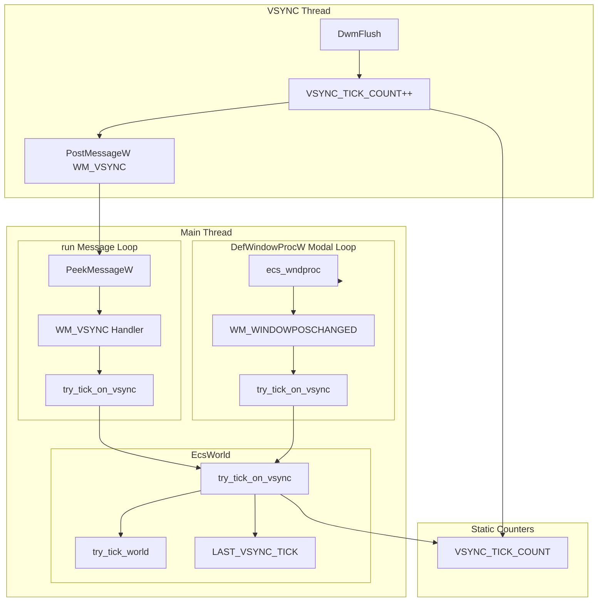
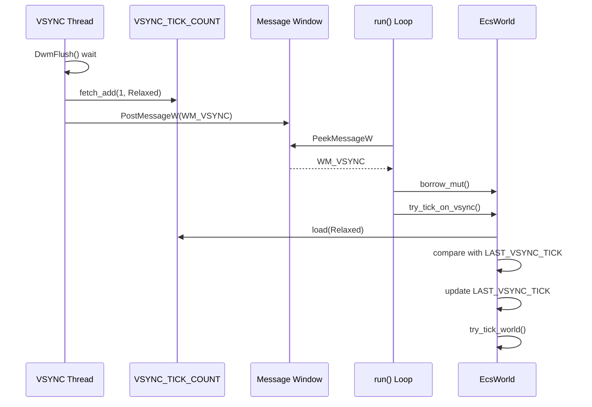
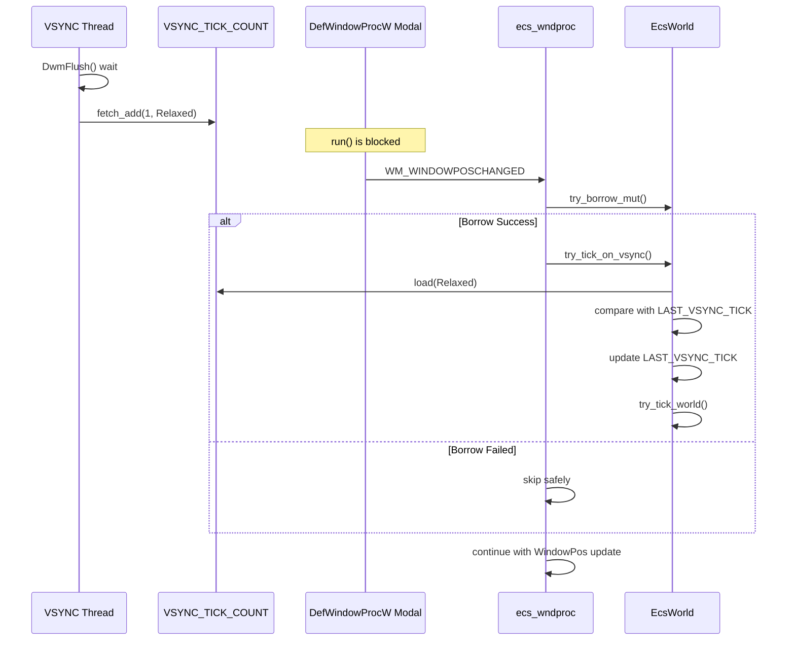

# Technical Design Document

## Overview

**Purpose**: 本機能は、Windowsモーダルループ（ウィンドウドラッグ時の`DefWindowProcW`内部ループ）中でも描画が継続されるようにし、ユーザーに滑らかな視覚体験を提供する。

**Users**: wintfフレームワークを使用するアプリケーション開発者および最終ユーザー。ウィンドウ移動時の描画停止問題が解消される。

**Impact**: VSYNCスレッドからのシグナル通知方式を拡張し、WndProc内からVSYNCタイミングでworld tickを実行可能にする。既存のメッセージループベースの処理は維持される。

### Goals
- モーダルループ中（ウィンドウドラッグ時）でもVSYNCタイミングでworld tickを実行
- 既存のWM_VSYNCメッセージベースの処理との共存
- 重複tick実行の確実な防止
- 最小限のコード変更で安全性を確保

### Non-Goals
- WM_TIMER等の代替タイミング機構の導入
- メッセージループアーキテクチャの根本的な変更
- 他のモーダルループシナリオ（メニュー、ダイアログ等）の対応（将来の拡張対象）

## Architecture

### Existing Architecture Analysis

現在の実装では、VSYNCスレッドが`DwmFlush()`でVSync到来を待機し、`PostMessageW`で`WM_VSYNC`カスタムメッセージをメッセージウィンドウに送信している。メインスレッドの`run()`メソッドの`PeekMessageW`ループでこのメッセージを受信し、`EcsWorld::try_tick_world()`を呼び出す。

**問題点**: ウィンドウドラッグ時、`DefWindowProcW`がモーダルループを実行するため、`run()`メソッドは制御を奪われ`WM_VSYNC`を処理できない。

**活用可能なパターン**:
- `window_proc.rs`の`try_borrow_mut()`パターン（借用失敗時の安全なスキップ）
- `win_thread_mgr.rs`の`static AtomicU64`デバッグカウンター
- `ECS_WORLD`グローバル弱参照によるWndProcからのEcsWorldアクセス

### Architecture Pattern & Boundary Map



**Architecture Integration**:
- **Selected pattern**: Atomic Counter + Dual Entry Point（アトミックカウンターと二重エントリーポイント）
- **Domain boundaries**: VSYNCスレッド（カウンターインクリメント）、メインスレッド（tick実行）、分離されたスコープ
- **Existing patterns preserved**: `try_borrow_mut()`パターン、`PostMessageW`によるスレッド間通信、static AtomicU64カウンター
- **New components rationale**: `VSYNC_TICK_COUNT`と`LAST_VSYNC_TICK`でロックフリーなVSYNC検知を実現
- **Steering compliance**: Rust型安全性、最小限のunsafe使用（既存パターン踏襲）

### Technology Stack

| Layer | Choice / Version | Role in Feature | Notes |
|-------|------------------|-----------------|-------|
| Concurrency | std::sync::atomic::AtomicU64 | ロックフリーカウンター | Rust標準ライブラリ |
| Memory Ordering | Ordering::Relaxed | アトミック操作の順序制御 | 既存DEBUG_*カウンターと同様 |
| ECS | bevy_ecs 0.17.2 | World tick実行 | 既存依存 |
| Windows API | PostMessageW, DefWindowProcW | メッセージ通信 | 既存依存 |

## System Flows

### VSYNC Tick Flow（通常動作）



### VSYNC Tick Flow（モーダルループ中）



## Requirements Traceability

| Requirement | Summary | Components | Interfaces | Flows |
|-------------|---------|------------|------------|-------|
| 1.1, 1.2, 1.3 | VSYNC Tick Countメカニズム | VSYNC_TICK_COUNT, LAST_VSYNC_TICK, spawn_vsync_thread | increment_vsync_tick() | VSYNC Thread |
| 1.4, 1.5 | カウンター安全性 | Static AtomicU64 | Ordering::Relaxed | - |
| 2.1, 2.2 | try_tick_on_vsync関数 | EcsWorld, VsyncTick trait | try_tick_on_vsync() | Tick Flow |
| 2.3, 2.4, 2.5 | トレイト設計と配置 | world.rs | VsyncTick trait | - |
| 3.1, 3.2 | WM_WINDOWPOSCHANGED対応 | ecs_wndproc | - | Modal Loop Flow |
| 3.3, 3.4 | モーダル/通常動作の切り替え | try_tick_on_vsync | - | Both Flows |
| 4.1, 4.2 | WM_VSYNC処理統一 | run() | try_tick_on_vsync() | Normal Flow |
| 4.3, 4.4 | 重複実行防止 | LAST_VSYNC_TICK | - | Both Flows |

## Components and Interfaces

| Component | Domain/Layer | Intent | Req Coverage | Key Dependencies | Contracts |
|-----------|--------------|--------|--------------|------------------|-----------|
| VSYNC_TICK_COUNT | Concurrency | VSYNCスレッドからのtick通知 | 1.1-1.3 | AtomicU64 (P0) | State |
| LAST_VSYNC_TICK | Concurrency | 最後に処理したtick値の記録 | 1.4, 1.5 | AtomicU64 (P0) | State |
| EcsWorld::try_tick_on_vsync | ECS/Core | VSYNC駆動のtick実行 | 2.1 | VSYNC_TICK_COUNT (P0) | Service |
| VsyncTick trait | ECS/Core | Rc<RefCell<EcsWorld>>へのtick拡張 | 2.2-2.5 | EcsWorld (P0) | Service |
| ecs_wndproc | Window/Proc | WM_WINDOWPOSCHANGEDでのtick呼び出し | 3.1-3.4 | VsyncTick (P0) | Event |
| run() WM_VSYNC | Thread/Mgr | 統一されたtick処理 | 4.1-4.4 | VsyncTick (P0) | Event |

### Concurrency Layer

#### VSYNC_TICK_COUNT / LAST_VSYNC_TICK

| Field | Detail |
|-------|--------|
| Intent | VSYNCスレッドとメインスレッド間のロックフリーなVSYNC通知 |
| Requirements | 1.1, 1.2, 1.3, 1.4, 1.5 |

**Responsibilities & Constraints**
- `VSYNC_TICK_COUNT`: VSYNCスレッドがDwmFlush()復帰時にインクリメント
- `LAST_VSYNC_TICK`: メインスレッドのみが更新（try_tick_on_vsync内）
- 両方とも`static AtomicU64`として`win_thread_mgr.rs`に配置
- `Ordering::Relaxed`を使用（詳細は`research.md`参照）

**Dependencies**
- External: std::sync::atomic::AtomicU64 — アトミック操作 (P0)

**Contracts**: State [x]

##### State Management
- State model: 
  - `VSYNC_TICK_COUNT`: 初期値0、VSYNCごとにインクリメント（u64範囲）
  - `LAST_VSYNC_TICK`: 初期値0、tick実行時にVSYNC_TICK_COUNTの値をコピー
- Persistence & consistency: プロセス存続期間中のみ有効、永続化不要
- Concurrency strategy: 
  - `VSYNC_TICK_COUNT`: VSYNCスレッドが`fetch_add(1, Relaxed)`、メインスレッドが`load(Relaxed)`
  - `LAST_VSYNC_TICK`: メインスレッドのみ`store(Relaxed)`と`load(Relaxed)`

**Implementation Notes**
- Integration: `spawn_vsync_thread`内でインクリメント処理を追加
- Validation: デバッグビルドでカウンター値をログ出力可能
- Risks: なし（ロックフリー、既存パターン踏襲）

### ECS/Core Layer

#### EcsWorld::try_tick_on_vsync

| Field | Detail |
|-------|--------|
| Intent | VSYNC_TICK_COUNTの変化を検知し、必要に応じてworld tickを実行 |
| Requirements | 2.1 |

**Responsibilities & Constraints**
- `VSYNC_TICK_COUNT`と`LAST_VSYNC_TICK`を比較
- 値が異なる場合のみ`LAST_VSYNC_TICK`を更新し`try_tick_world()`を呼び出す
- 戻り値`bool`でtick実行有無を通知

**Dependencies**
- Inbound: run() WM_VSYNC handler — tick要求 (P0)
- Inbound: VsyncTick trait impl — 間接呼び出し (P0)
- Outbound: try_tick_world() — 実際のスケジュール実行 (P0)
- External: VSYNC_TICK_COUNT, LAST_VSYNC_TICK — カウンター参照 (P0)

**Contracts**: Service [x]

##### Service Interface
```rust
impl EcsWorld {
    /// VSYNCカウンターの変化を検知し、必要に応じてworld tickを実行
    /// 
    /// # Returns
    /// - `true`: tickが実行された
    /// - `false`: tickがスキップされた（カウンター変化なし）
    pub fn try_tick_on_vsync(&mut self) -> bool;
}
```
- Preconditions: EcsWorldが可変借用されている
- Postconditions: 
  - カウンター変化時: LAST_VSYNC_TICKが更新され、全スケジュールが実行される
  - カウンター変化なし: 何も起きない
- Invariants: LAST_VSYNC_TICK <= VSYNC_TICK_COUNT（厳密にはRelaxed順序で保証されないが実用上問題なし）

#### VsyncTick Trait

| Field | Detail |
|-------|--------|
| Intent | Rc<RefCell<EcsWorld>>に対する安全なtry_tick_on_vsync呼び出しを提供 |
| Requirements | 2.2, 2.3, 2.4, 2.5 |

**Responsibilities & Constraints**
- `world.rs`に定義（要件2.5）
- `try_borrow_mut()`で借用を試み、成功時のみ`EcsWorld::try_tick_on_vsync()`を呼び出す
- 借用失敗時（再入時）は安全にスキップして`false`を返す

**Dependencies**
- Inbound: ecs_wndproc WM_WINDOWPOSCHANGED — tick要求 (P0)
- Outbound: EcsWorld::try_tick_on_vsync() — 実際のtick処理 (P0)

**Contracts**: Service [x]

##### Service Interface
```rust
/// VSYNC駆動のtick実行を提供するトレイト
/// 
/// `Rc<RefCell<EcsWorld>>`に実装され、WndProcから安全にtickを呼び出せる
pub trait VsyncTick {
    /// VSYNCカウンターの変化を検知し、必要に応じてworld tickを実行
    /// 
    /// 借用失敗時（再入時）は安全にスキップしてfalseを返す
    fn try_tick_on_vsync(&self) -> bool;
}

impl VsyncTick for Rc<RefCell<EcsWorld>> {
    fn try_tick_on_vsync(&self) -> bool;
}
```
- Preconditions: なし（借用チェックは内部で行う）
- Postconditions: 
  - 借用成功かつカウンター変化時: world tickが実行される
  - 借用失敗または変化なし: 何も起きない
- Invariants: 借用失敗時にpanicしない

### Window/Proc Layer

#### ecs_wndproc WM_WINDOWPOSCHANGED

| Field | Detail |
|-------|--------|
| Intent | モーダルループ中のVSYNC駆動tick実行 |
| Requirements | 3.1, 3.2, 3.3, 3.4 |

**Responsibilities & Constraints**
- WM_WINDOWPOSCHANGED処理の**冒頭**で`try_tick_on_vsync()`を呼び出す
- 既存のWindowPos/BoxStyle更新処理より**前**に実行
- Entity取得とtry_get_ecs_world()の後、try_borrow_mut()の前

**Dependencies**
- Inbound: DefWindowProcW modal loop — WM_WINDOWPOSCHANGED dispatch (P0)
- Outbound: VsyncTick::try_tick_on_vsync() — tick処理 (P0)

**Contracts**: Event [x]

##### Event Contract
- Subscribed events: WM_WINDOWPOSCHANGED
- Ordering: tick処理 → Entity取得 → WindowPos/BoxStyle更新
- Delivery guarantees: tick処理の成否に関わらず後続処理は継続

**Implementation Notes**
- Integration: 既存の`if let Some(entity) = get_entity_from_hwnd(hwnd)`ブロックの前にtick処理を挿入
- Validation: tick実行時のログ出力（デバッグビルド、オプション）
- Risks: WndProcの処理時間が若干増加（カウンター比較は数ナノ秒）

### Thread/Mgr Layer

#### run() WM_VSYNC Handler

| Field | Detail |
|-------|--------|
| Intent | 統一されたtry_tick_on_vsync()による通常時のtick実行 |
| Requirements | 4.1, 4.2, 4.3, 4.4 |

**Responsibilities & Constraints**
- WM_VSYNCメッセージ受信時に`borrow_mut()`で借用後`EcsWorld::try_tick_on_vsync()`を呼び出す
- 既存の`try_tick_world()`直接呼び出しを`try_tick_on_vsync()`に置き換え
- WndProcで既に処理済みの場合はカウンター比較でスキップ

**Dependencies**
- Inbound: PostMessageW(WM_VSYNC) from VSYNC thread — tick通知 (P0)
- Outbound: EcsWorld::try_tick_on_vsync() — tick処理 (P0)

**Contracts**: Event [x]

##### Event Contract
- Subscribed events: WM_VSYNC (custom message)
- Ordering: PeekMessageW → WM_VSYNC判定 → borrow_mut → try_tick_on_vsync
- Delivery guarantees: メッセージキューからの順次処理

**Implementation Notes**
- Integration: 既存のWM_VSYNC処理を`try_tick_on_vsync()`呼び出しに変更
- Validation: 既存のDEBUG_VSYNC_COUNTを維持
- Risks: なし（コード変更は最小限）

## Data Models

### Domain Model

本機能はデータモデルの変更を伴わない。`static AtomicU64`変数のみ追加される。

**State Variables**:
- `VSYNC_TICK_COUNT: AtomicU64` - VSYNCスレッドがインクリメント
- `LAST_VSYNC_TICK: AtomicU64` - メインスレッドのみ更新

**Invariants**:
- 両変数は初期値0から単調増加（u64範囲内）
- LAST_VSYNC_TICKはVSYNC_TICK_COUNT以下（Relaxed順序で厳密には保証されないが実用上問題なし）

## Error Handling

### Error Strategy
本機能はエラーを発生させない設計。借用失敗時は安全にスキップする。

### Error Categories and Responses

**System Errors**:
- RefCell借用失敗 → 安全にスキップ、falseを返す
- Entity取得失敗 → 既存の動作を維持（tick処理をスキップ）

### Monitoring
- 既存の`measure_and_log_framerate`でフレームレートを監視
- デバッグビルドでtick実行元（run/WndProc）を区別して計測可能（Req 6.3）

## Testing Strategy

### Unit Tests
- `try_tick_on_vsync`のカウンター変化検知ロジック
- `VsyncTick`トレイトの借用失敗時の安全なスキップ
- カウンター比較の正確性（同値、異値のケース）

### Integration Tests
- VSYNCスレッドからのカウンターインクリメント + メインスレッドでのtick実行
- run()とWndProc両方からのtry_tick_on_vsync()呼び出し
- 重複tick防止の確認

### E2E/UI Tests
- ウィンドウドラッグ中の描画継続確認（taffy_flex_demo）
- 通常動作時のフレームレート維持確認

### Performance/Load
- カウンター比較のオーバーヘッド計測（target: < 100ns）
- ドラッグ中のフレームレート計測（target: 既存と同等）
