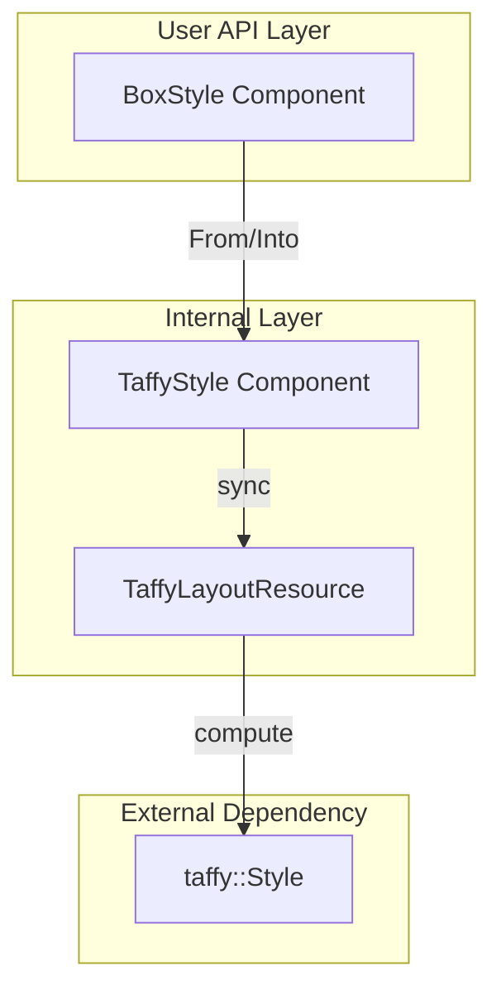
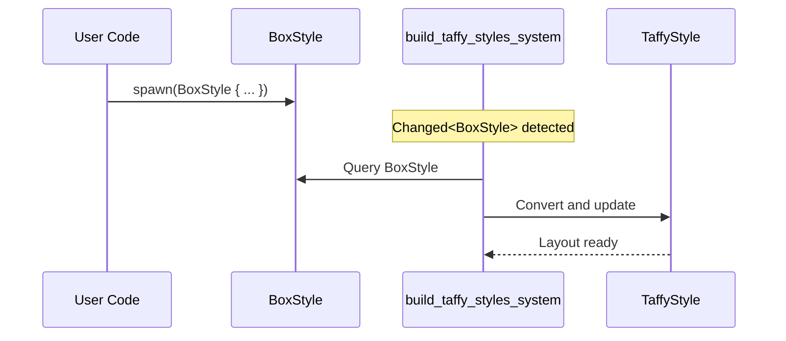

# Technical Design: BoxStyle Consolidation

## Overview

**Purpose**: wintfレイアウトシステムのECSコンポーネント構造を最適化し、`build_taffy_styles_system`のクエリパフォーマンスを改善する。

**Users**: wintfライブラリを使用するRust開発者がレイアウト定義をより簡潔に記述できるようになる。

**Impact**: 現行の7つの個別レイアウトコンポーネント（`BoxSize`, `BoxMargin`, `BoxPadding`, `BoxPosition`, `BoxInset`, `FlexContainer`, `FlexItem`）を単一の`BoxStyle`コンポーネントに統合。内部の`TaffyStyle`と1:1対応するユーザー向け高レベルAPIとして提供。

### Goals

- `build_taffy_styles_system`のクエリを8コンポーネントから1コンポーネントに削減
- `BoxStyle`と`TaffyStyle`の1:1対応を実現
- 既存コードからの移行パスを提供（コンパイルエラーによる移行箇所明示）
- `LayoutRoot`に仮想デスクトップの正確な矩形情報を設定

### Non-Goals

- パフォーマンスベンチマーク（統合後に実測で確認）
- ビルダーパターンAPI（将来検討）
- `serde`シリアライズ対応（将来検討）

## Architecture

### Existing Architecture Analysis

現行システムは7つの個別コンポーネントでレイアウト入力を表現：

```text
現行クエリ構造（build_taffy_styles_system）:
├── Option<&BoxSize>
├── Option<&BoxMargin>
├── Option<&BoxPadding>
├── Option<&BoxPosition>
├── Option<&BoxInset>
├── Option<&FlexContainer>
├── Option<&FlexItem>
└── &mut TaffyStyle

フィルター条件: Or<(Changed<BoxSize>, Changed<BoxMargin>, ...)>
```

**問題点**:
- クエリ参照数が多くアーキタイプ走査コストが高い
- エンティティごとに異なるコンポーネント組み合わせによるアーキタイプ断片化
- スタイル構築ロジックの重複（2箇所で同一処理）

### Architecture Pattern & Boundary Map



**Architecture Integration**:
- Selected pattern: コンポーネント統合パターン
- Domain boundaries: ユーザーAPI層（`BoxStyle`）と内部層（`TaffyStyle`）の分離を維持
- Existing patterns preserved: `From`/`Into`トレイトによる型変換、Component deriveマクロ
- New components rationale: `BoxStyle`は7コンポーネントを置き換える単一エントリーポイント

### Technology Stack

| Layer | Choice / Version | Role in Feature | Notes |
|-------|------------------|-----------------|-------|
| ECS | bevy_ecs 0.17.2 | コンポーネント定義、システムクエリ | 既存依存 |
| Layout Engine | taffy 0.9.1 | レイアウト計算 | 既存依存 |
| Language | Rust 2021 | 型定義、トレイト実装 | 既存 |

## System Flows

### BoxStyle → TaffyStyle 変換フロー



**Key Decisions**:
- `BoxStyle`追加時に`TaffyStyle`と`TaffyComputedLayout`を自動挿入
- 変更検出は`Changed<BoxStyle>`で統一

## Requirements Traceability

| Requirement | Summary | Components | Interfaces | Flows |
|-------------|---------|------------|------------|-------|
| 1 | コンポーネント完全統合 | BoxStyle | BoxStyleService | 変換フロー |
| 2 | クエリパフォーマンス改善 | build_taffy_styles_system | - | - |
| 3 | API互換性とマイグレーション | BoxSize, BoxMargin等（非コンポーネント化） | From/Into | - |

## Components and Interfaces

| Component | Domain/Layer | Intent | Req Coverage | Key Dependencies | Contracts |
|-----------|--------------|--------|--------------|------------------|-----------|
| BoxStyle | User API | レイアウト入力の統一コンポーネント | 1, 2 | TaffyStyle (P0) | Service |
| BoxSize | User API | サイズ定義（非コンポーネント） | 3 | - | - |
| BoxMargin | User API | マージン定義（非コンポーネント） | 3 | - | - |
| BoxPadding | User API | パディング定義（非コンポーネント） | 3 | - | - |
| BoxPosition | User API | 配置タイプ定義（非コンポーネント） | 3 | - | - |
| BoxInset | User API | インセット定義（非コンポーネント） | 3 | - | - |

### User API Layer

#### BoxStyle

| Field | Detail |
|-------|--------|
| Intent | 全レイアウトプロパティを統合したユーザー向けコンポーネント |
| Requirements | 1, 2 |

**Responsibilities & Constraints**
- 全レイアウト入力プロパティの保持
- `TaffyStyle`への変換責務
- ECSコンポーネントとしてのライフサイクル管理

**Dependencies**
- Outbound: TaffyStyle — 変換先 (P0)
- External: taffy::Style — 変換参照 (P1)

**Contracts**: Service [x]

##### Service Interface

```rust
/// 統合レイアウトスタイルコンポーネント
#[derive(Component, Debug, Clone, PartialEq, Default)]
pub struct BoxStyle {
    // === Box系プロパティ（ネスト構造） ===
    /// サイズ（width, height）
    pub size: Option<BoxSize>,
    /// マージン（外側余白）
    pub margin: Option<BoxMargin>,
    /// パディング（内側余白）
    pub padding: Option<BoxPadding>,
    /// 配置タイプ（Relative/Absolute）
    pub position: Option<BoxPosition>,
    /// インセット（絶対配置時の座標）
    pub inset: Option<BoxInset>,
    
    // === Flex系プロパティ（フラット構造） ===
    /// Flexコンテナーの主軸方向
    pub flex_direction: Option<FlexDirection>,
    /// 主軸方向の子要素配置
    pub justify_content: Option<JustifyContent>,
    /// 交差軸方向の子要素配置
    pub align_items: Option<AlignItems>,
    /// Flexアイテムの伸長率（デフォルト: 0.0）
    /// 注: Noneの場合はtaffyデフォルト値(0.0)を適用
    pub flex_grow: Option<f32>,
    /// Flexアイテムの収縮率（デフォルト: 1.0）
    /// 注: Noneの場合はtaffyデフォルト値(1.0)を適用
    pub flex_shrink: Option<f32>,
    /// Flexアイテムの基準サイズ
    pub flex_basis: Option<Dimension>,
    /// 自身の交差軸配置（親のalign_itemsを上書き）
    pub align_self: Option<AlignSelf>,
}

// === LayoutRootとの関係 ===
// LayoutRootマーカーは「レイアウトツリーのルートエンティティ」を示す独立マーカー。
// LayoutRootのみでBoxStyleがない場合、BoxStyle::default()相当のスタイルが適用される。
// これは現行動作（Style::default()の挿入）と同等であり、互換性を維持する。

impl BoxStyle {
    /// 新しいBoxStyleを作成
    pub fn new() -> Self {
        Self::default()
    }
}

/// BoxStyleからtaffy::Styleへの変換
impl From<&BoxStyle> for taffy::Style {
    fn from(style: &BoxStyle) -> Self {
        let mut taffy_style = taffy::Style::default();
        
        // Box系プロパティ変換
        if let Some(size) = &style.size {
            if let Some(w) = size.width { taffy_style.size.width = w.into(); }
            if let Some(h) = size.height { taffy_style.size.height = h.into(); }
        }
        if let Some(margin) = &style.margin {
            taffy_style.margin = margin.0.into();
        }
        if let Some(padding) = &style.padding {
            taffy_style.padding = padding.0.into();
        }
        if let Some(position) = &style.position {
            taffy_style.position = match position {
                BoxPosition::Relative => taffy::Position::Relative,
                BoxPosition::Absolute => taffy::Position::Absolute,
            };
        }
        if let Some(inset) = &style.inset {
            taffy_style.inset = inset.0.into();
        }
        
        // Flex系プロパティ変換
        if style.flex_direction.is_some() || style.justify_content.is_some() 
           || style.align_items.is_some() {
            taffy_style.display = taffy::Display::Flex;
        }
        if let Some(dir) = style.flex_direction {
            taffy_style.flex_direction = dir;
        }
        if let Some(jc) = style.justify_content {
            taffy_style.justify_content = Some(jc);
        }
        if let Some(ai) = style.align_items {
            taffy_style.align_items = Some(ai);
        }
        if let Some(grow) = style.flex_grow {
            taffy_style.flex_grow = grow;
        } else {
            taffy_style.flex_grow = 0.0; // taffyデフォルト値
        }
        if let Some(shrink) = style.flex_shrink {
            taffy_style.flex_shrink = shrink;
        } else {
            taffy_style.flex_shrink = 1.0; // taffyデフォルト値
        }
        if let Some(basis) = style.flex_basis {
            taffy_style.flex_basis = basis.into();
        }
        if let Some(align_self) = style.align_self {
            taffy_style.align_self = Some(align_self);
        }
        
        taffy_style
    }
}
```

- Preconditions: なし（全フィールドがOption）
- Postconditions: 有効なtaffy::Styleが生成される
- Invariants: `None`フィールドはtaffyデフォルト値にマッピング

#### 非コンポーネント型（移行互換用）

以下の型は`#[derive(Component)]`を削除し、通常の構造体として維持：

```rust
/// サイズ定義（非コンポーネント）
#[derive(Debug, Clone, Copy, PartialEq, Default)]
pub struct BoxSize {
    pub width: Option<Dimension>,
    pub height: Option<Dimension>,
}

/// マージン定義（非コンポーネント）
#[derive(Debug, Clone, Copy, PartialEq, Default)]
pub struct BoxMargin(pub Rect<LengthPercentageAuto>);

/// パディング定義（非コンポーネント）
#[derive(Debug, Clone, Copy, PartialEq, Default)]
pub struct BoxPadding(pub Rect<LengthPercentage>);

/// 配置タイプ定義（非コンポーネント）
#[derive(Debug, Clone, Copy, PartialEq, Default)]
pub enum BoxPosition {
    #[default]
    Relative,
    Absolute,
}

/// インセット定義（非コンポーネント）
#[derive(Debug, Clone, Copy, PartialEq, Default)]
pub struct BoxInset(pub Rect<LengthPercentageAuto>);
```

### Internal Layer

#### build_taffy_styles_system（変更後）

```rust
/// 統合後のシステム関数シグネチャ
pub fn build_taffy_styles_system(
    mut commands: Commands,
    // LayoutRootまたはBoxStyleがあるがTaffyStyleがないエンティティ
    // LayoutRootのみの場合はBoxStyle::default()相当のスタイルを適用
    without_style: Query<
        (Entity, Option<&BoxStyle>),
        (
            Or<(With<LayoutRoot>, With<BoxStyle>)>,
            Without<TaffyStyle>,
        ),
    >,
    // BoxStyleが変更されたエンティティ
    mut changed: Query<
        (Entity, &BoxStyle, &mut TaffyStyle),
        Changed<BoxStyle>,
    >,
) {
    // TaffyStyle自動挿入
    for (entity, box_style) in without_style.iter() {
        // BoxStyleがない場合（LayoutRootのみ）はデフォルトスタイル
        let taffy_style: taffy::Style = box_style
            .map(|s| s.into())
            .unwrap_or_default();
        commands.entity(entity).insert((
            TaffyStyle(taffy_style),
            TaffyComputedLayout::default(),
            ArrangementTreeChanged,
        ));
    }
    
    // 変更反映
    for (_entity, box_style, mut taffy_style) in changed.iter_mut() {
        taffy_style.0 = box_style.into();
    }
}
```

#### Implementation Notes

- Integration: 既存の`sync_taffy_tree_system`、`compute_taffy_layout_system`との連携は変更なし
- Validation: `BoxStyle`の各フィールドは`Option`で表現、`None`はtaffyデフォルト値
- Risks: テスト・サンプルの移行漏れ（コンパイルエラーで検出）
- LayoutRoot互換: `LayoutRoot`のみのエンティティでも`TaffyStyle`が正しく生成される

#### initialize_layout_root（変更後）

`LayoutRoot`に仮想デスクトップの矩形を設定するため、`GetSystemMetrics` APIを使用：

```rust
use windows::Win32::UI::WindowsAndMessaging::{
    GetSystemMetrics,
    SM_XVIRTUALSCREEN, SM_YVIRTUALSCREEN,
    SM_CXVIRTUALSCREEN, SM_CYVIRTUALSCREEN,
};

/// 仮想デスクトップの矩形を取得
fn get_virtual_desktop_bounds() -> (i32, i32, i32, i32) {
    unsafe {
        let x = GetSystemMetrics(SM_XVIRTUALSCREEN);
        let y = GetSystemMetrics(SM_YVIRTUALSCREEN);
        let width = GetSystemMetrics(SM_CXVIRTUALSCREEN);
        let height = GetSystemMetrics(SM_CYVIRTUALSCREEN);
        (x, y, width, height)
    }
}

/// LayoutRootとMonitor階層をワールド初期化時に作成（変更後）
pub fn initialize_layout_root(world: &mut World) {
    // 既にLayoutRootが存在する場合はスキップ
    let existing = world.query_filtered::<Entity, With<LayoutRoot>>().iter(world).next();
    if existing.is_some() {
        return;
    }

    // 仮想デスクトップの矩形を取得
    let (vx, vy, vw, vh) = get_virtual_desktop_bounds();

    // LayoutRootエンティティを作成（仮想デスクトップ矩形を設定）
    let layout_root = world
        .spawn((
            LayoutRoot,
            BoxStyle {
                size: Some(BoxSize {
                    width: Some(Dimension::Px(vw as f32)),
                    height: Some(Dimension::Px(vh as f32)),
                }),
                position: Some(BoxPosition::Absolute),
                inset: Some(BoxInset(Rect {
                    left: LengthPercentageAuto::Px(vx as f32),
                    top: LengthPercentageAuto::Px(vy as f32),
                    right: LengthPercentageAuto::Auto,
                    bottom: LengthPercentageAuto::Auto,
                })),
                ..Default::default()
            },
            Arrangement::default(),
            GlobalArrangement::default(),
        ))
        .id();

    // ... (以降のMonitor作成処理は現行と同様)
}
```

**変更点**:
- `BoxSize::default()` → `BoxStyle`（仮想デスクトップ矩形を明示的に設定）
- `GetSystemMetrics`で仮想デスクトップの座標・サイズを取得
- `BoxPosition::Absolute`と`BoxInset`で絶対座標を指定

## Data Models

### Domain Model

**Aggregates**: `BoxStyle`が唯一のレイアウト入力アグリゲート

**Value Objects**:
- `BoxSize` - サイズ値オブジェクト
- `BoxMargin` - マージン値オブジェクト（`Rect<LengthPercentageAuto>`のラッパー）
- `BoxPadding` - パディング値オブジェクト（`Rect<LengthPercentage>`のラッパー）
- `BoxPosition` - 配置タイプ列挙
- `BoxInset` - インセット値オブジェクト
- `Dimension` - 寸法列挙（Auto/Px/Percent）
- `LengthPercentageAuto` - 長さ/パーセント/Auto列挙
- `LengthPercentage` - 長さ/パーセント列挙
- `Rect<T>` - 4辺ジェネリック矩形

**Business Rules**:
- `BoxStyle`のフィールドが`None`の場合、taffyデフォルト値を使用
- `flex_grow`の`None`は`0.0`、`flex_shrink`の`None`は`1.0`を適用（taffy互換）
- `flex_direction`、`justify_content`、`align_items`のいずれかが`Some`の場合、`display: Flex`を設定
- `LayoutRoot`のみでBoxStyleがないエンティティには`BoxStyle::default()`相当を適用

## Error Handling

### Error Strategy

- **Invalid Values**: taffy側でバリデーション（wintfでは追加検証なし）
- **Missing Components**: `Option`型により欠損を許容

## Testing Strategy

### Unit Tests

1. `BoxStyle::default()` — 全フィールドが`None`であること
2. `From<&BoxStyle> for taffy::Style` — 各フィールドの変換が正しいこと
3. `BoxSize`/`BoxMargin`等の非コンポーネント型が構造体として機能すること
4. Flex系プロパティ設定時に`display: Flex`が自動設定されること
5. `flex_grow: None`が`0.0`に、`flex_shrink: None`が`1.0`に変換されること

### Integration Tests

1. `build_taffy_styles_system` — `BoxStyle`追加時に`TaffyStyle`が自動挿入されること
2. `BoxStyle`変更時に`TaffyStyle`が更新されること
3. レイアウト計算が正しく実行されること（既存テストの移行）
4. `LayoutRoot`のみのエンティティに`TaffyStyle`が正しく挿入されること
5. `LayoutRoot`が仮想デスクトップの正確な矩形を持つこと

### E2E Tests

1. `taffy_flex_demo.rs`の移行 — 新API使用後も同一の表示結果

## Migration Strategy

### Phase 1: 型定義変更

1. `BoxStyle`構造体を`high_level.rs`に追加
2. 既存型から`#[derive(Component)]`を削除
3. `From`/`Into`トレイト実装

### Phase 2: システム更新

1. `build_taffy_styles_system`のクエリを簡略化
2. 重複していたスタイル構築ロジックを統合
3. `initialize_layout_root`を更新し、`LayoutRoot`に仮想デスクトップ矩形を設定
4. `get_virtual_desktop_bounds`ヘルパー関数を追加（`GetSystemMetrics` API使用）

### Phase 3: テスト・サンプル移行

1. コンパイルエラー箇所を特定
2. 新API（`BoxStyle`）に移行
3. 動作確認

### Rollback Triggers

- 統合後のレイアウト計算結果が現行と異なる場合
- パフォーマンス悪化が観測された場合

### Validation Checkpoints

- 全テストがパス
- `taffy_flex_demo`が正常動作
- コンパイル警告なし
