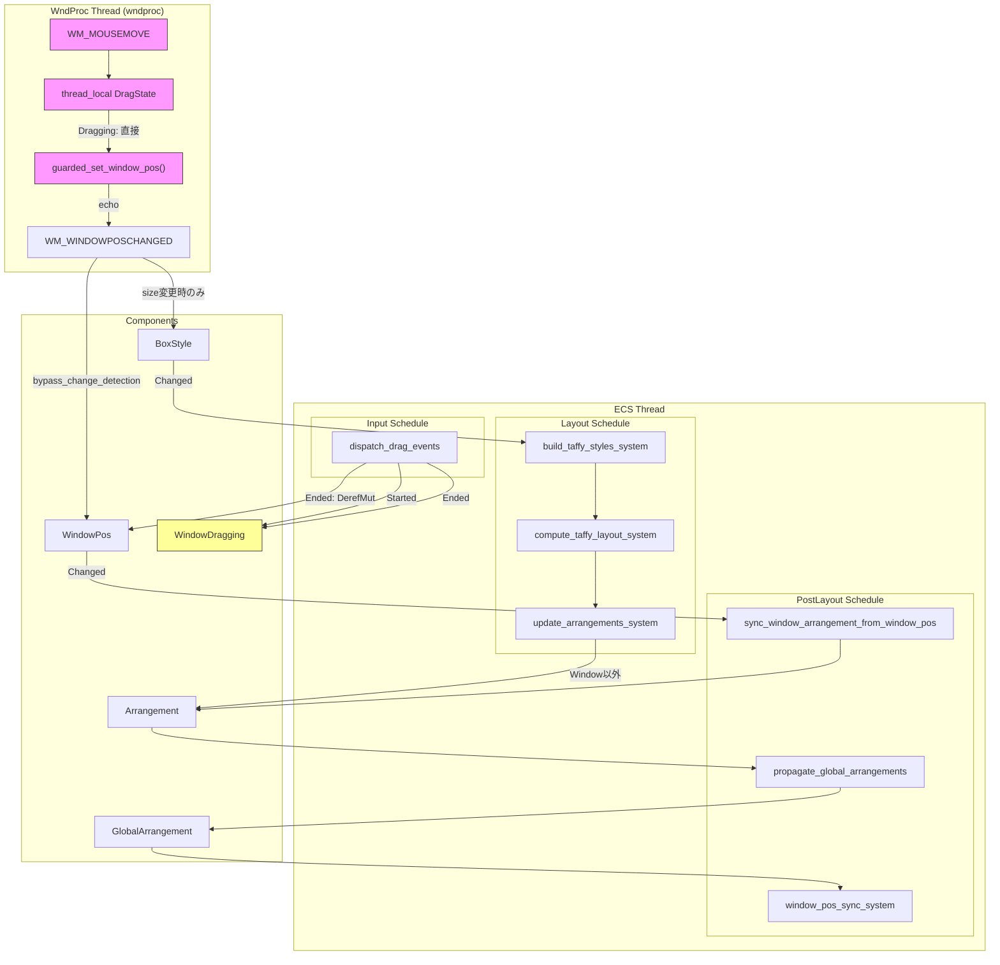
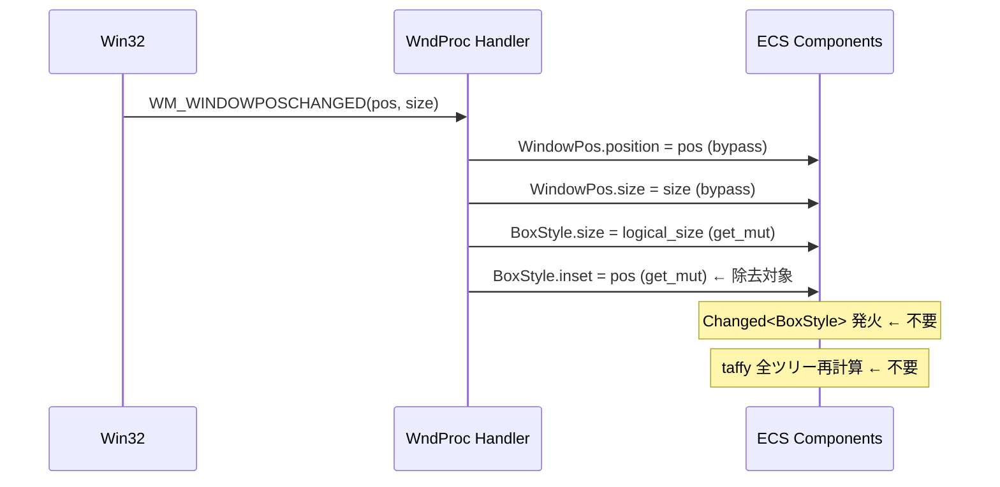
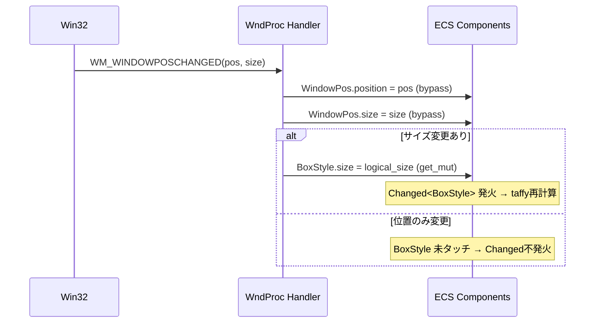
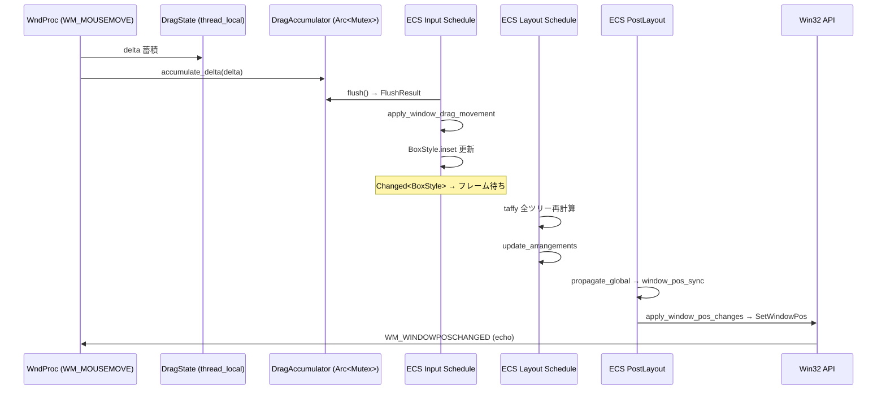
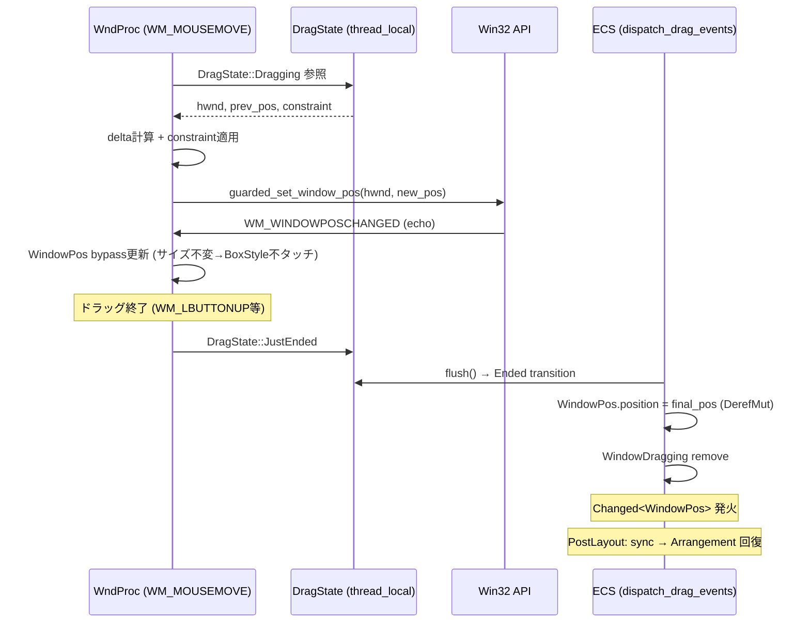

# Design Document: boxstyle-coordinate-separation

## Overview

**Purpose**: Window entity のスクリーン座標（XY位置）を `BoxStyle.inset` から除外し、ウィンドウ移動時に `Changed<BoxStyle>` が発火して taffy レイアウト再計算パイプラインをトリガーすることを防止する。同時に、ドラッグによるウィンドウ移動を WndProc レベル（`WM_MOUSEMOVE` → `SetWindowPos` 直接呼び出し）に移行し、ECS フレーム待ちレイテンシを排除する。

**Users**: wintf フレームワーク利用者（アプリケーション開発者）が、ウィンドウドラッグ時にネイティブに近い体感を得られるようにする。

**Impact**: `WM_WINDOWPOSCHANGED` ハンドラ、ドラッグシステム、レイアウトシステム（`update_arrangements_system`）、examples の初期位置指定パターンを変更する。

### Goals
- ウィンドウの位置のみの移動で `Changed<BoxStyle>` を発火させない（taffy レイアウト再計算の抑制）
- ドラッグ中の SetWindowPos を WndProc レベルで直接呼び出し、ECS フレーム待ちを排除
- `WindowPos` を Window entity のスクリーン座標の唯一の source of truth として確立
- 非 Window エンティティの `BoxStyle.inset` 利用に影響を与えない

### Non-Goals
- `BoxStyle` の型定義・構造の変更
- `Changed<BoxStyle>` の粒度を細分化する bevy_ecs レベルの変更検知機構改良
- ドラッグ以外のウィンドウ移動方式（プログラム的移動 API 等）の追加
- マルチモニタ DPI 切り替え中のドラッグ挙動最適化（将来課題）

## Architecture

> 詳細な調査結果は `research.md` を参照。本ドキュメントは設計判断と契約を自己完結的に記述する。

### Existing Architecture Analysis

**現行の問題パス**:
1. `WM_WINDOWPOSCHANGED` → 単一の `get_mut::<BoxStyle>()` で inset（物理px）+ size（論理px）を同時書き込み → `Changed<BoxStyle>` が位置のみ変更でも発火
2. ドラッグ: `apply_window_drag_movement` → `BoxStyle.inset` 更新 → `Changed<BoxStyle>` → taffy 全ツリー再計算 → PostLayout で Arrangement/WindowPos 経由 → SetWindowPos

**既存インフラ（活用）**:
| インフラ | 場所 | 役割 |
|---------|------|------|
| thread_local `DragState` | `ecs/drag/state.rs` | wndproc スレッドでのドラッグ状態管理（Idle/Preparing/JustStarted/Dragging/JustEnded） |
| `DragAccumulatorResource` | `ecs/drag/accumulator.rs` | wndproc → ECS 間のドラッグデータ転送（Arc\<Mutex\>） |
| `guarded_set_window_pos()` | `ecs/window_proc/handlers.rs` | IS_SELF_INITIATED TLS フラグによるエコーバック防止 |
| `WindowHandle` component | `ecs/window.rs` | `{ hwnd: HWND, instance: HINSTANCE }` — Window entity の Win32 ハンドル |
| `sync_window_arrangement_from_window_pos` | `ecs/layout/systems.rs` | PostLayout: `Changed<WindowPos>` → `Arrangement.offset` 反映 |

**保持すべき境界**:
- ECS スケジュール順序: Input → Update → PreLayout → Layout → PostLayout → UISetup
- `guarded_set_window_pos` / `IS_SELF_INITIATED` によるエコー防止パターン
- `DragAccumulatorResource` の Arc\<Mutex\> による wndproc → ECS スレッド間データ転送

### Architecture Pattern & Boundary Map



**Architecture Integration**:
- **Selected pattern**: WndProc レベル直接 SetWindowPos（Option C）— ECS パイプラインを完全バイパスし最短パスを実現
- **Domain boundaries**: wndproc スレッド（ドラッグ中の位置更新）と ECS スレッド（状態同期・レイアウト）を thread_local `DragState` と `DragAccumulatorResource` で接続
- **Existing patterns preserved**: `guarded_set_window_pos` エコー防止、`Changed<T>` 検知によるリアクティブパイプライン、PostLayout の WindowPos → Arrangement 同期
- **New components**: `WindowDragging` マーカーコンポーネント（ECS 側でのドラッグ状態検知用）
- **Steering compliance**: win32-native 設計原則（product.md）、ECS データフロー一貫性（tech.md）

### Technology Stack

| Layer | Choice / Version | Role in Feature | Notes |
|-------|------------------|-----------------|-------|
| ECS | bevy_ecs 0.18.0 | コンポーネント管理、`Changed<T>` 検知、スケジュール実行 | `bypass_change_detection()` 活用 |
| Layout | taffy 0.9.2 | ウィジェットレイアウト計算 | Window entity は offset スキップ |
| Win32 | windows-rs | SetWindowPos, WM_MOUSEMOVE, WM_WINDOWPOSCHANGED | guarded_set_window_pos 経由 |
| Composition | DirectComposition | ビジュアルツリー描画 | 変更なし |

## System Flows

### Before: WM_WINDOWPOSCHANGED（現行）



### After: WM_WINDOWPOSCHANGED（変更後）



### Before: ドラッグ（現行 ECS パイプライン経由）



### After: ドラッグ（WndProc レベル直接）



## Requirements Traceability

| Requirement | Summary | Components | Interfaces | Flows |
|-------------|---------|------------|------------|-------|
| 1.1 | WM_WINDOWPOSCHANGED で BoxStyle.inset 不書き込み | WM_WINDOWPOSCHANGED Handler | — | After: WM_WINDOWPOSCHANGED |
| 1.2 | BoxStyle.size は現行通り更新 | WM_WINDOWPOSCHANGED Handler | — | After: WM_WINDOWPOSCHANGED |
| 1.3 | 位置のみ変更で Changed\<BoxStyle\> 不発火 | WM_WINDOWPOSCHANGED Handler | — | After: WM_WINDOWPOSCHANGED |
| 1.4 | サイズ変更時に Changed\<BoxStyle\> 発火 | WM_WINDOWPOSCHANGED Handler | — | After: WM_WINDOWPOSCHANGED |
| 1.5 | Window BoxStyle.inset 常時 Auto/0 | WM_WINDOWPOSCHANGED Handler, Examples | — | — |
| 2.1 | WM_MOUSEMOVE 内で直接 SetWindowPos | WM_MOUSEMOVE Handler, DragState | guarded_set_window_pos | After: ドラッグ |
| 2.2 | ECS パイプライン非経由 | WM_MOUSEMOVE Handler | — | After: ドラッグ |
| 2.3 | HWND+初期位置を DragState にキャッシュ | DragState, dispatch_drag_events | DragState::Dragging fields | After: ドラッグ |
| 2.4 | ドラッグ終了時 ECS 同期 | dispatch_drag_events | WindowPos DerefMut | After: ドラッグ |
| 2.5 | DragConfig.move_window 条件 | DragState, dispatch_drag_events | DragState::Dragging.move_window | — |
| 2.6 | ドラッグ中 Changed\<BoxStyle\> 不発火 | (Req 1 に依存) | — | — |
| 2.7 | WindowDragging マーカー | WindowDragging, dispatch_drag_events | Added/RemovedComponents | After: ドラッグ |
| 3.1 | WindowPos.position 参照可能 | WindowPos | — | (既存) |
| 3.2 | WindowPos.size 参照可能 | WindowPos | — | (既存) |
| 3.3 | sync_window_arrangement_from_window_pos | sync_window_arrangement_from_window_pos | — | (既存) |
| 3.4 | WindowPos→Arrangement→GlobalArrangement 伝搬 | (既存パイプライン) | — | (既存) |
| 3.5 | update_arrangements が Window offset 不上書き | update_arrangements_system | Option\<&Window\> query | — |
| 4.1 | 非 Window BoxStyle.inset 維持 | (変更なし) | — | — |
| 4.2 | BoxStyle.inset 型定義不変 | (変更なし) | — | — |

## Components and Interfaces

| Component | Domain/Layer | Intent | Req Coverage | Key Dependencies | Contracts |
|-----------|-------------|--------|--------------|------------------|-----------|
| WM_WINDOWPOSCHANGED Handler | WndProc | サイズ変更時のみ BoxStyle 更新 | 1.1-1.5 | EntityWorldMut (P0) | — |
| WM_MOUSEMOVE Handler | WndProc | ドラッグ中直接 SetWindowPos | 2.1, 2.2 | DragState (P0), WindowDragContextResource (P0), guarded_set_window_pos (P0) | — |
| DragState (拡張) | WndProc/Drag | HWND・初期位置・constraint キャッシュ | 2.3, 2.5 | WindowDragContextResource (P0) | State |
| WindowDragContextResource | ECS/Resource | ECS→wndproc スレッド間ドラッグ情報転送 | 2.3, 2.5 | — | Arc\<Mutex\> |
| dispatch_drag_events (変更) | ECS/Input | WindowDragContext 設定 + 終了同期 + DragEvent 発行 | 2.2-2.5, 2.7 | WindowHandle (P0), WindowPos (P0), DragConfig (P0) | — |
| WindowDragging | ECS/Component | Window ドラッグ状態マーカー | 2.7 | — | — |
| update_arrangements_system (変更) | ECS/Layout | Window offset スキップ | 3.5 | Window component (P0) | — |
| Examples (変更) | Application | 初期位置を WindowPos 経由に変更 | 1.5 | WindowPos (P0) | — |

### WndProc Layer

#### WM_WINDOWPOSCHANGED Handler 変更

| Field | Detail |
|-------|--------|
| Intent | ウィンドウ位置/サイズ変更メッセージの処理。BoxStyle へのinset書き込みを排除し、サイズ変更時のみ BoxStyle.size を更新 |
| Requirements | 1.1, 1.2, 1.3, 1.4, 1.5 |

**Responsibilities & Constraints**
- `WindowPos.position` / `WindowPos.size` は `bypass_change_detection` で常時更新（現行維持）
- `BoxStyle.size` はサイズ変更があった場合のみ `get_mut` で更新（`Changed<BoxStyle>` 発火）
- `BoxStyle.inset` への書き込みを完全に排除
- `IS_SELF_INITIATED` エコー判定は `WindowPos` の bypass 判定にのみ使用（現行維持）

**Implementation Notes**
- **サイズ変更判定方式**: `get_mut::<BoxStyle>()` を呼ぶ前にサイズの事前比較が必要。`EntityWorldMut` の借用制約により、以下の手順を採用:
  1. `entity_ref.get::<BoxStyle>()` で現在の `size` を読み取り、ローカル変数にコピー
  2. `entity_ref` の immutable borrow を drop
  3. 新しいサイズと比較し、変更がある場合のみ `entity_ref.get_mut::<BoxStyle>()` で `size` を書き込み

```rust
// 疑似コード: WM_WINDOWPOSCHANGED ハンドラ内
let current_size = entity_ref.get::<BoxStyle>().map(|bs| bs.size.clone());
let new_logical_size = physical_to_logical(new_size, dpi_scale);

// WindowPos は常時 bypass 更新（現行維持）
if let Some(mut wp) = entity_ref.get_mut::<WindowPos>() {
    let wp_inner = wp.bypass_change_detection();
    wp_inner.position = Some(new_position);
    wp_inner.size = Some(new_size);
}

// BoxStyle.size はサイズ変更時のみ更新
if current_size.as_ref().map(|s| s != &new_logical_size).unwrap_or(true) {
    if let Some(mut bs) = entity_ref.get_mut::<BoxStyle>() {
        bs.size = new_logical_size; // Changed<BoxStyle> 発火
    }
}
// BoxStyle.inset 書き込み ← 完全削除
```

- **Validation**: AC1（inset 不書き込み）、AC2（size 更新）、AC3（位置のみで Changed 不発火）、AC4（サイズ変更で発火）を同時に満たす

#### WM_MOUSEMOVE Handler 変更

| Field | Detail |
|-------|--------|
| Intent | ドラッグ中のマウス移動で直接 SetWindowPos を呼び出しウィンドウを移動 |
| Requirements | 2.1, 2.2 |

**Responsibilities & Constraints**
- `DragState::Dragging` の場合のみ処理
- `move_window == true` の場合のみ SetWindowPos を呼び出し
- DragConstraint をキャッシュから適用
- `guarded_set_window_pos()` 経由で呼び出し（エコーバック防止）
- `DragAccumulatorResource` への delta 蓄積は維持（DragEvent ECS 発行用）

**Dependencies**
- Inbound: WindowDragContextResource (P0) — ECS から HWND 等の情報を取得
- Outbound: guarded_set_window_pos (P0) — SetWindowPos 呼び出し

**Implementation Notes**

```rust
// 疑似コード: WM_MOUSEMOVE ハンドラ内（既存の Dragging 分岐に追加）
DRAG_STATE.with(|cell| {
    let state = cell.borrow();
    if let DragState::Dragging {
        hwnd, initial_window_pos, move_window, constraint,
        current_pos, prev_pos, start_pos, ..
    } = &*state {
        if *move_window {
            let mut new_pos = POINT {
                x: initial_window_pos.x + (current_pos.x - start_pos.x),
                y: initial_window_pos.y + (current_pos.y - start_pos.y),
            };
            // DragConstraint 適用
            if let Some(ref constraint) = constraint {
                new_pos = constraint.apply(new_pos);
            }
            guarded_set_window_pos(*hwnd, new_pos.x, new_pos.y);
        }
    }
});
// DragAccumulator への delta 蓄積は維持（既存コード）
```

- **borrow 制約**: `DRAG_STATE` の `RefCell` borrow を `guarded_set_window_pos` 呼び出し前に drop する必要がある場合は、必要な値をローカルにコピー
- **DragConstraint 適用**: `constraint.apply()` は pure 関数（副作用なし）なので wndproc スレッドで安全に呼び出し可能

### Drag System Layer

#### DragState 拡張

| Field | Detail |
|-------|--------|
| Intent | WndProc レベルドラッグに必要な HWND・初期位置・制約情報をキャッシュ |
| Requirements | 2.3, 2.5 |

##### State Management

**現行 DragState::Dragging**:
```rust
Dragging {
    entity: Entity,
    start_pos: POINT,
    current_pos: POINT,
    prev_pos: POINT,
    start_time: Instant,
}
```

**拡張後 DragState::Dragging**:
```rust
Dragging {
    entity: Entity,
    start_pos: POINT,
    current_pos: POINT,
    prev_pos: POINT,
    start_time: Instant,
    // 新規フィールド
    hwnd: HWND,                             // Window の Win32 ハンドル
    initial_window_pos: POINT,              // ドラッグ開始時のウィンドウ位置
    move_window: bool,                      // DragConfig.move_window のキャッシュ
    constraint: Option<DragConstraint>,     // DragConstraint のキャッシュ
}
```
1. **ECS 側（dispatch_drag_events）**: `DragTransition::Started` 処理内で親 Window 探索時に以下を取得し、`WindowDragContextResource` に書き込む:
   - `WindowHandle.hwnd` → `hwnd`
   - `WindowPos.position` (現在のウィンドウ位置) → `initial_window_pos`
   - `DragConfig.move_window` → `move_window`
   - `DragConstraint` (存在すれば) → `constraint`

2. **wndproc 側（update_dragging）**: `JustStarted` → `Dragging` 遷移時に `WindowDragContextResource` から上記を読み取り、`DragState::Dragging` にセット。
WindowDragContextResource (新規)

| Field | Detail |
|-------|--------|
| Intent | ECS スレッド → wndproc スレッド間でドラッグ開始時のウィンドウ情報を転送 |
| Requirements | 2.3, 2.5 |

##### Arc\<Mutex\> Contract

```rust
/// wndproc スレッドでのドラッグに必要な Window 情報
pub struct WindowDragContext {
    pub hwnd: Option<HWND>,
    pub initial_window_pos: Option<POINT>,
    pub move_window: bool,
    pub constraint: Option<DragConstraint>,
}

#[derive(Resource, Clone)]
pub struct WindowDragContextResource {
    inner: Arc<Mutex<WindowDragContext>>,
}
```

**ライフサイクル**:
- dispatch_drag_events (ECS スレッド) が Started 処理時に更新
- update_dragging (wndproc スレッド) が JustStarted → Dragging 遷移時に読み取り

#### dispatch_drag_events 変更

| Field | Detail |
|-------|--------|
| Intent | ドラッグ開始時の WindowDragContext 設定、終了時の ECS 同期、WindowDragging マーカー管理、DragEvent 発行 |
| Requirements | 2.2, 2.3, 2.4, 2.5, 2.7 |

**Responsibilities & Constraints**
- `DragTransition::Started`:
  1. 既存の親 Window 探索ロジックで Window entity を取得
  2. `WindowHandle.hwnd`, `WindowPos.position`, `DragConfig.move_window`, `DragConstraint` を取得
  3. `WindowDragContextResource` に書き込み（wndproc 側で読み取り可能にする）
  4. Window entity に `WindowDragging` マーカーを insert
  5. ウィジェット entity に `DraggingState` を insert（現行維持）
  6. `DragStartEvent` を発行（現行維持）

- `DragTransition::Ended`:
  1. `DragAccumulatorResource` から最終位置を取得
  2. Window entity の `WindowPos.削除

| Field | Detail |
|-------|--------|
| Intent | （削除） |
| Requirements | 2.2 |

**削除理由**: 
- `apply_window_drag_movement` の主機能は `BoxStyle.inset` への書き込みであったが、WndProc レベル移行により不要になる
- `DragEvent` の発行は `dispatch_drag_events` で既に行われているため、重複
- 将来の非ウィンドウドラッグ（スライダー等）は別のシステムとして設計すべき

**Input スケジュール変更**:
- 削除前: `dispatch_drag_events`, `apply_window_drag_movement`
- 削除後: `dispatch_drag_events` のみ
- `WindowPos` の更新は `DerefMut`（`bypass_change_detection` ではない）で行い、`Changed<WindowPos>` を意図的に発火させる。これにより PostLayout の `sync_window_arrangement_from_window_pos` が `Arrangement.offset` を正しく更新する
- `DragAccumulatorResource` の `flush()` は引き続きデルタとトランジションを返す。ドラッグ中のデルタは `DragEvent` としてECSに発行され、ユーザーコールバック（`DragEvent` 購読）に利用される
- `DraggingState.initial_inset` は `initial_window_pos`（POINT 型）に置き換え。型は `(f32, f32)` → `POINT` に変更

#### WindowDragging Component

| Field | Detail |
|-------|--------|
| Intent | Window entity のドラッグ中状態をECSで検知可能にするマーカー |
| Requirements | 2.7 |

```rust
/// Window entity がドラッグ中であることを示すマーカーコンポーネント。
/// `Added<WindowDragging>` でドラッグ開始、`RemovedComponents<WindowDragging>` でドラッグ終了を検知。
#[derive(Component)]
pub struct WindowDragging;
```

- `dispatch_drag_events` の Started/Ended で insert/remove
- Window entity on-going ドラッグ中のみ存在
- ユーザーは `Query<Entity, Added<WindowDragging>>` / `RemovedComponents<WindowDragging>` でリアクティブに検知可能

#### apply_window_drag_movement 変更

| Field | Detail |
|-------|--------|
| Intent | BoxStyle.inset への書き込みを廃止 |
| Requirements | 2.2 |

**変更内容**: 
- `BoxStyle.inset` の left/top 書き込みを完全に削除
- WndProc レベルの SetWindowPos が直接ウィンドウを移動するため、ECS 側でのドラッグ適用は不要
- DragEvent 発行のためにシステム自体は残す（delta 情報の ECS 側処理）か、あるいは `dispatch_drag_events` に統合

**設計判断**: `apply_window_drag_movement` は `BoxStyle.inset` 書き込みが主目的であったため、WndProc レベル移行後は DragEvent の発行・DragConstraint 適用結果の ECS 伝達が不要であれば削除可能。ただし、`DragEvent` を ECS 側で発行し続ける必要がある場合は dispatch_drag_events 内に統合する。

### Layout System Layer

#### update_arrangements_system 変更

| Field | Detail |
|-------|--------|
| Intent | Window entity の Arrangement.offset を taffy 結果で上書きしない |
| Requirements | 3.5 |

**変更内容**:
- クエリに `Option<&Window>` を追加
- Window entity の場合、taffy 計算結果の `location` (offset) を `Arrangement.offset` に書き込まない
- Window entity の `Arrangement.size` と `Arrangement.scale` は taffy 結果で引き続き更新

```rust
// 疑似コード: update_arrangements_system 内
for (entity, taffy_node, mut arrangement, window_opt) in query.iter_mut() {
    let layout = taffy.layout(taffy_node.id);
    
    if window_opt.is_none() {
        // 非 Window: offset を taffy 結果で更新
        arrangement.offset = Vec2::new(layout.location.x, layout.location.y);
    }
    // Window: offset は WindowPos → sync_window_arrangement_from_window_pos に委譲
    
    // size は常に更新
    arrangement.size = Vec2::new(layout.size.width, layout.size.height);
}
```

**スナップバック防止の根拠**: taffy は Window の `BoxStyle.inset` が Auto/0 であるため `location=(0,0)` を計算する。これを `Arrangement.offset` に書くと Window が原点にスナップバックする。Window の offset は `WindowPos` → `sync_window_arrangement_from_window_pos` が唯一の更新源として確立される。

### Application Layer

#### Examples 変更

| Field | Detail |
|-------|--------|
| Intent | Window spawn 時の初期位置指定を BoxStyle.inset から WindowPos.position に移行 |
| Requirements | 1.5 |

**対象ファイル**: `taffy_flex_demo.rs`, `dcomp_demo.rs`, `areka.rs` 等（BoxStyle.inset で初期位置を指定しているもの）

**変更パターン**:
```rust
// Before:
let window = world.spawn((
    Window::default(),
    BoxStyle {
        inset: Inset {
            left: Px(100.0),
            top: Px(100.0),
            ..Default::default()
        },
        size: Size { width: Px(800.0), height: Px(600.0) },
        ..Default::default()
    },
));

// After:
let window = world.spawn((
    Window::default(),
    BoxStyle {
        size: Size { width: Px(800.0), height: Px(600.0) },
        ..Default::default()
    },
    WindowPos {
        position: Some(POINT { x: 100, y: 100 }),
        size: None, // create_windows が BoxStyle.size から自動設定
        ..Default::default()
    },
));
```

## Data Models

### Domain Model

**変更されるデータ構造**:

```mermaid
classDiagram
    class DragState {
        <<enum, thread_local>>
        Idle
        Preparing(Entity, POINT, Instant)
        JustStarted(Entity, POINT, Instant)
        Dragging~拡張~
        JustEnded(Entity, POINT)
    }

    class DraggingFields {
        entity: Entity
        start_pos: POINT
        current_pos: POINT
        prev_pos: POINT
        start_time: Instant
        +hwnd: HWND
        +initial_window_pos: POINT
        +move_window: bool
        +constraint: Option~DragConstraint~
    }

    class WindowDragContext {
        <<Resource, Arc~Mutex~>>
        hwnd: Option~HWND~
        initial_window_pos: Option~POINT~
        move_window: bool
        constraint: Option~DragConstraint~
    }

    class WindowDragging {
        <<Component, marker>>
    }

    class WindowPos {
        position: Option~POINT~
        size: Option~SIZE~
    }

    class BoxStyle {
        inset: Inset
        size: Size
        ...
    }

    DragState --> DraggingFields : Dragging variant
    WindowDragContext -.-> DraggingFields : ECS→wndproc transfer
    WindowDragging ..> DragState : lifetime linked `WindowDragContext` が None を返し、wndproc レベル移動はスキップされる）
4. `WindowDragging` コンポーネントのライフタイムは `DragState::Dragging` の期間と一致する
5. `update_arrangements_system` は Window entity の `Arrangement.offset` を taffy 結果で上書きしない
6. **スレッド間契約**: `WindowDragContext` は ECS スレッド（dispatch_drag_events）が書き込み、wndproc スレッド（update_dragging）が読み取る。Arc\<Mutex\> による排他制御を行う。
    note for WindowPos "Window位置の唯一のsource of truth"
    note for WindowDragContext "dispatch_drag_events が更新\nupdate_dragging が読み取り"
```

**ビジネスルール & 不変条件**:
1. Window entity の `BoxStyle.inset` は常に `Auto` または `Px(0.0)` — スクリーン座標を格納しない
2. `WindowPos.position` が Window のスクリーン座標の唯一の source of truth
3. `DragState::Dragging` は常に有効な HWND を保持する（Window 探索に失敗した場合はドラッグを開始しない）
4. `WindowDragging` コンポーネントのライフタイムは `DragState::Dragging` の期間と一致する
5. `update_arrangements_system` は Window entity の `Arrangement.offset` を taffy 結果で上書きしない

## Error Handling

### Error Strategy

| エラー種別 | 発生箇所 | 対応 |
|-----------|----------|------|
| Window 探索失敗（HWND 取得不可） | dispatch_drag_events Started | ドラッグを開始しない（DragState をリセット）。`tracing::warn!` でログ出力 |
| SetWindowPos 失敗 | WM_MOUSEMOVE Handler | `tracing::error!` でログ出力。次回 WM_MOUSEMOVE で再試行（状態は維持） |
| WindowPos 不在 | dispatch_drag_events Ended | `tracing::warn!` でログ出力。Arrangement 回復をスキップ |
| DragConstraint.apply() パニック | WM_MOUSEMOVE Handler | constraint なし（unconstrained）で続行。`tracing::error!` |

### Monitoring
- `tracing::debug!` レベル: ドラッグ開始/終了のログ（HWND、初期位置、最終位置）
- `tracing::warn!` レベル: HWND 探索失敗、WindowPos 不在
- 既存の logging.md ガイドラインに準拠（構造化ログ、`target` フィールド使用）

## Testing Strategy

### Unit Tests
1. **DragState 拡張テスト**: `Dragging` バリアントが新規フィールド（hwnd, initial_window_pos, move_window, constraint）を正しく保持すること
2. **DragConstraint.apply() テスト**: 制約適用後の座標が期待値と一致すること（既存テストの流用）
3. **サイズ比較ロジックテスト**: 同一サイズでの `get_mut` 呼び出し回避、異なるサイズでの `get_mut` 呼び出し発生

### Integration Tests
1. **BoxStyle.inset 不変テスト**: `WM_WINDOWPOSCHANGED` シミュレーション後に Window entity の `BoxStyle.inset` が変更されていないこと
2. **Changed\<BoxStyle\> 不発火テスト**: 位置のみ変更メッセージ後に `Changed<BoxStyle>` が発火しないこと。サイズ変更メッセージ後に発火すること
3. **update_arrangements Window offset スキップテスト**: taffy レイアウト計算後に Window entity の `Arrangement.offset` が taffy 結果で上書きされず、`WindowPos` 由来の値を保持すること
4. **ドラッグ終了同期テスト**: ドラッグ終了後に `WindowPos.position` が最終位置に更新され、`Arrangement.offset` が整合していること
5. **WindowDragging ライフサイクルテスト**: ドラッグ開始で `Added<WindowDragging>` が検知され、終了で `RemovedComponents<WindowDragging>` が検知されること

### E2E Tests
1. **ウィンドウドラッグ体感テスト**: ドラッグ中にウィンドウがマウスに追従すること（手動確認）
2. **position-only 移動テスト**: ウィンドウを移動した後、子ウィジェットのレイアウトが変わらないこと
3. **サイズ変更テスト**: ウィンドウリサイズで子ウィジェットのレイアウトが正しく再計算されること
