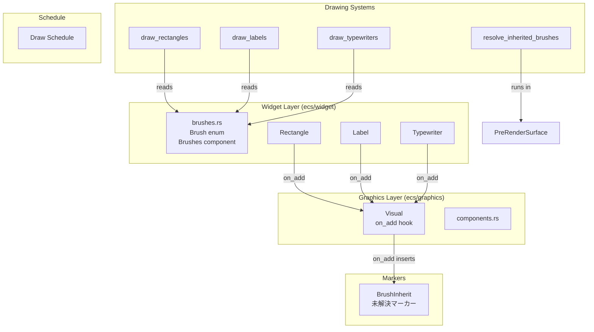
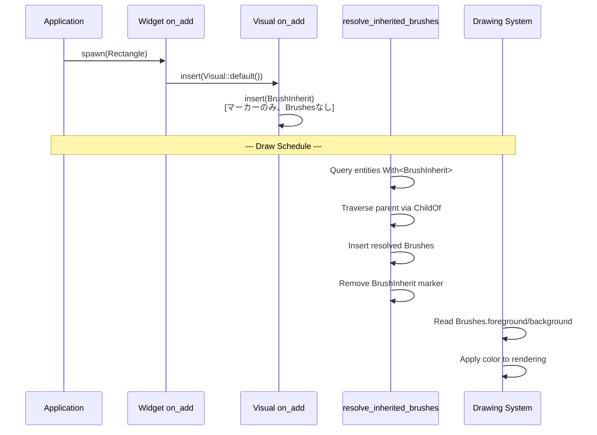
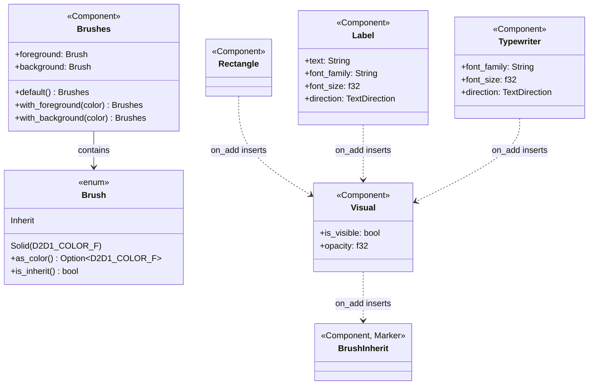

# Technical Design: brush-component-separation

## Overview

**Purpose**: 色・ブラシ関連プロパティを既存ウィジェット（Rectangle, Label, Typewriter）から分離し、独立したECSコンポーネント`Brushes`として統合する。これにより、コードの一貫性・再利用性・保守性を向上させる。

**Users**: wintfライブラリを使用するアプリケーション開発者。ウィジェットの色指定を統一されたAPIで行う。

**Impact**: 既存の`color`/`foreground`/`background`プロパティを持つ3ウィジェットのAPIを変更し、Brushesコンポーネントベースの色管理に移行する。

### Goals
- 色管理の統一: 全ウィジェットで一貫したBrushes APIを提供
- 将来拡張性: グラデーションブラシへの非破壊的拡張パスを確保
- 親継承: Brush::Inheritによる親ウィジェットからの色継承

### Non-Goals
- stroke（輪郭線）コンポーネント: 別仕様スコープ
- 親変更追従（動的継承更新）: 別仕様スコープ
- グラデーションブラシ実装: 将来仕様

## Architecture

### Existing Architecture Analysis

**現在の色管理**:
- `Rectangle.color`: D2D1_COLOR_F直接保持
- `Label.color`: D2D1_COLOR_F直接保持
- `Typewriter.foreground/background`: D2D1_COLOR_F直接保持
- `colors`モジュール: rectangle.rs内に6色定数

**既存パターン**:
- ウィジェットon_addでVisual自動挿入
- Visual on_addでArrangement/VisualGraphics/SurfaceGraphics自動挿入
- SparseSetストレージによる効率的なコンポーネント管理

### Architecture Pattern & Boundary Map



**Architecture Integration**:
- **Selected Pattern**: Visual on_add hook拡張（既存パターン踏襲）
- **Domain Boundaries**: Widget Layer（Brush/Brushes定義）とGraphics Layer（Visual hook）の分離維持
- **Existing Patterns Preserved**: on_add hook、SparseSet、deferred commands
- **New Components Rationale**: Brushes - 色管理の統合、Brush enum - 将来拡張性

### Technology Stack

| Layer | Choice / Version | Role in Feature | Notes |
|-------|------------------|-----------------|-------|
| ECS | bevy_ecs 0.17.2 | Component hooks, Changed filter | 既存 |
| Graphics | D2D1_COLOR_F (windows 0.62.1) | Brush::Solid内部型 | 既存 |
| Hierarchy | bevy_ecs::hierarchy::ChildOf | 親継承解決 | 既存 |

## System Flows

### Brush継承解決フロー



### 静的解決の制約

```mermaid
flowchart TD
    A[Entity Spawned] --> B{Has Brushes component?}
    B -->|No| C[Has BrushInherit marker]
    B -->|Yes| D[User-specified Brushes]
    C --> E[Draw Schedule: resolve_inherited_brushes]
    D --> E
    E --> F{Has BrushInherit?}
    F -->|No| G[Already resolved, skip]
    F -->|Yes| H{Parent has Brushes?}
    H -->|Yes| I[Copy parent's values]
    H -->|No| J[Apply default<br/>foreground=BLACK<br/>background=TRANSPARENT]
    I --> K[Insert/Update Brushes]
    J --> K
    K --> L[Remove BrushInherit marker]
    L --> M[Subsequent frames:<br/>No BrushInherit = O(0)]
```

## Requirements Traceability

| Requirement | Summary | Components | Interfaces | Flows |
|-------------|---------|------------|------------|-------|
| 1.1 | コンポーネント名Brushes | Brushes | - | - |
| 1.2 | Brush enum定義 | Brush | Inherit, Solid variants | - |
| 1.3 | 非破壊的拡張 | Brush | enum設計 | - |
| 2.1 | foreground/background | Brushes | 2プロパティ | - |
| 2.2 | None→透明扱い | Brushes, Drawing | - | 描画時 |
| 2.3 | SparseSetストレージ | Brushes | #[component] | - |
| 2.4 | Visual自動挿入なし | Brushes | on_add不要 | - |
| 3.1-3.3 | 色プロパティ除去 | Rectangle, Label, Typewriter | - | - |
| 3.4 | Visual on_addでBrushes挿入 | Visual | on_visual_add | 継承解決 |
| 3.5 | ビルダーメソッド | Rectangle, Label, Typewriter | with_foreground() | - |
| 4.1-4.3 | 描画システムBrushes参照 | draw_* systems | Query<&Brushes> | 描画フロー |
| 4.4 | resolve_inherited_brushes | resolve system | Query<&mut Brushes> | 継承解決フロー |
| 4.5 | デフォルト色適用 | resolve system | - | 継承解決フロー |
| 4.6 | Changed<Brushes>フィルタ | draw_* systems | Query filter | - |
| 5.1 | ビルダーメソッド | Widgets | with_foreground/background() | - |
| 5.2 | 色定数 | Brush | Brush::BLACK等 | - |
| 5.3 | モジュール配置 | brushes.rs | ecs::widget::brushes | - |
| 5.4 | マイグレーションドキュメント | - | - | - |
| 6.1 | enum Brush設計 | Brush | Inherit, Solid | - |
| 7.1-7.7 | テスト要件 | テストファイル | - | - |

## Components and Interfaces

### Summary

| Component | Domain/Layer | Intent | Req Coverage | Key Dependencies | Contracts |
|-----------|--------------|--------|--------------|------------------|-----------|
| Brush | Widget | ブラシ値表現（継承/単色） | 1.2, 1.3, 6.1 | D2D1_COLOR_F | State |
| Brushes | Widget | foreground/backgroundコンテナ | 1.1, 2.1-2.4 | Brush | State |
| resolve_inherited_brushes | System | Inherit解決 | 4.4, 4.5 | ChildOf, Brushes | - |
| Rectangle (修正) | Widget | 色プロパティ除去 | 3.1, 3.5 | Brushes | State |
| Label (修正) | Widget | 色プロパティ除去 | 3.2, 3.5 | Brushes | State |
| Typewriter (修正) | Widget | 色プロパティ除去 | 3.3, 3.5 | Brushes | State |

### Widget Layer

#### Brush

| Field | Detail |
|-------|--------|
| Intent | ブラシ値を表現するenum。継承マーカーまたは単色を保持 |
| Requirements | 1.2, 1.3, 6.1 |

**Responsibilities & Constraints**
- 継承マーカー（Inherit）と単色（Solid）の2バリアント
- 将来のグラデーション拡張に対応可能なenum設計
- Clone, Debug, PartialEq実装

**Dependencies**
- Inbound: Brushes — ブラシ値として使用 (P0)
- External: D2D1_COLOR_F — Solid内部型 (P0)

**Contracts**: State [x]

##### State Management

```rust
/// ブラシ値
#[derive(Clone, Debug, PartialEq)]
pub enum Brush {
    /// 親から継承（描画前に解決される）
    Inherit,
    /// 単色
    Solid(D2D1_COLOR_F),
}

impl Brush {
    // 色定数
    pub const TRANSPARENT: Self = Self::Solid(D2D1_COLOR_F { r: 0.0, g: 0.0, b: 0.0, a: 0.0 });
    pub const BLACK: Self = Self::Solid(D2D1_COLOR_F { r: 0.0, g: 0.0, b: 0.0, a: 1.0 });
    pub const WHITE: Self = Self::Solid(D2D1_COLOR_F { r: 1.0, g: 1.0, b: 1.0, a: 1.0 });
    pub const RED: Self = Self::Solid(D2D1_COLOR_F { r: 1.0, g: 0.0, b: 0.0, a: 1.0 });
    pub const GREEN: Self = Self::Solid(D2D1_COLOR_F { r: 0.0, g: 1.0, b: 0.0, a: 1.0 });
    pub const BLUE: Self = Self::Solid(D2D1_COLOR_F { r: 0.0, g: 0.0, b: 1.0, a: 1.0 });
    
    /// D2D1_COLOR_Fを取得（Inheritの場合はNone）
    pub fn as_color(&self) -> Option<D2D1_COLOR_F>;
    
    /// Inheritかどうか
    pub fn is_inherit(&self) -> bool;
}
```

#### Brushes

| Field | Detail |
|-------|--------|
| Intent | foreground/backgroundブラシを保持するECSコンポーネント |
| Requirements | 1.1, 2.1-2.4 |

**Responsibilities & Constraints**
- 2つのブラシプロパティ（foreground, background）を保持
- デフォルト値は両方ともBrush::Inherit
- SparseSetストレージ（動的追加/削除効率化）
- **オプショナル**: Visual on_addでは挿入されない（BrushInheritマーカーのみ）
- ユーザーがspawn時に明示指定、または resolve_inherited_brushes が自動挿入

**Dependencies**
- Inbound: User spawn — 明示指定 (P1)
- Inbound: resolve_inherited_brushes — 自動挿入 (P0)
- Inbound: Drawing systems — 色参照 (P0)

**Contracts**: State [x]

##### State Management

```rust
/// Brushesコンポーネント
#[derive(Component, Clone, Debug, PartialEq)]
#[component(storage = "SparseSet")]
pub struct Brushes {
    /// 前景色（テキスト、図形塗りつぶし）
    pub foreground: Brush,
    /// 背景色
    pub background: Brush,
}

impl Default for Brushes {
    fn default() -> Self {
        Self {
            foreground: Brush::Inherit,
            background: Brush::Inherit,
        }
    }
}

impl Brushes {
    /// 前景色を指定して作成
    pub fn with_foreground(color: D2D1_COLOR_F) -> Self;
    
    /// 背景色を指定して作成
    pub fn with_background(color: D2D1_COLOR_F) -> Self;
    
    /// 前景色・背景色を指定して作成
    pub fn with_colors(foreground: D2D1_COLOR_F, background: D2D1_COLOR_F) -> Self;
}
```

#### resolve_inherited_brushes System

| Field | Detail |
|-------|--------|
| Intent | BrushInheritマーカーを持つエンティティのBrushes解決 |
| Requirements | 4.4, 4.5 |

**Responsibilities & Constraints**
- Drawスケジュールで実行（bevy_ecsの順序最適化に委ねる）
- With<BrushInherit>フィルタで未解決エンティティのみ処理（O(m)、m=未解決数）
- ChildOfを辿って親のBrushes値を取得
- ルートまでBrushesがない場合はデフォルト色を適用
- Brushesコンポーネントがなければ新規挿入、あればInheritフィールドを解決
- 解決後はBrushInheritマーカーを除去

**Dependencies**
- Inbound: BrushInherit marker — 処理対象判定 (P0)
- External: ChildOf — 親エンティティ取得 (P0)
- External: Commands — Brushes挿入/BrushInherit除去 (P0)

**Contracts**: Service [x]

##### Service Interface

```rust
/// 未解決マーカー（Visual on_addで自動挿入）
#[derive(Component, Default)]
pub struct BrushInherit;

/// BrushInheritマーカーを持つエンティティのBrushesを解決するシステム
/// 
/// # 処理フロー
/// 1. With<BrushInherit>でクエリ（未解決のみ）
/// 2. Brushesがあれば Inherit フィールドのみ解決
/// 3. Brushesがなければ親から継承して新規挿入
/// 4. ルートに到達したらデフォルト値を適用
/// 5. BrushInheritマーカーを除去
fn resolve_inherited_brushes(
    mut commands: Commands,
    mut query: Query<(Entity, Option<&mut Brushes>), With<BrushInherit>>,
    parent_query: Query<&ChildOf>,
    all_brushes: Query<&Brushes>,
);

// デフォルト値
const DEFAULT_FOREGROUND: Brush = Brush::BLACK;
const DEFAULT_BACKGROUND: Brush = Brush::TRANSPARENT;
```

### Widget Modifications

#### Rectangle (修正)

| Field | Detail |
|-------|--------|
| Intent | 色プロパティを除去し、Brushesベースに移行 |
| Requirements | 3.1, 3.5 |

**Changes**
- 除去: `pub color: Color`
- 除去: `colors`サブモジュール（brushes.rsに移動）
- 追加: `new()`コンストラクタ

**決定事項（議題7）**: ビルダーメソッドではなくBrushes別途指定方式を採用。シンプルさ優先、追加型不要。

```rust
#[derive(Component, Debug, Clone)]
#[component(on_add = on_rectangle_add, on_remove = on_rectangle_remove)]
pub struct Rectangle {
    // colorフィールド削除（フィールドなし）
}

impl Rectangle {
    /// 新しいRectangleを作成
    pub fn new() -> Self { Self {} }
}

// 使用例
world.spawn((
    Rectangle::new(),
    Brushes::with_foreground(Brush::RED),  // 別途指定
    BoxStyle { ... },
));
```

#### Label (修正)

| Field | Detail |
|-------|--------|
| Intent | 色プロパティを除去し、Brushesベースに移行 |
| Requirements | 3.2, 3.5 |

**Changes**
- 除去: `pub color: Color`

**決定事項（議題7）**: ビルダーメソッドではなくBrushes別途指定方式を採用。

```rust
#[derive(Component)]
#[component(storage = "SparseSet", on_add = on_label_add, on_remove = on_label_remove)]
pub struct Label {
    pub text: String,
    pub font_family: String,
    pub font_size: f32,
    // color削除
    pub direction: TextDirection,
}

// 使用例
world.spawn((
    Label {
        text: "Hello".to_string(),
        font_family: "メイリオ".to_string(),
        font_size: 16.0,
        direction: TextDirection::default(),
    },
    Brushes::with_foreground(Brush::BLACK),  // 別途指定
));
```

#### Typewriter (修正)

| Field | Detail |
|-------|--------|
| Intent | 色プロパティを除去し、Brushesベースに移行 |
| Requirements | 3.3, 3.5 |

**Changes**
- 除去: `pub foreground: Color`
- 除去: `pub background: Option<Color>`

**決定事項（議題7）**: ビルダーメソッドではなくBrushes別途指定方式を採用。

```rust
#[derive(Component)]
#[component(storage = "SparseSet", on_add = on_typewriter_add)]
pub struct Typewriter {
    pub font_family: String,
    pub font_size: f32,
    // foreground, background 削除
    pub direction: TextDirection,
    pub default_char_wait: f64,
    // ... その他フィールド
}

// 使用例
world.spawn((
    Typewriter {
        font_family: "メイリオ".to_string(),
        font_size: 18.0,
        direction: TextDirection::HorizontalLeftToRight,
        default_char_wait: 0.15,
        ..Default::default()
    },
    Brushes::with_colors(Brush::Solid(fg_color), Brush::Solid(bg_color)),  // 別途指定
));
```

### Drawing System Modifications

#### draw_rectangles

```rust
// 変更前
fn draw_rectangles(query: Query<(&Rectangle, &Arrangement)>) {
    let color = rectangle.color;
}

// 変更後
fn draw_rectangles(query: Query<(&Rectangle, &Arrangement, &Brushes)>) {
    let color = brushes.foreground.as_color().unwrap_or(DEFAULT_FOREGROUND_COLOR);
}
```

#### draw_labels

```rust
// 変更前
fn draw_labels(query: Query<(&Label, ...)>) {
    let color = label.color;
}

// 変更後
fn draw_labels(query: Query<(&Label, &Brushes, ...)>) {
    let color = brushes.foreground.as_color().unwrap_or(DEFAULT_FOREGROUND_COLOR);
}
```

#### draw_typewriters

```rust
// 変更前
fn draw_typewriters(query: Query<(&Typewriter, ...)>) {
    let fg = typewriter.foreground;
    let bg = typewriter.background;
}

// 変更後
fn draw_typewriters(query: Query<(&Typewriter, &Brushes, ...)>) {
    let fg = brushes.foreground.as_color().unwrap_or(DEFAULT_FOREGROUND_COLOR);
    let bg = brushes.background.as_color(); // Noneなら描画しない
}
```

## Data Models

### Domain Model



## Error Handling

### Error Strategy

- **BrushInherit未解決**: resolve_inherited_brushesで必ず解決。解決失敗時はデフォルト色適用
- **Brushesコンポーネント欠落**: BrushInheritマーカーがあればresolve_inherited_brushesが自動挿入。マーカーもなければ描画スキップ

### Error Categories and Responses

**System Errors**:
- 親エンティティ参照失敗 → ルートとして扱いデフォルト色適用
- Brushesクエリ失敗 → 描画スキップ（ウィジェット非表示）

## Testing Strategy

### Unit Tests
- `Brush::as_color()`: Inherit→None、Solid→Some(color)
- `Brush::is_inherit()`: 各バリアントの判定
- `Brushes::default()`: 両プロパティがInherit
- `Brushes::with_foreground/background`: 正しい値設定

### Integration Tests
- `resolve_inherited_brushes`: 親継承の正しい解決
- `resolve_inherited_brushes`: ルートでのデフォルト色適用
- `resolve_inherited_brushes`: 多階層継承の正しい解決
- Visual on_add: Brushes自動挿入確認

### E2E Tests
- Rectangle描画: Brushes.foreground色で描画確認
- Label描画: Brushes.foreground色で描画確認
- Typewriter描画: foreground/background両方の色確認
- 親子ウィジェット: 子がInheritで親の色を継承

## Migration Strategy

### Phase 1: 新規コンポーネント追加
1. `ecs/widget/brushes.rs`作成
2. `Brush` enum、`Brushes`コンポーネント実装
3. `widget/mod.rs`でexport

### Phase 2: Visual Hook拡張
1. `BrushInherit`マーカーコンポーネント追加
2. `on_visual_add`にBrushInherit挿入追加（Brushesは挿入しない）
3. `resolve_inherited_brushes`システム追加
4. Drawスケジュールに登録（順序はbevy_ecsに委ねる）

### Phase 3: ウィジェット修正
1. Rectangle: color除去、with_foreground追加
2. Label: color除去、with_foreground追加
3. Typewriter: foreground/background除去、with_colors追加

### Phase 4: 描画システム修正
1. draw_rectangles: Brushes参照に変更
2. draw_labels: Brushes参照に変更
3. draw_typewriters: Brushes参照に変更

### Phase 5: Examples/Tests更新
1. typewriter_demo.rs: 新API使用
2. taffy_flex_demo.rs: 新API使用
3. 既存テスト修正

### Rollback Triggers
- cargo test失敗
- 描画結果の視覚的異常
- コンパイルエラー

## Supporting References

詳細な調査結果は `research.md` を参照:
- 既存コンポーネントフックパターン分析
- スケジュール構造分析
- 親階層参照方法
