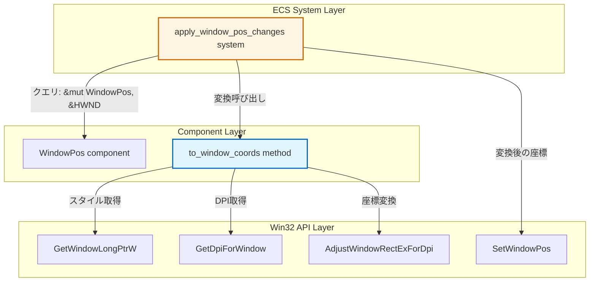
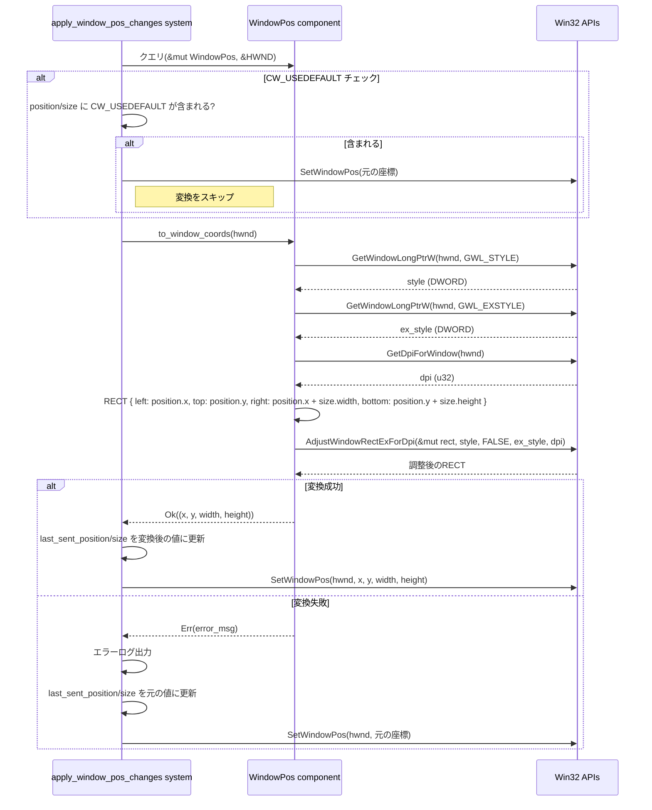

# Design Document: client-area-positioning

## Overview

本機能は、`apply_window_pos_changes`システムが`SetWindowPos` Win32 APIを呼び出す際に、`WindowPos`コンポーネントの座標・サイズを「クライアント領域基準」から「ウィンドウ全体基準」へ変換する機能を追加するものである。現状、`WindowPos::position`と`WindowPos::size`はクライアント領域の座標・サイズとして扱われることを意図しているが、`SetWindowPos` APIはウィンドウ全体（タイトルバーやボーダーを含む矩形）の座標・サイズを要求するため、意図した位置にウィンドウが配置されない問題が発生している。

本設計では、`WindowPos`コンポーネントに`to_window_coords`メソッドを追加し、`AdjustWindowRectExForDpi` APIを用いてクライアント領域からウィンドウ全体への座標・サイズ変換を行う。この変換ロジックは`apply_window_pos_changes`システム内で呼び出され、変換後の値が`SetWindowPos`に渡される。エコーバックメカニズムは変換後の値を記録することで維持され、既存のウィンドウメッセージハンドリングへの影響を最小限に抑える。

## Goals / Non-Goals

### Goals
- `WindowPos::position`/`size`がクライアント領域の座標・サイズとして正しく機能すること
- ウィンドウスタイル（`WS_CAPTION`, `WS_THICKFRAME`等）とDPI値に応じた正確な座標変換を実装すること
- 既存のエコーバックメカニズムを破壊せず、`WM_WINDOWPOSCHANGED`による座標更新検知が正常に動作すること
- `CW_USEDEFAULT`特殊値を含む座標・サイズに対して変換をスキップすること

### Non-Goals
- `WM_DPICHANGED`イベントへの対応（将来的な拡張として別仕様で実装）
- `DpiTransform`コンポーネントの自動付与（本機能では`GetDpiForWindow` APIを直接使用）
- ウィンドウ作成時の初期座標を自動調整する機能（ユーザーが明示的に`WindowPos`を設定した場合のみ変換）

## Architecture

### Existing Architecture Analysis
本機能は既存のECSアーキテクチャに統合される拡張機能である。主な変更点は以下の通り：

- **変更対象ファイル1**: `crates/wintf/src/ecs/window.rs`  
  `WindowPos`コンポーネントに`to_window_coords(hwnd: HWND) -> Result<(i32, i32, i32, i32), String>`メソッドを追加する。このメソッドは`AdjustWindowRectExForDpi` APIを呼び出し、クライアント領域の矩形からウィンドウ全体の矩形を計算する。

- **変更対象ファイル2**: `crates/wintf/src/ecs/graphics/systems.rs`  
  `apply_window_pos_changes`システム内で、`SetWindowPos`呼び出し前に`WindowPos::to_window_coords`を呼び出し、変換後の座標・サイズを使用する。エラー時はフォールバック処理（元の座標・サイズで`SetWindowPos`を呼び出し）を行い、エラーログを出力する。

- **既存パターンの活用**:  
  `win_state.rs`の`effective_window_size`メソッドが既に`AdjustWindowRectExForDpi`を使用したサイズ変換を実装している。本機能では同様のパターンを`WindowPos`に統合し、座標変換を追加する。

### Architecture Pattern & Boundary Map



**境界定義**:
- **ECS System Layer**: `apply_window_pos_changes`が座標変換の呼び出しを担当。変換結果を`SetWindowPos`に渡す責務を持つ。
- **Component Layer**: `WindowPos`が座標変換ロジックをカプセル化。Win32 APIとの直接的なインタラクションを隠蔽する。
- **Win32 API Layer**: `GetWindowLongPtrW`でスタイル情報、`GetDpiForWindow`でDPI値、`AdjustWindowRectExForDpi`で座標変換を行う。

## Technology Stack

| Component | Technology | Version | Notes |
|-----------|-----------|---------|-------|
| Win32 API | `AdjustWindowRectExForDpi` | Windows 10 1607+ | クライアント領域→ウィンドウ全体の矩形変換 |
| Win32 API | `GetDpiForWindow` | Windows 10 1607+ | ウィンドウのDPI値取得 |
| Win32 API | `GetWindowLongPtrW` | Windows 2000+ | ウィンドウスタイル情報取得（`GWL_STYLE`, `GWL_EXSTYLE`） |
| Win32 API | `SetWindowPos` | Windows 2000+ | ウィンドウ位置・サイズ設定 |
| Rust Crate | `windows` | 0.62.2 | Win32 APIバインディング |
| Rust Crate | `bevy_ecs` | 0.17.2 | Entity Component System framework |
| wintf Component | `BoxPosition` | - | Relative/Absolute配置モード |
| wintf Component | `BoxInset` | - | 絶対配置のinset座標（left/top/right/bottom） |

## System Flows

### 座標変換フロー



## Requirements Traceability

| Requirement ID | Related Components | Implementation Notes |
|---------------|-------------------|---------------------|
| REQ-1: 座標調整 | `WindowPos::to_window_coords`, `apply_window_pos_changes` | `to_window_coords`で`AdjustWindowRectExForDpi`を呼び出し、システム内で結果を`SetWindowPos`に渡す |
| REQ-2: スタイル情報取得 | `WindowPos::to_window_coords` | `GetWindowLongPtrW`で`GWL_STYLE`/`GWL_EXSTYLE`を取得、`GetDpiForWindow`でDPI値を取得 |
| REQ-3: エラーハンドリング | `apply_window_pos_changes` | 変換失敗時に元の座標でフォールバック、エラーログ出力 |
| REQ-4: CW_USEDEFAULT対応 | `apply_window_pos_changes` | 既存の`CW_USEDEFAULT`チェックを変換前に実行、該当する場合は変換をスキップ |
| REQ-5: テストアプリ動作確認 | `taffy_flex_demo` | `BoxSize`コンポーネントでレイアウト入力を設定し、レイアウトシステムの計算結果が`GlobalArrangement`→`update_window_pos_system`→`WindowPos`→`apply_window_pos_changes`の経路で座標変換されることを確認。明示的なウィンドウ位置指定には`BoxPosition::Absolute` + `BoxInset`を使用可能 |

## Components & Interfaces

### Summary

| Component | Type | Purpose |
|-----------|------|---------|
| `WindowPos::to_window_coords` | メソッド | クライアント領域座標をウィンドウ全体座標に変換 |
| `apply_window_pos_changes` | ECS System | `WindowPos`の変更を検知し、`SetWindowPos`を呼び出す（変換ロジック統合） |

### Component: WindowPos::to_window_coords

**Location**: `crates/wintf/src/ecs/window.rs`

**Interface**:
```rust
impl WindowPos {
    /// クライアント領域の座標・サイズをウィンドウ全体の座標・サイズに変換する。
    ///
    /// # Arguments
    /// * `hwnd` - 変換対象のウィンドウハンドル
    ///
    /// # Returns
    /// * `Ok((x, y, width, height))` - 変換後のウィンドウ全体座標（左上x, 左上y, 幅, 高さ）
    /// * `Err(String)` - Win32 API呼び出し失敗時のエラーメッセージ
    ///
    /// # Notes
    /// - `AdjustWindowRectExForDpi`を使用して、ウィンドウスタイルとDPIに基づく変換を行う
    /// - `GetWindowLongPtrW`でスタイル情報、`GetDpiForWindow`でDPI値を取得する
    pub fn to_window_coords(&self, hwnd: HWND) -> Result<(i32, i32, i32, i32), String> {
        // Implementation details (see below)
    }
}
```

**Responsibilities**:
- `GetWindowLongPtrW(hwnd, GWL_STYLE)`でウィンドウスタイルを取得
- `GetWindowLongPtrW(hwnd, GWL_EXSTYLE)`で拡張スタイルを取得
- `GetDpiForWindow(hwnd)`でDPI値を取得
- `AdjustWindowRectExForDpi`を呼び出し、クライアント領域矩形をウィンドウ全体矩形に変換
- 変換後の座標・サイズを`(x, y, width, height)`タプルとして返す
- Win32 API呼び出し失敗時にエラーメッセージを返す

**Dependencies**:
- Win32 APIs: `GetWindowLongPtrW`, `GetDpiForWindow`, `AdjustWindowRectExForDpi`
- `windows` crate: `HWND`, `RECT`, `GWL_STYLE`, `GWL_EXSTYLE`

### Component: apply_window_pos_changes (Modified)

**Location**: `crates/wintf/src/ecs/graphics/systems.rs`

**Interface**:
```rust
pub fn apply_window_pos_changes(
    mut window_query: Query<(&HWND, &mut WindowPos), Changed<WindowPos>>
) {
    // Existing echo-back check
    // Existing CW_USEDEFAULT check
    
    // NEW: Coordinate transformation
    let (x, y, width, height) = match window_pos.to_window_coords(*hwnd) {
        Ok(coords) => coords,
        Err(e) => {
            eprintln!("Failed to transform window coordinates: {}. Using original values.", e);
            (pos.x, pos.y, size.width, size.height)
        }
    };
    
    // Update last_sent_* with transformed values
    window_pos.last_sent_position = Some((x, y));
    window_pos.last_sent_size = Some((width, height));
    
    // Call SetWindowPos with transformed values
    unsafe {
        SetWindowPos(*hwnd, HWND(0), x, y, width, height, flags);
    }
}
```

**Responsibilities**:
- `WindowPos`コンポーネントの変更を検知
- エコーバック判定（既存ロジック維持）
- `CW_USEDEFAULT`チェック（既存ロジック維持）
- **NEW**: `WindowPos::to_window_coords`を呼び出して座標変換
- **NEW**: 変換失敗時のフォールバック処理とエラーログ出力
- **MODIFIED**: `last_sent_position`/`last_sent_size`を変換後の値で更新
- `SetWindowPos`に変換後の座標・サイズを渡す

**Dependencies**:
- `WindowPos::to_window_coords`メソッド
- Win32 API: `SetWindowPos`

## Data Models

### Domain Model

**概念レベル**:
- **クライアント領域座標**: ユーザーが設定する座標・サイズ。タイトルバーやボーダーを含まない、コンテンツ描画領域の座標。
- **ウィンドウ全体座標**: Win32 APIが要求する座標・サイズ。タイトルバーやボーダーを含むウィンドウ全体の矩形。
- **座標変換**: クライアント領域座標からウィンドウ全体座標への変換。ウィンドウスタイルとDPIに依存する。
- **レイアウトシステムフロー**: `BoxSize`/`BoxPosition`/`BoxInset`（レイアウト入力）→ `TaffyStyle`（taffy設定）→ `TaffyComputedLayout`（taffy計算結果）→ `Arrangement`（ローカル配置）→ `GlobalArrangement`（グローバル累積変換）→ `WindowPos`（ウィンドウ位置・サイズ）→ 座標変換 → `SetWindowPos`（Win32 API呼び出し）
- **絶対配置**: `BoxPosition::Absolute` + `BoxInset`により、ウィンドウの絶対スクリーン座標を指定可能（Monitorエンティティで実証済み）

### Logical Model

**Rust型定義**:

```rust
// 既存の WindowPos コンポーネント (window.rs:174-226)
#[derive(Component, Debug, Clone)]
pub struct WindowPos {
    pub position: POINT,  // クライアント領域の左上座標（GlobalArrangementから更新される）
    pub size: SIZE,       // クライアント領域のサイズ（GlobalArrangementから更新される）
    pub last_sent_position: Option<(i32, i32)>,  // エコーバック検知用（変換後の値を記録）
    pub last_sent_size: Option<(i32, i32)>,      // エコーバック検知用（変換後の値を記録）
    // ...
}

// 新規メソッド
impl WindowPos {
    pub fn to_window_coords(&self, hwnd: HWND) -> Result<(i32, i32, i32, i32), String> {
        // Returns: (window_x, window_y, window_width, window_height)
    }
}

// レイアウトシステムの座標フロー
// BoxSize, BoxPosition, BoxInset (layout input) 
//   ↓ build_taffy_styles_system
// TaffyStyle
//   ↓ update_taffy_layout
// TaffyComputedLayout 
//   ↓ sync_simple_arrangements
// Arrangement (local)
//   ↓ propagate_global_arrangements
// GlobalArrangement (global)
//   ↓ update_window_pos_system
// WindowPos (client area coords)
//   ↓ to_window_coords (NEW)
// Window coords (for SetWindowPos)

// 絶対配置の例（Monitorエンティティで使用）:
// BoxPosition::Absolute + BoxInset { left: Px(100), top: Px(100), ... }
//   → TaffyStyle.position = Position::Absolute
//   → TaffyStyle.inset = Rect { left: 100px, top: 100px, ... }
```

**データフロー**:
1. `BoxSize`/`BoxPosition`/`BoxInset`等 ← レイアウト入力（ユーザー設定）
2. `build_taffy_styles_system` → `TaffyStyle`（taffy設定への変換）
3. レイアウトシステム → `GlobalArrangement`（階層的な累積変換）
4. `update_window_pos_system` → `WindowPos::position`/`size`（クライアント領域基準）
5. `to_window_coords` → `AdjustWindowRectExForDpi` → 変換後の座標・サイズ（ウィンドウ全体基準）
6. 変換後の値 → `last_sent_position`/`last_sent_size`（エコーバック検知用）
7. 変換後の値 → `SetWindowPos`（Win32 API呼び出し）

### Physical Model

**Win32 API構造体マッピング**:

```rust
// windows crate の型定義
pub struct POINT {
    pub x: i32,
    pub y: i32,
}

pub struct SIZE {
    pub width: i32,
    pub height: i32,
}

pub struct RECT {
    pub left: i32,
    pub top: i32,
    pub right: i32,
    pub bottom: i32,
}

// 変換処理
let mut rect = RECT {
    left: self.position.x,
    top: self.position.y,
    right: self.position.x + self.size.width,
    bottom: self.position.y + self.size.height,
};

unsafe {
    AdjustWindowRectExForDpi(&mut rect, style, FALSE, ex_style, dpi);
}

let window_x = rect.left;
let window_y = rect.top;
let window_width = rect.right - rect.left;
let window_height = rect.bottom - rect.top;
```

## Error Handling

### エラーシナリオと対応

| Error Scenario | Detection | Handling | Recovery |
|---------------|-----------|----------|----------|
| `GetWindowLongPtrW`失敗 | 戻り値が0かつ`GetLastError`が非ゼロ | `to_window_coords`が`Err`を返す | フォールバック: 元の座標で`SetWindowPos`呼び出し、エラーログ出力 |
| `GetDpiForWindow`失敗 | 戻り値が0 | `to_window_coords`が`Err`を返す | フォールバック: 元の座標で`SetWindowPos`呼び出し、エラーログ出力 |
| `AdjustWindowRectExForDpi`失敗 | 戻り値が`FALSE` | `to_window_coords`が`Err`を返す | フォールバック: 元の座標で`SetWindowPos`呼び出し、エラーログ出力 |

**エラーメッセージフォーマット**:
```rust
Err(format!(
    "GetWindowLongPtrW(GWL_STYLE) failed for HWND {:?}: error code {}",
    hwnd, GetLastError()
))
```

**ログ出力例**:
```
Failed to transform window coordinates: AdjustWindowRectExForDpi returned FALSE for HWND 0x12345678. Using original values.
```

### ユーザー体験への影響
- 座標変換失敗時でも、ウィンドウは元の座標（クライアント領域基準）で配置されるため、完全な機能停止は発生しない
- エラーログにより、開発者は問題を検知できる
- 本番環境では、ウィンドウスタイルとDPIが正常に取得できる限り、変換失敗は発生しない想定

## Testing Strategy

### 単体テスト

**テストケース1: `to_window_coords`の正常系**
- テスト対象: `WindowPos::to_window_coords`メソッド
- 条件: ウィンドウスタイル=`WS_OVERLAPPEDWINDOW`、DPI=96、クライアント領域=(100, 100, 800, 600)
- 期待結果: ウィンドウ全体座標が正しく計算される（タイトルバー・ボーダーの高さ・幅が加算される）

**テストケース2: `to_window_coords`のエラーハンドリング**
- テスト対象: `WindowPos::to_window_coords`メソッド
- 条件: 無効なHWND（`HWND(0)`）を渡す
- 期待結果: `Err`が返され、エラーメッセージが適切に設定される

**テストケース3: `CW_USEDEFAULT`のスキップ**
- テスト対象: `apply_window_pos_changes`システム
- 条件: `WindowPos::position.x = CW_USEDEFAULT`
- 期待結果: 座標変換が呼び出されず、`SetWindowPos`に元の値が渡される

### 統合テスト

**テストケース4: エコーバックメカニズムの維持**
- テスト対象: `apply_window_pos_changes` + `WM_WINDOWPOSCHANGED`ハンドラー
- 条件: `WindowPos`を更新してウィンドウを移動、`WM_WINDOWPOSCHANGED`を受信
- 期待結果: `is_echo`が`true`を返し、重複した`SetWindowPos`呼び出しが発生しない

**テストケース5: DPI=144での座標変換**
- テスト対象: `to_window_coords` + `apply_window_pos_changes`
- 条件: 高DPI環境（DPI=144）でウィンドウを作成、クライアント領域=(100, 100, 800, 600)を設定
- 期待結果: ウィンドウ全体のサイズがDPIスケーリングに応じて正しく計算される

### E2Eテスト

**テストケース6: `taffy_flex_demo`での動作確認**
- テスト対象: `taffy_flex_demo`アプリケーション
- 条件: `BoxSize { width: Some(Dimension::Px(800.0)), height: Some(Dimension::Px(600.0)) }`でレイアウトルートを設定し、レイアウトシステムによる座標計算を経て`GlobalArrangement`→`WindowPos`への変換が行われる
- 期待結果: レイアウトシステムが計算した`GlobalArrangement`から`update_window_pos_system`で`WindowPos`が更新され、`apply_window_pos_changes`で座標変換が実行される。ウィンドウがタイトルバーを含めて画面内に正しく表示され、クライアント領域が意図した位置・サイズで配置される
- 補足: `taffy_flex_demo`では初期化時に`WindowPos`を直接設定しているが、これは一時的な初期値であり、実際の座標はレイアウトシステム（`BoxSize`→`TaffyComputedLayout`→`Arrangement`→`GlobalArrangement`→`WindowPos`）を経由して反映される
- 拡張テスト: `BoxPosition::Absolute` + `BoxInset { left: Px(100), top: Px(100), ... }`を追加することで、明示的なウィンドウ位置指定が可能（Monitorエンティティで実証済みパターン）

**テストケース7: マルチモニター環境での動作**
- テスト対象: 複数モニターでウィンドウを移動
- 条件: プライマリモニター（DPI=96）からセカンダリモニター（DPI=144）へウィンドウを移動
- 期待結果: 座標変換が各モニターのDPIに応じて正しく動作する（`GetDpiForWindow`が現在のモニターのDPIを返すことを前提）

## Security Considerations

### Win32 API呼び出しの安全性
- **脅威**: 無効なHWNDを渡すことによるメモリアクセス違反
- **対策**: `GetWindowLongPtrW`/`GetDpiForWindow`のエラーチェックを実装し、失敗時に`Err`を返す
- **影響**: エラーハンドリングにより、クラッシュを回避しフォールバック処理を実行

### unsafeブロックの最小化
- **原則**: Win32 API呼び出しは必然的に`unsafe`だが、unsafeブロックの範囲を最小限に保つ
- **実装**: `to_window_coords`メソッド内でunsafeブロックを局所化し、呼び出し元（`apply_window_pos_changes`）はsafeなインターフェイスを使用

### DPI値の検証
- **脅威**: `GetDpiForWindow`が0を返す異常なケース
- **対策**: DPI=0の場合に`Err`を返し、フォールバック処理を実行
- **影響**: 異常な入力によるゼロ除算やオーバーフローを防止

## Implementation Phases

### Phase 1: `WindowPos::to_window_coords`メソッド実装
- **タスク1**: `window.rs`に`to_window_coords`メソッドを追加
- **タスク2**: `GetWindowLongPtrW`, `GetDpiForWindow`, `AdjustWindowRectExForDpi`を呼び出し
- **タスク3**: エラーハンドリングとテスト可能なインターフェイス設計
- **成果物**: 単体テスト可能な座標変換ロジック

### Phase 2: `apply_window_pos_changes`システム統合
- **タスク4**: `apply_window_pos_changes`内で`to_window_coords`を呼び出し
- **タスク5**: `last_sent_position`/`last_sent_size`を変換後の値で更新
- **タスク6**: フォールバック処理とエラーログ追加
- **成果物**: エコーバックメカニズムが維持された統合システム

### Phase 3: テストとE2E検証
- **タスク7**: 単体テスト実装（`to_window_coords`の正常系・異常系）
- **タスク8**: 統合テスト実装（エコーバック、DPI変化）
- **タスク9**: `taffy_flex_demo`での動作確認
- **成果物**: 全要件を満たす検証済み機能

## Risks & Mitigations

| Risk | Likelihood | Impact | Mitigation |
|------|-----------|--------|------------|
| `GetDpiForWindow`がウィンドウ作成直後に不正な値を返す | Low | Medium | 単体テストで検証、fallback to `GetDpiForSystem()`を検討 |
| マルチモニター環境でのDPI変化時の座標ずれ | Medium | Low | 既知の制約として文書化、将来的に`WM_DPICHANGED`対応を実装 |
| タイトルバーなしウィンドウ（WS_POPUP）での変換の挙動 | Low | Low | `taffy_flex_demo`に加えてWS_POPUPスタイルのテストケースを追加 |
| エコーバック判定が誤作動する | Low | High | 統合テストでエコーバックメカニズムを検証、`last_sent_*`記録値を確認 |

## References
- [AdjustWindowRectExForDpi - Microsoft Learn](https://learn.microsoft.com/en-us/windows/win32/api/winuser/nf-winuser-adjustwindowrectexfordpi)
- [GetDpiForWindow - Microsoft Learn](https://learn.microsoft.com/en-us/windows/win32/api/winuser/nf-winuser-getdpiforwindow)
- [SetWindowPos - Microsoft Learn](https://learn.microsoft.com/en-us/windows/win32/api/winuser/nf-winuser-setwindowpos)
- [GetWindowLongPtrW - Microsoft Learn](https://learn.microsoft.com/en-us/windows/win32/api/winuser/nf-winuser-getwindowlongptrw)
- Gap Analysis: `.kiro/specs/client-area-positioning/gap-analysis.md`
- Research Log: `.kiro/specs/client-area-positioning/research.md`
