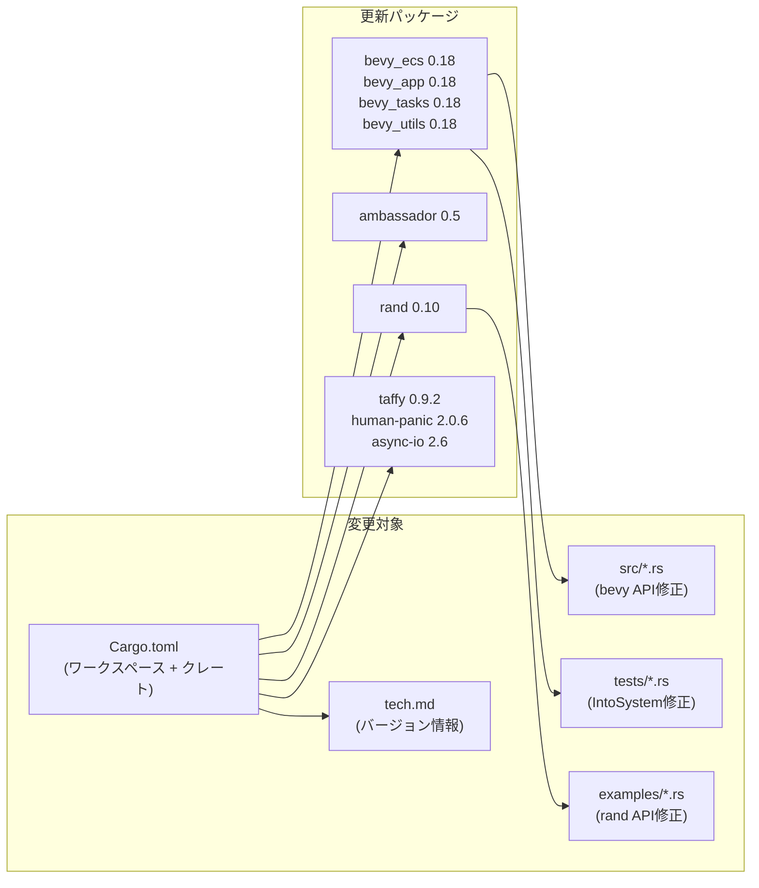
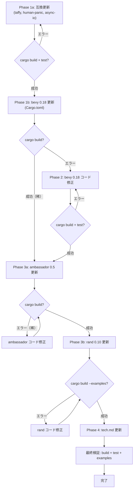

# Design Document: deps-update

## Overview

**Purpose**: wintf ワークスペースの全依存パッケージを最新安定バージョンに更新し、破壊的変更に対応するコード修正を実施する。セキュリティ修正・バグ修正・最新機能の恩恵を受けるとともに、技術的負債の蓄積を防止する。

**Users**: wintf の開発者が、最新の bevy_ecs 0.18・ambassador 0.5・rand 0.10 等のAPIを利用して開発を継続できる。

**Impact**: `Cargo.toml`（ワークスペースルート＋クレート固有）のバージョン指定変更、および bevy 0.18 / rand 0.10 のAPI変更に伴うソースコード修正。アーキテクチャ変更は伴わない。

### Goals
- ワークスペース全依存パッケージを最新安定バージョンに更新する
- 破壊的変更に対応するコード修正を実施し、ビルド・テスト・サンプルを全て通す
- ステアリングドキュメント（`tech.md`）のバージョン情報を整合させる

### Non-Goals
- 新機能の追加や既存APIの変更（依存更新に必要な最小限の修正のみ）
- bevy 0.18 の新機能（Immutable Components 等）の積極的採用
- submodules/pasta の依存更新（別リポジトリで管理）

## Architecture

### Existing Architecture Analysis

本プロジェクトは bevy の ECS サブシステム（bevy_ecs, bevy_app, bevy_tasks, bevy_utils）をスタンドアロンで使用しており、bevy のレンダリング・UI・アセット等のサブシステムは一切使用していない。この特性により、bevy 0.18 の破壊的変更の大部分（30+項目中25+項目）は本プロジェクトに影響しない。

**維持すべきパターン**:
- bevy_ecs のスタンドアロンECS使用（`bevy_ecs::prelude::*` 経由）
- ambassador によるトレイト委譲パターン（`delegatable_trait`, `Delegate`）
- Rust 2024 Edition のモジュール解決規則

**既存の技術的制約**:
- bevy_ecs の内部モジュールパスを一部直接参照（`lifecycle::HookContext`, `component::Mutable` 等）
- テストコードで `IntoSystem::into_system()` を明示的に使用

### Architecture Pattern & Boundary Map

アーキテクチャパターンの変更なし。既存のECSベースアーキテクチャを維持したまま、依存パッケージのバージョンのみを更新する。

### Technology Stack

| Layer | Choice / Version | Role in Feature | Notes |
|-------|------------------|-----------------|-------|
| ECS | bevy_ecs 0.17.2 → **0.18.0** | コアECSフレームワーク | 破壊的変更あり（影響限定的） |
| App Framework | bevy_app 0.17.2 → **0.18.0** | アプリケーションランナー | bevy_ecs に追従 |
| Task Runtime | bevy_tasks 0.17.2 → **0.18.0** | 非同期タスク実行 | bevy_ecs に追従 |
| Utilities | bevy_utils 0.17.2 → **0.18.0** | ユーティリティ集 | bevy_ecs に追従 |
| Trait Delegation | ambassador 0.4.2 → **0.5.0** | トレイト委譲マクロ | API互換の見込み |
| Layout | taffy 0.9.1 → **0.9.2** | Flexboxレイアウト | パッチ更新 |
| Error Handling | human-panic 2.0.3 → **2.0.6** | パニックハンドラ | パッチ更新 |
| Async I/O | async-io 2.3 → **2.6** | 非同期I/O | マイナー更新 |
| Random (dev) | rand 0.9.2 → **0.10.0** | サンプルコード用乱数 | 破壊的変更あり |

## Requirements Traceability

| Requirement | Summary | Components | Interfaces | Flows |
|-------------|---------|------------|------------|-------|
| R1 (1.1-1.3) | ワークスペース依存の最新化 | Phase 1a, 1b, 3a, 3b: Cargo.toml 段階的更新 | `[workspace.dependencies]`, crate-level `Cargo.toml` | 1a → 1b → 2 → 3a → 3b |
| R2 (2.1-2.3) | ビルド成功の保証 | Phase 2: bevy API修正, Phase 3b: rand修正 | src/, tests/, examples/ のRustコード | コンパイル駆動修正ループ |
| R3 (3.1-3.3) | テスト・サンプル通過の保証 | Phase 1a, 2, 3b: テスト・サンプル検証 | tests/*.rs, examples/*.rs | 各Phase末のテスト検証 |
| R4 (4.1) | ステアリング情報の整合性維持 | Phase 4: tech.md更新 | `.kiro/steering/tech.md` | 最終Phase |

## Components and Interfaces

| Component | Domain/Layer | Intent | Req Coverage | Key Dependencies | Contracts |
|-----------|--------------|--------|--------------|------------------|-----------|
| Phase 1a: 互換更新 | Build Config | 互換パッケージ（taffy, human-panic, async-io）を先行更新 | R1 | なし | Cargo.toml |
| Phase 1b: bevy更新 | Build Config | bevy 系パッケージを更新 | R1 | Phase 1a (P0) | Cargo.toml |
| Phase 2: bevy 0.18 コード修正 | ECS/Core | bevy API変更に対応するコード修正 | R2, R3 | Phase 1b (P0) | src/, tests/ |
| Phase 3a: ambassador更新 | Build Config | ambassador 0.5 に更新 | R1 | Phase 2 (P0) | Cargo.toml |
| Phase 3b: rand更新 | Build Config | rand 0.10 に更新 | R1 | Phase 3a (P0) | Cargo.toml |
| Phase 4: ドキュメント更新 | Docs | ステアリング tech.md のバージョン同期 | R4 | Phase 3b (P0) | tech.md |

### Phase 1a: 互換更新（Build Config）

| Field | Detail |
|-------|--------|
| Intent | 破壊的変更のない互換パッケージを先行更新し、安全な基盤を確保 |
| Requirements | R1 (1.1, 1.2) |

**更新対象パッケージ**

| パッケージ | 現行 | 更新先 | 分類 | 更新箇所 |
|---|---|---|---|---|
| taffy | 0.9.1 | 0.9.2 | パッチ | workspace deps |
| human-panic | 2.0.3 | 2.0.6 | パッチ | workspace deps |
| async-io | 2.3 | 2.6 | マイナー | crate deps |

**検証**: `cargo build` および `cargo test` が成功することを確認

### Phase 1b: bevy更新（Build Config）

| Field | Detail |
|-------|--------|
| Intent | bevy 系パッケージを 0.18.0 に更新 |
| Requirements | R1 (1.3) |

**更新対象パッケージ**

| パッケージ | 現行 | 更新先 | 分類 | 更新箇所 |
|---|---|---|---|---|
| bevy_ecs | 0.17.2 | 0.18.0 | 破壊的 | workspace deps |
| bevy_app | 0.17.2 | 0.18.0 | 破壊的 | workspace deps |
| bevy_tasks | 0.17.2 | 0.18.0 | 破壊的 | workspace deps |
| bevy_utils | 0.17.2 | 0.18.0 | 破壊的 | workspace deps |

**注意**: bevy 系クレートは全て同一バージョンで統一（0.18.0）

**検証**: `cargo build` でコンパイルエラーを確認（Phase 2 で修正）

### Phase 2: bevy 0.18 コード修正（ECS/Core）

| Field | Detail |
|-------|--------|
| Intent | bevy 0.18 のAPI変更に対応するソースコード修正 |
| Requirements | R2 (2.1, 2.2, 2.3), R3 (3.1, 3.3) |

**修正戦略**: コンパイル駆動修正（Cargo.toml 更新後に `cargo build` → エラーに従い修正を反復）

**想定される修正カテゴリ**

| カテゴリ | 影響範囲 | 修正内容 | 確度 |
|---|---|---|---|
| Import パス変更 | src/ 全般 | `use bevy_ecs::xxx` のパス修正 | 中（コンパイラが指摘） |
| `DetectChangesMut` | 3 src + 3 test ファイル | インポートパスの調整（必要な場合） | 低（パス変更なしの可能性） |
| `HookContext` | 7 src ファイル | `lifecycle::HookContext` パス確認 | 低（パス変更なしの可能性） |
| `IntoSystem` ジェネリクス | 3 test ファイル、14箇所 | 新ジェネリックパラメータ `In` への対応 | 中（テストのみ） |
| `Message`/`Messages` | 3 src ファイル | メッセージAPI パス確認 | 低（0.17で導入、安定の見込み） |
| `Mutable` | 1 ファイル | `component::Mutable` パス確認 | 低 |
| `lifetimeless` | 1 ファイル | `system::lifetimeless::*` パス確認 | 低 |
| `ExecutorKind` | 1 ファイル (world.rs) | enum variant の名称変更可能性 | 低 |

**影響なし確認済み（修正不要）**:
- `Entity::row()` / `EntityRow` — 未使用
- `Tick` 型インポート — 未使用
- `clear_children` — 未使用
- `SimpleExecutor` — 未使用
- `Bundle` derive — カスタム impl なし
- `Event` / `EntityEvent` derive — 未使用
- States API — 未使用

### Phase 3a: ambassador更新（Build Config）

| Field | Detail |
|-------|--------|
| Intent | ambassador を 0.5.0 に更新 |
| Requirements | R1 (1.3) |

**更新対象パッケージ**

| パッケージ | 現行 | 更新先 | 分類 | 更新箇所 |
|---|---|---|---|---|
| ambassador | 0.4.2 | 0.5.0 | 破壊的（互換見込み） | workspace deps |

**影響ファイル**: 5箇所の `#[delegatable_trait]` + 1箇所の `#[derive(Delegate)]` + 4ファイルの `use ambassador::*`

**検証**: `cargo build` でコンパイルエラーの有無を確認。API互換のため修正不要と推定されるが、エラーがあれば対応。

### Phase 3b: rand更新（Build Config + Code Fix）

| Field | Detail |
|-------|--------|
| Intent | rand を 0.10.0 に更新し、必要に応じてコード修正 |
| Requirements | R1 (1.3), R2 (2.3), R3 (3.2, 3.3) |

**更新対象パッケージ**

| パッケージ | 現行 | 更新先 | 分類 | 更新箇所 |
|---|---|---|---|---|
| rand | 0.9.2 | 0.10.0 | 破壊的 | crate deps (dev) |

**影響ファイル**: `examples/dcomp_demo.rs`（1ファイルのみ）

**修正対象の使用パターン**:

| 現行コード | 0.10 での状態 | 修正要否 |
|---|---|---|
| `use rand::{seq::*, *}` | glob import で `RngExt` が入る | 要確認 |
| `rand::rng()` | 維持（0.9で導入） | 不要 |
| `rng.random_range(b'A'..=b'Z')` | `RngExt` のメソッド | glob import で解決の見込み |
| `values.shuffle(&mut rng)` | `SliceRandom` のメソッド | `seq::*` で解決 |

**修正方針**: glob import（`use rand::*`）で `RngExt` が自動インポートされるため、そのままコンパイルが通る可能性が高い。通らない場合は `use rand::RngExt;` を明示追加。

**検証**: `cargo build --examples` でサンプルのビルド成功を確認

### Phase 4: ドキュメント更新

| Field | Detail |
|-------|--------|
| Intent | ステアリングドキュメントのバージョン情報を実態に合わせる |
| Requirements | R4 (4.1) |

**対象**: `.kiro/steering/tech.md` の `Key Libraries` セクション

**更新内容**: Phase 1a-3b で更新した全パッケージのバージョン番号を反映

## Error Handling

### Error Strategy

本フィーチャーはビルド時エラー（コンパイルエラー）への対処が中心。ランタイムエラー処理の変更は伴わない。

**コンパイル駆動修正フロー**:
1. Cargo.toml のバージョンを更新
2. `cargo build` を実行
3. コンパイルエラーを分析・修正
4. エラーがなくなるまで 2-3 を反復
5. `cargo test` で回帰確認
6. `cargo build --examples` でサンプル確認

**ロールバック戦略**: 各Phase完了時に Git commit することで、問題発生時に特定Phaseまで戻れる状態を維持。

## Testing Strategy

### Build Verification（R2 対応）
- `cargo build` — debug ビルド成功を確認
- `cargo build --release` — release ビルド成功を確認
- `cargo build --examples` — 全サンプルのビルド成功を確認

### Unit / Integration Tests（R3 対応）
- `cargo test` — 既存テスト全件パスを確認
- テストコード自体のAPI修正（`IntoSystem` ジェネリクス等）が必要な場合は修正を実施

### Sample Verification（R3 対応）
- `cargo build --examples` で全サンプルがビルドできることを確認
- `dcomp_demo` サンプル（rand 0.10 影響対象）の動作確認

### Regression Checklist
- [ ] `cargo build` 成功
- [ ] `cargo build --release` 成功
- [ ] `cargo test` 全件パス
- [ ] `cargo build --examples` 成功
- [ ] `cargo clippy` — 新規警告なし（ベストエフォート）

## Migration Strategy

**Phase 1a**: 互換パッケージ更新とビルド・テスト確認（10分）
**Phase 1b**: bevy 0.18 Cargo.toml 更新（2分）
**Phase 2**: bevy 0.18 コンパイルエラー反復修正（1-3時間 ※影響限定的と判明）
**Phase 3a**: ambassador 0.5 更新とビルド確認（5分）
**Phase 3b**: rand 0.10 更新とコード修正（20分）
**Phase 4**: tech.md バージョン情報更新（5分）

**Rollback Triggers**: 各Phase で修正不可能なAPIの根本的非互換が発見された場合、該当パッケージのみ前バージョンに戻す。ただし、research.md の調査結果から全パッケージ更新可能と判断。
