# DPI・座標変換 調査レポート

> **仕様**: `dpi-coordinate-transform-survey`
> **作成日**: 2026-02-12
> **目的**: wintf フレームワークにおける DPI 処理と座標変換の「あるべき姿」を定義し、現状（As-Is）との対比によりギャップと改善ロードマップを提示する
> **スコープ**: 調査・提言のみ。コード修正は本仕様のスコープ外

---

## 1. 結論: やるべきこと

> **一言で言うと**: wintf の座標系設計は **既に正しい**。スクリーン座標 = 物理ピクセル、ウィンドウ内部レイアウト = DIP という現在の二層構造は WPF と同じ設計であり、変更不要。やるべきことは座標系の変換ではなく、**パイプラインの整理** 4項目。

### 1.1 現状評価（なぜ変えなくてよいのか）

コード調査の結果、wintf の座標系は以下の設計になっており、これは **正しい**：

| 層 | 座標系 | 根拠 |
|----|--------|------|
| `BoxStyle.inset`（Window） | 物理ピクセル（スクリーン座標） | Windows OS はウィンドウを物理ピクセルで管理する。`SetWindowPos` / `GetWindowRect` は物理 px。WPF でも `Window.Left/Top` は物理スクリーン座標 |
| `BoxStyle.size`（Window） | DIP | `handlers.rs` L239 で `physical ÷ dpi_scale` に変換済み。レイアウトエンジン (Taffy) への入力として正しい |
| Widget レイアウト (Taffy) | DIP | `update_arrangements_system` が DIP で計算。正しい |
| `Arrangement.offset`（Window） | 物理 px（inset をそのまま伝播） | ウィンドウのスクリーン位置は物理 px のまま保持するのが正しい |
| `Arrangement.offset`（Widget） | DIP（Taffy 出力） | 正しい |
| `GlobalArrangement.bounds` | 物理ピクセル | `offset × scale` で物理 px に変換。`SetWindowPos` / `Visual.SetOffset` の入力として正しい |

**ウィンドウサイズのラウンドトリップ** も正しく動作している：

```
物理px (WM_WINDOWPOSCHANGED)
  → ÷ dpi_scale → DIP (BoxStyle.size)
    → Taffy レイアウト (DIP 空間)
      → × dpi_scale → 物理px (GlobalArrangement.bounds)
        → SetWindowPos (物理px) ✓
```

`BoxStyle` 内で `inset`（物理 px）と `size`（DIP）が混在しているのは一見不整合に見えるが、これは **スクリーン座標とレイアウト座標の責務が異なる** ために生じる合理的な設計。WPF でも `Window.Left`（デバイス座標）と `Width`（DIP）は別座標系。

### 1.2 やるべきこと（4項目）

座標系は正しいが、パイプライン上に **重複・命名不整合・無効化されたシステム** がある。これらを整理する：

| # | 項目 | 何をするか | コスト | 優先度 |
|---|------|-----------|--------|--------|
| 1 | **`sync_window_pos` / `update_window_pos_system` 統合** | `graphics/systems.rs` L699-720 と `layout/systems.rs` L369-393 に同じ変換（`GlobalArrangement.bounds` → `WindowPos`）が重複している。1つに統合する | Low | 🟡 高 |
| 2 | **`PointerState.screen_point` 命名修正** | `ecs/pointer/mod.rs` L116-145 — フィールド名は `screen_point` だが保持値はクライアント座標。`client_point` にリネームする | Low | 🟢 中 |
| 3 | **`sync_window_arrangement_from_window_pos` 有効化条件の評価** | `ecs/world.rs` L360-363 でコメントアウト中。ユーザーがウィンドウを移動した際に ECS へ逆反映するシステム。有効化条件と副作用を評価し、必要に応じて有効化する | Medium | 🟡 中 |
| 4 | **フィードバックループ防止の簡素化** | `WindowPosCommandBuffer` + `SuppressExternalSync` + `DpiChangeContext` の 3層防止機構を整理し、単一ゲートシステムに集約する | Medium | 🟡 中 |

### 1.3 やらなくてよいこと

以下は当初「やるべき」と検討していたが、調査の結果 **不要** と判断した項目：

| 項目 | 不要な理由 |
|------|-----------|
| `BoxStyle.inset` を DIP に変換 | スクリーン座標は物理 px のままが正しい。WPF と同じ設計。変換すると `SetWindowPos` の直前で `× dpi_scale` の逆変換が必要になり、むしろ複雑化する |
| `Arrangement.offset`（Window）を DIP に統一 | Window のスクリーン位置は物理 px。Widget の DIP と異なるのは正しい階層設計 |
| `DragEvent.position` を DIP に変換 | Window ドラッグはスクリーン座標（物理 px）で行うのが自然。DIP 化するとドラッグ中に `× dpi_scale` の再変換が必要になる |
| Taffy 入力の「DIP 統一」 | 既に DIP（`BoxStyle.size` は DIP で渡されている） |

### 1.4 P1 仕様に向けた注意事項

`wintf-P1-dpi-scaling`（バックログ）の要件のうち、**既に実装済みの項目** と **未実装の項目** がある：

| 状態 | 項目 |
|------|------|
| ✅ 済 | Per-Monitor DPI v2 宣言、DPI 取得、DPI → `Arrangement.scale` 伝播、`WM_DPICHANGED` 処理、論理/物理変換 API、**座標系設計**（本レポートで正しさを確認） |
| ❌ 未 | **パイプライン整理**（上記 §1.2 の4項目）、DPI 変更時リソース再作成、ちらつき抑制 |

P1 仕様の中核タスクは、座標系変換ではなく **パイプラインの重複解消とフィードバック制御の強化** である。残りの2点（リソース再作成、ちらつき抑制）は独立して対応可能。

---

> **以下の章（§2〜§8）は、上記の結論に至った調査データと分析の詳細です。**
> 結論の根拠を確認したい場合に参照してください。

---

## 2. 座標系インベントリ

### 2.1 ECS コンポーネント座標フィールド一覧

| コンポーネント / フィールド | 座標系 | ファイルパス | 行番号 | 意図的 / 不整合 |
|-----------------------------|--------|-------------|--------|-----------------|
| `BoxStyle.inset` | 物理ピクセル（スクリーン座標） | `ecs/layout/high_level.rs` | L422-456 | ✓ 意図的設計（WPF と同じ。スクリーン座標は物理pxが正しい） |
| `BoxStyle.size` | DIP（論理ピクセル） | `ecs/layout/high_level.rs` | L422-456 | ✓ 意図的 |
| `BoxStyle.position` | 物理ピクセル | `ecs/layout/high_level.rs` | L422-456 | ✓ inset と同様（スクリーン座標） |
| `WindowPos.position` | 物理ピクセル（クライアント領域スクリーン座標） | `ecs/window.rs` | L670-689 | ✓ 意図的（Win32 API 出力） |
| `WindowPos.size` | 物理ピクセル | `ecs/window.rs` | L670-689 | ✓ 意図的（Win32 API 出力） |
| `Arrangement.offset` | 階層依存（Window=物理px, Widget=DIP） | `ecs/layout/arrangement.rs` | L9-13 | ✓ 意図的（階層による正しい座標系分離） |
| `Arrangement.scale` | DPI スケール比率 | `ecs/layout/arrangement.rs` | L9-13 | ✓ 意図的 |
| `Arrangement.size` | DIP | `ecs/layout/arrangement.rs` | L9-13 | ✓ 意図的 |
| `GlobalArrangement.bounds` | 物理ピクセル（スクリーン座標） | `ecs/layout/arrangement.rs` | L77-83 | ✓ 意図的（出力層向け） |
| `GlobalArrangement.transform` | 累積行列（M11=scale, M31=offset） | `ecs/layout/arrangement.rs` | L77-83 | ⚠ M31 の意味が bounds と乖離（後述） |
| `DPI.dpi_x / dpi_y` | DPI 値（96 = 100%） | `ecs/window.rs` | L502-508 | ✓ 意図的 |
| `Monitor.dpi` | DPI 値 | `ecs/monitor.rs` | L68-74 | ✓ 意図的（情報保持のみ） |
| `DragEvent.position / start_position` | 物理ピクセル（スクリーン座標） | `ecs/drag/dispatch.rs` | L25-37 | ✓ 意図的（Window ドラッグはスクリーン座標が自然） |
| `PointerState.screen_point` | ⚠ クライアント座標（命名不整合） | `ecs/pointer/mod.rs` | L116-145 | ❌ 不整合（名前は screen だが値は client） |

### 2.2 座標系混在箇所の判定

| 混在箇所 | 物理px フィールド | DIP フィールド | 判定 | 備考 |
|----------|-------------------|---------------|------|------|
| `BoxStyle` | `inset`, `position` | `size` | 意図的設計 | スクリーン座標（物理 px）とレイアウトサイズ（DIP）の責務分離。WPF と同じ設計で正しい |
| `Arrangement` | `offset`（Window時） | `offset`（Widget時）, `size` | 意図的設計 | Window=スクリーン座標（物理px）、Widget=レイアウト座標（DIP）という階層分離 |
| `PointerState` | `screen_point`（実際はクライアント座標） | — | 不整合 | フィールド名と保持値の不一致。ドラッグ処理は別経路で正しいスクリーン座標を使用するため実害は限定的 |

### 2.3 レガシー WinState trait と ECS DPI コンポーネントの比較

| 項目 | `WinState` trait | ECS `DPI` コンポーネント |
|------|-----------------|------------------------|
| 定義場所 | `win_state.rs` L10-30 | `ecs/window.rs` L502-508 |
| 責務 | HWND, DPI, マウストラッキング等を包括的に管理 | DPI 値のみを保持 |
| 使用箇所 | 非 ECS デモ（`areka.rs` 等のレガシーサンプル） | ECS パイプライン全体（`update_arrangements_system` 等） |
| DPI 取得元 | `GetDpiForWindow` | `GetDpiForWindow`（`WM_DPICHANGED` 経由） |
| 伝播方式 | trait メソッド呼び出し | `Changed<DPI>` による ECS リアクティブ伝播 |

**統合方針案**: ECS 移行完了後に `WinState` trait を廃止。非 ECS デモが ECS 版に移行した時点で削除可能。優先度は低い（技術的負債だが実害なし）。

### 2.4 Win32 API 入出力座標系マトリクス（Per-Monitor v2 下）

> Per-Monitor Aware v2 は `process_singleton.rs` L64 で `SetProcessDpiAwarenessContext(DPI_AWARENESS_CONTEXT_PER_MONITOR_AWARE_V2)` により宣言済み。

| API | 入力座標系 | 出力座標系 | DPI 引数 | PMv2 での挙動 |
|-----|----------|----------|---------|-------------|
| `SetWindowPos` | 物理px / スクリーン | — | なし | 物理ピクセルをそのまま使用。仮想化なし |
| `GetWindowRect` | — | 物理px / スクリーン RECT | なし | 実際の物理ピクセルを返す |
| `GetClientRect` | — | クライアント相対 RECT (0,0 起点) | なし | 実際の物理ピクセルサイズ |
| `AdjustWindowRectExForDpi` | クライアント RECT → ウィンドウ RECT | 物理px | 明示的 DPI 引数 | 指定 DPI の非クライアント領域で拡張 |
| `GetDpiForWindow` | — | DPI 値 (u32) | なし | ウィンドウが存在するモニターの DPI を返す |
| `GetDpiForMonitor` | — | DPI 値 | MDT_EFFECTIVE_DPI | モニター固有の DPI を返す |
| `ScreenToClient` | スクリーン座標 → クライアント座標 | 物理px | なし | 物理ピクセルで変換 |
| `ClientToScreen` | クライアント座標 → スクリーン座標 | 物理px | なし | 物理ピクセルで変換 |
| `GetCursorPos` | — | スクリーン座標 / 物理px | なし | PMv2 では仮想化なし |
| `GetSystemMetrics` | — | システム DPI 基準 | なし | ⚠ PMv2 でも **システム DPI** 基準。`GetSystemMetricsForDpi` を使うべき |
| `CreateWindowExW` | 物理px / スクリーン | — | なし | 作成スレッドの DPI コンテキストに基づく |
| `WM_MOUSEMOVE` lparam | — | クライアント座標 / 物理px | — | 物理ピクセル値 |
| `WM_NCHITTEST` lparam | — | スクリーン座標 / 物理px | — | 物理ピクセル値 |

**PMv2 の重要特性**:
1. 非クライアント領域（タイトルバー、スクロールバー）の自動 DPI スケーリング
2. 共通コントロールのテーマ描画ビットマップの自動スケーリング
3. 子 HWND にも DPI 変更通知が配信
4. **仮想化なし**: すべての API が実際の物理ピクセル値を返す → フレームワーク内部で DIP ↔ 物理px 変換を明示的に管理する責務がある

---

## 3. WM メッセージ伝搬マトリクス

### 3.1 ハンドルされる DPI / 座標関連メッセージ（全16種）

| メッセージ | 重要度 | 入力座標系 | ECS 出力先 | Win32 API 呼出 | トリガー WM | 循環リスク |
|-----------|--------|-----------|------------|---------------|------------|-----------|
| `WM_DPICHANGED` | ★★★ | wparam: DPI値, lparam: suggested_rect（物理px/スクリーン） | `DpiChangeContext`（TLS） | `SetWindowPos` | `WM_WINDOWPOSCHANGED` | 高（Chain 1） |
| `WM_WINDOWPOSCHANGED` | ★★★ | lparam: WINDOWPOS（物理px/ウィンドウ全体） | `DPI`, `WindowPos`, `BoxStyle` | `try_tick_on_vsync` → `flush_window_pos_commands` → `SetWindowPos` | `WM_WINDOWPOSCHANGED`（再入） | 高（Chain 1,4） |
| `WM_DISPLAYCHANGE` | ★★ | wparam: bit depth, lparam: 解像度 | `App.display_change` | なし（tick内で Monitor 再列挙） | なし | 低 |
| `WM_NCHITTEST` | ★★ | lparam: スクリーン座標（物理px） | LRESULT(HTCLIENT) | なし | なし | なし |
| `WM_MOUSEMOVE` | ★★ | lparam: クライアント座標（物理px） | `PointerState`, `DragState` | なし | なし | なし |
| `WM_LBUTTONDOWN` | ★ | lparam: クライアント座標（物理px） | `PointerState`, `DragState` | なし | なし | なし |
| `WM_LBUTTONUP` | ★ | lparam: クライアント座標（物理px） | `PointerState`, `DragState` | なし | なし | なし |
| `WM_RBUTTONDOWN` | ★ | lparam: クライアント座標（物理px） | `PointerState` | なし | なし | なし |
| `WM_RBUTTONUP` | ★ | lparam: クライアント座標（物理px） | `PointerState` | なし | なし | なし |
| `WM_MBUTTONDOWN` | ★ | lparam: クライアント座標（物理px） | `PointerState` | なし | なし | なし |
| `WM_MBUTTONUP` | ★ | lparam: クライアント座標（物理px） | `PointerState` | なし | なし | なし |
| `WM_XBUTTONDOWN` | ★ | lparam: クライアント座標（物理px） | `PointerState` | なし | なし | なし |
| `WM_XBUTTONUP` | ★ | lparam: クライアント座標（物理px） | `PointerState` | なし | なし | なし |
| `WM_MOUSEWHEEL` | ○ | wparam: デルタ | `WheelState` | なし | なし | なし |
| `WM_NCCREATE` | ○ | — | Entity ID 保存 | なし | なし | なし |
| `WM_DESTROY` | ○ | — | Entity 破棄 | なし | なし | なし |

### 3.2 ハンドルされていない注目メッセージ（DefWindowProcW 委譲）

| メッセージ | 影響 | 備考 |
|-----------|------|------|
| `WM_SIZE` / `WM_SIZING` | 低 | `WM_WINDOWPOSCHANGED` で代替 |
| `WM_MOVE` / `WM_MOVING` | 低 | `WM_WINDOWPOSCHANGED` で代替 |
| `WM_NCCALCSIZE` | 中 | カスタムフレーム実装時に必要 |
| `WM_GETMINMAXINFO` | 中 | サイズ制約実装時に必要 |
| `WM_WINDOWPOSCHANGING` | 低 | 事前介入不要の現設計 |
| `WM_GETDPISCALEDSIZE` | 中 | Microsoft 推奨: DPI 変更時のカスタムサイズ計算に使用可能。未対応は DPI 変更時のウィンドウサイズ精密制御の障壁 |

### 3.3 メッセージカスケードチェーン（全5チェーン）

#### Chain 1: DPI 変更チェーン

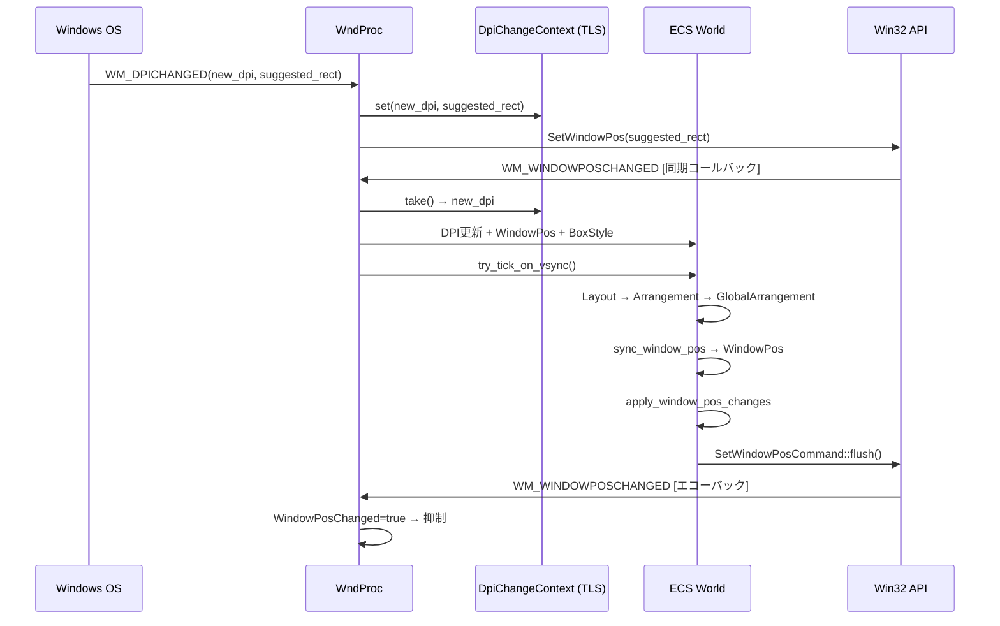

#### Chain 2: ウィンドウ作成チェーン

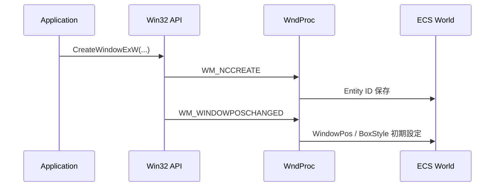

#### Chain 3: ユーザー操作チェーン（ドラッグ / リサイズ）

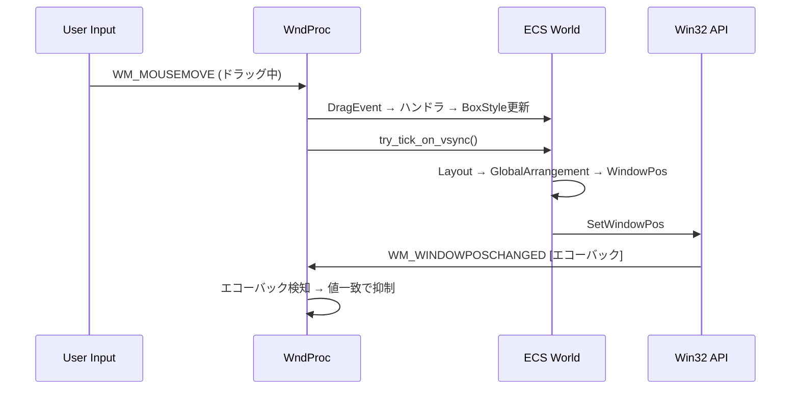

#### Chain 4: ECS → Win32 フィードバックチェーン

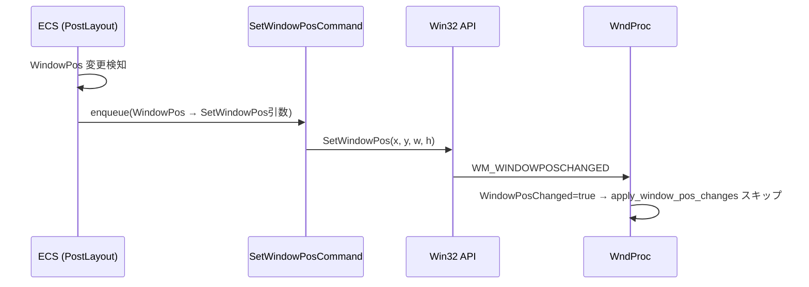

#### Chain 5: ディスプレイ変更チェーン

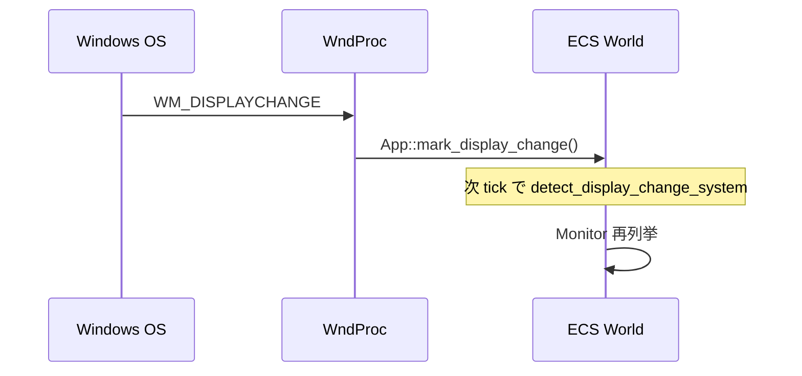

### 3.4 フィードバックループ防止機構（3層防御）

| 層 | メカニズム | 有効範囲 | 潜在リスク |
|----|----------|---------|-----------|
| L1: `WindowPosChanged` フラグ | `WM_WINDOWPOSCHANGED` 処理中に `true` → `apply_window_pos_changes` スキップ | `WM_WINDOWPOSCHANGED` 内の tick のみ | ⚠ tick 外の `sync_window_pos` には無効 |
| L2: エコーバック検知 | `last_sent_position / size` と受信値比較 → 一致時スキップ | 値一致時のみ | ⚠ f32→i32 丸めで微差が出た場合は検知失敗 |
| L3: `RefCell` 再入保護 | `try_borrow_mut()` 失敗時スキップ | 同一 WM 内の再入 | ✓ 堅牢 |

**評価**: 3層防御は概ね堅牢だが冗長。To-Be 設計では `WindowPos → ECS` の逆流パスを制御する **単一ゲートシステム** が望ましい。特に、`sync_window_pos` と `update_window_pos_system` の重複が不必要な `Changed<WindowPos>` トリガーを生む問題を解消すべき。

### 3.5 座標情報の劣化パス

| 劣化パス | 原因 | 影響 | 対策案 |
|---------|------|------|--------|
| f32 → i32 丸め | `Arrangement.offset`（f32）→ `WindowPos.position`（i32） | L2 エコーバック検知で微差が検出不可。1-2フレームのジッター可能性 | 丸め後の値で L2 比較を実施 |
| `PointerState.screen_point` 命名不整合 | `WM_MOUSEMOVE` lparam（クライアント座標）を `screen_point` として保存 | フィールド名から座標系を誤認するリスク | フィールド名を `client_point` に修正、または実際のスクリーン座標を格納 |
| エコーバック時の DPI 依存逆変換 | `window_to_client_coords` が `AdjustWindowRectExForDpi` に依存 | `GetDpiForWindow` が一時的に古い DPI を返す場合、逆変換結果にズレ | DPI 変更時は `DpiChangeContext` で新 DPI を明示的に使用 |

---

## 4. DPI データフロー図

### 4.1 DPI 値フロー全経路

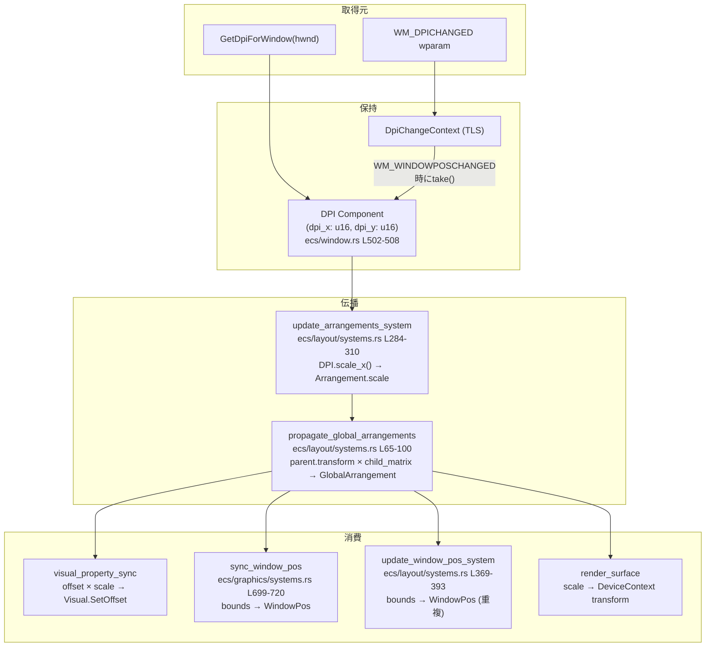

### 4.2 DpiChangeContext 同期伝達パスの検証

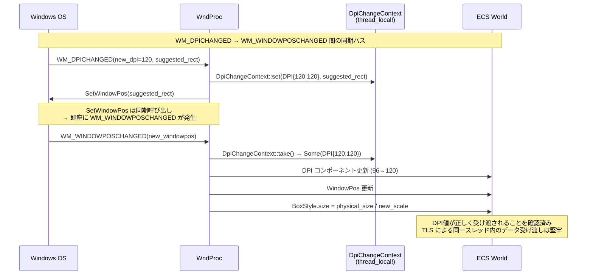

**検証結果**: `DpiChangeContext` はスレッドローカル（`thread_local!`）を使用した同期伝達パスであり、`SetWindowPos` が同期コールバックとして `WM_WINDOWPOSCHANGED` を発生させるため、DPI 値は確実に受け渡される。リスクは低い。

### 4.3 二重スケーリング検証

| パイプラインステージ | scale 値 | 座標系 | 二重スケーリング |
|---------------------|---------|--------|-----------------|
| `DPI` コンポーネント | dpi_x=120, dpi_y=120 | DPI 値 | — |
| `DPI::scale_x()` | 1.25 (= 120/96) | スケール比率 | — |
| `Arrangement.scale` (Window) | (1.25, 1.25) | DPI スケール | — |
| `Arrangement.scale` (Widget) | (1.0, 1.0) | デフォルト | — |
| **`Mul` パス (Window)**: `parent_scale` | **(1.0, 1.0)** | LayoutRoot の scale | ✓ 二重スケーリングなし |
| `GlobalArrangement.bounds` (Window) | offset × 1.0 + parent_origin | 物理px | ✓ 正しい |
| **`Mul` パス (Widget)**: `parent_scale` | **(1.25, 1.25)** | Window の scale | ✓ DIP→物理px 変換が正しく適用 |

**結論**: Window の `Mul` パスでは `parent_scale = 1.0`（LayoutRoot のスケール）のため、Window の offset に二重スケーリングは発生しない。Widget の `Mul` パスでは `parent_scale = 1.25`（Window のスケール）が正しく適用される。**現状は二重スケーリングの問題なし**。

### 4.4 Monitor.dpi 未反映の影響評価

| 項目 | 詳細 |
|------|------|
| 現状 | `Monitor.dpi`（`ecs/monitor.rs` L68-74）は情報保持のみ。`Arrangement.scale` への反映なし |
| 影響範囲 | 単一モニター環境では影響なし。マルチモニター環境で各モニターの DPI 情報が `LayoutRoot` 配下の配置計算に使用されない |
| リスク | 低: Window エンティティの `DPI` コンポーネントが `GetDpiForWindow` から正しい DPI を取得するため、Window 単位での DPI 処理は正しく動作する |
| To-Be での位置づけ | `Monitor.dpi` は将来のマルチモニター最適化（モニター間移動時の事前 DPI 予測等）で活用可能。現時点では優先度低 |

---

## 5. ドラッグ座標変換チェーン評価（As-Is / To-Be 対比）

### 5.1 As-Is チェーン（物理px フロー）

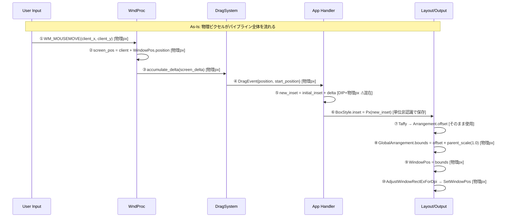

### 5.2 To-Be チェーン（DIP 内部フロー）

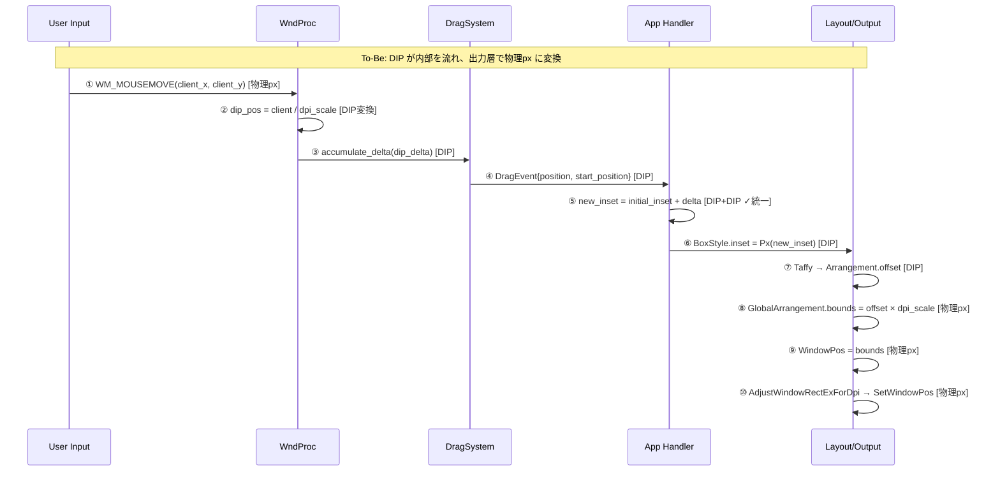

### 5.3 As-Is / To-Be コンフリクト箇所

| ステップ | As-Is | To-Be | コンフリクト |
|---------|-------|-------|------------|
| ② 入力変換 | `screen_pos`（物理px）をそのまま使用 | `client / dpi_scale` で DIP に変換 | **追加**: 入力層に DIP 変換ロジックが必要 |
| ③ デルタ座標系 | 物理px デルタ | DIP デルタ | **変更**: `DragEvent` の座標系を DIP に変更。`event-drag-system` への影響あり |
| ⑤ ハンドラ計算 | `initial_inset`（DIP）+ `delta`（物理px）= 混在 ⚠ | `initial_inset`（DIP）+ `delta`（DIP）= 統一 ✓ | **解消**: 座標系混在が自然に解消 |
| ⑥ BoxStyle.inset | 物理px（スクリーン座標） | DIP | **変更**: `BoxStyle.inset` の単位を DIP に変更。全使用箇所に影響 |
| ⑧ bounds 計算 | `offset × parent_scale(1.0)` | `offset × dpi_scale` | **変更**: Window の `parent_scale` に DPI スケールが反映される設計に変更 |

### 5.4 DPI=120 (1.25x) 条件での数値トレース

> 条件: DPI=120 (scale 1.25), LayoutRoot 原点=(0,0), Window 初期位置=(300,200) 物理px, マウス移動 delta=+10 物理px

| ステップ | As-Is 値 | To-Be 値 | 単位 |
|---------|---------|---------|------|
| ① WM_MOUSEMOVE | client=(510, 400) | client=(510, 400) | 物理px |
| ② 座標変換 | screen=(810, 600) | dip=(408, 320) | As-Is: 物理px / To-Be: DIP |
| ③ delta | +10 | +8.0 (= 10/1.25) | As-Is: 物理px / To-Be: DIP |
| ④ DragEvent.position | (810, 600) | (408, 320) | As-Is: 物理px / To-Be: DIP |
| ⑤ new_inset | 300+10=**310** | 240+8=**248** | As-Is: 物理px / To-Be: DIP |
| ⑥ BoxStyle.inset.left | Px(310) | Px(248) | As-Is: 物理px / To-Be: DIP |
| ⑦ Arrangement.offset.x | 310 | 248 | As-Is: 物理px / To-Be: DIP |
| ⑧ bounds.left | 0 + 310 × 1.0 = **310** | 0 + 248 × 1.25 = **310** | 物理px（一致 ✓） |
| ⑨ WindowPos.position.x | 310 | 310 | 物理px（一致 ✓） |
| ⑩ SetWindowPos | 310 + border_offset | 310 + border_offset | 物理px（一致 ✓） |

**結論**: As-Is と To-Be は **最終出力値（SetWindowPos の引数）が一致する**。差異は内部表現の座標系のみ。To-Be では中間計算が一貫した DIP で行われるため、座標系混在バグのリスクが根絶される。

### 5.5 sync_window_arrangement_from_window_pos の評価

| 項目 | 詳細 |
|------|------|
| 定義場所 | `ecs/layout/systems.rs` L405-455 |
| 無効化箇所 | `ecs/world.rs` L360-363（コメントアウト） |
| 無効化理由 | 「DIP 座標への二重変換」のリスク |
| 設計意図 | Win32 側のウィンドウ位置変更（ユーザーによるウィンドウ移動）を ECS の `Arrangement` に逆反映する |
| To-Be での位置づけ | **有効化条件**: `sync_window_pos` / `update_window_pos_system` の統合が完了した後。重複システムが存在する状態で有効化すると、同期方向の競合リスクがある |
| 推奨 | システム統合（§1.2 項目1）と同時に有効化を検討。現在の座標系設計（`WindowPos.position`=物理px → `Arrangement.offset`=物理px）はそのまま活用できる |

---

## 6. To-Be アーキテクチャ設計指針

### 6.1 参照モデル: WPF / WinUI3 の座標系設計

#### WPF のモデル

- **ウィンドウ位置**: `Window.Left` / `Window.Top` — デバイス（物理）座標。スクリーン座標系は物理ピクセル
- **ウィンドウ内部**: DIP (Device Independent Pixel, 1 DIP = 1/96 inch) で統一
- **サイズ**: `Width` / `Height` — DIP 単位
- `Visual.Offset` → DIP 単位の親からの相対位置
- DPI スケーリングはルート Visual のレンダリングトランスフォームとして適用
- ヒットテスト: DIP 空間で実行。物理座標は入力時に DIP に変換

#### WinUI3 のモデル

- `UIElement.Scale` / `UIElement.Translation` → DIP 空間での変換
- `Compositor` → DirectComposition ベースの合成（wintf と同様のアプローチ）
- DPI スケーリングは Composition 層で自動適用

#### wintf の現状 ← WPF と同等

| 層 | WPF の設計 | wintf 現状 (As-Is) | 判定 |
|----|----------|-------------------|------|
| スクリーン座標 | 物理px（`Window.Left/Top`） | 物理px（`BoxStyle.inset`） | ✓ 一致 |
| レイアウトサイズ | DIP（`Width/Height`） | DIP（`BoxStyle.size`） | ✓ 一致 |
| レイアウトエンジン | DIP 入力 | Taffy: DIP 入力（`BoxStyle.size` は DIP） | ✓ 一致 |
| 配置結果 | DIP（`Visual.Offset`） | DIP（Widget の `Arrangement.offset`） | ✓ 一致 |
| 描画 | DIP → 物理px（ラスタライズ時） | DIP × scale → 物理px | ✓ 一致 |
| Win32 出力 | 物理px（`SetWindowPos`） | 物理px（`GlobalArrangement.bounds`） | ✓ 一致 |

**結論**: wintf の座標系設計は WPF と実質的に同等。変更不要。

### 6.2 現行設計の確認: 座標系 3原則

現在の wintf が（既に）従っている設計原則：

| 原則 | 定義 | 現状の適合度 |
|------|------|------------|
| **Screen = Physical** | スクリーン座標（`BoxStyle.inset`, `WindowPos`）は物理ピクセル。Windows OS がウィンドウを物理 px で管理するため | ✓ 適合 |
| **Layout = DIP** | レイアウトサイズ（`BoxStyle.size`, Widget の `Arrangement`）は DIP | ✓ 適合 |
| **Output Conversion** | `GlobalArrangement.bounds` で DIP → 物理px 変換（`offset × scale`）。`SetWindowPos` はこの値をそのまま使用 | ✓ 適合 |

### 6.3 パイプライン改善: To-Be

座標系は正しいが、パイプラインに改善の余地がある：

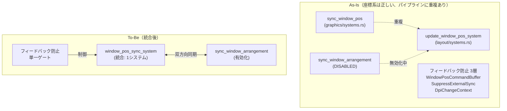

### 6.4 改善項目の詳細設計

#### 6.4.1 sync_window_pos / update_window_pos_system 統合

| 項目 | As-Is | To-Be |
|------|-------|-------|
| `sync_window_pos`（graphics） | `GlobalArrangement.bounds` → `WindowPos` | **廃止** |
| `update_window_pos_system`（layout） | 同上（重複） | **`window_pos_sync_system` に改名・統合** |
| 統合システム | — | `GlobalArrangement.bounds` → `WindowPos` → `SetWindowPos` を一元管理 |

#### 6.4.2 PointerState.screen_point 命名修正

| 項目 | As-Is | To-Be |
|------|-------|-------|
| フィールド名 | `screen_point` | **`client_point`** |
| 保持値 | クライアント座標（物理px） | クライアント座標（物理px）— 値は変更なし |
| 修正理由 | 名前と内容の不一致 | 名前を実態に合わせる |

#### 6.4.3 sync_window_arrangement_from_window_pos 有効化

| 項目 | As-Is | To-Be |
|------|-------|-------|
| 状態 | コメントアウト（`ecs/world.rs` L360-363） | **有効化** |
| 前提条件 | — | `sync_window_pos` / `update_window_pos_system` が統合済みであること |
| 変換式 | `WindowPos.position` → `Arrangement.offset`（同一座標系、変換不要） | 同左（スクリーン座標は物理px同士なので座標変換は不要） |
| 目的 | ユーザーのウィンドウ移動を ECS に逆反映 | 同左 |

#### 6.4.4 フィードバックループ防止の簡素化

| 層 | 役割 | To-Be |
|----|------|-------|
| `WindowPosCommandBuffer` | ECS → Win32 の同期バッファ | **維持**（必要） |
| `SuppressExternalSync` | Win32 → ECS の逆反映を一時抑制 | **統合対象**: `WindowPosCommandBuffer` と統合し、単一ゲートで制御 |
| `DpiChangeContext` (TLS) | DPI 変更チェーンの追跡 | **維持**（TLS は `WndProc` コンテキスト固有で統合不可） |

### 6.5 Arrangement.offset と WindowPos.position の関係（現状維持）

| 項目 | 現状 | 変更 |
|------|------|------|
| `Arrangement.offset` (Window) | 物理px（`BoxStyle.inset` からそのまま） | なし（正しい） |
| `WindowPos.position` | 物理px（Win32 API 出力） | なし（正しい） |
| 関係式 | `WindowPos.position ≈ Arrangement.offset`（近似一致） | 維持 |
| 逆変換 | `sync_window_arrangement_from_window_pos`（無効化中） | 有効化を評価（§6.4.3） |
| 統合システム | `sync_window_pos` + `update_window_pos_system`（重複） | **単一の `window_pos_sync_system`**（§6.4.1） |

### 6.6 Per-Monitor DPI v2 モニタ間移動時の DPI 変更再計算フロー

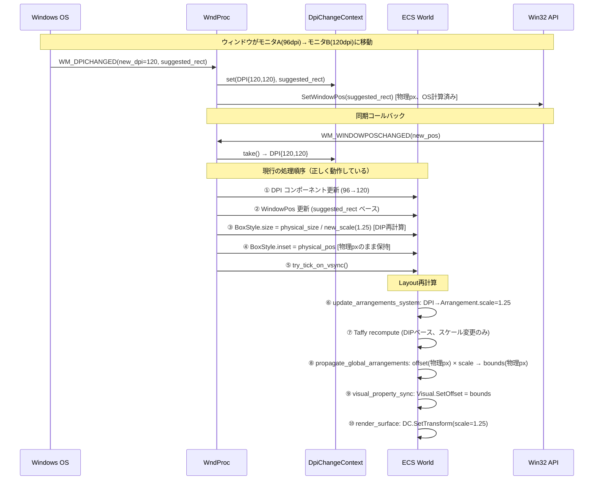

**処理順序のポイント**:
- DPI コンポーネント更新を最初に実施（他の計算が新 DPI を参照するため）
- `BoxStyle.size` はDIP再計算（`physical ÷ new_scale`）が必要
- `BoxStyle.inset` は物理 px のまま（スクリーン座標は物理 px が正しい）
- Taffy レイアウトは DIP ベースのため、サイズの数値自体は変わらない（物理サイズが変わるだけ）
- `suggested_rect` は OS が計算した適切なウィンドウ位置で、そのまま使用すべき

---

## 7. ギャップ分析マトリクス

### 7.1 優先度マトリクス

| # | ギャップ項目 | 影響度 | 修正コスト | ブロック仕様 | 優先度 | クロスリファレンス |
|---|------------|--------|-----------|-------------|--------|-------------------|
| G1 | ~~`BoxStyle.inset` / `size` 座標系混在~~ → **意図的設計（問題なし）** | ~~High~~ **N/A** | — | — | ⚪ 対応不要 | 調査の結果、WPF と同じ設計で正しいと確認 |
| G2 | ~~`Arrangement.offset` の単位混在~~ → **階層による正しい分離** | ~~High~~ **N/A** | — | — | ⚪ 対応不要 | Window=物理px（スクリーン座標）、Widget=DIP（レイアウト座標）は正しい |
| G3 | `sync_window_pos` / `update_window_pos_system` 重複 | **Medium** | **Low** | — | 🟡 高 | `wintf-P1-dpi-scaling` |
| G4 | `Matrix3x2` 乗算順序（`translation × scale` → M31=offset、bounds と乖離） | **Medium** | **Low** | 潜在的（将来の transform 直接参照時） | 🟢 低 | `wintf-P1-dpi-scaling` |
| G5 | `sync_window_arrangement_from_window_pos` 無効化 | **Medium** | **Medium** | システム統合が前提 | 🟡 中 | `wintf-P1-dpi-scaling` |
| G6 | `PointerState.screen_point` 命名不整合 | **Low** | **Low** | — | 🟡 中 | `event-drag-system` |
| G7 | `Monitor.dpi` の `Arrangement.scale` 未反映 | **Low** | **Low** | — | 🟢 低 | `wintf-P1-dpi-scaling` |
| G8 | `WinState` / `DPI` 二重管理 | **Low** | **Low** | — | 🟢 低 | — |
| G9 | フィードバックループ防止機構 3層の冗長性 | **Medium** | **Medium** | — | 🟡 中 | `wintf-P1-dpi-scaling` |
| G10 | `WM_GETDPISCALEDSIZE` 未対応 | **Low** | **Low** | — | 🟢 低（将来対応） | `wintf-P1-dpi-scaling` |
| G11 | ~~`DragEvent` 座標系が物理px~~ → **Window ドラッグでは正しい** | ~~High~~ **N/A** | — | — | ⚪ 対応不要 | Window ドラッグはスクリーン座標（物理px）で行うのが自然 |

### 7.2 dpi-propagation（完了済）vs wintf-P1-dpi-scaling（バックログ）差分

| 項目 | dpi-propagation（完了） | wintf-P1-dpi-scaling（バックログ） | ステータス |
|------|------------------------|-----------------------------------|-----------|
| Per-Monitor DPI Aware v2 宣言 | ✅ | 要件に含む | 実装済み |
| `GetDpiForWindow` DPI 取得 | ✅ | 要件に含む | 実装済み |
| DPI → `Arrangement.scale` 伝播 | ✅ | 要件に含む | 実装済み |
| `WM_DPICHANGED` 処理 | ✅ | 要件に含む | 実装済み |
| 論理/物理変換 API | ✅ `DPI::to_physical_*` / `to_logical_*` | 要件に含む | 実装済み |
| DPI 変更イベント | ✅ `Changed<DPI>` | 要件に含む | 実装済み |
| **DPI 変更時リソース再作成** | — | 要件に含む | ❌ 未実装 |
| **ちらつきなし滑らかな更新** | — | 要件に含む | ❌ 未検証 |
| **座標系設計** | — | 暗黙的に必要 | ✅ 正しい設計（本レポートで確認） |
| **パイプライン整理**（重複解消等） | — | 暗黙的に必要 | ❌ 未実装（G3, G5, G6, G9） |
| **マルチモニター DPI 切替** | — | 要件に含む | ⚠ 動作するが課題あり |

**評価**: P1 仕様の要件の多くは `dpi-propagation` で実装済み。未実装は「リソース再作成」「ちらつき抑制」の2点と、パイプライン整理（G3, G5, G6, G9）。座標系設計自体は既に正しく、P1 の中核タスクは **パイプライン重複の解消とフィードバック制御の強化** として位置づけるべき。

---

## 8. 改善ロードマップ

### 8.1 方針

座標系設計は既に正しいため、大規模な座標変換移行は不要。改善はパイプラインの **重複解消・命名修正・機能有効化** に限定される。全て独立して実施可能だが、推奨順序は以下の通り。

### 8.2 改善ステップ

| ステップ | 対象 | 主な変更内容 | 前提条件 | 検証基準 | コスト |
|---------|------|------------|---------|---------|--------|
| **Step 1**: システム統合 | `sync_window_pos` + `update_window_pos_system` | 2つの重複システムを `window_pos_sync_system` に統合。`GlobalArrangement.bounds` → `WindowPos` → `SetWindowPos` を一元管理 | なし | ウィンドウ配置が全 DPI で正しく動作。テスト期待値に変更なし | Low（1-2日） |
| **Step 2**: 命名修正 | `PointerState.screen_point` | `client_point` にリネーム。値の変更なし（クライアント座標・物理 px のまま） | なし（Step 1 と独立） | コンパイル通過。既存動作に変更なし | Low（数時間） |
| **Step 3**: 逆同期の有効化 | `sync_window_arrangement_from_window_pos` | コメントアウトを解除。`WindowPos` → `Arrangement` の逆反映を有効化 | Step 1 完了（重複システムが統合済みであること） | ユーザーがウィンドウを移動した際に ECS 側の `Arrangement` が更新される。フィードバックループが発生しない | Medium（2-3日） |
| **Step 4**: フィードバック防止簡素化 | `WindowPosCommandBuffer` + `SuppressExternalSync` | 2つの防止機構を単一ゲートに統合。`DpiChangeContext`（TLS）は維持 | Step 3 完了（逆同期が有効化されていること） | フィードバックループが発生しない。DPI 変更時の処理が正しく動作 | Medium（2-3日） |

### 8.3 ステップ依存関係


### 8.4 各ギャップの解消ステップ

| ギャップ | 解消ステップ | 関連仕様 |
|---------|------------|---------|
| G1: ~~BoxStyle 座標系混在~~ | 対応不要（正しい設計） | — |
| G2: ~~Arrangement.offset 混在~~ | 対応不要（正しい階層設計） | — |
| G3: sync/update 重複 | Step 1 | `wintf-P1-dpi-scaling` |
| G4: Matrix3x2 乗算順序 | 将来（オプション） | `wintf-P1-dpi-scaling` |
| G5: sync_window_arrangement 無効化 | Step 3 | `wintf-P1-dpi-scaling` |
| G6: PointerState 命名不整合 | Step 2 | `event-drag-system` |
| G7: Monitor.dpi 未反映 | 将来（オプション） | `wintf-P1-dpi-scaling` |
| G8: WinState/DPI 二重管理 | 独立（非ECSデモ廃止時） | — |
| G9: フィードバック防止冗長性 | Step 4 | `wintf-P1-dpi-scaling` |
| G10: WM_GETDPISCALEDSIZE 未対応 | 将来（オプション） | `wintf-P1-dpi-scaling` |
| G11: ~~DragEvent 座標系~~ | 対応不要（物理 px が正しい） | — |

---

## 付録: 参考資料

- [High DPI Desktop Application Development on Windows](https://learn.microsoft.com/en-us/windows/win32/hidpi/high-dpi-desktop-application-development-on-windows) — PMv2 の挙動詳細、API 置換マトリクス
- [WPF Graphics Rendering Overview](https://learn.microsoft.com/en-us/dotnet/desktop/wpf/graphics-multimedia/wpf-graphics-rendering-overview) — DIP 統一モデルの参照実装
- [DPI_AWARENESS_CONTEXT](https://learn.microsoft.com/en-us/windows/win32/hidpi/dpi-awareness-context) — PMv2 (Context -4) の定義と制約
- [WM_DPICHANGED](https://learn.microsoft.com/en-us/windows/win32/hidpi/wm-dpichanged) — `suggested_rect` の使用義務、循環回避
