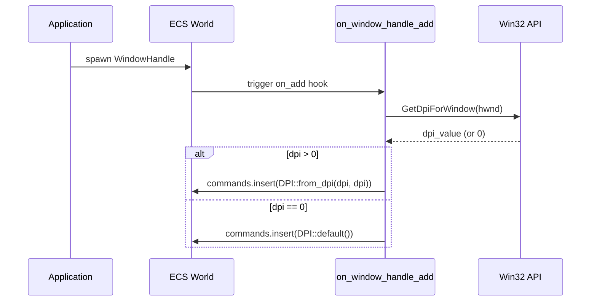
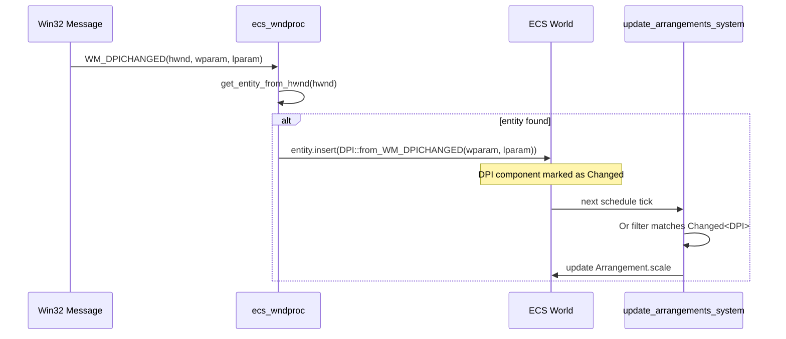
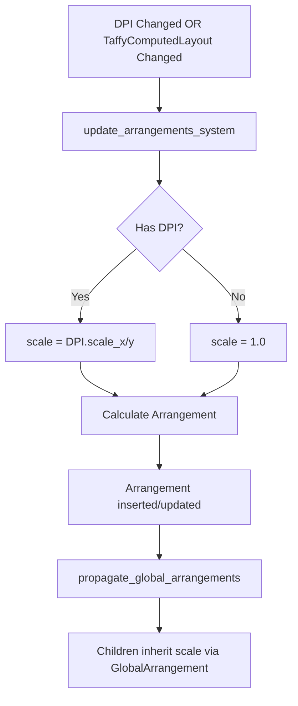

# Technical Design: dpi-propagation

## 1. Overview

### 1.1. Purpose
WindowエンティティのDPIをArrangement.scaleを経由してエンティティツリーに伝搬する仕組みを構築する。

### 1.2. Goals
- **G1**: DPI情報を型安全なコンポーネントとして管理
- **G2**: WindowHandle作成時にDPIを自動取得・付与
- **G3**: WM_DPICHANGED発生時にDPIコンポーネントを即時更新
- **G4**: DPI変更をArrangement.scaleに自動伝搬

### 1.3. Non-Goals
- マルチウィンドウ間のDPI同期（各Windowは独立管理）
- レンダリング系コンポーネントへの直接影響（Arrangementを介して間接伝搬）
- DPI変更アニメーション（即時反映）

---

## 2. Architecture

### 2.1. Extension Boundary Map

```
┌─────────────────────────────────────────────────────────────────────┐
│                         dpi-propagation                              │
├─────────────────────────────────────────────────────────────────────┤
│ ① window.rs                                                          │
│    [ADD] DPI { dpi_x, dpi_y }                                       │
│    [MOD] on_window_handle_add → DPI挿入追加                          │
│    [DEL] DpiTransform (未使用)                                       │
│                                                                      │
│ ② window_proc.rs                                                     │
│    [MOD] WM_DPICHANGED → DPIコンポーネント更新                       │
│                                                                      │
│ ③ layout/systems.rs                                                  │
│    [MOD] update_arrangements_system                                  │
│          - Orフィルター追加                                          │
│          - Option<&DPI>パラメータ追加                                │
│          - scale計算にDPI値を使用                                    │
│                                                                      │
│ ④ ecs/mod.rs                                                         │
│    [ADD] pub use window::DPI                                         │
└─────────────────────────────────────────────────────────────────────┘
```

### 2.2. Components & Interfaces

#### 2.2.1. DPI Component

```rust
/// DPI情報を保持するコンポーネント
/// 
/// Window エンティティ専用。SparseSet ストレージを使用。
/// - dpi_x, dpi_y: 通常同一値だが、将来の拡張性のため分離
/// - デフォルト値: 96 (Windows標準DPI)
/// 
/// # Example
/// ```
/// let dpi = DPI::from_dpi(120, 120);
/// assert_eq!(dpi.scale_x(), 1.25);
/// ```
#[derive(Component, Debug, Clone, Copy, PartialEq, Eq)]
#[component(storage = "SparseSet")]
pub struct DPI {
    /// X方向のDPI値 (96 = 100%)
    pub dpi_x: u16,
    /// Y方向のDPI値 (96 = 100%)  
    pub dpi_y: u16,
}

impl DPI {
    /// DPI値からインスタンスを作成
    pub fn from_dpi(x_dpi: u16, y_dpi: u16) -> Self;
    
    /// WM_DPICHANGEDメッセージのwparamから作成
    /// 
    /// # Arguments
    /// * `wparam` - WM_DPICHANGEDのWPARAM (LOWORD=X DPI, HIWORD=Y DPI)
    /// * `_lparam` - WM_DPICHANGEDのLPARAM (未使用だが署名の一貫性のため保持)
    pub fn from_WM_DPICHANGED(wparam: WPARAM, _lparam: LPARAM) -> Self;
    
    /// X方向のスケール係数を取得 (1.0 = 96 DPI)
    pub fn scale_x(&self) -> f32;
    
    /// Y方向のスケール係数を取得 (1.0 = 96 DPI)
    pub fn scale_y(&self) -> f32;
}

impl Default for DPI {
    fn default() -> Self {
        Self { dpi_x: 96, dpi_y: 96 }
    }
}
```

#### 2.2.2. update_arrangements_system 修正

```rust
/// TaffyComputedLayout または DPI の変更を Arrangement に反映
/// 
/// # Triggers
/// - TaffyComputedLayout の追加・変更
/// - DPI コンポーネントの変更
/// 
/// # Behavior
/// どちらのトリガーでも全フィールド（offset, size, scale）を再計算
pub fn update_arrangements_system(
    mut commands: Commands,
    query: Query<
        (
            Entity,
            &TaffyComputedLayout,
            &Parent,
            Option<&DPI>,           // 追加
        ),
        (
            Or<(Changed<TaffyComputedLayout>, Changed<DPI>)>,  // 修正
            With<TaffyStyle>,
        ),
    >,
) {
    // ...
}
```

---

## 3. Technology Stack

| Category | Technology | Version | Usage |
|----------|------------|---------|-------|
| ECS | bevy_ecs | 0.17.2 | Component, Query, Or filter |
| Storage | SparseSet | - | DPI component (sparse usage) |
| Win32 | GetDpiForWindow | - | Initial DPI acquisition |
| Win32 | WM_DPICHANGED | - | DPI change notification |

---

## 4. System Flows

### 4.1. DPI Initialization Flow (Window Creation)



### 4.2. DPI Update Flow (WM_DPICHANGED)



### 4.3. Arrangement Propagation Flow



---

## 5. Requirements Traceability

| Req ID | Requirement Summary | Design Element | Verification |
|--------|---------------------|----------------|--------------|
| R1.1 | DPI型定義 | `DPI { dpi_x: u16, dpi_y: u16 }` | 型検査 |
| R1.2 | デフォルト値96 | `impl Default for DPI` | ユニットテスト |
| R1.3 | scale変換メソッド | `scale_x()`, `scale_y()` | ユニットテスト |
| R1.4 | Debug出力 | `#[derive(Debug)]` | 型検査 |
| R1.5 | SparseSetストレージ | `#[component(storage = "SparseSet")]` | コンパイル時検証 |
| R2.1 | WindowHandle作成時にDPI付与 | `on_window_handle_add` 拡張 | 統合テスト |
| R2.2 | GetDpiForWindow使用 | `WindowHandle::get_dpi()` 呼び出し | 実行時ログ |
| R2.3 | 取得失敗時デフォルト96 | `if dpi == 0 { DPI::default() }` | 統合テスト |
| R3.1 | WM_DPICHANGED受信時更新 | `ecs_wndproc` 修正 | 統合テスト |
| R3.2 | from_WM_DPICHANGED署名 | `fn from_WM_DPICHANGED(wparam, lparam)` | 型検査 |
| R3.3 | Changed<DPI>マーク | bevy_ecs自動 | ECS動作検証 |
| R4.1 | Or条件フィルター | `Or<(Changed<TaffyComputedLayout>, Changed<DPI>)>` | 型検査 |
| R4.2 | Option<&DPI>パラメータ | クエリに追加 | 型検査 |
| R4.3 | scale計算にDPI使用 | `LayoutScale::new(dpi.scale_x(), dpi.scale_y())` | ユニットテスト |
| R4.4 | None時scale=1.0 | `dpi.map_or(1.0, \|d\| d.scale_x())` | ユニットテスト |
| R4.5 | GlobalArrangement継承 | 既存の `propagate_global_arrangements` | 統合テスト |
| R4.6 | 全フィールド再計算 | Design Decision参照 | コードレビュー |
| R5.1 | DpiTransform定義削除 | `window.rs` から削除 | コード差分 |
| R5.2 | DpiTransform参照削除 | なし（未使用） | grep検証済み |
| R5.3 | pub use DPI追加 | `ecs/mod.rs` | 型検査 |
| R6.1 | 既存テスト通過 | `cargo test` | CI |
| R6.2 | レイアウト機能維持 | 既存example動作 | 統合テスト |
| R6.3 | エラーなしビルド | `cargo build` | CI |

---

## 6. Testing Strategy

### 6.1. Unit Tests

| Test Case | Target | Method |
|-----------|--------|--------|
| DPI::from_dpi | DPI構造体 | 値検証 |
| DPI::from_WM_DPICHANGED | wparam解析 | ビット操作検証 |
| DPI::scale_x/y | スケール計算 | 96→1.0, 120→1.25, 192→2.0 |
| DPI::default | デフォルト値 | 96, 96 検証 |

### 6.2. Integration Tests

| Test Case | Target | Method |
|-----------|--------|--------|
| Window creation DPI | on_window_handle_add | Windowスポーン後にDPIクエリ |
| DPI update | WM_DPICHANGED | 手動モニタ移動でログ確認 |
| Arrangement scale | update_arrangements_system | DPI変更後のArrangement.scale検証 |

### 6.3. Manual Test Procedure
1. デュアルモニタ環境（DPI 120% / 200%）でアプリ起動
2. 低DPIモニタでWindow作成 → DPI=120確認
3. 高DPIモニタへドラッグ → WM_DPICHANGED発生、DPI=192確認
4. Arrangement.scaleが2.0に更新されることを確認

---

## 7. Implementation Notes

### 7.1. DpiTransform からの移行

`DpiTransform`の以下のコードを`DPI`に移行：

```rust
// 現在のDpiTransform実装（window.rs:267-283）
impl DpiTransform {
    pub fn from_WM_DPICHANGED(wparam: WPARAM, _lparam: LPARAM) -> Self {
        let x_dpi = (wparam.0 & 0xFFFF) as u16;
        let y_dpi = ((wparam.0 >> 16) & 0xFFFF) as u16;
        Self::from_dpi(x_dpi, y_dpi)
    }

    pub fn from_dpi(x_dpi: u16, y_dpi: u16) -> Self {
        let x_scale = x_dpi as f32 / 96.0;
        let y_scale = y_dpi as f32 / 96.0;
        // ...
    }
}
```

### 7.2. on_window_handle_add 拡張

```rust
fn on_window_handle_add(mut world: DeferredWorld, ctx: HookContext) {
    // 既存のApp通知コード
    // ...
    
    // DPI挿入追加
    let hwnd = world.get::<WindowHandle>(ctx.entity).unwrap().hwnd;
    let dpi = unsafe { GetDpiForWindow(hwnd) };
    let dpi_component = if dpi > 0 {
        DPI::from_dpi(dpi as u16, dpi as u16)
    } else {
        DPI::default()
    };
    world.commands().entity(ctx.entity).insert(dpi_component);
}
```

### 7.3. update_arrangements_system 修正箇所

```rust
// Before (line 252-260)
pub fn update_arrangements_system(
    mut commands: Commands,
    query: Query<
        (Entity, &TaffyComputedLayout, &Parent),
        (Changed<TaffyComputedLayout>, With<TaffyStyle>),
    >,
)

// After
pub fn update_arrangements_system(
    mut commands: Commands,
    query: Query<
        (Entity, &TaffyComputedLayout, &Parent, Option<&DPI>),
        (Or<(Changed<TaffyComputedLayout>, Changed<DPI>)>, With<TaffyStyle>),
    >,
)
```

---

## 8. File Change Summary

| File | Action | Lines Changed |
|------|--------|---------------|
| `crates/wintf/src/ecs/window.rs` | ADD/MOD/DEL | +45, -35 |
| `crates/wintf/src/ecs/window_proc.rs` | MOD | +10 |
| `crates/wintf/src/ecs/layout/systems.rs` | MOD | +15, -5 |
| `crates/wintf/src/ecs/mod.rs` | ADD | +1 |

---

## 9. Appendix

### 9.1. Related Requirements
- [requirements.md](./requirements.md)

### 9.2. Research Notes
- [research.md](./research.md)

### 9.3. Reference Documentation
- [Win32 DPI Awareness](https://learn.microsoft.com/en-us/windows/win32/hidpi/high-dpi-desktop-application-development-on-windows)
- [bevy_ecs Query Filters](https://docs.rs/bevy_ecs/latest/bevy_ecs/system/struct.Query.html)
