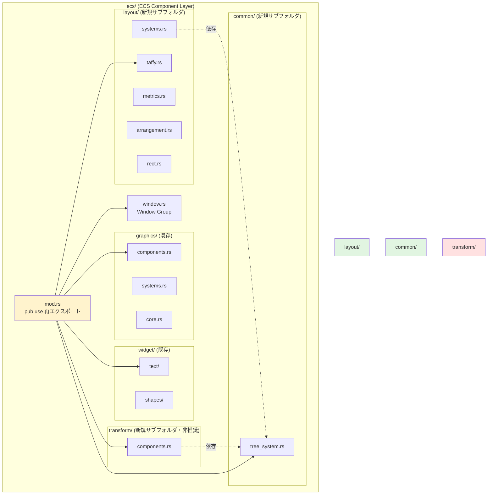
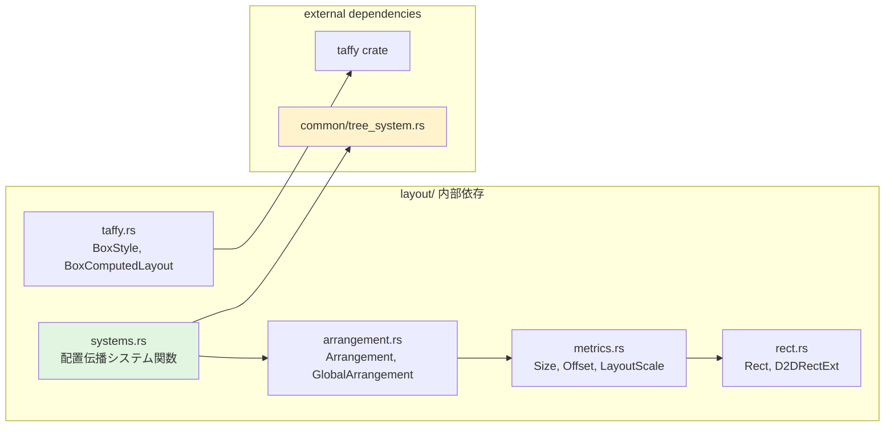
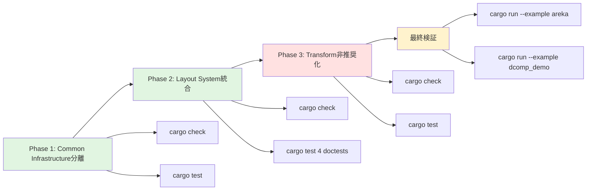

# Technical Design: ECS Component Grouping Refactoring

## Overview

既存のECSコンポーネント構造を5つの機能グループに再編成し、サブフォルダー構造を導入することで、コードベースの可読性と保守性を向上させるリファクタリングです。本リファクタリングは、`layout.rs`（517行）、`arrangement.rs`（60行）、`transform.rs`（191行）、`tree_system.rs`（371行）を適切なサブフォルダー配下に分割・移動し、API互換性を維持しながら実施します。

**Purpose**: 肥大化したファイルを適切なサブフォルダー構造に分割し、関連コンポーネントを明確に集約することで、新規開発者のオンボーディングコスト削減と、コンポーネント配置の一貫性向上を実現します。

**Users**: wintfライブラリの開発者および保守担当者が、ECSコンポーネントの追加・修正・理解を行う際に、明確なディレクトリ構造により適切な配置場所を即座に特定できます。

**Impact**: 既存の`ecs/`ディレクトリ構造を以下のように変更します：
- `layout.rs` + `arrangement.rs` → `ecs/layout/`（5ファイル）
- `tree_system.rs` → `ecs/common/tree_system.rs`
- `transform.rs` → `ecs/transform/components.rs`（非推奨警告付き）
- `graphics/`, `widget/`, `window.rs`は変更なし（現状維持）

### Goals

- **主目的1**: 大型ファイルの分割により、各ファイルを100-200行程度に適正化し、可読性を向上
- **主目的2**: 5つの機能グループ（Window, Graphics, Layout System, Widget, Common Infrastructure）の明確化
- **主目的3**: API互換性の完全維持（`pub use`再エクスポートにより外部インポートパス不変）
- **成功基準**:
  - `cargo test`が4つのdoctestを含めすべて成功
  - `cargo run --example areka`および`cargo run --example dcomp_demo`が正常動作
  - 外部利用者のコード変更不要（`use wintf::ecs::*;`で従来通りアクセス可能）

### Non-Goals

- **新規機能の追加**: 既存コンポーネントの機能変更や拡張は行わない
- **Transform系コンポーネントの削除**: 非推奨化するが、当面は維持（将来的な削除は別タスク）
- **bevy_ecsバージョンアップ**: 現在の0.17.2を維持（アップグレードは別タスク）
- **パフォーマンス最適化**: リファクタリングはコンパイル時の影響のみで、実行時パフォーマンスは不変

## Architecture

### Existing Architecture Analysis

wintfは以下のレイヤードアーキテクチャを採用しています：
- **COM Wrapper Layer** (`com/`): DirectComposition/Direct2D/DirectWrite等のWindows APIラッパー
- **ECS Component Layer** (`ecs/`): bevy_ecsベースのコンポーネント定義とシステム
- **Message Handling** (ルート): ウィンドウプロシージャとスレッド管理

現状の`ecs/`ディレクトリは以下の構造です：

```
ecs/
├── mod.rs                 # モジュール宣言と再エクスポート
├── window.rs              # Windowグループ（423行）
├── layout.rs              # Layout + Arrangement（517行） ← 分割対象
├── arrangement.rs         # Arrangement伝播システム（60行） ← 統合対象
├── transform.rs           # Transform実験的実装（191行） ← 隔離対象
├── tree_system.rs         # 汎用階層伝播関数（371行） ← 移動対象
├── graphics/              # Graphicsグループ（既存サブフォルダ）
│   ├── mod.rs
│   ├── components.rs
│   └── ...
└── widget/                # Widgetグループ（既存サブフォルダ）
    ├── mod.rs
    ├── text/
    └── shapes/
```

**既存パターンの成功事例**:
- `graphics/`は6ファイル構成で、GPU/CPUリソース管理を明確に分離
- `widget/`はサブディレクトリ階層（`text/`, `shapes/`）で論理的なUI要素を整理
- 両者とも`ecs/mod.rs`で`pub use graphics::*;`により再エクスポートし、外部利用者は`use wintf::ecs::*;`でアクセス可能

**技術的制約**:
- Component hooks（`on_add`, `on_remove`）はbevy_ecs 0.17.2の機能で、`WindowHandle`で使用中
- 汎用伝播システム（`tree_system.rs`）は型パラメータ`<L, G, M>`により、Layout SystemとTransform Systemで共有
- doctestはRustdocによりファイル単位で実行され、現在`layout.rs`に4つ存在

### Architecture Pattern & Boundary Map



**Architecture Integration**:
- **選択パターン**: Domain Subfolder Pattern（既存の`graphics/`, `widget/`と同様）
- **ドメイン境界**:
  - **Window**: ウィンドウライフサイクル管理（生成、プロパティ、DPI変換）
  - **Graphics**: GPU/CPUリソース管理（DirectComposition、Direct2D連携）
  - **Layout System**: レイアウト計算・配置伝播・矩形操作（taffyエンジン連携）
  - **Widget**: UIエレメント論理表現（Label、Rectangle等）
  - **Common Infrastructure**: ドメイン非依存の汎用システム（階層伝播関数）
- **既存パターン維持**:
  - Component hooksパターン（`WindowHandle`）
  - 汎用ジェネリック関数パターン（`tree_system.rs`の`<L, G, M>`型パラメータ）
  - `pub use`再エクスポートパターン（`ecs/mod.rs`）
- **新規コンポーネント不要**: 既存コンポーネントを移動・分割のみ
- **Steering準拠**: レイヤードアーキテクチャ哲学（`.kiro/steering/structure.md`）、命名規則（`snake_case`ファイル名、`PascalCase`型名）

### Technology Stack

本リファクタリングでは新規ライブラリの追加はなく、既存スタックをそのまま使用します。

| Layer | Choice / Version | Role in Feature | Notes |
|-------|------------------|-----------------|-------|
| ECS Framework | bevy_ecs 0.17.2 | コンポーネント定義、システム実行基盤 | バージョン変更なし |
| Layout Engine | taffy 0.9.1 | CSSライクなレイアウト計算 | `BoxStyle`, `BoxComputedLayout`で使用中 |
| Geometry | euclid 0.22.11, windows-numerics 0.3.1 | 2D幾何計算、Matrix3x2変換 | 変更なし |
| Build System | Cargo (Rust 2021 Edition) | ビルドおよびテスト実行 | `cargo test`でdoctest検証 |

**技術的決定事項**:
- bevy_ecs 0.17.2のComponent trait、ScheduleLabel、Systemはリファクタリング前後で不変
- taffyレイアウトエンジンのAPI（`Style`, `Layout`）は`layout/taffy.rs`に集約
- doctestはRustdocにより分割後のファイルで自動実行（`cargo test`）

## System Flows

本リファクタリングは構造変更のみで、実行時のフローに変更はありません。参考として、Layout System内部の依存関係を示します。



**依存方向の説明**:
- `taffy.rs`: 外部crateのtaffyに依存（`Style`, `Layout`型のラッパー）
- `metrics.rs` ⇄ `rect.rs`: 双方向依存（`metrics.rs`は`Rect`型エイリアスを使用、`rect.rs`は`Offset`/`Size`を使用）
- `arrangement.rs`: `Arrangement`は`Offset`を含む（`metrics.rs`に依存）
- `systems.rs`: 配置伝播システム関数は`arrangement.rs`のコンポーネントと`common/tree_system.rs`の汎用関数に依存

## Requirements Traceability

| Requirement | Summary | Components | Interfaces | Flows |
|-------------|---------|------------|------------|-------|
| 1 | 5グループ定義 | Window(現状維持), Graphics(現状維持), Layout(新規サブフォルダ), Widget(現状維持), Common(新規サブフォルダ) | `ecs/mod.rs`の`pub use`再エクスポート | - |
| 2 | Windowグループ分類 | `window.rs`（変更なし） | - | - |
| 3 | Graphicsグループ分類 | `graphics/`（変更なし） | - | - |
| 4 | Layout System統合 | `layout/taffy.rs`, `layout/metrics.rs`, `layout/arrangement.rs`, `layout/rect.rs`, `layout/systems.rs` | `layout/mod.rs`で再エクスポート | systems.rs → common/tree_system.rs |
| 5 | Transform非推奨化 | `transform/mod.rs`（警告）, `transform/components.rs` | `ecs/mod.rs`で再エクスポート維持 | - |
| 6 | Common Infrastructure分離 | `common/tree_system.rs` | `common/mod.rs`で再エクスポート | Layout/Transform両方で使用 |
| 7 | Widgetグループ分類 | `widget/`（変更なし） | - | - |
| 8 | モジュール構造一貫性 | 全モジュール | レイヤードアーキテクチャ準拠 | - |
| 9 | リファクタリング安全性 | 全コンポーネント | `pub use`による再エクスポート | Phase別テスト戦略 |
| 10 | ドキュメント更新 | - | モジュールdocコメント（`//!`） | - |

## Components and Interfaces

### Component Summary

| Component | Domain/Layer | Intent | Req Coverage | Key Dependencies | Contracts |
|-----------|--------------|--------|--------------|--------------------------|-----------|
| `layout/mod.rs` | Layout System | サブモジュール再エクスポート | 4 | - | Module |
| `layout/taffy.rs` | Layout System | taffyレイアウトエンジン連携 | 4 | taffy 0.9.1 | Component |
| `layout/metrics.rs` | Layout System | レイアウトメトリクス定義 | 4 | `rect.rs` (Rect型) | Component |
| `layout/arrangement.rs` | Layout System | 配置情報コンポーネント | 4 | `metrics.rs` (Offset) | Component |
| `layout/rect.rs` | Layout System | 矩形操作ユーティリティ | 4 | Direct2D (D2D_RECT_F) | Trait, Function |
| `layout/systems.rs` | Layout System | 配置伝播システム関数 | 4 | `common/tree_system.rs` | System Functions |
| `common/mod.rs` | Common Infra | サブモジュール再エクスポート | 6 | - | Module |
| `common/tree_system.rs` | Common Infra | 汎用階層伝播関数 | 6 | bevy_ecs, bevy_tasks | Generic Functions |
| `transform/mod.rs` | Transform (非推奨) | 非推奨警告と再エクスポート | 5 | - | Module |
| `transform/components.rs` | Transform (非推奨) | 2D変換コンポーネント | 5 | windows-numerics (Matrix3x2) | Component |

### Layout System

#### layout/mod.rs

| Field | Detail |
|-------|--------|
| Intent | サブモジュールの宣言と再エクスポート |
| Requirements | 4 |
| Owner / Reviewers | ECS Layer担当者 |

**Responsibilities & Constraints**
- 5つのサブモジュール（taffy, metrics, arrangement, rect, systems）の宣言
- `pub use`による全型・関数の再エクスポート
- 外部からは`use wintf::ecs::layout::*;`または`use wintf::ecs::*;`でアクセス可能

**Dependencies**
- Inbound: `ecs/mod.rs` — Layout Systemのすべてを再エクスポート (P0)
- Outbound: 5つのサブモジュール — 各サブモジュールの公開APIを再エクスポート (P0)

**Contracts**: Module [ ]

##### Module Interface

```rust
// layout/mod.rs
pub mod taffy;
pub mod metrics;
pub mod arrangement;
pub mod rect;
pub mod systems;

pub use taffy::*;
pub use metrics::*;
pub use arrangement::*;
pub use rect::*;
pub use systems::*;
```

**Implementation Notes**
- 統合: 現在の`layout.rs`（517行）を5ファイルに分割
- 統合: 現在の`arrangement.rs`（60行）の内容を`systems.rs`に統合
- リスク: サブモジュール間の循環依存を避けるため、依存方向を明確化（taffy → metrics → arrangement → rect → systems）

#### layout/taffy.rs

| Field | Detail |
|-------|--------|
| Intent | taffyレイアウトエンジンのStyle, Layoutをラップするコンポーネント定義 |
| Requirements | 4 |

**Responsibilities & Constraints**
- `BoxStyle(pub Style)`: taffyの`Style`をラップするコンポーネント
- `BoxComputedLayout(pub Layout)`: taffyの`Layout`（レイアウト計算結果）をラップするコンポーネント
- bevy_ecsの`Component`トレイト実装

**Dependencies**
- Inbound: レイアウト計算システム（将来的に`systems.rs`等で使用）
- Outbound: taffy 0.9.1 — `Style`, `Layout`型 (P0)

**Contracts**: Component [x]

##### Component Interface

```rust
use bevy_ecs::prelude::*;
use taffy::prelude::*;

#[derive(Component, Debug, Clone, PartialEq, Default)]
pub struct BoxStyle(pub Style);

#[derive(Component, Debug, Clone, PartialEq, Default)]
pub struct BoxComputedLayout(pub Layout);
```

**Implementation Notes**
- 分割: `layout.rs`の行1-20周辺（`BoxStyle`, `BoxComputedLayout`定義）を抽出
- 検証: `cargo check`でtaffy crateのインポートが正しいことを確認

#### layout/metrics.rs

| Field | Detail |
|-------|--------|
| Intent | レイアウトメトリクス（Size, Offset, LayoutScale, TextLayoutMetrics）の定義 |
| Requirements | 4 |

**Responsibilities & Constraints**
- `Size { width, height }`: レイアウトサイズ（物理ピクセル）
- `Offset { x, y }`: レイアウトオフセット（座標）
- `LayoutScale`: レイアウトスケール
- `TextLayoutMetrics { width, height }`: テキストレイアウト物理サイズ
- 各型にdoctestを含む（`Size`等の使用例）

**Dependencies**
- Inbound: `arrangement.rs` — `Arrangement`は`Offset`を含む (P0)
- Outbound: `rect.rs` — `Rect`型エイリアス (P1)

**Contracts**: Component [x]

##### Component Interface

```rust
use bevy_ecs::prelude::*;

#[derive(Component, Debug, Clone, Copy, PartialEq, Default)]
pub struct Size {
    pub width: f32,
    pub height: f32,
}

#[derive(Component, Debug, Clone, Copy, PartialEq, Default)]
pub struct Offset {
    pub x: f32,
    pub y: f32,
}

#[derive(Component, Debug, Clone, Copy, PartialEq, Default)]
pub struct LayoutScale {
    pub scale: f32,
}

#[derive(Component, Debug, Clone, Copy, PartialEq, Default)]
pub struct TextLayoutMetrics {
    pub width: f32,
    pub height: f32,
}
```

**Implementation Notes**
- 分割: `layout.rs`の行30-80周辺（`Size`, `Offset`等の定義）を抽出
- doctest: `Size`の使用例doctestを含める（現在`layout.rs`に存在）
- 検証: `cargo test`でdoctestが成功することを確認

#### layout/arrangement.rs

| Field | Detail |
|-------|--------|
| Intent | 配置情報コンポーネント（Arrangement, GlobalArrangement, ArrangementTreeChanged）の定義 |
| Requirements | 4 |

**Responsibilities & Constraints**
- `Arrangement { offset, bounds }`: ローカル配置情報
- `GlobalArrangement { offset, bounds, matrix }`: グローバル配置情報
- `ArrangementTreeChanged`: 配置ツリー変更検知マーカー
- `GlobalArrangement`にdoctestを含む

**Dependencies**
- Inbound: `systems.rs` — 配置伝播システム関数が使用 (P0)
- Outbound: `metrics.rs` — `Offset`型 (P0), `rect.rs` — `Rect`型 (P0)

**Contracts**: Component [x]

##### Component Interface

```rust
use bevy_ecs::prelude::*;
use crate::ecs::layout::{Offset, Rect};
use windows_numerics::Matrix3x2;

#[derive(Component, Debug, Clone, Copy, PartialEq, Default)]
pub struct Arrangement {
    pub offset: Offset,
    pub bounds: Rect,
}

#[derive(Component, Debug, Clone, Copy, PartialEq, Default)]
pub struct GlobalArrangement {
    pub offset: Offset,
    pub bounds: Rect,
    pub matrix: Matrix3x2,
}

#[derive(Component, Default)]
pub struct ArrangementTreeChanged;
```

**Implementation Notes**
- 分割: `layout.rs`の行260-400周辺（`Arrangement`関連定義）を抽出
- doctest: `GlobalArrangement`の使用例doctestを含める
- 検証: `cargo test`でdoctestが成功することを確認

#### layout/rect.rs

| Field | Detail |
|-------|--------|
| Intent | 矩形操作ユーティリティ（Rect型エイリアス、D2DRectExtトレイト、変換関数） |
| Requirements | 4 |

**Responsibilities & Constraints**
- `pub type Rect = D2D_RECT_F`: Direct2Dの矩形型エイリアス
- `D2DRectExt`トレイト: 矩形操作の便利メソッド（`from_offset_size`, `width`, `height`, `contains`等）
- `transform_rect_axis_aligned`関数: 軸平行変換の矩形適用
- 各要素にdoctestを含む

**Dependencies**
- Inbound: `metrics.rs`, `arrangement.rs` — `Rect`型使用 (P0)
- Outbound: Direct2D (windows crate) — `D2D_RECT_F` (P0), `metrics.rs` — `Offset`, `Size` (P0)

**Contracts**: Trait [x], Function [x]

##### Trait Interface

```rust
use windows::Win32::Graphics::Direct2D::Common::D2D_RECT_F;
use windows_numerics::{Matrix3x2, Vector2};
use crate::ecs::layout::{Offset, Size};

pub type Rect = D2D_RECT_F;

pub trait D2DRectExt {
    fn from_offset_size(offset: Offset, size: Size) -> Self;
    fn width(&self) -> f32;
    fn height(&self) -> f32;
    fn offset(&self) -> Vector2;
    fn size(&self) -> Vector2;
    fn set_offset(&mut self, offset: Vector2);
    fn set_size(&mut self, size: Vector2);
    fn contains(&self, x: f32, y: f32) -> bool;
    fn union(&self, other: &Self) -> Self;
}

impl D2DRectExt for D2D_RECT_F {
    // 実装は既存コードから移植
}

pub fn transform_rect_axis_aligned(rect: &Rect, matrix: &Matrix3x2) -> Rect {
    // 実装は既存コードから移植
}
```

**Implementation Notes**
- 分割: `layout.rs`の行70-230周辺（`Rect`エイリアス、`D2DRectExt`トレイト、`transform_rect_axis_aligned`関数）を抽出
- doctest: `D2DRectExt`および`transform_rect_axis_aligned`の使用例doctestを含める
- 検証: `cargo test`でdoctestが成功することを確認

#### layout/systems.rs

| Field | Detail |
|-------|--------|
| Intent | 配置伝播システム関数（sync_simple_arrangements, mark_dirty_arrangement_trees, propagate_global_arrangements） |
| Requirements | 4 |

**Responsibilities & Constraints**
- `sync_simple_arrangements`: 階層に属さないエンティティの`GlobalArrangement`更新
- `mark_dirty_arrangement_trees`: ダーティビットの祖先への伝播
- `propagate_global_arrangements`: 親から子への`GlobalArrangement`伝播
- `common/tree_system.rs`の汎用関数を呼び出し

**Dependencies**
- Inbound: ECS World（スケジュールシステムから呼び出し） (P0)
- Outbound: `arrangement.rs` — `Arrangement`, `GlobalArrangement`, `ArrangementTreeChanged` (P0), `common/tree_system.rs` — 汎用伝播関数 (P0)

**Contracts**: System Functions [x]

##### System Interface

```rust
use bevy_ecs::prelude::*;
use bevy_ecs::hierarchy::{ChildOf, Children};
use crate::ecs::layout::{Arrangement, GlobalArrangement, ArrangementTreeChanged};
// Import generic tree propagation functions from common infrastructure
use crate::ecs::common::tree_system::{
    sync_simple_transforms, mark_dirty_trees, propagate_parent_transforms,
    NodeQuery, WorkQueue,
};

pub fn sync_simple_arrangements(
    query: ParamSet<(...)>,
    orphaned: RemovedComponents<ChildOf>,
) {
    sync_simple_transforms::<Arrangement, GlobalArrangement, ArrangementTreeChanged>(
        query, orphaned
    );
}

pub fn mark_dirty_arrangement_trees(
    changed: Query<Entity, Or<(...)>>,
    orphaned: RemovedComponents<ChildOf>,
    transforms: Query<(Option<&ChildOf>, &mut ArrangementTreeChanged)>,
) {
    mark_dirty_trees::<Arrangement, GlobalArrangement, ArrangementTreeChanged>(
        changed, orphaned, transforms
    );
}

pub fn propagate_global_arrangements(
    queue: Local<WorkQueue>,
    roots: Query<(Entity, Ref<Arrangement>, &mut GlobalArrangement, &Children), (...)>,
    nodes: NodeQuery<Arrangement, GlobalArrangement, ArrangementTreeChanged>,
) {
    propagate_parent_transforms::<Arrangement, GlobalArrangement, ArrangementTreeChanged>(
        queue, roots, nodes
    );
}
```

**Implementation Notes**
- 統合: 現在の`arrangement.rs`（60行）の内容をすべて移植
- インポート: `use crate::ecs::common::tree_system::*;`に変更（現在は`use crate::ecs::tree_system::*;`）
- 検証: `cargo check`でインポートパスが正しいことを確認

### Common Infrastructure

#### common/mod.rs

| Field | Detail |
|-------|--------|
| Intent | tree_system.rsサブモジュールの宣言と再エクスポート |
| Requirements | 6 |

**Responsibilities & Constraints**
- `pub mod tree_system;`宣言
- `pub use tree_system::*;`による全関数・型の再エクスポート

**Dependencies**
- Inbound: `ecs/mod.rs` — Common Infrastructureのすべてを再エクスポート (P0)
- Outbound: `tree_system.rs` — 汎用伝播関数 (P0)

**Contracts**: Module [x]

##### Module Interface

```rust
// common/mod.rs
pub mod tree_system;
pub use tree_system::*;
```

**Implementation Notes**
- 新規作成: 2行のシンプルなモジュール定義
- 検証: `cargo check`で再エクスポートが正しいことを確認

#### common/tree_system.rs

| Field | Detail |
|-------|--------|
| Intent | 汎用階層伝播関数（sync_simple_transforms, mark_dirty_trees, propagate_parent_transforms） |
| Requirements | 6 |

**Responsibilities & Constraints**
- `sync_simple_transforms<L, G, M>`: 階層に属さないエンティティの更新
- `mark_dirty_trees<L, G, M>`: ダーティビットの祖先への伝播
- `propagate_parent_transforms<L, G, M>`: 親から子へのトランスフォーム伝播
- 型パラメータ`<L, G, M>`により、Layout System（`Arrangement`/`GlobalArrangement`）とTransform System（`Transform`/`GlobalTransform`）で再利用

**Dependencies**
- Inbound: `layout/systems.rs` — 配置伝播システム (P0), `transform/` — 変換伝播システム (P1, 非推奨)
- Outbound: bevy_ecs — `Component`, `Query`, `ParamSet` (P0), bevy_tasks — 並列処理 (P0)

**Contracts**: Generic Functions [x]

##### Generic Function Interface

```rust
use bevy_ecs::component::Mutable;
use bevy_ecs::entity::*;
use bevy_ecs::prelude::*;
use bevy_tasks::*;
use std::ops::Mul;

pub fn sync_simple_transforms<L, G, M>(
    query: ParamSet<(...)>,
    orphaned: RemovedComponents<ChildOf>,
) where
    L: Component + Copy + Into<G>,
    G: Component<Mutability = Mutable> + Copy + PartialEq + Mul<L, Output = G>,
    M: Component<Mutability = Mutable>,
{
    // 実装は既存コードから移植
}

pub fn mark_dirty_trees<L, G, M>(
    changed: Query<Entity, Or<(...)>>,
    orphaned: RemovedComponents<ChildOf>,
    transforms: Query<(Option<&ChildOf>, &mut M)>,
) where
    L: Component + Copy + Into<G>,
    G: Component<Mutability = Mutable> + Copy + PartialEq + Mul<L, Output = G>,
    M: Component<Mutability = Mutable>,
{
    // 実装は既存コードから移植
}

pub fn propagate_parent_transforms<L, G, M>(
    queue: Local<WorkQueue>,
    roots: Query<(Entity, Ref<L>, &mut G, &Children), (...)>,
    nodes: NodeQuery<L, G, M>,
) where
    L: Component + Copy + Into<G>,
    G: Component<Mutability = Mutable> + Copy + PartialEq + Mul<L, Output = G>,
    M: Component<Mutability = Mutable>,
{
    // 実装は既存コードから移植
}

pub type NodeQuery<L, G, M> = Query<(
    Ref<L>,
    &mut G,
    &ChildOf,
    Option<&Children>,
    &mut M,
)>;

pub struct WorkQueue {
    // 実装は既存コードから移植
}
```

**Implementation Notes**
- 移動: 現在の`tree_system.rs`（371行）をそのまま`common/tree_system.rs`に移動
- 変更なし: 関数シグネチャ、型制約、実装はすべて維持
- 検証: `cargo check`で型パラメータの制約が正しいことを確認

### Transform System (非推奨)

#### transform/mod.rs

| Field | Detail |
|-------|--------|
| Intent | 非推奨警告とMigration Guideを提供し、components.rsを再エクスポート |
| Requirements | 5 |

**Responsibilities & Constraints**
- モジュールレベルdocコメント（`//!`）で非推奨警告とMigration Guideを記載
- `pub mod components;`宣言
- `pub use components::*;`による再エクスポート

**Dependencies**
- Inbound: `ecs/mod.rs` — Transform Systemのすべてを再エクスポート (P0)
- Outbound: `components.rs` — 変換コンポーネント定義 (P0)

**Contracts**: Module [x]

##### Module Interface

```rust
//! ⚠️ **Experimental / Deprecated Module**
//!
//! This module contains 2D transform components that were designed to mimic WinUI3's
//! transform system. However, wintf's layout system is based on `Arrangement` and does
//! not require separate transform components in most cases.
//!
//! **Recommendation**: Use `Arrangement`-based layout instead of explicit transforms.
//! This module may be removed in future versions.
//!
//! # Migration Guide
//!
//! Instead of using `Transform` components, use `Arrangement` and `GlobalArrangement`
//! to position UI elements within the layout tree. The arrangement system integrates
//! with the taffy layout engine and provides hierarchical position propagation.

pub mod components;
pub use components::*;
```

**Implementation Notes**
- 新規作成: 非推奨警告とMigration Guideを含むモジュール定義
- 明確化: WinUI3模倣としての位置付け、`Arrangement`への移行推奨を記載
- 検証: `cargo doc`で警告が正しく表示されることを確認

#### transform/components.rs

| Field | Detail |
|-------|--------|
| Intent | 2D変換コンポーネント（Translate, Scale, Rotate, Skew, Transform, GlobalTransform等）の定義 |
| Requirements | 5 |

**Responsibilities & Constraints**
- `Translate`, `Scale`, `Rotate`, `Skew`, `TransformOrigin`: 変換操作コンポーネント
- `Transform`, `GlobalTransform`: 変換行列
- `TransformTreeChanged`: 変換ツリー変更検知マーカー
- 既存の実装をそのまま維持（機能変更なし）

**Dependencies**
- Inbound: 現時点で使用箇所なし（将来的な削除候補）
- Outbound: windows-numerics — `Matrix3x2` (P0), `common/tree_system.rs` — 汎用伝播関数 (P1)

**Contracts**: Component [x]

##### Component Interface

```rust
use bevy_ecs::prelude::*;
use windows_numerics::Matrix3x2;

#[derive(Default, Clone, Copy, Debug, PartialEq)]
pub struct Translate { pub x: f32, pub y: f32 }

#[derive(Clone, Copy, Debug, PartialEq)]
pub struct Scale { pub x: f32, pub y: f32 }

#[derive(Default, Clone, Copy, Debug, PartialEq)]
pub struct Rotate(pub f32);

#[derive(Default, Clone, Copy, Debug, PartialEq)]
pub struct Skew { pub x: f32, pub y: f32 }

#[derive(Clone, Copy, Debug, PartialEq)]
pub struct TransformOrigin { pub x: f32, pub y: f32 }

#[derive(Component, Clone, Copy, Debug, PartialEq)]
pub struct Transform { pub matrix: Matrix3x2 }

#[derive(Component, Clone, Copy, Debug, PartialEq)]
pub struct GlobalTransform(pub Matrix3x2);

#[derive(Component, Default)]
pub struct TransformTreeChanged;
```

**Implementation Notes**
- 移動: 現在の`transform.rs`（191行）を`transform/components.rs`に改名移動
- 変更なし: コンポーネント定義、トレイト実装はすべて維持
- 検証: `cargo check`で型定義が正しいことを確認

### ECS Module Root

#### ecs/mod.rs (更新)

| Field | Detail |
|-------|--------|
| Intent | 全サブモジュールの宣言と`pub use`による再エクスポート |
| Requirements | 1, 9 |

**Responsibilities & Constraints**
- サブモジュール宣言（`pub mod layout;`, `pub mod common;`, `pub mod transform;`）
- `pub use`による全型・関数の再エクスポート
- API互換性の完全維持（外部利用者は`use wintf::ecs::*;`で従来通りアクセス可能）

**Dependencies**
- Inbound: 外部利用者（サンプルアプリ、tests/） (P0)
- Outbound: 全サブモジュール (P0)

**Contracts**: Module [x]

##### Module Interface (リファクタリング後)

```rust
mod app;
mod arrangement;  // ← 削除（layout/systems.rsに統合）
mod graphics;
pub mod layout;   // ← 新規サブフォルダ
pub mod common;   // ← 新規サブフォルダ
pub mod transform; // ← 新規サブフォルダ
pub mod widget;
pub mod window;
mod window_proc;
mod window_system;
pub mod world;

pub use app::*;
// pub use arrangement::*; ← 削除（layout::*に含まれる）
pub use bevy_ecs::hierarchy::{ChildOf, Children};
pub use graphics::*;
pub use layout::*;           // ← layout/配下のすべてを再エクスポート
pub use common::tree_system::*; // ← common/tree_system配下のすべてを再エクスポート
pub use transform::*;        // ← transform/配下のすべてを再エクスポート
pub use widget::*;
pub use window::{Window, WindowHandle, WindowPos, WindowStyle, ZOrder};
pub use window_proc::{ecs_wndproc, get_entity_from_hwnd, set_ecs_world};
pub use world::{
    FrameCount, Input, Layout, PostLayout, PreLayout, PreRenderSurface, UISetup, Update,
};
```

**Implementation Notes**
- 更新: `mod arrangement;`削除、`pub mod layout;`, `pub mod common;`追加
- 更新: `pub use arrangement::*;`削除、`pub use layout::*;`, `pub use common::tree_system::*;`追加
- 検証: `cargo check`でAPI互換性が維持されることを確認

## Data Models

本リファクタリングはコンポーネント構造の変更のみで、データモデルの変更はありません。既存のコンポーネント定義をそのまま移動・分割します。

### 既存コンポーネントの配置変更

以下のコンポーネント定義は、移動前後で内容に変更はありません：

**Layout System**:
- `BoxStyle`, `BoxComputedLayout` → `layout/taffy.rs`
- `Size`, `Offset`, `LayoutScale`, `TextLayoutMetrics` → `layout/metrics.rs`
- `Arrangement`, `GlobalArrangement`, `ArrangementTreeChanged` → `layout/arrangement.rs`
- `Rect`型エイリアス, `D2DRectExt`トレイト → `layout/rect.rs`

**Common Infrastructure**:
- `WorkQueue`, `NodeQuery<L, G, M>` → `common/tree_system.rs`

**Transform (非推奨)**:
- `Translate`, `Scale`, `Rotate`, `Skew`, `TransformOrigin`, `Transform`, `GlobalTransform`, `TransformTreeChanged` → `transform/components.rs`

## Error Handling

本リファクタリングは構造変更のみのため、実行時エラーハンドリングの変更はありません。ただし、開発時のエラー検出メカニズムを以下に示します。

### Error Strategy

**コンパイル時エラー検出**:
- `cargo check`: 型エラー、インポートパスエラーを即座に検出
- `cargo test`: doctestの実行により、サンプルコードの正当性を検証

**実行時エラー検出**:
- サンプルアプリケーション実行（`cargo run --example areka`, `cargo run --example dcomp_demo`）により、実行時の動作確認

### Error Categories and Responses

**コンパイルエラー（Phase別）**:
- **Phase 1**: `tree_system`インポートパスエラー → `cargo check`で即座に検出、`use crate::ecs::common::tree_system::*;`に修正
- **Phase 2**: Layout System分割時の型エラー → `cargo check`で即座に検出、依存関係を見直し
- **Phase 3**: Transform移動時の型エラー → `cargo check`で即座に検出、インポートパスを修正

**doctestエラー**:
- 分割後のファイルでdoctestが実行されない → `cargo test`で検出、doctestの配置を確認

**実行時エラー**:
- サンプルアプリケーションが起動しない → `cargo run --example areka`で検出、`pub use`再エクスポートを確認

### Monitoring

**Phase別検証チェックリスト**:
- **Phase 1完了後**: `cargo check --all-targets`, `cargo test`
- **Phase 2完了後**: `cargo check --all-targets`, `cargo test`（4つのdoctest検証）
- **Phase 3完了後**: `cargo check --all-targets`, `cargo test`
- **最終検証**: `cargo run --example areka`, `cargo run --example dcomp_demo`

## Testing Strategy

### Unit Tests

本リファクタリングでは、既存のdoctestをそのまま移植します（合計4つ）：

1. **Size構造体** (`layout/metrics.rs`) - メトリクス使用例のdoctest（1個）
2. **D2DRectExt トレイト** (`layout/rect.rs`) - 矩形操作メソッドのdoctest（1個）
3. **transform_rect_axis_aligned関数** (`layout/rect.rs`) - 矩形変換関数のdoctest（1個）
4. **GlobalArrangement構造体** (`layout/arrangement.rs`) - 配置情報使用例のdoctest（1個）

**検証方法**: `cargo test`で4つのdoctestがすべて成功することを確認

### Integration Tests

統合テストは既存のサンプルアプリケーションで実施：

1. **areka.rs** - 基本的なウィンドウ生成、レイアウト計算、描画の統合動作確認
2. **dcomp_demo.rs** - DirectComposition連携の統合動作確認
3. **simple_window.rs** - シンプルなウィンドウ生成の動作確認

**検証方法**: `cargo run --example <example_name>`で各サンプルが正常に起動・動作することを確認

### Regression Tests

リファクタリング前後でのAPI互換性検証：

1. **インポートパス検証** - 外部利用者が`use wintf::ecs::*;`で従来通りアクセス可能
2. **型エイリアス検証** - `Rect`, `NodeQuery<L, G, M>`等の型エイリアスが正しく再エクスポート
3. **Component trait検証** - `BoxStyle`, `Arrangement`等のコンポーネントがbevy_ecsで正しく認識

**検証方法**: Phase完了時に`cargo check --all-targets`および`cargo test`で回帰がないことを確認

## Optional Sections

### Migration Strategy

リファクタリングは3つのPhaseに分けて実施し、各Phase完了時にテストを実行します。



**Phase 1: Common Infrastructure分離（0.5日、Low Risk）**
1. `ecs/common/`ディレクトリ作成
2. `tree_system.rs`を`ecs/common/tree_system.rs`に移動
3. `ecs/common/mod.rs`作成（`pub mod tree_system; pub use tree_system::*;`）
4. インポートパス更新（`arrangement.rs`: `use crate::ecs::tree_system::*;` → `use crate::ecs::common::tree_system::*;`）
5. `ecs/mod.rs`更新（`pub use common::tree_system::*;`追加）
6. 検証: `cargo check --all-targets`, `cargo test`

**Phase 2: Layout System統合（3-4日、Medium Risk）**
1. `ecs/layout/`ディレクトリ作成
2. `layout.rs`を以下の5ファイルに分割:
   - `layout/taffy.rs`: `BoxStyle`, `BoxComputedLayout`（行1-20周辺）
   - `layout/metrics.rs`: `Size`, `Offset`, `LayoutScale`, `TextLayoutMetrics`（行30-80周辺）+ doctest
   - `layout/arrangement.rs`: `Arrangement`, `GlobalArrangement`, `ArrangementTreeChanged`（行260-400周辺）+ doctest
   - `layout/rect.rs`: `Rect`型エイリアス, `D2DRectExt`, `transform_rect_axis_aligned`（行70-230周辺）+ doctest
   - `layout/systems.rs`: 現在の`arrangement.rs`（60行）の内容を統合
3. `ecs/layout/mod.rs`作成（各サブモジュール再エクスポート）
4. `ecs/mod.rs`更新（`mod arrangement;`削除、`pub mod layout;`追加、`pub use arrangement::*;`削除、`pub use layout::*;`追加）
5. 検証: `cargo check --all-targets`, `cargo test`（4つのdoctest検証）

**Phase 3: Transform非推奨化（0.5日、Low Risk）**
1. `ecs/transform/`ディレクトリ作成
2. `transform.rs`を`transform/components.rs`に改名移動
3. `ecs/transform/mod.rs`作成（非推奨警告 + Migration Guide + 再エクスポート）
4. `ecs/mod.rs`更新（`pub mod transform;`に変更、`pub use transform::*;`維持）
5. 検証: `cargo check --all-targets`, `cargo test`, `cargo doc`（警告表示確認）

**最終検証（0.5日）**
1. `cargo run --example areka` - 基本動作確認
2. `cargo run --example dcomp_demo` - DirectComposition連携確認
3. `cargo run --example simple_window` - シンプルウィンドウ確認

**ロールバック戦略**:
- 各Phaseを個別のGitコミットとして記録
- 問題発生時は該当Phaseのみ`git revert`でロールバック
- Phase 1, 3は依存関係が少なく、ロールバックが容易
- Phase 2は複数ファイル分割のため、慎重な検証が必要

**リスク軽減策**:
- **Phase別テスト実行**: 各Phase完了時に`cargo check`および`cargo test`を実行
- **依存関係の明確化**: ファイル分割前に依存グラフを作成（taffy → metrics → arrangement → rect → systems）
- **インポートパスの一括更新**: `cargo check`でコンパイルエラーを即座に検出
- **doctest配置の検証**: `cargo test`で4つのdoctestが成功することを確認

---

**Design Status**: ✅ Complete  
**Implementation Approach**: 3 Phase Strategy (Phase 1: Common Infrastructure, Phase 2: Layout System, Phase 3: Transform Deprecation)  
**Estimated Effort**: M (3-7 days)  
**Risk Level**: Medium (mitigated by phased approach and comprehensive testing)
