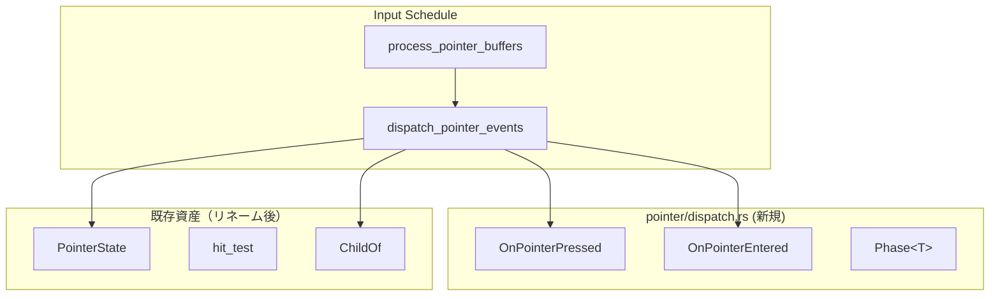
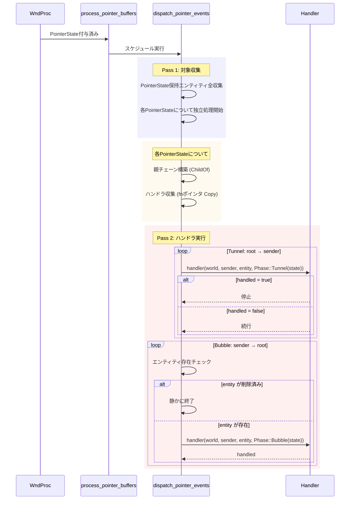
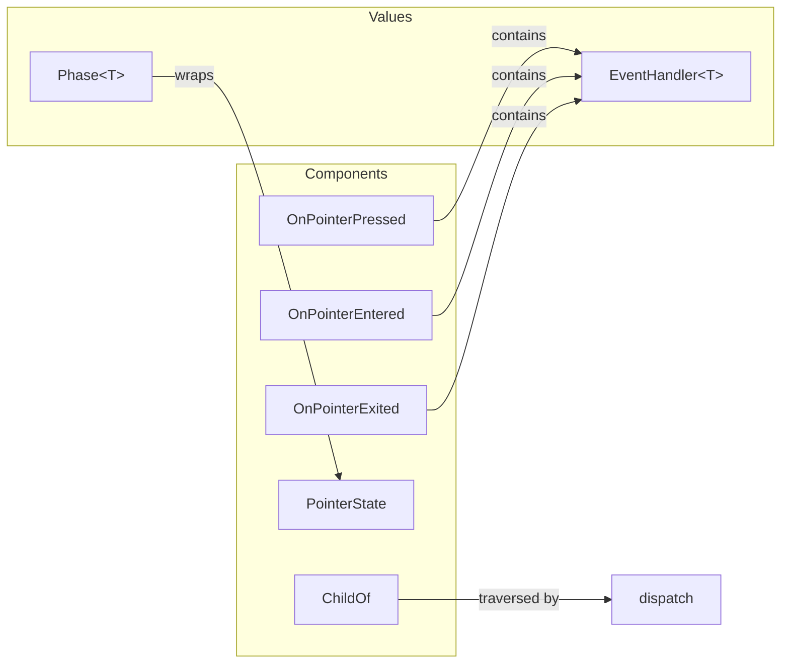

# Design Document: event-dispatch

| 項目 | 内容 |
|------|------|
| **Document Title** | event-dispatch 技術設計書 |
| **Version** | 2.0 |
| **Date** | 2025-12-03 |
| **Status** | Approved |
| **Spec Reference** | `.kiro/specs/event-dispatch/requirements.md` v0.2 |

---

## Design Review Summary

| Issue | 決定 |
|-------|------|
| 1. Handler Granularity | WinUI3スタイル per-event コンポーネント（`OnPointerPressed`, `OnPointerEntered` 等） |
| 2. Handler Arguments | `fn(world, sender, entity, ev)` の4引数スタイル |
| 3. Phase 表現 | `enum Phase<T> { Tunnel(T), Bubble(T) }` で Rust らしく表現 |
| 4. 複数 PointerState | 各 PointerState を独立に処理（マルチポインター対応） |
| 5. 削除時の安全性 | 存在チェックして静かに終了 |
| 6. 命名規則 | Mouse → Pointer にリネーム（WinUI3スタイル、将来のタッチ/ペン対応） |

---

## Overview

**Purpose**: 本機能は wintf フレームワークにおけるポインターイベント配信機構を提供する。ヒットテストで特定されたエンティティから親エンティティへイベントを伝播し、登録されたハンドラを呼び出す。

**Users**: wintf を使用するアプリケーション開発者。ウィジェットにイベントハンドラを登録し、クリック・ホバー等のユーザー操作に応答する。

**Impact**: 既存の `PointerState` コンポーネントベースのイベント検出に、ハンドラディスパッチ機構を追加。`ecs/pointer/dispatch.rs` として新規モジュールを導入。

### Goals

- 子→親へのイベントバブリング機構を提供（1.1-1.5）
- WinUI3スタイルの per-event ハンドラコンポーネントを提供（3.1-3.5）
- 同一フレーム内で伝播を完結（5.2）
- 汎用ディスパッチ設計で将来拡張に対応（8.1-8.4）
- 複数ポインター（マルチタッチ等）の独立処理

### Non-Goals

- キャプチャフェーズ（2.x）— P2、将来実装（ただし Phase::Tunnel で準備済み）
- イベント履歴（9.x）— P2、デバッグ機能
- キーボードイベント — 別仕様
- ハンドラ内パニック処理 — 設計外

---

## Architecture

### Existing Architecture Analysis

本機能は既存のイベントシステムを拡張する：

| 既存資産 | 責務 | 本設計での役割 |
|----------|------|----------------|
| `ecs/mouse.rs` → `ecs/pointer.rs` | PointerState 管理 | 入力データソース（リネーム対象） |
| `ecs/layout/hit_test.rs` | 座標→Entity 特定 | ヒット対象の決定 |
| `ecs/common/tree_iter.rs` | 階層走査 | 参考パターン |
| `ecs/world.rs` | スケジュール管理 | 統合ポイント |

**制約事項**:
- `PointerState` との後方互換性維持
- 既存の Input → Update → Render スケジュール順序を尊重

### Architecture Pattern & Boundary Map



**Architecture Integration**:
- **選択パターン**: 新規モジュール作成（`ecs/pointer/dispatch.rs`）
- **責務分離**: `pointer.rs`（状態管理）と `dispatch.rs`（配信機構）を分離
- **既存パターン**: SparseSet ストレージ、排他システム、ChildOf 走査
- **新規コンポーネント**: `OnPointerPressed`, `OnPointerEntered`, `OnPointerExited`, `Phase<T>`

### Technology Stack

| Layer | Choice / Version | Role in Feature | Notes |
|-------|------------------|-----------------|-------|
| ECS Framework | bevy_ecs 0.17.2 | Component, System, World | 既存依存 |
| Hierarchy | bevy_ecs::hierarchy | ChildOf, Children | 親チェーン走査 |
| Storage | SparseSet | ハンドラコンポーネント | 少数エンティティ最適化 |

---

## System Flows

### イベントディスパッチフロー



**Key Decisions**:
- 2パス方式により世界借用競合を回避
- `true` 返却で即座に伝播停止（stopPropagation 相当）
- 各 PointerState は独立に処理（マルチポインター対応）
- ハンドラ内でエンティティ削除された場合は存在チェックで静かに終了

---

## Requirements Traceability

| Requirement | Summary | Components | Interfaces | Flows |
|-------------|---------|------------|------------|-------|
| 1.1-1.5 | バブリング | dispatch_pointer_events | ChildOf.parent() | Pass 1 |
| 3.1-3.5 | ハンドラコンポーネント | OnPointerPressed, OnPointerEntered | handler fn | Pass 2 |
| 4.1-4.5 | イベントコンテキスト | Phase\<PointerState\> | - | Pass 2 |
| 5.1-5.5 | ディスパッチシステム | dispatch_pointer_events | - | 全体 |
| 6.1-6.5 | ECS統合 | world.rs 拡張 | add_systems | - |
| 7.1-7.4 | メモリ戦略 | OnPointerPressed | SparseSet | - |
| 8.1-8.4 | 汎用ディスパッチ | EventHandler\<T\>, Phase\<T\> | ジェネリック | - |

---

## Components and Interfaces

### Component Summary

| Component | Domain | Intent | Req Coverage | Key Dependencies | Contracts |
|-----------|--------|--------|--------------|------------------|-----------|
| OnPointerPressed | Event | ポインター押下ハンドラ登録 | 3, 7 | bevy_ecs (P0) | State |
| OnPointerEntered | Event | ポインター進入ハンドラ登録 | 3, 7 | bevy_ecs (P0) | State |
| OnPointerExited | Event | ポインター退出ハンドラ登録 | 3, 7 | bevy_ecs (P0) | State |
| Phase\<T\> | Event | 伝播フェーズ + イベントデータ | 4.4, 4.5, 8 | - | - |
| dispatch_pointer_events | System | ポインターイベント配信 | 1, 5, 6 | OnPointer* (P0), ChildOf (P0) | Service |

---

### Core Types

#### EventHandler\<T\>

```rust
/// 汎用イベントハンドラ型
/// 
/// # Type Parameters
/// - `T`: イベントデータ型（PointerState 等）
/// 
/// # Arguments
/// - `world`: 可変 World 参照（コンポーネント読み書き用）
/// - `sender`: 元のヒット対象エンティティ（不変、WinUI3 の OriginalSource 相当）
/// - `entity`: 現在処理中のエンティティ（バブリングで変化、WinUI3 の sender 相当）
/// - `ev`: フェーズ付きイベントデータ
/// 
/// # Returns
/// - `true`: イベント処理済み（伝播停止）
/// - `false`: 未処理（次のエンティティへ伝播続行）
pub type EventHandler<T> = fn(
    world: &mut World,
    sender: Entity,
    entity: Entity,
    ev: &Phase<T>,
) -> bool;

/// ポインターイベントハンドラ型エイリアス
pub type PointerEventHandler = EventHandler<PointerState>;
```

#### Phase\<T\>

```rust
/// イベント伝播フェーズ（Rust らしい enum 表現）
/// 
/// フェーズとイベントデータを一体化し、パターンマッチで処理可能。
#[derive(Clone, Debug)]
pub enum Phase<T> {
    /// トンネルフェーズ（親→子、PreviewXxx 相当）
    Tunnel(T),
    /// バブルフェーズ（子→親、通常イベント）
    Bubble(T),
}

impl<T> Phase<T> {
    /// フェーズに関係なくイベントデータを取得
    pub fn value(&self) -> &T {
        match self {
            Phase::Tunnel(v) | Phase::Bubble(v) => v,
        }
    }
    
    /// トンネルフェーズか判定
    pub fn is_tunnel(&self) -> bool {
        matches!(self, Phase::Tunnel(_))
    }
    
    /// バブルフェーズか判定
    pub fn is_bubble(&self) -> bool {
        matches!(self, Phase::Bubble(_))
    }
}
```

---

### Event Layer (Per-Event Handler Components)

#### OnPointerPressed

| Field | Detail |
|-------|--------|
| Intent | ポインター押下イベントのハンドラを登録する |
| Requirements | 3.1, 3.2, 3.3, 3.4, 3.5, 7.1, 7.2, 7.3, 7.4 |

**Responsibilities & Constraints**
- イベントハンドラの関数ポインタを保持
- SparseSet ストレージにより少数エンティティに最適化
- Copy トレイト対応によりハンドラ収集を効率化

**Dependencies**
- Inbound: dispatch_pointer_events — ハンドラ呼び出し (P0)
- External: bevy_ecs::component::Component — コンポーネントトレイト (P0)

**Contracts**: State [x]

##### State Management

```rust
/// ポインター押下ハンドラコンポーネント（WinUI3 OnPointerPressed 相当）
#[derive(Component, Clone, Copy)]
#[component(storage = "SparseSet")]
pub struct OnPointerPressed(pub PointerEventHandler);

/// ポインター解放ハンドラコンポーネント（WinUI3 OnPointerReleased 相当）
#[derive(Component, Clone, Copy)]
#[component(storage = "SparseSet")]
pub struct OnPointerReleased(pub PointerEventHandler);

/// ポインター進入ハンドラコンポーネント（WinUI3 OnPointerEntered 相当）
#[derive(Component, Clone, Copy)]
#[component(storage = "SparseSet")]
pub struct OnPointerEntered(pub PointerEventHandler);

/// ポインター退出ハンドラコンポーネント（WinUI3 OnPointerExited 相当）
#[derive(Component, Clone, Copy)]
#[component(storage = "SparseSet")]
pub struct OnPointerExited(pub PointerEventHandler);

/// ポインター移動ハンドラコンポーネント（WinUI3 OnPointerMoved 相当）
#[derive(Component, Clone, Copy)]
#[component(storage = "SparseSet")]
pub struct OnPointerMoved(pub PointerEventHandler);
```

- **Persistence**: ECS コンポーネントとしてエンティティに紐付け
- **Concurrency**: 排他システム内で処理のため競合なし

**Usage Example**

```rust
fn my_button_pressed(
    world: &mut World,
    sender: Entity,
    entity: Entity,
    ev: &Phase<PointerState>,
) -> bool {
    // フェーズを区別する場合
    match ev {
        Phase::Tunnel(state) => {
            // Preview 処理（親が先に見る）
            false // 子に伝播続行
        }
        Phase::Bubble(state) => {
            // 通常処理
            println!("Button clicked at {:?}", state.local_point);
            true // 処理済み、伝播停止
        }
    }
}

fn my_button_simple(
    world: &mut World,
    sender: Entity,
    entity: Entity,
    ev: &Phase<PointerState>,
) -> bool {
    // フェーズを気にしない場合
    let state = ev.value();
    if ev.is_bubble() && state.left_down {
        println!("Left button pressed!");
        return true;
    }
    false
}

// 登録
world.entity_mut(button_entity).insert(OnPointerPressed(my_button_pressed));
```
```

---

#### dispatch_pointer_events

| Field | Detail |
|-------|--------|
| Intent | PointerState を持つ全エンティティに対してハンドラを呼び出す |
| Requirements | 1.1, 1.2, 1.3, 1.4, 1.5, 5.1, 5.2, 5.3, 5.4, 5.5, 6.1, 6.4 |

**Responsibilities & Constraints**
- 排他システム（`&mut World`）として実装
- 同一フレーム内で伝播完結（2パス方式）
- Input スケジュール内、`process_pointer_buffers` の後に実行
- 複数の PointerState は独立に処理（マルチポインター対応）
- ハンドラ内でエンティティ削除された場合は存在チェックで静かに終了

**Dependencies**
- Inbound: Input スケジュール — システム実行 (P0)
- Outbound: PointerState — イベント対象検出 (P0)
- Outbound: OnPointer* — ハンドラ取得 (P0)
- Outbound: ChildOf — 親チェーン走査 (P0)

**Contracts**: Service [x]

##### Service Interface

```rust
/// ポインターイベントディスパッチシステム
/// 
/// Input スケジュールで実行される排他システム。
/// PointerState を持つ全エンティティについて独立にバブリング経路を構築し、
/// 登録されたハンドラを順次呼び出す。
/// 
/// # Algorithm
/// 1. PointerState を持つ全エンティティを収集（Clone してデタッチ）
/// 2. 各 (sender, state) について独立に処理:
///    a. ChildOf.parent() を辿り親チェーン（パス）を構築
///    b. Tunnel: root → sender の順で OnPointer* ハンドラを収集・実行
///    c. Bubble: sender → root の順で OnPointer* ハンドラを収集・実行
///    d. 各呼び出し前にエンティティ存在チェック（削除済みなら静かに終了）
///    e. ハンドラが `true` を返したら伝播停止
/// 
/// # Preconditions
/// - process_pointer_buffers が完了済み
/// - PointerState がヒットエンティティに付与済み
/// 
/// # Postconditions
/// - 全ハンドラが呼び出される（または停止/削除で中断）
/// - PointerState は変更されない（Clone で読み取り）
/// 
/// # Invariants
/// - 同一フレーム内で完結（フレーム遅延なし）
/// - 各 PointerState は独立に処理（順序依存なし）
pub fn dispatch_pointer_events(world: &mut World) {
    // Pass 1: 全ての PointerState を持つエンティティを収集
    let targets: Vec<(Entity, PointerState)> = world
        .query::<(Entity, &PointerState)>()
        .iter(world)
        .map(|(e, s)| (e, s.clone()))
        .collect();
    
    // 各ポインター状態について独立に dispatch
    for (sender, state) in targets {
        dispatch_for_sender(world, sender, &state);
    }
}

fn dispatch_for_sender(world: &mut World, sender: Entity, state: &PointerState) {
    // 親チェーン構築
    let path = build_bubble_path(world, sender);
    
    // Tunnel: root → sender
    for &entity in path.iter().rev() {
        // 存在チェック（ハンドラ内で削除された可能性）
        if world.get_entity(entity).is_none() {
            return; // 静かに終了
        }
        if let Some(handler) = get_pointer_handler(world, entity, EventKind::Pressed) {
            if handler(world, sender, entity, &Phase::Tunnel(state.clone())) {
                return; // handled
            }
        }
    }
    
    // Bubble: sender → root
    for &entity in path.iter() {
        if world.get_entity(entity).is_none() {
            return; // 静かに終了
        }
        if let Some(handler) = get_pointer_handler(world, entity, EventKind::Pressed) {
            if handler(world, sender, entity, &Phase::Bubble(state.clone())) {
                return; // handled
            }
        }
    }
}

fn build_bubble_path(world: &World, start: Entity) -> Vec<Entity> {
    let mut path = vec![start];
    let mut current = start;
    while let Some(parent) = world.get::<ChildOf>(current).map(|c| c.parent()) {
        path.push(parent);
        current = parent;
    }
    path
}
```

**Implementation Notes**
- Integration: `world.rs` の Input スケジュールに登録
- Validation: エンティティ存在確認は `world.get_entity()` で処理
- Safety: イベント処理中のツリー破壊は非推奨（ドキュメント注意喚起）
- Risks: 深い階層（>100）でのパフォーマンス — 警告ログで対応

---

## Data Models

### Domain Model



**Aggregates**:
- `OnPointer*`: エンティティごとに0または1つ（イベント種別ごと）
- `Phase<T>`: ディスパッチ中のみ存在する一時値

**Invariants**:
- ハンドラは関数ポインタ（null 不可、Rust 型システム保証）
- Phase は Tunnel または Bubble

---

## Error Handling

### Error Strategy

本機能ではエラー型を定義せず、以下の戦略を採用：

| 状況 | 対応 |
|------|------|
| PointerState なし | 処理スキップ（正常系） |
| ハンドラなし | 次のエンティティへ続行 |
| エンティティ削除 | 存在チェックで静かに終了（panic なし） |
| パス途中で親削除 | 存在チェックで静かに終了 |

**Monitoring**:
- `tracing::debug!` でハンドラ呼び出しをログ
- 深い階層警告は `tracing::warn!` で出力

**Safety Note**:
イベント処理中のツリー破壊（despawn 等）は非推奨。ドキュメントで注意喚起。

---

## Testing Strategy

### Unit Tests

1. **OnPointer* コンポーネント**
   - SparseSet ストレージ確認
   - Clone, Copy トレイト確認

2. **Phase\<T\> 列挙型**
   - Tunnel/Bubble バリアント確認
   - value(), is_tunnel(), is_bubble() メソッド確認
   - Clone, Debug 確認

3. **EventHandler 型**
   - 関数ポインタの呼び出し確認

### Integration Tests

1. **バブリング経路構築**
   - 3階層エンティティでの親チェーン収集
   - ルートで停止確認

2. **ハンドラ呼び出し順序**
   - Tunnel（root→sender）→ Bubble（sender→root）の順序確認
   - 複数ハンドラの呼び出し確認

3. **stopPropagation**
   - `true` 返却で伝播停止確認
   - 後続ハンドラが呼ばれないこと確認

4. **複数 PointerState**
   - 2つの PointerState が独立に処理されること確認

5. **エンティティ削除時の安全性**
   - ハンドラ内で親エンティティを削除した場合、panic せず終了確認

6. **スケジュール統合**
   - process_pointer_buffers → dispatch_pointer_events 順序確認

### Performance Tests

1. **伝播時間計測**
   - 10階層での伝播時間 < 1ms 確認
   - 100エンティティでのバッチ処理時間計測

---

## Appendix: スケジュール登録

```rust
// world.rs への追加
schedules.add_systems(
    Input,
    crate::ecs::pointer::dispatch::dispatch_pointer_events
        .after(crate::ecs::pointer::process_pointer_buffers),
);
```

---

## Appendix: 命名規則リネーム対応表

| 旧名 | 新名 | 備考 |
|------|------|------|
| `ecs/mouse.rs` | `ecs/pointer.rs` | モジュールリネーム |
| `MouseState` | `PointerState` | コンポーネント |
| `MouseLeave` | `PointerLeave` | マーカーコンポーネント |
| `MouseBuffer` | `PointerBuffer` | リソース |
| `process_mouse_buffers` | `process_pointer_buffers` | システム |
| `WindowMouseTracking` | `WindowPointerTracking` | コンポーネント |
| `MouseEventHandler` | `OnPointerPressed` 等 | per-event コンポーネント |
| `dispatch_mouse_events` | `dispatch_pointer_events` | システム |
