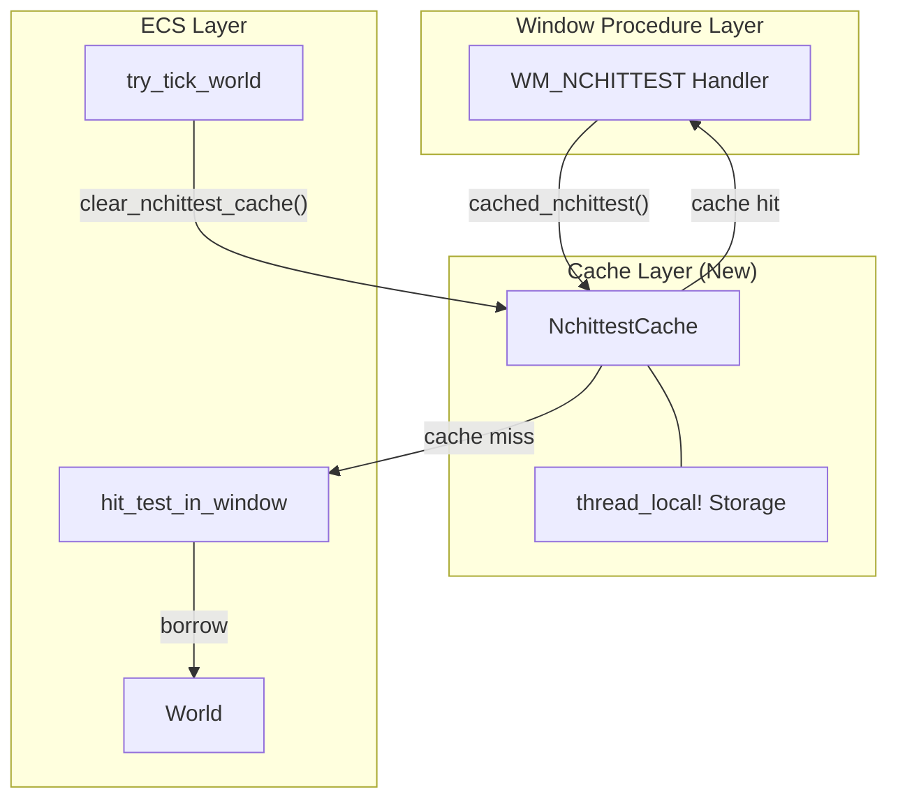
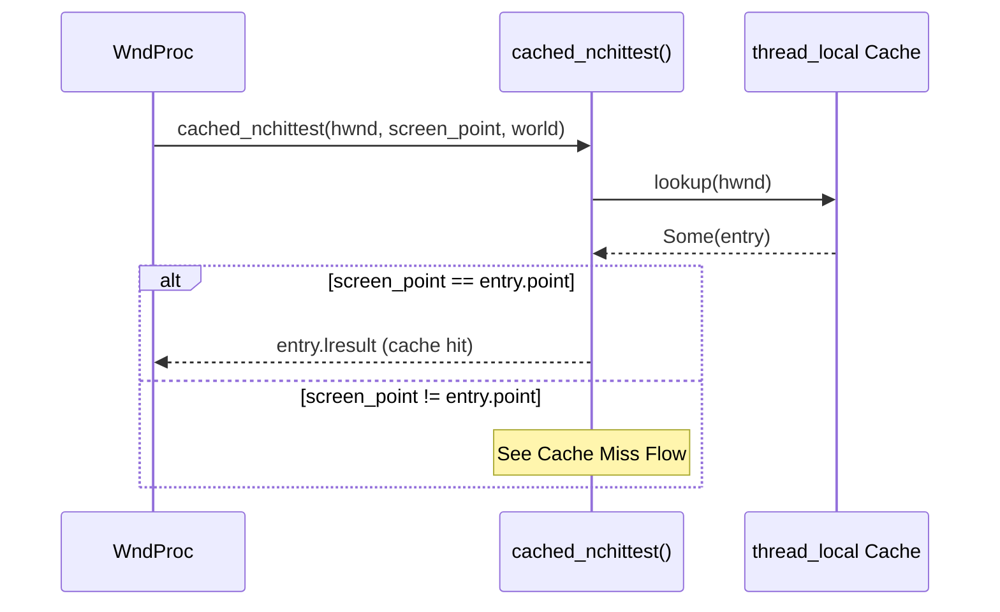
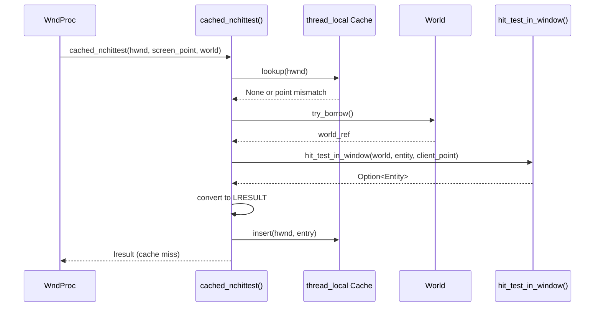
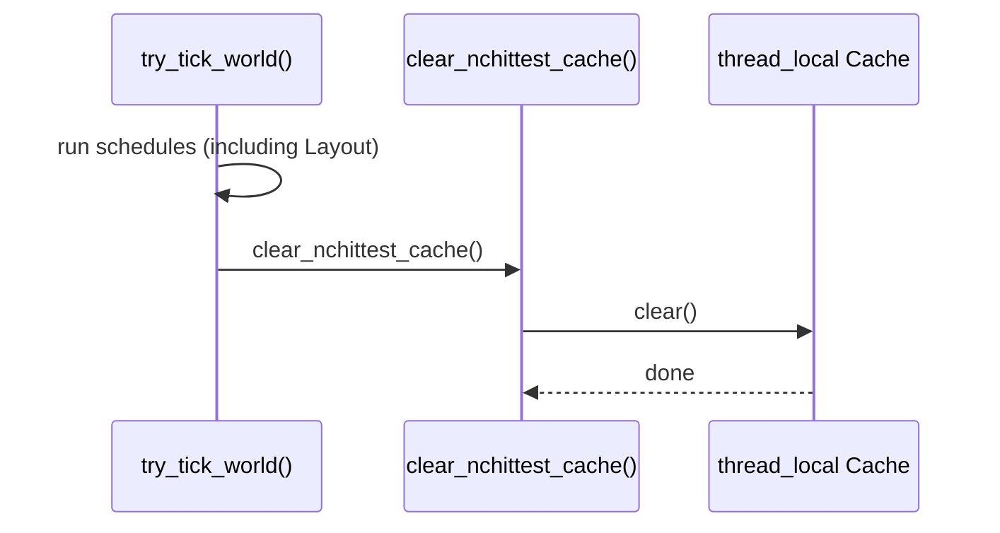
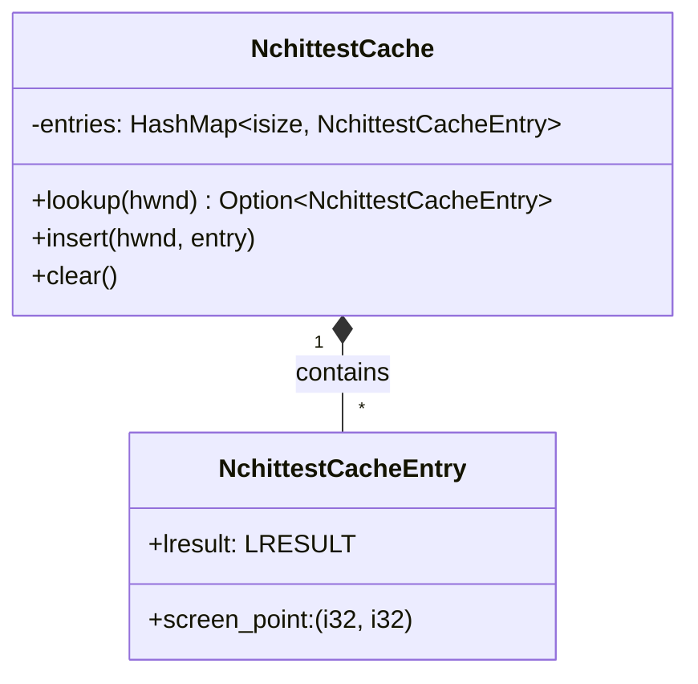

# Technical Design: event-hit-test-cache

| 項目 | 内容 |
|------|------|
| **Document Title** | WM_NCHITTEST キャッシュ技術設計書 |
| **Version** | 1.0 |
| **Date** | 2025-12-03 |
| **Feature** | event-hit-test-cache |
| **Status** | Draft |

---

## Overview

**Purpose**: WM_NCHITTEST の高頻度呼び出しに対するパフォーマンス最適化を提供する。同一座標での重複ヒットテストをスキップし、World 借用オーバーヘッドを削減する。

**Users**: wintf フレームワーク開発者。マウスインタラクションを持つ Windows アプリケーションで透過的にキャッシュの恩恵を受ける。

**Impact**: 既存の WM_NCHITTEST ハンドラ（`handlers.rs`）と tick 処理（`world.rs`）に最小限の変更を加え、キャッシュ機構を統合する。

### Goals

- 同一座標での WM_NCHITTEST 呼び出し時に World 借用をスキップ
- tick/レイアウト更新時にキャッシュを確実にクリア
- 既存の `hit_test_in_window()` API との互換性維持

### Non-Goals

- Entity 情報のキャッシュ（Phase 2 で検討）
- hit_test API 本体の最適化
- 複数座標の LRU キャッシュ

---

## Architecture

### Existing Architecture Analysis

**現在の WM_NCHITTEST 処理フロー**:
```
WM_NCHITTEST 受信
  → ScreenToClient() で座標変換
  → try_get_ecs_world() で World 取得
  → world.try_borrow() で借用
  → hit_test_in_window() 実行
  → HTCLIENT / HTTRANSPARENT 返却
```

**問題点**:
- 毎回 World 借用が発生（Rc<RefCell<EcsWorld>>）
- WM_NCHITTEST は 1 ピクセル移動ごとに送信される
- 借用オーバーヘッドが 60fps バジェットを圧迫

**既存パターン（再利用）**:
- `thread_local!` + `RefCell` パターン（DpiChangeContext, SetWindowPosCommand）
- ウィンドウプロシージャからのスレッドローカルアクセス

### Architecture Pattern & Boundary Map



**Architecture Integration**:

| 項目 | 内容 |
|------|------|
| Selected Pattern | Thread-Local Cache（World 外キャッシュ） |
| Rationale | キャッシュヒット時に World 借用を回避。既存パターン（DpiChangeContext）と一致 |
| Domain Boundaries | Cache Layer は ECS Layer とは独立。handlers.rs と world.rs の2点で統合 |
| Existing Patterns | thread_local! + RefCell パターンを踏襲 |
| New Components | NchittestCache 構造体、cached_nchittest() 関数、clear_nchittest_cache() 関数 |
| Steering Compliance | Rust 型安全性、モジュール責務分離 |

### Technology Stack

| Layer | Choice / Version | Role in Feature | Notes |
|-------|------------------|-----------------|-------|
| Storage | `std::collections::HashMap` | HWND → CacheEntry マッピング | 小規模 N でもオーバーヘッド無視可能 |
| Thread Safety | `std::cell::RefCell` | 内部可変性 | thread_local! と組み合わせ |
| Thread Local | `thread_local!` マクロ | スレッドローカルストレージ | 既存パターン踏襲 |

---

## Requirements Traceability

| Requirement | Summary | Components | Interfaces | Flows |
|-------------|---------|------------|------------|-------|
| 1 | スレッドローカルキャッシュ | NchittestCache | - | - |
| 2 | キャッシュヒット判定 | NchittestCache | cached_nchittest() | Cache Hit Flow |
| 3 | キャッシュクリア | NchittestCache | clear_nchittest_cache() | Cache Clear Flow |
| 4 | キャッシュ公開API | - | cached_nchittest(), clear_nchittest_cache() | - |

---

## System Flows

### Cache Hit Flow



### Cache Miss Flow



### Cache Clear Flow



---

## Components and Interfaces

### Summary

| Component | Domain/Layer | Intent | Req Coverage | Key Dependencies | Contracts |
|-----------|--------------|--------|--------------|------------------|-----------|
| NchittestCache | Cache | HWND ごとのキャッシュエントリ管理 | 1, 2, 3 | HashMap, RefCell | State |
| cached_nchittest | API | キャッシュ付きヒットテスト | 2, 4 | NchittestCache, hit_test_in_window | Service |
| clear_nchittest_cache | API | キャッシュクリア | 3, 4 | NchittestCache | Service |

---

### Cache Layer

#### NchittestCache

| Field | Detail |
|-------|--------|
| Intent | HWND ごとの WM_NCHITTEST 結果をキャッシュ |
| Requirements | 1, 2, 3 |

**Responsibilities & Constraints**
- HWND をキーとしたキャッシュエントリの管理
- スクリーン座標と LRESULT のペアを保持
- thread_local! 内で RefCell により可変性を提供
- 単一スレッド（メインスレッド）でのみ使用

**Dependencies**
- Inbound: cached_nchittest(), clear_nchittest_cache() — キャッシュアクセス (P0)
- Outbound: なし
- External: std::collections::HashMap, std::cell::RefCell (P0)

**Contracts**: State [x]

##### State Management

```rust
/// キャッシュエントリ
struct NchittestCacheEntry {
    /// スクリーン座標（物理ピクセル）
    screen_point: (i32, i32),
    /// WM_NCHITTEST 戻り値
    lresult: LRESULT,
}

/// スレッドローカルキャッシュ
thread_local! {
    static NCHITTEST_CACHE: RefCell<HashMap<isize, NchittestCacheEntry>> 
        = RefCell::new(HashMap::new());
}
```

- **State model**: HashMap<HWND.0 (isize), NchittestCacheEntry>
- **Persistence**: メモリのみ（揮発性）
- **Consistency**: try_tick_world() 終了時に全クリア
- **Concurrency**: thread_local! により排他不要

**Implementation Notes**
- HWND は `windows::Win32::Foundation::HWND` 型。内部値 `.0` は `isize`
- screen_point は `(i32, i32)` タプルで保持（PhysicalPoint の x, y）
- HashMap の初期容量は指定不要（ウィンドウ数は1-2）

---

### API Layer

#### cached_nchittest

| Field | Detail |
|-------|--------|
| Intent | キャッシュ付き WM_NCHITTEST 処理 |
| Requirements | 2, 4 |

**Responsibilities & Constraints**
- キャッシュヒット時は World 借用なしで LRESULT を返却
- キャッシュミス時は hit_test_in_window() を呼び出しキャッシュを更新
- スクリーン座標からクライアント座標への変換を内部で実行

**Dependencies**
- Inbound: WM_NCHITTEST handler — 呼び出し元 (P0)
- Outbound: NchittestCache — キャッシュストレージ (P0)
- Outbound: hit_test_in_window — ヒットテスト実行 (P0)
- External: Rc<RefCell<EcsWorld>> — World 借用 (P0)

**Contracts**: Service [x]

##### Service Interface

```rust
/// キャッシュ付き WM_NCHITTEST 処理
///
/// # Arguments
/// - `hwnd`: ウィンドウハンドル
/// - `screen_point`: スクリーン座標（lparam から取得済み）
/// - `ecs_world`: ECS World（借用元）
///
/// # Returns
/// - `Some(LRESULT)`: HTCLIENT (1) または HTTRANSPARENT (-1)
/// - `None`: 処理失敗時（DefWindowProcW に委譲）
pub fn cached_nchittest(
    hwnd: HWND,
    screen_point: (i32, i32),
    ecs_world: &Rc<RefCell<EcsWorld>>,
) -> Option<LRESULT>;
```

- **Preconditions**: hwnd は有効なウィンドウハンドル、ecs_world は借用可能
- **Postconditions**: キャッシュミス時はキャッシュが更新される
- **Invariants**: LRESULT は HTCLIENT または HTTRANSPARENT のみ

**Implementation Notes**
- screen_point は handlers.rs で lparam から抽出済みの値を受け取る
- クライアント座標変換（ScreenToClient）は関数内で実行
- World 借用失敗時は None を返し DefWindowProcW に委譲

---

#### clear_nchittest_cache

| Field | Detail |
|-------|--------|
| Intent | キャッシュの全クリア |
| Requirements | 3, 4 |

**Responsibilities & Constraints**
- 全ウィンドウのキャッシュエントリをクリア
- try_tick_world() から呼び出される

**Dependencies**
- Inbound: try_tick_world — 呼び出し元 (P0)
- Outbound: NchittestCache — キャッシュストレージ (P0)

**Contracts**: Service [x]

##### Service Interface

```rust
/// キャッシュをクリア
///
/// try_tick_world() 終了時に呼び出す。
/// 全ウィンドウのキャッシュエントリを削除する。
pub fn clear_nchittest_cache();
```

- **Preconditions**: なし
- **Postconditions**: キャッシュは空になる
- **Invariants**: なし

**Implementation Notes**
- HashMap::clear() を呼び出すだけのシンプルな実装
- パフォーマンスクリティカルではない（tick 1回につき1回）

---

## Data Models

### Domain Model



**Aggregates**: NchittestCache（thread_local! 内の単一インスタンス）
**Entities**: NchittestCacheEntry（HWND がキー）
**Value Objects**: screen_point, lresult

### Logical Data Model

| Field | Type | Description |
|-------|------|-------------|
| hwnd | isize | HWND.0 の値（ウィンドウ識別子） |
| screen_point | (i32, i32) | スクリーン座標（物理ピクセル） |
| lresult | LRESULT | HTCLIENT (1) または HTTRANSPARENT (-1) |

**Constraints**:
- hwnd は一意のキー
- lresult は HTCLIENT または HTTRANSPARENT のみ

---

## Error Handling

### Error Strategy

| エラー | 対応 |
|-------|------|
| World 借用失敗 | None を返し DefWindowProcW に委譲 |
| ScreenToClient 失敗 | None を返し DefWindowProcW に委譲 |
| Entity 取得失敗 | None を返し DefWindowProcW に委譲 |

### Monitoring

- キャッシュヒット/ミスのログ出力（trace レベル）
- パフォーマンス問題発生時のデバッグ用

---

## Testing Strategy

### Unit Tests

1. **キャッシュヒット判定**: 同一座標で2回呼び出し、2回目がキャッシュヒットすることを確認
2. **キャッシュミス判定**: 異なる座標で呼び出し、キャッシュが更新されることを確認
3. **キャッシュクリア**: clear_nchittest_cache() 後にキャッシュが空になることを確認
4. **複数ウィンドウ**: 異なる HWND でそれぞれ独立したキャッシュが機能することを確認

### Integration Tests

1. **WM_NCHITTEST ハンドラ統合**: handlers.rs からの呼び出しが正常に動作することを確認
2. **try_tick_world 統合**: tick 後にキャッシュがクリアされることを確認
3. **実際のマウス操作**: サンプルアプリでマウス移動時の動作確認

---

## Performance & Scalability

### Target Metrics

| メトリクス | キャッシュなし | キャッシュあり（ヒット時） |
|-----------|--------------|--------------------------|
| WM_NCHITTEST 処理時間 | 0.1-1.0ms | < 0.01ms |
| World 借用頻度 | 毎回 | キャッシュミス時のみ |

### Optimization

- HashMap は小規模 N（1-2 ウィンドウ）で十分な性能
- thread_local! + RefCell のオーバーヘッドは無視可能
- キャッシュクリアは O(n) だが N が小さいため問題なし

---

## Integration Points

### 変更対象ファイル

| ファイル | 変更内容 |
|---------|---------|
| `ecs/mod.rs` | `mod nchittest_cache;` 追加 |
| `ecs/nchittest_cache.rs` | 新規作成 |
| `ecs/window_proc/handlers.rs` | cached_nchittest() 呼び出しに変更 |
| `ecs/world.rs` | try_tick_world() に clear_nchittest_cache() 追加 |

### 依存関係

```
nchittest_cache.rs
├── 依存: hit_test_in_window (layout/hit_test.rs)
├── 依存: EcsWorld (world.rs)
├── 被依存: handlers.rs (cached_nchittest)
└── 被依存: world.rs (clear_nchittest_cache)
```
