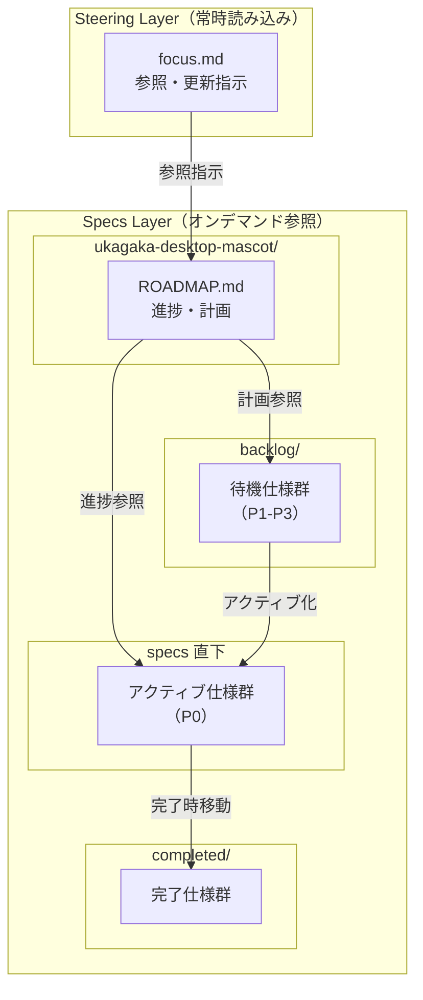
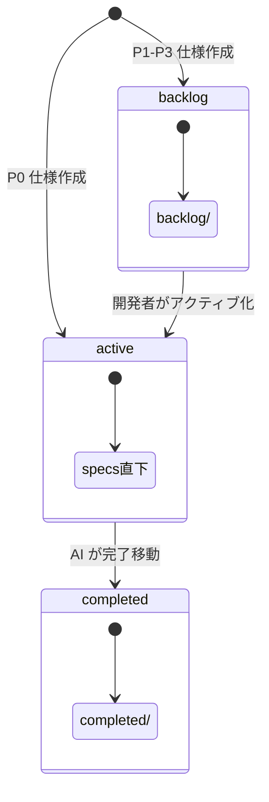
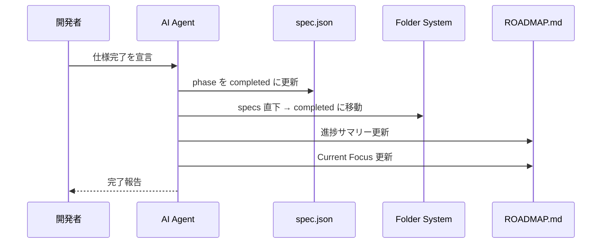
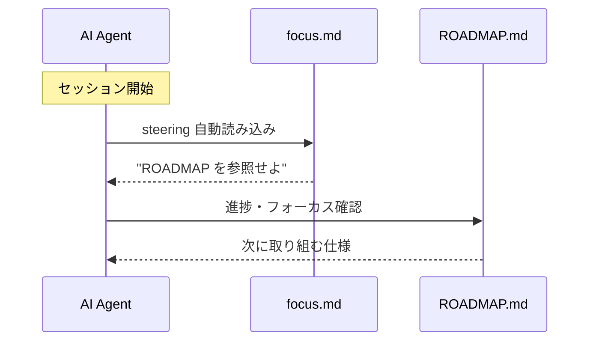

# Design Document

| 項目 | 内容 |
|------|------|
| **Document Title** | メタ仕様ロードマップ管理システム 設計書 |
| **Version** | 1.0 |
| **Date** | 2025-11-29 |
| **Parent Specification** | ukagaka-desktop-mascot |
| **Author** | Claude Opus 4.5 + えちょ |

---

## Overview

**Purpose**: メタ仕様（多数の子仕様を持つ親仕様）の長期駆動を支援するため、ロードマップドキュメントと steering 拡張を提供する。

**Users**: 開発者および AI エージェントがプロジェクトの進捗把握と開発フォーカスの決定に活用する。

**Impact**: 既存の `.kiro/steering/` および `.kiro/specs/` 構造に新規ドキュメントを追加。技術実装は伴わない。

### Goals

- メタ仕様の全体進捗を一目で把握できる ROADMAP.md の提供
- AI エージェントへの参照・更新指示を行う軽量な focus.md の提供
- 仕様ライフサイクルに応じたフォルダ構成の標準化

### Non-Goals

- 進捗追跡の自動化スクリプト実装
- spec.json の自動更新ツール
- CI/CD パイプラインとの統合

---

## Architecture

### Architecture Pattern & Boundary Map



**Architecture Integration**:
- **Selected pattern**: 2層構造（Steering + Specs）による責務分離
- **Domain boundaries**: Steering = AI への指示、Specs = 進捗・計画情報
- **Existing patterns preserved**: 既存の steering 自動読み込み機構を活用
- **New components rationale**: focus.md（軽量指示）と ROADMAP.md（詳細情報）の分離でコンテキスト効率化
- **Steering compliance**: product.md, tech.md, structure.md との整合性維持

### Technology Stack

| Layer | Choice / Version | Role in Feature | Notes |
|-------|------------------|-----------------|-------|
| Document Format | Markdown | すべての成果物 | AI 解析容易 |
| Steering Integration | kiro-style | focus.md 配置 | 既存機構活用 |
| Generation | `/kiro-steering-custom` | focus.md 生成 | 既存コマンド |

---

## Requirements Traceability

| Requirement | Summary | Components | Interfaces | Flows |
|-------------|---------|------------|------------|-------|
| 1.1 | 親仕様ディレクトリに ROADMAP 配置 | ROADMAP.md | - | - |
| 1.2 | アクティブ子仕様一覧表示 | ROADMAP.md | Progress Table | - |
| 1.3 | 各子仕様のフェーズ表示 | ROADMAP.md | Status Badge | - |
| 1.4 | 現在の開発フォーカス明示 | ROADMAP.md | Current Focus | - |
| 1.5 | ドキュメント更新手段提供 | ROADMAP.md | Update Guide | - |
| 1.6 | Tier依存関係の視覚表現 | ROADMAP.md | Dependency Diagram | - |
| 2.1 | ROADMAP参照タイミング記載 | focus.md | Read Timing | - |
| 2.2 | ROADMAP更新タイミング記載 | focus.md | Update Timing | - |
| 2.3 | フォルダ配置ルール記載 | focus.md | Folder Rules | - |
| 2.4 | 詳細はROADMAP参照 | focus.md | Reference | - |
| 2.5 | `/kiro-steering-custom` で生成可能 | focus.md | Generation | - |
| 3.1 | アクティブ仕様を specs 直下に配置 | Folder Structure | - | - |
| 3.2 | P1-P3 を backlog に配置 | Folder Structure | - | - |
| 3.3 | 完了仕様を completed に移動 | Folder Structure | - | Move Flow |
| 3.4 | メタ仕様は常に specs 直下 | Folder Structure | - | - |
| 3.5 | 完了時 AI が completed に移動 | Folder Structure | - | Move Flow |
| 3.6 | アクティブ化時開発者が移動 | Folder Structure | - | Move Flow |
| 4.1 | Tier順実行リスト | ROADMAP.md | Execution Plan | - |
| 4.2 | 並行実行可能仕様の識別 | ROADMAP.md | Parallel Flag | - |
| 4.3 | 進捗サマリー | ROADMAP.md | Summary Stats | - |
| 4.4 | 親要件と子仕様のマッピング | ROADMAP.md | Mapping Table | - |
| 4.5 | 依存関係の明示 | ROADMAP.md | Dependency Note | - |

---

## Components and Interfaces

| Component | Domain/Layer | Intent | Req Coverage | Key Dependencies | Contracts |
|-----------|--------------|--------|--------------|------------------|-----------|
| ROADMAP.md | Specs/Meta | メタ仕様の進捗・計画管理 | 1.1-1.6, 4.1-4.5 | 子仕様 spec.json | Document |
| focus.md | Steering | ROADMAP 参照・更新指示 | 2.1-2.5 | ROADMAP.md | Document |
| Folder Structure | Specs | 仕様ライフサイクル管理 | 3.1-3.6 | - | Convention |

---

### Specs / Meta Layer

#### ROADMAP.md

| Field | Detail |
|-------|--------|
| Intent | メタ仕様の進捗と実行計画を一元管理するドキュメント |
| Requirements | 1.1, 1.2, 1.3, 1.4, 1.5, 1.6, 4.1, 4.2, 4.3, 4.4, 4.5 |
| Owner | 開発者 / AI Agent |

**Responsibilities & Constraints**
- メタ仕様配下の全子仕様の進捗状態を集約
- 優先度（P0-P3）と Tier 依存関係の両方を表現
- 更新は AI Agent または開発者が手動で実施

**Dependencies**
- Inbound: 子仕様の spec.json — フェーズ・優先度取得 (P1)
- Outbound: なし
- External: なし

**Contracts**: Document

##### Document Structure

```markdown
# ROADMAP - {meta-spec-name}

## Current Focus
現在取り組むべき子仕様を明示

## Progress Summary
| Status | Count |
|--------|-------|
| Completed | X |
| In Progress | Y |
| Not Started | Z |

## Active Specifications (P0)

### Tier 依存関係図
[Mermaid diagram]

### 実行計画

| Tier | Spec | Phase | Parallel | Dependencies |
|------|------|-------|----------|--------------|
| 0 | spec-a | implementing | - | - |
| 1 | spec-b | design-approved | ○ | spec-a |

## Backlog (P1-P3)

| Priority | Spec | Description | Parent Req |
|----------|------|-------------|------------|
| P1 | spec-c | ... | 2.1 |

## Requirements Mapping

| Parent Req | Child Specs |
|------------|-------------|
| 1.1 | spec-a, spec-b |

## Update History
- YYYY-MM-DD: 更新内容
```

**Implementation Notes**
- フェーズ表記は spec.json の phase 値をそのまま使用
- Parallel フラグ：同一 Tier 内で依存関係がない場合に「○」
- 更新履歴は直近5件程度を保持

---

### Steering Layer

#### focus.md

| Field | Detail |
|-------|--------|
| Intent | AI エージェントに ROADMAP の参照・更新タイミングを指示する軽量ドキュメント |
| Requirements | 2.1, 2.2, 2.3, 2.4, 2.5 |
| Owner | `/kiro-steering-custom focus` で生成 |

**Responsibilities & Constraints**
- コンテキスト消費を最小化（20-30行以内）
- 詳細情報は含まず、ROADMAP.md への参照のみ
- `/kiro-steering-custom focus` で生成可能

**Dependencies**
- Inbound: なし
- Outbound: ROADMAP.md — 参照先 (P0)
- External: なし

**Contracts**: Document

##### Document Structure

```markdown
# Focus - ロードマップ管理

## ROADMAP 参照タイミング
- セッション開始時：次に取り組む仕様を確認
- 仕様完了時：次の仕様を決定
- 仕様作成時：依存関係を確認

## ROADMAP 更新タイミング
- 仕様フェーズ変更時
- 新規仕様作成時
- 仕様完了時

## フォルダ配置ルール
- specs 直下：アクティブ仕様（P0）
- backlog/：待機仕様（P1-P3）
- completed/：完了仕様

## 参照先
`.kiro/specs/ukagaka-desktop-mascot/ROADMAP.md`
```

**Implementation Notes**
- focus.md の生成は `/kiro-steering-custom focus` コマンドで実施
- メタ仕様名はハードコードせず、参照先パスで指定

---

### Convention Layer

#### Folder Structure

| Field | Detail |
|-------|--------|
| Intent | 仕様のライフサイクルに応じたフォルダ配置ルール |
| Requirements | 3.1, 3.2, 3.3, 3.4, 3.5, 3.6 |
| Owner | 開発者 / AI Agent |

**Responsibilities & Constraints**
- アクティブ仕様（P0）: `.kiro/specs/` 直下
- 待機仕様（P1-P3）: `.kiro/specs/backlog/`
- 完了仕様: `.kiro/specs/completed/`
- メタ仕様: 常に `.kiro/specs/` 直下

**Folder Lifecycle**



**Implementation Notes**
- 完了時の移動: AI Agent が `Move-Item` / `mv` で実行
- アクティブ化時の移動: 開発者が手動で実行（優先度変更の判断が必要なため）

---

## System Flows

### 仕様完了フロー



### ROADMAP 参照フロー



---

## Data Models

本仕様は Markdown ドキュメントのみで構成されるため、データモデルは定義しない。

関連するデータスキーマ:
- `spec.json`: `.kiro/steering/kiro-spec-schema.md` を参照

---

## Appendix

### A. 生成コマンド

本設計承認後、以下の手順で成果物を生成する：

1. **ROADMAP.md 作成**: 設計に基づき手動作成（`.kiro/specs/ukagaka-desktop-mascot/ROADMAP.md`）
2. **focus.md 生成**: `/kiro-steering-custom focus` を実行
3. **フォルダ整理**: P1-P3 仕様を `backlog/` に移動

### B. 更新ルール

| イベント | 更新対象 | 担当 |
|----------|----------|------|
| 仕様フェーズ変更 | ROADMAP.md（実行計画） | AI Agent |
| 仕様完了 | ROADMAP.md（進捗）、フォルダ移動 | AI Agent |
| 新規仕様作成 | ROADMAP.md（実行計画/Backlog） | AI Agent |
| P1→P0 アクティブ化 | フォルダ移動、ROADMAP.md | 開発者 |

### C. NFR 対応

| NFR | 対応方針 |
|-----|----------|
| NFR-1: 軽量性 | Markdown のみ、スクリプトなし |
| NFR-2: 拡張性 | テーブル形式で子仕様を列挙、行追加で対応 |
| NFR-3: 透明性 | Git で全変更を追跡可能 |
| NFR-4: AI 親和性 | 構造化 Markdown、機械解析容易 |
| NFR-5: 既存互換 | `/kiro-steering-custom`、既存 steering 機構を活用 |
