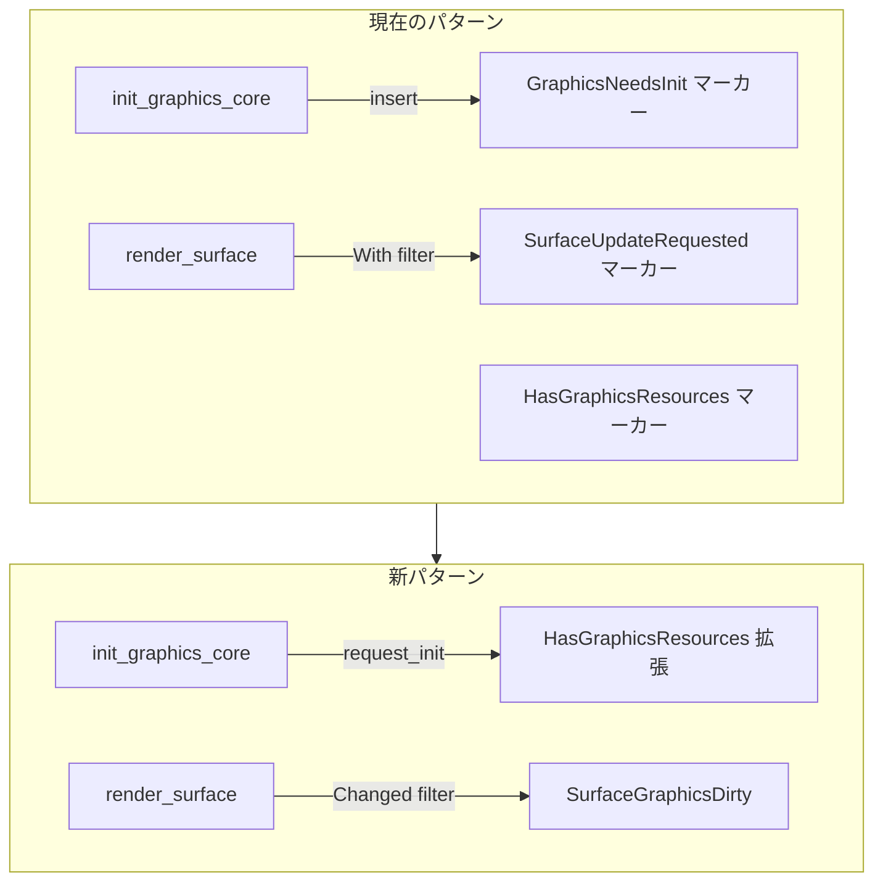
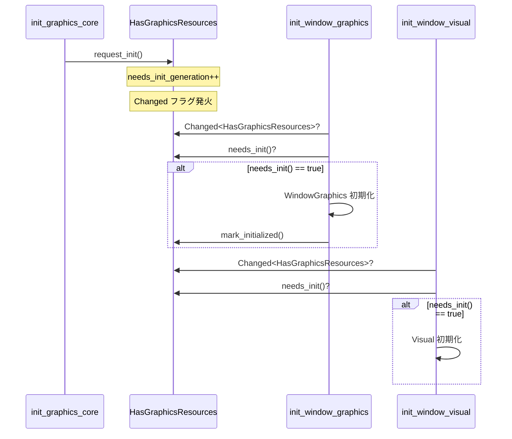
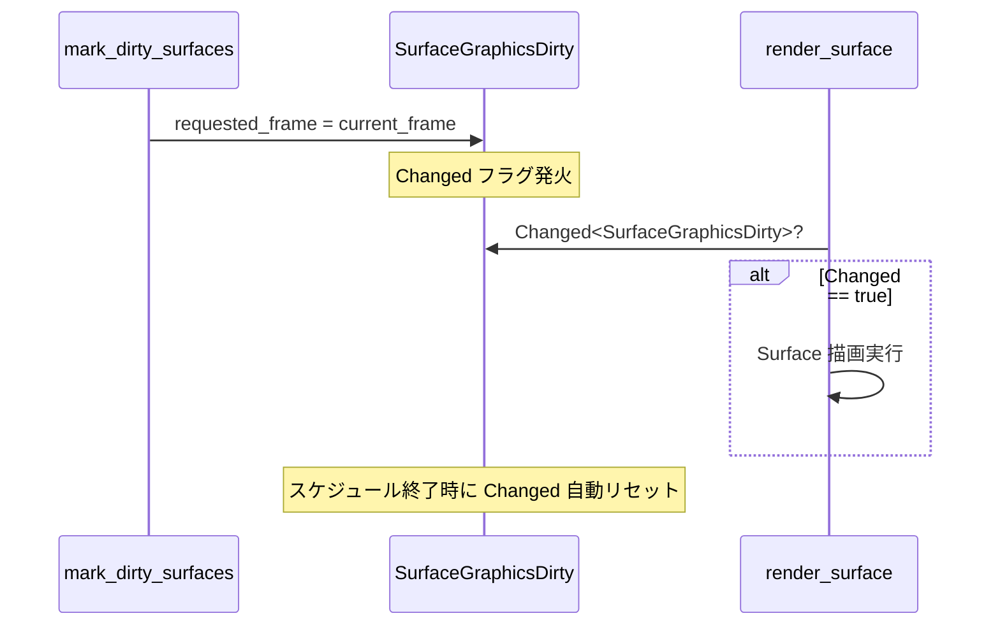
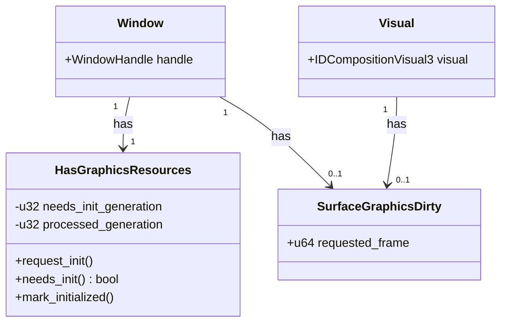

````markdown
# 設計ドキュメント: マーカーコンポーネントからChanged検出への移行

## Overview

**Purpose**: 本機能は bevy_ecs のマーカーコンポーネントパターン（`With<Marker>` + `insert()`/`remove()`）を `Changed<T>` パターンに移行し、アーキタイプ変更のオーバーヘッドを排除する。

**Users**: wintf ライブラリ開発者およびメンテナー。

**Impact**: グラフィックス初期化システムと Surface 描画システムの内部実装を変更。パフォーマンス向上と同一スケジュール内での即時伝搬を実現。

### Goals

- アーキタイプ変更の排除によるパフォーマンス向上
- `Changed<T>` による同一スケジュール内での即時伝搬（最重要）
- `GraphicsNeedsInit` マーカーの廃止による複雑度削減
- コードの簡素化（`insert`/`remove` パターンの削除）

### Non-Goals

- API の完全な後方互換性維持（内部リファクタリングのため一部破壊的変更あり）
- 新機能の追加（純粋なリファクタリング）
- 他のマーカーコンポーネント（`HasGraphicsResources` 以外）の移行

## Architecture

### Existing Architecture Analysis

現在のマーカーコンポーネントパターン:

```
┌─────────────────────────────────────────────────────────────────┐
│  現在の2コンポーネント方式                                        │
├─────────────────────────────────────────────────────────────────┤
│  HasGraphicsResources (静的マーカー)                              │
│    └── GPUリソースを持つエンティティを宣言                         │
│  GraphicsNeedsInit (動的マーカー)                                 │
│    └── 初期化が必要なエンティティを示す                            │
│                                                                 │
│  SurfaceUpdateRequested (動的マーカー)                           │
│    └── Surface再描画が必要なエンティティを示す                     │
└─────────────────────────────────────────────────────────────────┘
```

**問題点**:
- `insert()` は Commands キューに積まれ、同一スケジュール内の後続システムに伝搬しない
- アーキタイプ変更が毎フレーム発生（高コスト）

### Architecture Pattern & Boundary Map



**Architecture Integration**:
- **Selected pattern**: ECS コンポーネント状態変更パターン（マーカー→状態フィールド）
- **Domain boundaries**: グラフィックスシステム内部のみ変更、Window 管理は影響なし
- **Existing patterns preserved**: `Changed<T>` フィルターは既に多数使用（`Changed<Arrangement>` 等）
- **New components rationale**: `SurfaceGraphicsDirty` は描画トリガー状態を明示化、`HasGraphicsResources` 拡張は初期化状態の内包
- **Steering compliance**: ECS 原則（各フレームで状態完結）を維持

### Technology Stack

| Layer | Choice / Version | Role in Feature | Notes |
|-------|------------------|-----------------|-------|
| ECS Framework | bevy_ecs 0.17.2 | `Changed<T>` フィルター提供 | 既存依存 |
| Graphics | DirectComposition | GPU リソース管理 | 変更なし |

## System Flows

### 初期化フロー（GraphicsNeedsInit 移行後）



### Surface 描画フロー（SurfaceUpdateRequested 移行後）



## Requirements Traceability

| Requirement | Summary | Components | Interfaces | Flows |
|-------------|---------|------------|------------|-------|
| 1.1-1.5 | SurfaceGraphicsDirty 定義 | SurfaceGraphicsDirty | Default trait | - |
| 2.1-2.6 | Surface システム変更 | render_surface, mark_dirty_surfaces | Changed<SurfaceGraphicsDirty> | Surface 描画フロー |
| 3.1-3.6 | HasGraphicsResources 拡張 | HasGraphicsResources | request_init(), needs_init(), mark_initialized() | - |
| 4.1-4.6 | 初期化システム変更 | init_graphics_core, init_window_graphics 等 | Changed<HasGraphicsResources> | 初期化フロー |
| 5.1-5.4 | 自動登録 | on_add hooks | - | - |
| 6.1-6.6 | テスト更新 | surface_optimization_test.rs | - | - |
| 7.1-7.4 | API 互換性 | mod.rs exports | pub visibility | - |

## Components and Interfaces

| Component | Domain/Layer | Intent | Req Coverage | Key Dependencies | Contracts |
|-----------|--------------|--------|--------------|-----------------|-----------|
| SurfaceGraphicsDirty | Graphics | Surface 描画リクエスト状態管理 | 1, 2, 5 | FrameCount (P1) | State |
| HasGraphicsResources | Graphics | GPU リソース所有 + 初期化状態管理 | 3, 4, 5 | - | State |
| render_surface | Graphics/System | Surface 描画実行 | 2.1, 2.2 | SurfaceGraphicsDirty (P0) | - |
| mark_dirty_surfaces | Graphics/System | Surface ダーティマーク | 2.3-2.6 | SurfaceGraphicsDirty (P0), FrameCount (P1) | - |
| init_graphics_core | Graphics/System | グラフィックス初期化 | 4.1 | HasGraphicsResources (P0) | - |
| init_window_graphics | Graphics/System | Window グラフィックス初期化 | 4.2 | HasGraphicsResources (P0) | - |

### Graphics / Components

#### SurfaceGraphicsDirty

| Field | Detail |
|-------|--------|
| Intent | Surface 再描画リクエストの状態管理（マーカー置換） |
| Requirements | 1.1, 1.2, 1.3, 1.4, 1.5 |

**Responsibilities & Constraints**
- Surface 描画が必要かどうかの状態を `requested_frame` フィールドで管理
- `Changed<SurfaceGraphicsDirty>` でシステムが検出
- エンティティ生成時に自動登録（`on_add` フック経由）

**Dependencies**
- Inbound: mark_dirty_surfaces — フレーム番号更新 (P0)
- Inbound: deferred_surface_creation_system — 描画トリガー (P0)
- Outbound: render_surface — Changed 検出 (P0)
- External: FrameCount — 現在のフレーム番号 (P1)

**Contracts**: State [x]

##### State Management

```rust
/// SurfaceGraphicsがダーティ（再描画が必要）
#[derive(Component, Default)]
pub struct SurfaceGraphicsDirty {
    /// 最後に描画をリクエストしたフレーム番号
    pub requested_frame: u64,
}
```

- **State model**: `requested_frame` フィールドの値変更で `Changed` フラグ発火
- **Persistence**: ECS World 内のみ（永続化なし）
- **Concurrency**: シングルスレッド ECS 更新（bevy_ecs 標準）

**Implementation Notes**
- Integration: `Visual` または `HasGraphicsResources` の `on_add` フックで自動挿入
- Validation: `requested_frame` は単調増加を前提とするが、オーバーフローは許容（`u64` で十分な範囲）
- Risks: `on_add` フック発火順序に依存するため、フック登録順序に注意

---

#### HasGraphicsResources（拡張）

| Field | Detail |
|-------|--------|
| Intent | GPU リソース所有エンティティ宣言 + 初期化状態管理 |
| Requirements | 3.1, 3.2, 3.3, 3.4, 3.5, 3.6 |

**Responsibilities & Constraints**
- GPUリソースを使用するエンティティを宣言（存在自体がマーカー的役割）
- 初期化/再初期化が必要かどうかの状態を世代番号で管理
- `Changed<HasGraphicsResources>` + `needs_init()` で初期化トリガー検出
- 既存の Window spawn 時に既に付与されているため、事前登録問題は発生しない

**Dependencies**
- Inbound: init_graphics_core — request_init() 呼び出し (P0)
- Outbound: init_window_graphics — Changed + needs_init() 検出 (P0)
- Outbound: init_window_visual — Changed + needs_init() 検出 (P0)
- Outbound: cleanup_graphics_needs_init — mark_initialized() 呼び出し (P0)

**Contracts**: State [x]

##### State Management

```rust
/// GPUリソースを持つエンティティ（初期化状態を内包）
///
/// このコンポーネントは以下の2つの役割を持つ：
/// 1. GPUリソースを使用するエンティティを宣言（存在自体がマーカー）
/// 2. 初期化/再初期化が必要かどうかの状態を管理
///
/// `Changed<HasGraphicsResources>` でグラフィックス初期化トリガーを検出し、
/// `needs_init()` で実際に初期化が必要かを判定する。
#[derive(Component, Default)]
pub struct HasGraphicsResources {
    /// 初期化が必要な世代番号
    needs_init_generation: u32,
    /// 処理済みの世代番号
    processed_generation: u32,
}

impl HasGraphicsResources {
    /// 初期化をリクエスト（ダーティにする）
    pub fn request_init(&mut self) {
        self.needs_init_generation = self.needs_init_generation.wrapping_add(1);
    }
    
    /// 初期化が必要か判定
    pub fn needs_init(&self) -> bool {
        self.needs_init_generation != self.processed_generation
    }
    
    /// 初期化完了をマーク（クリーンにする）
    pub fn mark_initialized(&mut self) {
        self.processed_generation = self.needs_init_generation;
    }
}
```

- **State model**: 世代番号比較による dirty 判定
- **Persistence**: ECS World 内のみ
- **Concurrency**: シングルスレッド ECS 更新

**Implementation Notes**
- Integration: Window spawn 時に既に存在、追加作業不要
- Validation: `wrapping_add` でオーバーフロー対応（`u32` で約42億回の再初期化に対応）
- Risks: `needs_init()` と `mark_initialized()` の呼び出し順序ミスで永続ダーティ状態になる可能性

---

### Graphics / Systems

#### render_surface システム変更

| Field | Detail |
|-------|--------|
| Intent | Surface 描画実行（Changed フィルターに移行） |
| Requirements | 2.1, 2.2 |

**変更前**:
```rust
pub fn render_surface(
    mut query: Query<..., With<SurfaceUpdateRequested>>,
) {
    // 描画処理
    commands.entity(entity).remove::<SurfaceUpdateRequested>();
}
```

**変更後**:
```rust
pub fn render_surface(
    mut query: Query<..., Changed<SurfaceGraphicsDirty>>,
) {
    // 描画処理
    // remove は不要（Changed は自動リセット）
}
```

**Implementation Notes**
- `remove::<SurfaceUpdateRequested>()` 呼び出しを削除
- `With<SurfaceUpdateRequested>` を `Changed<SurfaceGraphicsDirty>` に置換

---

#### mark_dirty_surfaces システム変更

| Field | Detail |
|-------|--------|
| Intent | Surface ダーティマーク（insert からフィールド更新に移行） |
| Requirements | 2.3, 2.5, 2.6 |

**変更前**:
```rust
pub fn mark_dirty_surfaces(
    query: Query<Entity, (Changed<GraphicsCommandList>, ...)>,
    mut commands: Commands,
) {
    commands.entity(entity).insert(SurfaceUpdateRequested);
}
```

**変更後**:
```rust
pub fn mark_dirty_surfaces(
    mut query: Query<
        &mut SurfaceGraphicsDirty,
        Or<(
            Changed<GraphicsCommandList>,
            Changed<SurfaceGraphics>,
            Added<SurfaceGraphics>,  // on_surface_graphics_changed フック代替
            Changed<GlobalArrangement>,
        )>,
    >,
    frame_count: Res<FrameCount>,
) {
    for mut dirty in query.iter_mut() {
        dirty.requested_frame = frame_count.0;
    }
}
```

**Implementation Notes**
- `SafeInsertSurfaceUpdateRequested` カスタムコマンド削除
- `on_surface_graphics_changed` フック削除（`Added<SurfaceGraphics>` で代替）
- 全トリガーロジックを `mark_dirty_surfaces` に集約

---

#### init_graphics_core システム変更

| Field | Detail |
|-------|--------|
| Intent | グラフィックス初期化トリガー（insert から request_init() に移行） |
| Requirements | 4.1 |

**変更前**:
```rust
for entity in entities_with_graphics.iter() {
    commands.entity(entity).insert(GraphicsNeedsInit);
}
```

**変更後**:
```rust
for mut res in query.iter_mut() {
    res.request_init();
}
```

**Implementation Notes**
- `insert(GraphicsNeedsInit)` を `request_init()` メソッド呼び出しに置換
- Commands 経由ではなく直接 `&mut HasGraphicsResources` を更新

---

#### init_window_graphics / init_window_visual システム変更

| Field | Detail |
|-------|--------|
| Intent | 初期化対象検索（With フィルターから Changed + needs_init() に移行） |
| Requirements | 4.2, 4.3 |

**変更前**:
```rust
Query<..., With<GraphicsNeedsInit>>
```

**変更後**:
```rust
Query<..., Changed<HasGraphicsResources>>

// システム内で追加条件
if res.needs_init() {
    // 初期化処理
}
```

**Implementation Notes**
- `Changed<HasGraphicsResources>` で変更検出
- `needs_init()` で実際に初期化が必要かを判定（false positive 除外）

---

#### cleanup_graphics_needs_init システム変更

| Field | Detail |
|-------|--------|
| Intent | 初期化完了マーク（remove から mark_initialized() に移行） |
| Requirements | 4.4 |

**変更前**:
```rust
commands.entity(entity).remove::<GraphicsNeedsInit>();
```

**変更後**:
```rust
res.mark_initialized();
```

**Implementation Notes**
- `remove::<GraphicsNeedsInit>()` を `mark_initialized()` メソッド呼び出しに置換

---

### 自動登録（on_add フック）

| Field | Detail |
|-------|--------|
| Intent | SurfaceGraphicsDirty の事前登録 |
| Requirements | 5.1, 5.2, 5.3, 5.4 |

**設計原則「すべてはビジュアルである」**:

ウィジェット階層において、`Visual` をアンカーコンポーネントとして採用。
Window を含むすべてのウィジェットは `Visual` を持ち、`Visual` の `on_add` フックで
関連コンポーネント（`SurfaceGraphicsDirty`）を連鎖的に登録する。

**コンポーネント登録チェーン**:
```
Window/Rectangle/Label の on_add
  └─> Visual 挿入
        └─> Visual の on_add
              └─> SurfaceGraphicsDirty 挿入
```

**実装方法**:

```rust
// Visual コンポーネントの on_add フックで SurfaceGraphicsDirty を挿入
#[derive(Component)]
#[component(on_add = on_visual_added)]
pub struct Visual { ... }

fn on_visual_added(mut world: DeferredWorld, context: HookContext) {
    // 既に存在する場合はスキップ
    if world.get::<SurfaceGraphicsDirty>(context.entity).is_none() {
        world.commands().entity(context.entity).insert(SurfaceGraphicsDirty::default());
    }
}
```

**既存の Visual 自動挿入（維持）**:
- `Window`: `on_window_add` フックで `Visual::default()` を挿入（実装済み）
- `Rectangle`: `on_rectangle_add` フックで `Visual::default()` を挿入（実装済み）
- `Label`: `on_label_add` フックで `Visual::default()` を挿入（実装済み）

**Implementation Notes**
- フック選択: `HasGraphicsResources` フックが推奨（より明確な依存関係）
- 初回 `Changed` 検出: コンポーネント追加時に `Changed` が true になるため、初期フレームでの検出は保証される

## Data Models

### Domain Model



**Aggregates**: Window エンティティが `HasGraphicsResources` と `SurfaceGraphicsDirty` を所有

**Invariants**:
- `HasGraphicsResources` は Window spawn 時に必ず存在
- `SurfaceGraphicsDirty` は `HasGraphicsResources` または `Visual` 追加時に自動挿入
- `needs_init_generation >= processed_generation`（wrapping を考慮）

## Error Handling

### Error Strategy

本機能は内部リファクタリングのため、新しいエラーケースは発生しない。

**既存エラー処理との互換性**:
- `Changed<T>` 検出失敗: 通常は発生しない（ECS フレームワーク保証）
- コンポーネント未登録: `on_add` フックで自動登録により回避

### Monitoring

- `requested_frame` と `FrameCount` の比較でダーティ状態の追跡が可能
- `needs_init_generation` と `processed_generation` で初期化状態の追跡が可能

## Testing Strategy

### Unit Tests

1. `HasGraphicsResources::request_init()` が `needs_init_generation` をインクリメントすることを検証
2. `HasGraphicsResources::needs_init()` が世代番号不一致時に `true` を返すことを検証
3. `HasGraphicsResources::mark_initialized()` が世代番号を同期することを検証
4. `SurfaceGraphicsDirty::default()` が `requested_frame: 0` を返すことを検証

### Integration Tests

1. `render_surface` システムが `Changed<SurfaceGraphicsDirty>` で正しく検出することを検証
2. `mark_dirty_surfaces` システムがフレーム番号を正しく更新することを検証
3. `init_graphics_core` → `init_window_graphics` の初期化フローが動作することを検証
4. `on_add` フックによる `SurfaceGraphicsDirty` 自動登録を検証

### E2E Tests

1. 既存の `surface_optimization_test.rs` テストが新パターンで成功することを検証
2. `areka.rs` サンプルアプリケーションが正常動作することを検証

## Migration Strategy

### Phase 1: SurfaceGraphicsDirty 移行

1. `SurfaceGraphicsDirty` コンポーネント定義追加
2. `on_add` フックで自動登録実装
3. `mark_dirty_surfaces` システム変更
4. `render_surface` システム変更
5. `on_surface_graphics_changed` フック削除
6. `SafeInsertSurfaceUpdateRequested` コマンド削除
7. `SurfaceUpdateRequested` コンポーネント削除
8. テスト更新・実行

### Phase 2: HasGraphicsResources 拡張

1. `HasGraphicsResources` フィールド・メソッド追加
2. `init_graphics_core` システム変更
3. `init_window_graphics` システム変更
4. `init_window_visual` システム変更
5. `cleanup_graphics_needs_init` システム変更（リネーム検討）
6. `cleanup_command_list_on_reinit` システム変更
7. `create_visuals_for_init_marked` システム変更
8. `GraphicsNeedsInit` コンポーネント削除
9. テスト更新・実行

### Rollback Triggers

- 既存テストの大量失敗（5件以上）
- サンプルアプリケーションの描画異常
- パフォーマンス悪化（ベースライン比 20% 以上）

### Validation Checkpoints

- 各 Phase 終了時に `cargo test --all-targets` 実行
- Phase 1 終了時にサンプルアプリケーション動作確認
- Phase 2 終了時に全機能の動作確認

## Supporting References

### 廃止されるコンポーネント・コード

| 項目 | ファイル | 行 |
|------|---------|-----|
| `SurfaceUpdateRequested` | components.rs | 203 |
| `GraphicsNeedsInit` | components.rs | 16 |
| `SafeInsertSurfaceUpdateRequested` | components.rs | 189-196 |
| `on_surface_graphics_changed` | components.rs | フック定義箇所 |

### 既存 Changed パターン参考

| パターン | ファイル | 用途 |
|---------|---------|------|
| `Changed<Arrangement>` | systems.rs | レイアウト変更検出 |
| `Changed<GlobalArrangement>` | systems.rs | グローバル配置変更検出 |
| `Changed<GraphicsCommandList>` | systems.rs | 描画コマンド変更検出 |
| `Changed<SurfaceGraphics>` | systems.rs | Surface 変更検出 |

````
