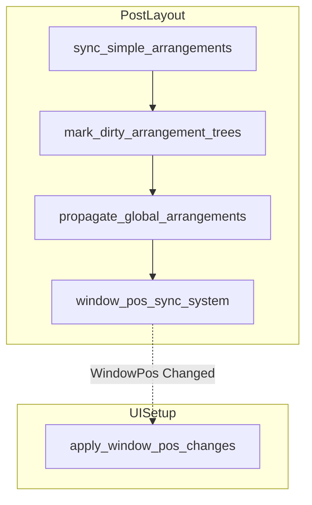

# Design Document: sync_window_pos 統合

## Overview

**Purpose**: `GlobalArrangement.bounds` → `WindowPos` 変換の重複を解消し、単一システム `window_pos_sync_system` に統合する。layout モジュールに配置し、正しい丸めロジック（ceil）を適用する。

**Users**: wintf フレームワーク開発者。後続仕様（wintf-fix3, wintf-fix4）の前提条件として必要。

**Impact**: `graphics/systems.rs` と `layout/systems.rs` の2つの重複システムを layout モジュールの1システムに統合。PostLayout スケジュールの登録を簡素化。

### Goals
- 重複する `GlobalArrangement.bounds` → `WindowPos` 変換を1つのシステムに統合
- 正しいサイズ変換（ceil）を唯一の実装として確立
- 後続仕様（wintf-fix3, wintf-fix4）の土台を整備

### Non-Goals
- `format_entity_name` の共通化（layout → graphics の既存依存パターンを維持）
- `apply_window_pos_changes` の変更（UISetup スケジュール内、スコープ外）
- DPI 変換ロジックの変更（bounds は既に物理ピクセル座標）

## Architecture

### Existing Architecture Analysis

現在の PostLayout スケジュールには同一変換を行う2システムが連鎖登録されている:

```
PostLayout:
  sync_simple_arrangements
  → mark_dirty_arrangement_trees
  → propagate_global_arrangements
  → sync_window_pos              ← graphics/systems.rs（廃止対象）
  → update_window_pos_system     ← layout/systems.rs（廃止対象）
```

**問題点**:
- サイズ計算の差異（`sync_window_pos` = ceil、`update_window_pos_system` = truncation）により、後段の truncation が正しい ceil を上書き
- `sync_window_pos` は差分検出・ガード・ログ完備、`update_window_pos_system` はいずれも欠如
- `sync_window_pos` のクエリに未使用の `&Arrangement` と `Changed<Arrangement>` が残存

### Architecture Pattern & Boundary Map



- **選択パターン**: 移動+リネーム（Option A）— 既存ロジックを layout に移動
- **ドメイン境界**: `WindowPos` は layout の責務。graphics モジュールからの除去が適切
- **既存パターン維持**: `format_entity_name` は `layout/systems.rs` で既に `use crate::ecs::graphics::format_entity_name` として使用（L14）。追加の依存変更なし
- **ステアリング準拠**: レイヤー分離（structure.md）、構造化ログ規約（logging.md）

### Technology Stack

| Layer | Choice / Version | Role in Feature | Notes |
|-------|------------------|-----------------|-------|
| ECS | bevy_ecs 0.17.2 | Query, Changed フィルタ, Schedule 登録 | 既存依存、変更なし |
| Window API | windows 0.62.1 | `POINT`, `SIZE` 型 | 既存依存、変更なし |
| Logging | tracing | 構造化ログ出力 | 既存依存、変更なし |

新規依存なし。

## Requirements Traceability

| Requirement | Summary | Components | Interfaces | Flows |
|-------------|---------|------------|------------|-------|
| 1.1 | 単一 ECS システム提供 | window_pos_sync_system | Query signature | PostLayout chain |
| 1.2 | GlobalArrangement 変更時に更新 | window_pos_sync_system | Changed filter | PostLayout chain |
| 1.3 | layout モジュールに配置 | layout/systems.rs | — | — |
| 2.1 | position 変換（truncate） | window_pos_sync_system | — | — |
| 2.2 | size 変換（ceil） | window_pos_sync_system | — | — |
| 2.3 | 無効 bounds スキップ | window_pos_sync_system | — | — |
| 2.4 | 差分検出 | window_pos_sync_system | — | — |
| 3.1 | sync_window_pos 削除 | graphics/systems.rs | — | — |
| 3.2 | update_window_pos_system 削除 | layout/systems.rs | — | — |
| 3.3 | world.rs 登録統合 | world.rs | Schedule registration | PostLayout chain |
| 4.1 | propagate_global_arrangements の後 | world.rs | .after() constraint | PostLayout chain |
| 4.2 | PostLayout chain 末尾 | world.rs | .chain() | PostLayout chain |
| 5.1–5.5 | 構造化ログ | window_pos_sync_system | tracing macros | — |
| 6.1 | cargo test パス | テスト更新 | — | — |
| 6.2 | 全 DPI 動作 | — | — | — |
| 6.3 | テスト内旧名更新 | layout_graphics_sync_test.rs | — | — |

## Components and Interfaces

| Component | Domain/Layer | Intent | Req Coverage | Key Dependencies | Contracts |
|-----------|--------------|--------|--------------|------------------|-----------|
| `window_pos_sync_system` | layout | GlobalArrangement → WindowPos 変換 | 1.1–1.3, 2.1–2.4, 4.1–4.2, 5.1–5.5 | GlobalArrangement (P0), WindowPos (P0), FrameCount (P1) | Service |
| graphics/systems.rs 削除 | graphics | sync_window_pos 関数除去 | 3.1 | — | — |
| world.rs 登録更新 | world | PostLayout スケジュール統合 | 3.3, 4.1, 4.2 | window_pos_sync_system (P0) | — |
| テスト更新 | tests | 旧システム名参照の更新 | 6.1, 6.3 | window_pos_sync_system (P0) | — |

### Layout Layer

#### window_pos_sync_system

| Field | Detail |
|-------|--------|
| Intent | GlobalArrangement.bounds を WindowPos（position, size）に変換する単一の ECS システム |
| Requirements | 1.1, 1.2, 1.3, 2.1, 2.2, 2.3, 2.4, 5.1, 5.2, 5.3, 5.4, 5.5 |

**Responsibilities & Constraints**
- `GlobalArrangement.bounds` → `WindowPos.position`（truncate）と `WindowPos.size`（ceil）の変換
- 無効な bounds（幅 ≤ 0 or 高さ ≤ 0）のスキップ
- 差分検出による不要な Changed フラグ発行の防止
- 構造化ログ（debug/trace レベル）の出力

**Dependencies**
- Inbound: `GlobalArrangement` — 変換元の座標データ (P0)
- Inbound: `Window` — フィルタ条件 (P0)
- Inbound: `FrameCount` — ログ用フレーム番号 (P1)
- Outbound: `WindowPos` — 変換結果の書き込み先 (P0)
- Outbound: `format_entity_name` — エンティティ名フォーマット (P2)

**Contracts**: Service [x]

##### Service Interface

```rust
/// GlobalArrangement の変更を WindowPos に反映する ECS システム。
///
/// bounds.left/top → WindowPos.position（truncate to i32）
/// bounds の幅/高さ → WindowPos.size（ceil to i32）
pub fn window_pos_sync_system(
    query: Query<
        (Entity, &GlobalArrangement, &mut WindowPos, Option<&Name>),
        (With<Window>, Changed<GlobalArrangement>),
    >,
    frame_count: Res<FrameCount>,
)
```

- **Preconditions**: `propagate_global_arrangements` が完了し、`GlobalArrangement.bounds` が最新であること
- **Postconditions**: `Changed<GlobalArrangement>` を持つ全 `Window` エンティティの `WindowPos` が更新済み（変更がある場合のみ `Changed` フラグ発行）
- **Invariants**: 無効 bounds（幅 ≤ 0 or 高さ ≤ 0）のエンティティは更新されない

**設計判断**

1. **クエリの簡素化**: 旧 `sync_window_pos` の `&Arrangement` と `Changed<Arrangement>` を除去。`Arrangement` は未使用（`_arrangement`）であり、`GlobalArrangement` が既に `Arrangement` の伝播結果を含むため不要
2. **Changed フィルタ**: `Changed<GlobalArrangement>` のみ。`Or<(Changed<GlobalArrangement>, Changed<Arrangement>)>` から簡素化
3. **format_entity_name の依存**: `layout/systems.rs` は既に L14 で `use crate::ecs::graphics::format_entity_name` をインポートしている。既存パターンの踏襲であり、追加の依存変更は不要

**Implementation Notes**
- Integration: `sync_window_pos` のロジックをそのまま移植。ログプレフィックスのみ `[window_pos_sync_system]` に変更
- Validation: 既存テスト（`test_sync_window_pos`, `test_skip_invalid_bounds`, `test_echo_back_flow`）がシステム名更新のみで動作継続
- Risks: なし。新規ロジックの追加がないため

### Graphics Layer（削除）

#### sync_window_pos（削除対象）

| Field | Detail |
|-------|--------|
| Intent | `graphics/systems.rs` から `sync_window_pos` 関数を完全に削除 |
| Requirements | 3.1 |

**Implementation Notes**
- `pub fn sync_window_pos` の関数定義（約90行）を削除
- `graphics/mod.rs` の `pub use systems::*` により自動的にエクスポートから除外
- `ecs/mod.rs` の `pub use graphics::*` にも変更不要（ワイルドカード）

### World Layer（登録更新）

#### PostLayout スケジュール登録

| Field | Detail |
|-------|--------|
| Intent | 旧2システムの登録を `window_pos_sync_system` 1つに置換 |
| Requirements | 3.3, 4.1, 4.2 |

**変更前**:
```rust
crate::ecs::graphics::sync_window_pos
    .after(crate::ecs::layout::propagate_global_arrangements),
crate::ecs::layout::update_window_pos_system
    .after(crate::ecs::graphics::sync_window_pos),
```

**変更後**:
```rust
crate::ecs::layout::window_pos_sync_system
    .after(crate::ecs::layout::propagate_global_arrangements),
```

### Tests Layer（更新）

#### layout_graphics_sync_test.rs

| Field | Detail |
|-------|--------|
| Intent | 3テストのシステム名参照を `window_pos_sync_system` に更新 |
| Requirements | 6.1, 6.3 |

**更新対象**:
| テスト関数 | 変更内容 |
|-----------|---------|
| `test_sync_window_pos` | `wintf::ecs::sync_window_pos` → `wintf::ecs::window_pos_sync_system` |
| `test_skip_invalid_bounds` | 同上（`IntoSystem::into_system` の引数） |
| `test_echo_back_flow` | 同上（スケジュール登録） |

`FrameCount` リソースの挿入は引き続き必要。テスト期待値の変更は不要（既存テストは ceil ベースで作成済み）。

## Testing Strategy

### Unit Tests
- **既存テスト更新**: `layout_graphics_sync_test.rs` の3テストでシステム名を `window_pos_sync_system` に更新。期待値は変更なし
- **bounds 変換テスト**: `test_sync_window_pos` — position（truncate）と size（ceil）の正確性を検証（既存）
- **無効 bounds テスト**: `test_skip_invalid_bounds` — 幅・高さ ≤ 0 のスキップを検証（既存）
- **差分検出テスト**: `test_echo_back_flow` — Changed フラグの適切な発行を検証（既存）

### Integration Tests
- **`cargo test` 全パス**: 統合後にすべての既存テストがパスすることを確認
- **サンプルアプリ動作確認**: `cargo run --example areka` でウィンドウ位置が正しいことを目視確認（全 DPI）
