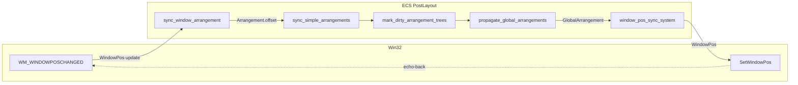
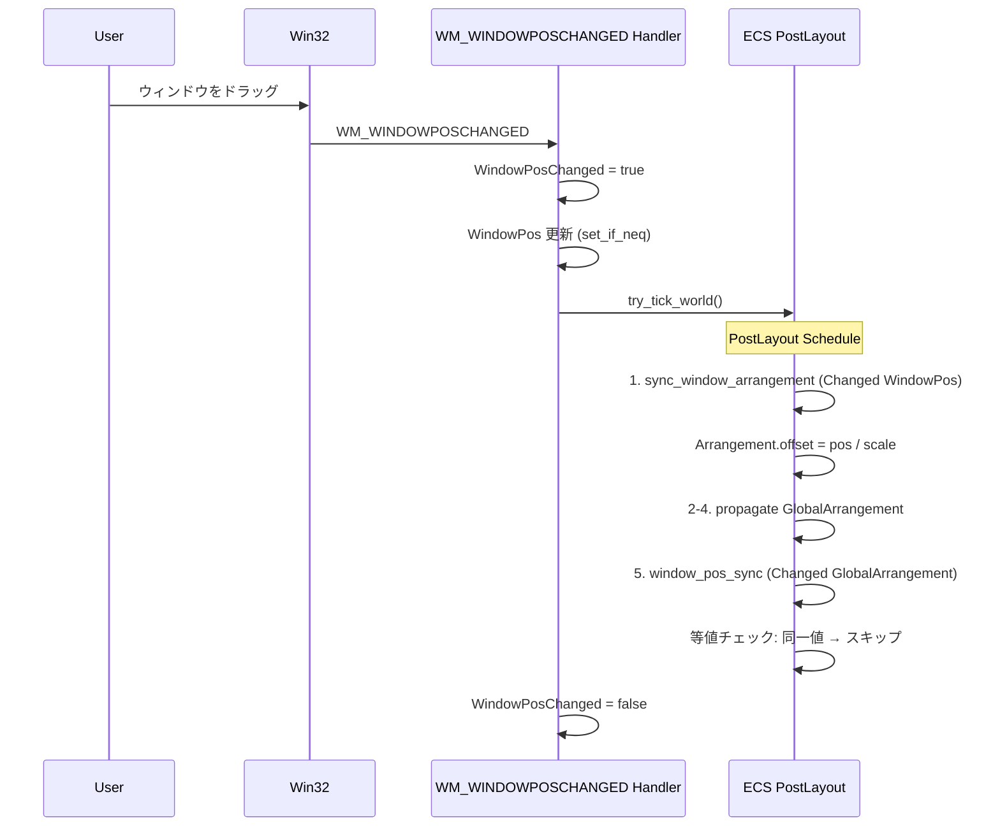
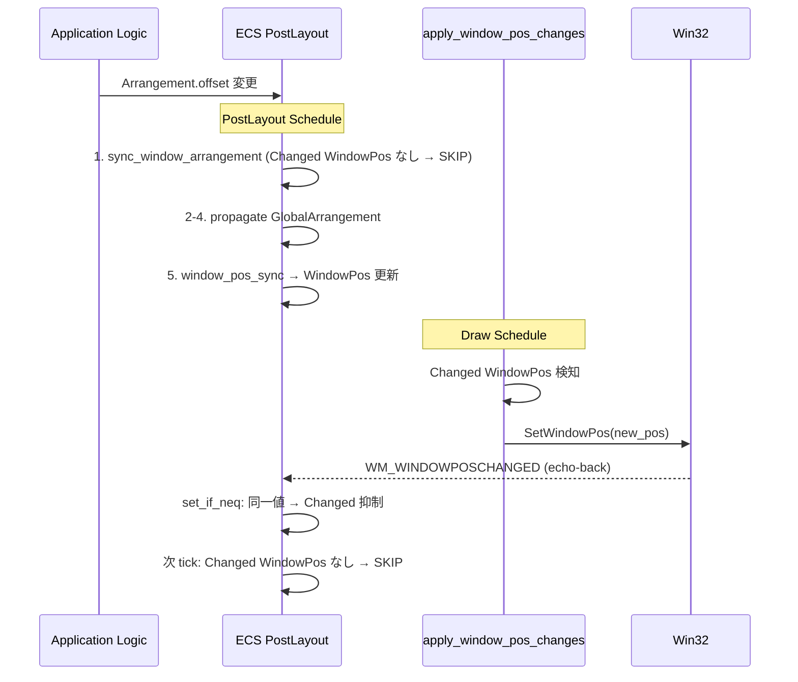
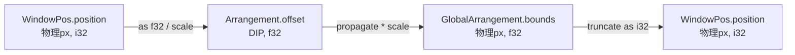

# Design Document: wintf-fix3-sync-arrangement-enable

## Overview

### Feature Description
コメントアウトにより無効化されている逆方向同期システム `sync_window_arrangement_from_window_pos` を有効化し、Win32 ウィンドウ位置変更を ECS `Arrangement` に反映する。Option B'（`Changed<WindowPos>` フィルタ + `set_if_neq` パターン）を採用し、効率的な双方向同期を実現する。

### Scope
- **対象**: PostLayout スケジュール内の逆方向同期システム有効化
- **変更ファイル**: `systems.rs`（フィルタ追加）、`world.rs`（コメントアウト解除）、`handlers.rs`（set_if_neq パターン）
- **新規追加**: なし（コンポーネント、リソース、テスト以外の新規ファイルなし）

### Dependencies

| 依存 | 方向 | 重要度 | 説明 |
|------|------|--------|------|
| wintf-fix1 完了 | Inbound | P0 | `update_window_pos_system` 削除済みが前提 |
| bevy_ecs 0.17.2 | External | P0 | `Changed` フィルタ、`set_if_neq`、`bypass_change_detection` API |
| wintf-fix4 (後続) | Outbound | P2 | 丸め誤差根本対策・フィードバックループ簡素化 |

---

## Architecture

### 双方向同期アーキテクチャ



**Key Decisions**:
- 逆方向（Win32→ECS）と順方向（ECS→Win32）は同一 PostLayout スケジュール内で直列実行
- エコーバック（SWP→WM 破線）は `set_if_neq` + `Changed` フィルタ + 等値チェックの 3 層で抑制

### PostLayout スケジュール順序

| 順序 | システム | 役割 | 変更フィルタ |
|------|----------|------|-------------|
| 1 | `sync_window_arrangement_from_window_pos` | Win32→Arrangement 逆方向同期 | `Changed<WindowPos>` **(新規追加)** |
| 2 | `sync_simple_arrangements` | ルートの GlobalArrangement 更新 | — |
| 3 | `mark_dirty_arrangement_trees` | 変更ツリーのマーキング | `Changed<Arrangement>` |
| 4 | `propagate_global_arrangements` | GlobalArrangement 子孫伝播 | — |
| 5 | `window_pos_sync_system` | ECS→Win32 順方向同期 | `Changed<GlobalArrangement>` |

---

## System Flows

### フロー A: ユーザーによるウィンドウ移動



**ポイント**:
- ハンドラ内 tick では `WindowPosChanged=true` により `apply_window_pos_changes` が SetWindowPos を抑制
- 等値チェックにより `window_pos_sync_system` は WindowPos を再更新しない → 収束

### フロー B: ECS 起点のレイアウト変更



**ポイント**:
- ECS 起点では `sync_window_arrangement` は `Changed<WindowPos>` なし → スキップ
- エコーバック時は handlers.rs の `set_if_neq` パターンにより `Changed` フラグが立たない

---

## Requirements Traceability

### 要件マッピングサマリ

| 要件 | AC | コンポーネント/変更対象 |
|------|-----|----------------------|
| R1: 逆方向同期有効化 | 1.1 | systems.rs: `Changed<WindowPos>` フィルタ追加 |
| | 1.2 | world.rs: `.chain()` 先頭に追加 |
| | 1.3 | world.rs: コメントアウト解除、レガシーコメント削除 |
| | 1.4 | handlers.rs: `set_if_neq` パターン適用 |
| R2: 座標変換の正確性 | 2.1-2.4 | systems.rs: 既存実装（変更なし） |
| R3: エッジケース | 3.1-3.3 | systems.rs: 既存実装（変更なし） |
| R4: フィードバックループ非発生 | 4.1 | アーキテクチャ全体: 等値チェック + Changed フィルタ |
| | 4.2 | systems.rs: `Changed<GlobalArrangement>`（既存確認） |
| | 4.3 | systems.rs: 等値チェック（既存確認） |
| R5: テスト整合性 | 5.1-5.2 | テスト実行による検証 |
| R6: ログ出力 | 6.1-6.3 | systems.rs: 既存実装（変更なし） |

---

## Components and Interfaces

### コンポーネント 1: sync_window_arrangement_from_window_pos（クエリフィルタ変更）

**ファイル**: `crates/wintf/src/ecs/layout/systems.rs`  
**変更種別**: フィルタ追加  
**要件**: R1-AC1, R2, R3, R4-AC3, R6

**現在のクエリ**:
```
Query<(Entity, &WindowPos, &DPI, &mut Arrangement, Option<&Name>), With<Window>>
```

**変更後のクエリ**:
```
Query<(Entity, &WindowPos, &DPI, &mut Arrangement, Option<&Name>), (With<Window>, Changed<WindowPos>)>
```

**動作**: `Changed<WindowPos>` フィルタにより、`WindowPos` が変更されたエンティティのみ処理。エコーバック時に handlers.rs 側で `set_if_neq` により `Changed` が抑制されるため、不要な実行を回避。

**既存ロジック（変更なし）**:
- `WindowPos.position == None` → スキップ（R3-AC1）
- `CW_USEDEFAULT` → スキップ（R3-AC2）
- `scale <= 0.0` → スキップ（R2-AC4）
- `offset == new_offset` → スキップ（R3-AC3, R4-AC3）
- DPI変換: `position / scale` で物理px→DIP（R2-AC1～AC3）
- ログ出力: `debug!` with entity name, offsets, position, scale（R6-AC1～AC3）

### コンポーネント 2: PostLayout スケジュール登録（有効化）

**ファイル**: `crates/wintf/src/ecs/world.rs`  
**変更種別**: コメントアウト解除 + 順序追加  
**要件**: R1-AC2, R1-AC3

**変更内容**:
- 4行のコメントアウト（3行コメント + 1行コード）を解除
- `sync_window_arrangement_from_window_pos` を `.chain()` タプルの先頭に配置
- レガシーコメント（「一旦無効化」「二重になる」等）を削除

**順序保証**: `.chain()` メソッドにより、タプル内の全システムが宣言順に直列実行される。

### コンポーネント 3: WM_WINDOWPOSCHANGED ハンドラ（set_if_neq パターン）

**ファイル**: `crates/wintf/src/ecs/window_proc/handlers.rs`  
**変更種別**: 既存ロジックの条件分岐追加  
**要件**: R1-AC4

**現在の動作**: `window_pos.position` と `window_pos.size` を常に代入。`DerefMut` により `Changed` フラグが発火。

**変更後の動作**:
1. 新しい `position` / `size` を現在値と比較
2. **変更あり**: 通常代入（`DerefMut` → `Changed` 発火）+ `last_sent` 更新
3. **変更なし**: `bypass_change_detection()` 経由で `last_sent` のみ更新（`Changed` 抑制）

**設計判断**（research.md D-2）:
- `last_sent` フィールドはエコーバック検知用であり、`Changed<WindowPos>` を発火させる必要がない
- `bypass_change_detection()` は bevy_ecs 0.17 の公式 API
- `WindowPos` は `PartialEq` derive 済み、フィールド単位の比較が可能

---

## Data Models

### 座標変換パイプライン



| 変換 | 方向 | 演算 | 精度リスク |
|------|------|------|-----------|
| WindowPos → Arrangement | 逆方向 | `position / DPI.scale` | f32 丸め（1.25 等） |
| Arrangement → GlobalArrangement | 伝播 | `offset * scale` | f32 乗算誤差 |
| GlobalArrangement → WindowPos | 順方向 | `bounds as i32` (truncate) | 切り捨てで ±1px |

**DPI 125% 往復精度**: 最悪 1px シフト後に安定（research.md R-1 参照）。fix4 で `round` 化検討。

### 既存データ構造（変更なし）

**WindowPos** (`ecs/window.rs`): `#[derive(Component, PartialEq)]` — `position: Option<POINT>`, `size: Option<SIZE>`, `last_sent_*` フィールド  
**Arrangement** (`ecs/layout/arrangement.rs`): `#[derive(Component, PartialEq)]` — `offset: Offset`, `scale: LayoutScale`, `size: Size`  
**Offset** (`ecs/layout/metrics.rs`): `#[derive(Component, PartialEq)]` — `x: f32`, `y: f32`

---

## Error Handling

### エッジケースと防御

| 条件 | 処理 | 箇所 |
|------|------|------|
| `WindowPos.position == None` | スキップ | sync_window_arrangement L460 |
| `CW_USEDEFAULT` | スキップ | sync_window_arrangement L464 |
| `DPI.scale <= 0.0` | スキップ | sync_window_arrangement L474 |
| 等値（offset unchanged） | スキップ | sync_window_arrangement L485 |
| エコーバック（同一値書き込み） | `bypass_change_detection` | handlers.rs |

### フィードバックループ防止レイヤー

| 層 | 機構 | 対象システム | 状態 |
|----|------|-------------|------|
| L0 | `set_if_neq` + `bypass_change_detection` | handlers.rs | **新規追加** |
| L1 | `WindowPosChanged` フラグ | apply_window_pos_changes | 既存 |
| L2 | `is_echo()` 判定 | apply_window_pos_changes | 既存 |
| L3 | `Changed<GlobalArrangement>` + 等値チェック | window_pos_sync_system | 既存 |
| L4 | `Changed<WindowPos>` + 等値チェック | sync_window_arrangement | **新規追加** |

**収束証明**: フロー A でユーザーがウィンドウを位置 `P` にドラッグした場合:
1. `WindowPos.position = P` → `Changed<WindowPos>` 発火
2. `sync_window_arrangement`: `offset = P / scale` → `Arrangement` 更新 → `Changed<Arrangement>` 発火
3. `propagate_global_arrangements`: `GlobalArrangement.bounds = offset * scale ≈ P` → `Changed<GlobalArrangement>` 発火
4. `window_pos_sync_system`: `new_position ≈ P` → 等値チェック → 変更なし（または ±1px: L3 等値チェックで次フレーム停止）
5. 次フレーム: `Changed<WindowPos>` なし → `sync_window_arrangement` スキップ → **収束**

---

## Testing Strategy

### 回帰テスト

| テスト | 種別 | 検証内容 | 要件 |
|--------|------|----------|------|
| `cargo test` 全テスト | Unit/Integration | 既存テストの非破壊 | R5-AC1 |
| `taffy_flex_demo` 手動実行 | E2E | ウィンドウ表示・移動・リサイズ | R5-AC2 |
| `taffy_flex_demo` DPI 変更 | E2E | 異DPI 環境での動作 | R2 |

### 統合テスト（新規追加）

| テスト | ファイル | 検証内容 | 要件 |
|--------|----------|----------|------|
| フィードバックループ収束検証 | `tests/feedback_loop_convergence_test.rs` | ウィンドウ移動シミュレーション → ECS tick → WindowPos/Arrangement 変更回数カウント → 1回以内を assert | R4-AC1 |

**実装方針**: `EntityWorldMut` 経由で `WindowPos.position` を変更 → `try_tick_world()` 実行 → `Changed<WindowPos>` / `Changed<Arrangement>` / `Changed<GlobalArrangement>` の発火回数を `RemovedComponents` や change detection API で計測し、1 フレーム内収束を検証。

### 新規検証項目（手動）

| 検証 | 方法 | 判定基準 | 要件 |
|------|------|----------|------|
| 逆方向同期の動作確認 | `RUST_LOG=debug` + ウィンドウドラッグ | ログに `sync_window_arrangement` 出力あり | R1, R6 |
| フィードバックループ非発生（補助） | `RUST_LOG=trace` + ウィンドウ移動 | 同一フレームでの繰り返し更新なし（統合テストで自動化） | R4 |
| エコーバック抑制 | `RUST_LOG=trace` + ECS 起点の移動 | handlers.rs での同一値書き込み時に Changed 非発火 | R1-AC4 |

---

## Optional Sections

### Performance & Scalability

**影響**: 
- `Changed<WindowPos>` フィルタにより、ウィンドウ未移動時のシステム実行コストはゼロ
- `set_if_neq` パターンにより、エコーバック時の不要な propagation を完全に抑制
- 想定ウィンドウ数（1-5）では性能影響は無視できるレベル

**計測不要の根拠**: 既存の `window_pos_sync_system`（同等の `Changed` フィルタ使用）で性能問題が報告されていない
