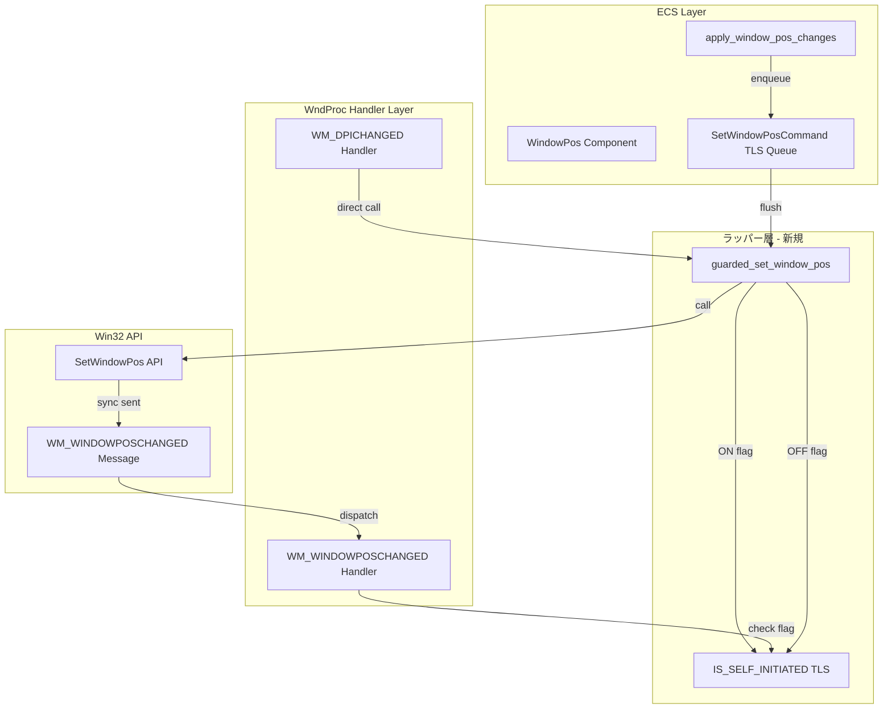
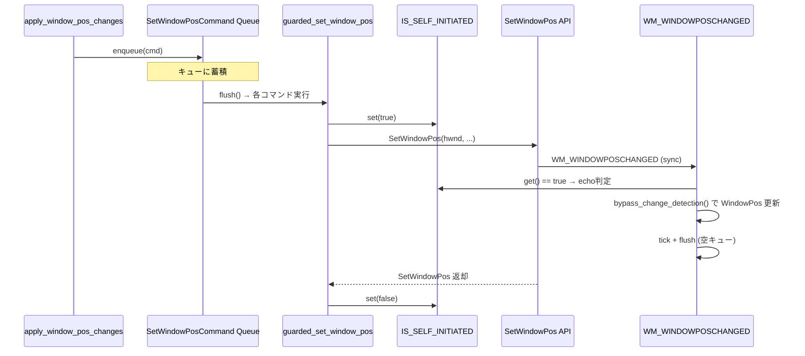
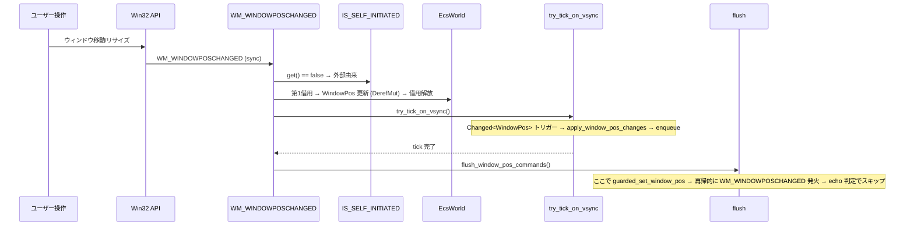
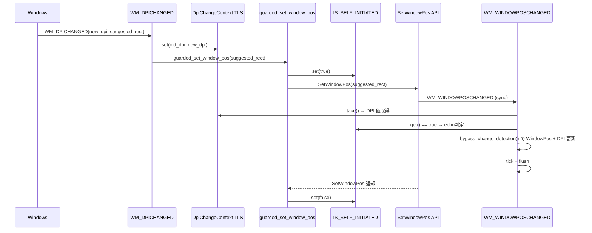

# Design Document: wintf-fix4-feedback-loop-simplify

## Overview

**Purpose**: `SetWindowPos` ラッパー関数と TLS フラグの導入により、ECS ↔ Win32 間のフィードバックループ防止メカニズムを根本的に簡素化する。3つの既存防止メカニズム（`WindowPosChanged` ECS コンポーネント、`is_echo()` 値比較検知、`last_sent_*` フィールド）をコールスタックスコープの TLS フラグ1つで置換する。

**Impact**: `WM_WINDOWPOSCHANGED` ハンドラの4ステッププロトコルを3ステップに削減し、`apply_window_pos_changes` システム内の2つのガード条件と関連フィールドを削除する。既存の動作は完全に維持され、コード行数と認知的複雑度が低減する。

### Goals
- `SetWindowPos` → `WM_WINDOWPOSCHANGED` の同期性を活用したラッパー関数による統一的なフィードバック防止
- `WindowPosChanged` コンポーネント、`is_echo()` メソッド、`last_sent_*` フィールドの完全削除
- `WM_WINDOWPOSCHANGED` ハンドラの World 第2借用（ステップ④）削除
- `DpiChangeContext` TLS と `RefCell` 再入保護（L3）の維持

### Non-Goals
- flush 呼び出しポイントの削減（3箇所維持、冪等保証を優先）
- `SetWindowPosCommand` キュー機構の構造変更（キュー自体は維持）
- `RefCell<EcsWorld>` アーキテクチャの変更
- `sync_window_arrangement_from_window_pos`（PostLayout 逆同期）への変更

## Architecture

### Existing Architecture Analysis

現行のフィードバック防止メカニズムは3+1層構造:

| 層 | 実装 | 判定方法 | 削除対象 |
|----|------|---------|---------|
| L1 | `WindowPosChanged` (ECS Component) | ハンドラ設定/リセットのブール値 | **削除** |
| L2 | エコーバック検知 (`is_echo()`) | `last_sent_*` との値比較 | **削除** |
| L3 | `RefCell` 再入保護 | `try_borrow_mut()` 失敗時スキップ | 維持 |
| 遅延実行 | `SetWindowPosCommand` (TLS キュー) | World 借用外での `SetWindowPos` キュー実行 | 維持（flush 内をラッパー化） |

**制約**:
- `Rc<RefCell<EcsWorld>>` パターン — WndProc ハンドラは World を借用→解放するサイクルで ECS を操作
- シングルスレッド UI — 全 WndProc 処理は同一スレッドで実行
- `DpiChangeContext` は独立した TLS メカニズム（`WM_DPICHANGED` コールスタック内の DPI 値伝達）

### Architecture Pattern & Boundary Map



**Architecture Integration**:
- Selected pattern: **TLS ラッパーフラグ** — `SetWindowPos` 呼び出しスコープで TLS bool を管理し、同期的に発火する `WM_WINDOWPOSCHANGED` ハンドラ内で参照
- Domain boundaries: ラッパー関数は `ecs/window.rs` に配置（既存の `SetWindowPosCommand` と同一モジュール）
- Existing patterns preserved: `DpiChangeContext` TLS パターン、`SetWindowPosCommand` キュー、`RefCell` 再入保護
- New components rationale: ラッパー関数は既存の3メカニズムを統合するため、純コード削減となる
- Steering compliance: レイヤー分離（COM → ECS → Message Handling）維持、unsafe は COM ラッパー層に集約

### Technology Stack

| Layer | Choice / Version | Role in Feature | Notes |
|-------|------------------|-----------------|-------|
| Language | Rust 2024 Edition | 全実装 | `std::cell::Cell<bool>` for TLS フラグ |
| ECS | bevy_ecs 0.18.0 | コンポーネント操作、`bypass_change_detection()` | 既存バージョン維持 |
| Win32 | windows 0.62.1 | `SetWindowPos` API 呼び出し | 既存バージョン維持 |

## System Flows

### フロー1: ECS → Win32 同期（通常パス：flush 経由）



### フロー2: ユーザー操作（外部由来の WM_WINDOWPOSCHANGED）



### フロー3: DPI 変更（WM_DPICHANGED → SetWindowPos → WM_WINDOWPOSCHANGED）



## Requirements Traceability

| Requirement | Summary | Components | Interfaces | Flows |
|-------------|---------|------------|------------|-------|
| 1.1 | ラッパー関数 + TLS フラグ | GuardedSetWindowPos, IS_SELF_INITIATED | `guarded_set_window_pos()` | Flow 1, 3 |
| 1.2 | echo 判定 + apply スキップ | WM_WINDOWPOSCHANGED Handler | `is_self_initiated()` | Flow 1, 2 |
| 1.3 | キュー維持、flush 内ラッパー化 | SetWindowPosCommand | `flush()` | Flow 1 |
| 1.4 | 旧メカニズム削除 | WindowPos, apply_window_pos_changes | — | — |
| 1.5 | WM_DPICHANGED ラッパー統一 | WM_DPICHANGED Handler | `guarded_set_window_pos()` | Flow 3 |
| 2.1–2.4 | DpiChangeContext 維持 | DpiChangeContext | `set()` / `take()` | Flow 3 |
| 3.1 | ユーザー操作の収束保証 | WM_WINDOWPOSCHANGED Handler | — | Flow 2 |
| 3.2 | プログラム変更の1往復収束 | apply_window_pos_changes, flush | — | Flow 1 |
| 3.3 | DPI 変更チェーン | WM_DPICHANGED Handler | — | Flow 3 |
| 4.1 | 状態管理2点集約 | IS_SELF_INITIATED, SetWindowPosCommand | — | — |
| 4.2 | doc comment 文書化 | GuardedSetWindowPos | — | — |
| 4.3 | 4→3ステップ簡素化 | WM_WINDOWPOSCHANGED Handler | — | Flow 1, 2, 3 |
| 5.1–5.2 | 既存テストパス | テスト | — | — |
| 5.3 | 動作互換 | 全コンポーネント | — | — |
| 5.4 | TLS フラグ単体テスト | テスト | — | — |

## Components and Interfaces

| Component | Domain/Layer | Intent | Req Coverage | Key Dependencies | Contracts |
|-----------|-------------|--------|--------------|------------------|-----------|
| GuardedSetWindowPos | ECS / window.rs | TLS フラグ管理下の SetWindowPos ラッパー | 1.1, 1.3, 1.5 | SetWindowPos API (P0) | Service |
| IS_SELF_INITIATED | ECS / window.rs | SetWindowPos 呼び出し中フラグ | 1.1, 1.2, 4.1 | — | State |
| WM_WINDOWPOSCHANGED Handler (変更) | Handler / handlers.rs | 3ステッププロトコルへの簡素化 | 1.2, 3.1, 3.2, 3.3, 4.3 | IS_SELF_INITIATED (P0), DpiChangeContext (P0) | — |
| WM_DPICHANGED Handler (変更) | Handler / handlers.rs | ラッパー経由の SetWindowPos 統一 | 1.5, 2.1–2.4, 3.3 | GuardedSetWindowPos (P0), DpiChangeContext (P0) | — |
| apply_window_pos_changes (変更) | ECS / graphics/systems.rs | ガード条件の削除 | 1.4, 3.2 | SetWindowPosCommand (P0) | — |
| WindowPos (変更) | ECS / window.rs | last_sent_* 削除、is_echo 削除 | 1.4 | — | — |
| SetWindowPosCommand (維持) | ECS / window.rs | 遅延実行キュー維持、flush 内ラッパー化 | 1.3 | GuardedSetWindowPos (P0) | Service |
| DpiChangeContext (維持) | ECS / window.rs | 変更なし | 2.1–2.4 | — | State |

### ECS / Window Module

#### GuardedSetWindowPos

| Field | Detail |
|-------|--------|
| Intent | TLS フラグ管理下で `SetWindowPos` Win32 API を呼び出すラッパー関数 |
| Requirements | 1.1, 1.3, 1.5 |

**Responsibilities & Constraints**
- `SetWindowPos` 呼び出し前に `IS_SELF_INITIATED` TLS フラグを ON、完了後に OFF
- 全ての `SetWindowPos` 呼び出し（flush 内、WM_DPICHANGED 内）がこのラッパー経由で実行される
- ラッパー外での `SetWindowPos` 直接呼び出しは禁止（doc comment で明記）

**Logging Strategy**
- Level: `trace!` — 高頻度呼び出しのため（flush 毎、DPI 変更時）
- Structured fields: `hwnd` (16進数), `x`, `y`, `cx`, `cy`, `flags`
- Message format: `"[guarded_set_window_pos] Calling SetWindowPos"`
- Example:
  ```rust
  trace!(
      hwnd = format!("0x{:X}", hwnd.0),
      x = x, y = y, cx = cx, cy = cy,
      flags = ?flags,
      "[guarded_set_window_pos] Calling SetWindowPos"
  );
  ```

**Dependencies**
- External: `SetWindowPos` Win32 API — ウィンドウ位置・サイズ変更 (P0)
- Outbound: `IS_SELF_INITIATED` TLS — フラグ ON/OFF 操作 (P0)

**Contracts**: Service [x] / State [ ]

##### Service Interface
```rust
/// SetWindowPos をラッパー付きで呼び出す。
/// RAII Drop guard により、正常終了・? early return・パニック時も
/// IS_SELF_INITIATED が確実に false にリセットされる。
/// `SetWindowPos` → `WM_WINDOWPOSCHANGED` は同期発火のため、
/// ハンドラ内で IS_SELF_INITIATED を参照して echo を判定できる。
///
/// # Safety
/// SetWindowPos Win32 API の unsafe 呼び出しを内包する。
///
/// # Implementation
/// 内部で SetWindowPosGuard（Drop trait 実装）を使用:
/// ```
/// IS_SELF_INITIATED.set(true);
/// let _guard = SetWindowPosGuard;  // Drop でリセット保証
/// SetWindowPos(...)?;  // ? 使用可能
/// Ok(())
/// ```
pub unsafe fn guarded_set_window_pos(
    hwnd: HWND,
    hwnd_insert_after: HWND,
    x: i32,
    y: i32,
    cx: i32,
    cy: i32,
    flags: SET_WINDOW_POS_FLAGS,
) -> windows::core::Result<()>
```
- Preconditions: `hwnd` は有効なウィンドウハンドル
- Postconditions: `IS_SELF_INITIATED` は呼び出し前の値に復帰（false）、RAII により保証
- Invariants: `IS_SELF_INITIATED` は同一呼び出しスコープ内でのみ true、スコープ終了時に必ず false

#### IS_SELF_INITIATED

| Field | Detail |
|-------|--------|
| Intent | `SetWindowPos` ラッパーが呼び出し中であることを示す TLS フラグ |
| Requirements | 1.1, 1.2, 4.1 |

**Responsibilities & Constraints**
- `thread_local!` で宣言、型は `Cell<bool>`
- 初期値は `false`
- `guarded_set_window_pos()` のスコープ内でのみ `true`
- `WM_WINDOWPOSCHANGED` ハンドラから `is_self_initiated()` で参照

**Contracts**: State [x]

##### State Management
```rust
thread_local! {
    /// SetWindowPos ラッパーが呼び出し中であることを示すフラグ。
    /// true の間に発火する WM_WINDOWPOSCHANGED は自アプリ由来の echo と判定する。
    static IS_SELF_INITIATED: Cell<bool> = const { Cell::new(false) };
}

/// 現在の SetWindowPos 呼び出しスコープ内かどうかを返す。
/// WM_WINDOWPOSCHANGED ハンドラ内で使用。
pub fn is_self_initiated() -> bool
```
- Persistence: TLS（スレッドローカル、プロセスライフタイム）
- Consistency: 同期呼び出しの性質により常に一貫性あり（中間状態なし）
- Concurrency: シングルスレッド UI のため競合なし

### Handler Layer

#### WM_WINDOWPOSCHANGED Handler（変更）

| Field | Detail |
|-------|--------|
| Intent | 4ステップ→3ステップへの簡素化。TLS フラグ参照による echo 判定 |
| Requirements | 1.2, 3.1, 3.2, 3.3, 4.3 |

**Responsibilities & Constraints**
- ステップ④（World 第2借用、`WindowPosChanged=false` リセット）を削除
- ステップ①で `WindowPosChanged=true` 設定を削除
- ステップ①冒頭で `is_self_initiated()` を呼び出し、echo フラグをローカル変数に取得
- echo 時は `bypass_change_detection()` で `WindowPos` を更新（`Changed` 抑制）
- 非 echo 時は `DerefMut` で `WindowPos` を更新（`Changed` 発火 → `apply_window_pos_changes` トリガー）
- `DpiChangeContext::take()` は echo/非 echo にかかわらず常に実行

**Logging Strategy**
- Level: `debug!` — ウィンドウ位置変更の重要なライフサイクルイベント
- Structured fields: `is_echo` (bool), `entity` (EntityName), `x`, `y`, `cx`, `cy`
- Message format: `"[WM_WINDOWPOSCHANGED] Processing"`
- Example:
  ```rust
  debug!(
      is_echo = is_echo,
      entity = %entity_name,
      x = window_pos_param.x, y = window_pos_param.y,
      cx = window_pos_param.cx, cy = window_pos_param.cy,
      "[WM_WINDOWPOSCHANGED] Processing"
  );
  ```

**Dependencies**
- Inbound: `IS_SELF_INITIATED` TLS — echo 判定 (P0)
- Inbound: `DpiChangeContext` TLS — DPI 値取得 (P0)
- Outbound: `try_tick_on_vsync()` — ECS tick 実行 (P0)
- Outbound: `flush_window_pos_commands()` — キュー flush (P0)

**Implementation Notes**
- 新3ステッププロトコル:
  ```
  ① World 第1借用 → DPI更新, echo判定に基づきWindowPos更新, BoxStyle更新 → 借用解放
  ② try_tick_on_vsync()
  ③ flush_window_pos_commands()
  ```
- echo 判定はステップ① の冒頭で1回のみ実行し、ローカル変数 `is_echo` に保存
- `last_sent_position` / `last_sent_size` への書き込みも削除

#### WM_DPICHANGED Handler（変更）

| Field | Detail |
|-------|--------|
| Intent | 直接 `SetWindowPos` 呼び出しをラッパー経由に変更 |
| Requirements | 1.5, 2.1–2.4, 3.3 |

**Responsibilities & Constraints**
- `DpiChangeContext::set()` 後に `guarded_set_window_pos()` を呼び出す
- `suggested_rect` のパラメータ展開は既存ロジックを維持
- `DpiChangeContext` TLS のライフサイクルは変更なし

**Dependencies**
- Outbound: `GuardedSetWindowPos` — ラッパー呼び出し (P0)
- Outbound: `DpiChangeContext` TLS — DPI 値設定 (P0)

**Implementation Notes**
- 変更は `SetWindowPos` 呼び出し行1箇所のみ（`handlers.rs` L410）

### ECS / Graphics Systems

#### apply_window_pos_changes（変更）

| Field | Detail |
|-------|--------|
| Intent | `WindowPosChanged` ガードと `is_echo()` ガードの削除 |
| Requirements | 1.4, 3.2 |

**Responsibilities & Constraints**
- Query から `&WindowPosChanged` パラメータを削除
- `wpc.0 == true` ガード（G1）を削除
- `window_pos.is_echo(position, size)` ガード（G2）を削除
- `last_sent_position` / `last_sent_size` への `bypass_change_detection()` 書き込みを削除
- `CW_USEDEFAULT` ガード（G3）は維持
- `SetWindowPosCommand::enqueue()` 呼び出しは維持

**Dependencies**
- Outbound: `SetWindowPosCommand::enqueue()` — コマンドキュー追加 (P0)

**Implementation Notes**
- ラッパー方式では echo 時に `WM_WINDOWPOSCHANGED` ハンドラが `bypass_change_detection()` で更新するため `Changed<WindowPos>` が発火せず、`apply_window_pos_changes` のトリガー自体が発火しない → G1, G2 は不要になる
- G3（`CW_USEDEFAULT`）は初期化時の防御として維持

### ECS / Window Data

#### WindowPos（変更）

| Field | Detail |
|-------|--------|
| Intent | `last_sent_*` フィールドと `is_echo()` メソッドの削除 |
| Requirements | 1.4 |

**削除対象**
- `pub last_sent_position: Option<(i32, i32)>` — フィールド削除
- `pub last_sent_size: Option<(i32, i32)>` — フィールド削除
- `pub fn is_echo(position: (i32, i32), size: (i32, i32)) -> bool` — メソッド削除
- `Default` 実装の `last_sent_position: None, last_sent_size: None` — 削除

## Data Models

### WindowPos 構造体（変更後）

```rust
#[derive(Component, Debug, Clone)]
pub struct WindowPos {
    pub zorder: ZOrder,
    pub position: Option<POINT>,
    pub size: Option<SIZE>,
    pub no_redraw: bool,
    pub no_activate: bool,
    pub frame_changed: bool,
    pub show_window: bool,
    pub hide_window: bool,
    pub no_copy_bits: bool,
    pub no_owner_zorder: bool,
    pub no_send_changing: bool,
    pub defer_erase: bool,
    pub async_window_pos: bool,
    // last_sent_position: 削除
    // last_sent_size: 削除
}
```

### TLS 構造（変更後全体像）

| TLS 変数 | 型 | 責務 | 変更 |
|----------|-----|------|------|
| `IS_SELF_INITIATED` | `Cell<bool>` | ラッパーフラグ | **新規** |
| `WINDOW_POS_COMMANDS` | `RefCell<Vec<SetWindowPosCommand>>` | 遅延実行キュー | 維持 |
| `DPI_CHANGE_CONTEXT` | `Cell<Option<DpiChangeContext>>` | DPI 値伝達 | 維持 |

### 削除される ECS コンポーネント

| コンポーネント | Storage | 削除理由 |
|---------------|---------|---------|
| `WindowPosChanged(bool)` | SparseSet | TLS ラッパーフラグで代替 |

## Error Handling

### Error Strategy
- `guarded_set_window_pos()` は `SetWindowPos` の `windows::core::Result<()>` をそのまま返す
- TLS フラグの ON/OFF は RAII Drop guard により確実に実行される
- **RAII パターン**: `SetWindowPosGuard` 構造体が Drop trait を実装し、スコープ終了時（正常終了・`?` early return・パニック時）に必ず `IS_SELF_INITIATED.set(false)` を実行
  ```rust
  struct SetWindowPosGuard;
  impl Drop for SetWindowPosGuard {
      fn drop(&mut self) {
          IS_SELF_INITIATED.set(false);
      }
  }
  
  pub unsafe fn guarded_set_window_pos(...) -> windows::core::Result<()> {
      IS_SELF_INITIATED.set(true);
      let _guard = SetWindowPosGuard;  // スコープ終了時に必ず Drop
      SetWindowPos(...)?;  // ? 使用可能、失敗時も Drop で set(false) 実行
      Ok(())
  }
  ```

### Error Categories and Responses
- **SetWindowPos 失敗**: `?` で early return、Drop guard により TLS フラグは自動リセット
- **パニック**: Drop trait によりスタック巻き戻し時も TLS フラグ自動リセット
- **TLS フラグ不整合**: 構造的に不可能（RAII でスコープ管理）

## Testing Strategy

### Unit Tests
1. **TLS フラグ基本動作**: `is_self_initiated()` の初期値 `false`、`guarded_set_window_pos` 呼び出し中に `true` になることを検証
2. **フラグ自動リセット**: `guarded_set_window_pos` 完了後に `is_self_initiated()` が `false` に戻ることを検証
3. **WindowPos フィールド削除**: `last_sent_*` フィールドが存在しないことのコンパイル確認

### Integration Tests
1. **既存テスト維持**: `feedback_loop_convergence_test.rs` 全8テストのパス
2. **layout_graphics_sync_test.rs 修正**: `is_echo`/`last_sent` 参照箇所の修正後パス
3. **全テストスイート**: `cargo test` 退行なし

### E2E Tests
1. **taffy_flex_demo**: ウィンドウ移動・リサイズのスムーズ動作
2. **マルチモニタ DPI 変更**: モニタ間移動時のフィードバックループ非発生
3. **areka サンプル**: 基本動作確認

## Supporting References

### 変更箇所サマリー（ファイル別）

| ファイル | 変更種別 | 主要変更 |
|---------|---------|---------|
| `ecs/window.rs` | 追加+削除 | `guarded_set_window_pos()` 新規、`IS_SELF_INITIATED` 新規、`WindowPosChanged` 削除、`last_sent_*`/`is_echo()` 削除、`flush()` 内ラッパー化、`set_window_pos()` 内ラッパー化 |
| `ecs/graphics/systems.rs` | 削除 | `WindowPosChanged` Query 除去、`is_echo()` ガード除去、`last_sent_*` bypass 除去 |
| `ecs/window_proc/handlers.rs` | 変更 | `WM_WINDOWPOSCHANGED`: ①簡素化（echo判定追加、WindowPosChanged削除）、④削除。`WM_DPICHANGED`: ラッパー経由化 |
| `ecs/world.rs` | コメント | `WindowPosChanged` 参照コメントの更新 |
| `tests/layout_graphics_sync_test.rs` | 修正 | `is_echo`/`last_sent_*`/`bypass_change_detection` 使用箇所の修正 |

### 4ステップ→3ステップ プロトコル対照表

| ステップ | 現行 | 変更後 |
|---------|------|--------|
| ① | World 借用 → DPI更新, **WPC=true**, WindowPos更新(DerefMut/bypass), **last_sent更新**, BoxStyle更新 → 解放 | World 借用 → DPI更新, **echo判定**, WindowPos更新(echo→bypass/外部→DerefMut), BoxStyle更新 → 解放 |
| ② | `try_tick_on_vsync()` | `try_tick_on_vsync()`（変更なし） |
| ③ | `flush_window_pos_commands()` | `flush_window_pos_commands()`（変更なし、flush 内はラッパー経由） |
| ④ | **World 借用 → WPC=false → 解放** | **削除** |
