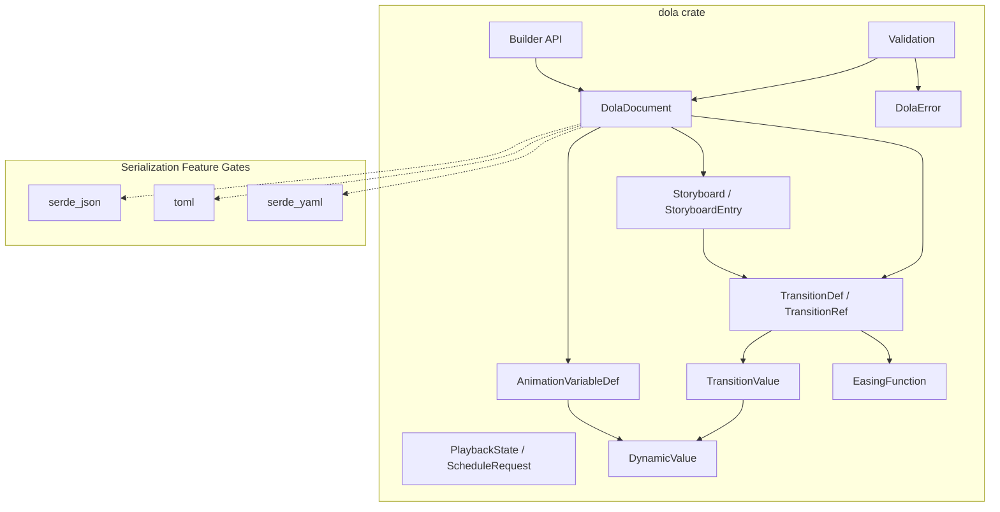
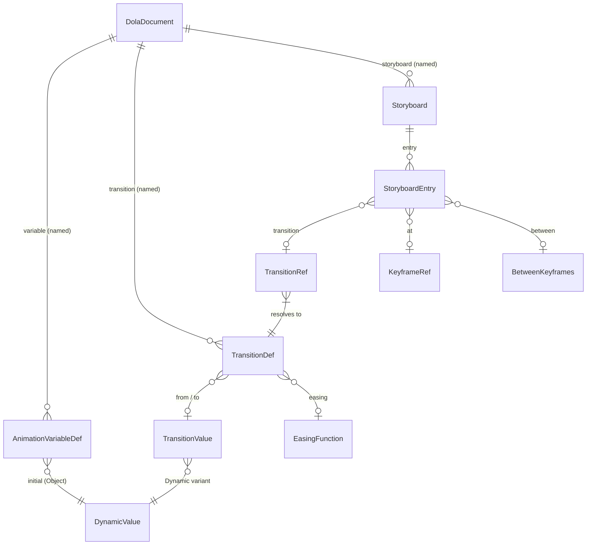

# Design Document

| 項目 | 内容 |
|------|------|
| **Document Title** | Dola アニメーション宣言フォーマット 設計書 |
| **Version** | 2.0 |
| **Date** | 2026-02-14 |
| **Status** | Draft |
| **Requirements Base** | v1.7 |

---

## Overview

**Purpose**: Dola（Declarative Orchestration for Live Animation）は、プラグイン間で共有可能なシリアライズ可能アニメーション宣言フォーマットを提供する。Windows Animation Manager の概念（変数・トランジション・キーフレーム・ストーリーボード）をプラットフォーム非依存のデータモデルとして再構成する。

**Users**: プラグイン開発者（バルーン・シェル等）がアニメーション定義をファイルとして作成・配布し、オーケストレーションランタイム（将来の別仕様）がこれを解釈・実行する。

**Impact**: 新規独立クレート `dola` をワークスペースに追加。既存の `wintf` クレートへの変更はない。

### Goals

- シリアライズ可能なアニメーション宣言フォーマット（JSON/TOML/YAML）の Rust 型定義を確定する
- `serde` による型安全なシリアライズ・デシリアライズを実現する
- 構造バリデーション API を提供する
- エルゴノミックなビルダー API を提供する

### Non-Goals

- オーケストレーションランタイム（再生エンジン・状態遷移・値補間計算）
- プラグインプレイバックインターフェース
- 描画処理
- Windows Animation Manager COM API の直接利用
- `no_std` 対応

---

## Architecture

### Architecture Pattern & Boundary Map



**Architecture Integration**:
- **Selected pattern**: Hybrid Data Model — serde derive 構造体 + 分離バリデーション + オプショナルビルダー（詳細は `research.md` Architecture Pattern Evaluation 参照）
- **Domain boundaries**: データ定義（dola）とランタイム実行（将来の別クレート）を完全分離
- **Existing patterns preserved**: ワークスペースのモジュール命名規則（`snake_case.rs`）、型命名規則（`PascalCase`）
- **New components rationale**: 既存クレートとの依存関係なし。独立クレートとして追加
- **Steering compliance**: Rust 2024 Edition、レイヤー分離原則、安全な API 設計

### Technology Stack

| Layer | Choice / Version | Role in Feature | Notes |
|-------|------------------|-----------------|-------|
| Language | Rust 2024 Edition | 全実装 | ワークスペース設定に準拠 |
| Serialization Core | serde 1.x | derive マクロによる Serialize/Deserialize | 必須依存 |
| JSON Format | serde_json 1.x | JSON シリアライズ | feature `json`（デフォルト有効） |
| TOML Format | toml 0.8.x | TOML シリアライズ | feature `toml` |
| YAML Format | serde_yaml 0.9.x | YAML シリアライズ | feature `yaml` |
| Naming Reference | interpolation 0.3.0 | EaseFunction 命名準拠 | **コンパイル時依存なし** |

---

## Requirements Traceability

| Requirement | Summary | Components | Interfaces | Flows |
|-------------|---------|------------|------------|-------|
| 1.1 | f64 連続値変数 | AnimationVariableDef | — | — |
| 1.2 | i64 離散値変数（イージング対応） | AnimationVariableDef | — | — |
| 1.3 | Object 型変数 | AnimationVariableDef, DynamicValue | — | — |
| 1.4 | タイプライター文字列属性 | AnimationVariableDef | — | — |
| 1.5 | 変数名の一意性 | DolaDocument | Validation | Validate |
| 1.6 | f64/i64 初期値・値域 | AnimationVariableDef | Validation | Validate |
| 1.7 | Object 初期値 | AnimationVariableDef, DynamicValue | — | — |
| 2.1 | トランジションパラメータ | TransitionDef, TransitionValue | — | — |
| 2.2 | Linear イージング | EasingName | — | — |
| 2.3 | 30種組み込みイージング | EasingName | — | — |
| 2.4 | 二次ベジェ補間 | ParametricEasing | — | — |
| 2.5 | 三次ベジェ補間 | ParametricEasing | — | — |
| 2.6 | Object 型は to のみ | TransitionDef, TransitionValue | Validation | Validate |
| 2.7 | serde 対応イージング列挙型 | EasingFunction, EasingName, ParametricEasing | — | — |
| 2.8 | 名前付きテンプレート | DolaDocument | — | — |
| 2.9 | ハイブリッド参照 | TransitionRef | — | — |
| 2.10 | 総時間 = delay + duration | TransitionDef | — | — |
| 3.1 | 予約 KF "start" | Storyboard | Validation | Validate |
| 3.2 | entry の keyframe フィールド | StoryboardEntry | — | — |
| 3.3 | KF スコープ = SB ローカル | Storyboard | Validation | Validate |
| 3.4 | "start" ユーザー定義禁止 | — | Validation | Validate |
| 3.5 | KF 名重複禁止 | — | Validation | Validate |
| 3.6 | 暗黙的 KF 生成 | StoryboardEntry | Validation | Validate |
| 4.1 | 複数名前付き SB | DolaDocument | — | — |
| 4.2 | SB 名の一意性 | DolaDocument | — | — |
| 4.3 | エントリ配列構成 | Storyboard, StoryboardEntry | — | — |
| 4.4 | エントリフィールド定義 | StoryboardEntry, TransitionRef, KeyframeRef, KeyframeNames, BetweenKeyframes | — | — |
| 4.5 | 3種の配置方法 | StoryboardEntry | Validation | Validate |
| 4.6 | 純粋 KF エントリ | StoryboardEntry | Validation | Validate |
| 4.7 | メタ情報 | Storyboard | — | — |
| 4.8 | 同一タイムライン同期再生 | Storyboard | — | — |
| 5.1 | JSON シリアライズ | DolaDocument | serialize/deserialize | — |
| 5.2 | TOML シリアライズ | DolaDocument | serialize/deserialize | — |
| 5.3 | YAML シリアライズ | DolaDocument | serialize/deserialize | — |
| 5.4 | スキーマバージョン | DolaDocument | — | — |
| 5.5 | バージョン不一致エラー | DolaError | Validation | Validate |
| 5.6 | serde 使用 | 全型 | — | — |
| 5.7 | 全データモデル serde 対応 | 全型 | — | — |
| 6.1 | 再生状態列挙型 | PlaybackState | — | — |
| 6.2 | タイムスケール | Storyboard | — | — |
| 6.3 | f64 秒相対時間 | 全時間フィールド | — | — |
| 6.4 | 再生制御型 serde 対応 | PlaybackState, ScheduleRequest | — | — |
| 6.5 | スケジューリング指示型 | ScheduleRequest | — | — |
| 7.1 | wintf 非依存 | dola crate | — | — |
| 7.2 | serde 必須依存 | Cargo.toml | — | — |
| 7.3 | feature フラグ | Cargo.toml | — | — |
| 7.4 | interpolation 命名準拠 | EasingName | — | — |
| 7.5 | no_std 不要 | Cargo.toml | — | — |

---

## Components and Interfaces

### Component Summary

| Component | Module | Intent | Req Coverage | Key Dependencies | Contracts |
|-----------|--------|--------|--------------|------------------|-----------|
| DolaDocument | document | ルートコンテナ、スキーマ管理 | 1.5, 2.8, 4.1, 4.2, 5.1-5.7 | Variable, Transition, Storyboard | State |
| AnimationVariableDef | variable | 変数型定義 | 1.1-1.7 | DynamicValue | — |
| TransitionValue | transition | トランジション値型（Scalar/Dynamic） | 2.1, 2.6 | DynamicValue | — |
| TransitionDef | transition | トランジションパラメータ | 2.1-2.10 | EasingFunction, TransitionValue | — |
| TransitionRef | transition | ハイブリッド参照 | 2.8, 2.9 | TransitionDef | — |
| EasingFunction | easing | イージング列挙型 | 2.2-2.5, 2.7, 7.4 | — | — |
| Storyboard | storyboard | SB 構造 + メタ情報 | 3.1, 3.3, 4.1-4.8, 6.2 | StoryboardEntry | State |
| StoryboardEntry | storyboard | エントリ（配置 + KF） | 3.2, 3.6, 4.3-4.6 | TransitionRef, KeyframeRef | — |
| KeyframeRef | storyboard | キーフレーム起点指定（多形） | 4.4, 4.5 | KeyframeNames | — |
| KeyframeNames | storyboard | KF名指定（単一/複数） | 4.4 | — | — |
| PlaybackState | playback | 再生状態列挙型 | 6.1-6.5 | — | — |
| ScheduleRequest | playback | スケジューリング指示 | 6.5 | — | — |
| DynamicValue | value | フォーマット非依存動的値 | 1.3, 1.7, 2.6 | — | — |
| Validation | validate | 構造バリデーション | 1.6, 3.4, 3.5, 3.6, 5.5, cross | DolaDocument, DolaError | Service |
| DolaError | error | エラー型 | 5.5 | — | — |
| Builder API | builder | 構築ヘルパー | cross-cutting | DolaDocument | Service |

### Data Definition Layer

以下のコンポーネントはデータ定義（struct/enum 定義 + serde derive）であり、ロジックを持たない。型定義は「Data Models」セクションに集約する。

対象: AnimationVariableDef, TransitionValue, TransitionDef, TransitionRef, EasingFunction, EasingName, ParametricEasing, Storyboard, StoryboardEntry, KeyframeRef, KeyframeNames, BetweenKeyframes, PlaybackState, ScheduleRequest, DynamicValue, DolaError

### Boundary Components（詳細）

#### DolaDocument

| Field | Detail |
|-------|--------|
| Intent | アニメーション定義ファイルのルートコンテナ。変数・トランジション・ストーリーボードを一元管理 |
| Requirements | 1.5, 2.8, 4.1, 4.2, 5.1-5.7 |

**Responsibilities & Constraints**
- スキーマバージョンの保持と検証
- 変数・トランジション・ストーリーボードの名前空間管理
- 全フォーマット（JSON/TOML/YAML）へのシリアライズエントリポイント

**Dependencies**
- Inbound: Builder API — 構築 (P1)
- Inbound: Validation — 検証対象 (P0)
- Outbound: serde — シリアライズ (P0)
- Outbound: serde_json / toml / serde_yaml — フォーマット固有処理 (P1, feature-gated)

**Contracts**: State [x]

##### State Management

```rust
/// Dola ドキュメントのルートコンテナ
struct DolaDocument {
    /// スキーマバージョン（例: "1.0"）
    schema_version: String,
    /// 名前付きアニメーション変数（グローバルスコープ）
    variable: BTreeMap<String, AnimationVariableDef>,
    /// 名前付きトランジションテンプレート（グローバルスコープ）
    transition: BTreeMap<String, TransitionDef>,
    /// 名前付きストーリーボード
    storyboard: BTreeMap<String, Storyboard>,
}
```

**Implementation Notes**
- `BTreeMap` を使用し、シリアライズ時のキー順序を決定的にする（diff-friendly）
- `schema_version` は semantic versioning 文字列。v1 では完全一致検証のみ（互換性ポリシーは将来仕様で拡張）
- `variable` と `transition` はグローバルスコープ、`keyframe` は SB ローカルスコープ

---

#### Validation

| Field | Detail |
|-------|--------|
| Intent | デシリアライズ後の DolaDocument に対する構造整合性検証 |
| Requirements | 1.5, 1.6, 2.6, 3.4, 3.5, 3.6, 4.5, 5.5, cross-cutting |

**Responsibilities & Constraints**
- スキーマバージョン互換性チェック
- エントリの配置パターン妥当性検証
- キーフレーム制約検証（"start" 予約、重複禁止、参照先存在確認、暗黙的KF追跡）
- 変数・トランジション参照の存在確認
- Object 型トランジションの制限事項検証（to のみ、Dynamic のみ）
- 値域チェック（初期値・トランジション値の min/max 範囲検証）

**Dependencies**
- Inbound: DolaDocument — 検証対象 (P0)
- Outbound: DolaError — エラー報告 (P0)

**Contracts**: Service [x]

##### Service Interface

```rust
/// DolaDocument のバリデーション
trait Validate {
    /// ドキュメント全体を検証し、すべてのエラーを収集して返す
    fn validate(&self) -> Result<(), Vec<DolaError>>;
}

impl Validate for DolaDocument {
    fn validate(&self) -> Result<(), Vec<DolaError>>;
}
```

- **Preconditions**: デシリアライズ済みの DolaDocument
- **Postconditions**: Ok(()) の場合、すべての構造整合性制約を満たす
- **Invariants**: バリデーションは副作用なし（read-only）

**Implementation Notes**
- キーフレーム参照検証（V6）は2パスで実施：第1パスで各SBの全`keyframe`フィールドを収集（明示的 + 暗黙的）、第2パスで`at`/`between`の参照先存在を検証
- 暗黙的キーフレーム（Req 3.6）: `keyframe` 省略時は内部で `__implicit_{index}` 形式のユニーク名を生成し、前エントリ連結の基準点とする。この名前はバリデーション/ランタイム内部でのみ使用
- 前方参照を許可することで、エントリの宣言順序に制約を設けず論理的な構成を優先

**バリデーションルール一覧**:

| ID | ルール | 対応 Req |
|----|--------|----------|
| V1 | schema_version が期待値と一致する | 5.5 |
| V2 | 同一 SB 内でキーフレーム名が重複しない | 3.5 |
| V3 | ユーザー定義キーフレーム名に "start" を使用不可 | 3.4 |
| V4 | エントリの variable 参照が document.variable に存在する | cross |
| V5 | エントリの transition 名前参照が document.transition に存在する | 2.8 |
| V6 | エントリの at/between キーフレーム参照が同一 SB 内に存在する（**前方参照許可**: 第1パスで全keyframe名＋暗黙的KF名を収集、第2パスで参照検証） | cross, 3.6 |
| V7 | transition あり → variable 必須 | 4.5 |
| V8 | at と between は排他 | 4.5 |
| V9 | 純粋 KF エントリは keyframe 必須 | 4.6 |
| V10 | Object 型変数のトランジションは to のみ（from/relative_to/easing 不可）、to は TransitionValue::Dynamic のみ | 2.6 |
| V11 | to と relative_to は排他 | 2.1 |
| V12 | f64/i64 変数の初期値が値域（min/max）内であること | 1.6 |
| V13 | f64/i64 変数のトランジション from/to は TransitionValue::Scalar のみ（Dynamic 不可） | 2.1, 2.6 |

---

#### Builder API

| Field | Detail |
|-------|--------|
| Intent | プログラマティックに DolaDocument を構築するためのエルゴノミック API |
| Requirements | cross-cutting（利便性） |

**Responsibilities & Constraints**
- メソッドチェーンによる段階的構築
- 構築完了時に自動バリデーション
- serde を使わずにコードから直接ドキュメントを作成

**Dependencies**
- Outbound: DolaDocument — 構築対象 (P0)
- Outbound: Validation — 構築完了時検証 (P1)

**Contracts**: Service [x]

##### Service Interface

```rust
/// DolaDocument ビルダー
struct DolaDocumentBuilder { /* ... */ }

impl DolaDocumentBuilder {
    fn new(schema_version: impl Into<String>) -> Self;
    fn variable(self, name: impl Into<String>, def: AnimationVariableDef) -> Self;
    fn transition(self, name: impl Into<String>, def: TransitionDef) -> Self;
    fn storyboard(self, name: impl Into<String>, sb: Storyboard) -> Self;
    fn build(self) -> Result<DolaDocument, Vec<DolaError>>;
}

/// Storyboard ビルダー
struct StoryboardBuilder { /* ... */ }

impl StoryboardBuilder {
    fn new() -> Self;
    fn time_scale(self, scale: f64) -> Self;
    fn loop_count(self, count: u32) -> Self;
    fn entry(self, entry: StoryboardEntry) -> Self;
    fn build(self) -> Storyboard;
}
```

- **Preconditions**: なし
- **Postconditions**: `build()` は検証済みの DolaDocument を返すか、エラーリストを返す
- **Invariants**: ビルダーは不変的に消費される（move semantics）

---

## Data Models

### Domain Model



**Aggregate Root**: `DolaDocument` — 1ファイル = 1ドキュメント

**スコープ規則**:
- `variable` / `transition`: グローバルスコープ（ドキュメント内で一意な名前）
- `keyframe`: ストーリーボードローカルスコープ
- `"start"`: 各 SB に暗黙提供される予約キーフレーム
- 暗黙的キーフレーム: `keyframe` フィールド省略時に内部生成（Req 3.6）

### 型定義

#### AnimationVariableDef

```rust
/// アニメーション変数定義（内部タグ方式: "type" フィールドで判別）
#[serde(tag = "type")]
enum AnimationVariableDef {
    /// 連続値変数（座標・透明度・角度等）
    #[serde(rename = "f64")]
    Float {
        initial: f64,
        min: Option<f64>,
        max: Option<f64>,
    },
    /// 離散値変数（イージング対応: f64 で補間後 i64 に丸める）
    #[serde(rename = "i64")]
    Integer {
        initial: i64,
        min: Option<i64>,
        max: Option<i64>,
        /// タイプライター文字列（設定時: initial=0, 終了値=文字列長）
        typewriter: Option<String>,
    },
    /// オブジェクト型変数（補間なし、キーフレームで値切り替え）
    #[serde(rename = "object")]
    Object {
        initial: DynamicValue,
    },
}
```

#### TransitionValue

```rust
/// トランジションの開始値・終了値を表す型
#[serde(untagged)]
enum TransitionValue {
    /// スカラー値（f64/i64 変数向け）
    Scalar(f64),
    /// オブジェクト値（Object 型変数向け、補間なし）
    Dynamic(DynamicValue),
}
```

**serde 動作**: `#[serde(untagged)]` により Scalar(f64) を先に試行。数値は Scalar、オブジェクト構造は Dynamic にマッピング。

**設計意図** (`research.md` Decision 7):
- Object 型変数の `to` を自然に表現（例: `to = { path = "smile.png" }` → Dynamic）
- f64/i64 変数では Scalar のみ有効（バリデーション V13 で検証）
- TOML 整数 `to = 5` は Scalar デシリアライズ失敗後 Dynamic(Integer) にフォールバックする可能性あり → カスタムデシリアライザで吸収（実装フェーズ）

#### TransitionDef

```rust
/// トランジション定義
struct TransitionDef {
    /// 開始値（省略時は配置時点の変数の現在値）
    from: Option<TransitionValue>,
    /// 終了値（relative_to と排他）
    to: Option<TransitionValue>,
    /// 相対終了値（開始値からのオフセット。f64 のみ。to と排他）
    relative_to: Option<f64>,
    /// イージング種別（f64/i64 のみ。Object には適用不可）
    easing: Option<EasingFunction>,
    /// トランジション前待機時間（f64秒、デフォルト 0）
    #[serde(default)]
    delay: f64,
    /// 遷移持続時間（f64秒、省略時は即時遷移）
    duration: Option<f64>,
}
```

**不変条件**:
- `to` と `relative_to` は排他（同時指定不可。V11）
- f64/i64 型変数: `from`/`to` は TransitionValue::Scalar のみ（V13）。`relative_to` 使用可
- Object 型変数: `to`（TransitionValue::Dynamic）のみ。`from`/`relative_to`/`easing` は不可（V10）
- 総時間 = `delay` + `duration`（`duration` 省略時は即時 = delay 後即座に切り替え）

#### TransitionRef

```rust
/// トランジション参照（ハイブリッド: 名前文字列 or インライン定義）
#[serde(untagged)]
enum TransitionRef {
    /// 名前付きテンプレートへの参照
    Named(String),
    /// インライントランジション定義
    Inline(TransitionDef),
}
```

**serde 動作**: 文字列→Named、オブジェクト→Inline を順番に試行

#### EasingFunction

```rust
/// イージング関数（名前付き or パラメトリック）
#[serde(untagged)]
enum EasingFunction {
    /// 名前付きイージング（文字列としてシリアライズ）
    Named(EasingName),
    /// パラメトリックイージング（オブジェクトとしてシリアライズ）
    Parametric(ParametricEasing),
}

/// 名前付きイージング（interpolation::EaseFunction 準拠 + Linear）
enum EasingName {
    Linear,
    QuadraticIn, QuadraticOut, QuadraticInOut,
    CubicIn, CubicOut, CubicInOut,
    QuarticIn, QuarticOut, QuarticInOut,
    QuinticIn, QuinticOut, QuinticInOut,
    SineIn, SineOut, SineInOut,
    CircularIn, CircularOut, CircularInOut,
    ExponentialIn, ExponentialOut, ExponentialInOut,
    ElasticIn, ElasticOut, ElasticInOut,
    BackIn, BackOut, BackInOut,
    BounceIn, BounceOut, BounceInOut,
}

/// パラメトリックイージング（内部タグ "type" で判別）
#[serde(tag = "type")]
enum ParametricEasing {
    /// 二次ベジェ補間（interpolation::quad_bez 準拠）
    QuadraticBezier { x0: f64, x1: f64, x2: f64 },
    /// 三次ベジェ補間（interpolation::cub_bez 準拠）
    CubicBezier { x0: f64, x1: f64, x2: f64, x3: f64 },
}
```

#### Storyboard / StoryboardEntry

```rust
/// ストーリーボード（メタ情報 + エントリ配列）
struct Storyboard {
    /// 再生速度倍率（デフォルト 1.0）
    #[serde(default = "default_time_scale")]
    time_scale: f64,
    /// ループ回数（None = ループなし、Some(0) = 無限、Some(n) = n回）
    loop_count: Option<u32>,
    /// エントリ配列
    entry: Vec<StoryboardEntry>,
}

/// ストーリーボードエントリ（配置 + KF 定義の統合単位）
struct StoryboardEntry {
    /// 対象変数名
    variable: Option<String>,
    /// トランジション参照（名前 or インライン）
    transition: Option<TransitionRef>,
    /// 開始キーフレーム指定（文字列/配列/オフセット付きオブジェクト）
    at: Option<KeyframeRef>,
    /// キーフレーム間配置
    between: Option<BetweenKeyframes>,
    /// このエントリ終了時点のキーフレーム名（省略時は暗黙的KFが生成される: Req 3.6）
    keyframe: Option<String>,
}
```

**配置パターン**:

| パターン | 必須フィールド | 動作 | WAM 相当 |
|----------|---------------|------|----------|
| 前エントリ連結 | variable + transition（at/between なし） | 1つ前のエントリの暗黙的/明示的KFから開始。SB先頭は "start" から | AddTransition |
| KF 起点 | variable + transition + at | 指定KF完了時点から開始。配列指定時は全KF完了待機（最遅） | AddTransitionAtKeyframe |
| KF 間 | variable + transition + between | 2つのKF間に配置。duration はKF間時間差で上書き | AddTransitionBetweenKeyframes |
| 純粋 KF | keyframe のみ | トランジションなしのキーフレーム定義 | — |

**暗黙的キーフレーム生成（Req 3.6）**: `keyframe` フィールド省略時、各エントリ終了時点に内部でユニークな暗黙的キーフレーム名（`__implicit_{index}` 形式）が自動付与される。これにより「前エントリ連結」パターンで次エントリのデフォルト配置基準が確保される。`{index}` は entry 配列内の 0-based インデックス（例: 配列 0 番目のエントリ → `__implicit_0`、2番目 → `__implicit_2`）。

#### KeyframeRef / KeyframeNames

```rust
/// キーフレーム起点指定（`at` フィールド用）
/// 4つの表現形式をサポート:
///   at = "visible"                                           → Single
///   at = ["visible", "audio_done"]                           → Multiple
///   at = { keyframes = "visible", offset = 0.5 }            → WithOffset (single)
///   at = { keyframes = ["visible", "done"], offset = 0.5 }  → WithOffset (multiple)
#[serde(untagged)]
enum KeyframeRef {
    /// 単一キーフレーム名（文字列短縮形）
    Single(String),
    /// 複数キーフレーム名（配列形式、全KF完了待機）
    Multiple(Vec<String>),
    /// オフセット付き指定（オブジェクト形式）
    WithOffset {
        /// キーフレーム名指定（文字列または配列）
        keyframes: KeyframeNames,
        /// キーフレーム時刻からの時間オフセット（f64秒、デフォルト 0.0）
        #[serde(default)]
        offset: f64,
    },
}

/// キーフレーム名指定（単一または複数）
#[serde(untagged)]
enum KeyframeNames {
    /// 単一キーフレーム名
    Single(String),
    /// 複数キーフレーム名（全KF完了待機）
    Multiple(Vec<String>),
}
```

**serde 動作** (`research.md` Decision 6):
- `#[serde(untagged)]` で String → Vec<String> → Object の順に試行
- WithOffset 内の `keyframes` も `KeyframeNames`（String | Vec<String>）で多形化
- `offset` は `#[serde(default)]` でデフォルト 0.0

**設計意図**:
- 最頻ユースケース（単一KF指定）は `at = "visible"` の最短形式
- 複数KF同期（全KF完了待機）は配列 `at = ["a", "b"]` で直感的に表現
- オフセットが必要な場合のみオブジェクト形式を使用

#### BetweenKeyframes

```rust
/// キーフレーム間配置指定
struct BetweenKeyframes {
    /// 開始キーフレーム名
    from: String,
    /// 終了キーフレーム名
    to: String,
}
```

#### PlaybackState / ScheduleRequest

```rust
/// 再生状態列挙型
enum PlaybackState {
    /// 待機（未開始）
    Idle,
    /// 再生中
    Playing,
    /// 一時停止
    Paused,
    /// 完了
    Completed,
    /// キャンセル
    Cancelled,
}

/// スケジューリング指示
struct ScheduleRequest {
    /// 対象ストーリーボード名
    storyboard: String,
    /// 開始時刻（f64秒、相対時間）
    start_time: f64,
}
```

#### DynamicValue

```rust
/// フォーマット非依存の動的値型（JSON/TOML/YAML 共通）
#[serde(untagged)]
enum DynamicValue {
    Null,
    Bool(bool),
    Integer(i64),
    Float(f64),
    String(String),
    Array(Vec<DynamicValue>),
    Map(BTreeMap<String, DynamicValue>),
}
```

**バリアント順序**: Integer を Float より前に定義し、TOML の整数/浮動小数点区別を保持

#### DolaError

```rust
/// Dola バリデーションエラー
enum DolaError {
    /// スキーマバージョン不一致 (V1)
    SchemaVersionMismatch { expected: String, found: String },
    /// キーフレーム名重複 (V2)
    DuplicateKeyframe { storyboard: String, name: String },
    /// 予約キーフレーム名使用 (V3)
    ReservedKeyframeName { name: String },
    /// 未定義変数参照 (V4)
    UndefinedVariable { storyboard: String, entry_index: usize, name: String },
    /// 未定義トランジション参照 (V5)
    UndefinedTransition { storyboard: String, entry_index: usize, name: String },
    /// 未定義キーフレーム参照 (V6)
    UndefinedKeyframe { storyboard: String, name: String },
    /// 無効なエントリ構成 (V7, V8, V9)
    InvalidEntry { storyboard: String, entry_index: usize, reason: String },
    /// Object 型トランジション制限違反 (V10)
    ObjectTransitionViolation { storyboard: String, entry_index: usize, field: String },
    /// to/relative_to 排他違反 (V11)
    MutuallyExclusive { storyboard: String, entry_index: usize },
    /// 値域超過 (V12)
    ValueOutOfRange { variable: String, field: String, value: f64, min: f64, max: f64 },
    /// 変数型とトランジション値型の不整合 (V13)
    TypeMismatch { storyboard: String, entry_index: usize, reason: String },
}
```

### TOML フォーマット例

```toml
schema_version = "1.0"

# === アニメーション変数定義 ===

[variable.opacity]
type = "f64"
initial = 0.0
min = 0.0
max = 1.0

[variable.char_count]
type = "i64"
initial = 0
min = 0
typewriter = "こんにちは世界"

[variable.bg_image]
type = "object"
initial = { path = "default.png" }

# === トランジションテンプレート ===

[transition.fade_in]
to = 1.0
easing = "QuadraticInOut"
duration = 1.5

[transition.typewrite]
to = 7.0
easing = "Linear"
duration = 3.0

# === ストーリーボード ===

[storyboard.greeting]
time_scale = 1.0

# Entry 1: 前エントリ連結（SB先頭 → "start" から開始）
[[storyboard.greeting.entry]]
variable = "opacity"
transition = "fade_in"
keyframe = "visible"

# Entry 2: KF起点 — "visible" 完了後に開始（文字列短縮形）
[[storyboard.greeting.entry]]
variable = "char_count"
transition = "typewrite"
at = "visible"
keyframe = "text_done"

# Entry 3: KF起点 — Object型トランジション（インライン、Dynamic値）
[[storyboard.greeting.entry]]
variable = "bg_image"
transition = { to = { path = "smile.png" } }
at = "text_done"

# --- 以下はコメントによる補足例 ---
# 複数KF待機（配列形式）:
#   at = ["visible", "text_done"]
# オフセット付き:
#   at = { keyframes = "visible", offset = 0.5 }
# 複数KF + オフセット:
#   at = { keyframes = ["visible", "text_done"], offset = 0.5 }
# ベジェイージング:
#   easing = { type = "CubicBezier", x0 = 0.0, x1 = 0.42, x2 = 0.58, x3 = 1.0 }
```

### クレート構成

```toml
# crates/dola/Cargo.toml
[package]
name = "dola"
description = "Declarative Orchestration for Live Animation"
version.workspace = true
edition.workspace = true
authors.workspace = true
license.workspace = true
publish.workspace = true

[dependencies]
serde = { version = "1", features = ["derive"] }

[dependencies.serde_json]
version = "1"
optional = true

[dependencies.toml]
version = "0.8"
optional = true

[dependencies.serde_yaml]
version = "0.9"
optional = true

[features]
default = ["json"]
json = ["dep:serde_json"]
toml = ["dep:toml"]
yaml = ["dep:serde_yaml"]
```

### モジュール構成

```
crates/dola/
├── Cargo.toml
└── src/
    ├── lib.rs           # Public re-exports
    ├── document.rs      # DolaDocument
    ├── variable.rs      # AnimationVariableDef
    ├── transition.rs    # TransitionDef, TransitionRef, TransitionValue
    ├── easing.rs        # EasingFunction, EasingName, ParametricEasing
    ├── storyboard.rs    # Storyboard, StoryboardEntry, KeyframeRef, KeyframeNames, BetweenKeyframes
    ├── playback.rs      # PlaybackState, ScheduleRequest
    ├── value.rs         # DynamicValue
    ├── validate.rs      # Validation logic
    ├── error.rs         # DolaError
    └── builder.rs       # DolaDocumentBuilder, StoryboardBuilder
```

---

## Error Handling

### Error Strategy

Dola は二段階のエラー処理を採用する：

1. **デシリアライズエラー**: serde が自動生成。フォーマット不正・型不一致を捕捉
2. **バリデーションエラー**: `DolaError` で構造整合性を検証。**すべての** エラーを収集して一括返却

### Error Categories and Responses

| Category | Examples | Response |
|----------|----------|----------|
| フォーマットエラー | 不正な JSON/TOML/YAML 構文 | serde エラー透過 |
| 型エラー | 数値フィールドに文字列 | serde エラー透過 |
| スキーマエラー | バージョン不一致 | `DolaError::SchemaVersionMismatch` |
| 参照エラー | 未定義変数/KF/トランジション | `DolaError::Undefined*` |
| 構造エラー | 排他フィールド同時指定、不正エントリ | `DolaError::InvalidEntry`, `MutuallyExclusive` |
| 制約エラー | KF名重複、予約名使用 | `DolaError::DuplicateKeyframe`, `ReservedKeyframeName` |
| 値域エラー | 初期値・トランジション値が min/max 範囲外 | `DolaError::ValueOutOfRange` |
| 型整合エラー | f64変数にDynamic値、Object変数にScalar値 | `DolaError::TypeMismatch` |

---

## Testing Strategy

### Unit Tests

- 各 `AnimationVariableDef` バリアント（Float/Integer/Object）の構築と serde round-trip
- `EasingFunction` 全31名前付きバリアント + 2パラメトリックバリアントの serde round-trip
- `TransitionRef` のハイブリッドデシリアライゼーション（文字列 → Named、オブジェクト → Inline）
- `TransitionValue` の Scalar / Dynamic の serde round-trip（数値→Scalar、オブジェクト→Dynamic）
- `KeyframeRef` の4形式（Single/Multiple/WithOffset-single/WithOffset-multiple）の serde round-trip
- `KeyframeNames` の単一文字列/配列の serde round-trip
- `DynamicValue` 全バリアントの serde round-trip
- `StoryboardEntry` の4配置パターンそれぞれの構築

### Integration Tests

- `DolaDocument` 全体の JSON round-trip（serialize → deserialize → 一致検証）
- `DolaDocument` 全体の TOML round-trip（feature `toml` 有効時）
- `DolaDocument` 全体の YAML round-trip（feature `yaml` 有効時）
- バリデーションルール V1-V13 の正常系・異常系
- Builder API による DolaDocument 構築 → validate → serialize の E2E フロー
- 暗黙的キーフレーム生成（Req 3.6）の前エントリ連結パターン検証

### Edge Case Tests

- 空のストーリーボード（エントリ 0 件）
- 純粋 KF エントリのみのストーリーボード
- タイプライター変数 + typewrite トランジションの組み合わせ
- ベジェイージング付きインライントランジション
- `delay` のみ（`duration` 省略 = 即時遷移）
- `at = "start"` による SB 開始時点からのトランジション配置
- `at = ["a", "b"]` による複数 KF 完了待機
- `at = { keyframes = "visible", offset = 0.5 }` のオフセット付き KF 指定
- Object 型トランジション `to = { path = "image.png" }` の Dynamic 値
- 値域超過（initial > max, to < min）のバリデーション
- f64 変数に Dynamic 値を指定した場合の TypeMismatch 検出

### Compatibility Tests

- TOML 整数/浮動小数点の相互変換（`from = 5` vs `from = 5.0`）
- DynamicValue のフォーマット間互換性（JSON → TOML → JSON）
- serde(untagged) のバリアント試行順序の正確性検証
- KeyframeRef の JSON/TOML/YAML 3フォーマットでの4形式互換性検証
