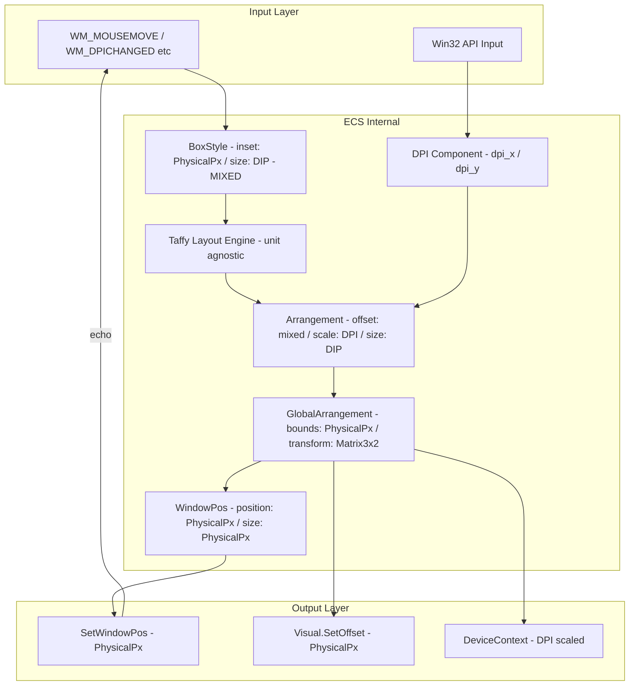
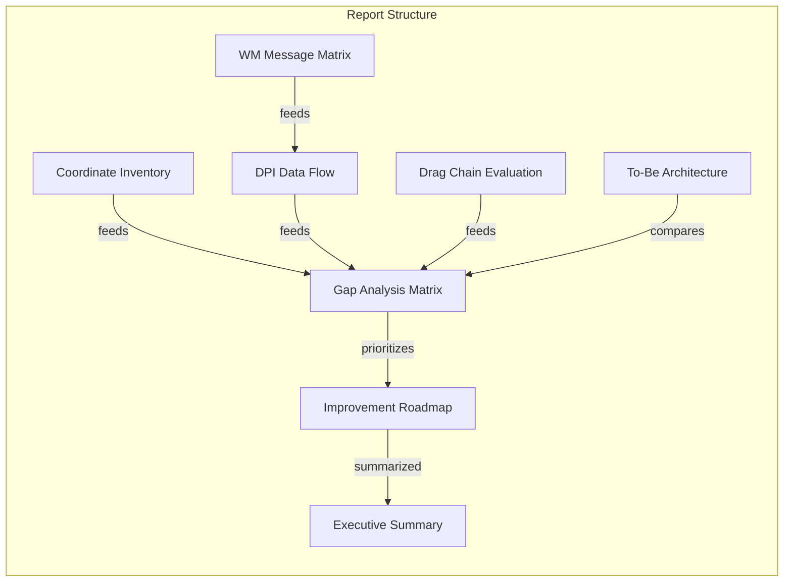
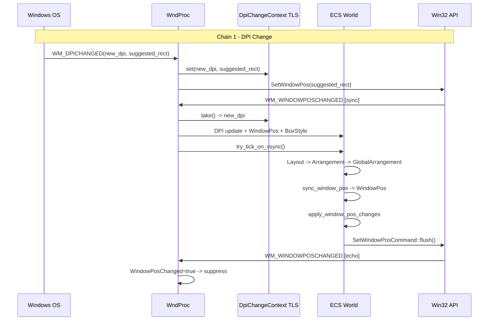
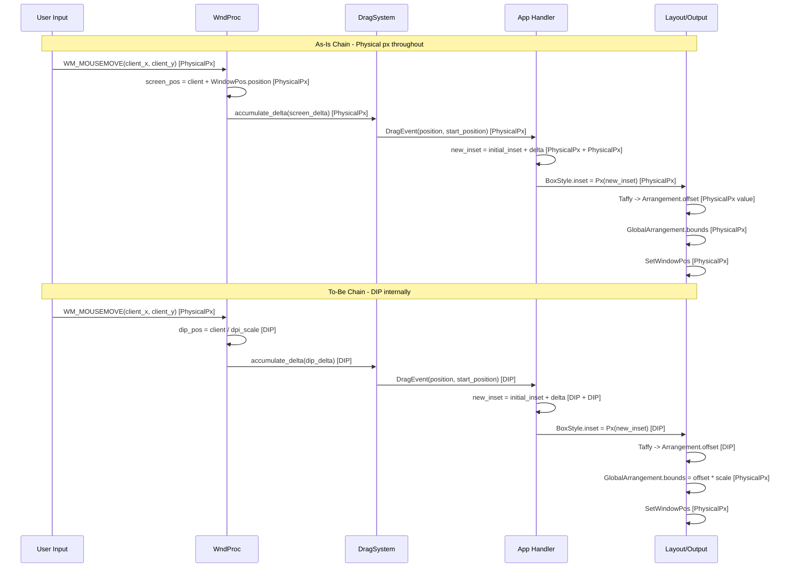

# Design Document: dpi-coordinate-transform-survey

## Overview

本仕様は `wintf` フレームワークにおける DPI 処理と座標変換の **「あるべき姿」（To-Be）** を定義し、現状（As-Is）との対比によりギャップと改善ロードマップを明確にする **調査レポート** を成果物として作成する。

**Purpose**: DPI/座標変換の構造的設計課題を体系的に調査・分析し、後続仕様（`wintf-P1-dpi-scaling` 等）の設計判断材料となる提言レポートを提供する。

**Users**: wintf フレームワーク開発者が、DPI 関連の設計判断を行う際の根拠資料として利用する。

**Impact**: コード修正は本仕様のスコープ外。成果物は `report.md`（提言文書）のみ。

### Goals
- 全座標系コンポーネントのインベントリ作成と単位分類
- DPI 値の取得→消費までの完全なデータフロー追跡
- WM メッセージ伝搬マトリクスの作成と循環リスク分析
- WPF/WinUI3 の DIP 統一モデルを参考にした To-Be アーキテクチャ設計指針の策定
- As-Is / To-Be ギャップの優先度付き一覧化
- 上記を統合した構造化レポートの出力

### Non-Goals
- コード修正やバグフィックスの実装
- 1.25 倍速ドラッグバグの根本原因特定（ランタイムデバッグ）
- `transform/` モジュール（非推奨）の詳細分析
- DirectComposition Visual の合成最適化

## Prerequisites

本仕様の成果物 `report.md` は、以下の既存調査成果物を統合・整形する作業として実施します：

- **research.md** (完成済み): 7調査トピック（WMメッセージ伝搬マトリクス、座標変換チェーン深掘り、WPF/WinUI3参照モデル等）、4アーキテクチャ候補評価、3設計判断、4リスク分析
- **gap-analysis.md** (完成済み): 座標系インベントリ（全12コンポーネント）、DPIフロー追跡、ドラッグチェーン10ステップ分析、1.25倍速バグ分析、改善オプション評価

これらの調査データは既に収集済みであり、report.md 生成タスクは「新規コードベース分析」ではなく「既存成果物の構造化レポート化」です。

## Architecture

### Existing Architecture Analysis

本仕様は調査仕様であり、既存の座標系アーキテクチャを **分析対象** として扱う。

**現行アーキテクチャの座標系モデル**:



**現行の構造的課題**:
1. `BoxStyle.inset`（物理px）と `BoxStyle.size`（DIP）の単位混在
2. Window の `Arrangement.offset` が物理px でありながら DPI scale が乗算される設計
3. `sync_window_pos` と `update_window_pos_system` の重複
4. `SetWindowPos` → `WM_WINDOWPOSCHANGED` のフィードバックループ管理が3層で冗長

### Architecture Pattern & Boundary Map

**調査レポート成果物の構造**（本仕様の「アーキテクチャ」はレポートの構造設計）:



**Architecture Integration**:
- Selected pattern: レポート駆動調査 — 各要件が report.md の独立セクションに対応
- Domain boundaries: 調査データ収集（コード解析）と設計提言（To-Be 定義）を明確に分離
- Existing patterns preserved: ECS コンポーネント分析は既存の steering 構造定義に準拠
- Steering compliance: 「レイヤードアーキテクチャ」「COM → ECS → Message Handling の依存方向」を分析の軸として維持

### Technology Stack

| Layer | Choice / Version | Role in Feature | Notes |
|-------|------------------|-----------------|-------|
| 分析対象 | wintf (Rust 2024 Edition) | 座標系コードベースの分析対象 | 変更なし |
| レイアウト | taffy 0.9.1 | 単位非認識レイアウトエンジンの挙動分析 | DIP入力時の挙動を評価 |
| Win32 API | windows 0.62.1 | PMv2 下の API 挙動文書化 | 座標系の入出力特性を調査 |
| 参照フレームワーク | WPF (.NET) / WinUI3 | DIP 統一モデルの参照 | 設計パターン抽出のみ |
| 成果物 | Markdown + Mermaid | report.md の記法 | 一覧表は Markdown table |

## System Flows

### Flow 1: WM メッセージ伝搬カスケードチェーン（report.md セクション (c) 用）



### Flow 2: ドラッグ座標変換チェーン As-Is vs To-Be（report.md セクション (d) 用）



### Flow 3: DPI 変更時の座標再計算フロー（report.md セクション (e) 用）

```mermaid
stateDiagram-v2
  [*] --> WM_DPICHANGED: OS detects monitor change
  WM_DPICHANGED --> StoreNewDPI: DpiChangeContext::set(new_dpi)
  StoreNewDPI --> ApplySuggestedRect: SetWindowPos(suggested_rect)
  ApplySuggestedRect --> WM_WINDOWPOSCHANGED: Sync callback
  WM_WINDOWPOSCHANGED --> UpdateDPIComponent: DpiChangeContext::take()
  UpdateDPIComponent --> UpdateWindowPos: WindowPos = client coords
  UpdateWindowPos --> UpdateBoxStyle: BoxStyle.size = physical / new_scale
  UpdateBoxStyle --> TriggerTick: try_tick_on_vsync()
  TriggerTick --> RecalcLayout: Taffy recompute with new scale
  RecalcLayout --> PropagateArrangements: GlobalArrangement recalc
  PropagateArrangements --> SyncOutputs: Visual + Surface + WindowPos
  SyncOutputs --> [*]: Frame complete
```

## Requirements Traceability

| Requirements | Summary | Sections | Interfaces | Flows |
|-------------|---------|------------|------------|-------|
| 1.1 | 座標値コンポーネント一覧表 | CoordinateInventorySection | — | — |
| 1.2 | BoxStyle混在箇所の判定 | CoordinateInventorySection | — | — |
| 1.3 | WinState vs DPI 二重管理文書化 | CoordinateInventorySection | — | — |
| 1.4 | Win32 API 入出力座標系 | CoordinateInventorySection, WMMessageMatrixSection | — | — |
| 2.1 | DPI値フロー全経路追跡 | DPIDataFlowSection | — | Flow 1 |
| 2.2 | DpiChangeContext 同期検証 | DPIDataFlowSection | — | Flow 1 |
| 2.3 | 二重スケーリング検証 | DPIDataFlowSection | — | — |
| 2.4 | Monitor DPI 未反映の影響評価 | DPIDataFlowSection, GapMatrixSection | — | — |
| 3.1 | ドラッグ変換チェーン As-Is/To-Be 対比 | DragChainSection | — | Flow 2 |
| 3.2 | BoxStyle.inset 変換チェーン差異評価 | DragChainSection | — | Flow 2 |
| 3.3 | sync_window_arrangement 評価 | DragChainSection | — | — |
| 4.1 | WPF/WinUI3 DIPモデル調査 | ToBeArchitectureSection | — | — |
| 4.2 | DIP統一方針の妥当性評価 | ToBeArchitectureSection | — | — |
| 4.3 | BoxStyle座標系統一方針 | ToBeArchitectureSection | — | — |
| 4.4 | Arrangement/WindowPos 関係再定義 | ToBeArchitectureSection | — | — |
| 4.5 | DPI変更時再計算フロー定義 | ToBeArchitectureSection | — | Flow 3 |
| 5.1 | ギャップ優先度マトリクス | GapMatrixSection | — | — |
| 5.2 | 移行ロードマップ | RoadmapSection | — | — |
| 5.3 | dpi-propagation vs P1 差分 | GapMatrixSection, RoadmapSection | — | — |
| 6.1 | report.md 出力 | ReportGenerator | ReportFileContract | — |
| 6.2 | レポートセクション構成 | All Sections | — | — |
| 6.3 | Mermaid/Markdown table 使用 | All Sections | DiagramContract | — |
| 6.4 | クロスリファレンス付与 | GapMatrixSection, RoadmapSection | — | — |

## Report Sections and Contracts

| Section | Domain/Layer | Intent | Req Coverage | Key Dependencies | Contracts |
|-----------|-------------|--------|-------------|-----------------|-----------|
| ReportGenerator | 成果物生成 | report.md の統合生成 | 6.1, 6.2, 6.3 | All Sections (P0) | File |
| CoordinateInventorySection | As-Is 調査 | 座標系一覧表と混在箇所の特定 | 1.1, 1.2, 1.3, 1.4 | Codebase analysis (P0) | Content |
| WMMessageMatrixSection | As-Is 調査（追加指示） | WMメッセージ伝搬マトリクスと循環分析 | 1.4, 2.1, 2.2 | Codebase analysis (P0) | Content |
| DPIDataFlowSection | As-Is 調査 | DPI値フロー追跡とデータフロー図 | 2.1, 2.2, 2.3, 2.4 | Codebase analysis (P0) | Content |
| DragChainSection | As-Is/To-Be 対比 | ドラッグ座標変換チェーン評価 | 3.1, 3.2, 3.3 | ToBeArchitectureSection (P1) | Content |
| ToBeArchitectureSection | To-Be 設計指針 | あるべき座標変換アーキテクチャ | 4.1, 4.2, 4.3, 4.4, 4.5 | WPF/WinUI3 research (P0) | Content |
| GapMatrixSection | ギャップ分析 | 優先度付きギャップ一覧 | 5.1, 5.3 | All As-Is/To-Be (P0) | Content |
| RoadmapSection | 提言 | 改善ロードマップ | 5.2, 5.3 | GapMatrixSection (P0) | Content |
| ExecutiveSummarySection | 要約 | エグゼクティブサマリー | 6.2 | All Sections (P0) | Content |

### 成果物生成層

#### ReportGenerator

| Field | Detail |
|-------|--------|
| Intent | 全セクションの調査結果を統合し `report.md` として出力する |
| Requirements | 6.1, 6.2, 6.3, 6.4 |

**Responsibilities & Constraints**
- `report.md` を `.kiro/specs/dpi-coordinate-transform-survey/report.md` に生成
- 全セクションを Req 6.2 定義の順序で結合
- Mermaid フロー図と Markdown table の形式を統一
- 各改善提案に `dpi-propagation`, `wintf-P1-dpi-scaling`, `event-drag-system` へのクロスリファレンスを付与

**Dependencies**
- Inbound: All Sections — レポート内容 (P0)

**Contracts**: File [x]

##### File Contract

```
Output: .kiro/specs/dpi-coordinate-transform-survey/report.md
Format: Markdown with Mermaid diagrams
Encoding: UTF-8
Language: Japanese (ja)
```

**Section Order**:
1. エグゼクティブサマリー
2. 座標系インベントリ
3. WM メッセージ伝搬マトリクス（追加指示による拡張）
4. DPI データフロー図
5. ドラッグ座標変換チェーン評価（As-Is / To-Be 対比）
6. To-Be アーキテクチャ設計指針
7. ギャップ分析マトリクス
8. 改善ロードマップ

### As-Is 調査層

#### CoordinateInventorySection

| Field | Detail |
|-------|--------|
| Intent | 全座標値コンポーネントの一覧化と混在箇所の判定 |
| Requirements | 1.1, 1.2, 1.3, 1.4 |

**Responsibilities & Constraints**
- 全 ECS コンポーネントの座標フィールドを列挙し、座標系（物理px / DIP / スクリーン / クライアント / ローカル）を分類
- 同一コンポーネント内の座標系混在を特定（`BoxStyle.inset` 物理px + `BoxStyle.size` DIP = 意図的設計）
- `WinState` trait と ECS `DPI` コンポーネントの使用箇所・責務比較
- Win32 API の入出力座標系を Per-Monitor v2 下での挙動とともに文書化

**Dependencies**
- Outbound: Codebase analysis — `ecs/layout/`, `ecs/window.rs`, `ecs/graphics/`, `api.rs` (P0)

**Contracts**: Content [x]

##### Content Contract

出力形式: Markdown table（コンポーネント/フィールド | 座標系 | ファイルパス:行番号 | 意図的/不整合）

**Implementation Notes**
- gap-analysis.md の座標系コンポーネント一覧を基盤とし、Win32 API マトリクスを追加
- `WinState` trait は非 ECS デモ（`areka.rs` 等）でのみ使用 — 統合提案は「ECS 移行完了後に廃止」

#### WMMessageMatrixSection

| Field | Detail |
|-------|--------|
| Intent | DPI/座標に影響する全WMメッセージの伝搬マトリクス作成と循環リスク分析 |
| Requirements | 1.4, 2.1, 2.2 |

**Responsibilities & Constraints**
- ハンドルされる全WMメッセージの入力座標系・出力先・トリガーされるメッセージを一覧化
- メッセージカスケードチェーン（5チェーン）を図示
- フィードバックループ防止機構（3層防御）の有効性を評価
- ハンドルされていない注目メッセージ（`WM_GETDPISCALEDSIZE`, `WM_NCCALCSIZE` 等）の影響評価
- 座標情報の劣化パス（f32→i32丸め、エコーバック時の微差）を特定

**Dependencies**
- Outbound: `ecs/window_proc/mod.rs`, `ecs/window_proc/handlers.rs`, `ecs/window.rs` (P0)

**Contracts**: Content [x]

##### Content Contract

出力形式:
- **メッセージマトリクス**: Markdown table（メッセージ | 入力座標系 | ECS出力先 | Win32 API呼出 | トリガーWM | 循環リスク）
- **カスケードチェーン図**: Mermaid sequence diagram（5チェーン分）
- **防御機構評価表**: Markdown table（層 | メカニズム | 有効範囲 | 潜在リスク）
- **座標劣化パス**: 数値トレース付きの変換チェーン

**Implementation Notes**
- research.md のトピック1・2の調査結果をレポート形式に整形
- PointerState.screen_point の命名不整合を「座標劣化パス」として記載

#### DPIDataFlowSection

| Field | Detail |
|-------|--------|
| Intent | DPI値の取得元から消費先までの完全なデータフロー追跡 |
| Requirements | 2.1, 2.2, 2.3, 2.4 |

**Responsibilities & Constraints**
- `GetDpiForWindow` → `DPI` → `Arrangement.scale` → `GlobalArrangement` → `Visual`/`Surface`/`SetWindowPos` の全経路図
- `DpiChangeContext` スレッドローカルの同期伝達検証
- 二重スケーリング検証（Window の `Mul` パスで `parent_scale=1.0` のため現状は問題なし）
- `Monitor.dpi` が `Arrangement.scale` に未反映である影響評価

**Dependencies**
- Outbound: `ecs/window.rs`, `ecs/layout/systems.rs`, `ecs/graphics/systems.rs` (P0)

**Contracts**: Content [x]

##### Content Contract

出力形式:
- **DPIフロー図**: Mermaid flowchart（取得元 → 保持 → 伝播 → 消費の4段階）
- **スケール値追跡表**: Markdown table（パイプラインステージ | scale値 | 座標系）

### As-Is / To-Be 対比層

#### DragChainSection

| Field | Detail |
|-------|--------|
| Intent | ドラッグ操作の座標変換チェーンを As-Is と To-Be で対比評価 |
| Requirements | 3.1, 3.2, 3.3 |

**Responsibilities & Constraints**
- As-Is: `WM_MOUSEMOVE` → `DragEvent` → ハンドラ → `BoxStyle` → `SetWindowPos` の全10ステップ文書化
- To-Be: DIP 統一時の理想チェーンを併記
- コンフリクト箇所（`BoxStyle.inset` 物理px → DIP 変更、ドラッグデルタの DIP 変換必要性）を指摘
- `sync_window_arrangement_from_window_pos`（無効化中）の To-Be での位置づけ評価

**Dependencies**
- Inbound: ToBeArchitectureSection — To-Be 変換チェーン定義 (P1)
- Outbound: `ecs/drag/`, `ecs/window_proc/handlers.rs`, `examples/taffy_flex_demo.rs` (P0)

**Contracts**: Content [x]

##### Content Contract

出力形式:
- **変換チェーン比較図**: Mermaid sequence diagram（As-Is / To-Be 並列）
- **数値トレース表**: DPI=120(1.25x)条件での具体的な座標値追跡

### To-Be 設計指針層

#### ToBeArchitectureSection

| Field | Detail |
|-------|--------|
| Intent | WPF/WinUI3 を参考にした wintf の理想座標変換アーキテクチャ定義 |
| Requirements | 4.1, 4.2, 4.3, 4.4, 4.5 |

**Responsibilities & Constraints**
- WPF DIP 統一モデルの要約と wintf への適用パターン提示
- 「全内部座標を DIP で統一し、物理px変換は出力層のみ」方針の妥当性評価
- `BoxStyle` 座標系統一方針と影響範囲の列挙
- `Arrangement.offset` と `WindowPos.position` の関係再定義（`sync_window_arrangement_from_window_pos` 有効化の前提条件）
- Per-Monitor DPI v2 環境でのモニタ間移動時の DPI 変更再計算フロー定義

**Dependencies**
- Outbound: WPF/WinUI3 documentation research (P0)

**Contracts**: Content [x]

##### Content Contract

出力形式:
- **アーキテクチャ比較図**: Mermaid graph（As-Is vs To-Be の座標フロー）
- **変更影響マトリクス**: Markdown table（コンポーネント | 現在の座標系 | To-Be 座標系 | 変更内容 | 影響範囲）
- **DPI変更シーケンス図**: Mermaid sequence diagram

**Implementation Notes**
- To-Be アーキテクチャの核心原則:
  1. **DIP Layer Rule**: BoxStyle, Arrangement.offset, Arrangement.size は全て DIP
  2. **Output Conversion Rule**: 物理px変換は `GlobalArrangement.bounds` 計算時と Win32 API 呼び出し時のみ
  3. **Input Conversion Rule**: WM_MOUSEMOVE 等の物理px入力は、イベント層で DIP に変換
  4. **Single Authority Rule**: WindowPos ↔ Arrangement の双方向同期は単一ゲートシステムで制御
- `sync_window_arrangement_from_window_pos` の有効化条件: BoxStyle.inset が DIP に統一された後

### ギャップ分析・提言層

#### GapMatrixSection

| Field | Detail |
|-------|--------|
| Intent | As-Is / To-Be ギャップの優先度マトリクス作成 |
| Requirements | 5.1, 5.3, 6.4 |

**Responsibilities & Constraints**
- 各ギャップに「影響度 / 修正コスト / ブロック仕様」を評価
- `dpi-propagation`（完了）と `wintf-P1-dpi-scaling`（バックログ）の差分を明確化
- 各ギャップに既存仕様へのクロスリファレンスを付与

**Dependencies**
- Inbound: CoordinateInventorySection, DPIDataFlowSection, DragChainSection, ToBeArchitectureSection — ギャップ抽出元 (P0)

**Contracts**: Content [x]

##### Content Contract

出力形式:
- **優先度マトリクス**: Markdown table（# | ギャップ | 影響度 | コスト | ブロック仕様 | 優先度 | クロスリファレンス）
- **dpi-propagation vs P1 差分表**: Markdown table

#### RoadmapSection

| Field | Detail |
|-------|--------|
| Intent | ギャップ解消のための段階的改善ロードマップ |
| Requirements | 5.2, 6.4 |

**Responsibilities & Constraints**
- 段階的移行と一括移行のアプローチ比較（リスク/コスト評価）
- フェーズ分割案の提示（Phase 1: Window DIP 化 → Phase 2: Widget DIP 化 → Phase 3: LayoutRoot/Monitor DIP 化）
- 各フェーズの前提条件・検証基準・ロールバック条件

**Dependencies**
- Inbound: GapMatrixSection — 優先度情報 (P0)

**Contracts**: Content [x]

##### Content Contract

出力形式:
- **移行アプローチ比較表**: Markdown table（アプローチ | メリット | リスク | 所要期間）
- **フェーズ別ロードマップ**: Markdown table + Mermaid gantt（オプション）

#### ExecutiveSummarySection

| Field | Detail |
|-------|--------|
| Intent | レポート全体のエグゼクティブサマリー |
| Requirements | 6.2 |

**Responsibilities & Constraints**
- 調査の背景・目的・主要発見事項・推奨事項を 1 ページ以内で要約
- 後続仕様への具体的なアクション提言

**Dependencies**
- Inbound: All Sections — サマリー抽出元 (P0)

**Contracts**: Content [x]

## Data Models

本仕様は調査仕様のため、新規データモデルは定義しない。分析対象の既存 ECS コンポーネントは以下の通り:

### 分析対象 ECS コンポーネント（座標系インベントリのデータソース）

| Component | Location | 座標系フィールド | 現在の単位 | To-Be 単位 |
|-----------|----------|----------------|-----------|-----------|
| `BoxStyle.inset` | `ecs/layout/mod.rs` | left, top, right, bottom | 物理px | **DIP** |
| `BoxStyle.size` | `ecs/layout/mod.rs` | width, height | DIP | DIP（変更なし）|
| `WindowPos.position` | `ecs/window.rs` | x, y | 物理px(client screen) | 物理px(変更なし)|
| `WindowPos.size` | `ecs/window.rs` | w, h | 物理px | 物理px(変更なし)|
| `Arrangement.offset` | `ecs/layout/arrangement.rs` | x, y | 混在(物理px/DIP) | **DIP** |
| `Arrangement.scale` | `ecs/layout/arrangement.rs` | x, y | DPI scale | DPI scale（変更なし）|
| `Arrangement.size` | `ecs/layout/arrangement.rs` | w, h | DIP | DIP（変更なし）|
| `GlobalArrangement.bounds` | `ecs/layout/arrangement.rs` | RECT | 物理px | 物理px（変更なし）|
| `GlobalArrangement.transform` | `ecs/layout/arrangement.rs` | Matrix3x2 | 累積 | 累積（変更なし）|
| `DPI` | `ecs/window.rs` | dpi_x, dpi_y | DPI値(u16) | DPI値（変更なし）|
| `DragEvent.position` | `ecs/drag/dispatch.rs` | x, y | 物理px(screen) | **DIP** |
| `PointerState.screen_point` | `ecs/window_proc/handlers.rs` | x, y | ⚠クライアント座標 | **DIP(client)に修正** |

## Error Handling

### 調査ハンドリング方針

| カテゴリ | 対応方針 |
|---------|---------|
| 分析対象コードの読み取りエラー | ファイルパスと行番号を明記し、「要確認」マークを付与 |
| 座標系判定の曖昧さ | 「意図的設計 / 不整合 / 不明」の3分類で判定し、「不明」は report.md に注記 |
| 外部ドキュメントの情報欠如 | 「Documentation Gap」として記録し、推奨される追加調査を提示 |

## Testing Strategy

### 調査結果の検証方法

- **座標系インベントリの検証**: コードベースの grep 結果と目視確認の突き合わせ（座標フィールドの漏れがないこと）
- **DPIフローの検証**: 既存テスト（`graphics_core_test.rs`, `arrangement_bounds_test.rs` 等）の DPI 関連テストケースとの整合性確認
- **WMメッセージマトリクスの検証**: `ecs/window_proc/mod.rs` のディスパッチテーブルとの全件照合
- **To-Be 設計の検証**: WPF ドキュメントの DIP モデルとの整合性確認、数値トレースの手計算検証
- **レポートの形式検証**: Mermaid 記法の構文チェック、Markdown table のレンダリング確認

## Optional Sections

### Performance & Scalability

本仕様は調査仕様のため、パフォーマンスターゲットは定義しない。ただし、To-Be アーキテクチャの提言において以下を考慮:

- DIP ↔ 物理px 変換のオーバーヘッド: f32 乗除算のみ（ナノ秒レベル、無視可能）
- フィードバックループ収束: 現行3層防御で1-2フレーム以内に安定。To-Be ではシステム統合により即時収束を目標

