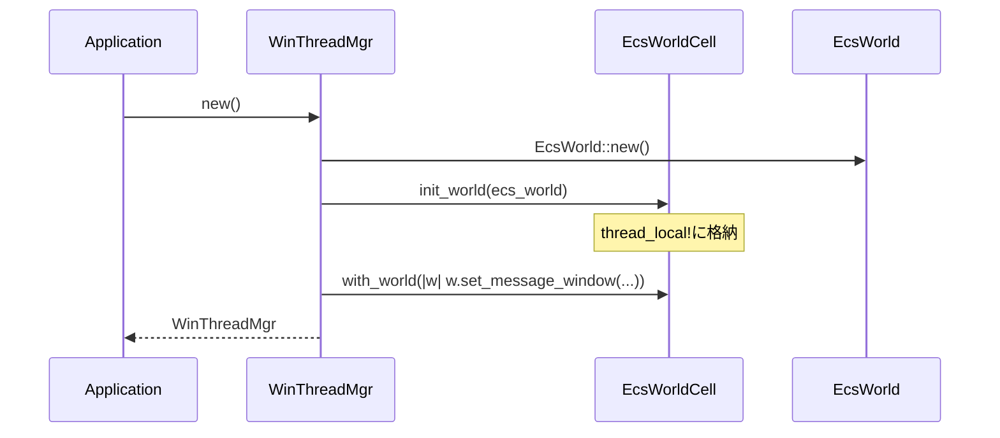
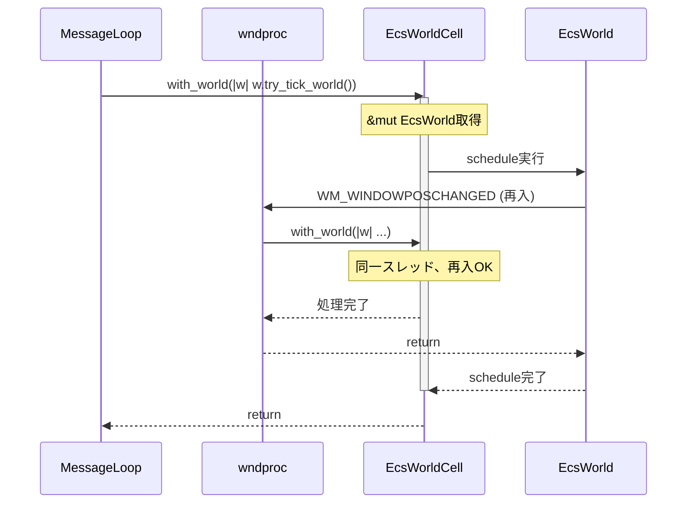

# Design Document: ecs-world-unsafecell

## Overview

**Purpose**: EcsWorldへのアクセス機構を`Rc<RefCell<EcsWorld>>`から`UnsafeCell`ベースの軽量な仕組みに移行し、wndprocの再入問題を根本的に解決する。

**Users**: wintfフレームワーク開発者およびフレームワーク利用者が、Windowsメッセージ処理中に自然にEcsWorldにアクセスできるようになる。

**Impact**: 現在のRefCellによるランタイム借用チェックを排除し、`try_borrow_mut()`による防御的コードを削除。シングルスレッド保証を活用した軽量なアクセス機構を提供。

### Goals

- wndproc再入時のRefCellパニックを根本解決
- `try_borrow_mut()`による防御的コードの削除
- シングルスレッド保証を活用した軽量なアクセス機構の提供
- unsafeコードの安全性を文書化

### Non-Goals

- マルチスレッドからのEcsWorldアクセス対応（シングルスレッド前提を維持）
- WM_DPICHANGED_DEFERREDの廃止（Changed<DPI>動作保証のため維持）
- EcsWorld内部構造の変更

## Architecture

### Existing Architecture Analysis

**現在の構造**:
- `WinThreadMgrInner`が`Rc<RefCell<EcsWorld>>`を所有
- `window_proc.rs`の`ECS_WORLD: OnceLock<SendWeak>`がwndprocからアクセスするための弱参照を保持
- `SendWeak`構造体で`unsafe impl Send/Sync`を実装（実際はメインスレッドのみアクセス）

**問題点**:
- `RefCell`の借用チェックにより、wndproc再入時にパニックの可能性
- `try_borrow_mut()`による防御的コードが複雑化を招いている
- `SendWeak`の`unsafe impl Send/Sync`は本来不要（メインスレッドのみアクセス）

### Architecture Pattern & Boundary Map

```mermaid
graph TB
    subgraph MessageLoop["メッセージループ (win_thread_mgr.rs)"]
        WTM[WinThreadMgr]
        ML[run()]
    end
    
    subgraph EcsLayer["ECS Layer (ecs/world.rs)"]
        EWC["EcsWorldCell<br/>(thread_local!)"]
        EW[EcsWorld]
        EWC -->|"UnsafeCell<Option<>>"|EW
    end
    
    subgraph WndProc["WndProc (window_proc.rs)"]
        WP[ecs_wndproc]
        MSG1[WM_WINDOWPOSCHANGED]
        MSG2[WM_NCDESTROY]
        MSG3[WM_DPICHANGED_DEFERRED]
    end
    
    WTM -->|"init_world()"|EWC
    ML -->|"with_world()"|EWC
    WP -->|"with_world()"|EWC
    MSG1 --> WP
    MSG2 --> WP
    MSG3 --> WP
```

**Architecture Integration**:
- **Selected pattern**: thread_local! + UnsafeCell（シングルスレッド専用の軽量アクセス）
- **Domain boundaries**: EcsWorldの所有権はthread_local!に移動、WinThreadMgrは初期化のみ担当
- **Existing patterns preserved**: SAFETYコメント、モジュール構造
- **New components**: `EcsWorldCell`型、`init_world()`/`with_world()` API
- **Steering compliance**: unsafe隔離原則を維持、ECS層への集約

### Technology Stack

| Layer | Choice / Version | Role in Feature | Notes |
|-------|------------------|-----------------|-------|
| Language | Rust 2021 | UnsafeCell, thread_local! | 標準ライブラリのみ使用 |
| ECS | bevy_ecs 0.17.2 | EcsWorld内部実装 | 変更なし |
| Windows | windows 0.62.1 | wndproc, メッセージループ | 変更なし |

## System Flows

### EcsWorld初期化フロー



### wndproc再入フロー



## Requirements Traceability

| Requirement | Summary | Components | Interfaces | Flows |
|-------------|---------|------------|------------|-------|
| 1.1 | UnsafeCell<EcsWorld>ラッパー型 | EcsWorldCell | - | - |
| 1.2 | thread_local!管理 | ECS_WORLD_CELL | init_world() | 初期化フロー |
| 1.3 | 可変参照の直接提供 | EcsWorldCell | with_world() | 再入フロー |
| 1.4 | !Send/!Sync保証 | EcsWorldCell | - | - |
| 2.1 | with_world API | EcsWorldCell | with_world<R>() | 再入フロー |
| 2.2 | 再入アクセス許可 | EcsWorldCell | with_world() | 再入フロー |
| 2.3 | マルチスレッドコンパイルエラー | EcsWorldCell | - | - |
| 3.1 | WinThreadMgrInner移行 | WinThreadMgrInner | - | 初期化フロー |
| 3.2 | ECS_WORLD置換 | ECS_WORLD_CELL | - | - |
| 3.3 | メッセージループ移行 | WinThreadMgrInner | with_world() | - |
| 3.4 | try_borrow_mut削除 | window_proc | with_world() | 再入フロー |
| 4.1 | WM_DPICHANGED PostMessage維持 | window_proc | - | - |
| 4.2 | WM_DPICHANGED_DEFERRED処理 | window_proc | - | - |
| 4.3 | 遅延理由の文書化 | window_proc | - | - |
| 5.1 | SAFETYコメント | EcsWorldCell | - | - |
| 5.2 | モジュールドキュメント | world.rs | - | - |
| 5.3 | 設計文書化 | doc/ | - | - |

## Components and Interfaces

### Summary

| Component | Domain/Layer | Intent | Req Coverage | Key Dependencies | Contracts |
|-----------|--------------|--------|--------------|------------------|-----------|
| EcsWorldCell | ECS | thread_local!でEcsWorldを管理 | 1.1-1.4, 2.1-2.3 | EcsWorld | Service |
| WinThreadMgrInner | Message | メッセージループ管理（worldフィールド削除） | 3.1, 3.3 | EcsWorldCell (P0) | - |
| window_proc | Message | wndproc実装（防御的コード削除） | 3.2, 3.4, 4.1-4.3 | EcsWorldCell (P0) | - |

### ECS Layer

#### EcsWorldCell

| Field | Detail |
|-------|--------|
| Intent | thread_local!でEcsWorldを安全に管理し、再入可能なアクセスを提供 |
| Requirements | 1.1, 1.2, 1.3, 1.4, 2.1, 2.2, 2.3 |

**Responsibilities & Constraints**
- `UnsafeCell<Option<EcsWorld>>`を内部に持ち、`thread_local!`で管理
- `init_world()`で一度だけ初期化、`with_world()`でアクセス
- 同一スレッド上での再入を許可（UnsafeCellはランタイムチェックなし）
- `thread_local!`により自動的に`!Send`/`!Sync`が保証される

**Dependencies**
- Inbound: WinThreadMgrInner — 初期化 (P0)
- Inbound: window_proc — wndprocからのアクセス (P0)
- Internal: EcsWorld — 実際のECS World (P0)

**Contracts**: Service [x]

##### Service Interface

```rust
/// EcsWorldCellの内部構造
/// thread_local!マクロ内で使用されるため、直接公開しない
struct EcsWorldCell {
    inner: UnsafeCell<Option<EcsWorld>>,
}

// thread_local!により自動的に!Send/!Syncとなる
// 明示的なunsafe impl不要

impl EcsWorldCell {
    /// 新しい空のEcsWorldCellを作成
    const fn new() -> Self;
    
    /// EcsWorldを初期化
    /// 
    /// # Panics
    /// 既に初期化されている場合はパニック
    fn init(&self, world: EcsWorld);
    
    /// EcsWorldへの可変参照を取得してクロージャを実行
    /// 
    /// # Panics
    /// 初期化されていない場合はパニック
    /// 
    /// # Safety
    /// thread_local!により同一スレッドからのみアクセス可能。
    /// UnsafeCellは再入を許可するため、ネストした呼び出しも安全。
    fn with<R>(&self, f: impl FnOnce(&mut EcsWorld) -> R) -> R;
}

// モジュールレベルAPI
thread_local! {
    static ECS_WORLD_CELL: EcsWorldCell = const { EcsWorldCell::new() };
}

/// EcsWorldを初期化（WinThreadMgr::new()から呼ばれる）
pub fn init_world(world: EcsWorld);

/// EcsWorldにアクセス
pub fn with_world<R>(f: impl FnOnce(&mut EcsWorld) -> R) -> R;
```

- Preconditions: 
  - `with_world()`呼び出し前に`init_world()`が完了していること
  - **wndproc内での`with_world()`クロージャではWindows APIを呼び出さないこと**
  - **wndproc内での処理はマーカーコンポーネント投入またはイベント投入に限定**
- Postconditions: クロージャ実行後、EcsWorldは有効な状態を維持
- Invariants: EcsWorldは常にメインスレッドからのみアクセスされる

**Implementation Notes**
- Integration: `WinThreadMgr::new()`で`init_world()`を呼び出し、既存の`set_ecs_world()`を置換
- Validation: `init_world()`の二重呼び出しはパニック、`with_world()`の初期化前呼び出しもパニック
- Risks: unsafeコードの安全性はSAFETYコメントで明示
- **Future Direction**: wndproc内の処理は最終的にECSイベント投入方式に統一予定

### Message Handling Layer

#### WinThreadMgrInner (変更)

| Field | Detail |
|-------|--------|
| Intent | メッセージループ管理（worldフィールドを削除し、EcsWorldCellを使用） |
| Requirements | 3.1, 3.3 |

**変更内容**
- `world: Rc<RefCell<EcsWorld>>`フィールドを削除
- `world()`メソッドを削除
- `new()`で`init_world()`を呼び出し
- `run()`内の`self.world.borrow_mut()`を`with_world()`に変更

```rust
// 削除されるフィールド
// world: Rc<RefCell<EcsWorld>>,

// 削除されるメソッド
// pub fn world(&self) -> Rc<RefCell<EcsWorld>> { ... }

// 変更されるメソッド
fn new() -> Result<Self> {
    // ...
    let world = EcsWorld::new();
    // EcsWorldをthread_local!に移動
    crate::ecs::init_world(world);
    // 以降はwith_world()でアクセス
    crate::ecs::with_world(|w| w.set_message_window(message_window));
    // ...
}

pub fn run(&self) -> Result<()> {
    // ...
    if msg.message == WM_VSYNC {
        crate::ecs::with_world(|w| w.try_tick_world());
        continue;
    }
    // ...
}
```

#### window_proc (変更)

| Field | Detail |
|-------|--------|
| Intent | wndproc実装（RefCell関連コードを削除し、with_world()を使用） |
| Requirements | 3.2, 3.4, 4.1, 4.2, 4.3 |

**削除されるコード**
- `SendWeak`構造体と`unsafe impl Send/Sync`
- `ECS_WORLD: OnceLock<SendWeak>`
- `set_ecs_world()`, `get_ecs_world()`, `try_get_ecs_world()`関数

**変更されるコード**
```rust
// Before
if let Some(world) = try_get_ecs_world() {
    if let Ok(mut world_borrow) = world.try_borrow_mut() {
        // ...
    }
}

// After
crate::ecs::with_world(|world| {
    // ... 直接アクセス可能
});
```

**維持されるコード（要件4）**
```rust
WM_DPICHANGED => {
    // WM_DPICHANGEDは同期的に送信されるため、PostMessageで遅延処理
    // 理由: Changed<DPI>フィルターはスケジュール完了時にフラッシュされるため、
    // 同一フレーム内での変更は次フレームのLayoutで検出されない
    crate::ecs::window::post_dpi_change(hwnd, wparam);
    DefWindowProcW(hwnd, message, wparam, lparam)
}
```

## Data Models

本機能ではデータモデルの変更なし。`EcsWorld`の内部構造は維持される。

## Error Handling

### Error Strategy

| エラー種別 | 発生条件 | 対応 |
|-----------|---------|------|
| 初期化前アクセス | `init_world()`前に`with_world()`呼び出し | `panic!`（開発時バグ） |
| 二重初期化 | `init_world()`を2回呼び出し | `panic!`（開発時バグ） |

### Monitoring

- パニックメッセージに明確なエラー説明を含める
- デバッグビルドでのみ追加の診断情報を出力

## Testing Strategy

### Unit Tests
- `EcsWorldCell::init()`の正常動作
- `EcsWorldCell::with()`の正常動作
- 初期化前アクセスでのパニック検証
- 二重初期化でのパニック検証

### Integration Tests
- `WinThreadMgr::new()`後の`with_world()`アクセス
- メッセージループ内での`with_world()`アクセス
- wndproc内での`with_world()`アクセス（再入シナリオ）

### Manual Tests
- examples/multi_window_test.rsの動作確認
- DPI変更時の動作確認（Changed<DPI>の検出）

## Security Considerations

### unsafe コードの安全性

**脅威**: UnsafeCellの不正使用によるメモリ安全性の破壊

**対策**:
1. `thread_local!`による静的なスレッド安全性保証
2. SAFETYコメントによる安全性根拠の明示
3. 公開APIは安全なラッパー関数のみ

**SAFETYコメント要件**:
```rust
// SAFETY: このunsafeブロックは以下の理由で安全である:
// 1. thread_local!により、EcsWorldCellは作成スレッドからのみアクセス可能
// 2. Windowsメッセージループはシングルスレッドで動作する
// 3. wndproc内での`with_world()`使用はマーカーコンポーネント投入または
//    イベント投入に限定され、Windows API呼び出しを行わないため再入は発生しない
// 4. EcsWorldCell自体は!Send/!Syncであり、他スレッドへの送信は不可能
// 5. したがって、&mut EcsWorldの重複は原理的に発生せず、UBは回避される
```

## Migration Strategy

### Phase 1: EcsWorldCell実装
1. `ecs/world.rs`に`EcsWorldCell`型を追加
2. `init_world()`, `with_world()`関数を追加
3. 既存コードと並行して動作可能

### Phase 2: WinThreadMgrInner移行
1. `new()`を変更して`init_world()`を使用
2. `run()`を変更して`with_world()`を使用
3. `world`フィールドと`world()`メソッドを削除

### Phase 3: window_proc移行
1. `SendWeak`, `ECS_WORLD`関連コードを削除
2. 各メッセージハンドラを`with_world()`に移行
3. `try_borrow_mut()`を直接アクセスに変更

### Phase 4: examples/tests移行
1. `world.borrow_mut()`を`with_world()`に変更
2. コンパイルエラーで移行漏れを検出

### Rollback Strategy
- 各フェーズは独立してrevert可能
- Phase 1完了後、既存コードを維持したまま新APIをテスト可能
