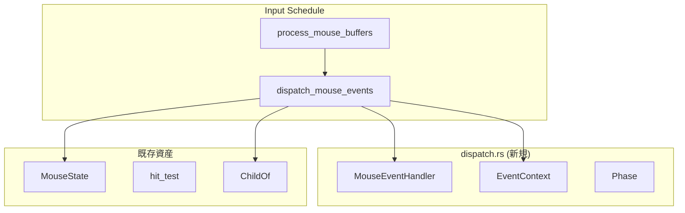
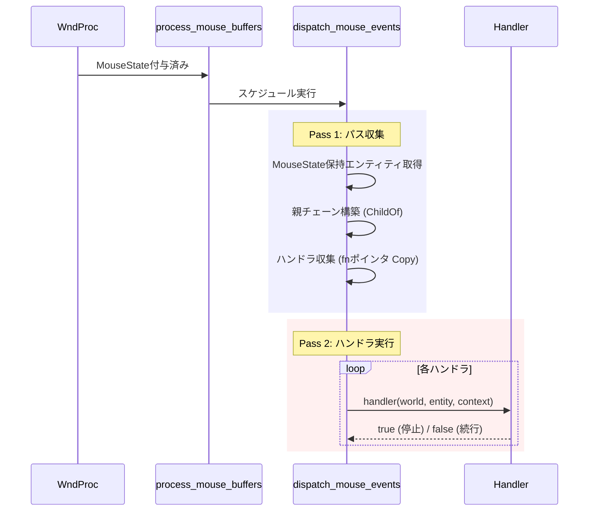
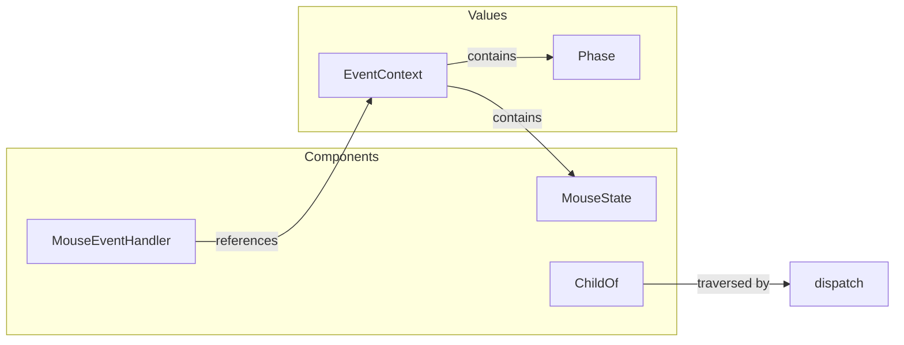

# Design Document: event-dispatch

| 項目 | 内容 |
|------|------|
| **Document Title** | event-dispatch 技術設計書 |
| **Version** | 1.0 |
| **Date** | 2025-12-03 |
| **Spec Reference** | `.kiro/specs/event-dispatch/requirements.md` v0.2 |

---

## Overview

**Purpose**: 本機能は wintf フレームワークにおけるイベント配信機構を提供する。ヒットテストで特定されたエンティティから親エンティティへイベントを伝播し、登録されたハンドラを呼び出す。

**Users**: wintf を使用するアプリケーション開発者。ウィジェットにイベントハンドラを登録し、クリック・ホバー等のユーザー操作に応答する。

**Impact**: 既存の `MouseState` コンポーネントベースのイベント検出に、ハンドラディスパッチ機構を追加。`ecs/dispatch.rs` として新規モジュールを導入。

### Goals

- 子→親へのイベントバブリング機構を提供（1.1-1.5）
- 関数ポインタ型ハンドラコンポーネントを提供（3.1-3.5）
- 同一フレーム内で伝播を完結（5.2）
- 汎用ディスパッチ設計で将来拡張に対応（8.1-8.4）

### Non-Goals

- キャプチャフェーズ（2.x）— P2、将来実装
- イベント履歴（9.x）— P2、デバッグ機能
- キーボード/タッチイベント — 別仕様
- ハンドラ内パニック処理 — 設計外

---

## Architecture

### Existing Architecture Analysis

本機能は既存のイベントシステムを拡張する：

| 既存資産 | 責務 | 本設計での役割 |
|----------|------|----------------|
| `ecs/mouse.rs` | MouseState 管理 | 入力データソース |
| `ecs/layout/hit_test.rs` | 座標→Entity 特定 | ヒット対象の決定 |
| `ecs/common/tree_iter.rs` | 階層走査 | 参考パターン |
| `ecs/world.rs` | スケジュール管理 | 統合ポイント |

**制約事項**:
- `MouseState` との後方互換性維持
- 既存の Input → Update → Render スケジュール順序を尊重

### Architecture Pattern & Boundary Map



**Architecture Integration**:
- **選択パターン**: 新規モジュール作成（Option B）
- **責務分離**: `mouse.rs`（状態管理）と `dispatch.rs`（配信機構）を分離
- **既存パターン**: SparseSet ストレージ、排他システム、ChildOf 走査
- **新規コンポーネント**: `MouseEventHandler`, `EventContext<E>`, `Phase`

### Technology Stack

| Layer | Choice / Version | Role in Feature | Notes |
|-------|------------------|-----------------|-------|
| ECS Framework | bevy_ecs 0.17.2 | Component, System, World | 既存依存 |
| Hierarchy | bevy_ecs::hierarchy | ChildOf, Children | 親チェーン走査 |
| Storage | SparseSet | ハンドラコンポーネント | 少数エンティティ最適化 |

---

## System Flows

### イベントディスパッチフロー



**Key Decisions**:
- 2パス方式により世界借用競合を回避
- `true` 返却で即座に伝播停止（stopPropagation 相当）

---

## Requirements Traceability

| Requirement | Summary | Components | Interfaces | Flows |
|-------------|---------|------------|------------|-------|
| 1.1-1.5 | バブリング | dispatch_mouse_events | ChildOf.parent() | Pass 1 |
| 3.1-3.5 | ハンドラコンポーネント | MouseEventHandler | handler fn | Pass 2 |
| 4.1-4.5 | イベントコンテキスト | EventContext, Phase | - | Pass 2 |
| 5.1-5.5 | ディスパッチシステム | dispatch_mouse_events | - | 全体 |
| 6.1-6.5 | ECS統合 | world.rs 拡張 | add_systems | - |
| 7.1-7.4 | メモリ戦略 | MouseEventHandler | SparseSet | - |
| 8.1-8.4 | 汎用ディスパッチ | EventContext\<E\> | ジェネリック | - |

---

## Components and Interfaces

### Component Summary

| Component | Domain | Intent | Req Coverage | Key Dependencies | Contracts |
|-----------|--------|--------|--------------|------------------|-----------|
| MouseEventHandler | Event | マウスイベントハンドラ登録 | 3, 7 | bevy_ecs (P0) | State |
| EventContext\<E\> | Event | イベント情報コンテナ | 4, 8 | MouseState (P0) | - |
| Phase | Event | 伝播フェーズ識別 | 4.4, 4.5 | - | - |
| dispatch_mouse_events | System | マウスイベント配信 | 1, 5, 6 | MouseEventHandler (P0), ChildOf (P0) | Service |

---

### Event Layer

#### MouseEventHandler

| Field | Detail |
|-------|--------|
| Intent | エンティティにマウスイベントハンドラを登録する |
| Requirements | 3.1, 3.2, 3.3, 3.4, 3.5, 7.1, 7.2, 7.3, 7.4 |

**Responsibilities & Constraints**
- イベントハンドラの関数ポインタを保持
- SparseSet ストレージにより少数エンティティに最適化
- Copy トレイト対応によりハンドラ収集を効率化

**Dependencies**
- Inbound: dispatch_mouse_events — ハンドラ呼び出し (P0)
- External: bevy_ecs::component::Component — コンポーネントトレイト (P0)

**Contracts**: State [x]

##### State Management

```rust
/// マウスイベントハンドラコンポーネント
/// 
/// ハンドラ関数はステートレス。状態はコンポーネントに分離（ECS原則）。
#[derive(Component, Clone, Copy)]
#[component(storage = "SparseSet")]
pub struct MouseEventHandler {
    /// ハンドラ関数ポインタ
    /// 
    /// # Arguments
    /// - `world`: 可変 World 参照（コンポーネント読み書き用）
    /// - `entity`: 現在処理中のエンティティ
    /// - `context`: イベントコンテキスト
    /// 
    /// # Returns
    /// - `true`: イベント処理済み（伝播停止）
    /// - `false`: 未処理（次のエンティティへ伝播続行）
    pub handler: fn(&mut World, Entity, &EventContext<MouseState>) -> bool,
}
```

- **Persistence**: ECS コンポーネントとしてエンティティに紐付け
- **Concurrency**: 排他システム内で処理のため競合なし

**Implementation Notes**
- Integration: `world.entity_mut(e).insert(MouseEventHandler { handler: my_handler })`
- Validation: 関数ポインタの null チェックは不要（Rust 型システム保証）

---

#### EventContext\<E\>

| Field | Detail |
|-------|--------|
| Intent | イベント処理に必要な情報をハンドラに提供する |
| Requirements | 4.1, 4.2, 4.3, 4.4, 4.5, 8.3 |

**Responsibilities & Constraints**
- 元のヒット対象（original_target）を保持
- イベントデータ（MouseState 等）を保持
- 現在の伝播フェーズを識別

**Dependencies**
- Inbound: dispatch_mouse_events — コンテキスト生成 (P0)
- Outbound: MouseState — イベントデータ取得 (P0)

**Contracts**: なし（データ構造のみ）

```rust
/// 汎用イベントコンテキスト
/// 
/// イベントデータ型をジェネリックパラメータ化し、
/// 将来のキーボード/タイマーイベントにも対応可能。
#[derive(Clone)]
pub struct EventContext<E> {
    /// 元のヒット対象エンティティ
    pub original_target: Entity,
    /// イベントデータ（MouseState, KeyboardState 等）
    pub event_data: E,
    /// 現在の伝播フェーズ
    pub phase: Phase,
}

/// イベント伝播フェーズ
#[derive(Clone, Copy, PartialEq, Eq, Debug)]
pub enum Phase {
    /// キャプチャフェーズ（親→子）— 将来実装
    Capture,
    /// ターゲットフェーズ（ヒット対象）
    Target,
    /// バブリングフェーズ（子→親）
    Bubble,
}
```

**Implementation Notes**
- Integration: ハンドラ引数として渡される、ユーザーが生成する必要なし
- Validation: `original_target` の存在はシステムが保証

---

#### dispatch_mouse_events

| Field | Detail |
|-------|--------|
| Intent | MouseState を持つエンティティに対してハンドラを呼び出す |
| Requirements | 1.1, 1.2, 1.3, 1.4, 1.5, 5.1, 5.2, 5.3, 5.4, 5.5, 6.1, 6.4 |

**Responsibilities & Constraints**
- 排他システム（`&mut World`）として実装
- 同一フレーム内で伝播完結（2パス方式）
- Input スケジュール内、`process_mouse_buffers` の後に実行

**Dependencies**
- Inbound: Input スケジュール — システム実行 (P0)
- Outbound: MouseState — イベント対象検出 (P0)
- Outbound: MouseEventHandler — ハンドラ取得 (P0)
- Outbound: ChildOf — 親チェーン走査 (P0)

**Contracts**: Service [x]

##### Service Interface

```rust
/// マウスイベントディスパッチシステム
/// 
/// Input スケジュールで実行される排他システム。
/// MouseState を持つエンティティからバブリング経路を構築し、
/// 登録されたハンドラを順次呼び出す。
/// 
/// # Algorithm
/// 1. MouseState を持つ全エンティティを収集
/// 2. 各エンティティについて:
///    a. ChildOf.parent() を辿り親チェーンを構築
///    b. 各エンティティの MouseEventHandler を収集（fnポインタ Copy）
///    c. Target → Bubble の順でハンドラを実行
///    d. ハンドラが `true` を返したら伝播停止
/// 
/// # Preconditions
/// - process_mouse_buffers が完了済み
/// - MouseState がヒットエンティティに付与済み
/// 
/// # Postconditions
/// - 全ハンドラが呼び出される（または停止）
/// - MouseState は変更されない（読み取り専用）
/// 
/// # Invariants
/// - 同一フレーム内で完結（フレーム遅延なし）
pub fn dispatch_mouse_events(world: &mut World);
```

**Implementation Notes**
- Integration: `world.rs` の Input スケジュールに登録
- Validation: エンティティ存在確認は `world.get()` の Option で処理
- Risks: 深い階層（>100）でのパフォーマンス — 警告ログで対応

---

## Data Models

### Domain Model



**Aggregates**:
- `MouseEventHandler`: エンティティごとに0または1つ
- `EventContext<E>`: ディスパッチ中のみ存在する一時値

**Invariants**:
- ハンドラは関数ポインタ（null 不可）
- Phase は Capture/Target/Bubble のいずれか

---

## Error Handling

### Error Strategy

本機能ではエラー型を定義せず、以下の戦略を採用：

| 状況 | 対応 |
|------|------|
| MouseState なし | 処理スキップ（正常系） |
| ハンドラなし | 次のエンティティへ続行 |
| エンティティ削除 | 処理スキップ（world.get() が None） |

**Monitoring**:
- `tracing::debug!` でハンドラ呼び出しをログ
- 深い階層警告は `tracing::warn!` で出力

---

## Testing Strategy

### Unit Tests

1. **MouseEventHandler コンポーネント**
   - SparseSet ストレージ確認
   - Clone, Copy トレイト確認

2. **EventContext 構造体**
   - フィールドアクセス確認
   - Clone トレイト確認

3. **Phase 列挙型**
   - 各バリアントの値確認
   - PartialEq, Debug 確認

### Integration Tests

1. **バブリング経路構築**
   - 3階層エンティティでの親チェーン収集
   - ルートで停止確認

2. **ハンドラ呼び出し順序**
   - Target → Bubble の順序確認
   - 複数ハンドラの呼び出し確認

3. **stopPropagation**
   - `true` 返却で伝播停止確認
   - 後続ハンドラが呼ばれないこと確認

4. **スケジュール統合**
   - process_mouse_buffers → dispatch_mouse_events 順序確認

### Performance Tests

1. **伝播時間計測**
   - 10階層での伝播時間 < 1ms 確認
   - 100エンティティでのバッチ処理時間計測

---

## Appendix: スケジュール登録

```rust
// world.rs への追加
schedules.add_systems(
    Input,
    crate::ecs::dispatch::dispatch_mouse_events
        .after(crate::ecs::mouse::process_mouse_buffers),
);
```
