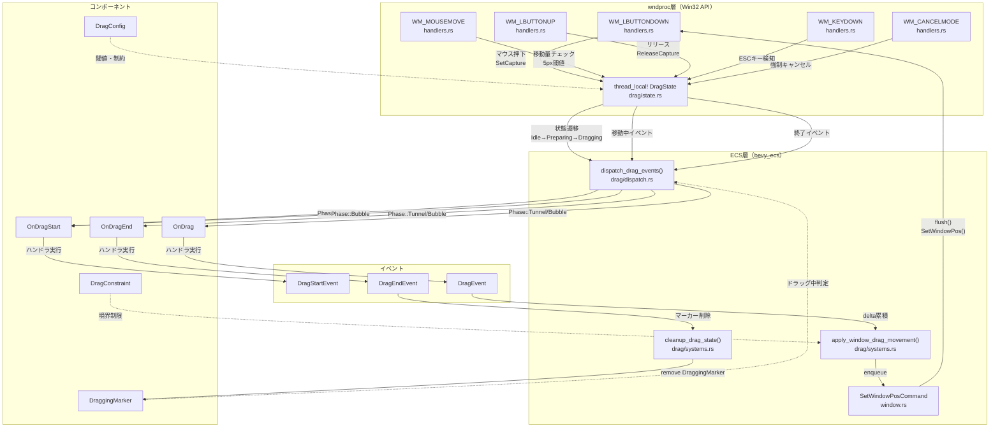
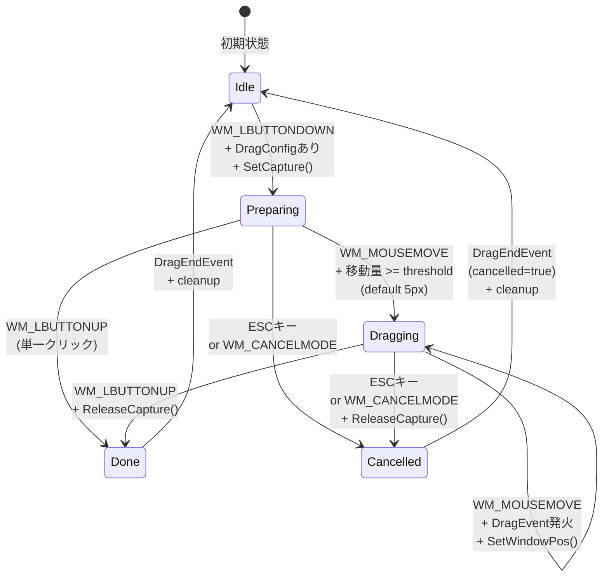
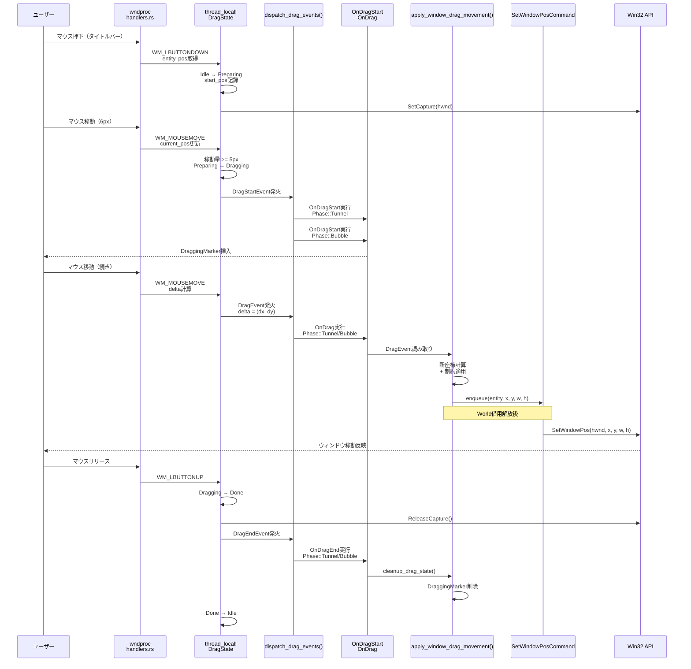
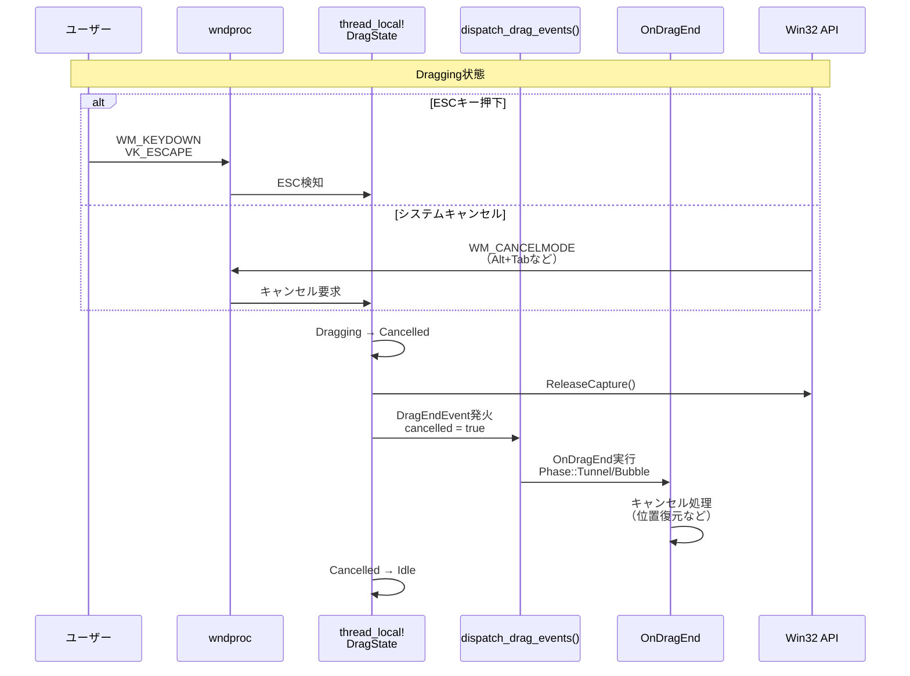

# 設計書: event-drag-system

---
**機能名**: event-drag-system  
**バージョン**: 1.0  
**ステータス**: 設計生成済み  
**最終更新**: 2025-12-08  
**親仕様**: wintf-P0-event-system  
**言語**: ja
**編集者**: AI Design Agent

---

## 概要

### 目的

ポインターイベントシステムの上位抽象化として、ウィンドウのドラッグ移動機能を提供する。wndproc層でマウス入力を監視し、ドラッグ開始の検出（5px移動閾値）、ドラッグ中の継続的な位置追跡、ドラッグ終了（マウスリリース、ESCキー、WM_CANCELMODE）の検知を行う。ECSコンポーネント・イベント・Systemを通じて、アプリケーション層がドラッグ操作に応答できる仕組みを提供する。

本機能は、Windows Tategaki Framework（wintf）の基盤イベントシステムを拡張し、ウィンドウタイトルバーのドラッグ移動をECSパターンで実装する。WinUI3/WPFのルーティングイベントモデルに準じたTunnel/Bubbleの2フェーズイベント伝播により、親ウィジェットでのイベント横取りやキャンセルが可能。Win32 APIのSetCapture/ReleaseCaptureによるマウスキャプチャで、ウィンドウ外への移動時もイベントを受信し、マルチモニター環境でのウィンドウ移動を実現する。

本設計の重要な特性:
- **状態ベース検出**: 単一クリックとドラッグを区別するため、5px移動閾値でIdleからPreparingへ遷移
- **World借用競合回避**: wndproc内でthread_local! DragState管理、SetWindowPosCommandキューで遅延更新
- **型安全なイベント配信**: Phase<T>ジェネリック関数によるDragStartEvent/DragEvent/DragEndEventの統一的配信
- **マルチモニター対応**: 仮想スクリーン座標系（GlobalArrangement.bounds）を使用、負の座標値も正しく処理

### 目標

1. **ウィンドウドラッグ移動の実装** - タイトルバー領域のマウス押下から移動、リリースまでの一貫した動作
2. **ECS統合** - bevy_ecsのコンポーネント・イベント・Systemパターンを用いた疎結合設計
3. **既存パターンの踏襲** - ButtonBuffer（thread_local! + RefCell）、SetWindowPosCommandキュー、Phase<T>配信の流用
4. **拡張可能なアーキテクチャ** - 将来の非ウィンドウ移動型ドラッグ（ファイルD&D、カスタムドラッグ）への基盤提供

### 非目標

1. ファイルドラッグ&ドロップ - 本仕様はウィンドウ移動に限定、OLE D&Dは将来仕様
2. マルチタッチドラッグ - 単一マウスポインターのみ対応、タッチイベントは対象外
3. ドラッグアニメーション - ウィンドウ移動は即座にSetWindowPos、イージングやアニメーションは非目標
4. ユーザー補助機能の自動化 - スクリーンリーダー対応は別仕様で検討
5. 他UI要素のドラッグ - スクロールバー、スプリッター等のドラッグは各要素の責務

## アーキテクチャ

### パターンと境界の地図



### 主要パターン

#### 1. thread_local! + RefCell状態管理（ButtonBufferパターン）

wndproc層でのドラッグ状態管理は、既存ButtonBufferと同じthread_local! + RefCellパターンを使用する。

```rust
thread_local! {
    static DRAG_STATE: RefCell<DragState> = RefCell::new(DragState::Idle);
}

pub enum DragState {
    Idle,
    Preparing {
        entity: Entity,
        start_pos: PhysicalPoint,
        start_time: Instant,
    },
    Dragging {
        entity: Entity,
        start_pos: PhysicalPoint,
        current_pos: PhysicalPoint,
        has_moved: bool,
    },
}
```

**根拠**: wndprocはメインスレッド固定のため、thread_local!で十分。RefCellによる実行時借用チェックでWorld借用と競合しない。既存ButtonBufferと一貫性を保つことで、学習コストを削減。

#### 2. SetWindowPosCommandキューパターン

ウィンドウ位置更新時のWorld借用競合を回避するため、既存SetWindowPosCommandキューを直接使用する。

```rust
// apply_window_drag_movement() System内
for (entity, drag_event) in drag_events.read() {
    let new_x = current_x + drag_event.delta.x;
    let new_y = current_y + drag_event.delta.y;
    
    // World借用中はSetWindowPos不可 → enqueueで遅延実行
    SetWindowPosCommand::enqueue(entity, new_x, new_y, width, height);
}

// System実行後、World借用解放後
SetWindowPosCommand::flush(); // 一括SetWindowPos()
```

**根拠**: window.rsで既に実装済み、動作実績あり。World借用解放後のflush()呼び出しパターンが確立されており、コード重複を排除。

#### 3. Phase<T>ジェネリックイベント配信

既存dispatch_pointer_eventsのロジックをジェネリック関数化し、DragStartEvent/DragEvent/DragEndEventの配信に流用する。

```rust
pub fn dispatch_event<E: Event + Clone>(
    event: E,
    target: Entity,
    world: &mut World,
) {
    let bubble_path = build_bubble_path(target, world);
    
    // Tunnelフェーズ（親→子）
    for entity in bubble_path.iter().rev() {
        if let Some(mut handler) = world.get_mut::<OnEvent<E>>(entity) {
            handler.0(Phase::Tunnel(event.clone()), world);
            if event.is_stopped() { return; }
        }
    }
    
    // Bubbleフェーズ（子→親）
    for entity in bubble_path.iter() {
        if let Some(mut handler) = world.get_mut::<OnEvent<E>>(entity) {
            handler.0(Phase::Bubble(event.clone()), world);
            if event.is_stopped() { return; }
        }
    }
}
```

**根拠**: WinUI3/WPFのルーティングイベントモデルに準拠。既存dispatch_pointer_eventsのTunnel/Bubbleロジックを共通化することで、コード重複を排除し、一貫性を維持。

**実装戦略**: 即座にジェネリック化（Option B採用）
- **Phase 1（最優先タスク）**: pointer/dispatch.rsをジェネリック関数化し、既存PointerEventで動作確認
  - `dispatch_pointer_events()`を`dispatch_event<E>()`に書き換え
  - 既存サンプル（areka.rs、dcomp_demo.rs）でリグレッションテスト実施
  - すべてOKでコミット後、Phase 2へ進む
- **Phase 2**: DragEvent向けに`dispatch_drag_events()`を実装（ジェネリック関数のインスタンス化）
- **互換性保証**: 既存PointerEvent配信の動作を完全保持、型推論エラー発生時は型注釈で解決

### 技術スタック

| カテゴリ | 技術 | バージョン | 用途 | 備考 |
|---------|------|-----------|------|------|
| ECS | bevy_ecs | 0.17.2 | コンポーネント、イベント、System | 既存依存関係 |
| Win32 API | windows crate | 0.62.1 | SetCapture, ReleaseCapture, SetWindowPos | マウスキャプチャとウィンドウ移動 |
| 座標系 | PhysicalPoint | - | 物理ピクセル座標 | DPIスケーリング前の座標 |
| 状態管理 | thread_local! + RefCell | - | DragState管理 | ButtonBufferパターン踏襲 |
| イベント配信 | Phase<T> | - | Tunnel/Bubbleルーティング | ジェネリック関数化 |

### システム設計

#### モジュール構成

```
crates/wintf/src/ecs/drag/
├── mod.rs          # 公開API、型定義、re-exports
├── state.rs        # DragState（thread_local!）、update_drag_state()
├── dispatch.rs     # dispatch_drag_events()、Phase<T>配信
└── systems.rs      # apply_window_drag_movement()、cleanup_drag_state()
```

#### 依存関係

```
drag/mod.rs
├── drag/state.rs (DragState管理)
├── drag/dispatch.rs (イベント配信)
├── drag/systems.rs (ECS Systems)
├── pointer/mod.rs (PhysicalPoint、Phase<T>)
├── window.rs (SetWindowPosCommand)
└── layout/arrangement.rs (GlobalArrangement)
```

## システムフロー

### 状態遷移図



### シーケンス図

#### ドラッグ開始からウィンドウ移動まで



#### キャンセルシーケンス



## 要件トレーサビリティ

| 要件ID | 要件概要 | 設計要素 | 実装場所 | 備考 |
|-------|---------|---------|---------|------|
| Req 1 | ドラッグ状態管理 | DragState enum | drag/state.rs | Idle/Preparing/Dragging/Done/Cancelled |
| Req 2 | ドラッグ開始検出 | update_drag_state() | drag/state.rs | 5px閾値、DragStartEvent発火 |
| Req 3 | ドラッグ中イベント | DragEvent | drag/dispatch.rs | delta、is_primary、timestamp |
| Req 4 | ドラッグ終了検出 | WM_LBUTTONUP処理 | window_proc/handlers.rs | Done状態遷移 |
| Req 5 | ESCキーキャンセル | WM_KEYDOWN処理 | window_proc/handlers.rs | VK_ESCAPE検知、Cancelled遷移 |
| Req 6 | システムキャンセル | WM_CANCELMODE処理 | window_proc/handlers.rs | Cancelled遷移、ReleaseCapture |
| Req 7 | ドラッグ範囲制約 | DragConstraint | drag/mod.rs | min/max_x/y、apply_constraint() |
| Req 8 | 複数モニター対応 | GlobalArrangement | layout/arrangement.rs | 仮想スクリーン座標 |
| Req 9 | 座標変換 | PhysicalPoint | pointer/mod.rs | 物理ピクセル座標系 |
| Req 10 | イベント配信 | dispatch_drag_events() | drag/dispatch.rs | Phase<T> Tunnel/Bubble |
| Req 11 | イベント停止 | Phase<T>.stop_propagation() | pointer/dispatch.rs | 親での横取り可能 |
| Req 12 | ドラッグ中状態 | DraggingMarker | drag/mod.rs | OnDragStartで挿入、OnDragEndで削除 |
| Req 13 | エンティティごと設定 | DragConfig | drag/mod.rs | threshold、enabled |
| Req 14 | ウィンドウ外イベント | SetCapture/ReleaseCapture | window_proc/handlers.rs | マウスキャプチャ |
| NFR 1 | パフォーマンス | thread_local! DragState | drag/state.rs | ロックレス、単一スレッド |
| NFR 2 | 保守性 | モジュール分離 | drag/ | 独立モジュール、既存パターン踏襲 |
| NFR 3 | 拡張性 | Phase<T>ジェネリック | drag/dispatch.rs | 将来のドラッグ型追加可能 |

## コンポーネントとインターフェース

### コンポーネント定義

#### DragConfig
**目的**: エンティティごとのドラッグ設定を保持

```rust
#[derive(Component)]
#[component(storage = "SparseSet")]
pub struct DragConfig {
    /// ドラッグ開始閾値（物理ピクセル）、デフォルト5px
    pub threshold: i32,
    /// ドラッグ有効フラグ
    pub enabled: bool,
}

impl Default for DragConfig {
    fn default() -> Self {
        Self {
            threshold: 5,
            enabled: true,
        }
    }
}
```

**インターフェース契約**:
- `threshold`: 0以上の整数、マウス押下からthresholdピクセル以上移動でドラッグ開始
- `enabled`: falseの場合、ドラッグ検出を無効化

**使用パターン**:
```rust
commands.entity(titlebar_entity)
    .insert(DragConfig {
        threshold: 10, // 高DPI環境で閾値を大きく
        enabled: true,
    });
```

#### DragConstraint
**目的**: ドラッグ移動の範囲制約を定義

```rust
#[derive(Component)]
#[component(storage = "SparseSet")]
pub struct DragConstraint {
    /// X座標の最小値（物理ピクセル、Noneで制約なし）
    pub min_x: Option<i32>,
    /// X座標の最大値（物理ピクセル、Noneで制約なし）
    pub max_x: Option<i32>,
    /// Y座標の最小値（物理ピクセル、Noneで制約なし）
    pub min_y: Option<i32>,
    /// Y座標の最大値（物理ピクセル、Noneで制約なし）
    pub max_y: Option<i32>,
}

impl DragConstraint {
    /// 制約を適用した座標を返す
    pub fn apply(&self, x: i32, y: i32) -> (i32, i32) {
        let x = self.min_x.map_or(x, |min| x.max(min));
        let x = self.max_x.map_or(x, |max| x.min(max));
        let y = self.min_y.map_or(y, |min| y.max(min));
        let y = self.max_y.map_or(y, |max| y.min(max));
        (x, y)
    }
}
```

**使用パターン**:
```rust
// プライマリモニター内に制約
commands.entity(window_entity)
    .insert(DragConstraint {
        min_x: Some(0),
        max_x: Some(primary_monitor_width),
        min_y: Some(0),
        max_y: Some(primary_monitor_height),
    });
```

#### OnDragStart
**目的**: ドラッグ開始イベントハンドラ

```rust
#[derive(Component)]
#[component(storage = "SparseSet")]
pub struct OnDragStart(pub Box<dyn Fn(Phase<DragStartEvent>, &mut World) + Send + Sync>);
```

**使用パターン**:
```rust
commands.entity(titlebar_entity)
    .insert(OnDragStart(Box::new(|event, world| {
        if let Phase::Bubble(e) = event {
            println!("Drag started at {:?}", e.position);
            // DraggingMarker挿入は自動
        }
    })));
```

#### OnDrag
**目的**: ドラッグ中イベントハンドラ

```rust
#[derive(Component)]
#[component(storage = "SparseSet")]
pub struct OnDrag(pub Box<dyn Fn(Phase<DragEvent>, &mut World) + Send + Sync>);
```

**使用パターン**:
```rust
commands.entity(titlebar_entity)
    .insert(OnDrag(Box::new(|event, world| {
        if let Phase::Bubble(e) = event {
            // ウィンドウ移動はapply_window_drag_movement()で自動処理
            // カスタムロジック（例: ドロップターゲット強調）はここで実装
        }
    })));
```

#### OnDragEnd
**目的**: ドラッグ終了イベントハンドラ

```rust
#[derive(Component)]
#[component(storage = "SparseSet")]
pub struct OnDragEnd(pub Box<dyn Fn(Phase<DragEndEvent>, &mut World) + Send + Sync>);
```

**使用パターン**:
```rust
commands.entity(titlebar_entity)
    .insert(OnDragEnd(Box::new(|event, world| {
        if let Phase::Bubble(e) = event {
            if e.cancelled {
                println!("Drag cancelled");
                // 位置復元などキャンセル処理
            } else {
                println!("Drag completed");
            }
            // DraggingMarker削除は自動
        }
    })));
```

#### DraggingMarker
**目的**: ドラッグ中のエンティティを識別

```rust
#[derive(Component)]
#[component(storage = "SparseSet")]
pub struct DraggingMarker;
```

**使用パターン**:
- OnDragStart実行時に自動挿入
- OnDragEnd実行時に自動削除
- `Query<Entity, With<DraggingMarker>>`でドラッグ中エンティティ取得可能

### イベント定義

#### DragStartEvent
**目的**: ドラッグ開始を通知

```rust
#[derive(Event, Clone, Debug)]
pub struct DragStartEvent {
    /// ドラッグ対象エンティティ
    pub target: Entity,
    /// ドラッグ開始位置（物理ピクセル、スクリーン座標）
    pub position: PhysicalPoint,
    /// 左ボタンドラッグかどうか
    pub is_primary: bool,
    /// イベント発生時刻
    pub timestamp: Instant,
}
```

**発火タイミング**: Preparing状態でマウス移動量がthreshold以上に達した時

#### DragEvent
**目的**: ドラッグ中の移動を通知

```rust
#[derive(Event, Clone, Debug)]
pub struct DragEvent {
    /// ドラッグ対象エンティティ
    pub target: Entity,
    /// 前回位置からの移動量（物理ピクセル）
    pub delta: PhysicalPoint,
    /// 現在位置（物理ピクセル、スクリーン座標）
    pub position: PhysicalPoint,
    /// 左ボタンドラッグかどうか
    pub is_primary: bool,
    /// イベント発生時刻
    pub timestamp: Instant,
}
```

**発火タイミング**: Dragging状態でWM_MOUSEMOVEを受信した時

#### DragEndEvent
**目的**: ドラッグ終了を通知

```rust
#[derive(Event, Clone, Debug)]
pub struct DragEndEvent {
    /// ドラッグ対象エンティティ
    pub target: Entity,
    /// 終了位置（物理ピクセル、スクリーン座標）
    pub position: PhysicalPoint,
    /// キャンセルされたかどうか（ESCキー、WM_CANCELMODE）
    pub cancelled: bool,
    /// 左ボタンドラッグかどうか
    pub is_primary: bool,
    /// イベント発生時刻
    pub timestamp: Instant,
}
```

**発火タイミング**: WM_LBUTTONUP、ESCキー、WM_CANCELMODE受信時

### System定義

#### dispatch_drag_events
**目的**: DragStateからイベントを生成しPhase<T>配信

```rust
pub fn dispatch_drag_events(world: &mut World) {
    DRAG_STATE.with(|state| {
        let state = state.borrow();
        match *state {
            DragState::Dragging { entity, current_pos, .. } => {
                let event = DragEvent {
                    target: entity,
                    delta: calculate_delta(current_pos),
                    position: current_pos,
                    is_primary: true,
                    timestamp: Instant::now(),
                };
                dispatch_event(event, entity, world);
            }
            // DragStartEvent、DragEndEventも同様
            _ => {}
        }
    });
}
```

**実行タイミング**: 毎フレーム、ポインターイベント処理後

#### apply_window_drag_movement
**目的**: DragEventからウィンドウ位置を更新

```rust
pub fn apply_window_drag_movement(
    mut drag_events: EventReader<DragEvent>,
    windows: Query<(&Window, Option<&DragConstraint>)>,
) {
    for event in drag_events.read() {
        if let Ok((window, constraint)) = windows.get(event.target) {
            let new_x = window.position.x + event.delta.x;
            let new_y = window.position.y + event.delta.y;
            
            let (constrained_x, constrained_y) = constraint
                .map(|c| c.apply(new_x, new_y))
                .unwrap_or((new_x, new_y));
            
            SetWindowPosCommand::enqueue(
                event.target,
                constrained_x,
                constrained_y,
                window.size.width,
                window.size.height,
            );
        }
    }
}
```

**実行タイミング**: dispatch_drag_events後、SetWindowPosCommand::flush前

#### cleanup_drag_state
**目的**: ドラッグ終了時にDraggingMarkerを削除

```rust
pub fn cleanup_drag_state(
    mut commands: Commands,
    mut drag_end_events: EventReader<DragEndEvent>,
) {
    for event in drag_end_events.read() {
        commands.entity(event.target).remove::<DraggingMarker>();
    }
}
```

**実行タイミング**: DragEndEvent受信後

## データモデル

### 状態管理

#### DragState（thread_local!）

```rust
pub enum DragState {
    /// アイドル状態、ドラッグなし
    Idle,
    
    /// マウス押下済み、閾値未到達
    Preparing {
        /// ドラッグ対象エンティティ
        entity: Entity,
        /// マウス押下位置（物理ピクセル、スクリーン座標）
        start_pos: PhysicalPoint,
        /// 押下時刻（タイムアウト用、将来拡張）
        start_time: Instant,
    },
    
    /// ドラッグ中、閾値到達済み
    Dragging {
        /// ドラッグ対象エンティティ
        entity: Entity,
        /// ドラッグ開始位置（DragStartEvent発火時の位置）
        start_pos: PhysicalPoint,
        /// 現在位置（最新WM_MOUSEMOVEの位置）
        current_pos: PhysicalPoint,
        /// 移動フラグ（単一クリックとの区別）
        has_moved: bool,
    },
}
```

**状態遷移ルール**:
1. `Idle → Preparing`: WM_LBUTTONDOWN + DragConfigあり + SetCapture成功
2. `Preparing → Dragging`: WM_MOUSEMOVE + 移動量 >= threshold
3. `Preparing → Idle`: WM_LBUTTONUP（単一クリック）
4. `Dragging → Idle`: WM_LBUTTONUP + ReleaseCapture + DragEndEvent発火
5. `Preparing/Dragging → Idle`: ESCキー or WM_CANCELMODE + ReleaseCapture + DragEndEvent（cancelled=true）

**DragState設計の根拠**:

**単一状態の理由**: Requirement 1.7「同時複数ボタンドラッグ禁止」に対応するため、DragStateはthread_local!の単一状態として実装する。あるドラッグの発動中（Preparing/Dragging状態）は、他のマウスボタン押下によるドラッグ開始を拒否する。

**ButtonBufferとの差異**:
- **ButtonBuffer** (`HashMap<(Entity, PointerButton), ButtonBuffer>`): ボタンごとの押下/解放状態を記録、複数ボタン同時管理可能
- **DragState** (単一状態): アクティブなドラッグ1つのみを管理
- ButtonBufferはクリック検出用の状態記録、DragStateはドラッグ操作の状態機械

**複数ボタン同時押下時の動作**:
1. 左ボタンでドラッグ中（`DragState::Dragging`）
2. 右ボタン押下（`WM_RBUTTONDOWN`）を受信
3. `update_drag_state()`内で既にPreparing/Dragging状態であることを検知
4. 早期リターンで右ボタンのドラッグ開始を拒否
5. 左ボタンのドラッグは継続、右ボタンのButtonBufferは通常通り更新（クリック検出用）

### 座標系

#### PhysicalPoint
**定義**: 物理ピクセル座標（DPIスケーリング前）

```rust
#[derive(Clone, Copy, Debug, PartialEq, Eq)]
pub struct PhysicalPoint {
    pub x: i32,
    pub y: i32,
}
```

**用途**:
- wndproc層でのマウス座標（lParam下位16bit/上位16bit）
- SetWindowPosの引数
- GlobalArrangement.boundsの単位

**座標系の整合性**:
- WM_MOUSEMOVE: スクリーン座標（仮想スクリーン座標系）
- GlobalArrangement.bounds: 仮想スクリーン座標系（マルチモニター対応）
- SetWindowPos: 仮想スクリーン座標系を受け付ける
- 負の座標値も正しく処理（プライマリモニタより左/上のモニタ）

### イベントデータフロー

```
WM_LBUTTONDOWN (hwnd, lParam)
  ↓
hit_test(PhysicalPoint) → Entity
  ↓
DragState::Preparing { entity, start_pos }
  ↓ (threshold到達)
DragStartEvent { target, position }
  ↓ Phase::Tunnel
OnDragStart handlers
  ↓ Phase::Bubble
OnDragStart handlers
  ↓ (DraggingMarker挿入)

WM_MOUSEMOVE (hwnd, lParam)
  ↓
DragState::Dragging { current_pos更新 }
  ↓
DragEvent { target, delta, position }
  ↓ Phase::Tunnel/Bubble
OnDrag handlers
  ↓
apply_window_drag_movement()
  ↓
SetWindowPosCommand::enqueue()
  ↓ (World借用解放後)
SetWindowPosCommand::flush()
  ↓
Win32 SetWindowPos()

WM_LBUTTONUP (hwnd, lParam)
  ↓
DragState::Idle
  ↓
ReleaseCapture()
  ↓
DragEndEvent { target, position, cancelled=false }
  ↓ Phase::Tunnel/Bubble
OnDragEnd handlers
  ↓
cleanup_drag_state()
  ↓
DraggingMarker削除
```

## テスト戦略

### 単体テスト

#### drag/state.rs
- `DragState::Idle → Preparing遷移`: DragConfigあり、SetCapture成功
- `Preparing → Dragging遷移`: 5px閾値到達
- `Preparing → Idle遷移`: 閾値未到達でWM_LBUTTONUP（単一クリック）
- `Dragging → Idle遷移`: WM_LBUTTONUP、ReleaseCapture
- `ESCキャンセル`: Preparing/DraggingからIdle、ReleaseCapture
- `WM_CANCELMODE処理`: Dragging → Idle、ReleaseCapture

#### drag/dispatch.rs
- `DragStartEvent Phase::Tunnel`: 親→子の順序
- `DragEvent Phase::Bubble`: 子→親の順序
- `stop_propagation()`: イベント伝播停止
- `DragEndEvent配信`: cancelled=true/false

#### drag/systems.rs
- `apply_window_drag_movement`: delta累積、制約適用
- `cleanup_drag_state`: DraggingMarker削除

### 統合テスト

#### tests/drag_integration.rs
- **シナリオ1: 正常ドラッグ**
  1. WM_LBUTTONDOWN → Preparing
  2. WM_MOUSEMOVE (6px) → Dragging、DragStartEvent
  3. WM_MOUSEMOVE (続き) → DragEvent連続発火
  4. WM_LBUTTONUP → DragEndEvent、Idle
  5. ウィンドウ位置が更新されている

- **シナリオ2: 単一クリック**
  1. WM_LBUTTONDOWN → Preparing
  2. WM_MOUSEMOVE (2px、閾値未満)
  3. WM_LBUTTONUP → Idle
  4. DragStartEvent発火しない

- **シナリオ3: ESCキャンセル**
  1. WM_LBUTTONDOWN → Preparing
  2. WM_MOUSEMOVE (6px) → Dragging、DragStartEvent
  3. WM_KEYDOWN (VK_ESCAPE) → DragEndEvent(cancelled=true)、Idle
  4. ReleaseCapture呼び出し確認

- **シナリオ4: WM_CANCELMODE**
  1. Dragging状態
  2. WM_CANCELMODE受信 → DragEndEvent(cancelled=true)、Idle
  3. ReleaseCapture呼び出し確認

- **シナリオ5: ドラッグ制約**
  1. DragConstraint { min_x: 0, max_x: 1920 }
  2. ウィンドウをx=-100方向へドラッグ
  3. ウィンドウ位置がx=0でクリップされる

- **シナリオ6: マルチモニター**
  1. プライマリモニタ(0,0)～(1920,1080)
  2. セカンダリモニタ(-1920,0)～(0,1080)
  3. ウィンドウをx=-100へドラッグ
  4. 負の座標値が正しく処理される

### パフォーマンステスト

- **WM_MOUSEMOVE頻度**: 125Hz（8ms間隔）でも1フレーム1ms以内に処理
- **DragEvent処理**: EventReader<DragEvent>が100件/秒でも遅延なし
- **SetWindowPosCommand flush**: 10ウィンドウ同時ドラッグでも60fps維持

### 受け入れテスト

| 要件ID | テスト項目 | 期待結果 | 備考 |
|-------|-----------|---------|------|
| Req 2 | ドラッグ開始閾値 | 5px移動後DragStartEvent発火 | 物理ピクセル |
| Req 4 | ドラッグ終了 | マウスリリースでDragEndEvent | cancelled=false |
| Req 5 | ESCキャンセル | ESCキーでDragEndEvent | cancelled=true |
| Req 6 | システムキャンセル | WM_CANCELMODEでDragEndEvent | cancelled=true |
| Req 7 | ドラッグ制約 | DragConstraint範囲内に制限 | min/max座標 |
| Req 8 | マルチモニター | 負の座標値で正しく動作 | 仮想スクリーン座標 |
| Req 11 | イベント停止 | 親でstop_propagation()、子に伝播しない | Phase::Tunnel |
| Req 14 | ウィンドウ外イベント | SetCapture中、ウィンドウ外でもDragEvent | マウスキャプチャ |
| NFR 1 | パフォーマンス | 125Hz WM_MOUSEMOVEで1ms以内 | thread_local! |

## セキュリティとエラー処理

### エラーハンドリング

#### SetCapture失敗
- **シナリオ**: 他ウィンドウが既にキャプチャ中
- **対応**: SetCapture()のNULL戻り値をチェック、Preparing遷移を中止、ユーザーにエラー通知しない（サイレント失敗）

#### ReleaseCapture失敗
- **シナリオ**: システムが既にキャプチャ解放済み
- **対応**: ReleaseCapture()は失敗しても無視、状態をIdleに遷移

#### hit_test失敗
- **シナリオ**: マウス座標にエンティティが存在しない
- **対応**: Preparing遷移を中止、ドラッグ検出しない

#### World借用競合
- **シナリオ**: System実行中にSetWindowPos呼び出し
- **対応**: SetWindowPosCommandキューで遅延実行、flush()で一括処理

### セキュリティ考慮事項

- **入力検証**: PhysicalPointのx/y座標は符号付き32bit整数、オーバーフロー不可
- **権限**: SetWindowPos、SetCapture/ReleaseCaptureは同一プロセスのウィンドウのみ操作可能
- **スレッド安全性**: thread_local! DragStateはメインスレッド専用、他スレッドからアクセス不可

## 既知の制約と将来の拡張

### 既知の制約

1. **単一ドラッグのみ**: 同時に複数エンティティのドラッグ不可（thread_local! DragStateが単一状態）
2. **左ボタンのみ**: 右ボタン、中ボタンドラッグは非対応
3. **マルチタッチ非対応**: WM_POINTERイベントは処理しない
4. **DPI係数固定**: ドラッグ閾値は物理ピクセル固定、DPI係数を乗算する機能なし

### 将来の拡張可能性

#### Phase 2: ファイルドラッグ&ドロップ
- 新規イベント: `FileDragEvent`、`FileDropEvent`
- OLE D&D統合: `IDropTarget`、`IDataObject`実装
- 既存dispatch_event<T>()をそのまま流用可能

#### Phase 3: カスタムドラッグ（例: スクロールバー、スプリッター）
- 新規コンポーネント: `CustomDragHandler`
- ウィンドウ移動以外のドラッグロジックをOnDragハンドラに実装
- apply_window_drag_movement()をスキップする仕組み追加

#### Phase 4: マルチドラッグ
- thread_local! DragStateを`Vec<DragState>`に変更
- 各ドラッグに一意IDを付与
- イベント配信時にID指定

#### Phase 5: DPI考慮ドラッグ閾値
- DragConfig.thresholdを論理ピクセル単位に変更
- GlobalArrangement.transformのDPI係数を乗算
- 高DPI環境でも体感閾値を一定に保つ

## 付録

### 参考資料

- [SetCapture function (Microsoft Docs)](https://learn.microsoft.com/en-us/windows/win32/api/winuser/nf-winuser-setcapture)
- [ReleaseCapture function (Microsoft Docs)](https://learn.microsoft.com/en-us/windows/win32/api/winuser/nf-winuser-releasecapture)
- [SetWindowPos function (Microsoft Docs)](https://learn.microsoft.com/en-us/windows/win32/api/winuser/nf-winuser-setwindowpos)
- [Multiple Display Monitors (Microsoft Docs)](https://learn.microsoft.com/en-us/windows/win32/gdi/multiple-display-monitors)
- [bevy_ecs Documentation](https://docs.rs/bevy_ecs/latest/bevy_ecs/)
- 親仕様: `.kiro/specs/wintf-P0-event-system/requirements.md`
- Gap分析: `.kiro/specs/event-drag-system/gap-analysis.md`
- 要件定義: `.kiro/specs/event-drag-system/requirements.md`

### 用語集

| 用語 | 定義 |
|------|------|
| wndproc | Window Procedure、Win32メッセージハンドラ |
| ECS | Entity Component System、bevy_ecsの基盤アーキテクチャ |
| Phase<T> | Tunnel/Bubbleの2フェーズイベント伝播パターン |
| PhysicalPoint | 物理ピクセル座標、DPIスケーリング前 |
| GlobalArrangement | 仮想スクリーン座標系での矩形配置情報 |
| SetCapture | マウス入力を特定ウィンドウにキャプチャするWin32 API |
| SetWindowPos | ウィンドウ位置・サイズを変更するWin32 API |
| thread_local! | スレッドローカルストレージのRustマクロ |
| RefCell | 実行時借用チェックを行うRust標準ライブラリ型 |

### 変更履歴

| 日付 | バージョン | 変更内容 | 編集者 |
|------|-----------|---------|--------|
| 2025-12-08 | 1.0 | 初版作成 | AI Design Agent |
