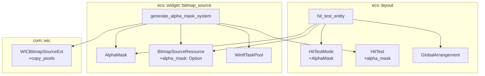
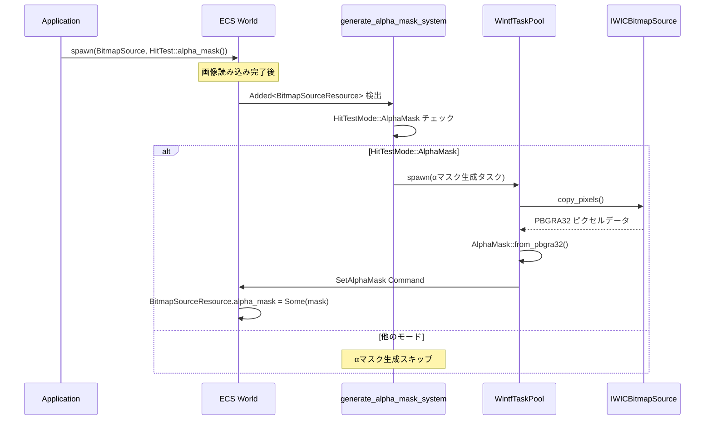
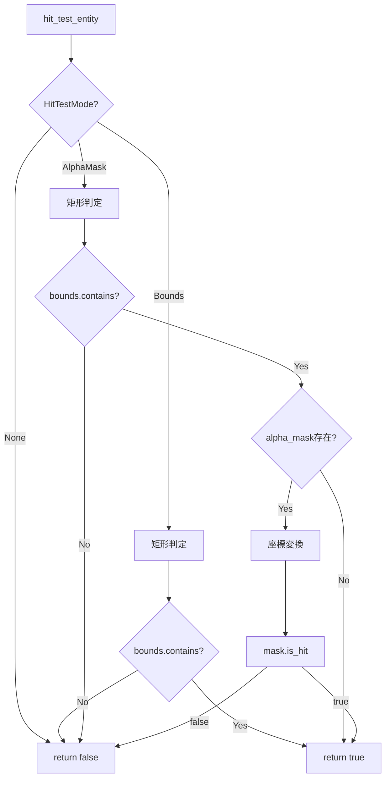
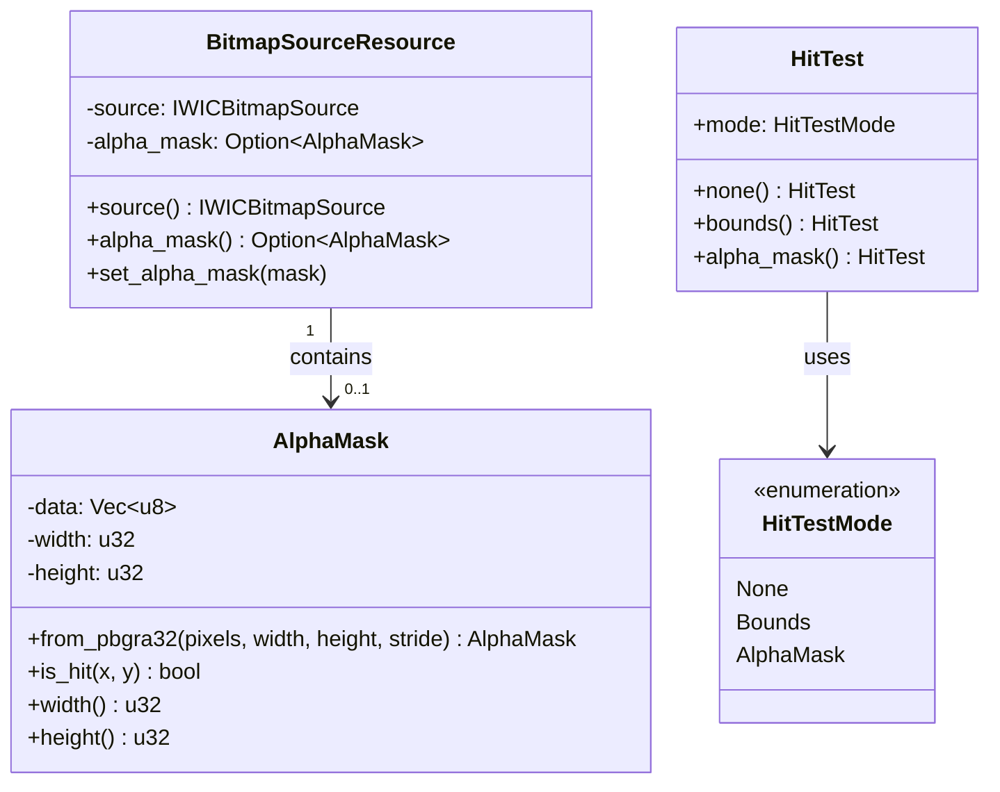

# Design Document

| 項目 | 内容 |
|------|------|
| **Document Title** | event-hit-test-alpha-mask 設計書 |
| **Version** | 1.0 |
| **Date** | 2025-12-05 |
| **Parent Spec** | event-hit-test |
| **Requirements** | event-hit-test-alpha-mask/requirements.md v1.0 |

---

## Overview

**Purpose**: 画像のαチャンネルを使用したピクセル単位のヒットテスト機能を提供し、透明部分をクリック透過させる。

**Users**: デスクトップマスコットアプリケーション開発者が、キャラクター画像の透明部分をクリック透過させるために使用する。

**Impact**: 
- `ecs::layout::hit_test.rs` に `HitTestMode::AlphaMask` バリアントと判定ロジックを追加
- `ecs::widget::bitmap_source` に `AlphaMask` 構造体と生成システムを追加
- `com/wic.rs` に `CopyPixels` APIラッパーを追加

### Goals

- αチャンネルに基づくピクセル単位ヒットテスト
- 非同期αマスク生成による応答性確保
- 既存APIとの後方互換性維持
- メモリ効率の良いビットパック形式

### Non-Goals

- カスタマイズ可能な閾値（固定値128 = 50%）
- 多角形・カスタム形状によるヒットテスト
- 名前付きヒット領域

---

## Architecture

### Existing Architecture Analysis

**親仕様 event-hit-test の構成**:
- `ecs/layout/hit_test.rs`: `HitTestMode`, `HitTest`, `hit_test_entity`, `hit_test`, `hit_test_in_window`
- `HitTestMode::Bounds` による矩形判定
- `GlobalArrangement.bounds` を使用した座標判定

**BitmapSource ウィジェット**:
- `ecs/widget/bitmap_source/`: 非同期画像読み込み、WIC統合
- `BitmapSourceResource`: WIC BitmapSource保持
- `WintfTaskPool`: 非同期コマンド実行

### Architecture Pattern & Boundary Map



**Architecture Integration**:
- **Selected pattern**: ハイブリッド（新規 `alpha_mask.rs` + 既存モジュール拡張）
- **Domain boundaries**: 
  - `AlphaMask` データ構造: `ecs::widget::bitmap_source`（WICリソースと関連）
  - ヒット判定ロジック: `ecs::layout::hit_test`（既存API拡張）
- **Existing patterns preserved**: 
  - 非同期Command パターン（`WintfTaskPool`）
  - ECS クエリパターン（`Added`, `Changed`）
- **New components rationale**: 
  - `AlphaMask`: ビットパックデータ構造として独立ファイルで責務分離
  - `WICBitmapSourceExt`: 再利用可能なWIC拡張trait
- **Steering compliance**: レイヤード分離（layout → widget → com）を維持

### Technology Stack

| Layer | Choice / Version | Role in Feature | Notes |
|-------|------------------|-----------------|-------|
| ECS | bevy_ecs 0.17.2 | コンポーネント管理、クエリ | `Added`, `Changed` 使用 |
| Graphics | windows 0.62.1 | WIC CopyPixels API | PBGRA32ピクセル取得 |
| Layout | ecs::layout 既存 | HitTest拡張 | 後方互換性維持 |
| Async | WintfTaskPool 既存 | αマスク非同期生成 | 既存パターン流用 |

---

## System Flows

### αマスク生成フロー



**Key Decisions**:
- `Added<BitmapSourceResource>` で新規追加を検出
- `HitTestMode::AlphaMask` の場合のみ生成
- 非同期実行で応答性確保
- 生成完了までは `Bounds` フォールバック

### ヒット判定フロー



**Key Decisions**:
- 二段階判定（矩形 → αマスク）で効率化
- `alpha_mask = None` の場合は矩形判定にフォールバック
- 座標変換でスケーリング対応

---

## Requirements Traceability

| Requirement | Summary | Components | Interfaces | Flows |
|-------------|---------|------------|------------|-------|
| 1 | HitTestMode拡張 | HitTestMode, HitTest | `alpha_mask()` | - |
| 2 | AlphaMaskデータ構造 | AlphaMask, BitmapSourceResource | `is_hit()`, `alpha_mask()` | - |
| 3 | BitmapSource統合 | generate_alpha_mask_system | - | αマスク生成フロー |
| 4 | ピクセル単位判定 | AlphaMask | `is_hit()` | ヒット判定フロー |
| 5 | hit_test関数拡張 | hit_test_entity | - | ヒット判定フロー |
| 6 | HitTest API | HitTest | `alpha_mask()` | - |

---

## Components and Interfaces

### Summary

| Component | Domain/Layer | Intent | Req Coverage | Key Dependencies | Contracts |
|-----------|--------------|--------|--------------|------------------|-----------|
| HitTestMode | ecs::layout | ヒットテストモード列挙 | 1 | - | - |
| HitTest | ecs::layout | ヒットテスト設定 | 1, 6 | HitTestMode | - |
| AlphaMask | ecs::widget::bitmap_source | ビットパックマスクデータ | 2, 4 | - | Service |
| BitmapSourceResource | ecs::widget::bitmap_source | WIC+αマスク保持 | 2 | AlphaMask | - |
| generate_alpha_mask_system | ecs::widget::bitmap_source | αマスク非同期生成 | 3 | WintfTaskPool (P0), WICBitmapSourceExt (P0) | - |
| hit_test_entity | ecs::layout | 単一エンティティ判定 | 4, 5 | AlphaMask (P1), BitmapSourceResource (P1) | Service |
| WICBitmapSourceExt | com::wic | WIC拡張trait | 3 | IWICBitmapSource | Service |

### ecs::layout

#### HitTestMode（拡張）

| Field | Detail |
|-------|--------|
| Intent | ヒットテスト動作モードに `AlphaMask` を追加 |
| Requirements | 1 |

**Responsibilities & Constraints**
- 既存バリアント（`None`, `Bounds`）の動作を維持
- `AlphaMask` バリアントを追加

**Contracts**: 該当なし（データ型のみ）

```rust
/// ヒットテストの動作モード
#[derive(Debug, Clone, Copy, PartialEq, Eq, Default)]
pub enum HitTestMode {
    /// ヒットテスト対象外（マウスイベントを透過）
    None,
    /// バウンディングボックス（GlobalArrangement.bounds）でヒットテスト
    #[default]
    Bounds,
    /// αマスクによるピクセル単位ヒットテスト
    AlphaMask,
}
```

---

#### HitTest（拡張）

| Field | Detail |
|-------|--------|
| Intent | `alpha_mask()` コンストラクタを追加 |
| Requirements | 1, 6 |

**Responsibilities & Constraints**
- 既存メソッド（`none()`, `bounds()`）の動作を維持
- `alpha_mask()` メソッドを追加

**Contracts**: 該当なし（データコンポーネント）

```rust
impl HitTest {
    /// αマスクモードでヒットテスト
    pub fn alpha_mask() -> Self {
        Self { mode: HitTestMode::AlphaMask }
    }
}
```

---

#### hit_test_entity（拡張）

| Field | Detail |
|-------|--------|
| Intent | `AlphaMask` 分岐を追加し、ピクセル単位判定を実行 |
| Requirements | 4, 5 |

**Responsibilities & Constraints**
- `HitTestMode::AlphaMask` の場合、二段階判定を実行
- `alpha_mask` が `None` の場合は `Bounds` フォールバック
- 座標変換でスケーリング対応

**Dependencies**
- Outbound: BitmapSourceResource — αマスク取得 (P1)
- Outbound: AlphaMask — ピクセル判定 (P1)

**Contracts**: Service ✓

##### Service Interface

```rust
/// 単一エンティティのヒットテスト（AlphaMask対応拡張）
///
/// # AlphaMask判定
/// 1. 矩形判定（早期リターン）
/// 2. BitmapSourceResource.alpha_mask 取得
/// 3. 座標変換（スクリーン → マスク座標）
/// 4. AlphaMask.is_hit() 呼び出し
///
/// # フォールバック
/// - alpha_mask が None の場合は矩形判定と同等
pub fn hit_test_entity(world: &World, entity: Entity, point: PhysicalPoint) -> bool;
```

**Implementation Notes**
- 既存の `Bounds` 分岐に `AlphaMask` 分岐を追加
- `world.get::<BitmapSourceResource>(entity)` でαマスク取得
- 座標変換: `(point - bounds.origin) / bounds.size * mask.size`

---

### ecs::widget::bitmap_source

#### AlphaMask

| Field | Detail |
|-------|--------|
| Intent | ビットパック形式のαマスクデータを保持し、高速なヒット判定を提供 |
| Requirements | 2, 4 |

**Responsibilities & Constraints**
- 1ビット/ピクセルでマスクデータを保持
- 閾値128（50%）で固定（セキュリティ要件）
- 座標範囲チェック付きの `is_hit()` 提供

**Dependencies**: なし

**Contracts**: Service ✓

##### Service Interface

```rust
/// αマスクデータ構造
/// 
/// 配置: `BitmapSourceResource.alpha_mask: Option<AlphaMask>`
#[derive(Debug, Clone)]
pub struct AlphaMask {
    data: Vec<u8>,
    width: u32,
    height: u32,
}

/// 固定閾値（セキュリティ要件）
const ALPHA_THRESHOLD: u8 = 128;

impl AlphaMask {
    /// PBGRA32ピクセルデータからαマスクを生成
    ///
    /// # Arguments
    /// - `pixels`: PBGRA32形式のピクセルデータ
    /// - `width`: 画像幅（ピクセル）
    /// - `height`: 画像高さ（ピクセル）
    /// - `stride`: 行あたりのバイト数
    ///
    /// # Returns
    /// 生成されたαマスク
    pub fn from_pbgra32(pixels: &[u8], width: u32, height: u32, stride: u32) -> Self;

    /// 指定座標がヒット対象かを判定
    ///
    /// # Returns
    /// - `true`: α ≧ 128 のピクセル（ヒット対象）
    /// - `false`: α < 128 または範囲外
    pub fn is_hit(&self, x: u32, y: u32) -> bool;

    /// マスク幅を取得
    pub fn width(&self) -> u32;

    /// マスク高さを取得
    pub fn height(&self) -> u32;
}
```

- Preconditions: 
  - `from_pbgra32`: pixels.len() >= height * stride
- Postconditions:
  - `is_hit`: 範囲外は常に `false`
- Invariants:
  - data.len() == ((width + 7) / 8) * height

---

#### BitmapSourceResource（拡張）

| Field | Detail |
|-------|--------|
| Intent | αマスクを `Option<AlphaMask>` として保持 |
| Requirements | 2 |

**Responsibilities & Constraints**
- 既存の `source: IWICBitmapSource` を維持
- `alpha_mask: Option<AlphaMask>` フィールドを追加
- αマスク設定用の `set_alpha_mask()` メソッドを追加

**Contracts**: 該当なし（データコンポーネント）

```rust
/// CPU側画像リソース（WIC BitmapSource + αマスク）
#[derive(Component)]
pub struct BitmapSourceResource {
    source: IWICBitmapSource,
    alpha_mask: Option<AlphaMask>,
}

impl BitmapSourceResource {
    /// αマスクへの参照を取得
    pub fn alpha_mask(&self) -> Option<&AlphaMask> {
        self.alpha_mask.as_ref()
    }

    /// αマスクを設定（非同期生成完了時に呼び出し）
    pub fn set_alpha_mask(&mut self, mask: AlphaMask) {
        self.alpha_mask = Some(mask);
    }
}
```

---

#### generate_alpha_mask_system

| Field | Detail |
|-------|--------|
| Intent | `HitTest::alpha_mask()` 設定時にαマスクを非同期生成 |
| Requirements | 3 |

**Responsibilities & Constraints**
- `Added<BitmapSourceResource>` + `With<HitTest>` でトリガー
- `HitTestMode::AlphaMask` の場合のみ生成
- `WintfTaskPool` で非同期実行
- 生成完了時に `BitmapSourceResource.alpha_mask` を設定

**Dependencies**
- Outbound: WintfTaskPool — 非同期実行 (P0)
- Outbound: WICBitmapSourceExt — ピクセル取得 (P0)
- Outbound: BitmapSourceResource — αマスク設定 (P0)

**Contracts**: 該当なし（ECSシステム）

```rust
/// αマスク生成システム
///
/// # Trigger
/// - BitmapSourceResource が追加され、かつ HitTest コンポーネントが存在
/// - HitTestMode::AlphaMask の場合のみ実行
///
/// # Flow
/// 1. WIC BitmapSource からピクセルデータを取得
/// 2. AlphaMask::from_pbgra32() でマスク生成
/// 3. Command 経由で BitmapSourceResource.alpha_mask に設定
pub fn generate_alpha_mask_system(
    query: Query<(Entity, &BitmapSourceResource, &HitTest), Added<BitmapSourceResource>>,
    task_pool: Res<WintfTaskPool>,
);
```

**Implementation Notes**
- `HitTestMode::AlphaMask` 以外はスキップ
- `IWICBitmapSource` は Send なので TaskPool に渡せる
- 生成失敗時はログ出力のみ（Bounds フォールバック）

---

### com::wic

#### WICBitmapSourceExt（新規）

| Field | Detail |
|-------|--------|
| Intent | `IWICBitmapSource` にピクセル取得機能を追加 |
| Requirements | 3 |

**Responsibilities & Constraints**
- `get_size()`: 画像サイズ取得
- `copy_pixels()`: ピクセルデータをバッファにコピー

**Dependencies**
- External: IWICBitmapSource — Windows WIC API (P0)

**Contracts**: Service ✓

##### Service Interface

```rust
/// IWICBitmapSource 拡張トレイト
pub trait WICBitmapSourceExt {
    /// 画像サイズを取得
    fn get_size(&self) -> Result<(u32, u32)>;

    /// ピクセルデータをバッファにコピー
    ///
    /// # Arguments
    /// - `rect`: コピー対象の矩形（Noneで全体）
    /// - `stride`: 行あたりのバイト数
    /// - `buffer`: 出力バッファ
    fn copy_pixels(
        &self,
        rect: Option<&WICRect>,
        stride: u32,
        buffer: &mut [u8],
    ) -> Result<()>;
}

impl WICBitmapSourceExt for IWICBitmapSource {
    fn get_size(&self) -> Result<(u32, u32)> {
        let mut width = 0u32;
        let mut height = 0u32;
        unsafe { self.GetSize(&mut width, &mut height)?; }
        Ok((width, height))
    }

    fn copy_pixels(
        &self,
        rect: Option<&WICRect>,
        stride: u32,
        buffer: &mut [u8],
    ) -> Result<()> {
        unsafe {
            self.CopyPixels(
                rect.map(|r| r as *const _),
                stride,
                buffer,
            )
        }
    }
}
```

---

## Data Models

### Domain Model



**Business Rules & Invariants**:
- `AlphaMask.data.len() == ((width + 7) / 8) * height`
- `AlphaMask` は閾値128固定（セキュリティ要件）
- `alpha_mask = None` の場合は矩形判定にフォールバック

### Logical Data Model

**AlphaMask ビットパック形式**:
- 1ビット/ピクセル（8ピクセル/バイト）
- 行ごとに8ピクセル単位でアラインメント
- MSBファースト（ビット7 = 最左ピクセル）
- メモリ: 1000x1000画像で約125KB

```
行幅 = (width + 7) / 8  // バイト単位
bit_offset = y * row_bytes * 8 + x
byte_index = bit_offset / 8
bit_index = 7 - (bit_offset % 8)  // MSBファースト
```

---

## Error Handling

### Error Scenarios

| Scenario | Handling | User Impact |
|----------|----------|-------------|
| WIC CopyPixels 失敗 | ログ出力、αマスク生成スキップ | Bounds フォールバック |
| 画像読み込み中にエンティティ削除 | Command でエンティティ存在確認 | 影響なし |
| 範囲外座標での判定 | `is_hit()` が `false` を返す | 正常動作 |

---

## Testing Strategy

### Unit Tests

| Test | Target | Validation |
|------|--------|------------|
| αマスク生成（透明部分） | `AlphaMask::from_pbgra32` | α < 128 → ビット0 |
| αマスク生成（不透明部分） | `AlphaMask::from_pbgra32` | α ≧ 128 → ビット1 |
| 境界値テスト | `AlphaMask::is_hit` | x/y が width/height 境界 |
| 範囲外テスト | `AlphaMask::is_hit` | x ≧ width → false |
| ビットパック整合性 | `AlphaMask` | 行アラインメント確認 |

### Integration Tests

| Test | Components | Scenario |
|------|------------|----------|
| αマスク自動生成 | BitmapSource + HitTest | `alpha_mask()` 指定で生成確認 |
| 生成スキップ | BitmapSource + HitTest | `bounds()` 指定で非生成確認 |
| ヒット判定統合 | hit_test_entity | 透明部分でヒットしないことを確認 |
| スケーリング | hit_test_entity | 表示サイズ変更時の座標変換確認 |

### Test Assets

- `test_alpha_mask.png`: 透明部分を含むテスト画像（256x256）
- 中央に不透明領域、周囲が透明

---

## Performance Requirements

| Metric | Target | Measurement |
|--------|--------|-------------|
| αマスク生成 | < 100ms (1000x1000) | ベンチマークテスト |
| ヒット判定 | < 1μs | ビットアクセスのみ |
| メモリ使用量 | ~125KB (1000x1000) | ビットパック形式 |

---

## Appendix

### A. ファイル変更一覧

| File | Change Type | Description |
|------|-------------|-------------|
| `ecs/layout/hit_test.rs` | Modify | `HitTestMode::AlphaMask`, `HitTest::alpha_mask()`, 判定ロジック追加 |
| `ecs/widget/bitmap_source/alpha_mask.rs` | New | `AlphaMask` 構造体 |
| `ecs/widget/bitmap_source/resource.rs` | Modify | `alpha_mask` フィールド追加 |
| `ecs/widget/bitmap_source/systems.rs` | Modify | `generate_alpha_mask_system` 追加 |
| `ecs/widget/bitmap_source/mod.rs` | Modify | `alpha_mask` モジュール公開 |
| `com/wic.rs` | Modify | `WICBitmapSourceExt` trait追加 |

### B. 座標変換アルゴリズム

```rust
/// スクリーン座標 → マスク座標への変換（四捨五入）
fn screen_to_mask(
    screen_point: PhysicalPoint,
    bounds: &D2D_RECT_F,
    mask: &AlphaMask,
) -> Option<(u32, u32)> {
    let bounds_width = bounds.right - bounds.left;
    let bounds_height = bounds.bottom - bounds.top;
    
    if bounds_width <= 0.0 || bounds_height <= 0.0 {
        return None;
    }
    
    let rel_x = (screen_point.x - bounds.left) / bounds_width;
    let rel_y = (screen_point.y - bounds.top) / bounds_height;
    
    // 四捨五入で正確な座標変換
    let mask_x = (rel_x * mask.width() as f32 + 0.5) as u32;
    let mask_y = (rel_y * mask.height() as f32 + 0.5) as u32;
    
    Some((mask_x, mask_y))
}
```

### C. 関連ドキュメント

- 親仕様設計: `.kiro/specs/completed/event-hit-test/design.md`
- ギャップ分析: `.kiro/specs/event-hit-test-alpha-mask/gap-analysis.md`
- 調査記録: `.kiro/specs/event-hit-test-alpha-mask/research.md`
