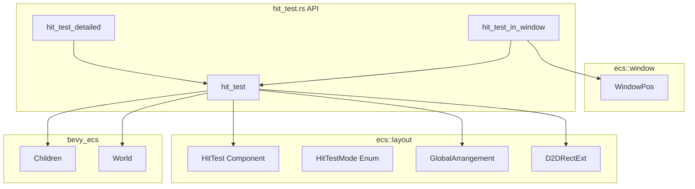
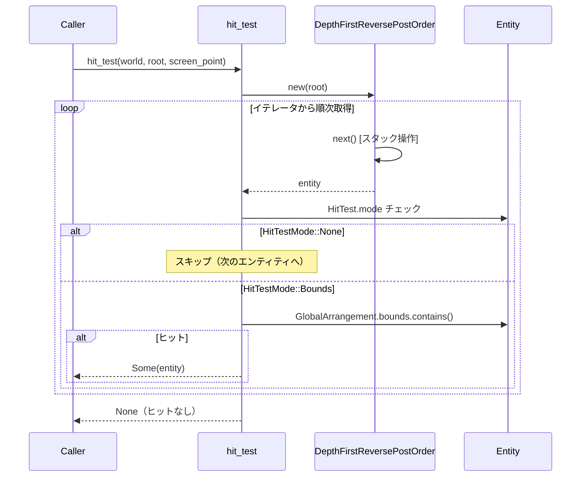
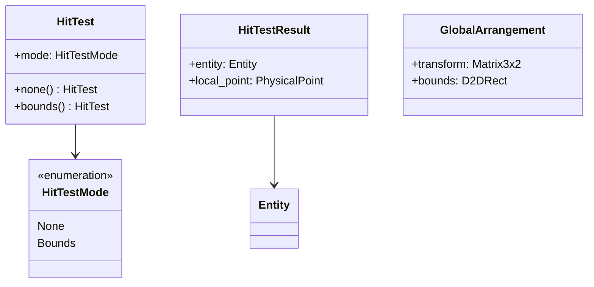

# Design Document

| 項目 | 内容 |
|------|------|
| **Document Title** | event-hit-test 設計書 |
| **Version** | 1.0 (Draft) |
| **Date** | 2025-12-02 |
| **Parent Spec** | wintf-P0-event-system |
| **Requirements** | event-hit-test/requirements.md v1.0 |

---

## Overview

**Purpose**: 画面座標からエンティティを特定するヒットテストシステムを提供する。

**Users**: wintf フレームワーク開発者が、マウスイベント処理やインタラクション実装に使用する。

**Impact**: `ecs::layout` モジュールに `HitTest` コンポーネントと関連 API を追加。既存コードへの変更は `mod.rs` への pub use 追加のみ。

### Goals

- 矩形領域（GlobalArrangement.bounds）によるヒットテスト
- Z 順序に基づく最前面エンティティの特定
- ECS システムとの統合（Visual なしでテスト可能）
- 将来の拡張（αマスク等）を考慮した設計

### Non-Goals

- αマスクによるピクセル単位ヒットテスト（event-hit-test-alpha-mask で対応）
- パフォーマンス最適化のためのキャッシュ機構（Phase 1 では実装しない）
- WM_MOUSEMOVE ハンドラとの統合（event-mouse-basic で対応）

---

## Architecture

### Existing Architecture Analysis

**既存レイアウトシステム**:
- `ecs/layout/` モジュールに配置計算コンポーネント群
- `GlobalArrangement.bounds` が物理ピクセル座標を保持
- `D2DRectExt::contains()` で矩形内判定が可能
- `Children` / `ChildOf` による ECS 階層構造

**統合ポイント**:
- `ecs/layout/mod.rs` への pub mod/use 追加
- 将来的に `win_message_handler.rs` からの呼び出し

### Architecture Pattern & Boundary Map



**Architecture Integration**:
- **Selected pattern**: 新規モジュール追加（`ecs/layout/hit_test.rs`）
- **Domain boundaries**: `ecs::layout` 名前空間内で完結（Visual 非依存）
- **Existing patterns preserved**: ECS コンポーネント設計パターン、階層走査パターン
- **New components rationale**: `HitTest` は `GlobalArrangement.bounds` に依存するため layout モジュールが適切
- **Steering compliance**: レイヤード分離（layout → graphics）を維持

### Technology Stack

| Layer | Choice / Version | Role in Feature | Notes |
|-------|------------------|-----------------|-------|
| ECS | bevy_ecs 0.17.2 | コンポーネント管理、階層走査 | Children, ChildOf 使用 |
| Graphics | windows 0.62.1 | 座標型（POINT）のみ | Direct2D API は不使用 |
| Layout | ecs::layout 既存 | GlobalArrangement, D2DRectExt | 再利用 |

---

## System Flows

### ヒットテスト走査フロー



**Key Decisions**:
- **イテレータベース**: `DepthFirstReversePostOrder` イテレータで走査
- **後順走査**: 子孫を全て返してから親を返す（子が優先される）
- **逆順**: Children 配列の最後（最前面）から走査
- **早期リターン**: 最初のヒットで即座に返却
- クリッピングなし: 親の bounds 外でも子を調査
- `HitTestMode::None` のエンティティはスキップ

---

## Requirements Traceability

| Requirement | Summary | Components | Interfaces | Flows |
|-------------|---------|------------|------------|-------|
| 1 | HitTestMode/HitTest 定義 | HitTestMode, HitTest | - | - |
| 2 | 矩形ヒットテスト | HitTest | hit_test_entity, hit_test | 走査フロー |
| 3 | Z順序優先度 | - | hit_test | 走査フロー |
| 4 | ヒットテスト除外 | HitTestMode::None | hit_test_entity | 走査フロー |
| 5 | 座標変換 | - | hit_test_in_window | - |
| 6 | ECS統合 | HitTest | hit_test | - |
| 7 | 呼び出しタイミング | - | （将来実装） | - |
| 8 | ヒットテストAPI | - | hit_test_entity, hit_test, hit_test_in_window, hit_test_detailed | - |

---

## Components and Interfaces

### Summary

| Component | Domain/Layer | Intent | Req Coverage | Key Dependencies | Contracts |
|-----------|--------------|--------|--------------|------------------|-----------|
| DepthFirstReversePostOrder | ecs::common | 深さ優先・逆順・後順走査イテレータ | 3 | Children (P0) | Iterator |
| HitTestMode | ecs::layout | ヒットテスト動作モード | 1, 4 | - | - |
| HitTest | ecs::layout | ヒットテスト設定 | 1, 2, 6 | HitTestMode | - |
| hit_test_entity | ecs::layout | 単一エンティティヒットテスト | 2, 4 | HitTest, GlobalArrangement (P0) | Service |
| hit_test | ecs::layout | ツリー走査ヒットテスト | 2, 3, 8 | hit_test_entity, DepthFirstReversePostOrder (P0) | Service |
| hit_test_in_window | ecs::layout | ウィンドウクライアント座標ヒットテスト | 5, 8 | hit_test (P0), WindowPos (P0) | Service |
| hit_test_detailed | ecs::layout | 詳細ヒットテスト結果 | 8 | hit_test (P0) | Service |

### ecs::common

#### DepthFirstReversePostOrder

| Field | Detail |
|-------|--------|
| Intent | ECS階層を深さ優先・逆順・後順で走査する汎用イテレータ |
| Requirements | 3 (Z順序優先度) |

**Responsibilities & Constraints**
- スタック + フラグ方式で後順走査を実現
- `(Entity, bool)` タプルでスタック管理（bool = 子展開済みフラグ）
- 子を全て返却してから親を返す
- Children 配列を逆順で積むことで最前面の子から走査
- ヒットテスト以外（フォーカス管理、ツリーダンプ等）でも再利用可能

**Dependencies**
- Outbound: Children — 子エンティティ取得 (P0)

**Contracts**: Iterator ✓

```rust
/// 深さ優先・逆順・後順走査イテレータ
///
/// # 走査順序
/// Children 配列の最後の要素（最前面）から走査し、
/// 子孫を全て返却してから親を返す。
///
/// # 例
/// ```text
/// Root
/// ├── Child1
/// │   ├── GC1a
/// │   └── GC1b
/// └── Child2 (最前面)
///     └── GC2a
///
/// 走査順: GC2a → Child2 → GC1b → GC1a → Child1 → Root
/// ```
///
/// # アルゴリズム
/// ## 初期化
/// 1. ルートを「子取り出し済みフラグ=OFF」で積む
///
/// ## next
/// 1. 最後の要素を取り出す
/// 2. 「子取り出し済みフラグ=ON」なら返却
/// 3. 自分を「取り出し済み」にして再度スタックに積む
/// 4. 子供がいたら、子供要素を逆順でスタックに積む（フラグはOFF）
/// 5. 1に戻る
pub struct DepthFirstReversePostOrder<'w, 's> {
    /// (Entity, 子取り出し済みフラグ)
    stack: Vec<(Entity, bool)>,
    children_query: &'w Query<'w, 's, &'static Children>,
}

impl<'w, 's> DepthFirstReversePostOrder<'w, 's> {
    pub fn new(root: Entity, children_query: &'w Query<'w, 's, &'static Children>) -> Self {
        Self {
            stack: vec![(root, false)],
            children_query,
        }
    }
}

impl<'w, 's> Iterator for DepthFirstReversePostOrder<'w, 's> {
    type Item = Entity;

    fn next(&mut self) -> Option<Self::Item> {
        loop {
            // 1. 最後の要素を取り出す
            let (entity, expanded) = self.stack.pop()?;

            // 2. 「子取り出し済みフラグ=ON」なら返却
            if expanded {
                return Some(entity);
            }

            // 3. 自分を「取り出し済み」にして再度スタックに積む
            self.stack.push((entity, true));

            // 4. 子供がいたら、子供要素を逆順でスタックに積む（フラグはOFF）
            if let Ok(children) = self.children_query.get(entity) {
                for &child in children.iter().rev() {
                    self.stack.push((child, false));
                }
            }
            // 5. ループ先頭に戻る
        }
    }
}
```

### ecs::layout

#### HitTestMode

| Field | Detail |
|-------|--------|
| Intent | エンティティのヒットテスト動作を定義する enum |
| Requirements | 1, 4 |

**Responsibilities & Constraints**
- ヒットテストの動作モードを列挙
- 将来の拡張（AlphaMask 等）を考慮した設計
- `#[non_exhaustive]` は使用しない（内部 enum のため）

**Contracts**: 該当なし（データ型のみ）

```rust
/// ヒットテストの動作モード
#[derive(Debug, Clone, Copy, PartialEq, Eq, Default)]
pub enum HitTestMode {
    /// ヒットテスト対象外（マウスイベントを透過）
    None,
    /// バウンディングボックス（GlobalArrangement.bounds）でヒットテスト
    #[default]
    Bounds,
    // 将来の拡張:
    // AlphaMask,  // αマスクによるピクセル単位判定
    // Polygon,    // 多角形によるヒットテスト
}
```

---

#### HitTest

| Field | Detail |
|-------|--------|
| Intent | エンティティのヒットテスト設定を保持するコンポーネント |
| Requirements | 1, 2, 6 |

**Responsibilities & Constraints**
- `mode` フィールドでヒットテスト動作を設定
- デフォルトは `HitTestMode::Bounds`
- `Visual` とは独立（テスト容易性のため）

**Dependencies**
- Inbound: hit_test 関数 — ヒットテスト判定で参照 (P0)

**Contracts**: 該当なし（データコンポーネント）

```rust
/// ヒットテスト設定コンポーネント
#[derive(Component, Debug, Clone, Copy, PartialEq, Eq, Default)]
pub struct HitTest {
    pub mode: HitTestMode,
}

impl HitTest {
    /// ヒットテスト対象外として作成
    pub fn none() -> Self {
        Self { mode: HitTestMode::None }
    }

    /// バウンディングボックスでヒットテスト（デフォルト）
    pub fn bounds() -> Self {
        Self { mode: HitTestMode::Bounds }
    }
}
```

---

#### hit_test_entity

| Field | Detail |
|-------|--------|
| Intent | 単一エンティティのヒットテストを実行する API 関数 |
| Requirements | 2 |

**Responsibilities & Constraints**
- 指定エンティティのみを判定対象とする（子孫は走査しない）
- `HitTestMode` に応じた判定を実行
- 将来の拡張（AlphaMask 等）でも API 変更不要

**Dependencies**
- Outbound: HitTest — モード判定 (P0)
- Outbound: GlobalArrangement — 座標判定 (P0)

**Contracts**: Service ✓

##### Service Interface

```rust
/// 単一エンティティのヒットテスト
///
/// # Arguments
/// - `world`: ECS World 参照（将来の拡張でも API 変更不要にするため）
/// - `entity`: 判定対象エンティティ
/// - `point`: スクリーン座標（物理ピクセル）
///
/// # Returns
/// - `true`: ヒット
/// - `false`: ヒットしない、または GlobalArrangement がない
///
/// # Note
/// `HitTest` コンポーネントがない場合は `HitTestMode::Bounds` として扱う
pub fn hit_test_entity(world: &World, entity: Entity, point: PhysicalPoint) -> bool;
```

- Preconditions: なし（エンティティが存在しない場合は `false`）
- Postconditions: ヒット判定結果を返す

**Implementation Notes**
- `world.get::<GlobalArrangement>(entity)` で bounds 取得
- `world.get::<HitTest>(entity)` でモード取得（None なら Bounds）
- 将来 `AlphaMask` 追加時は内部で `BitmapSourceResource` 等を追加取得
- `world.get()` は O(1) なので性能問題なし

---

#### hit_test

| Field | Detail |
|-------|--------|
| Intent | ルート配下を走査してスクリーン座標でヒットテストを実行する API 関数 |
| Requirements | 2, 3, 8 |

**Responsibilities & Constraints**
- 指定ルートエンティティ配下を深さ優先・逆順走査
- 各エンティティで `hit_test_entity` を呼び出し
- 最初のヒットで early return

**Dependencies**
- Inbound: 外部呼び出し元 — ヒットテスト実行 (P0)
- Outbound: hit_test_entity — 単一エンティティ判定 (P0)
- Outbound: Children — 階層走査 (P0)

**Contracts**: Service ✓

##### Service Interface

```rust
/// 指定ルートエンティティ配下でスクリーン座標によるヒットテストを実行
///
/// # Arguments
/// - `world`: ECS World 参照
/// - `root`: 検索ルートエンティティ（LayoutRoot, Window, 任意のサブツリー）
/// - `screen_point`: スクリーン座標（物理ピクセル）
///
/// # Returns
/// - `Some(Entity)`: ヒットした最前面エンティティ
/// - `None`: ヒットなし
///
/// # Algorithm
/// 深さ優先・逆順・後順走査で最前面エンティティを優先
pub fn hit_test(world: &World, root: Entity, screen_point: PhysicalPoint) -> Option<Entity>;
```

- Preconditions: `root` エンティティが存在すること
- Postconditions: ヒットエンティティまたは None を返す
- Invariants: 走査順序は Children 配列の逆順、子が親より先

**Implementation Notes**
- `DepthFirstReversePostOrder` イテレータを使用（`ecs::common` から import）
- イテレータは後順走査: 子孫を全て返してから親を返す
- 各エンティティで `hit_test_entity(world, entity, point)` を呼び出し
- 最初のヒットで early return（イテレータの残りは消費しない）

---

#### hit_test_in_window

| Field | Detail |
|-------|--------|
| Intent | ウィンドウクライアント座標でヒットテストを実行する API 関数 |
| Requirements | 5, 8 |

**Responsibilities & Constraints**
- クライアント座標を `WindowPos` を使用してスクリーン座標に変換
- `hit_test` に委譲

**Dependencies**
- Outbound: hit_test — 実際のヒットテスト実行 (P0)
- Outbound: WindowPos — ウィンドウ位置取得 (P0)

**Contracts**: Service ✓

##### Service Interface

```rust
/// 指定Window内でクライアント座標によるヒットテストを実行
///
/// # Arguments
/// - `world`: ECS World 参照
/// - `window`: Window エンティティ（WindowPos を持つ）
/// - `client_point`: ウィンドウクライアント座標（物理ピクセル）
///
/// # Returns
/// - `Some(Entity)`: ヒットした最前面エンティティ
/// - `None`: ヒットなしまたは WindowPos が存在しない
pub fn hit_test_in_window(
    world: &World,
    window: Entity,
    client_point: PhysicalPoint,
) -> Option<Entity>;
```

- Preconditions: `window` エンティティに `WindowPos` が存在すること
- Postconditions: `hit_test` と同じ結果を返す

**Implementation Notes**
- `WindowPos.position` からウィンドウ左上座標を取得
- `client_point + window_position = screen_point` で変換
- Phase 2 で実装（Phase 1 の `hit_test` 完成後）

---

#### hit_test_detailed

| Field | Detail |
|-------|--------|
| Intent | ローカル座標付きの詳細なヒットテスト結果を返す API 関数 |
| Requirements | 8 |

**Responsibilities & Constraints**
- `hit_test` の結果にローカル座標情報を追加
- `GlobalArrangement.transform` の逆変換でローカル座標計算

**Dependencies**
- Outbound: hit_test — 基本ヒットテスト (P0)
- Outbound: GlobalArrangement — 逆変換計算 (P0)

**Contracts**: Service ✓

##### Service Interface

```rust
/// ヒットテスト結果（詳細情報付き）
#[derive(Debug, Clone, Copy)]
pub struct HitTestResult {
    /// ヒットしたエンティティ
    pub entity: Entity,
    /// エンティティローカル座標（物理ピクセル）
    pub local_point: PhysicalPoint,
}

/// 詳細なヒットテスト結果を返す
///
/// # Arguments
/// - `world`: ECS World 参照
/// - `root`: 検索ルートエンティティ
/// - `screen_point`: スクリーン座標（物理ピクセル）
///
/// # Returns
/// - `Some(HitTestResult)`: ヒット情報（エンティティ + ローカル座標）
/// - `None`: ヒットなし
pub fn hit_test_detailed(
    world: &World,
    root: Entity,
    screen_point: PhysicalPoint,
) -> Option<HitTestResult>;
```

**Implementation Notes**
- Phase 3 で実装（オプション）
- `Matrix3x2` の逆行列計算が必要

---

## Data Models

### Domain Model



**Aggregates and Boundaries**:
- `HitTest` は独立コンポーネント（Visual, GlobalArrangement とは別）
- `HitTestResult` は戻り値専用の値オブジェクト

**Business Rules**:
- `HitTestMode::None` → ヒットテスト対象外
- `HitTestMode::Bounds` → `GlobalArrangement.bounds` で判定

### Physical Data Model

該当なし（永続化なし）

---

## Error Handling

### Error Strategy

- エラーは `Option<T>` で表現（`None` = ヒットなし or エラー）
- 致命的エラーは発生しない（存在しないエンティティはスキップ）

### Error Categories

| カテゴリ | 状況 | 対応 |
|----------|------|------|
| ヒットなし | 座標が全エンティティ外 | `None` を返す |
| コンポーネントなし | HitTest/GlobalArrangement がない | スキップして子孫を調査 |
| 無効なルート | root エンティティが存在しない | `None` を返す |

---

## Testing Strategy

### Unit Tests

1. `HitTestMode` enum のデフォルト値テスト
2. `HitTest::none()`, `HitTest::bounds()` コンストラクタテスト
3. 単一エンティティへのヒットテスト
4. `HitTestMode::None` でのスキップ確認
5. 座標が bounds 外の場合の `None` 確認

### Integration Tests

1. 親子階層での Z 順序テスト（子が優先）
2. 兄弟エンティティでの Z 順序テスト（後の要素が前面）
3. クリッピングなしテスト（親 bounds 外の子にヒット）
4. `hit_test_in_window` での座標変換テスト
5. Visual なしでのヒットテスト（ECS 純粋テスト）

### Performance Tests

1. 100 エンティティでのヒットテスト（1ms 以内）
2. 500 エンティティでのヒットテスト（1ms 以内）

---

## Performance & Scalability

### Target Metrics

| メトリクス | 目標値 | 測定方法 |
|-----------|--------|----------|
| ヒットテスト応答時間 | < 1ms | 数百エンティティでのベンチマーク |
| 座標変換精度 | ± 0.5px | DPI 別テストケース |

### Optimization Strategy

- Phase 1: 線形走査（O(n)）で実装
- 将来: trait ベース設計でアルゴリズム差し替え可能

```rust
/// ヒットテスト戦略 trait（将来の最適化用）
pub trait HitTestStrategy {
    fn find_hit(&self, world: &World, root: Entity, point: PhysicalPoint) -> Option<Entity>;
}

/// デフォルト実装: 線形ツリー走査
pub struct TreeTraversalStrategy;

impl HitTestStrategy for TreeTraversalStrategy {
    fn find_hit(&self, world: &World, root: Entity, point: PhysicalPoint) -> Option<Entity> {
        hit_test(world, root, point)
    }
}
```

---

## Supporting References

### PhysicalPoint 型定義

```rust
/// 物理ピクセル座標（スクリーン座標系）
#[derive(Debug, Clone, Copy, PartialEq)]
pub struct PhysicalPoint {
    pub x: f32,
    pub y: f32,
}

impl PhysicalPoint {
    pub fn new(x: f32, y: f32) -> Self {
        Self { x, y }
    }
}
```

### ファイル構成

```
crates/wintf/src/ecs/
├── common/
│   ├── mod.rs                  # 新規作成: pub mod tree_iter; pub use tree_iter::*;
│   └── tree_iter.rs            # 新規作成: DepthFirstReversePostOrder
├── layout/
│   ├── arrangement.rs          # 既存（変更なし）
│   ├── hit_test.rs             # 新規作成: HitTest, HitTestMode, hit_test API
│   ├── mod.rs                  # pub mod hit_test; pub use hit_test::*; 追加
│   ├── rect.rs                 # 既存（変更なし）
│   ├── systems.rs              # 既存（変更なし）
│   └── ...
└── mod.rs                      # pub mod common; 追加

crates/wintf/tests/
├── hit_test_integration_test.rs    # 新規作成
└── tree_iter_test.rs               # 新規作成: イテレータ単体テスト
```
