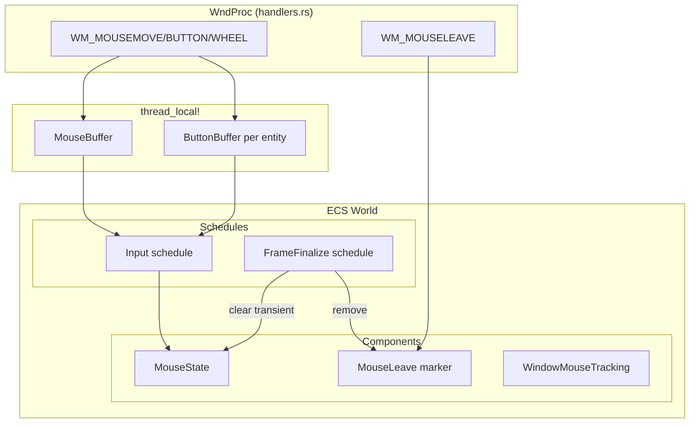
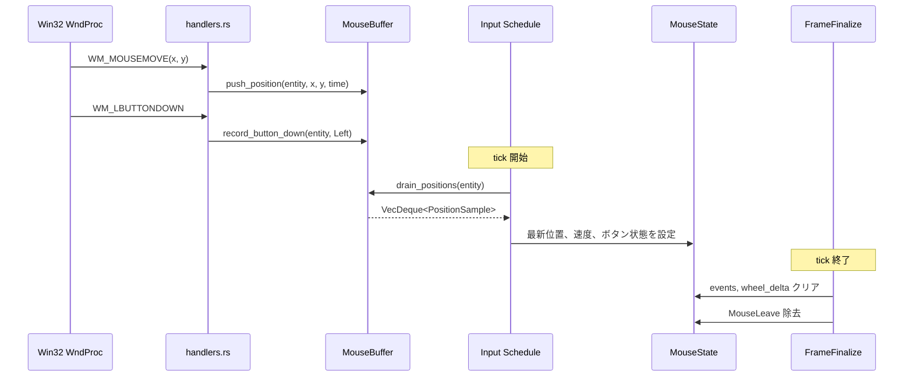
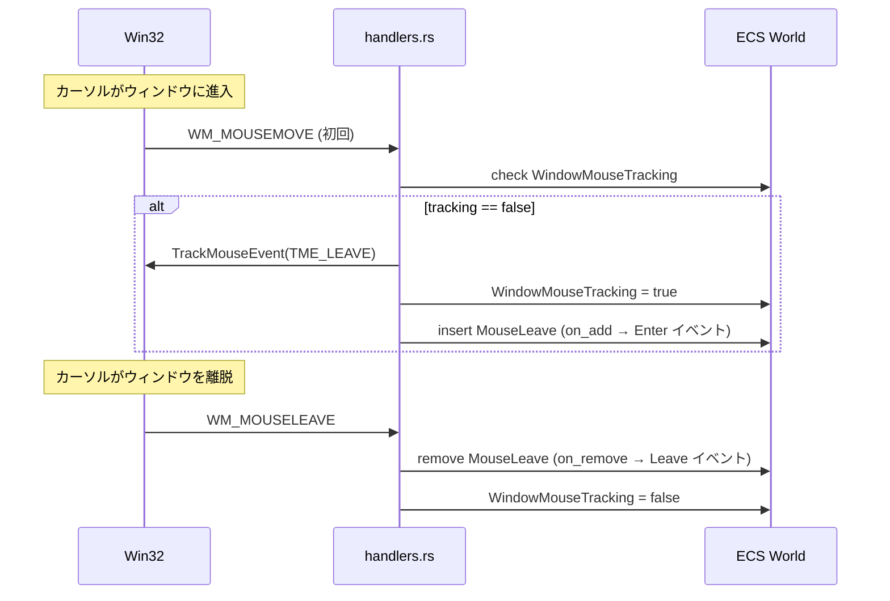
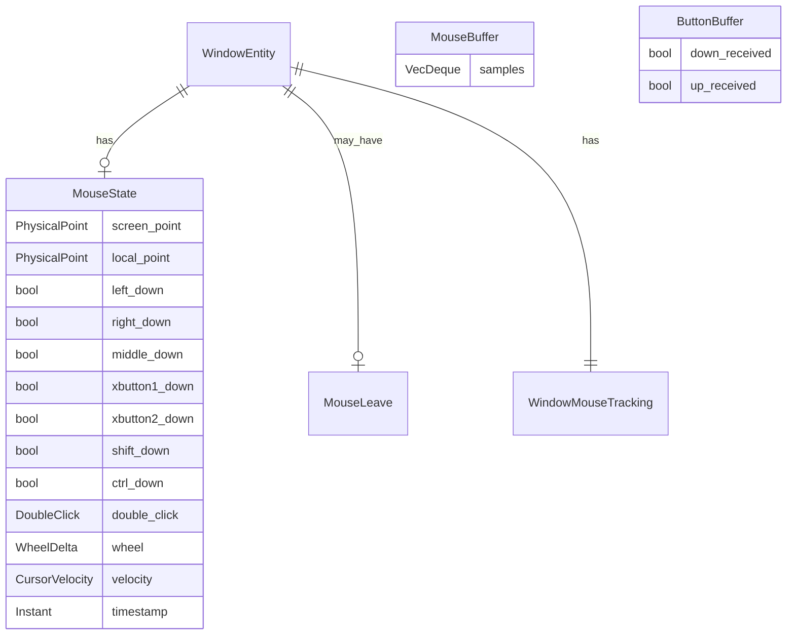
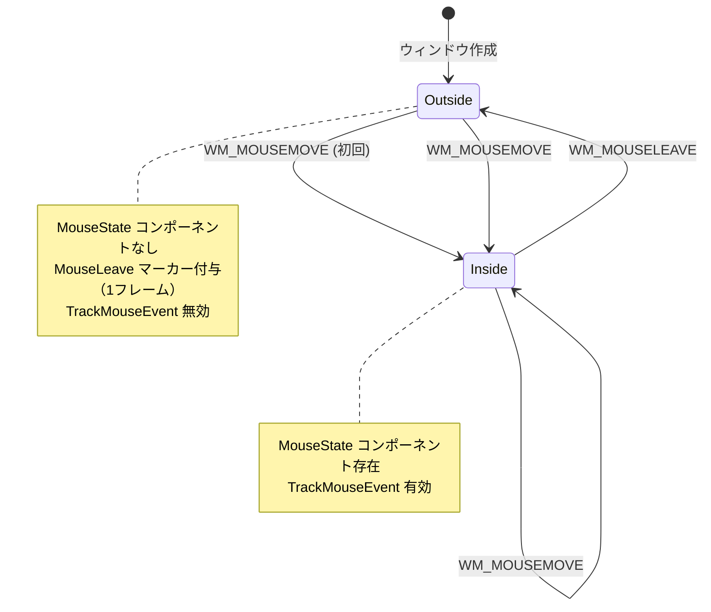

# event-mouse-basic: 技術設計書

## 概要

### 目的
wintfフレームワークにマウス入力のECS統合を提供し、Win32マウスメッセージを正規化されたECSコンポーネントとして利用可能にする。これにより、マウスベースのUI相互作用（ホバー、クリック、ドラッグ、スクロール）の基盤を確立する。

### スコープ
- **Phase 1 実装**: ウィンドウレベルのマウス状態管理
- **in-scope**: MouseState/MouseLeave コンポーネント、Win32 メッセージ統合、速度計算、バッファリング
- **out-of-scope**: hit_test 実装（仮スタブ使用）、ウィジェットレベル通知、高レベル抽象（ドラッグ＆ドロップ等）

### 設計原則
1. **既存パターン準拠**: `handlers.rs` の借用区切り方式、`thread_local!` パターンに従う
2. **ECS-first**: bevy_ecs 0.17 の SparseSet storage、hook を活用
3. **スレッドセーフ配慮**: `thread_local!` + `RefCell` で UIスレッド内安全性を確保

## 要件トレーサビリティ

| Req | 概要 | コンポーネント | インターフェース | フロー |
|-----|------|----------------|------------------|--------|
| 1 | MouseState コンポーネント | `MouseState` | `screen_point`, `local_point`, `*_down`, `velocity` 等 | Capture → Input |
| 2 | MouseLeave マーカー | `MouseLeave` | `Added<MouseState>` for Enter, `With<MouseLeave>` for Leave | Enter/Leave 検出 |
| 3 | カーソル移動速度 | `MouseBuffer` | `calculate_velocity()` | 速度計算 |
| 4 | ローカル座標変換 + hit_test | `MouseState.local_point`, `hit_test_stub` | `hit_test_placeholder()` | Capture → Transform |
| 5 | Win32 メッセージ統合 | `handlers.rs` 拡張 | `WM_MOUSEMOVE`, `WM_LBUTTONDOWN` 等 | WndProc → Capture |
| 5A | MouseBuffer | `MouseBuffer`, `ButtonBuffer` | `MouseBuffer::push()`, `ButtonBuffer::record_*` | 複数メッセージ/tick |
| 6 | WindowMouseTracking | `WindowMouseTracking` | `TrackMouseEvent` 連携 | Leave 検出 |
| 7 | FrameFinalize | `FrameFinalize` スケジュール | `clear_transient_mouse_state` | tick 終了時クリーンアップ |

## アーキテクチャ

### システム構成図



### レイヤー構成

| レイヤー | 責務 | ファイル |
|----------|------|----------|
| WndProc | Win32 メッセージ受信、バッファ蓄積 | `handlers.rs` 拡張 |
| Buffer | 複数メッセージ/tick の蓄積 | `mouse.rs` (新規) |
| ECS Components | 正規化された状態保持 | `mouse.rs` |
| Systems | バッファ処理、クリーンアップ | `mouse.rs` |

## 技術スタック

| レイヤー | ツール/ライブラリ | バージョン | 役割 |
|----------|-------------------|------------|------|
| ECS | bevy_ecs | 0.17.2 | コンポーネント管理、スケジューリング |
| Win32 | windows-rs | 既存 | マウスメッセージ、TrackMouseEvent |
| Platform | Rust stable | 1.80+ | 言語ランタイム |

**既存スタックからの逸脱**: なし。既存の `handlers.rs` パターンを踏襲。

## システムフロー

### マウスイベント処理フロー



### Enter/Leave 検出フロー



## コンポーネント＆インターフェース

### コンポーネント概要表

| コンポーネント | ドメイン | 目的 | 要件 | 依存関係 |
|----------------|----------|------|------|----------|
| MouseState | Input | マウス状態保持 | 1, 4 | DPI |
| MouseLeave | Input | Leave マーカー | 2, 6 | なし |
| WindowMouseTracking | Input | TME 状態追跡 | 6 | なし |
| MouseBuffer | Buffer | 位置サンプル蓄積 | 3, 5A | なし |
| ButtonBuffer | Buffer | ボタン状態蓄積 | 5A | なし |

### MouseState コンポーネント

**Note**: 以下の定義は requirements.md Req 1 に準拠。Win32 wParam を透過的に ECS に転送する設計。

```rust
/// マウス状態コンポーネント
/// 
/// hit_test がヒットしたエンティティに付与される。
/// コンポーネントの存在 = ホバー中。
/// Added<MouseState> で Enter を検出。
/// 
/// Win32マウスメッセージの情報を透過的にECSに転送する。
/// 情報の解釈（Click判定等）はアプリ側の責務。
/// 
/// メモリ戦略: SparseSet - 頻繁な挿入/削除
#[derive(Component, Debug, Clone)]
#[component(storage = "SparseSet")]
pub struct MouseState {
    /// スクリーン座標（物理ピクセル）
    pub screen_point: PhysicalPoint,
    /// エンティティローカル座標（物理ピクセル）
    pub local_point: PhysicalPoint,
    
    // === ボタン押下状態（wParam のビットマスクを透過転送）===
    /// 左ボタン押下中 (MK_LBUTTON)
    pub left_down: bool,
    /// 右ボタン押下中 (MK_RBUTTON)
    pub right_down: bool,
    /// 中ボタン押下中 (MK_MBUTTON)
    pub middle_down: bool,
    /// XButton1 押下中 (MK_XBUTTON1) - 4thボタン
    pub xbutton1_down: bool,
    /// XButton2 押下中 (MK_XBUTTON2) - 5thボタン
    pub xbutton2_down: bool,
    
    // === 修飾キー状態（wParam から透過転送）===
    /// Shift押下中 (MK_SHIFT)
    pub shift_down: bool,
    /// Ctrl押下中 (MK_CONTROL)
    pub ctrl_down: bool,
    
    // === ダブルクリック（1フレームのみ有効）===
    /// ダブルクリック検出（FrameFinalizeでNoneにリセット）
    pub double_click: DoubleClick,
    
    // === ホイール（1フレームのみ有効）===
    /// ホイール回転情報（FrameFinalizeでリセット）
    pub wheel: WheelDelta,
    
    // === その他 ===
    /// カーソル移動速度
    pub velocity: CursorVelocity,
    /// タイムスタンプ
    pub timestamp: Instant,
}

/// 物理座標（ピクセル）
#[derive(Debug, Clone, Copy, Default)]
pub struct PhysicalPoint {
    pub x: i32,
    pub y: i32,
}

/// ダブルクリック種別（1フレームのみ有効）
/// 
/// FrameFinalize で None にリセットされる。
#[derive(Debug, Clone, Copy, PartialEq, Eq, Default)]
pub enum DoubleClick {
    #[default]
    None,
    Left,
    Right,
    Middle,
    XButton1,
    XButton2,
}

/// ホイール回転情報（1フレームのみ有効）
/// 
/// WM_MOUSEWHEEL / WM_MOUSEHWHEEL から透過転送。
/// FrameFinalize でリセットされる。
#[derive(Debug, Clone, Copy, PartialEq, Default)]
pub struct WheelDelta {
    /// 垂直ホイール回転量（WHEEL_DELTA単位、正=上、負=下）
    pub vertical: i16,
    /// 水平ホイール回転量（WHEEL_DELTA単位、正=右、負=左）
    pub horizontal: i16,
}

/// カーソル移動速度（ピクセル/秒）
#[derive(Debug, Clone, Default)]
pub struct CursorVelocity {
    pub x: f32,
    pub y: f32,
    pub magnitude: f32,
}
```

### MouseLeave マーカーコンポーネント

```rust
/// マウス離脱マーカー（1フレーム限り）
/// 
/// MouseState が削除されたフレームに付与される。
/// FrameFinalize で削除されるため、1フレームのみ存在。
/// 
/// メモリ戦略: SparseSet - 一時的マーカー
#[derive(Component, Debug, Clone, Copy, PartialEq, Eq)]
#[component(storage = "SparseSet")]
pub struct MouseLeave;
```

**ライフサイクル**:
1. マウスがエンティティに入る → `MouseState` を追加 → `Added<MouseState>` で Enter を検出
2. マウスがエンティティから離れる → `MouseState` を削除 → `MouseLeave` を追加（`With<MouseLeave>` で検出）
3. `FrameFinalize` スケジュール → `MouseLeave` を削除

### WindowMouseTracking コンポーネント

```rust
/// TrackMouseEvent 状態追跡
#[derive(Component, Debug, Clone, Copy, Default)]
pub struct WindowMouseTracking(pub bool);
```

### MouseBuffer（thread_local!）

```rust
/// 位置サンプル
#[derive(Debug, Clone, Copy)]
pub struct PositionSample {
    pub x: f32,
    pub y: f32,
    pub timestamp: std::time::Instant,
}

/// マウスバッファ（thread_local! で管理）
pub struct MouseBuffer {
    samples: VecDeque<PositionSample>,
}

impl MouseBuffer {
    const MAX_SAMPLES: usize = 5;
    
    pub fn push(&mut self, sample: PositionSample) {
        if self.samples.len() >= Self::MAX_SAMPLES {
            self.samples.pop_front();
        }
        self.samples.push_back(sample);
    }
    
    pub fn drain(&mut self) -> impl Iterator<Item = PositionSample> + '_ {
        self.samples.drain(..)
    }
    
    /// 速度計算（最新2サンプル間）
    pub fn calculate_velocity(&self) -> (f32, f32) {
        if self.samples.len() < 2 {
            return (0.0, 0.0);
        }
        let newest = self.samples.back().unwrap();
        let prev = &self.samples[self.samples.len() - 2];
        let dt = newest.timestamp.duration_since(prev.timestamp).as_secs_f32();
        if dt < 0.0001 {
            return (0.0, 0.0);
        }
        ((newest.x - prev.x) / dt, (newest.y - prev.y) / dt)
    }
}

thread_local! {
    /// Entity ごとの MouseBuffer
    static MOUSE_BUFFERS: RefCell<HashMap<Entity, MouseBuffer>> = RefCell::new(HashMap::new());
}
```

### ButtonBuffer

```rust
/// ボタンバッファ
#[derive(Debug, Clone, Copy, Default)]
pub struct ButtonBuffer {
    /// tick中にDownが発生したか
    pub down_received: bool,
    /// tick中にUpが発生したか
    pub up_received: bool,
}

impl ButtonBuffer {
    pub fn record_down(&mut self) {
        self.down_received = true;
    }
    
    pub fn record_up(&mut self) {
        self.up_received = true;
    }
    
    pub fn reset(&mut self) {
        self.down_received = false;
        self.up_received = false;
    }
}

thread_local! {
    /// Entity × Button ごとの ButtonBuffer
    static BUTTON_BUFFERS: RefCell<HashMap<(Entity, MouseButton), ButtonBuffer>> = RefCell::new(HashMap::new());
}
```

### hit_test 仮スタブ

```rust
/// hit_test プレースホルダー（Phase 1）
/// 
/// event-hit-test 完了後に実際の実装に差し替え
pub fn hit_test_placeholder(
    _world: &World,
    window_entity: Entity,
    _position: (f32, f32),
) -> Entity {
    // Phase 1: 常にウィンドウエンティティを返す
    window_entity
}
```

## データモデル

### ドメインモデル



### 状態遷移



## handlers.rs 拡張

### 追加するハンドラ関数

| 関数名 | 処理内容 | 備考 |
|--------|----------|------|
| `WM_MOUSEMOVE` | 位置→MouseBuffer、修飾キー更新、TME 初回設定 | 借用区切り方式 |
| `WM_LBUTTONDOWN` / `UP` | ButtonBuffer 記録、ダブルクリック検出 | L/R/M/X1/X2 |
| `WM_RBUTTONDOWN` / `UP` | 同上 | |
| `WM_MBUTTONDOWN` / `UP` | 同上 | |
| `WM_XBUTTONDOWN` / `UP` | 同上 | |
| `WM_MOUSEWHEEL` | wheel_delta 累積 | |
| `WM_MOUSEHWHEEL` | horizontal wheel_delta | |
| `WM_MOUSELEAVE` | MouseLeave 除去、WindowMouseTracking = false | |

### 実装パターン

```rust
/// WM_MOUSEMOVE の実装例
#[inline]
pub(super) unsafe fn WM_MOUSEMOVE(
    hwnd: HWND,
    _message: u32,
    wparam: WPARAM,
    lparam: LPARAM,
) -> HandlerResult {
    let Some(entity) = super::get_entity_from_hwnd(hwnd) else {
        return None;
    };
    
    // 位置取得（物理ピクセル）
    let x = GET_X_LPARAM(lparam);
    let y = GET_Y_LPARAM(lparam);
    
    // MouseBuffer に蓄積（借用なし）
    MOUSE_BUFFERS.with(|buffers| {
        let mut buffers = buffers.borrow_mut();
        let buffer = buffers.entry(entity).or_default();
        buffer.push(PositionSample {
            x: x as f32,
            y: y as f32,
            timestamp: Instant::now(),
        });
    });
    
    // TrackMouseEvent 設定（初回のみ）
    if let Some(world) = super::try_get_ecs_world() {
        if let Ok(mut world_borrow) = world.try_borrow_mut() {
            // ... WindowMouseTracking チェック、MouseLeave 挿入
        }
    }
    
    Some(LRESULT(0))
}
```

## システム設計

### Input スケジュールシステム

```rust
/// マウスバッファ処理システム
pub fn process_mouse_buffers(
    mut query: Query<(Entity, &mut MouseState)>,
) {
    for (entity, mut mouse) in query.iter_mut() {
        MOUSE_BUFFERS.with(|buffers| {
            let mut buffers = buffers.borrow_mut();
            if let Some(buffer) = buffers.get_mut(&entity) {
                // 速度計算
                let velocity = buffer.calculate_velocity();
                mouse.velocity = CursorVelocity {
                    x: velocity.0,
                    y: velocity.1,
                    magnitude: (velocity.0 * velocity.0 + velocity.1 * velocity.1).sqrt(),
                };
                
                // 最新位置取得（物理ピクセル）
                if let Some(sample) = buffer.samples.back() {
                    mouse.screen_point = PhysicalPoint {
                        x: sample.x as i32,
                        y: sample.y as i32,
                    };
                    // Note: local_point は hit_test 結果から設定
                }
                
                // バッファクリア
                buffer.samples.clear();
            }
        });
        
        // ButtonBuffer 処理
        // ... 各ボタンの down_received/up_received を MouseState に反映
        mouse.timestamp = Instant::now();
    }
}
```

### FrameFinalize スケジュールシステム

```rust
/// 一時的マウス状態クリアシステム
pub fn clear_transient_mouse_state(
    mut query: Query<&mut MouseState>,
    mut commands: Commands,
    leave_query: Query<Entity, With<MouseLeave>>,
) {
    // double_click, wheel をリセット（1フレームのみ有効）
    for mut mouse in query.iter_mut() {
        mouse.double_click = DoubleClick::None;
        mouse.wheel = WheelDelta::default();
    }
    
    // MouseLeave マーカー除去
    for entity in leave_query.iter() {
        commands.entity(entity).remove::<MouseLeave>();
    }
}
```

## エラー処理

### エラーカテゴリ

| カテゴリ | 発生条件 | 対応 |
|----------|----------|------|
| 借用失敗 | RefCell 再入 | スキップ、warn ログ |
| Entity 無効 | GWLP_USERDATA 不正 | スキップ、debug ログ |
| DPI 取得失敗 | コンポーネント未設定 | デフォルト値使用 |

### 観測可能性

- `tracing::trace!` マウス位置更新
- `tracing::debug!` Enter/Leave イベント
- `tracing::warn!` 借用失敗

## テスト戦略

### ユニットテスト

| テスト | 対象 | 検証内容 |
|--------|------|----------|
| `test_mouse_buffer_push` | MouseBuffer | サンプル蓄積、上限 |
| `test_velocity_calculation` | MouseBuffer::calculate_velocity | 速度計算精度 |
| `test_button_buffer_state` | ButtonBuffer | down/up 記録 |
| `test_double_click_detection` | DoubleClickState | 時間・距離判定 |

### 統合テスト

| テスト | 対象 | 検証内容 |
|--------|------|----------|
| `test_mouse_state_creation` | MouseState + Entity | コンポーネント追加 |
| `test_enter_leave_hooks` | MouseLeave on_add/on_remove | イベント発火 |
| `test_frame_finalize_cleanup` | clear_transient_mouse_state | 一時状態クリア |

## リスク＆未解決事項

### 既知のリスク

| リスク | 影響 | 緩和策 |
|--------|------|--------|
| hit_test 仮スタブ依存 | ウィジェットレベル通知不可 | Phase 1 スコープ限定 |
| 高頻度メッセージ | パフォーマンス影響 | バッファリング、速度計算最適化 |

### 未解決事項

1. **ダブルクリック閾値**: Win32 GetDoubleClickTime() 使用か固定値か
2. **キャプチャ状態**: SetCapture/ReleaseCapture 統合は Phase 2 以降

## 参照

- [requirements.md](./requirements.md) - 全要件定義
- [gap-analysis.md](./gap-analysis.md) - 既存コード分析
- [doc/spec/08-event-system.md](../../../doc/spec/08-event-system.md) - イベントシステム仕様
