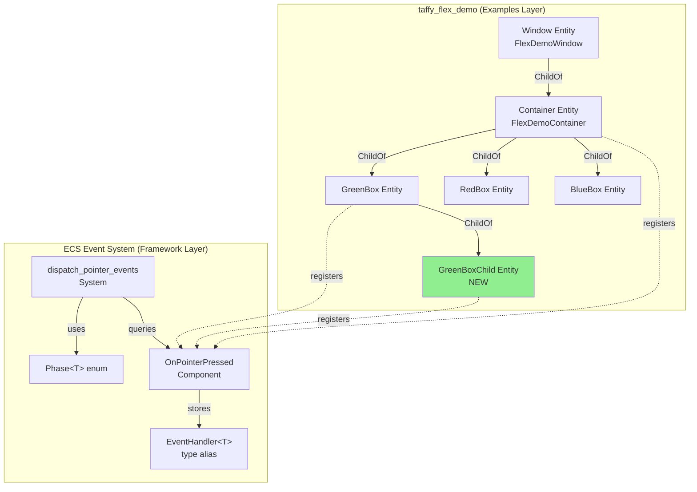
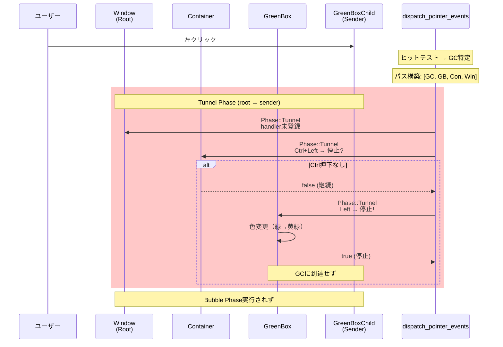
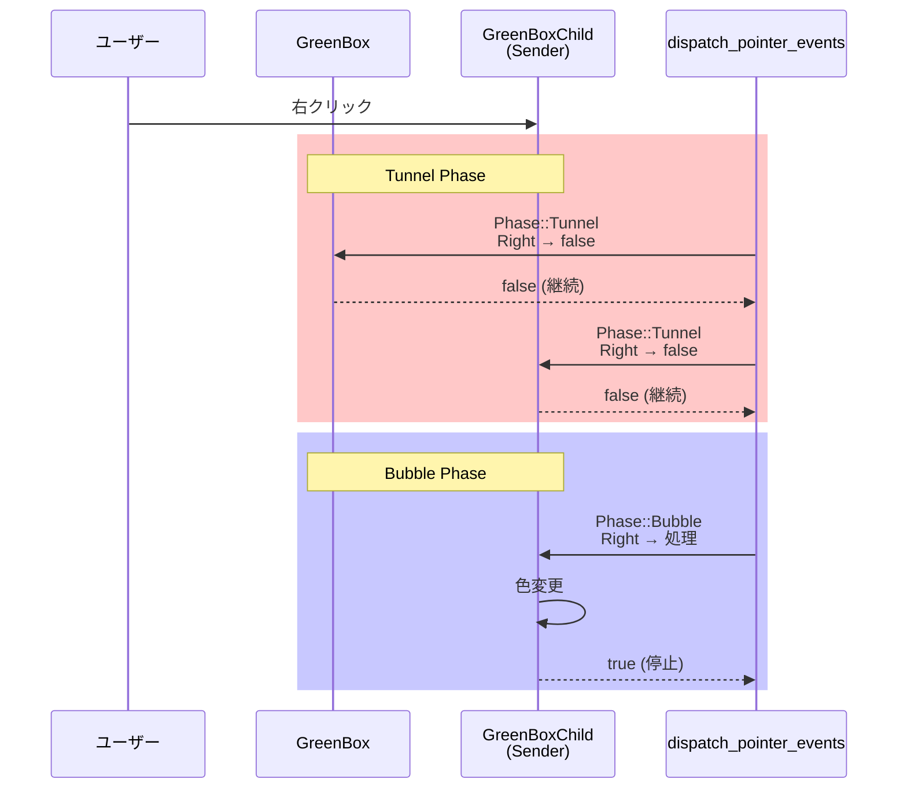

# 設計ドキュメント

## 概要

本機能は、wintfフレームワークの`taffy_flex_demo`サンプルアプリケーションにTunnelフェーズ（親→子方向のイベント伝播）のデモンストレーション実装を追加する。既存の`dispatch_pointer_events`システムはTunnel/Bubble両フェーズを完全実装済みだが、サンプルコードがBubbleフェーズのみをデモしているため、開発者がTunnelフェーズの動作を視覚的に理解できない問題がある。本機能により、WinUI3/WPFの`PreviewXxx`イベントやDOMのCapture Phaseに相当する親エンティティでの事前処理パターンを学習可能になる。

**目的**: Tunnelフェーズの動作を視覚的に理解できるデモを提供し、親エンティティでのイベント前処理パターンの学習を促進する。

**ユーザー**: wintfフレームワークを使用するRust/Windows GUI開発者が、イベントハンドリングの実装パターンを学ぶために利用する。

**影響**: `taffy_flex_demo.rs`のイベントハンドラ実装を拡張する。コアシステム（`dispatch.rs`）は変更不要。

### ゴール

- 既存ハンドラにTunnelフェーズ処理を追加し、実行順序を可視化
- GreenBoxに子エンティティを追加し、親のTunnelキャプチャによる伝播停止を実証
- ログ出力と視覚的フィードバック（色変更）でTunnel/Bubbleの違いを明確化
- WinUI3/WPF/DOMイベントモデルとの対応関係をコメントで文書化

### 非ゴール

- `dispatch_pointer_events`システムの実装変更（既に完全実装済み）
- 新しいイベント種別の追加（既存の`OnPointerPressed`/`OnPointerMoved`を使用）
- 本番アプリケーション向けの機能（デモ・学習目的のみ）
- 複雑な階層（3階層以上）でのTunnel動作検証（将来のスコープ）

## アーキテクチャ

### 既存アーキテクチャ分析

**現在のイベントシステム** (`crates/wintf/src/ecs/pointer/`):
- **Phase<T> enum**: Tunnel/Bubbleの2フェーズを型安全に表現（`is_tunnel()`, `is_bubble()`, `value()`メソッド提供）
- **EventHandler<T>**: 統一されたハンドラシグネチャ `fn(world, sender, entity, ev) -> bool`
- **dispatch_event_for_handler**: 2フェーズディスパッチ実装
  - Tunnel: `path.iter().rev()`でroot→sender順
  - Bubble: `path.iter()`でsender→root順
- **ハンドラコンポーネント**: `OnPointerPressed`, `OnPointerMoved`等のSparseSetコンポーネント

**現在のtaffy_flex_demo構造**:
- エンティティ階層: Window → FlexDemoContainer → {RedBox, GreenBox, BlueBox}
- 全ハンドラが`if !ev.is_bubble() { return false; }`でTunnelを無視
- イベント登録: エンティティ生成時に`OnPointerPressed(handler_fn)`コンポーネント追加

**保持すべき制約**:
- ECSアーキテクチャパターン（bevy_ecs 0.17.2）
- Handlerコンポーネントの関数ポインタパターン
- `tracing`クレートによる構造化ログ
- Taffyレイアウトエンジン（Flexbox）

### アーキテクチャパターンと境界マップ



**アーキテクチャ統合**:
- **選択パターン**: ECSイベントディスパッチパターン（既存）
- **ドメイン境界**: Examples層（`taffy_flex_demo.rs`）のみを変更、Framework層（`dispatch.rs`）は不変
- **保持される既存パターン**:
  - Handlerコンポーネントの関数ポインタパターン
  - `dispatch_pointer_events`の2フェーズディスパッチ
  - `ChildOf`による階層構造表現
- **新規コンポーネントの根拠**:
  - `GreenBoxChild`: Requirement 3（親のTunnelキャプチャ実証）に必要
  - 既存コンポーネント（`GreenBox`, `OnPointerPressed`）は再利用
- **ステアリング準拠**: ECSアーキテクチャ原則維持、レイヤー分離遵守

### 技術スタック

| レイヤー | 選択技術 / バージョン | 本機能での役割 | 備考 |
|---------|-------------------|--------------|------|
| Framework / ECS | bevy_ecs 0.17.2 | イベントディスパッチシステム、エンティティ階層管理 | 既存実装、変更なし |
| Layout Engine | taffy 0.9.1 | Flexboxレイアウト計算、GreenBoxChildの配置 | GreenBoxを`flex_direction: Column`に変更 |
| Logging | tracing (既存) | 構造化ログ出力（`info!`マクロ） | `[Tunnel]`/`[Bubble]`プレフィックス追加 |
| Graphics | Direct2D (既存) | 矩形の色変更（視覚フィードバック） | `Brushes::foreground`コンポーネント変更 |

**根拠**: 全て既存スタック。新規依存関係なし。詳細は`research.md`の「既存イベントシステムの実装状況」セクション参照。

## システムフロー

### Tunnelフェーズのイベントフロー



**フロー判断**:
- **Tunnel gating条件**: 
  - Container: `state.ctrl_down && state.left_down` → true で停止（Requirement 2）
  - GreenBox: `state.left_down` → true で停止（Requirement 3）
- **色変更**: `world.get_mut::<Brushes>(entity)`で`foreground`を更新
- **ログ出力**: 各ステップで`tracing::info!`により`[Tunnel] EntityName: ...`を出力

### 通常のBubble継続フロー（右クリック時）



## 要件トレーサビリティ

| 要件 | 概要 | コンポーネント | インターフェース | フロー |
|------|------|--------------|----------------|--------|
| 1.1 | Tunnelフェーズ処理実装 | GreenBox, Container handlers | EventHandler<PointerState> | Tunnel Phase Sequence |
| 1.2 | Tunnelログ出力 | 全handler関数 | tracing::info! | Tunnel Phase Sequence |
| 1.3 | Bubbleログ出力 | 全handler関数 | tracing::info! | Bubble Phase Sequence |
| 1.4 | 親子両方にハンドラ登録 | GreenBox, GreenBoxChild entities | OnPointerPressed component | - |
| 1.5 | 実行順序可視化 | ログ出力フォーマット | tracing::info! | Tunnel Phase Sequence |
| 2.1 | Container Tunnel前処理 | on_container_pressed | EventHandler | Tunnel Phase Sequence |
| 2.2 | Tunnel停止ログ | on_container_pressed | tracing::info! | Tunnel Phase Sequence |
| 2.3 | Ctrl+クリック条件 | on_container_pressed | PointerState.ctrl_down | Tunnel Phase Sequence |
| 2.4 | Bubble非実行確認 | ログ出力 | - | Tunnel Phase Sequence |
| 2.5 | 通常/停止両ケース | on_container_pressed | 条件分岐 | Tunnel/Bubble両フロー |
| 3.1 | GreenBoxChild追加 | GreenBoxChild entity | ChildOf(GreenBox) | - |
| 3.2 | 親子ハンドラ登録 | GreenBox, GreenBoxChild | OnPointerPressed | - |
| 3.3 | GreenBox Tunnelキャプチャ | on_green_box_pressed | EventHandler, Brushes | Tunnel Phase Sequence |
| 3.4 | キャプチャ時の色・ログ | on_green_box_pressed | Brushes, tracing::info! | Tunnel Phase Sequence |
| 3.5 | 子未到達の確認 | ログ不在 | - | Tunnel Phase Sequence |
| 3.6 | 子ハンドラのログ | on_green_child_pressed | tracing::info! | - |
| 3.7 | 右クリック時到達確認 | on_green_child_pressed | PointerState.right_down | Bubble Phase Sequence |
| 4.1 | Tunnel PointerStateログ | 全handler関数 | Phase::value() | - |
| 4.2 | Bubble PointerStateログ | 全handler関数 | Phase::value() | - |
| 4.3 | ev.value()使用例 | handler関数実装 | Phase::value() | - |
| 4.4 | ボタン・修飾キーログ | handler関数実装 | PointerState fields | - |
| 4.5 | 座標ログ | handler関数実装 | screen_point, local_point | - |
| 5.1 | ファイル冒頭説明 | taffy_flex_demo.rs | コメント | - |
| 5.2 | WinUI3/WPF対応説明 | taffy_flex_demo.rs | コメント | - |
| 5.3 | ハンドラ関数コメント | handler関数docコメント | /// | - |
| 5.4 | stopPropagation説明 | handler関数コメント | /// | - |
| 5.5 | 出力例の明示 | println!またはコメント | - | - |

## コンポーネントとインターフェース

### コンポーネント概要

| コンポーネント | ドメイン/レイヤー | 意図 | 要件カバー | 主要依存関係 | 契約 |
|--------------|----------------|------|-----------|-------------|------|
| GreenBoxChild | Examples / UI Entity | GreenBoxの子矩形、Tunnelキャプチャのデモ用 | 3.1, 3.6, 3.7 | GreenBox (P0, 親エンティティ) | State |
| on_green_box_pressed | Examples / Handler | GreenBoxのTunnel/Bubbleハンドラ、左クリックキャプチャ | 3.3, 3.4 | Brushes (P0), PointerState (P0) | Service |
| on_green_child_pressed | Examples / Handler | GreenBoxChildのTunnel/Bubbleハンドラ、到達確認用 | 3.6, 3.7 | Brushes (P0), PointerState (P0) | Service |
| on_container_pressed | Examples / Handler | ContainerのTunnel拡張、Ctrl+クリックキャプチャ | 2.1, 2.2, 2.3 | Brushes (P0), PointerState (P0) | Service |
| on_green_box_moved | Examples / Handler | GreenBoxのPointerMovedハンドラ（既存、変更なし） | - | PointerState (P0) | Service |

### Examples Layer / UI Entities

#### GreenBoxChild

| フィールド | 詳細 |
|----------|------|
| 意図 | GreenBoxの子矩形エンティティ、親のTunnelキャプチャにより到達しないことを実証 |
| 要件 | 3.1, 3.6, 3.7 |
| Owner | Examples implementer |

**責務と制約**:
- GreenBox内に配置される小さな矩形（50x50推奨）
- 左クリック時は親のTunnelキャプチャにより到達しない
- 右クリック時はTunnel/Bubble両フェーズでログ出力し、色変更

**依存関係**:
- Inbound: GreenBox (Parent) — `ChildOf`による親子関係 (P0)
- Outbound: OnPointerPressed — イベントハンドラ登録 (P0)
- Outbound: Brushes — 色変更による視覚フィードバック (P0)
- External: taffy (Layout Engine) — Flexbox配置 (P1)

**契約**: State [✓]

##### State Management

**状態モデル**:
- **Brushes component**: `foreground`フィールドで矩形色を管理
  - 初期: 黄色 (`D2D1_COLOR_F { r: 1.0, g: 1.0, b: 0.0, a: 1.0 }`)
  - 右クリック時: オレンジ (`r: 1.0, g: 0.5, b: 0.0`)
- **BoxStyle component**: Taffy layout parameters
  - `size`: `Some(BoxSize { width: Some(Dimension::Px(50.0)), height: Some(Dimension::Px(50.0)) })`

**永続化と整合性**: ECS Worldに永続化、FrameごとにDirect2Dへ同期

**並行性戦略**: ECSのシステム順序保証により排他制御不要

**実装ノート**:
- **統合**: `create_flexbox_window`関数でGreenBoxの子として生成
- **検証**: 右クリック時のみ色変更が発生することをログで確認
- **リスク**: Flexレイアウトが崩れる可能性（軽減策: GreenBoxを`flex_direction: Column`に設定）

### Examples Layer / Event Handlers

#### on_green_box_pressed

| フィールド | 詳細 |
|----------|------|
| 意図 | GreenBoxのポインター押下ハンドラ、Tunnelフェーズで左クリックをキャプチャ |
| 要件 | 3.3, 3.4 |
| Owner | Examples implementer |

**責務と制約**:
- Tunnelフェーズ: 左クリック時に`true`を返して伝播停止、色を黄緑に変更
- Bubbleフェーズ: 右クリック時に色を変更（既存の`OnPointerMoved`から移行）
- ログ出力: `[Tunnel]`/`[Bubble]`プレフィックス、sender/entity/座標を記録

**依存関係**:
- Inbound: dispatch_pointer_events — システムから呼び出される (P0)
- Outbound: Brushes component — 色変更 (P0)
- Outbound: PointerState — ボタン状態・座標取得 (P0)
- External: tracing — 構造化ログ出力 (P1)

**契約**: Service [✓]

##### Service Interface

```rust
/// GreenBox の OnPointerPressed ハンドラ
///
/// Tunnelフェーズで左クリックをキャプチャし、子（GreenBoxChild）に到達させない。
/// Bubbleフェーズで右クリックを処理し、色を変更する。
fn on_green_box_pressed(
    world: &mut World,
    sender: Entity,
    entity: Entity,
    ev: &Phase<PointerState>,
) -> bool;
```

**事前条件**:
- `entity`にBrushesコンポーネントが存在
- `ev.value()`でPointerStateにアクセス可能

**事後条件**:
- Tunnel+左クリック: `true`を返し、Brushes.foregroundが黄緑に変更される
- Bubble+右クリック: `true`を返し、Brushes.foregroundが変更される（色は設計時決定）
- その他: `false`を返し、伝播継続

**不変条件**:
- `sender`は常にヒットテスト結果エンティティ（GreenBoxまたはGreenBoxChild）
- `entity == GreenBox entity`（このハンドラはGreenBoxに登録）

**実装ノート**:
- **統合**: GreenBoxエンティティ生成時に`OnPointerPressed(on_green_box_pressed)`を追加（既存の`OnPointerMoved`と共存）
- **検証**: 左クリック時に`[Tunnel] GreenBox: Captured event`ログが出力され、GreenBoxChildのログが出ないこと
- **OnPointerMovedとの共存**: `OnPointerMoved`は現状維持（Bubbleのみ処理）。両イベントタイプが登録されている状態で、`OnPointerPressed`のTunnelキャプチャが`OnPointerMoved`に影響しないことを確認可能

#### on_green_child_pressed

| フィールド | 詳細 |
|----------|------|
| 意図 | GreenBoxChildのポインター押下ハンドラ、到達確認用 |
| 要件 | 3.6, 3.7 |

**責務と制約**:
- Tunnelフェーズ: 常に`false`を返すが、「This should NOT be called if parent captured」ログを出力
- Bubbleフェーズ: 右クリック時に色変更、左クリック時はログのみ

**依存関係**: `on_green_box_pressed`と同様

**契約**: Service [✓]

##### Service Interface

```rust
/// GreenBoxChild の OnPointerPressed ハンドラ
///
/// 親（GreenBox）がTunnelでキャプチャした場合、このハンドラは呼ばれない。
/// 右クリック時は親がキャプチャしないため、Tunnel/Bubble両方で実行される。
fn on_green_child_pressed(
    world: &mut World,
    sender: Entity,
    entity: Entity,
    ev: &Phase<PointerState>,
) -> bool;
```

**事前条件/事後条件**: `on_green_box_pressed`と同様

**実装ノート**:
- **統合**: GreenBoxChildエンティティ生成時に`OnPointerPressed(on_green_child_pressed)`を追加
- **検証**: 左クリック時はログ出力なし、右クリック時は`[Tunnel]`/`[Bubble]`両方のログが出力される

#### on_container_pressed (既存拡張)

| フィールド | 詳細 |
|----------|------|
| 意図 | FlexDemoContainerのポインター押下ハンドラ、Tunnelフェーズ拡張 |
| 要件 | 2.1, 2.2, 2.3, 2.4, 2.5 |

**責務と制約**:
- **Tunnelフェーズ拡張**: Ctrl+左クリック時に`true`を返して伝播停止、色をピンクに変更
- **Bubbleフェーズ**: 既存の右クリック処理を維持

**契約**: Service [✓]

##### Service Interface

```rust
/// FlexContainer の OnPointerPressed ハンドラ（拡張版）
///
/// Tunnelフェーズ: Ctrl+左クリックでキャプチャ（条件付き前処理の例）
/// Bubbleフェーズ: 右クリックで色変更（既存）
fn on_container_pressed(
    world: &mut World,
    sender: Entity,
    entity: Entity,
    ev: &Phase<PointerState>,
) -> bool;
```

**実装ノート**:
- **統合**: 既存の`on_container_pressed`関数を修正
  - 先頭の`if !ev.is_bubble() { return false; }`を削除
  - Tunnel/Bubbleで`match ev { Phase::Tunnel(state) => {...}, Phase::Bubble(state) => {...} }`分岐追加
- **検証**: Ctrl+左クリック時に`[Tunnel] FlexContainer: Event stopped`ログが出力され、子のログが出ないこと

## データモデル

### ドメインモデル

本機能は既存のECSコンポーネントモデルを拡張するのみで、新規ドメインモデルは不要。

**既存エンティティの役割**:
- **Window (FlexDemoWindow)**: ルートエンティティ、イベントパスの開始点
- **Container (FlexDemoContainer)**: 中間エンティティ、Ctrl+クリック条件付きキャプチャのデモ
- **GreenBox**: 親エンティティ、無条件Tunnelキャプチャのデモ
- **GreenBoxChild**: 新規子エンティティ、Tunnelキャプチャによる未到達のデモ

**階層関係** (ChildOfコンポーネントで表現):
```
Window
└─ Container
   ├─ RedBox
   ├─ GreenBox
   │  └─ GreenBoxChild (NEW)
   └─ BlueBox
```

### 論理データモデル

**エンティティ関係**:
- GreenBoxChild -[ChildOf]-> GreenBox (1:1, 必須)
- GreenBox -[ChildOf]-> Container (1:1, 既存)

**コンポーネント属性**:
- **GreenBoxChild components**:
  - `Name`: String ("GreenBoxChild")
  - `GreenBoxChild`: Marker component
  - `Rectangle`: Shape component
  - `Brushes`: { foreground: D2D1_COLOR_F }
  - `BoxStyle`: { size, flex_grow, ... }
  - `OnPointerPressed`: fn pointer to `on_green_child_pressed`
  - `ChildOf`: Entity reference to GreenBox
  - `Opacity`: f32 (0.5)

**トランザクション境界**: ECSのSystem実行単位（`dispatch_pointer_events`システム内で完結）

### 物理データモデル

**ECS Worldストレージ** (bevy_ecs 0.17.2):
- **Table Storage**: Dense components (Name, Rectangle, Brushes, BoxStyle, ChildOf, Opacity)
- **SparseSet Storage**: Sparse components (OnPointerPressed, GreenBoxChild marker)

**インデックス**: bevy_ecsのEntityIdハッシュテーブル（既存）

**パーティショニング**: 不要（サンプルアプリケーション、エンティティ数<100）

## エラーハンドリング

### エラー戦略

本機能はデモ・学習目的のため、致命的エラーは発生しない設計。想定されるエラーはログ出力で可視化。

### エラーカテゴリと応答

**ユーザーエラー**:
- なし（ユーザー入力検証不要、ポインターイベントは常に有効）

**システムエラー**:
- **エンティティ削除済み**: `world.get_entity(entity).is_err()`時に`dispatch_event_for_handler`が静かに終了（既存実装）
- **コンポーネント不在**: `world.get_mut::<Brushes>(entity)`が`None`時、色変更をスキップ（既存パターン）

**ビジネスロジックエラー**:
- **Flexレイアウト破綻**: GreenBoxChildが表示されない場合、`RUST_LOG=debug`で`taffy`ログを確認
- **Tunnelハンドラ未呼び出し**: `OnPointerPressed`コンポーネントの登録を確認

### モニタリング

- **ログレベル**: `RUST_LOG=info` (デフォルト) または `RUST_LOG=debug` (詳細)
- **構造化ログ**: `tracing::info!`により、sender/entity/フェーズ/座標をフィールドで記録
- **視覚フィードバック**: 色変更により、イベント処理の成功を即座に確認可能

## テスト戦略

### 手動テスト（E2Eユーザーパス）

1. **Tunnel基本動作確認**:
   - 実行: `cargo run --example taffy_flex_demo`
   - 操作: GreenBoxChild（黄色矩形）を左クリック
   - 期待: `[Tunnel] GreenBox: Captured event`ログが出力され、GreenBoxが黄緑に変更、GreenBoxChildのログは出ない

2. **Bubble継続確認**:
   - 操作: GreenBoxChild（黄色矩形）を右クリック
   - 期待: `[Tunnel] GreenBox` → `[Tunnel] GreenBoxChild` → `[Bubble] GreenBoxChild`の順でログ出力、GreenBoxChildがオレンジに変更

3. **OnPointerMoved共存確認**:
   - 操作: GreenBoxChild上でマウス移動
   - 期待: `[Bubble] GreenBox: Pointer moved`ログが出力される（OnPointerMovedは既存のまま、Tunnel非対応でも正常動作）

4. **Container Ctrl+クリック確認**:
   - 操作: Ctrlキーを押しながらRedBoxを左クリック
   - 期待: `[Tunnel] FlexContainer: Event stopped`ログが出力、RedBoxのログは出ない

5. **PointerState情報確認**:
   - 操作: 各ボックスをクリック
   - 期待: ログに`sender`, `entity`, `screen_point`, `local_point`, `left_down`, `right_down`, `ctrl_down`が記録される

6. **実行順序確認**:
   - 操作: BlueBoxを左クリック
   - 期待: `[Tunnel] Container → [Tunnel] BlueBox → [Bubble] BlueBox → [Bubble] Container`の順でログ出力

### ユニットテスト（既存）

既存の`crates/wintf/src/ecs/pointer/dispatch.rs`のテストで十分カバーされている:
- `test_phase_tunnel`: Phase enumの基本動作
- `test_phase_bubble`: Phase enumの基本動作
- `test_dispatch_stop_propagation`: Tunnel/Bubble両フェーズの実行順序と停止

### パフォーマンステスト

不要（サンプルアプリケーション、リアルタイム性能要求なし）

## セキュリティ考慮事項

該当なし（ローカル実行のデモアプリケーション、外部入力・ネットワーク通信なし）

## パフォーマンスとスケーラビリティ

### 目標メトリック

- **フレームレート**: 60 FPS維持（既存の`taffy_flex_demo`と同等）
- **イベントレイテンシ**: クリックから視覚フィードバックまで16ms以内

### 最適化手法

- **ログ頻度制限**: `OnPointerMoved`のログは30フレームに1回に制限（既存パターン）
- **Color変更の遅延**: `Brushes`コンポーネント変更のみでDirect2D再描画をトリガー（既存の`sync_brushes`システムに委譲）

### スケーラビリティアプローチ

不要（固定エンティティ数、動的生成なし）

## サポートリファレンス

### WinUI3/WPF/DOMイベントモデル対応表（詳細版）

| wintf | WinUI3 | WPF | DOM Level 3 | 説明 |
|-------|--------|-----|-------------|------|
| Phase::Tunnel | PreviewMouseDown | PreviewMouseDown | Capture Phase | 親→子、event.stopPropagation()で停止 |
| Phase::Bubble | MouseDown | MouseDown | Bubble Phase | 子→親、e.Handled=trueで停止 |
| sender引数 | e.OriginalSource | e.OriginalSource | event.target | イベント発生元（不変） |
| entity引数 | sender引数 | sender引数 | event.currentTarget | 現在処理中（変化） |
| handler return true | e.Handled = true | e.Handled = true | event.stopPropagation() | 伝播停止 |

### TypeScript型定義（参考、本機能では未使用）

```typescript
// WinUI3/WPFとの概念的対応を示すための参考コード
interface RoutedEventArgs<T> {
  originalSource: Entity;  // sender
  source: Entity;          // entity
  handled: boolean;        // handler return value
  phase: 'tunnel' | 'bubble';
  data: T;
}

type RoutedEventHandler<T> = (
  sender: Entity,
  args: RoutedEventArgs<T>
) => void;
```

### Mermaidダイアグラム生成コマンド

本設計書のMermaidダイアグラムは以下のツールで生成可能:
```bash
# Mermaid CLI (https://github.com/mermaid-js/mermaid-cli)
mmdc -i design.md -o diagrams/
```
