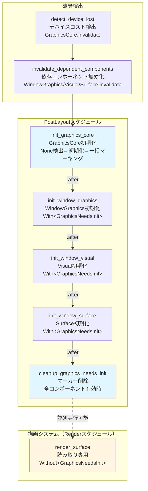
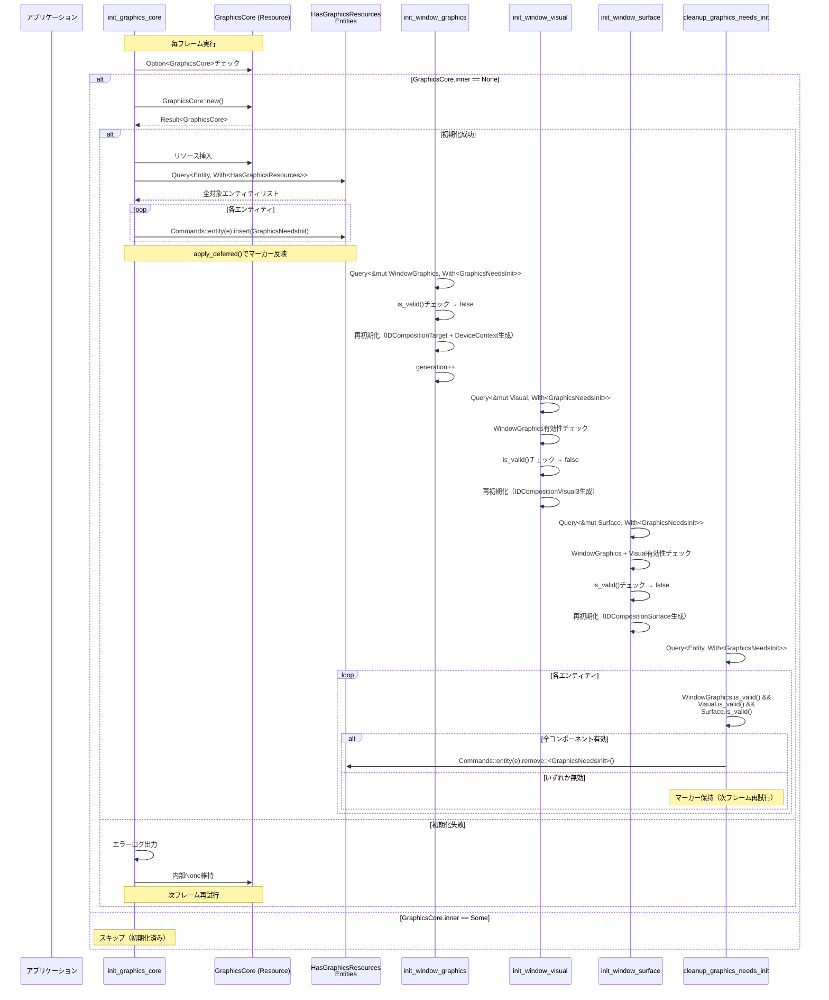
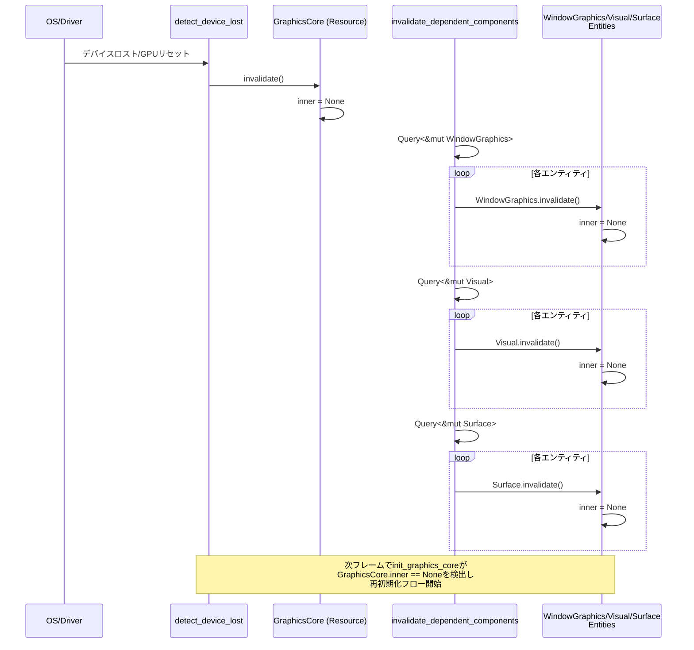
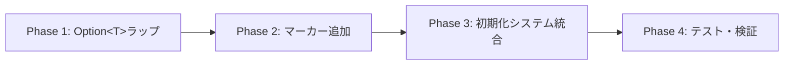

# 設計書: GraphicsCore再初期化システム

## Overview

本機能は、wintfライブラリにおけるGraphicsCoreリソース（DirectComposition、Direct2D、Direct3D11デバイス）の破棄・再初期化をECSアーキテクチャの整合性を保ちながら安全に実行する仕組みを実装します。デバイスロスト、GPUリセット、ウィンドウの再作成などの状況で、アプリケーションが安定して動作し続けることを保証します。

**Purpose**: GraphicsCore破棄時に依存コンポーネント（WindowGraphics、Visual、Surface）を自動的に再初期化し、描画機能を復旧させる。

**Users**: wintfライブラリを使用するアプリケーション開発者。デバイスロストやGPUリセットが発生した際、アプリケーション側で特別な処理を実装せずとも自動的に復旧する。

**Impact**: 現在の実装（警告表示のみ）を、ECS統合された完全な再初期化システムに置き換える。既存のコンポーネント（WindowGraphics、Visual、Surface）の内部構造を`Option<T>`でラップする変更が必要。

### Goals
- GraphicsCore破棄を検出し、依存コンポーネントを自動的に無効化
- GraphicsCore再初期化時に全依存エンティティを一括マーキングし、順次再初期化
- 論理コンポーネント（ECS Entity/Component）が保持されている限り、グラフィックスリソースの完全復元を実現
- Bevy ECS 0.17.2のスケジューリング最適化を活用した並列実行の実現
- 新Widget追加時にシステム変更不要な拡張性の確保

### Non-Goals
- GraphicsCore破棄の原因特定や防止策（OS/ドライバレベルの問題）
- リアルタイム性能要求（1フレームの遅延を許容）
- Visual/SurfaceからVisualGraphics/SurfaceGraphicsへの命名変更（将来の対応）
- スケジュール最適化（GraphicsSetupスケジュールの追加等は別仕様で検討）

## Architecture

### Existing Architecture Analysis

**現在のアーキテクチャ**:
- ECS基盤: bevy_ecs 0.17.2によるEntity-Component-System設計
- スケジュール: Input → Update → PreLayout → Layout → PostLayout → UISetup → Draw → Render → RenderSurface → Composition → CommitComposition
  - 注記: グラフィックス初期化専用のGraphicsSetupスケジュール（UISetup → GraphicsSetup → Draw）の追加は将来的な最適化として検討可能。本仕様ではPostLayoutスケジュールを使用。
- GraphicsCore: Direct3D11、DXGI、Direct2D、DirectWrite、DirectCompositionデバイスを保持するResourceコンポーネント
- グラフィックスコンポーネント: WindowGraphics（CompositionTarget + DeviceContext）、Visual（IDCompositionVisual3）、Surface（IDCompositionSurface）
- システム配置: PostLayoutスケジュールでcreate_window_graphics、create_window_visual、create_window_surfaceが順次実行

**制約**:
- GraphicsCoreはbevy_ecsのResourceとして管理（単一インスタンス）
- WindowsグラフィックスAPIの依存関係: GraphicsCore → WindowGraphics → Visual → Surface（カスケード構造）
- COMオブジェクトのライフタイム管理: windows-rsのスマートポインタに依存
- 既存の描画システム（RenderSurface、Compositionスケジュール）は読み取り専用アクセス

### Architecture Pattern & Boundary Map



**Architecture Integration**:
- **選択パターン**: Marker Component Pattern（2マーカー戦略）
- **ドメイン境界**: 
  - GraphicsCore初期化層: init_graphics_core（一括マーキング責務）
  - コンポーネント初期化層: init_window_graphics、init_window_visual、init_window_surface（個別初期化責務）
  - クリーンアップ層: cleanup_graphics_needs_init（初期化完了判定責務）
- **既存パターン維持**: PostLayoutスケジュールでの順次実行、依存関係チェーン（.after()による明示的順序）
- **新規コンポーネント**:
  - HasGraphicsResources: グラフィックスリソース使用を宣言（静的マーカー、spawn時付与、永続）
  - GraphicsNeedsInit: 初期化が必要な状態を示す（動的マーカー、初期化時追加、完了時削除）
- **Steering準拠**: 
  - レイヤードアーキテクチャ維持（COM → ECS → Message Handling）
  - 型安全性（Option<T>パターン、マーカーコンポーネント）
  - ECSアーキテクチャのベストプラクティス（並列実行最適化）

### Technology Stack

| Layer | Choice / Version | Role in Feature | Notes |
|-------|------------------|-----------------|-------|
| ECS Framework | bevy_ecs 0.17.2 | コンポーネント・システム基盤 | Archetype-levelクエリ最適化を活用 |
| Graphics API | DirectComposition, Direct2D, Direct3D11 | グラフィックスリソース管理 | windows-rs 0.62.1経由でアクセス |
| State Management | Option<T> (Rust std) | コンポーネント無効化表現 | 型安全な「値がない」表現 |
| Marker Components | bevy_ecs Component | 初期化状態管理 | HasGraphicsResources + GraphicsNeedsInit |
| Scheduling | bevy_ecs Schedule | システム実行順序制御 | PostLayoutスケジュール、.after()依存関係 |

**技術選定の根拠**:
- **bevy_ecs 0.17.2**: 既存コードベースで使用中。Archetype-level最適化により、With/Without<T>フィルタで高速なクエリ実行が可能。
- **Option<T>**: Rust標準ライブラリの型。型安全に「値がない」を表現でき、メモリ効率も良い（None時はスマートポインタ解放）。
- **2マーカー戦略**: 拡張性（新Widget追加時にシステム変更不要）とパフォーマンス（Archetype最適化）を両立。詳細は`research.md`の「Architecture Pattern Evaluation」を参照。

## System Flows

### GraphicsCore初期化・再初期化フロー



**フロー説明**:
1. **init_graphics_core**: 毎フレーム実行。GraphicsCore.innerがNoneなら初期化開始。
2. **一括マーキング**: 初期化成功時、`Query<Entity, With<HasGraphicsResources>>`で全対象エンティティを取得し、`GraphicsNeedsInit`マーカーを一括追加。
3. **順次初期化**: apply_deferred()後、init_window_graphics → init_window_visual → init_window_surfaceが.after()依存で順次実行。各システムはWith<GraphicsNeedsInit>クエリで対象を限定。
4. **クリーンアップ**: cleanup_graphics_needs_initが全コンポーネントの有効性をチェックし、有効なら`GraphicsNeedsInit`マーカーを削除。
5. **エラーハンドリング**: 初期化失敗時はエラーログ出力し、内部Noneを維持して次フレーム再試行。

### 破棄検出・無効化フロー



**フロー説明**:
1. **破棄検出**: OS/Driverレベルのイベント（デバイスロスト、GPUリセット）をdetect_device_lostシステムが検出。
2. **GraphicsCore無効化**: GraphicsCore.invalidate()を呼び出し、内部データをNoneに設定。
3. **依存コンポーネント無効化**: invalidate_dependent_componentsシステムが全WindowGraphics、Visual、Surfaceに対してinvalidate()を呼び出し。
4. **再初期化トリガー**: 次フレームのinit_graphics_coreがGraphicsCore.inner == Noneを検出し、初期化・再初期化フローを開始。

## Requirements Traceability

| Requirement | Summary | Components | Interfaces | Flows |
|-------------|---------|------------|------------|-------|
| 1-1 | GraphicsCore破棄検知 | detect_device_lost, GraphicsCore | GraphicsCore.invalidate() | 破棄検出・無効化フロー |
| 1-2 | 2マーカーパターン | HasGraphicsResources, GraphicsNeedsInit, WindowGraphics, Visual, Surface | Component.invalidate(), is_valid() | 初期化・再初期化フロー |
| 2 | GraphicsCore初期化システム | init_graphics_core | GraphicsCore::new() | 初期化・再初期化フロー |
| 3-1 | WindowGraphics初期化 | init_window_graphics | WindowGraphics::new() | 初期化・再初期化フロー |
| 3-2 | 参照システム分離 | render_surface | Query<&T, Without<GraphicsNeedsInit>> | 並列実行最適化 |
| 4-1 | Visual初期化 | init_window_visual | Visual::new() | 初期化・再初期化フロー |
| 4-2 | Surface初期化 | init_window_surface | Surface::new() | 初期化・再初期化フロー |
| 4-3 | 初期化順序制御 | init_graphics_core, init_window_graphics, init_window_visual, init_window_surface, cleanup_graphics_needs_init | Schedule.add_systems().after() | 初期化・再初期化フロー |
| 5-1 | Changed検出 | WindowGraphics, Visual, Surface | invalidate(), Bevy ECS Changed<T> | 破棄検出・無効化フロー |
| 5-2 | ECS整合性 | 全初期化システム、render_surface | Query<&mut T, With<M>>, Query<&T, Without<M>> | 並列実行最適化 |
| 6 | エラーハンドリング | init_graphics_core, init_window_graphics, init_window_visual, init_window_surface | Result<T>, エラーログ | 初期化・再初期化フロー |
| 7-1 | 検証済みテスト | N/A（テストコード） | N/A | N/A（検証完了） |
| 7-2 | 本番コードテスト | N/A（将来実装） | N/A | N/A（設計後） |

## Components and Interfaces

### コンポーネント概要

| Component | Domain/Layer | Intent | Req Coverage | Key Dependencies (Criticality) | Contracts |
|-----------|--------------|--------|--------------|-------------------------------|-----------|
| HasGraphicsResources | ECS / Marker | グラフィックスリソース使用を宣言（静的） | 1-2, 5-2 | なし | Marker |
| GraphicsNeedsInit | ECS / Marker | 初期化が必要な状態を示す（動的） | 1-2, 5-2 | なし | Marker |
| GraphicsCore | ECS / Resource | DirectComposition/D2D/D3D11デバイス管理 | 1-1, 2 | windows-rs (P0) | Resource, State |
| WindowGraphics | ECS / Component | CompositionTarget + DeviceContext管理 | 3-1, 3-2 | GraphicsCore (P0) | Component, State |
| Visual | ECS / Component | IDCompositionVisual3管理 | 4-1 | WindowGraphics (P0) | Component, State |
| Surface | ECS / Component | IDCompositionSurface管理 | 4-2 | WindowGraphics (P0), Visual (P0) | Component, State |
| init_graphics_core | ECS / System | GraphicsCore初期化・一括マーキング | 2, 4-3 | GraphicsCore (P0), HasGraphicsResources (P0) | System |
| init_window_graphics | ECS / System | WindowGraphics初期化・再初期化 | 3-1, 3-2, 4-3 | GraphicsCore (P0), WindowHandle (P0) | System |
| init_window_visual | ECS / System | Visual初期化・再初期化 | 4-1, 4-3 | WindowGraphics (P0) | System |
| init_window_surface | ECS / System | Surface初期化・再初期化 | 4-2, 4-3 | WindowGraphics (P0), Visual (P0) | System |
| cleanup_graphics_needs_init | ECS / System | マーカー削除・初期化完了判定 | 4-3, 5-2 | WindowGraphics (P0), Visual (P0), Surface (P0) | System |
| detect_device_lost | ECS / System | デバイスロスト検出 | 1-1 | GraphicsCore (P0) | System |
| invalidate_dependent_components | ECS / System | 依存コンポーネント無効化 | 1-1, 5-1 | WindowGraphics (P0), Visual (P0), Surface (P0) | System |

### ECS / Marker Components

#### HasGraphicsResources

| Field | Detail |
|-------|--------|
| Intent | グラフィックスリソースを使用するエンティティを宣言（静的マーカー） |
| Requirements | 1-2, 5-2 |

**Responsibilities & Constraints**
- グラフィックスリソース使用を宣言する静的マーカー
- spawn時に付与され、エンティティのライフタイム全体で永続
- 新Widget追加時、spawn時にこのマーカーを付与するだけで自動的に再初期化フローに統合

**Dependencies**
- なし（マーカーコンポーネント）

**Contracts**: Marker [x]

##### Marker Definition
```rust
#[derive(Component, Default)]
pub struct HasGraphicsResources;
```

**Implementation Notes**
- spawn時に`commands.entity(entity).insert(HasGraphicsResources)`で付与
- 削除はエンティティdespawn時のみ
- `Query<Entity, With<HasGraphicsResources>>`で全対象エンティティを一括検出

#### GraphicsNeedsInit

| Field | Detail |
|-------|--------|
| Intent | 初期化が必要な状態を示す動的マーカー |
| Requirements | 1-2, 5-2 |

**Responsibilities & Constraints**
- 初期化が必要な状態を示す動的マーカー
- GraphicsCore初期化/再初期化時に追加
- cleanup_graphics_needs_initシステムが全コンポーネント有効時に削除

**Dependencies**
- なし（マーカーコンポーネント）

**Contracts**: Marker [x]

##### Marker Definition
```rust
#[derive(Component, Default)]
pub struct GraphicsNeedsInit;
```

**Implementation Notes**
- init_graphics_coreが初期化完了時に`commands.entity(entity).insert(GraphicsNeedsInit)`で追加
- cleanup_graphics_needs_initが`commands.entity(entity).remove::<GraphicsNeedsInit>()`で削除
- `Query<Entity, With<GraphicsNeedsInit>>`で初期化対象を限定

### ECS / Resource

#### GraphicsCore

| Field | Detail |
|-------|--------|
| Intent | DirectComposition、Direct2D、Direct3D11デバイスの一元管理 |
| Requirements | 1-1, 2 |
| Owner / Reviewers | グラフィックスチーム |

**Responsibilities & Constraints**
- Windows グラフィックスAPIデバイスの作成・保持・破棄
- 内部データを`Option<T>`でラップし、破棄時はNoneに設定
- 単一インスタンス（bevy_ecs Resource）

**Dependencies**
- External: windows-rs 0.62.1 — Windows API バインディング (P0)
- External: DirectComposition, Direct2D, Direct3D11 — Windows グラフィックスAPI (P0)

**Contracts**: Resource [x] / State [x]

##### Resource Interface
```rust
#[derive(Resource)]
pub struct GraphicsCore {
    inner: Option<GraphicsCoreInner>,
}

struct GraphicsCoreInner {
    pub d3d: ID3D11Device,
    pub dxgi: IDXGIDevice4,
    pub d2d_factory: ID2D1Factory,
    pub d2d: ID2D1Device,
    pub dwrite_factory: IDWriteFactory2,
    pub desktop: IDCompositionDesktopDevice,
    pub dcomp: IDCompositionDevice3,
}

impl GraphicsCore {
    pub fn new() -> Result<Self>;
    pub fn invalidate(&mut self);
    pub fn is_valid(&self) -> bool;
    pub fn d2d_factory(&self) -> Option<&ID2D1Factory>;
    pub fn d2d_device(&self) -> Option<&ID2D1Device>;
    pub fn dcomp(&self) -> Option<&IDCompositionDevice3>;
}
```

- **new()**: DirectComposition、Direct2D、Direct3D11デバイスを作成。失敗時はエラーを返す。
- **invalidate()**: 内部データをNoneに設定。COMオブジェクトは自動的に解放される。
- **is_valid()**: 内部データがSomeならtrue、Noneならfalse。
- **アクセサメソッド**: 内部データがSomeならSome(&T)、NoneならNone。

##### State Management
- **State model**: Option<GraphicsCoreInner>（Valid: Some、Invalid: None）
- **Persistence**: bevy_ecs Resourceとして単一インスタンス管理
- **Concurrency**: unsafe impl Send/Sync（windows-rsのスマートポインタはスレッドセーフ）

**Implementation Notes**
- **Integration**: 既存のGraphicsCore実装を`Option<T>`ラップに変更
- **Validation**: new()時にD3D_FEATURE_LEVELをチェック、BGRAサポート必須
- **Risks**: デバイス作成失敗時はNone維持で次フレーム再試行（無限ループリスクあり、将来的に回数制限を検討）

### ECS / Components

#### WindowGraphics

| Field | Detail |
|-------|--------|
| Intent | IDCompositionTarget + ID2D1DeviceContextの管理 |
| Requirements | 3-1, 3-2 |

**Responsibilities & Constraints**
- HWNDに対するCompositionTargetとDeviceContextの作成・保持
- 内部データを`Option<T>`でラップし、無効化時はNoneに設定
- 世代番号（generation）で初期化回数を追跡

**Dependencies**
- Inbound: init_window_graphics — 初期化・再初期化 (P0)
- Outbound: GraphicsCore — デバイス取得 (P0)

**Contracts**: Component [x] / State [x]

##### Component Definition
```rust
#[derive(Component)]
pub struct WindowGraphics {
    inner: Option<WindowGraphicsInner>,
    generation: u32,
}

struct WindowGraphicsInner {
    pub target: IDCompositionTarget,
    pub context: ID2D1DeviceContext,
}

impl WindowGraphics {
    pub fn new(graphics: &GraphicsCore, hwnd: HWND) -> Result<Self>;
    pub fn invalidate(&mut self);
    pub fn is_valid(&self) -> bool;
    pub fn generation(&self) -> u32;
    pub fn target(&self) -> Option<&IDCompositionTarget>;
    pub fn context(&self) -> Option<&ID2D1DeviceContext>;
}
```

- **new()**: GraphicsCoreからデバイスを取得し、HWNDに対するCompositionTarget + DeviceContextを作成。
- **invalidate()**: 内部データをNoneに設定、世代番号はそのまま。
- **is_valid()**: 内部データがSomeならtrue。
- **generation()**: 初期化回数（再初期化毎にインクリメント）。

##### State Management
- **State model**: Option<WindowGraphicsInner>（Valid: Some、Invalid: None）
- **Persistence**: エンティティに紐づくComponentとして管理
- **Concurrency**: unsafe impl Send/Sync（windows-rsのスマートポインタはスレッドセーフ）

**Implementation Notes**
- **Integration**: 既存のWindowGraphics実装を`Option<T>`ラップに変更、generation追加
- **Validation**: 初期化時にGraphicsCore有効性チェック、HWNDの有効性チェック
- **Risks**: HWND無効時の初期化失敗（エラーログ出力、マーカー保持で次フレーム再試行）

#### Visual

| Field | Detail |
|-------|--------|
| Intent | IDCompositionVisual3の管理 |
| Requirements | 4-1 |

**Responsibilities & Constraints**
- IDCompositionVisual3の作成・保持
- WindowGraphicsに依存（CompositionTargetに設定）
- 内部データを`Option<T>`でラップし、無効化時はNoneに設定

**Dependencies**
- Inbound: init_window_visual — 初期化・再初期化 (P0)
- Outbound: WindowGraphics — CompositionTarget取得 (P0)

**Contracts**: Component [x] / State [x]

##### Component Definition
```rust
#[derive(Component)]
pub struct Visual {
    inner: Option<IDCompositionVisual3>,
}

impl Visual {
    pub fn new(graphics: &GraphicsCore, window_graphics: &WindowGraphics) -> Result<Self>;
    pub fn invalidate(&mut self);
    pub fn is_valid(&self) -> bool;
    pub fn visual(&self) -> Option<&IDCompositionVisual3>;
}
```

- **new()**: GraphicsCoreからDCompositionDeviceを取得し、Visual作成。WindowGraphicsのCompositionTargetにSetRootで設定。
- **invalidate()**: 内部データをNoneに設定。
- **is_valid()**: 内部データがSomeならtrue。

##### State Management
- **State model**: Option<IDCompositionVisual3>（Valid: Some、Invalid: None）
- **Persistence**: エンティティに紐づくComponentとして管理
- **Concurrency**: unsafe impl Send/Sync

**Implementation Notes**
- **Integration**: 既存のVisual実装を`Option<T>`ラップに変更
- **Validation**: 初期化時にWindowGraphics有効性チェック
- **Risks**: WindowGraphics無効時は初期化スキップ（依存関係保証）

#### Surface

| Field | Detail |
|-------|--------|
| Intent | IDCompositionSurfaceの管理 |
| Requirements | 4-2 |

**Responsibilities & Constraints**
- IDCompositionSurfaceの作成・保持
- WindowGraphicsとVisualに依存
- 内部データを`Option<T>`でラップし、無効化時はNoneに設定

**Dependencies**
- Inbound: init_window_surface — 初期化・再初期化 (P0)
- Outbound: WindowGraphics — DCompositionDevice取得 (P0)
- Outbound: Visual — SetContent設定 (P0)

**Contracts**: Component [x] / State [x]

##### Component Definition
```rust
#[derive(Component)]
pub struct Surface {
    inner: Option<IDCompositionSurface>,
}

impl Surface {
    pub fn new(
        graphics: &GraphicsCore,
        window_graphics: &WindowGraphics,
        visual: &Visual,
        size: (u32, u32)
    ) -> Result<Self>;
    pub fn invalidate(&mut self);
    pub fn is_valid(&self) -> bool;
    pub fn surface(&self) -> Option<&IDCompositionSurface>;
}
```

- **new()**: GraphicsCoreからDCompositionDeviceを取得し、Surface作成。VisualにSetContentで設定。
- **invalidate()**: 内部データをNoneに設定。
- **is_valid()**: 内部データがSomeならtrue。

##### State Management
- **State model**: Option<IDCompositionSurface>（Valid: Some、Invalid: None）
- **Persistence**: エンティティに紐づくComponentとして管理
- **Concurrency**: unsafe impl Send/Sync

**Implementation Notes**
- **Integration**: 既存のSurface実装を`Option<T>`ラップに変更
- **Validation**: 初期化時にWindowGraphicsとVisual両方の有効性チェック
- **Risks**: いずれか無効時は初期化スキップ（依存関係保証）

### ECS / Systems

#### init_graphics_core

| Field | Detail |
|-------|--------|
| Intent | GraphicsCore初期化・再初期化・一括マーキング |
| Requirements | 2, 4-3 |

**Responsibilities & Constraints**
- 毎フレーム実行、GraphicsCore.innerがNoneなら初期化開始
- 初期化成功時、全HasGraphicsResourcesエンティティへGraphicsNeedsInitを一括追加
- PostLayoutスケジュールの最初に実行

**Dependencies**
- Inbound: なし（毎フレーム自動実行）
- Outbound: GraphicsCore — 初期化対象 (P0)
- Outbound: HasGraphicsResources — 対象エンティティ検出 (P0)

**Contracts**: System [x]

##### System Interface
```rust
pub fn init_graphics_core(
    graphics: Option<ResMut<GraphicsCore>>,
    query: Query<Entity, With<HasGraphicsResources>>,
    mut commands: Commands,
) {
    // GraphicsCore.innerがNoneなら初期化
    // 初期化成功時、query.iter()で全エンティティに
    // commands.entity(entity).insert(GraphicsNeedsInit)
}
```

- **Preconditions**: なし（毎フレーム実行）
- **Postconditions**: GraphicsCore.inner == Some、全HasGraphicsResourcesエンティティにGraphicsNeedsInit追加
- **Invariants**: GraphicsCore.innerがSomeなら何もしない

**Implementation Notes**
- **Integration**: PostLayoutスケジュールの最初に追加（`.add_systems(PostLayout, init_graphics_core)`）
- **Validation**: GraphicsCore::new()のResult<T>をmatchでハンドリング
- **Risks**: 初期化失敗時はエラーログ出力、内部None維持で次フレーム再試行（無限ループリスク）

#### init_window_graphics

| Field | Detail |
|-------|--------|
| Intent | WindowGraphics初期化・再初期化 |
| Requirements | 3-1, 3-2, 4-3 |

**Responsibilities & Constraints**
- 新規作成（WindowHandle存在、WindowGraphics不在）と再初期化（GraphicsNeedsInit存在、WindowGraphics無効）を統一処理
- is_valid()チェックで有効ならスキップ
- 初期化成功時、generationインクリメント

**Dependencies**
- Inbound: init_graphics_core — GraphicsCore初期化後実行 (P0)
- Outbound: GraphicsCore — デバイス取得 (P0)
- Outbound: WindowHandle — HWND取得 (P0)

**Contracts**: System [x]

##### System Interface
```rust
pub fn init_window_graphics(
    graphics: Res<GraphicsCore>,
    mut query: Query<
        (Entity, &WindowHandle, Option<&mut WindowGraphics>),
        With<GraphicsNeedsInit>
    >,
) {
    for (entity, handle, window_graphics) in query.iter_mut() {
        match window_graphics {
            None => {
                // 新規作成
            }
            Some(mut wg) if !wg.is_valid() => {
                // 再初期化
                // generation++
            }
            Some(_) => {
                // 有効ならスキップ
            }
        }
    }
}
```

- **Preconditions**: GraphicsCore有効
- **Postconditions**: WindowGraphics有効
- **Invariants**: WindowHandle必須

**Implementation Notes**
- **Integration**: `.add_systems(PostLayout, init_window_graphics.after(init_graphics_core))`
- **Validation**: GraphicsCore.is_valid()チェック、WindowHandle有効性チェック
- **Risks**: GraphicsCore無効時はスキップ、エラーログ出力

#### init_window_visual

| Field | Detail |
|-------|--------|
| Intent | Visual初期化・再初期化 |
| Requirements | 4-1, 4-3 |

**Responsibilities & Constraints**
- 新規作成と再初期化を統一処理
- WindowGraphics有効性チェック（無効ならスキップ）
- is_valid()チェックで有効ならスキップ

**Dependencies**
- Inbound: init_window_graphics — WindowGraphics初期化後実行 (P0)
- Outbound: GraphicsCore — デバイス取得 (P0)
- Outbound: WindowGraphics — CompositionTarget取得 (P0)

**Contracts**: System [x]

##### System Interface
```rust
pub fn init_window_visual(
    graphics: Res<GraphicsCore>,
    mut query: Query<
        (Entity, &WindowGraphics, Option<&mut Visual>),
        With<GraphicsNeedsInit>
    >,
) {
    for (entity, window_graphics, visual) in query.iter_mut() {
        if !window_graphics.is_valid() {
            // WindowGraphics無効ならスキップ
            continue;
        }
        
        match visual {
            None => {
                // 新規作成
            }
            Some(mut v) if !v.is_valid() => {
                // 再初期化
            }
            Some(_) => {
                // 有効ならスキップ
            }
        }
    }
}
```

- **Preconditions**: GraphicsCore有効、WindowGraphics有効
- **Postconditions**: Visual有効
- **Invariants**: WindowGraphics有効性依存

**Implementation Notes**
- **Integration**: `.add_systems(PostLayout, init_window_visual.after(init_window_graphics))`
- **Validation**: WindowGraphics.is_valid()チェック
- **Risks**: WindowGraphics無効時はスキップ（依存関係保証）

#### init_window_surface

| Field | Detail |
|-------|--------|
| Intent | Surface初期化・再初期化 |
| Requirements | 4-2, 4-3 |

**Responsibilities & Constraints**
- 新規作成と再初期化を統一処理
- WindowGraphicsとVisual両方の有効性チェック（いずれか無効ならスキップ）
- is_valid()チェックで有効ならスキップ

**Dependencies**
- Inbound: init_window_visual — Visual初期化後実行 (P0)
- Outbound: GraphicsCore — デバイス取得 (P0)
- Outbound: WindowGraphics — DCompositionDevice取得 (P0)
- Outbound: Visual — SetContent設定 (P0)

**Contracts**: System [x]

##### System Interface
```rust
pub fn init_window_surface(
    graphics: Res<GraphicsCore>,
    mut query: Query<
        (Entity, &WindowGraphics, &Visual, Option<&mut Surface>),
        With<GraphicsNeedsInit>
    >,
) {
    for (entity, window_graphics, visual, surface) in query.iter_mut() {
        if !window_graphics.is_valid() || !visual.is_valid() {
            // いずれか無効ならスキップ
            continue;
        }
        
        match surface {
            None => {
                // 新規作成
            }
            Some(mut s) if !s.is_valid() => {
                // 再初期化
            }
            Some(_) => {
                // 有効ならスキップ
            }
        }
    }
}
```

- **Preconditions**: GraphicsCore有効、WindowGraphics有効、Visual有効
- **Postconditions**: Surface有効
- **Invariants**: WindowGraphicsとVisual両方の有効性依存

**Implementation Notes**
- **Integration**: `.add_systems(PostLayout, init_window_surface.after(init_window_visual))`
- **Validation**: WindowGraphics.is_valid()とVisual.is_valid()チェック
- **Risks**: いずれか無効時はスキップ（依存関係保証）

#### cleanup_graphics_needs_init

| Field | Detail |
|-------|--------|
| Intent | GraphicsNeedsInitマーカー削除・初期化完了判定 |
| Requirements | 4-3, 5-2 |

**Responsibilities & Constraints**
- 全初期化システム後に実行
- 各エンティティのWindowGraphics、Visual、Surfaceすべてが有効な場合のみマーカー削除
- いずれか無効ならマーカー保持（次フレーム再試行）

**Dependencies**
- Inbound: init_window_surface — 全初期化システム完了後実行 (P0)
- Outbound: WindowGraphics — 有効性チェック (P0)
- Outbound: Visual — 有効性チェック (P0)
- Outbound: Surface — 有効性チェック (P0)

**Contracts**: System [x]

##### System Interface
```rust
pub fn cleanup_graphics_needs_init(
    mut query: Query<
        (Entity, &WindowGraphics, &Visual, &Surface),
        With<GraphicsNeedsInit>
    >,
    mut commands: Commands,
) {
    for (entity, window_graphics, visual, surface) in query.iter() {
        if window_graphics.is_valid() && visual.is_valid() && surface.is_valid() {
            commands.entity(entity).remove::<GraphicsNeedsInit>();
        }
        // いずれか無効ならマーカー保持
    }
}
```

- **Preconditions**: 全初期化システム実行完了
- **Postconditions**: 全コンポーネント有効ならGraphicsNeedsInit削除
- **Invariants**: いずれか無効ならマーカー保持

**Implementation Notes**
- **Integration**: `.add_systems(PostLayout, cleanup_graphics_needs_init.after(init_window_surface))`
- **Validation**: 各コンポーネントのis_valid()チェック
- **Risks**: 新Widget追加時、このシステムに新コンポーネントの有効性チェックを追加必要（将来的にOption<&T>パターンで拡張性向上を検討）

#### detect_device_lost

| Field | Detail |
|-------|--------|
| Intent | デバイスロスト検出 |
| Requirements | 1-1 |

**Responsibilities & Constraints**
- OS/Driverレベルのイベントをポーリングまたはコールバックで検出
- GraphicsCore.invalidate()呼び出し
- 毎フレーム実行（1フレーム遅延許容）

**Dependencies**
- Outbound: GraphicsCore — 無効化対象 (P0)

**Contracts**: System [x]

##### System Interface
```rust
pub fn detect_device_lost(
    mut graphics: Option<ResMut<GraphicsCore>>,
) {
    if let Some(mut gc) = graphics {
        // デバイスロスト検出ロジック
        // （例: IDXGIDevice::GetGPUThreadPriority() HRESULT チェック）
        if device_lost_detected {
            gc.invalidate();
        }
    }
}
```

- **Preconditions**: なし（毎フレーム実行）
- **Postconditions**: デバイスロスト検出時、GraphicsCore.inner == None
- **Invariants**: GraphicsCore存在前提

**Implementation Notes**
- **Integration**: Updateスケジュールで実行（PostLayoutより前）
- **Validation**: Windows API HRESULTチェック、特定エラーコード（DXGI_ERROR_DEVICE_REMOVED等）検出
- **Risks**: デバイスロスト検出ロジックの実装複雑性（将来的に実装、現状はプレースホルダー）

#### invalidate_dependent_components

| Field | Detail |
|-------|--------|
| Intent | 依存コンポーネント無効化 |
| Requirements | 1-1, 5-1 |

**Responsibilities & Constraints**
- GraphicsCore無効化時、全WindowGraphics、Visual、Surfaceに対してinvalidate()呼び出し
- Bevy ECS Changed<T>検出機構を活用

**Dependencies**
- Outbound: WindowGraphics — 無効化対象 (P0)
- Outbound: Visual — 無効化対象 (P0)
- Outbound: Surface — 無効化対象 (P0)

**Contracts**: System [x]

##### System Interface
```rust
pub fn invalidate_dependent_components(
    graphics: Option<Res<GraphicsCore>>,
    mut window_graphics_query: Query<&mut WindowGraphics>,
    mut visual_query: Query<&mut Visual>,
    mut surface_query: Query<&mut Surface>,
) {
    if let Some(gc) = graphics {
        if !gc.is_valid() {
            for mut wg in window_graphics_query.iter_mut() {
                wg.invalidate();
            }
            for mut v in visual_query.iter_mut() {
                v.invalidate();
            }
            for mut s in surface_query.iter_mut() {
                s.invalidate();
            }
        }
    }
}
```

- **Preconditions**: GraphicsCore無効化済み
- **Postconditions**: 全依存コンポーネント無効化
- **Invariants**: GraphicsCore.is_valid() == false時のみ実行

**Implementation Notes**
- **Integration**: Updateスケジュールでdetect_device_lostの後に実行（`.after(detect_device_lost)`）
- **Validation**: GraphicsCore.is_valid()チェック
- **Risks**: 大量のエンティティ存在時のパフォーマンス（Query::iter_mut()のコスト）

## Data Models

本機能ではデータモデルの変更は最小限です。既存のGraphicsCore、WindowGraphics、Visual、Surfaceの内部データを`Option<T>`でラップする変更のみです。

### Domain Model

- **GraphicsCore**: DirectComposition/D2D/D3D11デバイスの集約ルート。内部データ（GraphicsCoreInner）をOption<T>でラップ。
- **WindowGraphics**: HWNDに紐づくCompositionTarget + DeviceContextの集約。内部データ（WindowGraphicsInner）をOption<T>でラップ、generation追加。
- **Visual**: IDCompositionVisual3の集約。内部データをOption<T>でラップ。
- **Surface**: IDCompositionSurfaceの集約。内部データをOption<T>でラップ。

**ビジネスルール**:
- GraphicsCore無効時、全依存コンポーネントも無効化必須
- コンポーネント初期化は依存関係順（GraphicsCore → WindowGraphics → Visual → Surface）
- マーカー削除は全コンポーネント有効時のみ

### Logical Data Model

**Structure Definition**:
- GraphicsCore (1) --- (N) WindowGraphics: GraphicsCoreは複数のWindowGraphicsに参照される
- WindowGraphics (1) --- (1) Visual: WindowGraphicsは1つのVisualを持つ
- Visual (1) --- (1) Surface: Visualは1つのSurfaceを持つ
- Entity (1) --- (0..1) WindowGraphics: エンティティはWindowGraphicsを持つ場合がある
- Entity (1) --- (0..1) Visual: エンティティはVisualを持つ場合がある
- Entity (1) --- (0..1) Surface: エンティティはSurfaceを持つ場合がある
- Entity (1) --- (0..1) HasGraphicsResources: エンティティはHasGraphicsResourcesを持つ場合がある
- Entity (1) --- (0..1) GraphicsNeedsInit: エンティティはGraphicsNeedsInitを持つ場合がある

**Consistency & Integrity**:
- GraphicsCore無効化時、全依存コンポーネントも無効化（カスケード）
- コンポーネント有効性はis_valid()メソッドで検証
- マーカー追加・削除はCommandsバッファ経由（apply_deferred()後に反映）

### Physical Data Model

bevy_ecsのメモリレイアウトに準拠。Archetypeによる最適化。

**For ECS Components**:
- Component: Archetype内に連続配置（キャッシュ効率）
- Marker: ゼロサイズ型、Archetypeのビットマスクのみで表現
- Resource: 単一インスタンス、Worldに直接保持

**Indexing**:
- Query<&T, With<M>>: Archetypeのビットマスクでフィルタリング（O(1)）
- Query<Entity, With<HasGraphicsResources>>: Archetypeレベルで対象限定（高速）

## Error Handling

### Error Strategy

- **GraphicsCore初期化失敗**: エラーログ出力、内部None維持、次フレーム再試行
- **コンポーネント初期化失敗**: エラーログ出力、マーカー保持、次フレーム再試行
- **依存関係違反**: 初期化スキップ（例: WindowGraphics無効時、Visual初期化しない）
- **Panic回避**: 全エラーはResult<T>でハンドリング、unwrap()禁止

### Error Categories and Responses

**System Errors (5xx)**: 
- **DirectComposition/D2D/D3D11デバイス作成失敗**: `GraphicsCore::new()` → Err、エラーログ出力、次フレーム再試行
- **IDCompositionTarget作成失敗**: `WindowGraphics::new()` → Err、エラーログ出力、マーカー保持
- **IDCompositionVisual3作成失敗**: `Visual::new()` → Err、エラーログ出力、マーカー保持
- **IDCompositionSurface作成失敗**: `Surface::new()` → Err、エラーログ出力、マーカー保持

**Business Logic Errors (422)**:
- **依存コンポーネント無効**: 初期化スキップ、ログ出力（デバッグレベル）、次フレーム再試行

### Monitoring

- **Error tracking**: エラーログに詳細情報（HRESULT、エラーメッセージ、エンティティID）を出力
- **Logging**: 初期化の各ステップ（開始、進行中、完了、失敗）をログ記録
- **Health monitoring**: 再初期化の統計情報（成功数、失敗数、所要時間）を記録（将来実装）

## Testing Strategy

### Unit Tests
- GraphicsCore::new() — デバイス作成成功・失敗パターン
- GraphicsCore::invalidate() — 内部None設定、is_valid() == false確認
- WindowGraphics::new() — CompositionTarget + DeviceContext作成、generation初期化
- WindowGraphics::invalidate() — 内部None設定、generation維持確認
- Visual::new() — IDCompositionVisual3作成、CompositionTargetへのSetRoot確認
- Surface::new() — IDCompositionSurface作成、VisualへのSetContent確認

### Integration Tests
- **init_graphics_core → init_window_graphics → init_window_visual → init_window_surface → cleanup_graphics_needs_init**: 初期化フロー全体の動作確認
- **GraphicsCore破棄 → 依存コンポーネント無効化 → 再初期化フロー**: 破棄検出から再初期化までの統合確認
- **マーカー追加・削除タイミング**: apply_deferred()前後の状態確認
- **並列実行**: 初期化システム（With<GraphicsNeedsInit>）と描画システム（Without<GraphicsNeedsInit>）が並列実行されることを確認

### E2E/UI Tests
- **デバイスロスト模擬**: GraphicsCore.invalidate()を手動呼び出し、アプリケーションが復旧することを確認
- **複数ウィンドウの同時再初期化**: 複数エンティティが同時に再初期化されることを確認
- **新Widget追加**: HasGraphicsResourcesマーカーを持つ新Widgetを追加し、自動的に再初期化フローに統合されることを確認

### Performance/Load
- **大量エンティティ**: 1000個のHasGraphicsResourcesエンティティで再初期化パフォーマンス測定
- **Archetype最適化**: With/Without<T>クエリのイテレーション回数確認（Archetype-levelフィルタリング効果）
- **並列実行**: 初期化システムと描画システムの並列実行時間測定

## Security Considerations

本機能はセキュリティ影響は限定的ですが、以下の点に留意：

- **COMオブジェクトライフタイム**: windows-rsのスマートポインタによる安全な管理
- **unsafeブロック**: Windows API呼び出し時のみに限定、安全性を文書化
- **リソースリーク**: Option<T>によるNone設定時、COMオブジェクトは自動的にRelease呼び出し

## Performance & Scalability

- **Target metrics**: 
  - GraphicsCore初期化: 10ms以内（DirectComposition/D2D/D3D11デバイス作成）
  - コンポーネント初期化: 1ms以内/エンティティ（CompositionTarget/Visual/Surface作成）
  - マーカー一括追加: 1ms以内/1000エンティティ
- **Scaling approaches**: 
  - Bevy ECS Archetype-levelクエリ最適化により、大量エンティティでも高速
  - With/Without<T>フィルタで対象限定、不要なイテレーション回避
- **Caching strategies**: 
  - GraphicsCoreはResourceとして単一インスタンス管理、再作成のみ
  - WindowGraphics/Visual/SurfaceはComponentとしてエンティティ毎に保持、再初期化時のみ再作成

## Migration Strategy

既存コードベースへの影響を最小化するため、段階的な移行を推奨：



**Phase 1: Option<T>ラップ** (1-2日)
- GraphicsCore、WindowGraphics、Visual、Surfaceの内部データをOption<T>でラップ
- invalidate()、is_valid()メソッド追加
- 既存の初期化システムは変更せず、動作確認

**Phase 2: マーカー追加** (1日)
- HasGraphicsResources、GraphicsNeedsInitマーカーコンポーネント定義
- spawn時にHasGraphicsResourcesマーカーを付与
- 既存の初期化システムは変更せず、動作確認

**Phase 3: 初期化システム統合** (2-3日)
- init_graphics_core、init_window_graphics、init_window_visual、init_window_surface、cleanup_graphics_needs_initシステム実装
- PostLayoutスケジュールに統合、.after()依存関係設定
- 既存の初期化システムと並行稼働、動作確認

**Phase 4: テスト・検証** (2-3日)
- 統合テスト実装・実行
- 破棄検出・再初期化フロー確認
- パフォーマンス測定、Archetype最適化効果確認
- 既存の初期化システムを削除、新システムに完全移行

**Rollback triggers**: 
- GraphicsCore初期化が連続3回失敗 → Phase 3ロールバック
- パフォーマンス劣化（初期化時間2倍以上） → Phase 3ロールバック
- 既存機能の動作不良 → 該当Phaseロールバック

**Validation checkpoints**: 
- Phase 1完了時: 既存の描画機能が正常動作
- Phase 2完了時: マーカー付与が正常、既存の描画機能が正常動作
- Phase 3完了時: 新初期化システムが正常動作、既存の描画機能が正常動作
- Phase 4完了時: 全テスト合格、パフォーマンス要件達成

---

**設計書作成日**: 2025-11-16  
**最終更新日**: 2025-11-16  
**レビュー状況**: 初版（レビュー待ち）
