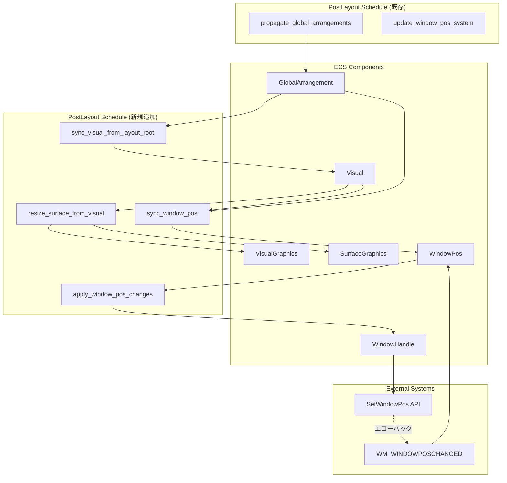
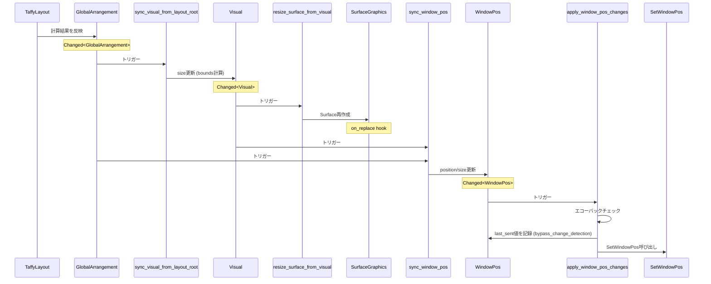
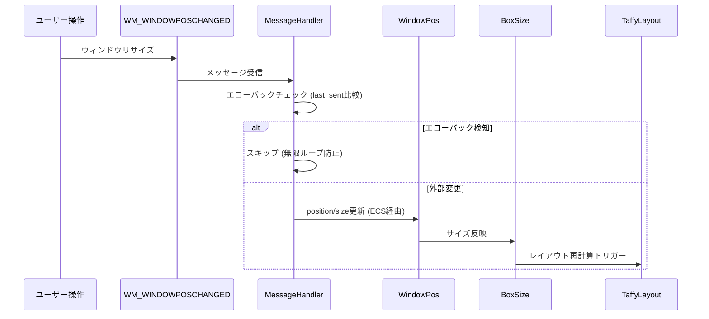
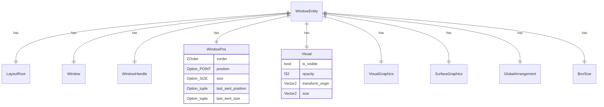

# Technical Design Document: Layout-to-Graphics Synchronization

## Overview

本機能は、wintfフレームワークにおいて、Taffyレイアウトエンジンの計算結果をDirectCompositionのグラフィックスリソース（Visual、Surface）およびWin32ウィンドウシステムに正確に伝播し、双方向同期を確立します。

現在、レイアウト計算結果（`GlobalArrangement`）が更新されても、`Visual.size`、`SurfaceGraphics`、`WindowPos`への伝播が実装されていないため、Surfaceサイズが不正確（782×553 vs 期待値800×600）になり、描画がはみ出る問題が発生しています。本設計では、4つの新規ECSシステムを`PostLayout`スケジュールに追加し、`GlobalArrangement`更新後の完全な伝播チェーンを確立します。

**Users**: wintfを使用するアプリケーション開発者が、レイアウト計算結果が正確にグラフィックスに反映されることを期待します。

**Impact**: 既存のPostLayoutスケジュールに4つの新規システムを追加し、`init_window_surface`システムを削除します。`Visual`コンポーネントと`WindowPos`コンポーネントに新規フィールドを追加し、`WM_WINDOWPOSCHANGED`メッセージハンドラーを実装します。

### Goals

- GlobalArrangement更新後、Visual→Surface→WindowPosへの自動伝播を実現
- ユーザー操作によるウィンドウリサイズの逆方向伝播（WindowPos→BoxSize）を実現
- エコーバック検知により無限ループを防止
- 冗長な`init_window_surface`システムを削除し、システム実行効率を改善
- Bevy ECS 0.14+の`PartialEq` derive変更検知最適化を活用

### Non-Goals

- アニメーション中のフレーム間補間処理
- 複数モニター環境でのDPI対応（別仕様で対応）
- ウィンドウの最小化・最大化時の特殊処理
- レイアウト計算のパフォーマンス最適化（別仕様）
- Visual階層の親子関係同期（別仕様: visual-tree-synchronization）

## Architecture

### Existing Architecture Analysis

wintfは、Bevy ECSをベースとしたスケジュールベースのシステム実行アーキテクチャを採用しています。以下の既存構造を前提とします：

- **ECSスケジュール**: `Input` → `Update` → `PreLayout` → `Layout` → **`PostLayout`** → `UISetup` → `Draw` → `RenderSurface` → `CommitComposition`
- **PostLayoutスケジュール**: レイアウト計算完了後の伝播・同期処理を担当
- **既存システムチェーン**: `propagate_global_arrangements` → `update_window_pos_system`（現在はダミー実装）
- **変更検知**: Bevy ECSの`Changed<T>`クエリによる自動最適化
- **コンポーネント階層**: 論理コンポーネント（`Visual`, `WindowPos`）とGPU資源（`VisualGraphics`, `SurfaceGraphics`）の分離

### Architecture Pattern & Boundary Map



**Architecture Integration**:

- **選択パターン**: ECSスケジュール拡張パターン（既存のPostLayoutスケジュールに4つのシステムを追加）
- **Domain境界**: レイアウト計算（Layout/PostLayout）とグラフィックス描画（Draw/RenderSurface）の境界を明確に維持
- **既存パターン維持**: `.after()`による依存関係チェーン、`Changed<T>`クエリによる変更検知
- **新規コンポーネント**: なし（既存コンポーネントへのフィールド追加のみ）
- **Steering準拠**: ECSアーキテクチャの単一責任原則、型安全性、レイヤー分離の維持

### Technology Stack

| Layer | Choice / Version | Role in Feature | Notes |
|-------|------------------|-----------------|-------|
| ECS Framework | bevy_ecs 0.17.2 | システムスケジューリング、変更検知 | `PartialEq` derive最適化を活用 |
| Graphics API | DirectComposition (Windows API) | Surfaceの再作成・設定 | `IDCompositionSurface`, `IDCompositionVisual3` |
| Window System | Win32 API | `SetWindowPos`, `WM_WINDOWPOSCHANGED` | エコーバック検知パターン実装 |
| Numerics | windows-numerics 0.3.1 | `Vector2` (Visual.size) | DirectComposition互換型 |
| Layout Engine | taffy 0.9.1 | レイアウト計算（既存統合） | `GlobalArrangement`の入力源 |

## System Flows

### 順方向フロー: Layout → Graphics → Window



### 逆方向フロー: Window → Layout (ユーザーリサイズ)



## Requirements Traceability

| Requirement | Summary | Components | Interfaces | Flows |
|-------------|---------|------------|------------|-------|
| 1 | Visual サイズ同期システム | `sync_visual_from_layout_root` | `GlobalArrangement` → `Visual` | 順方向 |
| 2 | Surface リサイズシステム | `resize_surface_from_visual` | `Visual` → `SurfaceGraphics` | 順方向 |
| 3 | WindowPos 同期システム | `sync_window_pos` | `GlobalArrangement`, `Visual` → `WindowPos` | 順方向 |
| 4 | エコーバック検知機構 | `WindowPos`フィールド拡張、`apply_window_pos_changes` | `last_sent_*`フィールド | 順方向・逆方向 |
| 5 | SetWindowPos 実行システム | `apply_window_pos_changes` | `WindowPos` → `SetWindowPos` | 順方向 |
| 6 | WM_WINDOWPOSCHANGED ハンドリング | `MessageHandler::WM_WINDOWPOSCHANGED` | `WINDOWPOS` → `WindowPos` | 逆方向 |
| 7 | レガシーコード削除 | `init_window_surface`削除、`GetClientRect`削除 | — | — |
| 8 | 変更検知最適化 | `Visual`への`PartialEq` derive | — | — |
| 9 | 双方向同期の確立 | 全システム統合 | 全フロー | 順方向・逆方向 |
| 10 | テスタビリティ | `WindowPos::is_echo`, テストコード | — | — |

## Components and Interfaces

### Summary

| Component | Domain/Layer | Intent | Req Coverage | Key Dependencies (P0/P1) | Contracts |
|-----------|--------------|--------|--------------|--------------------------|-----------|
| sync_visual_from_layout_root | Layout/PostLayout | GlobalArrangement → Visual同期 | 1, 9 | GlobalArrangement (P0), Visual (P0), LayoutRoot (P0) | [x] System |
| resize_surface_from_visual | Graphics/PostLayout | Visual → Surface同期 | 2, 9 | Visual (P0), VisualGraphics (P0), SurfaceGraphics (P0), GraphicsCore (P0) | [x] System |
| sync_window_pos | Window/PostLayout | Layout/Visual → WindowPos同期 | 3, 9 | GlobalArrangement (P0), Visual (P0), WindowPos (P0), Window (P0) | [x] System |
| apply_window_pos_changes | Window/PostLayout | WindowPos → SetWindowPos実行 | 5, 9 | WindowPos (P0), WindowHandle (P0), Win32 API (P0) | [x] System |
| MessageHandler::WM_WINDOWPOSCHANGED | Window/MessageLoop | 外部変更→WindowPos同期 | 6, 9 | WINDOWPOS (P0), WinState (P0) | [x] Event Handler |
| Visual (拡張) | Graphics/ECS | 論理Visualコンポーネント | 1, 8 | — | [x] State |
| WindowPos (拡張) | Window/ECS | ウィンドウ位置・サイズ管理 | 3, 4, 5 | — | [x] State |

### Layout / PostLayout Domain

#### sync_visual_from_layout_root

| Field | Detail |
|-------|--------|
| Intent | `LayoutRoot`マーカーを持つエンティティの`GlobalArrangement.bounds`から`Visual.size`を計算・更新 |
| Requirements | 1, 9 |

**Responsibilities & Constraints**

- `Changed<GlobalArrangement>`で自動トリガー
- `LayoutRoot`マーカーを持つエンティティのみ処理
- `Visual.size`への書き込みが新たに`Changed<Visual>`フラグを立てる

**Dependencies**

- Inbound: `propagate_global_arrangements` システム — GlobalArrangement更新の完了 (P0)
- Outbound: `Visual` コンポーネント — サイズ更新先 (P0)
- Query Filter: `LayoutRoot` マーカー — 処理対象の識別 (P0)

**Contracts**: [x] System

##### System Interface

```rust
pub fn sync_visual_from_layout_root(
    mut query: Query<
        (&GlobalArrangement, &mut Visual),
        (With<LayoutRoot>, Changed<GlobalArrangement>)
    >,
) {
    for (global_arr, mut visual) in query.iter_mut() {
        let width = (global_arr.bounds.right - global_arr.bounds.left) as f32;
        let height = (global_arr.bounds.bottom - global_arr.bounds.top) as f32;
        visual.size.X = width;
        visual.size.Y = height;
    }
}
```

**Implementation Notes**

- Integration: PostLayoutスケジュールの`propagate_global_arrangements`直後に登録
- Validation: widthとheightは常に正の値（Taffyレイアウトの保証）
- Risks: なし（単純な算術変換のみ）

### Graphics / PostLayout Domain

#### resize_surface_from_visual

| Field | Detail |
|-------|--------|
| Intent | `Visual.size`変更時にDirectComposition Surfaceを再作成 |
| Requirements | 2, 9 |

**Responsibilities & Constraints**

- `Changed<Visual>`で自動トリガー
- サイズが実際に異なる場合のみSurface再作成（最適化）
- Surface再作成時は`SurfaceGraphics`のon_replace hookで`SurfaceUpdateRequested`が自動追加される

**Dependencies**

- Inbound: `sync_visual_from_layout_root` システム — Visual更新の完了 (P0)
- Outbound: `VisualGraphics` コンポーネント — IDCompositionVisual3へのアクセス (P0)
- Outbound: `SurfaceGraphics` コンポーネント — Surface更新先 (P0)
- External: `GraphicsCore` リソース — DirectCompositionデバイス (P0)
- External: `create_surface_for_window` ヘルパー — Surface生成ロジック (P0)

**Contracts**: [x] System

##### System Interface

```rust
pub fn resize_surface_from_visual(
    graphics: Res<GraphicsCore>,
    mut query: Query<
        (Entity, &VisualGraphics, &Visual, &mut SurfaceGraphics),
        Changed<Visual>
    >,
    mut commands: Commands,
) {
    if !graphics.is_valid() {
        return;
    }

    for (entity, visual_graphics, visual, mut surface) in query.iter_mut() {
        if !visual_graphics.is_valid() {
            continue;
        }

        let width = visual.size.X as u32;
        let height = visual.size.Y as u32;

        // サイズ不一致の場合のみ再作成
        if surface.size != (width, height) {
            match create_surface_for_window(&graphics, visual_graphics, width, height) {
                Ok(new_surface) => {
                    commands.entity(entity).insert(new_surface);
                }
                Err(e) => {
                    eprintln!("[resize_surface_from_visual] エラー: {:?}", e);
                    surface.invalidate();
                }
            }
        }
    }
}
```

**Implementation Notes**

- Integration: PostLayoutスケジュールの`sync_visual_from_layout_root`直後に登録
- Validation: Surface生成失敗時は`invalidate()`でGPU資源を無効化し、後続の描画をスキップ
- Risks: DirectCompositionデバイスロスト時の処理は既存の`GraphicsCore`再初期化機構に依存

### Window / PostLayout Domain

#### sync_window_pos

| Field | Detail |
|-------|--------|
| Intent | `GlobalArrangement`と`Visual`から`WindowPos`の位置・サイズを更新 |
| Requirements | 3, 9 |

**Responsibilities & Constraints**

- `Changed<GlobalArrangement>`または`Changed<Visual>`で自動トリガー
- `Window`マーカーを持つエンティティのみ処理
- `WindowPos.position`と`WindowPos.size`のみ更新（他のフラグは変更しない）

**Dependencies**

- Inbound: `resize_surface_from_visual` システム — Visual/Surface更新の完了 (P0)
- Outbound: `WindowPos` コンポーネント — 位置・サイズ更新先 (P0)
- Query Filter: `Window` マーカー — 処理対象の識別 (P0)

**Contracts**: [x] System

##### System Interface

```rust
pub fn sync_window_pos(
    mut query: Query<
        (&GlobalArrangement, &Visual, &mut WindowPos),
        (With<Window>, Or<(Changed<GlobalArrangement>, Changed<Visual>)>)
    >,
) {
    for (global_arr, visual, mut window_pos) in query.iter_mut() {
        window_pos.position = Some(POINT {
            x: global_arr.bounds.left as i32,
            y: global_arr.bounds.top as i32,
        });
        window_pos.size = Some(SIZE {
            cx: visual.size.X as i32,
            cy: visual.size.Y as i32,
        });
    }
}
```

**Implementation Notes**

- Integration: PostLayoutスケジュールの`resize_surface_from_visual`直後に登録
- Validation: 座標系はスクリーン座標（`GlobalArrangement`の保証）
- Risks: なし（単純な型変換のみ）

#### apply_window_pos_changes

| Field | Detail |
|-------|--------|
| Intent | `WindowPos`変更時に`SetWindowPos` Win32 APIを呼び出し、エコーバック値を記録 |
| Requirements | 5, 9 |

**Responsibilities & Constraints**

- `Changed<WindowPos>`で自動トリガー
- エコーバック検知: `last_sent_*`と現在値を比較してスキップ判定
- `bypass_change_detection()`で`last_sent_*`を更新（変更検知フラグを立てない）
- SetWindowPos失敗時は`last_sent_*`を更新しない

**Dependencies**

- Inbound: `sync_window_pos` システム — WindowPos更新の完了 (P0)
- Outbound: `WindowHandle` コンポーネント — HWNDへのアクセス (P0)
- External: `SetWindowPos` Win32 API — ウィンドウ位置・サイズ変更 (P0)

**Contracts**: [x] System

##### System Interface

```rust
pub fn apply_window_pos_changes(
    mut query: Query<(&WindowHandle, &mut WindowPos), Changed<WindowPos>>,
) {
    for (window_handle, mut window_pos) in query.iter_mut() {
        // エコーバックチェック
        let position = window_pos.position.unwrap_or_default();
        let size = window_pos.size.unwrap_or_default();

        if window_pos.is_echo(position, size) {
            continue; // エコーバックなのでスキップ
        }

        // SetWindowPos呼び出し（既存のset_window_posメソッドを活用）
        let result = window_pos.set_window_pos(window_handle.hwnd);

        if result.is_ok() {
            // 成功時のみlast_sent値を記録
            let mut bypass = window_pos.bypass_change_detection();
            bypass.last_sent_position = Some((position.x, position.y));
            bypass.last_sent_size = Some((size.cx, size.cy));
        } else {
            eprintln!("[apply_window_pos_changes] SetWindowPos失敗: {:?}", result.err());
        }
    }
}
```

**Implementation Notes**

- Integration: PostLayoutスケジュールの`sync_window_pos`直後に登録（最後）
- Validation: `is_echo()`メソッドでエコーバック判定ロジックをカプセル化
- Flag Handling: `WindowPos::set_window_pos()`が`build_flags()`で既存フラグを自動変換（`SWP_NOZORDER`等）
- Risks: SetWindowPos失敗時はエラーログのみ（リトライは実装しない）

#### MessageHandler::WM_WINDOWPOSCHANGED

| Field | Detail |
|-------|--------|
| Intent | ユーザー操作やシステムによるウィンドウ変更を`WindowPos`に反映 |
| Requirements | 6, 9 |

**Responsibilities & Constraints**

- `WM_WINDOWPOSCHANGED`メッセージ受信時に呼び出される
- 既存のメッセージハンドラパターン（trait定義、デフォルト実装`None`）に従う
- Phase 3実装タスクで、ECS Worldへのアクセス方法を詳細設計
- エコーバック検知とWindowPos/BoxSize更新は実装フェーズで確定

**Dependencies**

- Inbound: `WM_WINDOWPOSCHANGED` メッセージ — Win32メッセージループ (P0)
- Outbound: `WindowPos` コンポーネント — 位置・サイズ更新先 (P0)
- Outbound: `BoxSize` コンポーネント — レイアウト再計算トリガー (P1)
- External: `WinState` trait — DPI、HWND等のウィンドウ状態管理 (P0)

**Contracts**: [x] Event Handler

##### Event Handler Interface (Trait定義)

```rust
// win_message_handler.rsのWinMessageHandler trait内に追加
#[inline(always)]
fn WM_WINDOWPOSCHANGED(&mut self, wparam: WPARAM, lparam: LPARAM) -> Option<LRESULT> {
    None  // デフォルト実装（既存パターンに従う）
}
```

**Implementation Notes**

- Integration: `win_message_handler.rs`の`WinMessageHandler` traitに1メソッド追加、メッセージディスパッチャーに1行追加
- Detailed Design: Phase 3実装タスクで以下を確定:
  - ECS Worldへのアクセス方法（既存のEntity-HWNDマッピング機構を調査）
  - エコーバック検知の実装（`WINDOWPOS`からの値抽出、`last_sent_*`との比較）
  - `WindowPos`と`BoxSize`の更新方法（既存の`WM_DPICHANGED`等を参考）
- Risks: メッセージループスレッドからのECSアクセスは既存のウィンドウ管理システムで解決済みと想定

### State Management

#### Visual Component Extension

既存の`Visual`コンポーネントに`#[derive(PartialEq)]`を追加します。

```rust
#[derive(Component, Debug, Clone, PartialEq)]  // ← PartialEq追加
pub struct Visual {
    pub is_visible: bool,
    pub opacity: f32,
    pub transform_origin: Vector2,
    pub size: Vector2,
}
```

**変更検知最適化の動作**:

- Bevy ECS 0.14+の`Mut<T>`が`Drop`時に自動で値比較
- 値が同じ場合は`Changed<T>`フラグを立てない
- パフォーマンス向上: 不要なシステム実行を回避

#### WindowPos Component Extension

既存の`WindowPos`コンポーネントにエコーバック検知用フィールドを追加します。

```rust
#[derive(Component, Debug, Clone, Copy, PartialEq)]
pub struct WindowPos {
    // 既存フィールド
    pub zorder: ZOrder,
    pub position: Option<POINT>,
    pub size: Option<SIZE>,
    // ... 既存フラグ群 ...

    // 新規フィールド (エコーバック検知用)
    pub last_sent_position: Option<(i32, i32)>,
    pub last_sent_size: Option<(i32, i32)>,
}

impl WindowPos {
    /// エコーバック判定メソッド
    pub fn is_echo(&self, position: POINT, size: SIZE) -> bool {
        self.last_sent_position == Some((position.x, position.y)) &&
        self.last_sent_size == Some((size.cx, size.cy))
    }
}
```

**エコーバック検知パターン**（WinUI3準拠）:

- `apply_window_pos_changes`で送信値を`last_sent_*`にキャッシュ
- `WM_WINDOWPOSCHANGED`で受信値と比較
- 一致した場合はエコーバックと判定してスキップ

## Data Models

### Domain Model

本機能は既存のECSコンポーネントを拡張するのみで、新規エンティティやアグリゲートは導入しません。

**主要エンティティ**:

- `Window Entity`: `LayoutRoot`, `Window`, `WindowHandle`, `WindowPos`, `Visual`, `VisualGraphics`, `SurfaceGraphics`, `GlobalArrangement`, `BoxSize`等を持つ

**コンポーネント関係**:



**ビジネスルール**:

- `LayoutRoot`を持つエンティティのみ`sync_visual_from_layout_root`の対象
- `Window`を持つエンティティのみ`sync_window_pos`と`apply_window_pos_changes`の対象
- エコーバック検知は`last_sent_*`と受信値の厳密一致で判定

### Logical Data Model

既存コンポーネントへのフィールド追加のみで、新規テーブルやコレクションは不要です。

**Visual Component**:

- `#[derive(PartialEq)]`の追加（型定義レベルの変更）

**WindowPos Component**:

- `last_sent_position: Option<(i32, i32)>` (8 bytes)
- `last_sent_size: Option<(i32, i32)>` (8 bytes)
- 合計16バイトのメモリ増加（Window Entityあたり）

## Error Handling

### Error Strategy

本機能のエラーハンドリングは、既存のwintfエラー処理パターンに従います：

- **GPU資源エラー**: `invalidate()`で無効化、後続の描画をスキップ
- **Win32 APIエラー**: エラーログ出力、処理継続（致命的エラーではない）
- **ECSアクセスエラー**: `Option`型で安全にハンドリング

### Error Categories and Responses

**System Errors (GPU/Win32)**:

- `resize_surface_from_visual`でのSurface作成失敗 → `SurfaceGraphics::invalidate()`、エラーログ
- `apply_window_pos_changes`での`SetWindowPos`失敗 → エラーログ、`last_sent_*`更新なし
- `GraphicsCore`無効時 → システム早期リターン（GPU資源へのアクセスなし）

**Business Logic Errors**:

- エコーバック検知失敗（誤検知）→1フレームのムダなレイアウト計算（影響は軽微）
- `LayoutRoot`/`Window`マーカーなし→クエリフィルターで自動スキップ

### Monitoring

- 各システムの実行ログ（デバッグモード時）:
  - `[sync_visual_from_layout_root]` Visual更新ログ
  - `[resize_surface_from_visual]` Surface再作成ログ
  - `[sync_window_pos]` WindowPos更新ログ
  - `[apply_window_pos_changes]` SetWindowPos呼び出しログ、エコーバック検知ログ
  - `[WM_WINDOWPOSCHANGED]` メッセージ受信ログ、エコーバック検知ログ

## Testing Strategy

### Unit Tests

- `WindowPos::is_echo()`メソッドの単体テスト（エコーバック判定ロジック）
- `Visual`の`PartialEq`実装テスト（同値判定）
- 座標変換ロジックのテスト（`GlobalArrangement.bounds` → `Visual.size`）

### Integration Tests

- レイアウト→Visual→Surface→WindowPosの完全フロー検証
- エコーバック検知の動作確認（順方向→逆方向のループ防止）
- 外部変更（ユーザーリサイズ）の逆方向伝播確認

### E2E Tests

- `taffy_flex_demo.rs`サンプルでのウィンドウリサイズ動作確認
- Success Criteria全項目の手動検証:
  - Taffy計算結果（800×600）がSurfaceサイズに反映
  - Green rectangleの高さ（45px）表示確認
  - ユーザーリサイズ時の無限ループなし
  - レイアウト起点リサイズ時の無限ループなし

### Performance Tests

- `PartialEq` derive最適化の効果測定（不要なシステム実行回数）
- init_window_surface削除による実行時間削減の測定

## Migration Strategy

### Phase 1: 準備とクリーンアップ

1. `init_window_surface`システムの削除
   - `crates/wintf/src/ecs/world.rs`のPostLayoutスケジュール登録削除
   - `crates/wintf/src/ecs/graphics/systems.rs`のシステム定義削除
   - `create_surface_for_window`ヘルパー関数は保持
2. `Visual`コンポーネントに`#[derive(PartialEq)]`追加
3. `WindowPos`コンポーネントにフィールド追加
4. 既存テスト実行（Regression確認）

### Phase 2: 新規システム実装

1. `sync_visual_from_layout_root`システム実装・登録
2. `resize_surface_from_visual`システム実装・登録
3. `sync_window_pos`システム実装・登録
4. `apply_window_pos_changes`システム実装・登録
5. 各システムの単体テスト実行

### Phase 3: メッセージハンドリング実装

1. `MessageHandler::WM_WINDOWPOSCHANGED`実装
2. `WM_MOVE`/`WM_SIZE`ハンドラー削除
3. 統合テスト実行

### Phase 4: 検証とドキュメント更新

1. Success Criteria全項目の検証
2. `taffy_flex_demo.rs`での動作確認
3. README.md更新
4. スケジュール順序図のドキュメント化

**Rollback Trigger**:

- Phase 1後に既存テストが失敗 → `init_window_surface`を一時復元
- Phase 2後にSurface描画が正しく動作しない → システム登録を無効化
- Phase 3後に無限ループが発生 → エコーバック検知ロジックを修正

## Supporting References

### PostLayoutスケジュール順序図（実装後）

```
PostLayout Schedule:
  1. init_graphics_core
  2. cleanup_command_list_on_reinit
  3. init_window_graphics
  4. visual_resource_management_system
  5. visual_reinit_system
  6. window_visual_integration_system
  7. [削除] init_window_surface
  8. init_window_arrangement
  9. sync_simple_arrangements
  10. mark_dirty_arrangement_trees
  11. propagate_global_arrangements
  12. [新規] sync_visual_from_layout_root
  13. [新規] resize_surface_from_visual
  14. [新規] sync_window_pos
  15. [新規] apply_window_pos_changes
  16. update_window_pos_system
```

### 型定義の完全版

```rust
// Visual Component (既存 + PartialEq追加)
#[derive(Component, Debug, Clone, PartialEq)]
pub struct Visual {
    pub is_visible: bool,
    pub opacity: f32,
    pub transform_origin: Vector2,
    pub size: Vector2,
}

// WindowPos Component (既存 + フィールド追加)
#[derive(Component, Debug, Clone, Copy, PartialEq)]
pub struct WindowPos {
    pub zorder: ZOrder,
    pub position: Option<POINT>,
    pub size: Option<SIZE>,
    pub no_redraw: bool,
    pub no_activate: bool,
    pub frame_changed: bool,
    pub show_window: bool,
    pub hide_window: bool,
    pub no_copy_bits: bool,
    pub no_owner_zorder: bool,
    pub no_send_changing: bool,
    pub defer_erase: bool,
    pub async_window_pos: bool,
    // 新規フィールド
    pub last_sent_position: Option<(i32, i32)>,
    pub last_sent_size: Option<(i32, i32)>,
}

impl WindowPos {
    pub fn is_echo(&self, position: POINT, size: SIZE) -> bool {
        self.last_sent_position == Some((position.x, position.y)) &&
        self.last_sent_size == Some((size.cx, size.cy))
    }
}
```
