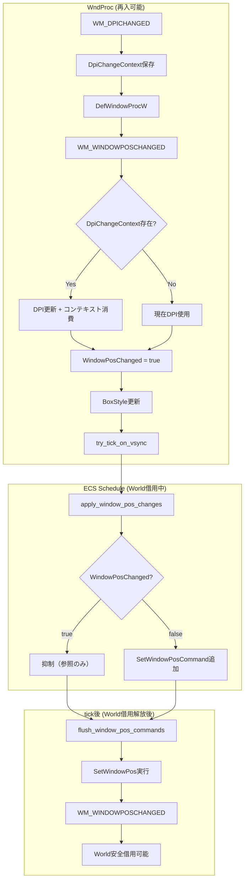
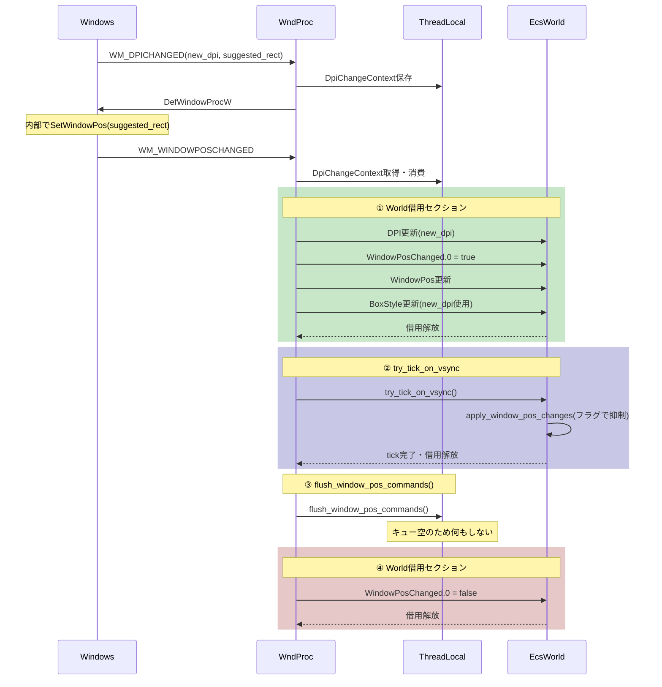
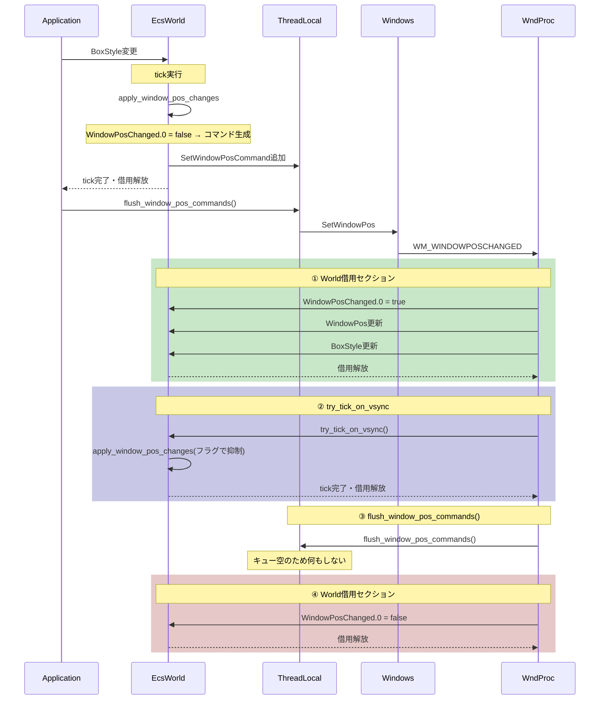

# 設計ドキュメント: multimonitor-resize-flicker

## Overview

**Purpose:** マルチモニター環境でDPIの異なるディスプレイ間をウィンドウ移動した際に発生するちらつき（サイズ変動）を解消する。

**Users:** wintf ライブラリを使用するアプリケーション開発者およびエンドユーザー。

**Impact:** 既存の`WM_DPICHANGED`および`WM_WINDOWPOSCHANGED`処理を同期型に変更し、スレッドローカルコンテキストとSetWindowPosキュー方式を導入する。

### Goals

- DPI変更時にWindowsの推奨サイズを適用し、論理サイズ（DIP）を維持する
- `WM_WINDOWPOSCHANGED`由来のフィードバックループを`WindowPosChanged(bool)`フラグで抑制する
- `SetWindowPos`呼び出しをtick後に遅延実行し、World借用競合を防止する
- 非同期DPI更新（`WM_DPICHANGED_DEFERRED`）を同期型に置換し、コードを簡素化する

### Non-Goals

- 座標変換の丸め方向の統一（良い実践だが要件外）
- 単一モニター環境での動作変更
- `Transform`ベースのレイアウトシステム対応

## Architecture

### Existing Architecture Analysis

現在の問題構造：

```
WM_DPICHANGED
  └─ PostMessage(WM_DPICHANGED_DEFERRED) ← 非同期DPI更新（遅延が発生）
  └─ DefWindowProcW → SetWindowPos(suggested_rect)
       └─ WM_WINDOWPOSCHANGED (同期、旧DPIで処理)
            └─ BoxStyle更新（誤った論理サイズ）
            └─ try_tick_on_vsync() → apply_window_pos_changes → SetWindowPos
                 └─ WM_WINDOWPOSCHANGED (World借用中 → 二重借用エラー)
```

主要な課題：
1. **DPI更新遅延**: `PostMessage`による非同期更新で、`WM_WINDOWPOSCHANGED`処理時に旧DPIを使用
2. **フィードバックループ**: `BoxStyle`更新→`SetWindowPos`→`WM_WINDOWPOSCHANGED`の無限連鎖
3. **World借用競合**: tick中の`SetWindowPos`が再入して二重借用エラー

### Architecture Pattern & Boundary Map



**Architecture Integration:**
- 選択パターン: スレッドローカルコンテキスト + キュー遅延実行
- ドメイン境界: WndProc（Win32）↔ ECS World（bevy_ecs）
- 既存パターン維持: `VsyncTick`トレイト、ECSスケジュール構造
- 新コンポーネント: `WindowPosChanged`（SparseSetストレージ）
- Steering準拠: `com/`↔`ecs/`↔Message Handling のレイヤー分離

### Technology Stack

| Layer | Choice / Version | Role in Feature | Notes |
|-------|------------------|-----------------|-------|
| ECS | bevy_ecs 0.17.2 | `Changed<T>`検知、SparseSetストレージ | 既存 |
| Windows API | windows 0.62.1 | `SetWindowPos`, `DefWindowProcW` | 既存 |
| Thread-local | std::cell::RefCell | DpiChangeContext, WINDOW_POS_COMMANDS | 新規 |

## System Flows

### フロー1: DPI変更時のサイズ適用

**重要: World借用の区切り原則**

WM_WINDOWPOSCHANGED処理内でWorldを借用する際は、**短く区切って都度解放**する。

```
WM_WINDOWPOSCHANGED
  ├─ ① World借用 → DPI更新, WindowPosChanged=true, WindowPos更新, BoxStyle更新 → 借用解放
  ├─ ② try_tick_on_vsync() (内部で借用→解放)
  ├─ ③ flush_window_pos_commands() (SetWindowPos実行)
  └─ ④ World借用 → WindowPosChanged=false → 借用解放
```



### フロー2: アプリによるBoxStyle変更



## Requirements Traceability

| Requirement | Summary | Components | Interfaces | Flows |
|-------------|---------|------------|------------|-------|
| 1 | WM_DPICHANGED推奨サイズ適用 | DpiChangeContext | set/take | フロー1 |
| 6 | 既存動作互換性 | WindowPosChanged | - | フロー2 |
| 7 | デバッグ・診断サポート | 全コンポーネント | log出力 | 全フロー |
| 8 | DpiChangeContext管理 | DpiChangeContext | set/take | フロー1 |
| 9 | WM_WINDOWPOSCHANGED抑制 | WindowPosChanged | bool flag | フロー1,2 |
| 10 | WM_DPICHANGED_DEFERRED廃止 | - | 削除 | - |
| 11 | SetWindowPosキュー遅延 | SetWindowPosCommand | queue/flush | フロー1,2 |

## Components and Interfaces

| Component | Domain/Layer | Intent | Req Coverage | Dependencies | Contracts |
|-----------|--------------|--------|--------------|--------------|-----------|
| DpiChangeContext | Thread-local | WM_DPICHANGED→WM_WINDOWPOSCHANGED間のDPI伝達 | 1, 8 | - | State |
| WindowPosChanged | ECS Component | WM_WINDOWPOSCHANGED由来フラグ | 6, 9 | WindowPos (P1) | State |
| SetWindowPosCommand | Thread-local | SetWindowPos遅延実行キュー | 6, 11 | WindowHandle (P0) | State |
| VsyncTick | Trait impl | tick後のflush呼び出し | 11 | EcsWorld (P0) | Service |

### Thread-local Layer

#### DpiChangeContext

| Field | Detail |
|-------|--------|
| Intent | WM_DPICHANGEDとWM_WINDOWPOSCHANGED間で新DPIを同期的に受け渡す |
| Requirements | 1, 8 |

**Responsibilities & Constraints**
- `WM_DPICHANGED`受信時に新DPIと推奨RECTを保存
- `WM_WINDOWPOSCHANGED`処理時に取得・消費（1回限り）
- スレッドローカル（WndProcは単一スレッド）

**Dependencies**
- Inbound: WndProc — DPI情報の設定 (P0)
- Outbound: WndProc — DPI情報の取得・消費 (P0)

**Contracts**: State [x]

##### State Management

```rust
/// DPI変更コンテキスト（WM_DPICHANGED → WM_WINDOWPOSCHANGED間で使用）
pub struct DpiChangeContext {
    /// 新しいDPI値
    pub new_dpi: DPI,
    /// Windowsが推奨するウィンドウRECT（物理座標）
    pub suggested_rect: RECT,
}

thread_local! {
    static DPI_CHANGE_CONTEXT: RefCell<Option<DpiChangeContext>> = RefCell::new(None);
}
```

- State model: `Option<DpiChangeContext>` (None | Some)
- Persistence: なし（同一メッセージチェーン内でのみ有効）
- Concurrency: スレッドローカルのため競合なし

##### Service Interface

```rust
impl DpiChangeContext {
    /// コンテキストを設定（WM_DPICHANGEDから呼び出し）
    pub fn set(ctx: DpiChangeContext);
    
    /// コンテキストを取得・消費（WM_WINDOWPOSCHANGEDから呼び出し）
    /// 取得後はNoneにリセットされる
    pub fn take() -> Option<DpiChangeContext>;
}
```

- Preconditions: なし
- Postconditions: `take()`後は`None`状態
- Invariants: 同一スレッド内でのみアクセス

**Implementation Notes**
- Integration: `window_proc.rs`に配置（WndProc処理に密結合）
- Validation: `suggested_rect`の妥当性チェックは不要（Windowsからの入力を信頼）
- Risks: なし（単純な状態管理）

---

#### SetWindowPosCommand

| Field | Detail |
|-------|--------|
| Intent | SetWindowPos呼び出しをtick後に遅延実行するためのキュー |
| Requirements | 6, 11 |

**Responsibilities & Constraints**
- `apply_window_pos_changes`でキューに追加（SetWindowPos直接呼び出し禁止）
- `flush_window_pos_commands()`でキュー内の全コマンドを順次実行
- World借用解放後に実行（二重借用防止）

**Dependencies**
- Inbound: apply_window_pos_changes — コマンド追加 (P0)
- Outbound: SetWindowPos — Win32 API呼び出し (P0)

**Contracts**: State [x]

##### State Management

```rust
/// SetWindowPosコマンド
pub struct SetWindowPosCommand {
    pub hwnd: HWND,
    pub x: i32,
    pub y: i32,
    pub width: i32,
    pub height: i32,
    pub flags: SET_WINDOW_POS_FLAGS,
    pub hwnd_insert_after: HWND,
}

thread_local! {
    static WINDOW_POS_COMMANDS: RefCell<Vec<SetWindowPosCommand>> = RefCell::new(Vec::new());
}
```

- State model: `Vec<SetWindowPosCommand>` (FIFO順序)
- Persistence: なし（各flush後にクリア）
- Concurrency: スレッドローカルのため競合なし

##### Service Interface

```rust
impl SetWindowPosCommand {
    /// コマンドをキューに追加
    pub fn enqueue(cmd: SetWindowPosCommand);
    
    /// キュー内の全コマンドを実行し、キューをクリア
    pub fn flush();
}
```

- Preconditions: `flush()`はWorld借用解放後に呼び出すこと
- Postconditions: `flush()`後はキューが空
- Invariants: コマンドは追加順に実行

**Implementation Notes**
- Integration: `window_proc.rs`または`world.rs`に配置
- Validation: `hwnd`の有効性は呼び出し元で保証
- Risks: flushタイミングを誤ると二重借用エラー発生

---

### ECS Component Layer

#### WindowPosChanged

| Field | Detail |
|-------|--------|
| Intent | WM_WINDOWPOSCHANGEDの発生を記録し、SetWindowPos抑制を制御 |
| Requirements | 6, 9 |

**Responsibilities & Constraints**
- フラグの設定・リセットは**WM_WINDOWPOSCHANGED処理側が完全に責任を持つ**
- `WM_WINDOWPOSCHANGED`受信時に`true`に設定（tick前）
- `WM_WINDOWPOSCHANGED`の`try_tick_on_vsync()`後に`false`にリセット
- `apply_window_pos_changes`は`&WindowPosChanged`（不変参照）で参照のみ
- Windowエンティティのみに配置（SparseSetストレージ）

**Dependencies**
- Inbound: WndProc — フラグ設定・リセット（完全責任） (P0)
- Outbound: apply_window_pos_changes — フラグ参照のみ（`&WindowPosChanged`） (P0)

**Contracts**: State [x]

##### State Management

```rust
/// WM_WINDOWPOSCHANGED発生フラグ
/// 
/// WM_WINDOWPOSCHANGED由来のBoxStyle変更に対してSetWindowPosを
/// 発行しないよう制御するためのマーカーコンポーネント
#[derive(Component, Default)]
#[component(storage = "SparseSet")]
pub struct WindowPosChanged(pub bool);
```

- State model: `bool` (true = 抑制中, false = 通常)
- Persistence: なし（各tick内で完結）
- Concurrency: ECSによる排他制御

**Implementation Notes**
- Integration: `ecs/window.rs`に定義、`window_proc.rs`と`graphics/systems.rs`で使用
- Validation: なし（単純なbool）
- Risks: 同一tick内のアプリ変更が1フレーム遅延する可能性（許容）

---

### VsyncTick Trait Implementation

#### VsyncTick for Rc<RefCell<EcsWorld>>

| Field | Detail |
|-------|--------|
| Intent | tick実行後にSetWindowPosキューをflushする |
| Requirements | 11 |

**Responsibilities & Constraints**
- 既存の`try_tick_on_vsync()`実装を拡張
- World借用解放直後に`flush_window_pos_commands()`を呼び出す

**Dependencies**
- Inbound: WndProc — try_tick_on_vsync()呼び出し (P0)
- Outbound: SetWindowPosCommand — flush()呼び出し (P0)

**Contracts**: Service [x]

##### Service Interface

```rust
impl VsyncTick for Rc<RefCell<EcsWorld>> {
    fn try_tick_on_vsync(&self) -> bool {
        let result = match self.try_borrow_mut() {
            Ok(mut world) => world.try_tick_on_vsync(),
            Err(_) => return false,
        };
        // World借用解放後にSetWindowPosを実行
        flush_window_pos_commands();
        result
    }
}
```

- Preconditions: なし
- Postconditions: SetWindowPosキューが空
- Invariants: flush()はWorld借用外で実行

**Implementation Notes**
- Integration: `ecs/world.rs`の既存実装を修正
- Validation: なし
- Risks: なし（既存トレイト実装の拡張）

## Data Models

### Domain Model

本機能は新規データモデルを導入せず、既存の`DPI`型を再利用する。

**既存型（変更なし）:**
- `DPI`: DPI値を保持（dpi_x, dpi_y）
- `WindowPos`: ウィンドウ位置・サイズ（クライアント座標）
- `BoxStyle`: 論理座標（DIP）でのサイズ・位置

**新規構造体:**
- `DpiChangeContext`: 一時的な状態（永続化なし）
- `SetWindowPosCommand`: 一時的なコマンド（永続化なし）
- `WindowPosChanged`: ECSコンポーネント（SparseSet、フレーム内で完結）

## Error Handling

### Error Strategy

本機能は主にWindowsメッセージ処理であり、エラー発生時は現状維持（フォールバック）を基本とする。

### Error Categories and Responses

**System Errors:**
- `SetWindowPos`失敗 → ログ出力、次回リトライなし（Windows側の問題）
- `try_borrow_mut()`失敗 → 安全にスキップ（正常な再入検知）

**Logic Errors:**
- `DpiChangeContext`未設定時の`take()` → `None`返却（通常フロー）
- エンティティ不在 → ログ出力、処理スキップ

### Monitoring

デバッグビルドでのログ出力（REQ-7）：
- `[DPI Context] set/take`
- `[WindowPosChanged] set/reset`
- `[SetWindowPosCommand] enqueue/flush`

## Testing Strategy

### Unit Tests

1. `DpiChangeContext::set()`/`take()`の状態遷移
2. `WindowPosChanged`フラグのリセット動作
3. `SetWindowPosCommand`キューのFIFO順序

### Integration Tests

1. DPI変更時の論理サイズ維持（120→192 DPI）
2. `BoxStyle`変更→`SetWindowPos`→エコーバック抑制フロー
3. World借用中の再入時のスキップ動作

### Manual Tests

1. デュアルモニター（DPI 100%/200%）間のウィンドウ移動
2. ウィンドウドラッグ中のちらつき確認
3. リサイズ・最大化・最小化の回帰確認

## Migration Strategy

### Phase 1: 新コンポーネント追加

1. `DpiChangeContext`とスレッドローカル変数を追加
2. `WindowPosChanged`コンポーネントを追加
3. `SetWindowPosCommand`とキューを追加

### Phase 2: WndProc処理の変更

1. `WM_DPICHANGED`: `DpiChangeContext`保存を追加
2. `WM_WINDOWPOSCHANGED`: コンテキスト消費とフラグ設定を追加
3. `VsyncTick::try_tick_on_vsync()`: flush呼び出しを追加

### Phase 3: apply_window_pos_changes修正

1. `WindowPosChanged`フラグチェックを追加
2. 直接`SetWindowPos`呼び出しをキュー追加に変更
3. エコーバック判定ロジックの簡素化

### Phase 4: 旧コード削除

1. `WM_DPICHANGED_DEFERRED`定数削除
2. `post_dpi_change()`関数削除
3. `process_deferred_dpi_change()`関数削除

### Rollback Triggers

- 既存のリサイズ/最大化/最小化が動作しなくなった場合
- 単一モニター環境で回帰が発生した場合
- デッドロックや無限ループが発生した場合
