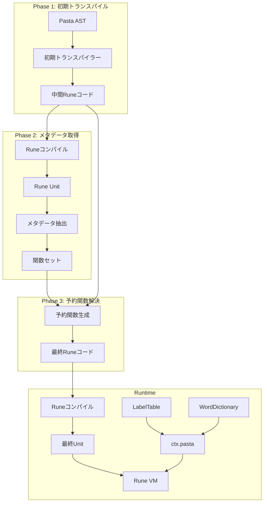
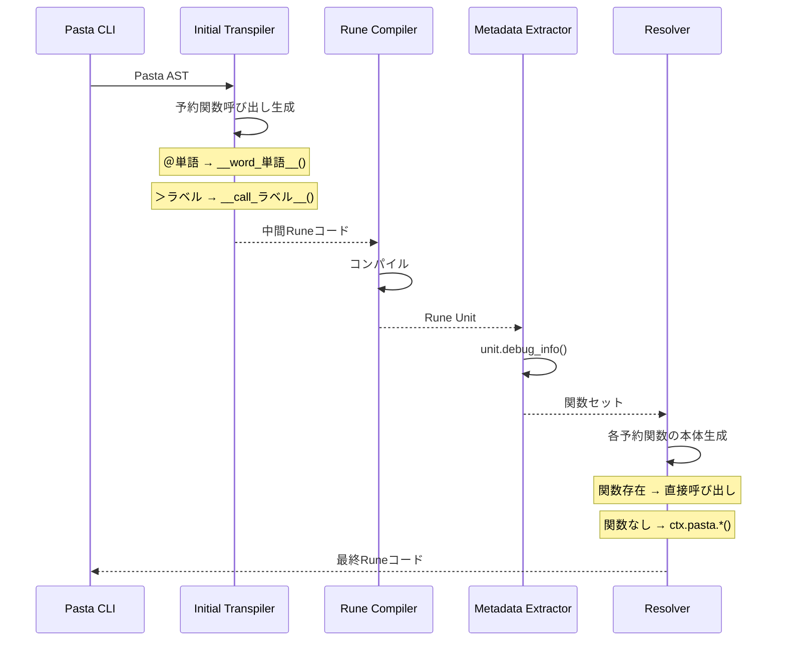
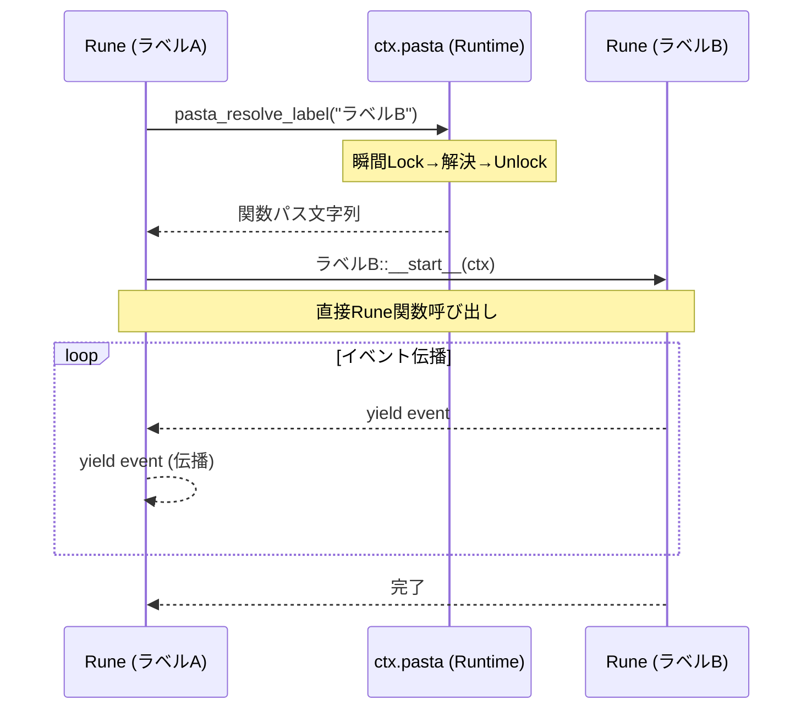
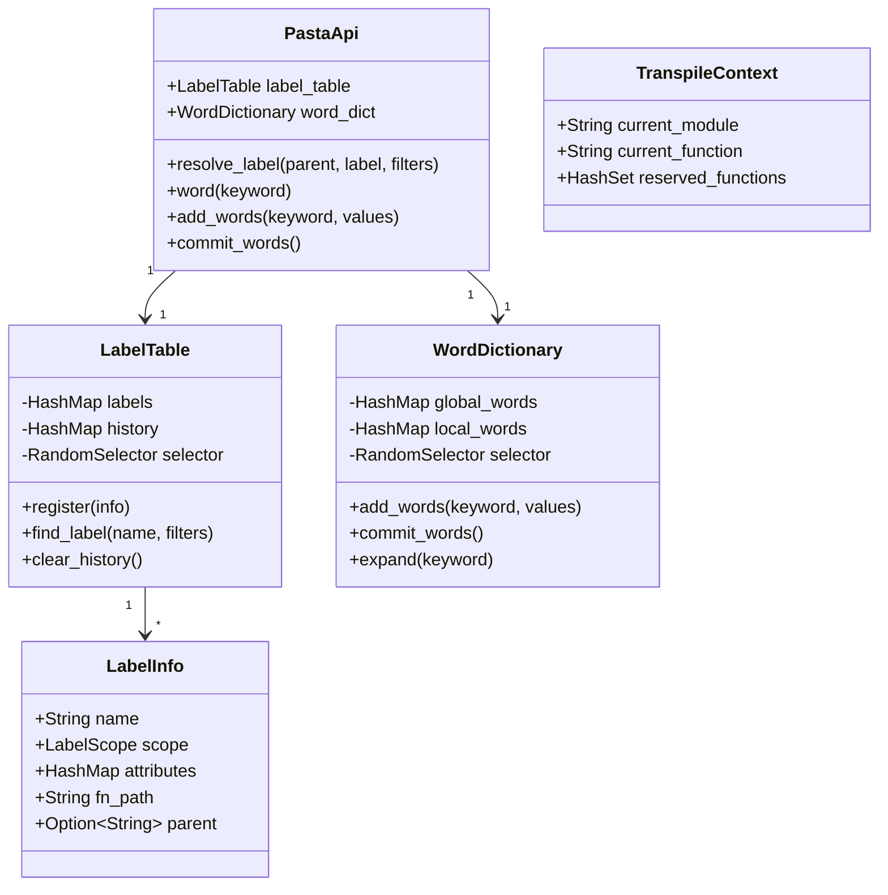

# Design Document

| 項目 | 内容 |
|------|------|
| **Document Title** | Pasta DSL 宣言的コントロールフロー 技術設計書 |
| **Version** | 1.0 |
| **Date** | 2025-12-12 |
| **Parent Spec** | areka-P0-script-engine (completed) |
| **Priority** | P0 (既存実装の修正) |

---

## Overview

本設計書は、Pasta DSLトランスパイラーを元仕様（areka-P0-script-engine）に基づいた正しい宣言的コントロールフロー構文に適合させるための技術設計を定義する。

**Purpose**: トランスパイラーとランタイムを再設計し、call/jump/ラベル定義を使用した宣言的なコントロールフローをサポートする。

**Users**: Pastaスクリプト作成者、Pasta DSL開発者

**Impact**: 
- 現在のトランスパイラー出力形式を全面的に変更（フラット関数 → モジュール構造）
- 新規Pastaランタイムオブジェクト（`ctx.pasta`）の追加
- `04_control_flow.pasta`の全面的な書き直し

### Goals
- 要件5で定義されたトランスパイラー出力仕様に完全準拠
- call/jump文のwhile-let-yieldパターン生成
- Pastaランタイムメソッド（call/jump/word）の実装
- 検索装置（LabelTable/WordDictionary）のSend trait実装とVM初期化
- 包括的なテストスイートの作成

### Non-Goals
- 命令型制御構文（`if/elif/else/while`）のサポート
- Runeブロック内の条件分岐・ループの拡張（別途Rune機能として実装可能）
- 新しいDSL構文の追加
- パフォーマンス最適化（機能完成後のフェーズで検討）

---

## Architecture

> 詳細な調査結果は`research.md`を参照。

### Existing Architecture Analysis

**現在のアーキテクチャ**:
- `Transpiler::transpile()`: PastaFile AST → Runeコード文字列の変換
- グローバルラベル → フラット関数生成（`pub fn ラベル名_番号(ctx)`）
- ローカルラベル → フラット化された関数（`pub fn 親名__子名_番号(ctx)`）
- Call文 → 直接関数呼び出し（`ラベル名()`）
- Jump文 → `return ラベル名()`

**要件との乖離点**:
1. **モジュール化なし**: グローバルラベルがモジュールとして生成されていない
2. **`__start__`関数なし**: グローバルラベルの最初のスコープが専用関数として生成されていない
3. **ローカルラベルのフラット化**: 親モジュール内に配置されず、`親名__子名`形式でフラット化
4. **直接関数呼び出し**: `ctx.pasta.call()`/`ctx.pasta.jump()`ではなく、直接関数を呼び出し

**再利用可能な資産**:
- AST定義（`Statement`, `JumpTarget`, `LabelDef`等）
- 識別子サニタイズ（`sanitize_identifier()`）
- 文字列エスケープ（`escape_string()`）
- `LabelTable`: ラベル解決、前方一致選択、キャッシュベース消化
- `RandomSelector`: ランダム選択ロジック

### Architecture Pattern & Boundary Map

**選択パターン**: 責任分離アーキテクチャ + 2パストランスパイラー



**責任分離**:
- **PastaEngine（Rust側）**: ラベル名→Rune関数パス解決のみ
- **Runeジェネレーター**: 実際の実行とyield伝播

**ドメイン境界**:
| ドメイン | 責務 | モジュール |
|----------|------|------------|
| トランスパイラー | AST→Runeコード変換 | `transpiler/` |
| ランタイム | 検索装置、実行コンテキスト | `runtime/` |
| 標準ライブラリ | Rune関数登録 | `stdlib/` |
| エンジン | 統合、VM管理 | `engine.rs` |

### Technology Stack

| Layer | Choice / Version | Role in Feature | Notes |
|-------|------------------|-----------------|-------|
| Language | Rust 2021 Edition | トランスパイラー、ランタイム実装 | 既存 |
| Script VM | Rune 0.14 | Runeコード実行、ジェネレーター | 既存 |
| Parser | pest | Pasta DSLパース | 既存、変更なし |
| Test | cargo test | ユニットテスト、統合テスト | 既存 |

---

## System Flows

### トランスパイルフロー（2パス）



### 実行時Call/Jumpフロー



---

## Requirements Traceability

| Requirement | Summary | Components | Interfaces | Flows |
|-------------|---------|------------|------------|-------|
| 1.1-1.7 | ラベルベースのコントロールフロー | ModuleCodegen, ContextCodegen | call/jump生成 | トランスパイル |
| 2.1-2.5 | ランダム選択と前方一致 | LabelTable | find_label() | 実行時 |
| 3.1-3.3 | 動的call/jump | ContextCodegen, PastaApi | resolve_label() | 実行時 |
| 4.1-4.3 | 宣言的な会話フロー表現 | - | - | RuneBlock内 |
| 5.1-5.13 | トランスパイラー出力仕様 | ModuleCodegen, ContextCodegen | 全生成メソッド | トランスパイル |
| 6.1-6.5 | サンプルファイルの修正 | - | - | - |
| 7.1-7.7 | リファレンス実装とテスト | TestFixtures | - | テスト |
| 8.1-8.8 | 検索装置のVM初期化 | LabelTable, WordDictionary | VM::send_execute | 初期化 |

---

## Components and Interfaces

| Component | Domain/Layer | Intent | Req Coverage | Key Dependencies | Contracts |
|-----------|--------------|--------|--------------|------------------|-----------|
| LabelRegistry | Transpiler | ラベル収集とID割り当て | 5.2-5.4 | AST (P0) | State |
| ModuleCodegen | Transpiler | グローバルラベル→モジュール生成 | 5.2-5.4 | LabelRegistry (P0) | Service |
| ContextCodegen | Transpiler | call/jump/word予約関数生成 | 5.7-5.13 | LabelRegistry (P0) | Service |
| ReservedFunctionResolver | Transpiler | label_selector本体生成 | 5.7-5.9 | LabelRegistry (P0) | Service |
| LabelTable | Runtime | ラベル解決、ランダム選択 | 2.1-2.5, 8.1-8.2 | RandomSelector (P1) | State |
| WordDictionary | Runtime | 単語定義、展開 | 5.1, 5.5 | - | State |
| PastaApi | Runtime | resolve_label_id実装 | 3.1-3.3 | LabelTable (P0) | Service |
| PastaEngine | Engine | 統合、VM管理 | 8.3-8.8 | 全コンポーネント (P0) | Service |

### Transpiler Domain

#### LabelRegistry

| Field | Detail |
|-------|--------|
| Intent | トランスパイル時のラベル収集とID割り当て |
| Requirements | 5.2, 5.3, 5.4 |

**Responsibilities & Constraints**
- グローバル/ローカルラベルに一意なID（1から開始）を割り当て
- 同名ラベルに連番を付与（`会話_0`, `会話_1`, ...）
- 各ラベルのRune関数パスを生成（`crate::会話_1::__start__`）
- label_selector生成用のID→関数パスマッピングを提供
- LabelTable構築用のデータを提供

**Dependencies**
- Inbound: Transpiler::collect_labels() — ラベル収集 (P0)
- Outbound: ModuleCodegen — 関数名参照 (P0)
- Outbound: ReservedFunctionResolver — ID→パスマッピング (P0)

**Contracts**: State [x]

##### State Interface
```rust
/// トランスパイル時のラベル情報
#[derive(Debug, Clone)]
pub struct TranspileLabelInfo {
    pub id: usize,                    // 一意なID（match文用）
    pub name: String,                 // 元のラベル名
    pub scope: LabelScope,            // Global or Local
    pub parent: Option<String>,       // 親ラベル名
    pub fn_path: String,              // crate::会話_1::__start__
    pub counter: usize,               // 同名ラベルの連番
}

pub struct LabelRegistry {
    labels: Vec<TranspileLabelInfo>,
    next_id: usize,
    global_counters: HashMap<String, usize>,
    local_counters: HashMap<(String, String), usize>,
}

impl LabelRegistry {
    pub fn new() -> Self;
    
    /// グローバルラベルを登録してID割り当て
    pub fn register_global(&mut self, name: &str) -> TranspileLabelInfo;
    
    /// ローカルラベルを登録してID割り当て
    pub fn register_local(
        &mut self,
        parent_name: &str,
        parent_counter: usize,
        local_name: &str,
    ) -> TranspileLabelInfo;
    
    /// 全ラベル情報を取得（label_selector生成用）
    pub fn all_labels(&self) -> &[TranspileLabelInfo];
    
    /// LabelTable構築（ランタイム用）
    pub fn build_label_table(&self, random_selector: Box<dyn RandomSelector>) -> LabelTable;
}
```

#### ModuleCodegen

| Field | Detail |
|-------|--------|
| Intent | グローバルラベルをRuneモジュールに変換する |
| Requirements | 5.2, 5.3, 5.4 |

**Responsibilities & Constraints**
- グローバルラベル1つにつきRuneモジュール1つを生成（`pub mod ラベル名_番号 { ... }`）
- グローバルラベルの最初のスコープを`pub fn __start__(ctx)`関数として生成
- 各ローカルラベルを親モジュール内の個別関数（`pub fn ラベル名_番号(ctx)`）として生成
- LabelRegistryから取得した連番とパスを使用

**Dependencies**
- Inbound: Transpiler::generate_modules() — モジュール生成 (P0)
- Outbound: ContextCodegen — ステートメント変換 (P0)
- Inbound: LabelRegistry — ラベル情報参照 (P0)

**Contracts**: Service [x]

##### Service Interface
```rust
pub struct ModuleCodegen;

impl ModuleCodegen {
    /// グローバルラベルをRuneモジュールに変換
    fn generate_module(
        output: &mut String,
        label: &LabelDef,
        label_info: &TranspileLabelInfo,
        registry: &LabelRegistry,
    ) -> Result<(), PastaError>;
    
    /// __start__関数を生成
    fn generate_start_function(
        output: &mut String,
        statements: &[Statement],
        registry: &LabelRegistry,
    ) -> Result<(), PastaError>;
    
    /// ローカルラベル関数を生成
    fn generate_local_function(
        output: &mut String,
        label: &LabelDef,
        label_info: &TranspileLabelInfo,
        registry: &LabelRegistry,
    ) -> Result<(), PastaError>;
}
```
- Preconditions: LabelRegistryにラベルが登録済み
- Postconditions: 有効なRuneモジュールコードが出力に追加される
- Invariants: 生成されるモジュール名・関数名はLabelRegistryと一致

#### ContextCodegen

| Field | Detail |
|-------|--------|
| Intent | call/jump文をpasta::label_selector呼び出しに変換 |
| Requirements | 5.7, 5.8, 5.9, 5.10, 5.11, 5.12, 5.13 |

**Responsibilities & Constraints**
- Call文を`pasta::label_selector("ラベル", #{})`呼び出しに変換
- Jump文を`pasta::label_selector("ラベル", #{})`呼び出しに変換
- グローバルジャンプ: `"会話"` → `会話::__start__`を探索
- ローカルジャンプ: `"会話_1::選択肢"` → 前方一致探索
- ワード展開を`__word_単語__(ctx, args)`呼び出しに変換
- 発言者切り替えコード生成

**Dependencies**
- Inbound: ModuleCodegen — ステートメント変換呼び出し (P0)
- Inbound: LabelRegistry — ラベル名参照 (P0)

**Contracts**: Service [x]

##### Service Interface
```rust
pub struct ContextCodegen;

impl ContextCodegen {
    /// Call文をlabel_selector呼び出しに変換
    fn generate_call(
        output: &mut String,
        target: &JumpTarget,
        args: &[Argument],
        parent_label: &str,
        registry: &LabelRegistry,
    ) -> Result<(), PastaError>;
    
    /// Jump文をlabel_selector呼び出しに変換
    fn generate_jump(
        output: &mut String,
        target: &JumpTarget,
        parent_label: &str,
        registry: &LabelRegistry,
    ) -> Result<(), PastaError>;
    
    /// ラベル検索キーを生成
    /// - グローバル: "会話" → グローバル検索
    /// - ローカル: "会話_1::選択肢" → ローカル検索
    fn build_label_search_key(
        target: &JumpTarget,
        parent_label: &str,
        registry: &LabelRegistry,
    ) -> String;
    
    /// ワード展開を予約関数呼び出しに変換
    fn generate_word(
        output: &mut String,
        word_name: &str,
        args: &[Argument],
    ) -> Result<(), PastaError>;
    
    /// 発言者切り替えを生成
    fn generate_speaker_change(
        output: &mut String,
        speaker: &str,
    ) -> Result<(), PastaError>;
}
```

#### ReservedFunctionResolver

| Field | Detail |
|-------|--------|
| Intent | pasta::label_selectorの本体を生成（2-pass目） |
| Requirements | 5.7, 5.8, 5.9 |

**Responsibilities & Constraints**
- 1-pass目で生成された空実装を置換
- LabelRegistryからID→関数パスマッピングを取得
- match文を生成（全ラベルのID分岐）
- resolve_label_id呼び出しコードを生成（仮実装付き）

**Dependencies**
- Inbound: Transpiler::resolve_reserved_functions() — 2パス目呼び出し (P0)
- Inbound: LabelRegistry — ID→パスマッピング (P0)

**Contracts**: Service [x]

##### Service Interface
```rust
pub struct ReservedFunctionResolver;

impl ReservedFunctionResolver {
    /// label_selectorの本体を生成
    fn generate_label_selector_body(
        registry: &LabelRegistry,
    ) -> String;
    
    /// 予約関数を解決して最終コードを生成
    fn resolve_label_selector(
        intermediate_code: &str,
        registry: &LabelRegistry,
    ) -> Result<String, PastaError>;
}
```

##### 生成コード例
```rune
pub mod pasta {
    pub fn label_selector(label, filters) {
        // TODO: resolve_label_id実装後に有効化
        // let id = resolve_label_id(label, filters)?;
        let id = 1; // 仮実装
        match id {
            1 => crate::会話_1::__start__,
            2 => crate::会話_1::選択肢_1,
            3 => crate::会話_1::選択肢_2,
            _ => panic!("Unknown label id: {}", id),
        }
    }
}
```

### Runtime Domain

#### LabelTable

| Field | Detail |
|-------|--------|
| Intent | ラベル解決、前方一致選択、キャッシュベース消化 |
| Requirements | 2.1, 2.2, 2.3, 2.4, 2.5, 8.1, 8.6 |

**Responsibilities & Constraints**
- ラベル名からRune関数パスへのマッピング
- 同名ラベルからのランダム選択
- 前方一致選択
- キャッシュベース消化（選択肢を順に消化）
- **`Send` trait必須**: VM::send_execute()のAPI制約

**Dependencies**
- Inbound: PastaApi — ラベル解決 (P0)
- Outbound: RandomSelector — ランダム選択 (P1)

**Contracts**: State [x]

##### State Management
- State model: `HashMap<String, Vec<LabelInfo>>` + `HashMap<String, Vec<usize>>`（履歴）
- Persistence: なし（セッション内のみ）
- Concurrency: Send実装必須、内部は単一スレッドアクセス想定

```rust
/// ラベル情報（ランタイム用）
#[derive(Debug, Clone)]
pub struct LabelInfo {
    pub id: usize,        // トランスパイル時に割り当てられたID
    pub name: String,
    pub scope: LabelScope,
    pub attributes: HashMap<String, String>,
    pub fn_path: String,  // 完全修飾関数パス (crate::会話_1::__start__)
    pub parent: Option<String>,
}

/// ラベルテーブル（Send実装必須）
pub struct LabelTable {
    labels: HashMap<String, Vec<LabelInfo>>,
    history: HashMap<String, Vec<usize>>,
    random_selector: Box<dyn RandomSelector>,
}

impl LabelTable {
    pub fn new(random_selector: Box<dyn RandomSelector>) -> Self;
    
    /// LabelRegistryから構築
    pub fn from_registry(
        registry: &LabelRegistry,
        random_selector: Box<dyn RandomSelector>,
    ) -> Self;
    
    /// ラベル解決（実装は後回し: P1）
    pub fn resolve_label_id(
        &mut self,
        label: &str,
        filters: &HashMap<String, String>,
    ) -> Result<usize, PastaError>;
    
    // 既存メソッド
    pub fn register(&mut self, info: LabelInfo);
    pub fn find_label(&mut self, name: &str, filters: &HashMap<String, String>) -> Result<String, PastaError>;
}
```

#### WordDictionary

| Field | Detail |
|-------|--------|
| Intent | 単語定義、展開、ランダム選択 |
| Requirements | 5.1, 5.5, 8.2, 8.6 |

**Responsibilities & Constraints**
- 単語名から値リストへのマッピング
- ランダム選択による単語展開
- ローカル単語のスコープ管理（commit/rollback）
- **`Send` trait必須**: VM::send_execute()のAPI制約

**Dependencies**
- Inbound: PastaApi — 単語展開 (P0)
- Outbound: RandomSelector — ランダム選択 (P1)

**Contracts**: State [x]

##### State Management
- State model: `HashMap<String, Vec<String>>` + スコープスタック
- Persistence: なし（セッション内のみ）
- Concurrency: Send実装必須

```rust
/// 単語辞書（Send実装必須）
pub struct WordDictionary {
    global_words: HashMap<String, Vec<String>>,
    local_words: HashMap<String, Vec<String>>,
    random_selector: Box<dyn RandomSelector + Send>,
}

// Send実装
unsafe impl Send for WordDictionary {}
```

#### PastaApi

| Field | Detail |
|-------|--------|
| Intent | resolve_label_id実装（Runeモジュールとして登録） |
| Requirements | 3.1, 3.2, 3.3 |

**Responsibilities & Constraints**
- `resolve_label_id()`: ラベル名→ID解決をRune関数として提供
- Arc<Mutex<LabelTable>>でクロージャキャプチャ
- 前方一致検索の実装（グローバル/ローカル）
- filters引数のサポート（現時点では未使用）

**Dependencies**
- Inbound: Rune VM — pasta::resolve_label_id()呼び出し (P0)
- Outbound: LabelTable::resolve_label_id() — ラベル解決 (P1)

**Contracts**: Service [x]

##### Service Interface
```rust
pub struct PastaApi;

impl PastaApi {
    /// Runeモジュールとして登録
    pub fn create_module(
        label_table: Arc<Mutex<LabelTable>>,
    ) -> Result<Module, ContextError> {
        let mut module = Module::with_item(["pasta"])?;
        
        // Rust関数として登録（クロージャでキャプチャ）
        let lt = Arc::clone(&label_table);
        module.function("resolve_label_id", move |label: &str, filters: HashMap<String, String>| -> Result<usize, String> {
            lt.lock().unwrap()
                .resolve_label_id(label, &filters)
                .map_err(|e| e.to_string())
        })?;
        
        Ok(module)
    }
}
```

**実装優先度**:
- Phase 1 (P0): module登録とクロージャ設定
- Phase 2 (P1): LabelTable::resolve_label_id実装

### Engine Domain

#### PastaEngine（更新）

| Field | Detail |
|-------|--------|
| Intent | 統合、VM管理、LabelRegistry活用 |
| Requirements | 8.3, 8.4, 8.5, 8.7, 8.8 |

**Responsibilities & Constraints**
- 2パストランスパイル実行（LabelRegistry活用）
- LabelTable生成（LabelRegistry::into_label_table()）
- PastaApiモジュール登録（resolve_label_id提供）
- `ctx`オブジェクト構築（Arc<Mutex<LabelTable>>をキャプチャ）
- ラベル実行の開始点管理

**Dependencies**
- Inbound: CLI/API — スクリプト実行 (P0)
- Outbound: Transpiler — 2パスコード生成 (P0)
- Outbound: LabelRegistry — ID割り当て済みラベル情報 (P0)
- Outbound: PastaApi — Runeモジュール登録 (P0)
- External: Rune VM — コード実行 (P0)

**Contracts**: Service [x]

##### Service Interface
```rust
impl PastaEngine {
    /// エンジン作成（2パストランスパイル含む）
    pub fn new(
        script_root: impl AsRef<Path>,
        persistence_root: impl AsRef<Path>,
    ) -> Result<Self> {
        // Pass 1: ラベル収集とID割り当て
        let registry = LabelRegistry::new();
        let pass1_code = transpiler.transpile_pass1(&registry)?;
        
        // Pass 2: label_selector解決
        let final_code = transpiler.transpile_pass2(&registry, pass1_code)?;
        
        // LabelTable生成
        let label_table = Arc::new(Mutex::new(registry.into_label_table()));
        
        // PastaApiモジュール登録
        let pasta_module = PastaApi::create_module(Arc::clone(&label_table))?;
        context.install(pasta_module)?;
        
        Ok(Self { vm, label_table, ... })
    }
    
    /// ラベル実行
    pub fn execute_label(&mut self, label_name: &str) -> Result<Vec<ScriptEvent>>;
}
```

---

## Data Models

### Domain Model



### Logical Data Model

**Entity: TranspileLabelInfo**
- name: String (完全修飾ラベル名: グローバル="会話", ローカル="会話::選択肢")
- id: usize (ユニークID、自動採番)
- attributes: HashMap<String, String> (フィルタ属性)
- fn_path: String (相対Rune関数パス: "会話_1::__start__", "会話_1::選択肢_1")

**具体例:**
```rust
// グローバルラベル「＊会話」
TranspileLabelInfo {
    name: "会話".to_string(),
    id: 0,
    attributes: HashMap::new(),
    fn_path: "会話_1::__start__".to_string(),  // crate:: なし
}

// ローカルラベル「ー選択肢」（1つ目）
TranspileLabelInfo {
    name: "会話::選択肢".to_string(),          // 親を含む完全修飾名
    id: 1,
    attributes: { "場所" => "東京" },
    fn_path: "会話_1::選択肢_1".to_string(),   // crate:: なし
}

// ローカルラベル「ー選択肢」（2つ目）
TranspileLabelInfo {
    name: "会話::選択肢".to_string(),          // 同じ名前
    id: 2,
    attributes: { "場所" => "大阪" },
    fn_path: "会話_1::選択肢_2".to_string(),   // 連番で区別
}
```

**Entity: LabelInfo (Runtime, P1実装対象)**
- name: String (完全修飾ラベル名)
- id: usize (ユニークID、match文用)
- attributes: HashMap<String, String> (フィルタ属性)
- fn_path: String (相対Rune関数パス)

**Consistency & Integrity**
- fn_pathの一意性は連番で保証（`会話_1`, `選択肢_1`, `選択肢_2`）
- IDはトランスパイル時に自動採番（0から連番）
- nameは完全修飾名（親を含む）で保持
- fn_pathは相対パス（`crate::`なし）で保持
  - match文生成時: `format!("crate::{}", fn_path)` でフルパス化
  - Trie登録時: fn_pathをそのままキーとして使用（メモリ効率）
- 検索キー生成規則:
  - グローバル: `"会話"` → `"会話_1::__start__"` で前方一致
  - ローカル: `"会話_1::選択肢"` → `"会話_1::選択肢"` で前方一致
- ラベル解決（Trie検索）はP1実装（transpiler P0はmatch文生成まで）

---

## Implementation Notes

### 生成Runeコード例

**入力 Pasta DSL:**
```pasta
＠グローバル単語：はろー　わーるど

＊会話
　＠場所：東京　大阪
　＄変数＝１０
　＞コール１
　？ジャンプ

　ーコール１
　さくら：はろー。

　ージャンプ
　さくら：＠場所　では雨が降ってる。
```

**生成される最終Runeコード (Pass 2完了後):**
```rune
use pasta_stdlib::*;

add_words("グローバル単語", ["はろー", "わーるど"]);

pub mod 会話_1 {
    pub fn __start__(ctx) {
        ctx.pasta.add_words("場所", ["東京", "大阪"]); 
        ctx.pasta.commit_words();
        ctx.save.変数 = 10;
        for a in __call_コール１__(ctx, []) { yield a; }
        for a in __jump_ジャンプ__(ctx, []) { yield a; }
    }

    pub fn コール１_1(ctx) {
        ctx.actor = さくら;
        yield Actor("さくら");
        yield Talk("はろー。");
    }

    pub fn ジャンプ_1(ctx) {
        ctx.actor = さくら;
        yield Actor("さくら");
        for a in __word_場所__(ctx, []) { yield a; }
        yield Talk("では雨が降ってる。");
    }
    
    // 予約関数（2パス目で生成）
    fn __call_コール１__(ctx, args) {
        // 静的解決: ローカル関数が存在
        for a in コール１_1(ctx) { yield a; }
    }
    
    fn __jump_ジャンプ__(ctx, args) {
        // 静的解決: ローカル関数が存在
        for a in ジャンプ_1(ctx) { yield a; }
    }
    
    fn __word_場所__(ctx, args) {
        // 静的解決不可: 辞書単語
        for a in ctx.pasta.word(ctx, "場所", args) { yield a; }
    }
}
```

### 予約パターン命名規則

| パターン | 用途 | 例 |
|----------|------|-----|
| `__start__` | ラベルエントリポイント | `pub fn __start__(ctx)` |
| `__call_*__` | Call予約関数 | `__call_コール１__` |
| `__jump_*__` | Jump予約関数 | `__jump_ジャンプ__` |
| `__word_*__` | Word予約関数 | `__word_場所__` |

**禁止**: `__`で始まり`__`で終わるラベル名はシステム予約

### エラーハンドリング

| エラー種別 | 発生箇所 | 対応 |
|-----------|---------|------|
| LabelNotFound | PastaApi::resolve_label | PastaError::LabelNotFound返却 |
| WordNotFound | PastaApi::word | 空文字列を返却（エラーにしない） |
| ReservedPatternUsed | Parser | PastaError::ReservedPatternUsed返却 |
| TranspileError | Transpiler | PastaError::TranspileError返却 |

### 2パストランスパイラーのオーバーヘッド

- **初期化時のみ**: 実行時には影響なし
- **許容範囲**: 通常のDSLファイル（数百行）で数ミリ秒
- **キャッシュ対応**: ParseCacheを活用可能

---

## Validation Criteria

以下の基準をすべて満たす場合、本設計の実装は成功とみなされる：

1. ✅ トランスパイラーがグローバルラベルを`pub mod`形式で生成
2. ✅ `__start__`関数が正しく生成される
3. ✅ ローカルラベルが親モジュール内に配置される
4. ✅ call/jump/wordが予約関数パターンで生成される
5. ✅ 2パス解決が正しく動作する（静的/ランタイム判定）
6. ✅ while-let-yieldパターンでイベントが正しく伝播する
7. ✅ LabelTable/WordDictionaryがSend traitを実装
8. ✅ VM::send_execute()で検索装置がVM内に送り込まれる
9. ✅ `comprehensive_control_flow.pasta`のテストがパス
10. ✅ 既存テストの修正後に全テストがパス
