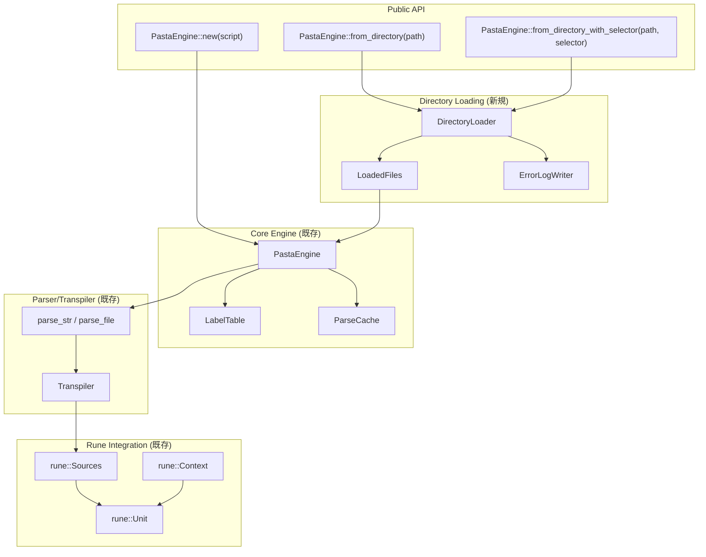
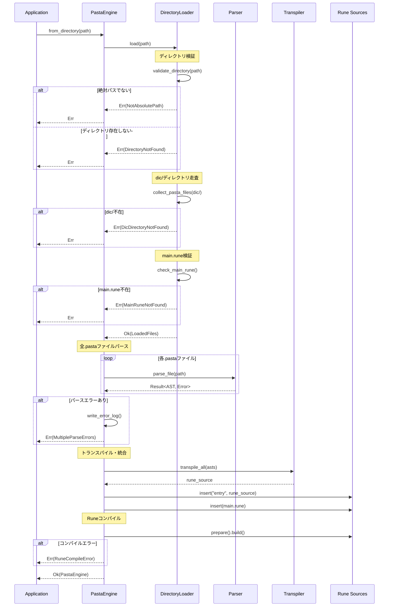
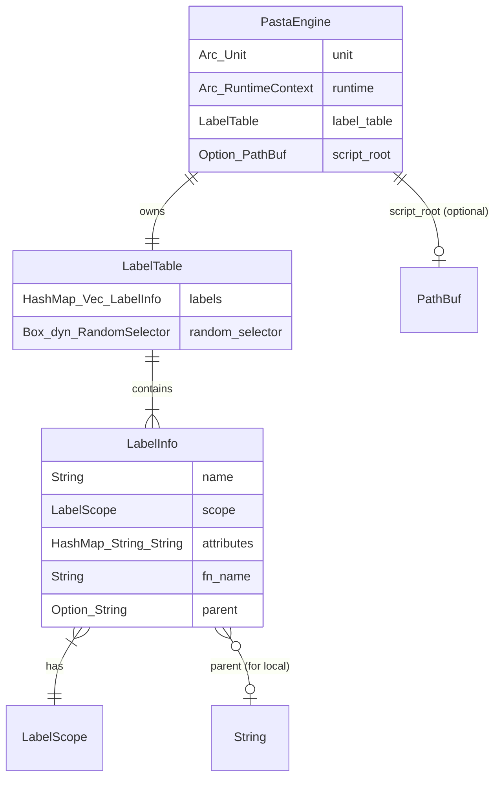

# Design Document - pasta-script-loader

## Overview

**Purpose**: Pastaスクリプトエンジンにディレクトリベースのスクリプト読み込み機能を追加し、areka-P0-script-engine規約（`dic/` + `main.rune`）に準拠した複数ファイル管理を実現する。

**Users**: PastaEngineを使用するアプリケーション開発者が、体系的に整理されたスクリプトディレクトリからエンジンを初期化し、宣言的な会話データ（.pasta）と手続き的なロジック（.rune）を分離して管理できる。

**Impact**: 既存の`PastaEngine::new(script: &str)`は不変のまま、新規コンストラクタ`from_directory()`を追加。ディレクトリ走査・エラー収集・Rune統合の新規コンポーネント導入。

### Goals
- areka-P0-script-engine規約に準拠したディレクトリ構造からのスクリプト読み込み
- 複数.pastaファイルの一括パース・エラー収集・ラベル統合
- main.runeを通じたRuneモジュールシステム連携
- 開発者向けの詳細エラーログ（`pasta_errors.log`）出力

### Non-Goals
- 相対パスサポート（絶対パスのみ）
- ファイル探索順序の保証（ファイルシステム依存）
- ホットリロード監視（`reload_directory()`は明示的呼び出しのみ）
- アーカイブ（.zip等）やHTTPソースからの読み込み（将来拡張）

## Architecture

### Existing Architecture Analysis

**現在のPastaEngine初期化フロー**:
```
PastaEngine::new(script: &str)
    ↓
parse_str() → AST
    ↓
Transpiler::transpile() → Rune source
    ↓
register_labels() → LabelTable
    ↓
rune::prepare() → Unit + Runtime
```

**既存コンポーネントで再利用するもの**:
- `parse_str()` / `parse_file()`: ASTパース
- `Transpiler::transpile()`: AST→Rune変換
- `register_labels()`: ラベル登録（同名ラベル連番付与）
- `PARSE_CACHE`: グローバルパースキャッシュ
- `LabelTable`: ラベル管理・ランダム選択

**統合ポイント**:
- Rune `Sources::insert()`: 複数ソース追加
- `std::error::Error`: エラートレイト実装

### Architecture Pattern & Boundary Map



**Architecture Integration**:
- **Selected pattern**: Layered Architecture + Factory Pattern
- **Domain/feature boundaries**: 
  - `loader.rs` = ディレクトリ走査・ファイル収集（I/O境界）
  - `engine.rs` = パース・コンパイル・実行（ビジネスロジック）
  - `error.rs` = エラー型定義（横断関心事）
- **Existing patterns preserved**: 
  - グローバルキャッシュ（`PARSE_CACHE`）
  - ラベル登録フロー（`register_labels()`）
  - Rune統合パターン（`Sources::insert()` → `prepare()` → `build()`）
- **New components rationale**: 
  - `DirectoryLoader`: ディレクトリ走査ロジックを分離し単独テスト可能に
  - `LoadedFiles`: ファイル収集結果の型安全な受け渡し
  - `ErrorLogWriter`: エラーログ出力の責務分離
- **Steering compliance**: 
  - モジュール単位で責務を明確に分離
  - 新規ファイル`loader.rs`はPasta層に追加

**Module Organization**:
- **File Path**: `crates/pasta/src/loader.rs` (初期実装はシングルファイル、500行以下想定)
- **Public API** (`lib.rs` re-export):
  - `pub struct DirectoryLoader` — ディレクトリローダー本体
  - `pub struct LoadedFiles` — ファイル収集結果（将来のカスタムローダー実装で再利用可能）
- **Private API** (`loader.rs`内部実装):
  - `ErrorLogWriter` — エラーログ出力（内部実装詳細）
- **Refactoring Path**: 500行超過時は`loader/mod.rs`へ分割検討

### Technology Stack

| Layer | Choice / Version | Role in Feature | Notes |
|-------|------------------|-----------------|-------|
| Core Language | Rust 2021 | 型安全なディレクトリ操作 | `std::fs`, `std::path` |
| Parser | pest 2.8 | .pastaファイルパース | 既存利用 |
| Scripting | rune 0.14 | main.rune統合、mod解決 | 既存利用 |
| File Patterns | glob 0.3 | `dic/**/*.pasta`パターンマッチ | 既存依存 |
| Logging | tracing 0.1 | 警告ログ出力 | 既存利用 |
| Testing | tempfile 3 | テスト用一時ディレクトリ | dev-dependency |

## System Flows

### ディレクトリ初期化フロー



## Requirements Traceability

| Requirement | Summary | Components | Interfaces | Flows |
|-------------|---------|------------|------------|-------|
| 1.1-1.6 | ディレクトリ初期化（絶対パス検証、fail-fast） | DirectoryLoader | `validate_directory()` | 初期化フロー Step 1-2 |
| 2.1-2.13 | ファイル配置規則（dic/再帰、main.rune） | DirectoryLoader | `collect_pasta_files()`, `check_main_rune()` | 初期化フロー Step 3-4 |
| 3.1-3.12 | スクリプト読み込み（パース、エラー収集） | PastaEngine | `parse_all_files()`, `write_error_log()` | 初期化フロー Step 5-7 |
| 4.1-4.7 | ラベル名前空間（連番、ランダム選択） | LabelTable | `register_labels()` | 既存フロー（不変） |
| 5.1-5.8 | テストフィクスチャ | tests/fixtures/test-project/ | - | - |
| 6.1-6.8 | 統合テスト | directory_loader_test.rs | - | - |
| 7.1-7.10 | エラーハンドリング | PastaError | エラー型定義 | 全フロー |
| 8.1-8.5 | パフォーマンス（キャッシュ） | ParseCache | `global_cache()` | 初期化フロー Step 5 |
| 9.1-9.6 | API設計 | PastaEngine | Public API | - |

## Components and Interfaces

| Component | Domain/Layer | Intent | Req Coverage | Key Dependencies | Contracts |
|-----------|--------------|--------|--------------|------------------|-----------|
| DirectoryLoader | I/O Layer (新規) | ディレクトリ走査・ファイル収集 | 1, 2 | std::fs, glob (P0) | Service |
| LoadedFiles | I/O Layer (新規) | ファイル収集結果の型安全な受け渡し | 2 | - | State |
| ErrorLogWriter | I/O Layer (新規) | エラーログ出力 | 3.5, 3.6, 7.10 | std::fs (P0) | Service |
| PastaEngine | Core Layer (拡張) | スクリプトコンパイル・実行 | 1, 3, 4, 8, 9 | DirectoryLoader (P0), LabelTable (P0), Rune (P0) | Service, API |
| PastaError | Cross-cutting (拡張) | エラー型定義 | 7 | thiserror (P0) | State |

### I/O Layer

#### DirectoryLoader

| Field | Detail |
|-------|--------|
| Intent | areka規約に準拠したディレクトリ走査とファイル収集 |
| Requirements | 1.1-1.6, 2.1-2.13 |

**Responsibilities & Constraints**
- スクリプトルートディレクトリの検証（絶対パス、存在、読み取り権限）
- `dic/`サブディレクトリの再帰走査と.pastaファイル収集
- ファイルフィルタリング（`_`プレフィックス、隠しファイル除外）
- `main.rune`存在確認

**Dependencies**
- Outbound: std::fs — ファイルシステム操作 (P0)
- Outbound: glob — パターンマッチ (P1)
- Outbound: tracing — 警告ログ (P2)

**Contracts**: Service [x] / API [ ] / Event [ ] / Batch [ ] / State [ ]

##### Service Interface
```rust
/// ディレクトリローダー（ファイル収集専用）
pub struct DirectoryLoader;

impl DirectoryLoader {
    /// スクリプトディレクトリを読み込み、ファイル一覧を返す
    /// 
    /// # Errors
    /// - `NotAbsolutePath`: 相対パスが指定された場合
    /// - `DirectoryNotFound`: ディレクトリが存在しない場合
    /// - `NotADirectory`: パスがファイルの場合
    /// - `PermissionDenied`: 読み取り権限がない場合
    /// - `DicDirectoryNotFound`: dic/ディレクトリが存在しない場合
    /// - `MainRuneNotFound`: main.runeが存在しない場合
    pub fn load(script_root: &Path) -> Result<LoadedFiles>;
}
```
- Preconditions: `script_root`は絶対パスであること
- Postconditions: `LoadedFiles`に有効なファイルパスが格納される
- Invariants: `main_rune`パスは必ず存在するファイルを指す

#### LoadedFiles

| Field | Detail |
|-------|--------|
| Intent | ディレクトリ走査結果の型安全な受け渡し |
| Requirements | 2.1-2.4 |

**Contracts**: State [x]

##### State Management
```rust
/// ディレクトリ走査結果
pub struct LoadedFiles {
    /// スクリプトルートディレクトリ（絶対パス）
    pub script_root: PathBuf,
    /// 収集された.pastaファイルパス一覧
    pub pasta_files: Vec<PathBuf>,
    /// main.runeファイルパス
    pub main_rune: PathBuf,
}
```
- State model: 不変データ構造（構築後は変更不可）
- Persistence: なし（メモリ内のみ）

#### ErrorLogWriter

| Field | Detail |
|-------|--------|
| Intent | パースエラーのログファイル出力 |
| Requirements | 3.5, 3.6, 7.10 |

**Contracts**: Service [x]

##### Service Interface
```rust
/// エラーログライター
pub struct ErrorLogWriter;

impl ErrorLogWriter {
    /// エラー情報をpasta_errors.logに出力
    /// 
    /// # Arguments
    /// * `script_root` - スクリプトルートディレクトリ
    /// * `errors` - 出力するエラー一覧
    /// 
    /// # Returns
    /// 書き込み成功時はOk(log_path)、失敗時はErr(IoError)
    pub fn write(script_root: &Path, errors: &[PastaError]) -> Result<PathBuf>;
}
```

##### Error Log Format
```
=== Pasta Parse Errors ===
Generated: 2025-12-10T12:34:56Z
Script Root: /path/to/project

[ERROR] dic/greetings.pasta:10:5
    Expected ':' after speaker name, found '@'

[ERROR] dic/events.pasta:25:12
    Undefined label reference: ＊挨拶_削除済み

Total: 2 error(s)
```

### Core Layer

#### PastaEngine (拡張)

| Field | Detail |
|-------|--------|
| Intent | Pastaスクリプトのコンパイルと実行 |
| Requirements | 1, 3, 4, 8, 9 |

**Responsibilities & Constraints**
- ディレクトリベース初期化（新規）
- 複数.pastaファイルの一括パース・エラー収集（新規）
- AST→Runeトランスパイル
- ラベルテーブル構築
- Runeコンパイル・実行

**Dependencies**
- Inbound: Application — 初期化要求 (P0)
- Outbound: DirectoryLoader — ファイル収集 (P0)
- Outbound: Parser — ASTパース (P0)
- Outbound: Transpiler — Rune変換 (P0)
- Outbound: LabelTable — ラベル管理 (P0)
- Outbound: ParseCache — キャッシュ (P1)
- External: rune — スクリプト実行 (P0)

**Contracts**: Service [x] / API [x]

##### API Contract

| Method | Signature | Description | Errors |
|--------|-----------|-------------|--------|
| `from_directory` | `(path: impl AsRef<Path>) -> Result<Self>` | ディレクトリから初期化 | 1.1-1.6, 2.10-2.11, 3.7-3.8, 3.12, 7.1-7.7 |
| `from_directory_with_selector` | `(path: impl AsRef<Path>, selector: Box<dyn RandomSelector>) -> Result<Self>` | カスタムセレクタで初期化 | 同上 |
| `list_labels` | `(&self) -> Vec<String>` | 全ラベル名列挙 | - |
| `list_global_labels` | `(&self) -> Vec<String>` | グローバルラベルのみ列挙 | - |
| `reload_directory` | `(&mut self) -> Result<()>` | ディレクトリ再読み込み | 同上 |

##### Service Interface
```rust
impl PastaEngine {
    /// ディレクトリからPastaEngineを初期化
    /// 
    /// # Arguments
    /// * `path` - スクリプトルートディレクトリ（絶対パス）
    /// 
    /// # Errors
    /// - ディレクトリ関連: NotAbsolutePath, DirectoryNotFound, NotADirectory, PermissionDenied
    /// - ファイル関連: DicDirectoryNotFound, MainRuneNotFound
    /// - パース関連: MultipleParseErrors, IoError
    /// - コンパイル関連: RuneCompileError
    pub fn from_directory(path: impl AsRef<Path>) -> Result<Self>;
    
    /// カスタムRandomSelectorでディレクトリから初期化
    pub fn from_directory_with_selector(
        path: impl AsRef<Path>,
        selector: Box<dyn RandomSelector>,
    ) -> Result<Self>;
    
    /// 全ラベル名を列挙（グローバル + ローカル）
    pub fn list_labels(&self) -> Vec<String>;
    
    /// グローバルラベルのみ列挙
    pub fn list_global_labels(&self) -> Vec<String>;
    
    /// ディレクトリを再読み込み（ファイル変更反映）
    pub fn reload_directory(&mut self) -> Result<()>;
}
```
- Preconditions: `path`は絶対パスで、有効なスクリプトディレクトリ構造を持つ
- Postconditions: 初期化成功時、全.pastaファイルのラベルが登録される
- Invariants: `label_table`は常に有効なラベル情報を保持

**Implementation Notes**
- Integration: `from_directory()`は内部で`DirectoryLoader::load()`を呼び出し
- Validation: `path.is_absolute()`で絶対パスチェック
- Risks: `reload_directory()`は実行中のジェネレータに影響しない設計

### Cross-cutting

#### PastaError (拡張)

| Field | Detail |
|-------|--------|
| Intent | Pastaエンジンのエラー型定義 |
| Requirements | 7.1-7.10 |

**Contracts**: State [x]

##### 新規エラー型
```rust
#[derive(Error, Debug)]
pub enum PastaError {
    // --- 既存エラー（不変）---
    #[error("Parse error at {file}:{line}:{column}: {message}")]
    ParseError { file: String, line: usize, column: usize, message: String },
    
    #[error("Label not found: {label}")]
    LabelNotFound { label: String },
    
    #[error("IO error: {0}")]
    IoError(#[from] std::io::Error),
    
    #[error("Rune compile error: {0}")]
    RuneCompileError(String),
    
    // ... 他の既存エラー
    
    // --- 新規エラー ---
    /// 指定されたパスが絶対パスでない
    #[error("Path must be absolute: {path}")]
    NotAbsolutePath { path: String },
    
    /// 指定されたディレクトリが存在しない
    #[error("Directory not found: {path}")]
    DirectoryNotFound { path: String },
    
    /// 指定されたパスがディレクトリではない
    #[error("Path is not a directory: {path}")]
    NotADirectory { path: String },
    
    /// ディレクトリの読み取り権限がない
    #[error("Permission denied: {path}")]
    PermissionDenied { path: String },
    
    /// dic/ディレクトリが存在しない
    #[error("dic/ directory not found in: {script_root}")]
    DicDirectoryNotFound { script_root: String },
    
    /// main.runeが存在しない
    #[error("main.rune not found in: {script_root}")]
    MainRuneNotFound { script_root: String },
    
    /// 複数のパースエラーが発生
    #[error("Multiple parse errors ({count} errors). See pasta_errors.log for details.")]
    MultipleParseErrors { count: usize, errors: Vec<PastaError> },
}
```

## Data Models

### Domain Model

**集約ルート**: `PastaEngine`
- エンティティ: `LabelInfo`（ラベル情報）
- 値オブジェクト: `LoadedFiles`（ファイル収集結果）
- ドメインイベント: なし（同期処理）

**ビジネスルール**:
- 同名グローバルラベルは連番付与（`挨拶_0`, `挨拶_1`）
- ローカルラベルは親グローバルラベルにスコープ限定
- ランタイムの同名ラベル呼び出しはランダム選択

### Logical Data Model



## Error Handling

### Error Strategy
- **Fail Fast**: ディレクトリ検証は即座にエラー返却（1.3-1.6）
- **Error Collection**: パースエラーは全ファイル処理後に集約（3.4-3.7）
- **Graceful Degradation**: 空の.pastaファイルは警告のみ（2.13）

### Error Categories and Responses

**User Errors (Configuration)**:
- `NotAbsolutePath` → 絶対パスで再指定を案内
- `DirectoryNotFound` → パス確認を案内
- `DicDirectoryNotFound` → ディレクトリ構造の確認を案内
- `MainRuneNotFound` → main.rune作成を案内

**System Errors (I/O)**:
- `IoError` → 即座にエラー返却、リトライは呼び出し元の責務
- `PermissionDenied` → 権限確認を案内

**Business Logic Errors (Parse/Compile)**:
- `MultipleParseErrors` → `pasta_errors.log`参照を案内
- `RuneCompileError` → Runeエラーメッセージをそのまま表示

### Monitoring
- 警告ログ（tracing）: 空の.pastaファイル検出時、.pastaファイル0件時
- エラーログ（ファイル）: `pasta_errors.log` にパースエラー詳細出力

## Testing Strategy

### Unit Tests
- `DirectoryLoader::load()` - 各エラーケース（NotAbsolutePath, DirectoryNotFound等）
- `DirectoryLoader::collect_pasta_files()` - フィルタリング（_prefix, hidden files）
- `ErrorLogWriter::write()` - ログフォーマット検証
- `PastaError` variants - エラーメッセージフォーマット

### Integration Tests
- `from_directory()` 正常系 - テストフィクスチャから初期化成功
- `from_directory()` 複数ファイル - 全ラベル統合確認
- `from_directory()` エラー収集 - 複数パースエラー時のログ出力
- `reload_directory()` - ファイル変更反映
- main.rune統合 - Runeモジュール参照解決

### E2E Tests
- テストフィクスチャ（`tests/fixtures/test-project/`）からの完全初期化
- ラベル実行（`execute_label()`）の動作確認
- エラーケース網羅（Req 6 AC 1-8）

## Security Considerations

- **パストラバーサル防止**: 絶対パス強制により、意図しないディレクトリアクセスを防止
- **権限チェック**: 読み取り権限検証を初期化時に実施（1.5）
- **ログファイル配置**: スクリプトルート内に限定（任意パスへの書き込み防止）

## Performance & Scalability

**Target Metrics**:
- 100ファイル読み込み: < 1秒（コールドスタート）
- キャッシュヒット時: < 100ms（再初期化）

**Optimization**:
- `PARSE_CACHE`による重複パース回避（8.1-8.2）
- 遅延ディレクトリエントリ評価（8.3）
- 最小限のmetadata()呼び出し（8.4）
- デバッグビルドでキャッシュヒット/ミスログ（8.5）

## Supporting References

### テストフィクスチャ構造
```
tests/fixtures/test-project/
├── main.rune              # 最小限のRune実装
└── dic/
    ├── greetings.pasta    # 基本会話（挨拶ラベル×3）
    ├── sakura_script.pasta # さくらスクリプト統合
    ├── variables.pasta    # 変数操作
    ├── special/
    │   └── holiday.pasta  # サブディレクトリテスト
    └── _ignored.pasta     # スキップ対象テスト
```

### 関連ドキュメント
- [research.md](./research.md) - 詳細な調査結果とトレードオフ分析
- [gap-analysis.md](./gap-analysis.md) - 既存コードベースとの差分分析
- [requirements.md](./requirements.md) - EARS形式の要件定義
