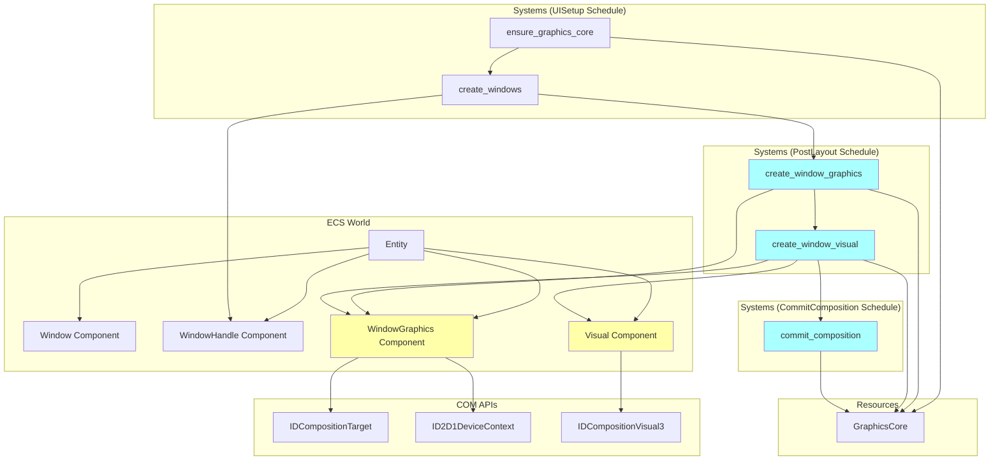
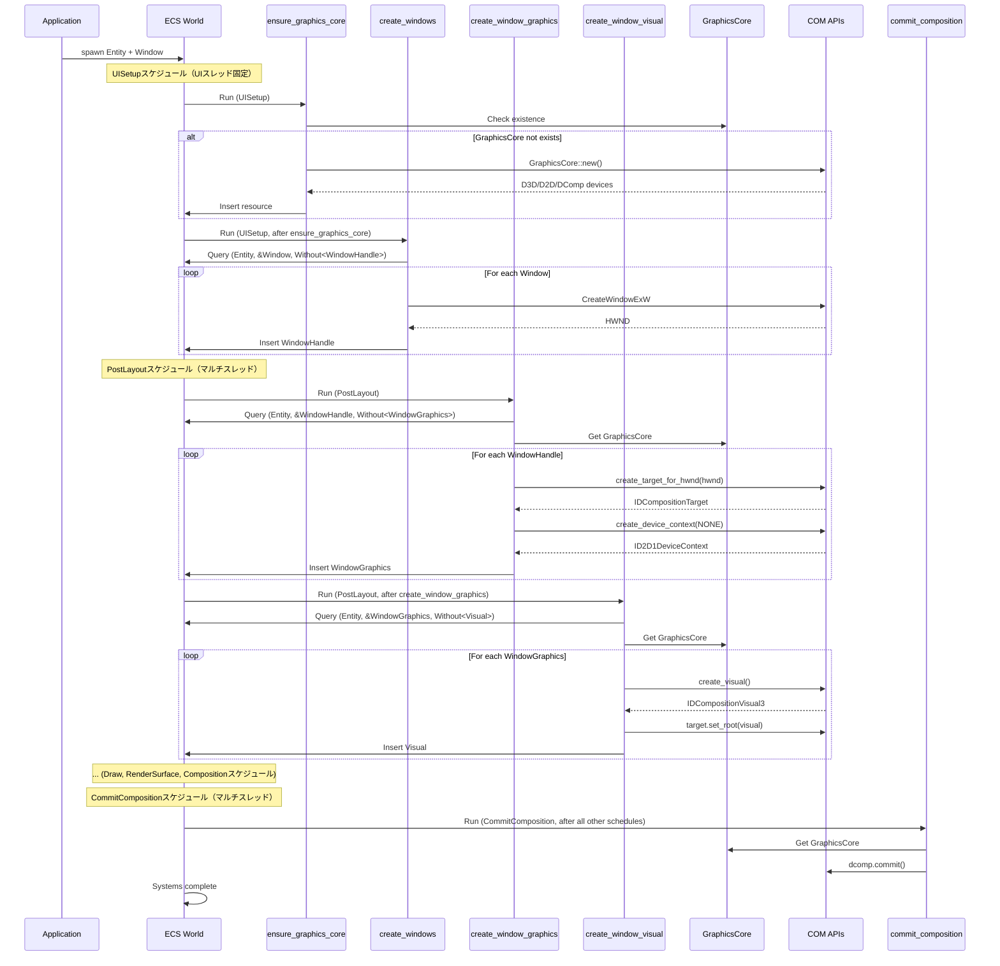
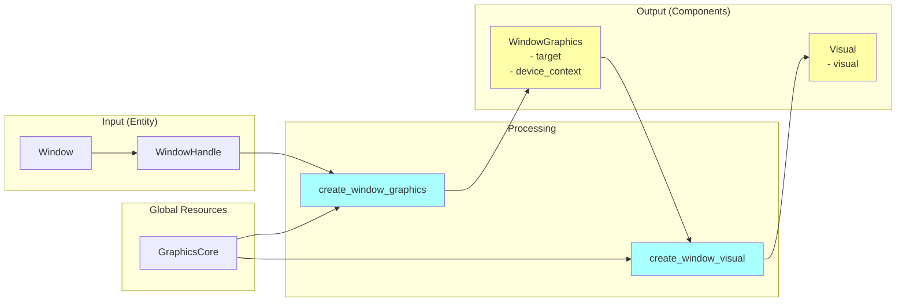
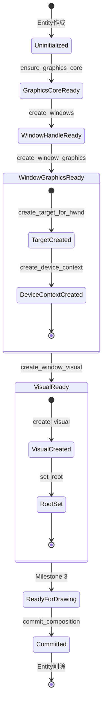

# Design Document: Phase 2 Milestone 2 - WindowGraphics + Visual作成

## Overview

### Purpose
ウィンドウごとにDirectComposition/Direct2Dのグラフィックスリソース（CompositionTarget、DeviceContext、Visual）を作成・管理する機能を実装します。これはPhase 1のウィンドウ作成基盤とMilestone 1のGraphicsCore初期化の上に構築され、Milestone 3以降の描画機能の前提条件となります。

### Scope
- **In Scope**:
  - `WindowGraphics`コンポーネント: ウィンドウごとのIDCompositionTargetとID2D1DeviceContextを保持
  - `Visual`コンポーネント: ルートビジュアル（IDCompositionVisual3）を保持
  - `create_window_graphics`システム: WindowHandleが付与されたエンティティに対してWindowGraphicsを作成（PostLayoutスケジュール）
  - `create_window_visual`システム: WindowGraphicsが存在するエンティティに対してVisualを作成（PostLayoutスケジュール）
  - `commit_composition`システム: DirectCompositionの変更を確定（CommitCompositionスケジュール）
  - 既存`graphics.rs`への統合（約280行追加）
  - システム登録とスケジュール配置（PostLayout, CommitCompositionステージ）
  - `CommitComposition`スケジュールの追加（world.rs）

- **Out of Scope**:
  - 実際の描画ロジック（Milestone 3以降）
  - ビジュアルツリーの構築（Milestone 3以降）
  - レイアウトシステムとの統合（Milestone 4以降）
  - パフォーマンス最適化（Milestone 3以降で計測後）

### Requirements Reference
本設計は`.kiro/specs/phase2-m2-window-graphics/requirements.md`の以下の要求を実装します:
- Requirement 1: WindowGraphicsコンポーネント
- Requirement 2: Visualコンポーネント
- Requirement 3: create_window_graphicsシステム
- Requirement 4: create_window_visualシステム
- Requirement 5: システム登録とスケジュール配置
- Requirement 6: エラーハンドリング

---

## Architecture

### Component Diagram



### System Flow



### Data Flow



---

## Component Specifications

### WindowGraphics Component

ウィンドウごとのDirectComposition TargetとDirect2D DeviceContextを保持します。

```rust
/// ウィンドウごとのグラフィックスリソース
#[derive(Component, Debug)]
pub struct WindowGraphics {
    /// DirectComposition Target (HWNDに関連付けられた合成ターゲット)
    pub target: IDCompositionTarget,
    /// Direct2D DeviceContext (このウィンドウでの描画に使用)
    pub device_context: ID2D1DeviceContext,
}

unsafe impl Send for WindowGraphics {}
unsafe impl Sync for WindowGraphics {}
```

**Fields**:
- `target: IDCompositionTarget`
  - HWNDに関連付けられたDirectComposition合成ターゲット
  - `GraphicsCore::desktop.create_target_for_hwnd(hwnd, topmost=true)`で作成
  - ルートビジュアルを設定するために使用（`target.set_root(visual)`）
  
- `device_context: ID2D1DeviceContext`
  - ウィンドウ固有のDirect2D描画コンテキスト
  - `GraphicsCore::d2d.create_device_context(D2D1_DEVICE_CONTEXT_OPTIONS_NONE)`で作成
  - Milestone 3以降の描画処理で使用

**Lifecycle**:
- **Creation**: `create_window_graphics`システムで自動作成（WindowHandleが存在するエンティティに対して）
- **Destruction**: エンティティ削除時にECSフレームワークが自動削除（Dropトレイトは不要、windows-rsのスマートポインターが自動的にRelease()）

**Storage**: デフォルト（Table）
- 理由: lifecycle hooksを必要としない、密なイテレーションに有利

---

### Visual Component

ウィンドウのルートビジュアルノードを保持します。

```rust
/// ウィンドウのルートビジュアルノード
#[derive(Component, Debug)]
pub struct Visual {
    /// ルートビジュアル（ビジュアルツリーの最上位ノード）
    pub visual: IDCompositionVisual3,
}

unsafe impl Send for Visual {}
unsafe impl Sync for Visual {}
```

**Fields**:
- `visual: IDCompositionVisual3`
  - DirectCompositionのビジュアルノード
  - `GraphicsCore::dcomp.create_visual()`で作成
  - `target.set_root(visual)`でルートに設定
  - Milestone 3以降でビジュアルツリーの親ノードとして機能

**Lifecycle**:
- **Creation**: `create_window_visual`システムで自動作成（WindowGraphicsが存在するエンティティに対して）
- **Destruction**: エンティティ削除時にECSフレームワークが自動削除（Dropトレイトは不要）

**Storage**: デフォルト（Table）
- 理由: WindowGraphicsと同様にlifecycle hooksを必要としない

---

## System Specifications

### create_window_graphics System

WindowHandleが付与されたエンティティに対してWindowGraphicsコンポーネントを作成します。

**Schedule**: `PostLayout`
**Execution Order**: UISetupスケジュールの後（create_windowsシステムの後に実行される）
**Thread Safety**: マルチスレッド実行可能（DirectComposition APIはスレッドセーフ）

**Query**:
```rust
Query<(Entity, &WindowHandle), Without<WindowGraphics>>
```

**Resources**:
```rust
Res<GraphicsCore>
Commands
```

**Logic**:
```rust
pub fn create_window_graphics(
    query: Query<(Entity, &WindowHandle), Without<WindowGraphics>>,
    graphics: Res<GraphicsCore>,
    mut commands: Commands,
) {
    for (entity, handle) in query.iter() {
        match create_window_graphics_for_hwnd(&graphics, handle.hwnd) {
            Ok(wg) => {
                commands.entity(entity).insert(wg);
                eprintln!(
                    "[create_window_graphics] Entity {:?} (hwnd {:?}) にWindowGraphicsを追加",
                    entity, handle.hwnd
                );
            }
            Err(e) => {
                eprintln!(
                    "[create_window_graphics] エラー: Entity {:?}, hwnd {:?}, HRESULT {:?}",
                    entity, handle.hwnd, e
                );
                // エンティティをスキップして処理を継続
            }
        }
    }
}

fn create_window_graphics_for_hwnd(
    graphics: &GraphicsCore,
    hwnd: HWND,
) -> Result<WindowGraphics> {
    use windows::Win32::Graphics::Direct2D::D2D1_DEVICE_CONTEXT_OPTIONS_NONE;
    
    // 1. CompositionTarget作成
    let target = graphics.desktop.create_target_for_hwnd(hwnd, true)?;
    
    // 2. DeviceContext作成
    let device_context = graphics.d2d.create_device_context(D2D1_DEVICE_CONTEXT_OPTIONS_NONE)?;
    
    Ok(WindowGraphics {
        target,
        device_context,
    })
}
```

**Error Handling**:
- COM APIエラーは`Result<T>`で処理
- エラー時はエンティティIDとHRESULTを含むログを出力
- エンティティの処理をスキップし、continueで次へ進む（アプリケーション全体はクラッシュしない）

**Dependencies**:
- `GraphicsCore`: グローバルグラフィックスデバイス（desktop, d2dフィールドを使用）
- `WindowHandle`: HWNDを取得（UISetupスケジュールのcreate_windowsで作成済み）

**Validation**:
- `Without<WindowGraphics>`: すでにWindowGraphicsが付与されているエンティティは処理しない（冪等性保証）
- GraphicsCoreが存在しない場合は`ensure_graphics_core`が先に実行されるため、panicは発生しない

**Design Notes**:
- **PostLayoutで実行**: UIスレッド固定が不要なため、マルチスレッド実行可能なPostLayoutに配置
- **Win32 APIは不使用**: CreateTargetForHwndは内部的な関連付けのみで、ウィンドウメッセージを送らない
- **スレッドセーフ**: DirectComposition APIはマルチスレッド対応

---

### create_window_visual System

WindowGraphicsが存在するエンティティに対してVisualコンポーネントを作成し、ルートビジュアルとして設定します。

**Schedule**: `PostLayout`
**Execution Order**: `.after(create_window_graphics)`
**Thread Safety**: マルチスレッド実行可能（DirectComposition APIはスレッドセーフ）

**Query**:
```rust
Query<(Entity, &WindowGraphics), Without<Visual>>
```

**Resources**:
```rust
Res<GraphicsCore>
Commands
```

**Logic**:
```rust
pub fn create_window_visual(
    query: Query<(Entity, &WindowGraphics), Without<Visual>>,
    graphics: Res<GraphicsCore>,
    mut commands: Commands,
) {
    for (entity, wg) in query.iter() {
        match create_visual_for_target(&graphics, &wg.target) {
            Ok(visual_comp) => {
                commands.entity(entity).insert(visual_comp);
                eprintln!(
                    "[create_window_visual] Entity {:?} にVisualを追加",
                    entity
                );
            }
            Err(e) => {
                eprintln!(
                    "[create_window_visual] エラー: Entity {:?}, HRESULT {:?}",
                    entity, e
                );
                // エンティティをスキップして処理を継続
            }
        }
    }
}

fn create_visual_for_target(
    graphics: &GraphicsCore,
    target: &IDCompositionTarget,
) -> Result<Visual> {
    // 1. ビジュアル作成
    let visual = graphics.dcomp.create_visual()?;
    
    // 2. ターゲットにルートとして設定
    target.set_root(&visual)?;
    
    Ok(Visual { visual })
}
```

**Error Handling**:
- create_window_graphicsと同様のパターン
- エラー時はエンティティIDとHRESULTを含むログを出力
- エンティティの処理をスキップし、continueで次へ進む

**Dependencies**:
- `GraphicsCore`: dcompフィールドを使用してビジュアル作成
- `WindowGraphics`: targetフィールドを使用してルート設定

**Validation**:
- `Without<Visual>`: すでにVisualが付与されているエンティティは処理しない（冪等性保証）
- WindowGraphicsが存在しない場合は自動的にクエリから除外される

**Design Notes**:
- **PostLayoutで実行**: SetRootは内部状態の変更のみでUIスレッド固定不要
- **遅延実行**: SetRootの実際の反映はCommit()まで行われない
- **スレッドセーフ**: DirectComposition APIはマルチスレッド対応

---

### commit_composition System

DirectCompositionのすべての変更を確定します。このシステムはワールドスケジュールの最後に実行されます。

**Schedule**: `CommitComposition`
**Execution Order**: すべてのスケジュール（Input, Update, PreLayout, Layout, PostLayout, UISetup, Draw, RenderSurface, Composition）の後に実行
**Thread Safety**: マルチスレッド実行可能（Commit()はスレッドセーフ）

**Query**: なし

**Resources**:
```rust
Res<GraphicsCore>
```

**Logic**:
```rust
pub fn commit_composition(graphics: Res<GraphicsCore>) {
    if let Err(e) = graphics.dcomp.commit() {
        eprintln!("[commit_composition] Commit失敗: {:?}", e);
    }
}
```

**Responsibilities**:
- DirectComposition deviceの`Commit()`メソッドを呼び出し
- すべてのビジュアル変更（ビジュアル作成、プロパティ変更、ツリー構造変更等）を確定
- 画面への反映を保証

**Error Handling**:
- COM APIエラーは`Result<T>`で処理
- エラー時はログを出力するが、アプリケーションはクラッシュしない
- 次フレームで再試行される

**Design Notes**:
- **独立したシステムとして実装**: ビジュアル作成と合成のコミットの責務を分離
- **専用スケジュール**: `CommitComposition`スケジュールは常にワールドスケジュールの最後に実行
- **複数ウィンドウ対応**: すべてのウィンドウのビジュアル変更をまとめてコミット（効率的）
- **将来の拡張性**: Milestone 3以降でビジュアルツリーの更新や描画コマンドが追加されても、コミット処理は変更不要
- **スレッドセーフ**: Commit()はマルチスレッドから安全に呼び出し可能

**Dependencies**:
- `GraphicsCore`: dcompフィールドを使用してCommit呼び出し

**Validation**: なし（常に実行される）

---

## Data Models

### COM Object Lifecycle



### Component Dependencies

```
Entity
  ├── Window (user-provided)
  ├── WindowHandle (created by create_windows)
  │     ├── hwnd: HWND
  │     ├── instance: HINSTANCE
  │     └── initial_dpi: f32
  ├── WindowGraphics (created by create_window_graphics)
  │     ├── target: IDCompositionTarget
  │     └── device_context: ID2D1DeviceContext
  └── Visual (created by create_window_visual)
        └── visual: IDCompositionVisual3

Resource: GraphicsCore
  ├── desktop: IDCompositionDesktopDevice
  ├── dcomp: IDCompositionDevice3
  ├── d2d: ID2D1Device
  ├── d2d_factory: ID2D1Factory
  ├── d3d: ID3D11Device
  ├── dxgi: IDXGIDevice4
  └── dwrite_factory: IDWriteFactory2
```

---

## Implementation Details

### File Structure

すべての実装は既存の`crates/wintf/src/ecs/graphics.rs`に追加されます。

**Estimated File Size**: ~380 lines（現在101行 + 新規約280行）

**New Code Placement**:
```rust
// crates/wintf/src/ecs/graphics.rs
// (行1-101: 既存のGraphicsCore + ensure_graphics_core)

// --- 新規追加 (行102以降) ---

// 1. WindowGraphics Component (行102-115)
#[derive(Component, Debug)]
pub struct WindowGraphics { ... }
unsafe impl Send for WindowGraphics {}
unsafe impl Sync for WindowGraphics {}

// 2. Visual Component (行117-127)
#[derive(Component, Debug)]
pub struct Visual { ... }
unsafe impl Send for Visual {}
unsafe impl Sync for Visual {}

// 3. create_window_graphics System (行129-220)
pub fn create_window_graphics(...) { ... }
fn create_window_graphics_for_hwnd(...) -> Result<WindowGraphics> { ... }

// 4. create_window_visual System (行222-290)
pub fn create_window_visual(...) { ... }
fn create_visual_for_target(...) -> Result<Visual> { ... }

// 5. commit_composition System (行292-305)
pub fn commit_composition(...) { ... }

// 6. Tests (行307-380)
#[cfg(test)]
mod tests { ... }
```

### System Registration

`crates/wintf/src/ecs/world.rs`の変更:

**1. CommitCompositionスケジュールの追加**:
```rust
/// DirectCompositionコミットスケジュール
/// 
/// Compositionスケジュールの後に実行され、すべてのビジュアル変更を確定する。
/// このスケジュールは常にワールドスケジュールの最後に実行される。
#[derive(ScheduleLabel, Clone, Debug, PartialEq, Eq, Hash)]
pub struct CommitComposition;
```

**2. スケジュール登録**:
```rust
schedules.insert(Schedule::new(CommitComposition));
```

**3. try_tick_worldでの実行**:
```rust
let _ = self.world.try_run_schedule(CommitComposition);
```

**4. システム登録**:
```rust
// PostLayoutスケジュールに登録（UISetupではない）
world.schedule.add_systems(
    PostLayout,
    (
        create_window_graphics,
        create_window_visual
            .after(create_window_graphics),
    ),
);

// --- 新規追加 ---
world.schedule.add_systems(
    CommitComposition,
    commit_composition,
);
```

**スケジュール実行順序**:
```
Input → Update → PreLayout → Layout → PostLayout → UISetup → Draw → RenderSurface → Composition → CommitComposition
                                           ↑                                                           ↑
                                    create_window_graphics                                   commit_composition
                                    create_window_visual
```

**重要**: 
- `create_window_graphics`と`create_window_visual`は**PostLayout**に配置（UIスレッド固定不要）
- `UISetup`は**UIスレッド固定が必要な処理のみ**（CreateWindowEx, DestroyWindow等のWin32 API）
- DirectComposition/Direct2D APIはマルチスレッド対応のため、PostLayoutで実行可能

### Import Additions

`graphics.rs`の先頭に以下を追加:

```rust
// 既存のインポートに追加
use windows::Win32::Graphics::Direct2D::D2D1_DEVICE_CONTEXT_OPTIONS_NONE;
```

### Test Files Required

Testing Strategyの実行に必要な新規ファイル:

| File | Purpose | Based On |
|------|---------|----------|
| `examples/simple_window.rs` | Test 1: 単一ウィンドウ初期化テスト（既存ファイルを拡張） | 既存 |
| `examples/multi_window_test.rs` | Test 2: 複数ウィンドウ並列初期化テスト | 新規作成 |
| `examples/stress_test.rs` | Test 7: パフォーマンステスト（10ウィンドウ） | 新規作成 |
| `tests/graphics_core_test.rs` | Test 5, 6: コンポーネントテスト | 既存に追加 |
| `tests/graphics_error_test.rs` | Test 4: エラーハンドリングテスト | 新規作成 |

**新規ファイルの実装優先度**:
1. **P0** (必須): `simple_window.rs`の拡張 — 基本的な動作確認
2. **P0** (必須): `multi_window_test.rs` — 複数ウィンドウでの動作確認
3. **P1** (推奨): `graphics_core_test.rs`への追加 — コンポーネント単体テスト
4. **P2** (任意): `stress_test.rs` — パフォーマンス検証
5. **P2** (任意): `graphics_error_test.rs` — エラーパス検証

### Testing Strategy

このマイルストーンは**Windows COM API、DirectComposition、ウィンドウハンドルに強く依存**するため、従来の分離されたユニットテストは困難です。現実的なテスト戦略として、**統合テスト中心のアプローチ**を採用します。

#### テスト方針

1. **実行時検証**: `simple_window.rs`サンプルを拡張し、実際のウィンドウとCOMオブジェクトを使った統合テスト
2. **ログベース検証**: 詳細なログ出力により、各システムの実行とCOMオブジェクトの生成を確認
3. **視覚的検証**: ウィンドウが実際に表示され、DirectCompositionが動作していることを目視確認
4. **複数ウィンドウ検証**: 2ウィンドウで並列処理が正しく動作することを確認

#### 1. 統合テスト（Integration Tests）

**Test 1: 単一ウィンドウでのグラフィックス初期化**
- **Target**: `examples/simple_window.rs`（既存サンプルの拡張）
- **Method**: 
  ```rust
  // simple_window.rs内でアサーションとログ出力を追加
  fn main() {
      env_logger::Builder::from_env(env_logger::Env::default().default_filter_or("debug")).init();
      
      let mut ecs = EcsWorld::new();
      ecs.world.spawn(Window {
          title: "Test Window".to_string(),
          ..Default::default()
      });
      
      // 初回実行
      ecs.run_schedule_once();
      
      // 検証: GraphicsCoreが作成されている
      let graphics_core = ecs.world.get_resource::<GraphicsCore>();
      assert!(graphics_core.is_some(), "GraphicsCoreが作成されていない");
      
      // 検証: エンティティがすべてのコンポーネントを持つ
      let mut query = ecs.world.query::<(Entity, &WindowHandle, &WindowGraphics, &Visual)>();
      let results: Vec<_> = query.iter(&ecs.world).collect();
      assert_eq!(results.len(), 1, "ウィンドウエンティティが見つからない");
      
      let (entity, handle, graphics, visual) = results[0];
      println!("[TEST] Entity {:?}: HWND={:?}", entity, handle.hwnd);
      println!("[TEST] WindowGraphics: IDCompositionTarget created");
      println!("[TEST] Visual: IDCompositionVisual3 created");
      
      // COMオブジェクトの有効性確認
      assert!(!graphics.target.is_invalid(), "IDCompositionTargetが無効");
      assert!(!graphics.d2d_context.is_invalid(), "ID2D1DeviceContextが無効");
      assert!(!visual.root.is_invalid(), "IDCompositionVisual3が無効");
  }
  ```
- **Expected Logs**:
  ```
  [DEBUG] ensure_graphics_core: GraphicsCore作成開始
  [DEBUG] ensure_graphics_core: GraphicsCore作成完了
  [DEBUG] create_windows: ウィンドウ作成開始 (Entity: 0v0)
  [DEBUG] create_windows: ウィンドウ作成完了 (Entity: 0v0, HWND: 0x...)
  [DEBUG] create_window_graphics: WindowGraphics作成開始 (Entity: 0v0, HWND: 0x...)
  [DEBUG] create_window_graphics: IDCompositionTarget作成完了
  [DEBUG] create_window_graphics: ID2D1DeviceContext作成完了
  [DEBUG] create_window_graphics: WindowGraphics作成完了 (Entity: 0v0)
  [DEBUG] create_window_visual: Visual作成開始 (Entity: 0v0)
  [DEBUG] create_window_visual: IDCompositionVisual3作成完了
  [DEBUG] create_window_visual: SetRoot完了
  [DEBUG] create_window_visual: Visual作成完了 (Entity: 0v0)
  [DEBUG] commit_composition: Commit開始
  [DEBUG] commit_composition: Commit完了
  [TEST] Entity 0v0: HWND=0x...
  [TEST] WindowGraphics: IDCompositionTarget created
  [TEST] Visual: IDCompositionVisual3 created
  ```
- **Success Criteria**:
  - すべてのログが順序通りに出力される
  - アサーションが通過する
  - ウィンドウが画面に表示される（黒いウィンドウ）

**Test 2: 複数ウィンドウでの並列グラフィックス初期化**
- **Target**: `examples/multi_window_test.rs`（新規作成）
- **Method**:
  ```rust
  fn main() {
      env_logger::Builder::from_env(env_logger::Env::default().default_filter_or("debug")).init();
      
      let mut ecs = EcsWorld::new();
      
      // 3つのウィンドウを作成
      ecs.world.spawn(Window {
          title: "Window 1".to_string(),
          ..Default::default()
      });
      ecs.world.spawn(Window {
          title: "Window 2".to_string(),
          ..Default::default()
      });
      ecs.world.spawn(Window {
          title: "Window 3".to_string(),
          ..Default::default()
      });
      
      // 初回実行
      ecs.run_schedule_once();
      
      // 検証: 3つのエンティティがすべてのコンポーネントを持つ
      let mut query = ecs.world.query::<(Entity, &WindowHandle, &WindowGraphics, &Visual)>();
      let results: Vec<_> = query.iter(&ecs.world).collect();
      assert_eq!(results.len(), 3, "3つのウィンドウすべてが初期化されるべき");
      
      for (entity, handle, graphics, visual) in results {
          println!("[TEST] Entity {:?}: HWND={:?}", entity, handle.hwnd);
          assert!(!graphics.target.is_invalid(), "Entity {:?}: IDCompositionTargetが無効", entity);
          assert!(!graphics.d2d_context.is_invalid(), "Entity {:?}: ID2D1DeviceContextが無効", entity);
          assert!(!visual.root.is_invalid(), "Entity {:?}: IDCompositionVisual3が無効", entity);
      }
      
      println!("[TEST] すべてのウィンドウが正常に初期化されました");
  }
  ```
- **Expected Behavior**:
  - 3つのウィンドウが画面に表示される
  - 各ウィンドウが独立したIDCompositionTarget, ID2D1DeviceContext, IDCompositionVisual3を持つ
  - ログに3つのウィンドウの初期化シーケンスが出力される
  - Commit()は1回のみ呼ばれる（CommitCompositionスケジュール）
- **Success Criteria**:
  - 3つのウィンドウすべてが表示される
  - アサーションがすべて通過する
  - 各エンティティのCOMオブジェクトが有効

**Test 3: 冪等性確認（システムの複数回実行）**
- **Target**: `examples/simple_window.rs`に追加テストケース
- **Method**:
  ```rust
  // 初回実行
  ecs.run_schedule_once();
  
  // 2回目の実行（すべてのコンポーネントが既に存在）
  ecs.run_schedule_once();
  
  // 検証: コンポーネントが重複して作成されていない
  let mut query = ecs.world.query::<(Entity, &WindowHandle, &WindowGraphics, &Visual)>();
  let results: Vec<_> = query.iter(&ecs.world).collect();
  assert_eq!(results.len(), 1, "エンティティが重複していない");
  
  // ログ確認: 2回目の実行で"Without<T>"により処理がスキップされる
  // 期待されるログ: create_window_graphics, create_window_visualの実行なし
  ```
- **Expected Logs**:
  ```
  [1回目]
  [DEBUG] create_window_graphics: WindowGraphics作成開始 (Entity: 0v0)
  [DEBUG] create_window_graphics: WindowGraphics作成完了 (Entity: 0v0)
  [DEBUG] create_window_visual: Visual作成開始 (Entity: 0v0)
  [DEBUG] create_window_visual: Visual作成完了 (Entity: 0v0)
  
  [2回目]
  (create_window_graphics, create_window_visualのログが出ない)
  [DEBUG] commit_composition: Commit開始
  [DEBUG] commit_composition: Commit完了
  ```
- **Success Criteria**:
  - 2回目の実行でWindowGraphics/Visualが再作成されない
  - コンポーネント数が変わらない

**Test 4: エラーハンドリング（無効なHWND）**
- **Target**: `tests/graphics_error_test.rs`（新規作成）
- **Method**:
  ```rust
  #[test]
  #[should_panic(expected = "CreateTargetForHwnd failed")]
  fn test_invalid_hwnd() {
      let mut world = World::new();
      world.insert_resource(GraphicsCore::new().unwrap());
      
      // 無効なHWNDを持つエンティティを作成
      world.spawn((
          WindowHandle { hwnd: HWND(std::ptr::null_mut()) },
      ));
      
      // システム実行（パニックするはず）
      let mut schedule = Schedule::default();
      schedule.add_systems(create_window_graphics);
      schedule.run(&mut world);
  }
  ```
- **Expected Behavior**: `CreateTargetForHwnd`が失敗し、詳細なエラーログとパニックが発生
- **Success Criteria**: テストが正しくパニックする

#### 2. コンポーネントテスト（Component Tests）

**Test 5: GraphicsCoreからのDeviceContext作成**
- **Target**: `tests/graphics_core_test.rs`（既存テストに追加）
- **Method**:
  ```rust
  #[test]
  fn test_create_device_context() {
      let graphics = GraphicsCore::new().expect("GraphicsCore作成失敗");
      
      let dc = graphics.d2d.create_device_context(
          D2D1_DEVICE_CONTEXT_OPTIONS_NONE
      ).expect("DeviceContext作成失敗");
      
      assert!(!dc.is_invalid(), "DeviceContextが無効");
  }
  ```
- **Success Criteria**: DeviceContextが正常に作成される

**Test 6: GraphicsCoreからのVisual作成**
- **Target**: `tests/graphics_core_test.rs`（既存テストに追加）
- **Method**:
  ```rust
  #[test]
  fn test_create_visual() {
      let graphics = GraphicsCore::new().expect("GraphicsCore作成失敗");
      
      let visual = graphics.dcomp.create_visual()
          .expect("Visual作成失敗");
      
      assert!(!visual.is_invalid(), "Visualが無効");
  }
  ```
- **Success Criteria**: Visualが正常に作成される

#### 3. パフォーマンステスト（Performance Tests）

**Test 7: 大量ウィンドウ作成時の性能**
- **Target**: `examples/stress_test.rs`（新規作成）
- **Method**:
  ```rust
  fn main() {
      let mut ecs = EcsWorld::new();
      
      // 10ウィンドウを作成
      for i in 0..10 {
          ecs.world.spawn(Window {
              title: format!("Window {}", i),
              ..Default::default()
          });
      }
      
      let start = std::time::Instant::now();
      ecs.run_schedule_once();
      let elapsed = start.elapsed();
      
      println!("[PERF] 10ウィンドウの初期化時間: {:?}", elapsed);
      
      // 検証: すべてのウィンドウが正常に初期化される
      let mut query = ecs.world.query::<(&WindowHandle, &WindowGraphics, &Visual)>();
      assert_eq!(query.iter(&ecs.world).count(), 10);
  }
  ```
- **Expected Performance**: 10ウィンドウの初期化が500ms以内
- **Success Criteria**: パフォーマンス目標を達成し、すべてのウィンドウが正常に表示される

#### 4. ログ出力の実装

各システムに以下のログを追加:

```rust
// create_window_graphics
debug!("create_window_graphics: WindowGraphics作成開始 (Entity: {:?}, HWND: {:?})", entity, handle.hwnd);
debug!("create_window_graphics: IDCompositionTarget作成完了");
debug!("create_window_graphics: ID2D1DeviceContext作成完了");
debug!("create_window_graphics: WindowGraphics作成完了 (Entity: {:?})", entity);

// エラー時
error!("create_window_graphics: CreateTargetForHwnd failed (Entity: {:?}, HWND: {:?}, HRESULT: {:?})", 
       entity, handle.hwnd, e);

// create_window_visual
debug!("create_window_visual: Visual作成開始 (Entity: {:?})", entity);
debug!("create_window_visual: IDCompositionVisual3作成完了");
debug!("create_window_visual: SetRoot完了");
debug!("create_window_visual: Visual作成完了 (Entity: {:?})", entity);

// エラー時
error!("create_window_visual: CreateVisual failed (Entity: {:?}, HRESULT: {:?})", entity, e);

// commit_composition
debug!("commit_composition: Commit開始");
debug!("commit_composition: Commit完了");

// エラー時
error!("commit_composition: Commit failed (HRESULT: {:?})", e);
```

#### テスト実行手順

1. **依存関係の追加** (`Cargo.toml`):
   ```toml
   [dev-dependencies]
   env_logger = "0.11"
   ```

2. **統合テストの実行**:
   ```powershell
   # Test 1: 単一ウィンドウ
   $env:RUST_LOG="debug"; cargo run --example simple_window
   
   # Test 2: 複数ウィンドウ
   $env:RUST_LOG="debug"; cargo run --example multi_window_test
   
   # Test 7: パフォーマンステスト
   $env:RUST_LOG="info"; cargo run --example stress_test --release
   ```

3. **コンポーネントテストの実行**:
   ```powershell
   cargo test --test graphics_core_test
   cargo test --test graphics_error_test
   ```

4. **視覚的確認**:
   - 各テストでウィンドウが正しく表示されることを確認
   - 複数ウィンドウテストで、すべてのウィンドウが独立して表示されることを確認

#### テストカバレッジ目標

- **システム実行パス**: 100%（3つのシステムすべて）
- **エラーハンドリング**: 主要なCOM APIエラーパス
- **冪等性**: Without<T>フィルタの動作確認
- **並列処理**: 複数エンティティの同時処理確認

---

## Migration & Rollout

### Migration Path
新規機能のため、既存コードへの影響は最小限です。

**変更ファイル**:
1. `crates/wintf/src/ecs/graphics.rs`: 約280行追加（WindowGraphics, Visual, 3システム）
2. `crates/wintf/src/ecs/world.rs`: CommitCompositionスケジュール追加、システム登録

### Rollback Plan
- このマイルストーンの変更は`graphics.rs`と`world.rs`の2ファイルのみ
- ロールバック時は該当コミットをrevert
- 依存するMilestone 3以降の機能が未実装のため、ロールバックの影響範囲は限定的
- CommitCompositionスケジュールの削除が必要（world.rsから3箇所削除）

### Compatibility
- **Backward Compatible**: Phase 1の既存ウィンドウ作成機能は変更なし
- **Forward Compatible**: Milestone 3の描画実装はこの設計に依存

---

## Risks & Mitigations

| Risk | Severity | Mitigation | Owner |
|------|----------|------------|-------|
| 複数ウィンドウでのCompositionTarget動作が未検証 | Medium | simple_window.rsを拡張して2ウィンドウのテストケースを作成 | 実装者 |
| DeviceContext作成オプションが不明確 | Low | D2D1_DEVICE_CONTEXT_OPTIONS_NONEで開始、問題があればMilestone 3で調整 | 実装者 |
| COMエラーのデバッグが困難 | Low | HRESULTコードを含む詳細ログ出力、エンティティIDも記録 | 実装者 |
| ファイルサイズが大きくなる（~380行） | Low | 500行を超えた場合はモジュール分割を検討（Milestone 4以降） | アーキテクト |
| Commit失敗時の動作が未定義 | Low | エラーログを出力し、次フレームで自動再試行 | 実装者 |

---

## Open Questions
なし（研究フェーズですべて解決済み）

**重要な設計決定の記録**:
- **topmost**: ハードコード（`true`固定）でOK。DirectComposition使用時は基本的にtopmost=trueを使用。bottomレイヤー（topmost=false）はGDI描画との混在が必要な場合のみで、本プロジェクトのスコープ外。
- **CommitComposition**: 専用スケジュールを作成し、ワールドスケジュールの最後に実行。原則として、Compositionスケジュールの後に`CommitComposition`スケジュールを配置する設計パターンを採用。

---

## References
- `.kiro/specs/phase2-m2-window-graphics/requirements.md` — EARS形式の要求仕様
- `.kiro/specs/phase2-m2-window-graphics/gap-analysis.md` — 実装ギャップ分析
- `.kiro/specs/phase2-m2-window-graphics/research.md` — 調査ログと設計判断
- `crates/wintf/src/ecs/graphics.rs` — GraphicsCore実装（既存）
- `crates/wintf/src/ecs/window.rs` — Window/WindowHandle実装（既存）
- `crates/wintf/src/com/dcomp.rs` — DirectComposition APIラッパー（既存）
- [Microsoft Docs - DirectComposition](https://learn.microsoft.com/en-us/windows/win32/directcomp/directcomposition-portal)
- [Microsoft Docs - Direct2D Device Contexts](https://learn.microsoft.com/en-us/windows/win32/direct2d/devices-and-device-contexts)
