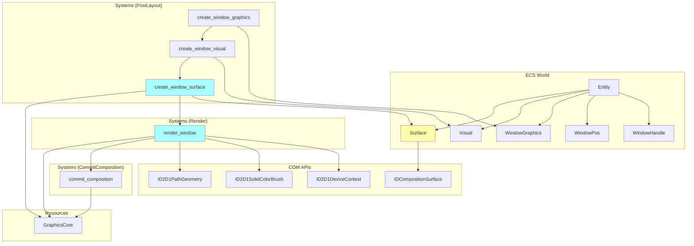
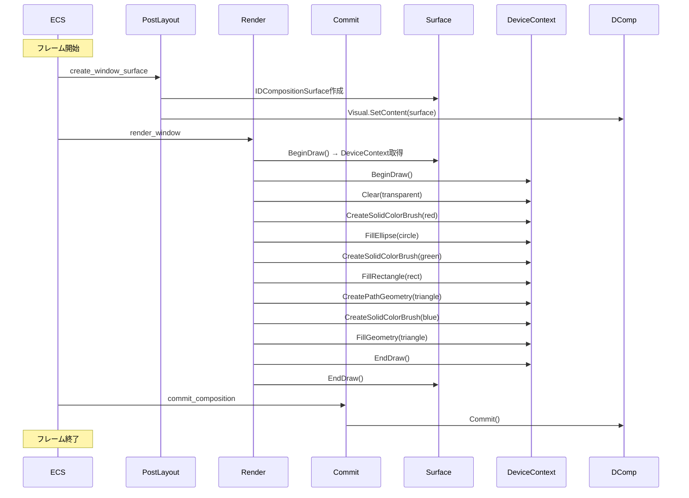

# Design Document: Phase 2 Milestone 3 - 初めての描画

## Overview

### Purpose
WindowエンティティにIDCompositionSurfaceを作成し、Direct2Dで透明背景に赤い円●、緑の四角■、青い三角▲を描画します。DirectComposition + Direct2Dの描画パイプライン全体を動作させ、**初めて視覚的な結果を確認する**重要なマイルストーンです。

### Scope
- **In Scope**:
  - `Surface`コンポーネント: IDCompositionSurfaceを保持
  - `create_window_surface`システム: WindowGraphics + Visualが存在するエンティティに対してSurfaceを作成（PostLayoutスケジュール）
  - `render_window`システム: Surfaceに対して図形を描画（専用Renderスケジュール）
  - `commit_composition`システムの更新: 既存のcommit処理を維持（CommitCompositionスケジュール）
  - 描画内容: 透明背景 + 赤い円 + 緑の四角 + 青い三角
  - ブラシ作成: 赤、緑、青のソリッドカラーブラシ
  - PathGeometry作成: 三角形の複雑な図形定義
  - 既存`graphics.rs`への統合（約350行追加）
  - スケジュール追加: `Render`スケジュール（world.rs）

- **Out of Scope**:
  - 子Visual要素の管理（Milestone 4で対応）
  - デバイスロスト対応（将来の拡張）
  - テキスト描画（Phase 4で対応）
  - レイアウトシステム（将来の拡張）
  - ブラシのキャッシング（パフォーマンス最適化は後で）

### Requirements Reference
本設計は`.kiro/specs/phase2-m3-first-rendering/requirements.md`の以下の要求を実装します:
- Requirement 1: Surfaceコンポーネントの作成と管理
- Requirement 2: 描画処理の実装
- Requirement 3: ブラシリソース管理
- Requirement 4: PathGeometry作成と三角形描画
- Requirement 5: Commit処理の実装
- Requirement 6: システム実行順序とスケジュール配置
- Requirement 7: エラーハンドリングとログ出力
- Requirement 8: コンポーネント統合

---

## Architecture

### Component Diagram



### System Execution Flow



---

## Component Specifications

### Surface Component

ウィンドウに描画可能なIDCompositionSurfaceを保持します。

```rust
/// ウィンドウの描画サーフェス
#[derive(Component, Debug)]
pub struct Surface {
    /// DirectComposition Surface (描画ターゲット)
    pub surface: IDCompositionSurface,
}

unsafe impl Send for Surface {}
unsafe impl Sync for Surface {}
```

**Fields**:
- `surface: IDCompositionSurface`
  - DirectCompositionの描画サーフェス
  - `GraphicsCore::dcomp.create_surface(width, height, DXGI_FORMAT_B8G8R8A8_UNORM, DXGI_ALPHA_MODE_PREMULTIPLIED)`で作成
  - `surface.begin_draw(None)`で描画用のID2D1DeviceContextを取得
  - `Visual::visual.set_content(&surface)`でビジュアルのコンテンツとして設定

**Lifecycle**:
- **Creation**: `create_window_surface`システムで自動作成（WindowGraphics + Visualが存在するエンティティに対して）
- **Destruction**: エンティティ削除時にECSフレームワークが自動削除（Dropトレイトは不要、windows-rsのスマートポインターが自動Release()）

**Storage**: デフォルト（Table）
- 理由: lifecycle hooksを必要としない、描画処理での密なイテレーションに有利

**Access Methods**:
```rust
impl Surface {
    /// IDCompositionSurfaceへの参照を取得
    pub fn surface(&self) -> &IDCompositionSurface {
        &self.surface
    }
}
```

---

## System Specifications

### create_window_surface System

WindowGraphicsとVisualが存在するエンティティに対してSurfaceコンポーネントを作成します。

**Schedule**: `PostLayout`
**Execution Order**: `create_window_visual`システムの後に実行される
**Thread Safety**: マルチスレッド実行可能（DirectComposition APIはスレッドセーフ）

**Query**:
```rust
Query<(Entity, &WindowGraphics, &Visual, Option<&WindowPos>), Without<Surface>>
```

**Resources**:
```rust
Res<GraphicsCore>
Commands
```

**Logic**:
```rust
pub fn create_window_surface(
    query: Query<(Entity, &WindowGraphics, &Visual, Option<&WindowPos>), Without<Surface>>,
    graphics: Option<Res<GraphicsCore>>,
    mut commands: Commands,
) {
    // GraphicsCoreが存在しない場合は警告してスキップ
    let Some(graphics) = graphics else {
        if !query.is_empty() {
            eprintln!("[create_window_surface] 警告: GraphicsCoreが存在しないため処理をスキップします");
        }
        return;
    };

    for (entity, _wg, visual, window_pos) in query.iter() {
        // サイズ取得: WindowPosから、なければデフォルト (800, 600)
        let (width, height) = window_pos
            .and_then(|pos| pos.size.map(|s| (s.cx as u32, s.cy as u32)))
            .unwrap_or((800, 600));

        eprintln!(
            "[create_window_surface] Surface作成開始 (Entity: {:?}, Size: {}x{})",
            entity, width, height
        );

        match create_surface_for_window(&graphics, visual, width, height) {
            Ok(surface_comp) => {
                eprintln!(
                    "[create_window_surface] Surface作成完了 (Entity: {:?})",
                    entity
                );
                commands.entity(entity).insert(surface_comp);
            }
            Err(e) => {
                eprintln!(
                    "[create_window_surface] エラー: Entity {:?}, HRESULT {:?}",
                    entity, e
                );
                // エンティティをスキップして処理を継続
            }
        }
    }
}

fn create_surface_for_window(
    graphics: &GraphicsCore,
    visual: &Visual,
    width: u32,
    height: u32,
) -> Result<Surface> {
    use windows::Win32::Graphics::Dxgi::Common::*;

    // 1. IDCompositionSurface作成
    eprintln!("[create_window_surface] IDCompositionSurface作成中...");
    let surface = graphics.dcomp.create_surface(
        width,
        height,
        DXGI_FORMAT_B8G8R8A8_UNORM,
        DXGI_ALPHA_MODE_PREMULTIPLIED,
    )?;
    eprintln!("[create_window_surface] IDCompositionSurface作成完了");

    // 2. VisualにSurfaceを設定
    eprintln!("[create_window_surface] Visual.SetContent()実行中...");
    visual.visual.set_content(&surface)?;
    eprintln!("[create_window_surface] Visual.SetContent()完了");

    Ok(Surface { surface })
}
```

**Error Handling**:
- COM APIエラーは`Result<T>`で処理
- エラー発生時はエンティティをスキップ、処理は継続
- 詳細なエラーログを出力（Entity ID、HRESULT）

**Requirements Coverage**: 1.1-1.12

---

### render_window System

Surfaceに対して図形を描画します。

**Schedule**: `Render`（新規作成）
**Execution Order**: `create_window_surface`システムの後に実行される
**Thread Safety**: マルチスレッド実行可能（各Surfaceは独立）

**Query**:
```rust
Query<&Surface, Added<Surface>>
```

**Resources**:
```rust
Res<GraphicsCore>
```

**Logic**:
```rust
pub fn render_window(
    query: Query<&Surface, Added<Surface>>,
    graphics: Option<Res<GraphicsCore>>,
) {
    let Some(graphics) = graphics else {
        return;
    };

    for surface in query.iter() {
        if let Err(e) = render_shapes(&graphics, &surface.surface) {
            eprintln!("[render_window] 描画エラー: {:?}", e);
        }
    }
}

fn render_shapes(
    graphics: &GraphicsCore,
    surface: &IDCompositionSurface,
) -> Result<()> {
    use windows::Win32::Graphics::Direct2D::Common::*;

    // 1. BeginDraw() → DeviceContext取得
    let (dc, _offset) = surface.begin_draw(None)?;
    
    // 2. BeginDraw()
    unsafe { dc.BeginDraw() };

    // 3. Clear(transparent)
    dc.clear(Some(&D2D1_COLOR_F {
        r: 0.0,
        g: 0.0,
        b: 0.0,
        a: 0.0,
    }));

    // 4. 赤い円を描画
    let red_brush = dc.create_solid_color_brush(
        &D2D1_COLOR_F { r: 1.0, g: 0.0, b: 0.0, a: 1.0 },
        None,
    )?;
    
    unsafe {
        dc.FillEllipse(
            &D2D1_ELLIPSE {
                point: D2D_POINT_2F { x: 100.0, y: 100.0 },
                radiusX: 50.0,
                radiusY: 50.0,
            },
            &red_brush,
        );
    }

    // 5. 緑の四角を描画
    let green_brush = dc.create_solid_color_brush(
        &D2D1_COLOR_F { r: 0.0, g: 1.0, b: 0.0, a: 1.0 },
        None,
    )?;
    
    unsafe {
        dc.FillRectangle(
            &D2D_RECT_F {
                left: 200.0,
                top: 50.0,
                right: 300.0,
                bottom: 150.0,
            },
            &green_brush,
        );
    }

    // 6. 青い三角を描画
    let triangle = create_triangle_geometry(&graphics.d2d_factory)?;
    let blue_brush = dc.create_solid_color_brush(
        &D2D1_COLOR_F { r: 0.0, g: 0.0, b: 1.0, a: 1.0 },
        None,
    )?;
    
    unsafe {
        dc.FillGeometry(&triangle, &blue_brush, None);
    }

    // 7. EndDraw()
    unsafe { dc.EndDraw(None, None)? };

    // 8. Surface.EndDraw()
    surface.end_draw()?;

    Ok(())
}

fn create_triangle_geometry(factory: &ID2D1Factory) -> Result<ID2D1PathGeometry> {
    use windows::Win32::Graphics::Direct2D::Common::*;

    // PathGeometry作成
    let geometry: ID2D1PathGeometry = unsafe { factory.CreatePathGeometry()? };
    
    // GeometrySink取得
    let sink = unsafe { geometry.Open()? };

    // 三角形の頂点を定義
    unsafe {
        sink.BeginFigure(
            D2D_POINT_2F { x: 350.0, y: 50.0 }, // 第1頂点
            D2D1_FIGURE_BEGIN_FILLED,
        );
        
        sink.AddLine(D2D_POINT_2F { x: 425.0, y: 150.0 }); // 第2頂点
        sink.AddLine(D2D_POINT_2F { x: 275.0, y: 150.0 }); // 第3頂点
        
        sink.EndFigure(D2D1_FIGURE_END_CLOSED);
        
        sink.Close()?;
    }

    Ok(geometry)
}
```

**Error Handling**:
- COM APIエラーは`Result<T>`で処理
- エラー発生時はそのウィンドウの描画をスキップ、処理は継続
- ブラシ作成失敗時はその図形をスキップ
- PathGeometry作成失敗時は三角形をスキップ

**Requirements Coverage**: 2.1-2.20, 3.1-3.6, 4.1-4.12

---

### commit_composition System

既存のシステムを維持します。変更はありません。

**Schedule**: `CommitComposition`
**Execution Order**: すべてのスケジュールの最後
**Thread Safety**: マルチスレッド実行可能（Commit()はスレッドセーフ）

**Logic**:
```rust
pub fn commit_composition(graphics: Option<Res<GraphicsCore>>) {
    let Some(graphics) = graphics else {
        return;
    };

    if let Err(e) = graphics.dcomp.commit() {
        eprintln!("[commit_composition] Commit失敗: {:?}", e);
    }
}
```

**Requirements Coverage**: 5.1-5.6

---

## Data Flow

### Surface Creation Flow

```
Window Entity (with WindowGraphics + Visual)
  ↓
create_window_surface system
  ↓
1. WindowPosからサイズ取得 (default: 800x600)
  ↓
2. GraphicsCore.dcomp.create_surface()
   - DXGI_FORMAT_B8G8R8A8_UNORM
   - DXGI_ALPHA_MODE_PREMULTIPLIED
  ↓
3. Visual.visual.set_content(surface)
  ↓
4. Surface component added to entity
```

### Rendering Flow

```
Surface component
  ↓
render_window system
  ↓
1. surface.begin_draw(None) → (DeviceContext, offset)
  ↓
2. dc.BeginDraw()
  ↓
3. dc.Clear(transparent)
  ↓
4. Draw red circle
   - dc.create_solid_color_brush(red)
   - dc.FillEllipse(center: 100,100, radius: 50,50)
  ↓
5. Draw green rectangle
   - dc.create_solid_color_brush(green)
   - dc.FillRectangle(200,50 - 300,150)
  ↓
6. Draw blue triangle
   - create_triangle_geometry() → PathGeometry
   - dc.create_solid_color_brush(blue)
   - dc.FillGeometry(triangle: 350,50 - 425,150 - 275,150)
  ↓
7. dc.EndDraw()
  ↓
8. surface.end_draw()
```

---

## Schedule Configuration

### New Schedule: Render

`world.rs`に新しいスケジュール`Render`を追加します。

```rust
/// 描画スケジュール
///
/// IDCompositionSurfaceへの描画処理を実行する。
/// Surface.BeginDraw/EndDrawでDeviceContextを取得し、図形を描画する。
/// マルチスレッド実行可能（各Surfaceは独立）。
#[derive(ScheduleLabel, Clone, Debug, PartialEq, Eq, Hash)]
pub struct Render;
```

### Schedule Execution Order

```
Input
  ↓
Update
  ↓
PreLayout
  ↓
Layout
  ↓
PostLayout  ← create_window_graphics, create_window_visual, create_window_surface
  ↓
UISetup
  ↓
Draw  (既存、今回は未使用)
  ↓
Render  ← render_window (NEW!)
  ↓
RenderSurface  (既存、今回は未使用)
  ↓
Composition  (既存、今回は未使用)
  ↓
CommitComposition  ← commit_composition
```

**Requirements Coverage**: 6.1-6.9

---

## COM API Extensions

### Direct2D Extensions

`crates/wintf/src/com/d2d/mod.rs`に既存のAPIラッパーを使用します。

**Required APIs** (既存):
- `D2D1DeviceContextExt::clear()` ✅
- `D2D1DeviceContextExt::create_solid_color_brush()` ✅

**Required APIs** (追加が必要):
```rust
pub trait D2D1DeviceContextExt {
    // 既存メソッド...
    
    /// FillEllipse
    fn fill_ellipse<P0>(&self, ellipse: &D2D1_ELLIPSE, brush: P0)
    where
        P0: Param<ID2D1Brush>;
    
    /// FillRectangle
    fn fill_rectangle<P0>(&self, rect: &D2D_RECT_F, brush: P0)
    where
        P0: Param<ID2D1Brush>;
    
    /// FillGeometry
    fn fill_geometry<P0, P1>(&self, geometry: P0, brush: P1, opacity_brush: Option<P1>)
    where
        P0: Param<ID2D1Geometry>,
        P1: Param<ID2D1Brush>;
}

impl D2D1DeviceContextExt for ID2D1DeviceContext {
    #[inline(always)]
    fn fill_ellipse<P0>(&self, ellipse: &D2D1_ELLIPSE, brush: P0)
    where
        P0: Param<ID2D1Brush>,
    {
        unsafe { self.FillEllipse(ellipse, brush) }
    }
    
    #[inline(always)]
    fn fill_rectangle<P0>(&self, rect: &D2D_RECT_F, brush: P0)
    where
        P0: Param<ID2D1Brush>,
    {
        unsafe { self.FillRectangle(rect, brush) }
    }
    
    #[inline(always)]
    fn fill_geometry<P0, P1>(&self, geometry: P0, brush: P1, opacity_brush: Option<P1>)
    where
        P0: Param<ID2D1Geometry>,
        P1: Param<ID2D1Brush>,
    {
        unsafe { self.FillGeometry(geometry, brush, opacity_brush) }
    }
}
```

**Required APIs** (ID2D1Factory):
```rust
pub trait D2D1FactoryExt {
    /// CreatePathGeometry
    fn create_path_geometry(&self) -> Result<ID2D1PathGeometry>;
}

impl D2D1FactoryExt for ID2D1Factory {
    #[inline(always)]
    fn create_path_geometry(&self) -> Result<ID2D1PathGeometry> {
        unsafe { self.CreatePathGeometry() }
    }
}
```

### DirectComposition Extensions

`crates/wintf/src/com/dcomp.rs`の既存のAPIラッパーを使用します。

**Required APIs** (既存):
- `DCompositionDeviceExt::create_surface()` ✅
- `DCompositionSurfaceExt::begin_draw()` ✅
- `DCompositionSurfaceExt::end_draw()` ✅
- `DCompositionVisualExt::set_content()` ✅

---

## Error Handling Strategy

### Error Propagation

- すべてのCOM API呼び出しは`Result<T>`を返す
- システム内部のヘルパー関数も`Result<T>`を返す
- システムレベルでは`match`でエラーをハンドリング

### Error Recovery

- **Surface作成失敗**: そのエンティティをスキップ、他のウィンドウは継続
- **描画失敗**: そのウィンドウの描画をスキップ、他のウィンドウは継続
- **ブラシ作成失敗**: その図形をスキップ、残りの図形は描画
- **PathGeometry作成失敗**: 三角形をスキップ、円と四角は描画
- **Commit失敗**: エラーログを出力、次フレームで再試行

### Logging Strategy

- **開始時**: Entity ID、サイズ情報をログ出力
- **成功時**: 完了メッセージをログ出力
- **失敗時**: Entity ID、HRESULT、エラー内容をログ出力
- **ログレベル**: `eprintln!`を使用（デバッグビルドで表示）

**Requirements Coverage**: 7.1-7.7

---

## Testing Strategy

### Unit Testing

テスト対象外（COM APIの統合テストが主体）

### Integration Testing

1. **Surface作成テスト** (`examples/simple_window.rs`を拡張)
   - 1ウィンドウ作成
   - `run_schedule_once()`実行
   - Query<(&WindowHandle, &WindowGraphics, &Visual, &Surface)>で全コンポーネントの存在を確認

2. **描画テスト** (手動確認)
   - ウィンドウを起動
   - 透明背景が表示されることを確認（デスクトップが透ける）
   - 赤い円●が表示されることを確認（中心: 100,100, 半径: 50）
   - 緑の四角■が表示されることを確認（200,50 - 300,150）
   - 青い三角▲が表示されることを確認（頂点: 350,50 - 425,150 - 275,150）

3. **エラーハンドリングテスト**
   - GraphicsCoreなしでの動作確認
   - 不正なサイズでのSurface作成

### Success Criteria

- ✅ ウィンドウに透過背景で●■▲が表示される
- ✅ デスクトップが透けて見える
- ✅ エラーなし
- ✅ フレームレート安定（60fps程度）

---

## Implementation Files

### Modified Files

1. **`crates/wintf/src/ecs/graphics.rs`** (約350行追加)
   - `Surface`コンポーネント定義
   - `create_window_surface`システム実装
   - `render_window`システム実装
   - `create_triangle_geometry`ヘルパー関数
   - `render_shapes`ヘルパー関数

2. **`crates/wintf/src/ecs/world.rs`** (約10行追加)
   - `Render`スケジュール定義
   - システム登録: `create_window_surface`, `render_window`

3. **`crates/wintf/src/com/d2d/mod.rs`** (約50行追加)
   - `D2D1DeviceContextExt::fill_ellipse()`
   - `D2D1DeviceContextExt::fill_rectangle()`
   - `D2D1DeviceContextExt::fill_geometry()`
   - `D2D1FactoryExt::create_path_geometry()`

### Test Files

4. **`crates/wintf/examples/simple_window.rs`** (拡張)
   - Surface存在確認テスト追加
   - 描画結果の手動確認

---

## Performance Considerations

### Memory Usage

- Surface: ウィンドウサイズに応じたビットマップメモリ（800x600 = 約1.8MB）
- ブラシ: 毎フレーム3個作成・解放（軽量、問題なし）
- PathGeometry: 毎フレーム1個作成・解放（軽量、問題なし）

### Rendering Performance

- 目標: 60fps（16.67ms/frame）
- 描画コスト: 3つの図形 < 1ms（十分高速）
- Commit: < 1ms（仕様要件）

### Optimization Opportunities (将来)

- ブラシのキャッシング（パフォーマンス計測後）
- PathGeometryのキャッシング（パフォーマンス計測後）
- CommandList使用（複雑な描画時）

---

## Migration Path

### From Current State

現在の状態: WindowGraphics + Visual作成完了

### To Target State

1. `Surface`コンポーネント追加
2. `create_window_surface`システム追加
3. `Render`スケジュール追加
4. `render_window`システム追加
5. COM APIラッパー拡張

### Rollback Strategy

- 新規コンポーネント・システムのみ追加
- 既存機能への影響なし
- ロールバック: 追加コードを削除するだけ

---

## Dependencies

### External Dependencies

- `windows` (0.62.1): DirectComposition, Direct2D API
- `bevy_ecs` (0.17.2): ECSフレームワーク
- `euclid` (0.22.11): 2D幾何計算（使用せず）

### Internal Dependencies

- **Milestone 1**: GraphicsCore（必須）
- **Milestone 2**: WindowGraphics, Visual（必須）
- **Phase 1**: WindowHandle, WindowPos（必須）

---

## Security Considerations

- COM APIのエラーハンドリング: 全てのAPI呼び出しで`Result`を使用
- メモリ安全性: windows-rsのスマートポインターで自動管理
- `unsafe`ブロック: Direct2D描画API呼び出しのみに限定

---

## Glossary

- **Surface**: IDCompositionSurfaceを保持するECSコンポーネント
- **BeginDraw/EndDraw**: IDCompositionSurfaceの描画開始/終了API
- **DeviceContext**: Surface.BeginDraw()から取得される描画コンテキスト
- **PathGeometry**: 複雑な図形定義（ベクターパス）
- **GeometrySink**: PathGeometryの頂点を定義するためのインターフェース
- **SolidColorBrush**: 単色塗りつぶしブラシ

---

## References

- `.kiro/specs/phase2-m3-first-rendering/requirements.md` - 要件定義
- `.kiro/specs/phase2-m2-window-graphics/design.md` - 前提となるMilestone 2設計
- `.kiro/steering/tech.md` - Technology Stack
- `.kiro/steering/structure.md` - Project Structure
- [DirectComposition API Reference](https://learn.microsoft.com/en-us/windows/win32/directcomp/directcomposition-portal)
- [Direct2D API Reference](https://learn.microsoft.com/en-us/windows/win32/direct2d/direct2d-portal)

---

_Design phase completed. Ready for task breakdown phase._
