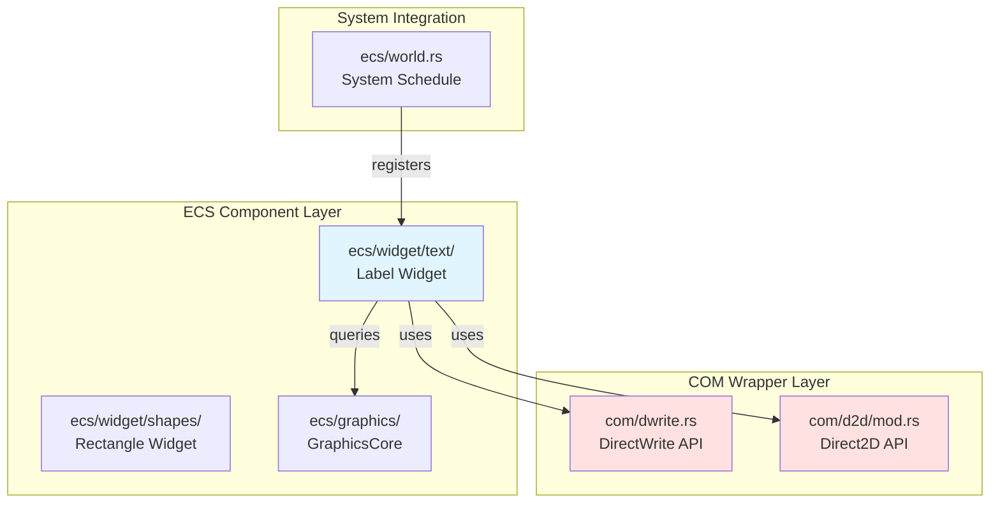
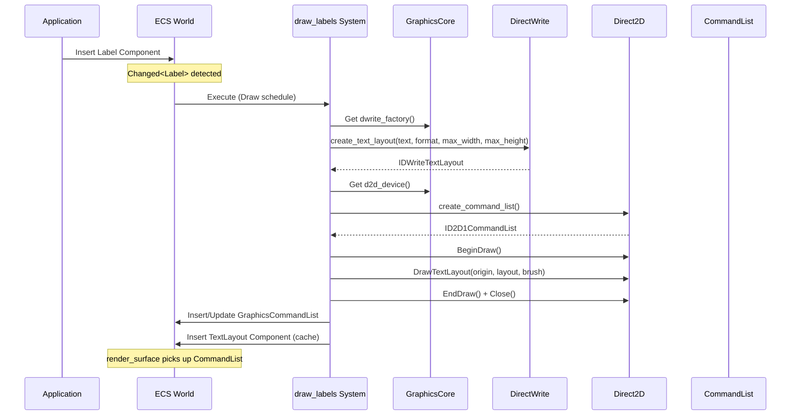

# Design: phase4-mini-horizontal-text

**Feature ID**: `phase4-mini-horizontal-text`  
**Design Date**: 2025-11-17  
**Status**: Design Generated

---

## Overview

本設計は、DirectWriteを使用した横書きテキストレンダリング機能をwintfフレームワークに統合する。既存のDirectComposition/Direct2Dベースの描画システムにテキスト描画機能を追加し、Labelウィジットとして実装する。

**Purpose**: 日本語横書きテキストを高品質にレンダリングし、将来の縦書き実装（Phase 7）の基盤を提供する。

**Users**: wintfフレームワークを使用するアプリケーション開発者が、宣言的なECSスタイルでテキストを表示できるようにする。

**Impact**: 既存のRectangle描画システムに対し、テキスト描画機能を並列に追加。既存機能への破壊的変更なし。

### Goals
- DirectWriteのIDWriteTextLayout APIを統合し、横書きテキストレンダリングを実現
- Labelウィジットコンポーネントを提供し、宣言的なテキスト表示を可能にする
- 60fps以上のパフォーマンスを維持（Vsync同期環境）
- Phase 7での縦書き対応を前提とした拡張可能な設計

### Non-Goals
- 縦書きテキスト（Phase 7で実装予定）
- テキスト編集機能（表示のみ）
- リッチテキスト（単一フォーマットのみ）
- Button等のインタラクティブウィジット（Phase 7以降）

---

## Architecture

### Existing Architecture Analysis

wintfフレームワークは3層アーキテクチャで構成される：

1. **COM Wrapper Layer** (`com/`)
   - Windows COM APIのRustラッパー
   - 型安全なインターフェース提供
   - DirectComposition, Direct2D, DirectWrite, WIC

2. **ECS Component Layer** (`ecs/`)
   - bevy_ecsベースのコンポーネント定義
   - システム実装（描画、レイアウト、イベント処理）
   - GraphicsCore, WindowGraphics等のリソース管理

3. **Message Handling Layer** (ルート)
   - Windowsメッセージループ
   - スレッド管理
   - ウィンドウプロシージャ

**既存統合ポイント**:
- DirectWriteファクトリー（IDWriteFactory2）は既にGraphicsCoreに統合済み
- Drawスケジュールに`draw_rectangles`システムが実行中
- GraphicsCommandListパターンでCommandListキャッシング実装済み

### Architecture Pattern & Boundary Map

**Selected Pattern**: Hybrid Extension（既存レイヤー拡張 + 新規モジュール追加）



**Architecture Integration**:
- **Pattern**: 既存のRectangle実装パターンを踏襲
- **Domain Boundaries**:
  - `com/`: Windows COM API境界（unsafeコード隔離）
  - `ecs/widget/text/`: テキストウィジット責務（shapes/と並列）
  - `ecs/graphics/`: グラフィックスリソース管理
- **Existing Patterns Preserved**:
  - Changed検知による効率的再描画
  - GraphicsCommandListキャッシング
  - on_remove hookによるクリーンアップ
  - Draw→RenderSurface→CommitCompositionのスケジュール順序
- **New Components Rationale**:
  - `text/`モジュール: テキスト描画の独立した関心事、将来の拡張（縦書き、richtext）に対応
  - CreateTextLayout/DrawTextLayout API: DirectWriteテキストレンダリングに必須
- **Steering Compliance**:
  - レイヤードアーキテクチャ維持（COM → ECS → Message Handling）
  - 型安全性（unsafeはCOMラッパーに隔離）
  - ECS基盤（bevy_ecs 0.17.2）

### Technology Stack

| Layer | Choice / Version | Role in Feature | Notes |
|-------|------------------|-----------------|-------|
| Text Rendering | DirectWrite (IDWriteFactory2) | テキストレイアウト生成、フォント管理 | 既存統合、IDWriteFactory7と互換性あり |
| 2D Graphics | Direct2D (ID2D1DeviceContext) | テキスト描画実行 | DrawTextLayout API追加 |
| ECS Framework | bevy_ecs 0.17.2 | コンポーネント・システム管理 | 既存依存 |
| Windows API | windows-rs 0.62.1 | COM API バインディング | 既存依存 |
| Language | Rust 2021 Edition | 型安全実装 | 既存環境 |

**Technology Decisions**:
- **IDWriteFactory2継続使用**: 横書きテキストに必要な機能は全て利用可能、既存統合を活用
- **CommandListパターン**: 既存のRectangle実装と同様、GPUバッチング最適化

---

## System Flows

### Text Rendering Flow



**Flow-level Decisions**:
- Changed検知により、Labelが変更されていない場合はTextLayout再生成をスキップ
- TextLayoutコンポーネントをキャッシュし、次フレームで再利用
- CommandListをGraphicsCommandListコンポーネントとして保存し、render_surfaceが描画

---

## Requirements Traceability

| Requirement | Summary | Components | Interfaces | Flows |
|-------------|---------|------------|------------|-------|
| 1 | DirectWrite Factory統合 | GraphicsCore | dwrite_factory() | - |
| 2 | TextFormat作成 | DWriteFactoryExt | create_text_format() | - |
| 3 | TextLayout生成 | DWriteFactoryExt, TextLayout | create_text_layout() | Text Rendering |
| 4 | Labelコンポーネント | Label | - | Text Rendering |
| 5 | TextLayoutキャッシュ | TextLayout | - | Text Rendering |
| 6 | draw_labelsシステム | draw_labels | Query, Commands | Text Rendering |
| 7 | DrawTextLayout呼び出し | D2D1DeviceContextExt | draw_text_layout() | Text Rendering |
| 8 | 複数Label表示 | draw_labels | ECS Query | Text Rendering |
| 9 | パフォーマンス | Changed, CommandList | - | Text Rendering |
| 10 | エラーハンドリング | 全コンポーネント | Result<T> | - |
| 11 | サンプル | label_demo.rs | - | - |

---

## Components and Interfaces

### Summary Table

| Component | Domain/Layer | Intent | Req Coverage | Key Dependencies (P0/P1) | Contracts |
|-----------|--------------|--------|--------------|--------------------------|-----------|
| DWriteFactoryExt::create_text_layout | COM Wrapper | TextLayout生成 | 3 | IDWriteFactory2 (P0) | Service |
| D2D1DeviceContextExt::draw_text_layout | COM Wrapper | テキスト描画 | 7 | ID2D1DeviceContext (P0) | Service |
| Label | ECS Component | テキスト表示データ | 4 | - | State |
| TextLayout | ECS Component | TextLayoutキャッシュ | 5 | IDWriteTextLayout (P0) | State |
| draw_labels | ECS System | テキスト描画システム | 6, 8, 9 | GraphicsCore (P0), WindowGraphics (P0) | Service |

---

### COM Wrapper Layer

#### DWriteFactoryExt::create_text_layout

| Field | Detail |
|-------|--------|
| Intent | UTF-8文字列からIDWriteTextLayoutを生成 |
| Requirements | 3 |
| Owner / Reviewers | - |

**Responsibilities & Constraints**
- UTF-8文字列（Rust String）をPCWSTR（UTF-16）に変換
- IDWriteFactory2::CreateTextLayoutを呼び出し
- 指定されたmax_width/max_heightでレイアウト領域を制限
- COMオブジェクトのエラーハンドリング

**Dependencies**
- Inbound: draw_labelsシステム — TextLayout生成 (P0)
- Outbound: IDWriteFactory2 — COM API (P0)
- External: windows-rs — PCWSTR変換 (P0)

**Contracts**: Service [x]

##### Service Interface
```rust
pub trait DWriteFactoryExt {
    fn create_text_layout<P0>(
        &self,
        text: P0,
        text_format: &IDWriteTextFormat,
        max_width: f32,
        max_height: f32,
    ) -> Result<IDWriteTextLayout>
    where
        P0: Param<PCWSTR>;
}

impl DWriteFactoryExt for IDWriteFactory2 {
    fn create_text_layout<P0>(
        &self,
        text: P0,
        text_format: &IDWriteTextFormat,
        max_width: f32,
        max_height: f32,
    ) -> Result<IDWriteTextLayout>
    where
        P0: Param<PCWSTR>,
    {
        unsafe {
            self.CreateTextLayout(
                text,
                None, // analysisoptions: None (default)
                text_format,
                max_width,
                max_height,
            )
        }
    }
}
```

- **Preconditions**:
  - `self`は有効なIDWriteFactory2インスタンス
  - `text_format`は有効なIDWriteTextFormat
  - `max_width`, `max_height` > 0.0
- **Postconditions**:
  - 成功時: 有効なIDWriteTextLayoutを返す
  - 失敗時: windows::core::Errorを返す
- **Invariants**:
  - unsafeブロックはCOMラッパー層に隔離
  - PCWSTR変換はwindows-rsのParamトレイトで自動処理

**Implementation Notes**
- 既存のcreate_text_formatと同パターン
- UTF-8 → UTF-16変換はwindows-rsが自動処理
- analysisoptions: Noneでデフォルト動作（横書き）

---

#### D2D1DeviceContextExt::draw_text_layout

| Field | Detail |
|-------|--------|
| Intent | IDWriteTextLayoutを指定座標に描画 |
| Requirements | 7 |
| Owner / Reviewers | - |

**Responsibilities & Constraints**
- ID2D1DeviceContext::DrawTextLayoutを呼び出し
- 指定された座標（origin）にテキストを描画
- ブラシ（ID2D1Brush）でテキスト色を指定
- 描画オプション（D2D1_DRAW_TEXT_OPTIONS）を制御

**Dependencies**
- Inbound: draw_labelsシステム — テキスト描画 (P0)
- Outbound: ID2D1DeviceContext — COM API (P0)
- External: IDWriteTextLayout — テキストレイアウト (P0)

**Contracts**: Service [x]

##### Service Interface
```rust
pub trait D2D1DeviceContextExt {
    fn draw_text_layout(
        &self,
        origin: D2D_POINT_2F,
        text_layout: &IDWriteTextLayout,
        default_fill_brush: &ID2D1Brush,
        options: D2D1_DRAW_TEXT_OPTIONS,
    );
}

impl D2D1DeviceContextExt for ID2D1DeviceContext {
    fn draw_text_layout(
        &self,
        origin: D2D_POINT_2F,
        text_layout: &IDWriteTextLayout,
        default_fill_brush: &ID2D1Brush,
        options: D2D1_DRAW_TEXT_OPTIONS,
    ) {
        unsafe {
            self.DrawTextLayout(
                origin,
                text_layout,
                default_fill_brush,
                options,
            )
        }
    }
}
```

- **Preconditions**:
  - `self`は有効なID2D1DeviceContext（BeginDraw状態）
  - `text_layout`は有効なIDWriteTextLayout
  - `default_fill_brush`は有効なID2D1Brush
- **Postconditions**:
  - テキストがCommandListに描画命令として記録される
- **Invariants**:
  - BeginDraw/EndDrawペア内で呼び出し必須
  - unsafeブロックはCOMラッパー層に隔離

**Implementation Notes**
- 既存のdraw_text（DrawText）と並列な実装
- DrawTextLayoutはDrawTextよりも高度なレイアウト制御が可能
- optionsは通常D2D1_DRAW_TEXT_OPTIONS_NONE（デフォルト）

---

### ECS Component Layer

#### Label Component

| Field | Detail |
|-------|--------|
| Intent | テキスト表示のためのデータコンポーネント |
| Requirements | 4 |
| Owner / Reviewers | - |

**Responsibilities & Constraints**
- テキスト内容、フォント、サイズ、色、座標を保持
- bevy_ecsのComponentトレイトを実装
- on_remove hookでGraphicsCommandListをクリア
- Cloneトレイトを実装（ECSシステムでの操作容易性）

**Dependencies**
- Inbound: アプリケーション — エンティティに追加 (P0)
- Outbound: draw_labelsシステム — クエリ対象 (P0)
- External: D2D1_COLOR_F — 色表現 (P0)

**Contracts**: State [x]

##### State Management
```rust
/// Labelウィジット
#[derive(Component, Debug, Clone)]
#[component(on_remove = on_label_remove)]
pub struct Label {
    /// 表示するテキスト（UTF-8）
    pub text: String,
    /// フォントファミリー名（例: "メイリオ"）
    pub font_family: String,
    /// フォントサイズ（pt単位）
    pub font_size: f32,
    /// テキスト色
    pub color: D2D1_COLOR_F,
    /// X座標（ピクセル単位）
    pub x: f32,
    /// Y座標（ピクセル単位）
    pub y: f32,
}

impl Default for Label {
    fn default() -> Self {
        Self {
            text: String::new(),
            font_family: "メイリオ".to_string(),
            font_size: 16.0,
            color: colors::BLACK,
            x: 0.0,
            y: 0.0,
        }
    }
}

fn on_label_remove(
    mut world: bevy_ecs::world::DeferredWorld,
    hook: bevy_ecs::lifecycle::HookContext,
) {
    let entity = hook.entity;
    // GraphicsCommandListを取得して中身をクリア（Changed検出のため）
    if let Some(mut cmd_list) = world.get_mut::<GraphicsCommandList>(entity) {
        cmd_list.set_if_neq(GraphicsCommandList::empty());
    }
}
```

- **State model**: 不変データ（各フィールドはpublic、直接変更可能）
- **Persistence & consistency**: bevy_ecsがライフサイクル管理
- **Concurrency strategy**: bevy_ecsのクエリシステムがスレッドセーフ性を保証

**Implementation Notes**
- フィールド設計は将来の縦書き対応を考慮（Phase 7で`writing_mode`追加予定）
- API命名は方向に依存しない汎用的な名称（`Label`であり`HorizontalLabel`ではない）
- デフォルト値は横書きテキスト表示を想定

---

#### TextLayout Component

| Field | Detail |
|-------|--------|
| Intent | IDWriteTextLayoutのキャッシュコンポーネント |
| Requirements | 5 |
| Owner / Reviewers | - |

**Responsibilities & Constraints**
- IDWriteTextLayoutをラップし、エンティティライフサイクルに連動
- COMオブジェクトの適切なライフタイム管理
- on_remove hookでCOMオブジェクト解放
- SparseSet storageで効率的なランダムアクセス

**Dependencies**
- Inbound: draw_labelsシステム — TextLayoutキャッシュ (P0)
- Outbound: IDWriteTextLayout — COM API (P0)
- External: - |

**Contracts**: State [x]

##### State Management
```rust
/// TextLayoutキャッシュコンポーネント
#[derive(Component)]
#[component(storage = "SparseSet", on_remove = on_text_layout_remove)]
pub struct TextLayout {
    inner: Option<IDWriteTextLayout>,
}

impl TextLayout {
    pub fn new(layout: IDWriteTextLayout) -> Self {
        Self { inner: Some(layout) }
    }

    pub fn get(&self) -> Option<&IDWriteTextLayout> {
        self.inner.as_ref()
    }

    pub fn empty() -> Self {
        Self { inner: None }
    }
}

fn on_text_layout_remove(
    _world: bevy_ecs::world::DeferredWorld,
    _hook: bevy_ecs::lifecycle::HookContext,
) {
    // IDWriteTextLayoutはDrop時に自動的に解放される（windows-rsのスマートポインタ）
}
```

- **State model**: Option<IDWriteTextLayout>でCOMオブジェクト保持
- **Persistence & consistency**: Labelコンポーネントと同エンティティに存在
- **Concurrency strategy**: SparseSet storageでスレッドセーフなアクセス

**Implementation Notes**
- windows-rsのスマートポインタ（IDWriteTextLayout）が自動的に参照カウント管理
- on_remove hookは明示的な解放不要（Dropで自動処理）
- Changed<Label>検知時にのみ再生成

---

#### draw_labels System

| Field | Detail |
|-------|--------|
| Intent | Labelコンポーネントを持つエンティティを自動描画 |
| Requirements | 6, 8, 9 |
| Owner / Reviewers | - |

**Responsibilities & Constraints**
- Changed<Label>またはWithout<GraphicsCommandList>エンティティをクエリ
- GraphicsCoreからDirectWriteファクトリーとDirect2Dデバイス取得
- TextFormatとTextLayoutを生成
- CommandListに描画命令を記録
- GraphicsCommandListとTextLayoutコンポーネントを挿入/更新

**Dependencies**
- Inbound: Drawスケジュール — システム実行 (P0)
- Outbound: GraphicsCore — リソース取得 (P0)
- Outbound: WindowGraphics — 有効性確認 (P0)
- External: DWriteFactoryExt, D2D1DeviceContextExt — API呼び出し (P0)

**Contracts**: Service [x]

##### Service Interface
```rust
pub fn draw_labels(
    mut commands: Commands,
    query: Query<(Entity, &Label, &WindowGraphics), Or<(
        Changed<Label>,
        Without<GraphicsCommandList>,
    )>>,
    graphics_core: Option<Res<GraphicsCore>>,
) {
    let Some(graphics_core) = graphics_core else {
        eprintln!("[draw_labels] GraphicsCore not available, skipping");
        return;
    };

    for (entity, label, window_graphics) in query.iter() {
        // WindowGraphicsが無効なら後回し
        if !window_graphics.is_valid() {
            continue;
        }

        // DirectWriteファクトリー取得
        let Some(dwrite_factory) = graphics_core.dwrite_factory() else {
            eprintln!("[draw_labels] DirectWrite factory not available");
            continue;
        };

        // TextFormat作成
        let text_format = match dwrite_factory.create_text_format(
            &label.font_family,
            None, // fontcollection
            DWRITE_FONT_WEIGHT_NORMAL,
            DWRITE_FONT_STYLE_NORMAL,
            DWRITE_FONT_STRETCH_NORMAL,
            label.font_size,
            w!("ja-JP"),
        ) {
            Ok(format) => format,
            Err(e) => {
                eprintln!("[draw_labels] CreateTextFormat failed: {:?}", e);
                continue;
            }
        };

        // TextLayout作成
        let text_layout = match dwrite_factory.create_text_layout(
            &label.text,
            &text_format,
            f32::MAX, // max_width（制限なし）
            f32::MAX, // max_height（制限なし）
        ) {
            Ok(layout) => layout,
            Err(e) => {
                eprintln!("[draw_labels] CreateTextLayout failed: {:?}", e);
                continue;
            }
        };

        // DeviceContextとCommandList作成（Rectangleパターン踏襲）
        let Some(d2d_device) = graphics_core.d2d_device() else {
            eprintln!("[draw_labels] D2D device not available");
            continue;
        };

        let dc = match d2d_device.create_device_context(
            D2D1_DEVICE_CONTEXT_OPTIONS_NONE,
        ) {
            Ok(dc) => dc,
            Err(e) => {
                eprintln!("[draw_labels] CreateDeviceContext failed: {:?}", e);
                continue;
            }
        };

        let command_list = match unsafe { dc.CreateCommandList() } {
            Ok(cl) => cl,
            Err(e) => {
                eprintln!("[draw_labels] CreateCommandList failed: {:?}", e);
                continue;
            }
        };

        // DeviceContextのターゲットをCommandListに設定
        unsafe {
            dc.SetTarget(&command_list);
        }

        // 描画命令を記録
        unsafe {
            if let Err(e) = dc.BeginDraw() {
                eprintln!("[draw_labels] BeginDraw failed: {:?}", e);
                continue;
            }

            // 透明色でクリア
            dc.clear(Some(&colors::TRANSPARENT));

            // ソリッドカラーブラシ作成
            let brush = match dc.create_solid_color_brush(&label.color, None) {
                Ok(brush) => brush,
                Err(e) => {
                    eprintln!("[draw_labels] CreateSolidColorBrush failed: {:?}", e);
                    let _ = dc.EndDraw(None, None);
                    continue;
                }
            };

            let origin = D2D_POINT_2F {
                x: label.x,
                y: label.y,
            };

            dc.draw_text_layout(
                origin,
                &text_layout,
                &brush,
                D2D1_DRAW_TEXT_OPTIONS_NONE,
            );

            if let Err(e) = dc.EndDraw(None, None) {
                eprintln!("[draw_labels] EndDraw failed: {:?}", e);
                continue;
            }
        }

        // CommandListを閉じる
        if let Err(e) = command_list.close() {
            eprintln!("[draw_labels] CommandList close failed: {:?}", e);
            continue;
        }

        // GraphicsCommandListとTextLayoutをエンティティに挿入
        commands.entity(entity).insert((
            GraphicsCommandList::new(command_list),
            TextLayout::new(text_layout),
        ));
    }
}
```

- **Preconditions**:
  - GraphicsCoreがResourceとして登録済み
  - Labelエンティティは有効なWindowGraphicsコンポーネントを保持
- **Postconditions**:
  - 成功時: GraphicsCommandListとTextLayoutコンポーネントが挿入/更新される
  - 失敗時: eprintln!でログ出力、該当エンティティをスキップ
- **Invariants**:
  - Changed<Label>検知により、変更されていないLabelはスキップ
  - エラー時も処理継続（1つのエラーが全体に影響しない）

**Implementation Notes**
- Rectangleのdraw_rectanglesと同パターン
- TextFormat/TextLayoutは毎回生成（将来的なキャッシング最適化の余地あり）
- CommandListバッチングでGPU効率最大化

---

## Data Models

### Domain Model

本機能は主に表示層の拡張であり、複雑なドメインモデルは存在しない。

**Key Entities**:
- **Label**: テキスト表示データ（text, font, size, color, position）
- **TextLayout**: レンダリング可能なテキストレイアウト（COMオブジェクトラッパー）

**Relationships**:
- Label 1:1 TextLayout（同一エンティティに存在）
- Label N:1 Window（複数LabelがWindowGraphicsに関連）

**Invariants**:
- Labelエンティティは必ずWindowGraphicsコンポーネントを持つ
- TextLayoutはLabelと同期して更新（Changed検知）

---

## Error Handling Strategy

### COM API Errors

**Strategy**: Result<T>による明示的なエラー伝播

```rust
// COM API呼び出し
let text_layout = dwrite_factory.create_text_layout(
    &label.text,
    &text_format,
    max_width,
    max_height,
)?; // windows::core::Result<IDWriteTextLayout>
```

**Handling**:
- `?`演算子でエラー伝播
- システムレベルでキャッチし、`eprintln!`でログ出力
- 該当エンティティをスキップ、処理継続

### System-level Errors

**Strategy**: Graceful degradation（部分的な機能継続）

```rust
for (entity, label, window_graphics) in query.iter() {
    // エラーが発生しても次のエンティティを処理
    if let Err(e) = process_label(entity, label, window_graphics) {
        eprintln!("[draw_labels] Error processing entity {:?}: {:?}", entity, e);
        continue;
    }
}
```

**User-facing Errors**:
- DirectWriteファクトリー作成失敗: GraphicsCore初期化時にログ、システム停止
- TextFormat/TextLayout作成失敗: 該当Labelをスキップ、他のLabelは表示継続
- DrawTextLayout失敗: 該当フレームのみ影響、次フレームで再試行

---

## Performance Considerations

### Optimization Strategies

1. **Changed Detection**
   - Changed<Label>検知により、変更されていないLabelはスキップ
   - TextLayoutコンポーネントをキャッシュし、再利用

2. **CommandList Batching**
   - GraphicsCommandListでGPU命令をバッチング
   - render_surfaceがまとめて描画

3. **Vsync Synchronization**
   - 60fps上限でフレームレート安定化
   - 不要な再描画を回避

**Performance Targets**:
- 10 Labelで60fps以上維持（Vsync同期環境）
- TextLayout生成コストをキャッシングで最小化

**Monitoring**:
- フレームレート計測は既存のGraphicsCore統計で実施
- TextLayout生成頻度をログで確認（デバッグ時）

---

## Testing Strategy

### Unit Tests

1. **COM API Wrappers**
   - `create_text_layout`: 有効なTextLayoutを生成
   - `draw_text_layout`: エラーなく呼び出し可能

2. **Component Lifecycle**
   - `on_label_remove`: GraphicsCommandListを正しくクリア
   - `on_text_layout_remove`: COMオブジェクト解放

### Integration Tests

1. **draw_labels System**
   - Changed<Label>検知が正しく動作
   - GraphicsCommandListが正しく生成される
   - エラー時にスキップして処理継続

### Sample Application

**`examples/label_demo.rs`または`simple_window.rs`拡張**:
- "Hello, World!" と "こんにちは" を表示
- 異なるフォントサイズと色の複数Label
- タイマースレッドで動的にテキスト変更（simple_window.rsパターン）

---

## Migration & Deployment

### Deployment Steps

1. **COM API拡張**
   - `com/dwrite.rs`: `create_text_layout`追加
   - `com/d2d/mod.rs`: `draw_text_layout`追加

2. **コンポーネント定義**
   - `ecs/widget/text/label.rs`: Label, TextLayoutコンポーネント
   - `ecs/widget/text/draw_labels.rs`: draw_labelsシステム
   - `ecs/widget/text/mod.rs`: モジュールエクスポート

3. **システム統合**
   - `ecs/widget/mod.rs`: `pub mod text;`追加
   - `ecs/world.rs`: Drawスケジュールに`draw_labels`追加

4. **サンプル作成**
   - `examples/label_demo.rs`: 新規作成、または
   - `examples/simple_window.rs`: Label使用例を追加

### Rollback Plan

**Impact**: 既存機能への破壊的変更なし

**Rollback**:
- 新規ファイル削除: `ecs/widget/text/`
- 統合ポイント削除: `ecs/world.rs`のdraw_labels登録削除
- COM API拡張は既存機能に影響しないため、削除不要（残しても無害）

---

## Security Considerations

**COM API Safety**:
- unsafeブロックはCOMラッパー層に隔離
- windows-rsのスマートポインタでCOMオブジェクトライフタイム管理

**Input Validation**:
- テキスト内容: UTF-8文字列をPCWSTRに変換（windows-rs処理）
- フォントファミリー: 存在しない場合DirectWriteがシステムデフォルトにフォールバック
- フォントサイズ: f32型、範囲制限はアプリケーション側で実施

**Resource Limits**:
- TextLayoutキャッシング: エンティティ数に比例、bevy_ecsが管理
- CommandList: 1エンティティ1CommandList、メモリ使用量は制限的

---

## Appendix

### Related Documents

- [requirements.md](./requirements.md) — 11要件、78受入基準
- [gap-analysis.md](./gap-analysis.md) — 既存コードベース分析と実装アプローチ評価
- [research.md](./research.md) — 発見ログと設計判断の詳細

### Glossary

- **DirectWrite**: WindowsのテキストレンダリングAPI
- **TextLayout**: レンダリング可能なテキストレイアウトオブジェクト
- **CommandList**: GPU描画命令のバッチングコンテナ
- **Changed Detection**: bevy_ecsの変更検知機能
- **Vsync**: 垂直同期、フレームレートを60fpsに制限

---

_Design generated on 2025-11-17_
