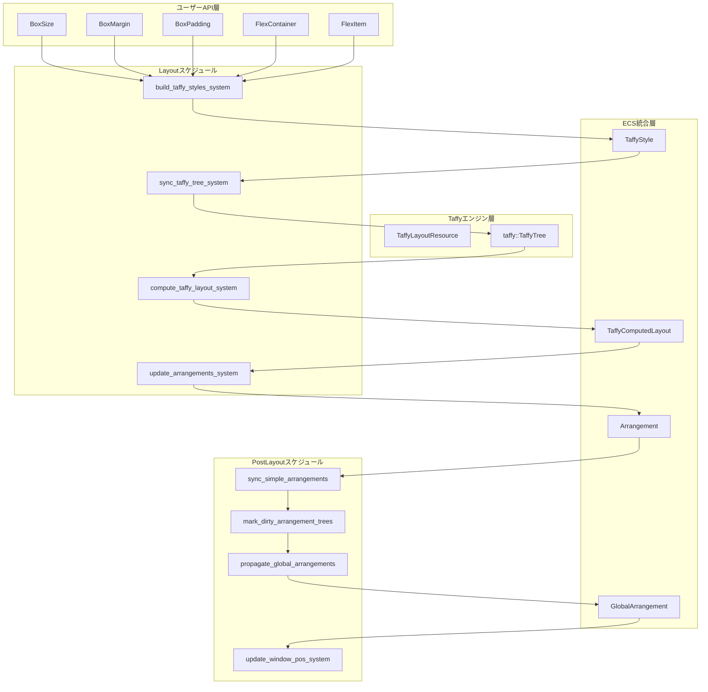
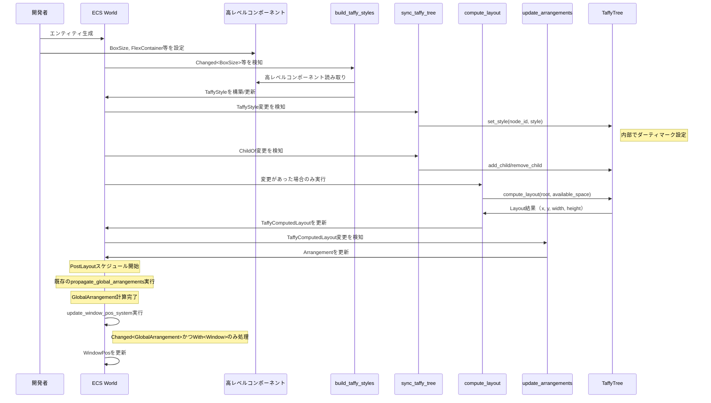
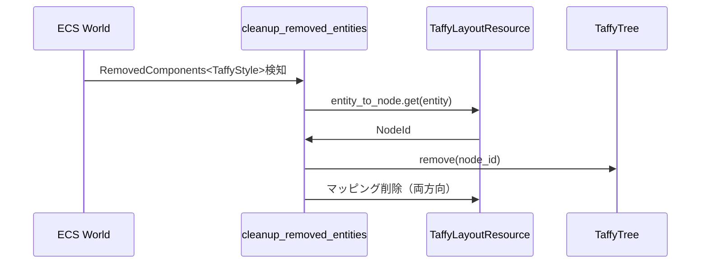
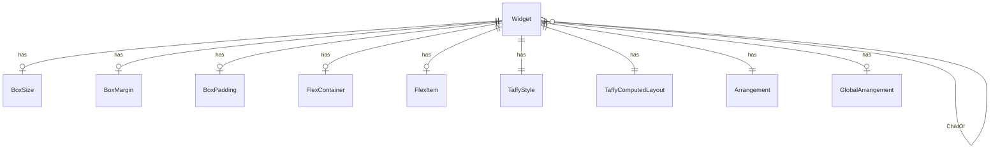

# 設計ドキュメント: Taffyレイアウト統合

## 概要

この機能は、taffyレイアウトエンジンをwintfのECSアーキテクチャに統合し、宣言的なレイアウト記述とFlexboxベースの自動レイアウト計算を実現する。既存の手動配置システム（`Arrangement`）をtaffyの計算結果で自動更新し、UIフレームワークとして必要な変更検知ベースの増分計算を実装する。

**目的**: 日本語縦書きデスクトップアプリケーションの開発者が、手動でピクセル座標を計算せずに、高レベルなレイアウトプロパティ（サイズ、余白、Flexbox設定）でUIを構築できるようにする。

**利用者**: wintfを使用してGUIアプリケーションを構築する開発者。特に「伺か」のようなデスクトップマスコットアプリケーションの開発者。

**影響**: 既存の`BoxStyle`と`BoxComputedLayout`をtaffyとの統合を明確化した名称に変更し、高レベルレイアウトコンポーネント（`BoxSize`、`BoxMargin`、`BoxPadding`、`FlexContainer`、`FlexItem`）を導入する。既存のArrangement伝播システムはそのまま維持し、taffyの計算結果を`Arrangement`に反映する形で統合する。

### 目標

- taffyライブラリを内部実装として統合し、ユーザーには高レベルなレイアウトAPIを提供する
- 変更検知ベースの増分計算により、静止時のCPU負荷をゼロにする
- Flexboxの基本機能（サイズ、余白、コンテナー・アイテム設定）を直感的なコンポーネントで提供する
- 既存のArrangement階層伝播システムと互換性を保つ
- 既存のサンプルアプリケーション（`simple_window.rs`）を高レベルコンポーネントに移行し、動作を検証する
- **レイアウト結果のWindowPosへの反映**: Windowエンティティの計算されたレイアウト結果を`WindowPos`コンポーネントに設定（クライアント領域の正確な計算はWindowPos側の責務）

### 非目標

- taffyの全機能（Gap、Position、MinSize、MaxSize、Grid等）の完全サポートは今回のスコープ外（将来拡張で対応）
- カスタムレイアウトアルゴリズムの実装（taffyの計算結果をそのまま使用）
- レイアウトアニメーション（将来のアニメーション統合で対応）
- レイアウトデバッグUI（オプション機能として今回は実装しない）
- 仮想デスクトップ全体をルートとする最終的なレイアウト階層（今回はWindow単位のレイアウトに限定）
- WindowPosのクライアント領域の正確な計算（WindowPos側の責務であり、今回はレイアウト結果の値設定まで）

## アーキテクチャ

### 既存アーキテクチャ分析

wintfはすでに以下のシステムを持つ：

- **ECS階層構造**: `ChildOf`リレーションと`Children`コンポーネントによる親子関係管理
- **Arrangement階層伝播**: `Arrangement`（ローカル座標）と`GlobalArrangement`（ワールド座標）の二層構造
- **透過的ラッパーパターン**: `#[repr(transparent)]`属性を使用したCOM型のラッパー（既存の`BoxStyle`、`BoxComputedLayout`）
- **汎用階層伝播システム**: `ecs/common/tree_system.rs`に`sync_simple_transforms<L,G,M>()`と`propagate_parent_transforms<L,G,M>()`が存在

統合においては以下の既存パターンを尊重する：

- `Arrangement` + `GlobalArrangement`の二層構造を維持
- `propagate_global_arrangements`システムをそのまま利用
- 透過的ラッパーパターンを`TaffyStyle`と`TaffyComputedLayout`に適用
- `ecs/layout/systems.rs`に既存のシステムセットを拡張

### レイアウト階層の最終設計ビジョン

wintfの最終的なレイアウト階層は以下の構造を目指す：

```
仮想デスクトップ（ルート）
  ↓
物理ディスプレイ（DPI設定）
  ↓
Window（位置・サイズもレイアウト出力）
  ↓
ウィジェット（子孫要素）
```

**重要な設計原則**:
- **WindowPosは出力**: Windowの位置・サイズはレイアウトシステムの計算結果として`WindowPos`に反映される
- **仮想デスクトップがルート**: 最終的には仮想デスクトップ全体を`available_space`として、複数Windowの配置を含めてレイアウト計算
- **DPI対応**: 物理ディスプレイレベルでDPI設定を反映し、論理ピクセルと物理ピクセルを変換

**今回のスコープでの暫定措置**:
- 今回は**Window単位のレイアウト**に限定し、各Windowを独立したルートとして扱う
- Windowサイズを`available_space`として使用（暫定的な入力）
- 最終設計への移行を容易にするため、アーキテクチャは拡張可能に設計

### アーキテクチャパターンと境界マップ



**アーキテクチャ統合**:

- **選択パターン**: ファサードパターン（高レベルコンポーネントでtaffy詳細を隠蔽）
- **ドメイン境界**: 
  - **ユーザーAPI層**: 高レベルレイアウトコンポーネント（taffy非依存）
  - **ECS統合層**: taffyとECSの橋渡し（内部実装）
  - **Taffyエンジン層**: レイアウト計算（ブラックボックス）
- **既存パターンの維持**: 
  - Arrangement二層構造（ローカル→グローバル）
  - 透過的ラッパー（`#[repr(transparent)]`）
  - 汎用階層伝播システムの活用
- **新規コンポーネントの根拠**:
  - 高レベルコンポーネント（BoxSize等）: ユーザビリティと学習コスト削減
  - TaffyLayoutResource: EntityとNodeIdのマッピング管理とtaffyインスタンス保持
  - 専用システム群: 変更検知、スタイル構築、ツリー同期、計算実行、結果反映の分離
- **ステアリング準拠**: 
  - レイヤードアーキテクチャ（COM → ECS → System）の依存方向遵守
  - 型安全性の徹底（taffyの型をre-exportで公開）
  - モジュール独立性（`ecs/layout/`に集約）
- **スケジュール配置戦略**:
  - **Layoutスケジュール**: taffyレイアウト計算とArrangement更新（レイアウト結果の生成）
  - **PostLayoutスケジュール**: Arrangement階層伝播（GlobalArrangementの計算）
  - **Drawスケジュール**: 描画コマンド生成（Arrangementを参照するのみ）
  - 既存のArrangement伝播システムもDrawからPostLayoutに移動（taffy統合とは独立した改善）
- **WindowPos更新システム**: PostLayoutスケジュールの最後に`update_window_pos_system`を配置し、Windowエンティティの`GlobalArrangement`が変更された場合のみ`WindowPos`を更新

### 技術スタック

| レイヤー | 選択 / バージョン | 機能における役割 | 備考 |
|---------|-------------------|-----------------|------|
| レイアウトエンジン | taffy 0.9.1 | Flexboxレイアウト計算、キャッシュ、増分計算 | TaffyTree APIを使用 |
| ECS | bevy_ecs 0.17.2 | コンポーネント管理、システム実行、変更検知 | 既存基盤 |
| 幾何計算 | euclid 0.22.11 | 座標・サイズ型（Point2D、Size2D） | 既存基盤 |
| Windows API | windows 0.62.1 | ウィンドウサイズ取得（available_space計算用） | 既存基盤 |

**技術選択の根拠**（詳細は`research.md`参照）:

- **taffy 0.9.1**: 内蔵キャッシュと増分計算により、wintf側の実装を簡素化。TaffyTree APIが高レベルで使いやすい。
- **bevy_ecs**: 既存基盤。`Changed<T>`クエリによる変更検知が増分計算の要。
- **透過的ラッパー**: `#[repr(transparent)]`により、メモリレイアウトを維持しつつ型安全性を確保。

## システムフロー

### レイアウト計算フロー



**フロー判断**:

- **変更検知ゲート**: `Changed<T>`クエリで変更がない場合、build/sync/computeシステムをスキップ
- **初回計算**: 初期化フラグで全ツリーを計算（`compute_layout`は必ず実行）
- **増分計算**: taffy内部のダーティトラッキングとキャッシュに依存し、wintf側は変更通知のみ担当
- **スケジュール境界**: LayoutスケジュールでArrangement更新まで完了し、PostLayoutスケジュールでGlobalArrangement伝播を実行

### エンティティ削除フロー



## 要件トレーサビリティ

| 要件 | 概要 | コンポーネント | インターフェース | フロー |
|------|------|---------------|----------------|-------|
| 1 | コンポーネント名称変更 | TaffyStyle, TaffyComputedLayout | - | - |
| 2 | TaffyStyleコンポーネント構造 | TaffyStyle | 透過的ラッパー | - |
| 3 | 高レベルレイアウトコンポーネント | BoxSize, BoxMargin, BoxPadding, FlexContainer, FlexItem | 公開API、型re-export | レイアウト計算 |
| 4 | Taffyレイアウト計算システム | TaffyLayoutResource, sync/compute systems | TaffyTree API | レイアウト計算 |
| 5 | Arrangement更新システム | update_arrangements_system | Arrangement更新 | レイアウト計算 |
| 6 | 増分レイアウト計算 | build/sync/compute systems | Changed<T>クエリ | レイアウト計算 |
| 7 | Taffyレイアウトインフラストラクチャ | TaffyLayoutResource, Layoutスケジュール配置, update_window_pos_system | EntityとNodeIdマッピング、WindowPos更新 | エンティティ削除 |
| 8 | ビルドおよび動作検証 | simple_window.rs移行 | - | - |
| 9 | ユニットテストによる統合品質保証 | tests/taffy_layout_integration_test.rs | - | - |

## コンポーネントとインターフェース

### コンポーネント概要

| コンポーネント | ドメイン/レイヤー | 意図 | 要件カバレッジ | 主要依存関係 (P0/P1) | 契約 |
|--------------|------------------|------|---------------|---------------------|------|
| TaffyStyle | ECS統合層 | taffyのStyleをラップ | 1, 2 | taffy::Style (P0) | State |
| TaffyComputedLayout | ECS統合層 | taffyのLayoutをラップ | 1, 4 | taffy::Layout (P0) | State |
| BoxSize | ユーザーAPI層 | サイズ指定 | 3 | Dimension (P0) | State |
| BoxMargin | ユーザーAPI層 | 外側余白指定 | 3 | LengthPercentageAuto (P0) | State |
| BoxPadding | ユーザーAPI層 | 内側余白指定 | 3 | LengthPercentage (P0) | State |
| FlexContainer | ユーザーAPI層 | Flexboxコンテナー設定 | 3 | FlexDirection等 (P0) | State |
| FlexItem | ユーザーAPI層 | Flexboxアイテム設定 | 3 | Dimension (P0) | State |
| TaffyLayoutResource | Taffyエンジン層 | taffyインスタンスとマッピング管理 | 7 | TaffyTree (P0) | Service |

### ECS統合層

#### TaffyStyle

| フィールド | 詳細 |
|----------|------|
| 意図 | taffyの`Style`構造体をECSコンポーネントとしてラップ |
| 要件 | 1, 2 |

**責務と制約**
- taffyのStyleをメモリレイアウトを保持したままラップする
- `#[repr(transparent)]`により、内部の`Style`と同一のメモリレイアウトを保証
- ユーザーAPIには直接公開せず、高レベルコンポーネントから構築される

**依存関係**
- Inbound: build_taffy_styles_system — 高レベルコンポーネントから構築 (P0)
- Outbound: taffy::Style — ラップ対象 (P0)

**契約**: State [x]

##### State管理

```rust
#[derive(Component, Clone, Debug, PartialEq)]
#[repr(transparent)]
pub struct TaffyStyle(pub(crate) taffy::Style);

impl Default for TaffyStyle {
    fn default() -> Self {
        Self(taffy::Style::default())
    }
}
```

- 状態モデル: taffyのStyleをそのまま保持
- 永続化: なし（ECSワールド内のみ）
- 一貫性: 高レベルコンポーネントから再構築されるため、常に最新
- 並行性: ECSシステムの実行順序で制御

**実装ノート**
- 統合: `ecs/layout/taffy.rs`に定義
- 検証: デフォルト値が`Style::default()`と一致することをテストで確認
- リスク: `#[repr(transparent)]`の保証はRustコンパイラに依存。将来のRust変更に注意。

#### TaffyComputedLayout

| フィールド | 詳細 |
|----------|------|
| 意図 | taffyの`Layout`構造体（計算結果）をECSコンポーネントとしてラップ |
| 要件 | 1, 4 |

**責務と制約**
- taffyのLayout（x, y, width, height）をメモリレイアウトを保持したままラップする
- `Arrangement`への変換元データとして機能
- 読み取り専用（計算システムのみが更新）

**依存関係**
- Inbound: compute_taffy_layout_system — 計算結果を書き込み (P0)
- Outbound: taffy::Layout — ラップ対象 (P0)

**契約**: State [x]

##### State管理

```rust
#[derive(Component, Clone, Debug, PartialEq, Copy)]
#[repr(transparent)]
pub struct TaffyComputedLayout(pub(crate) taffy::Layout);

impl Default for TaffyComputedLayout {
    fn default() -> Self {
        Self(taffy::Layout::default())
    }
}
```

- 状態モデル: taffyのLayoutをそのまま保持
- 永続化: なし
- 一貫性: compute_taffy_layout_systemが排他的に更新
- 並行性: 読み取り専用クエリで並行アクセス可能

**実装ノート**
- 統合: `ecs/layout/taffy.rs`に定義
- 検証: `Copy`トレイトの実装により軽量コピーを保証
- リスク: taffyのLayout構造が変更された場合、再ラップが必要

### ユーザーAPI層

#### BoxSize

| フィールド | 詳細 |
|----------|------|
| 意図 | ウィジェットのサイズを指定する高レベルコンポーネント |
| 要件 | 3 |

**責務と制約**
- width、heightの指定を受け付け、`TaffyStyle`に変換される
- `Option<Dimension>`により、未指定時はtaffyデフォルト（`Auto`）にフォールバック
- フィールド名はtaffyの命名規則に従う（`width`、`height`）

**依存関係**
- Inbound: ユーザーコード — エンティティに追加 (P0)
- Outbound: taffy::Dimension (re-export) — 型定義 (P0)

**契約**: State [x]

##### State管理

```rust
#[derive(Component, Clone, Debug, PartialEq)]
pub struct BoxSize {
    pub width: Option<Dimension>,
    pub height: Option<Dimension>,
}

impl Default for BoxSize {
    fn default() -> Self {
        Self {
            width: None,
            height: None,
        }
    }
}
```

- 状態モデル: サイズ指定の宣言的記述
- 永続化: なし
- 一貫性: ユーザーが設定、システムが読み取りのみ
- 並行性: ECSの変更検知で排他制御

**実装ノート**
- 統合: `ecs/layout/taffy.rs`に定義。wintfの公開APIとして`lib.rs`で再エクスポート
- 検証: `None`指定時にTaffyStyleが`Auto`に変換されることをテスト
- リスク: なし

#### BoxMargin

| フィールド | 詳細 |
|----------|------|
| 意図 | ウィジェットの外側余白を指定する高レベルコンポーネント |
| 要件 | 3 |

**責務と制約**
- 4方向（left, right, top, bottom）の余白をtaffyの`Rect<LengthPercentageAuto>`で指定
- フィールド名はtaffyの命名規則に従う

**依存関係**
- Inbound: ユーザーコード — エンティティに追加 (P0)
- Outbound: taffy::Rect<LengthPercentageAuto> (re-export) — 型定義 (P0)

**契約**: State [x]

##### State管理

```rust
#[derive(Component, Clone, Debug, PartialEq)]
pub struct BoxMargin(pub Rect<LengthPercentageAuto>);

impl Default for BoxMargin {
    fn default() -> Self {
        Self(Rect::zero())
    }
}
```

- 状態モデル: 余白指定の宣言的記述
- 永続化: なし
- 一貫性: ユーザーが設定、システムが読み取りのみ
- 並行性: ECSの変更検知で排他制御

**実装ノート**
- 統合: `ecs/layout/taffy.rs`に定義。wintfの公開APIとして`lib.rs`で再エクスポート
- 検証: 各方向の値が正しく`TaffyStyle.margin`に反映されることをテスト
- リスク: なし

#### BoxPadding

| フィールド | 詳細 |
|----------|------|
| 意図 | ウィジェットの内側余白を指定する高レベルコンポーネント |
| 要件 | 3 |

**責務と制約**
- 4方向（left, right, top, bottom）の内側余白をtaffyの`Rect<LengthPercentage>`で指定
- `LengthPercentageAuto`ではなく`LengthPercentage`を使用（paddingはAutoをサポートしない）

**依存関係**
- Inbound: ユーザーコード — エンティティに追加 (P0)
- Outbound: taffy::Rect<LengthPercentage> (re-export) — 型定義 (P0)

**契約**: State [x]

##### State管理

```rust
#[derive(Component, Clone, Debug, PartialEq)]
pub struct BoxPadding(pub Rect<LengthPercentage>);

impl Default for BoxPadding {
    fn default() -> Self {
        Self(Rect::zero())
    }
}
```

- 状態モデル: 内側余白指定の宣言的記述
- 永続化: なし
- 一貫性: ユーザーが設定、システムが読み取りのみ
- 並行性: ECSの変更検知で排他制御

**実装ノート**
- 統合: `ecs/layout/taffy.rs`に定義。wintfの公開APIとして`lib.rs`で再エクスポート
- 検証: 各方向の値が正しく`TaffyStyle.padding`に反映されることをテスト
- リスク: なし

#### FlexContainer

| フィールド | 詳細 |
|----------|------|
| 意図 | Flexboxコンテナーとしての設定を指定する高レベルコンポーネント |
| 要件 | 3 |

**責務と制約**
- Flexboxの方向（`direction`）、主軸方向の配置（`justify_content`）、交差軸方向の配置（`align_items`）を指定
- フィールド名はtaffyの命名規則に従う

**依存関係**
- Inbound: ユーザーコード — エンティティに追加 (P0)
- Outbound: taffy::{FlexDirection, JustifyContent, AlignItems} (re-export) — 型定義 (P0)

**契約**: State [x]

##### State管理

```rust
#[derive(Component, Clone, Debug, PartialEq)]
pub struct FlexContainer {
    pub direction: FlexDirection,
    pub justify_content: Option<JustifyContent>,
    pub align_items: Option<AlignItems>,
}

impl Default for FlexContainer {
    fn default() -> Self {
        Self {
            direction: FlexDirection::Row,
            justify_content: None,
            align_items: None,
        }
    }
}
```

- 状態モデル: Flexboxコンテナー設定の宣言的記述
- 永続化: なし
- 一貫性: ユーザーが設定、システムが読み取りのみ
- 並行性: ECSの変更検知で排他制御

**実装ノート**
- 統合: `ecs/layout/taffy.rs`に定義。wintfの公開APIとして`lib.rs`で再エクスポート
- 検証: `None`指定時にTaffyStyleがtaffyデフォルト値を使用することをテスト
- リスク: なし

#### FlexItem

| フィールド | 詳細 |
|----------|------|
| 意図 | Flexboxアイテムとしての設定を指定する高レベルコンポーネント |
| 要件 | 3 |

**責務と制約**
- Flexboxのgrow、shrink、basis、align_self（個別の交差軸配置）を指定
- フィールド名はtaffyの命名規則に従う

**依存関係**
- Inbound: ユーザーコード — エンティティに追加 (P0)
- Outbound: taffy::{Dimension, AlignSelf} (re-export) — 型定義 (P0)

**契約**: State [x]

##### State管理

```rust
#[derive(Component, Clone, Debug, PartialEq)]
pub struct FlexItem {
    pub grow: f32,
    pub shrink: f32,
    pub basis: Dimension,
    pub align_self: Option<AlignSelf>,
}

impl Default for FlexItem {
    fn default() -> Self {
        Self {
            grow: 0.0,
            shrink: 1.0,
            basis: Dimension::Auto,
            align_self: None,
        }
    }
}
```

- 状態モデル: Flexboxアイテム設定の宣言的記述
- 永続化: なし
- 一貫性: ユーザーが設定、システムが読み取りのみ
- 並行性: ECSの変更検知で排他制御

**実装ノート**
- 統合: `ecs/layout/taffy.rs`に定義。wintfの公開APIとして`lib.rs`で再エクスポート
- 検証: デフォルト値（grow=0, shrink=1, basis=Auto）が正しく動作することをテスト
- リスク: なし

### Taffyエンジン層

#### TaffyLayoutResource

| フィールド | 詳細 |
|----------|------|
| 意図 | taffyのTaffyTreeインスタンスとEntity-NodeIdマッピングを管理するECSリソース |
| 要件 | 7 |

**責務と制約**
- `TaffyTree<()>`インスタンスを保持（`()`はノードコンテキスト型、今回は未使用）
- Entity → NodeIdの順方向マッピング（HashMap）
- NodeId → Entityの逆方向マッピング（HashMap）
- エンティティ削除時のクリーンアップを保証
- `TaffyStyle`コンポーネントを持つエンティティのみがレイアウト対象
- **TaffyStyle自動挿入**: `build_taffy_styles_system`内で、高レベルコンポーネント（BoxSize等）を持つがTaffyStyleを持たないエンティティに`TaffyStyle::default()`を自動挿入
- Windowエンティティをレイアウトルートとして扱う（暫定措置）
- 将来の拡張: 仮想デスクトップ → 物理ディスプレイ → Window → ウィジェットの階層構造をサポート

**依存関係**
- Inbound: sync/compute/cleanup systems — CRUD操作 (P0)
- Outbound: taffy::TaffyTree — レイアウトエンジン (P0)
- External: std::collections::HashMap — マッピング管理 (P0)

**契約**: Service [x]

##### Serviceインターフェース

```rust
pub struct TaffyLayoutResource {
    taffy: TaffyTree<()>,
    entity_to_node: HashMap<Entity, NodeId>,
    node_to_entity: HashMap<NodeId, Entity>,
    first_layout_done: bool, // 初回レイアウト計算完了フラグ
}

impl TaffyLayoutResource {
    // ノード生成とマッピング登録
    pub fn create_node(&mut self, entity: Entity) -> Result<NodeId, TaffyError>;
    
    // ノード削除とマッピング削除
    pub fn remove_node(&mut self, entity: Entity) -> Result<(), TaffyError>;
    
    // Entity → NodeId検索
    pub fn get_node(&self, entity: Entity) -> Option<NodeId>;
    
    // NodeId → Entity検索
    pub fn get_entity(&self, node_id: NodeId) -> Option<Entity>;
    
    // TaffyTreeへの直接アクセス
    pub fn taffy(&self) -> &TaffyTree<()>;
    pub fn taffy_mut(&mut self) -> &mut TaffyTree<()>;
}
```

- 事前条件: EntityとNodeIdが一意に対応
- 事後条件: マッピングの両方向整合性を保証
- 不変条件: `entity_to_node`と`node_to_entity`は常に同期

**実装ノート**
- 統合: `ecs/layout/taffy.rs`に定義。ECSリソースとして`World`に追加。
- 検証: マッピング整合性をDebug assertで検証。削除時に両方のマップから削除することをテスト。
- リスク: マッピング不整合が発生すると、存在しないNodeIdへのアクセスでtaffyがエラーを返す。防御的プログラミングで回避。
- 階層変更検知: 既存の`common/tree_system.rs`パターンを踏襲。`Changed<ChildOf>`と`RemovedComponents<ChildOf>`で階層変更を検知（既存のmark_dirty_arrangement_treesと同様）。
- レイアウトルート: `Without<ChildOf>`クエリでWindowエンティティ（親を持たないエンティティ）を検出し、各Windowごとに独立してレイアウト計算を実行。Windowサイズから`available_space`を構築。
- **初期化ロジック**: `first_layout_done: bool`フィールド（初期値`false`）により、初回フレームは変更検知に関わらず全Windowルートで`compute_layout()`を実行。compute成功後に`first_layout_done = true`を設定し、以降は変更検知ベース（Changed<T>がある場合のみcompute実行）。複数Windowがある場合も、初回フレームで全Window一括初期化。
- **TaffyStyle自動挿入**: `build_taffy_styles_system`の最初に`Query<Entity, (Or<(With<BoxSize>, With<BoxMargin>, With<BoxPadding>, With<FlexContainer>, With<FlexItem>)>, Without<TaffyStyle>)>`で高レベルコンポーネントを持つがTaffyStyleがないエンティティを検出し、`commands.entity(entity).insert(TaffyStyle::default())`で挿入。その後、既存の変換ロジック実行。

## データモデル

### ドメインモデル

#### エンティティ

- **Widget**: UIウィジェットの論理エンティティ。高レベルレイアウトコンポーネント（BoxSize等）を持つ。
- **LayoutNode**: taffyレイアウト計算の対象。`TaffyStyle`と`TaffyComputedLayout`を持つ。

#### 値オブジェクト

- **Dimension**: taffyの長さ指定型（Px, Percent, Auto）
- **LengthPercentage**: taffyの長さ指定型（Px, Percent）
- **LengthPercentageAuto**: taffyの長さ指定型（Px, Percent, Auto）
- **Rect<T>**: 4方向の値を持つ矩形型
- **FlexDirection**: Flexboxの方向（Row, Column, RowReverse, ColumnReverse）
- **JustifyContent**: 主軸方向の配置
- **AlignItems**: 交差軸方向の配置
- **AlignSelf**: 個別の交差軸配置

#### ドメインイベント

今回のスコープでは明示的なドメインイベントは発行しない。ECSの変更検知（`Changed<T>`）で暗黙的にイベントを表現。

#### ビジネスルールと不変条件

- 高レベルコンポーネントが変更された場合、必ず`TaffyStyle`が再構築されること
- `TaffyStyle`が変更された場合、必ずtaffyに通知されること（`set_style`）
- `TaffyComputedLayout`が更新された場合、必ず`Arrangement`が更新されること
- EntityとNodeIdのマッピングは常に1対1であること

### 論理データモデル

#### エンティティ関係



- **Widget - 高レベルコンポーネント**: 0..1の関係（オプショナル）
- **Widget - TaffyStyle**: 1対1（必須、レイアウト対象エンティティのみ）
- **Widget - TaffyComputedLayout**: 1対1（必須、レイアウト対象エンティティのみ）
- **Widget - Arrangement**: 1対1（必須、既存システム）
- **Widget - ChildOf**: 多対多（ECS階層構造）

#### 整合性と一貫性

- **トランザクション境界**: ECSシステムの実行単位（各システムは独立）
- **カスケードルール**: エンティティ削除時、対応するtaffyノードも削除
- **時相的側面**: 変更検知は1フレーム遅延する可能性あり（ECSの仕様）

### 物理データモデル

#### ECSコンポーネント（インメモリ）

すべてのデータはECS Worldのインメモリストレージに保存。永続化は今回のスコープ外。

- **BoxSize**: `Entity`のコンポーネントテーブル（SparseSet）
- **TaffyStyle**: `Entity`のコンポーネントテーブル
- **TaffyComputedLayout**: `Entity`のコンポーネントテーブル
- **Arrangement**: `Entity`のコンポーネントテーブル（既存）

#### リソース（グローバル状態）

- **TaffyLayoutResource**: ECS World内のシングルトンリソース
  - `taffy: TaffyTree<()>` - taffyのツリー構造
  - `entity_to_node: HashMap<Entity, NodeId>` - 順方向マッピング
  - `node_to_entity: HashMap<NodeId, Entity>` - 逆方向マッピング

#### インデックス戦略

- **Entity → NodeId**: HashMap（O(1)検索）
- **NodeId → Entity**: HashMap（O(1)検索）
- **メモリ使用量**: エンティティ数 × 2 × (sizeof(Entity) + sizeof(NodeId) + ハッシュオーバーヘッド) ≈ エンティティ数 × 40バイト

### データ契約と統合

#### API データ転送

公開APIとして以下の型をre-export:

```rust
// taffy型のre-export
pub use taffy::{
    Dimension,
    LengthPercentage,
    LengthPercentageAuto,
    Rect,
    FlexDirection,
    JustifyContent,
    AlignItems,
    AlignSelf,
};

// 高レベルコンポーネント
pub use crate::ecs::layout::taffy::{
    BoxSize,
    BoxMargin,
    BoxPadding,
    FlexContainer,
    FlexItem,
};
```

#### 内部データ変換

高レベルコンポーネント → TaffyStyleの変換例:

```rust
// BoxSize → TaffyStyle.size
if let Some(box_size) = query.get(entity).ok() {
    taffy_style.size.width = box_size.width.unwrap_or(Dimension::Auto);
    taffy_style.size.height = box_size.height.unwrap_or(Dimension::Auto);
}

// BoxMargin → TaffyStyle.margin
if let Some(box_margin) = query.get(entity).ok() {
    taffy_style.margin = box_margin.0;
}

// FlexContainer → TaffyStyle.flex_direction等
if let Some(flex_container) = query.get(entity).ok() {
    taffy_style.display = Display::Flex;
    taffy_style.flex_direction = flex_container.direction;
    taffy_style.justify_content = flex_container.justify_content;
    taffy_style.align_items = flex_container.align_items;
}
```

TaffyComputedLayout → Arrangementの変換:

```rust
// Layout → Arrangement
arrangement.offset = Offset::new(layout.location.x, layout.location.y);
arrangement.size = Size::new(layout.size.width, layout.size.height);
```

GlobalArrangement → WindowPosの変換（Windowエンティティのみ）:

```rust
// GlobalArrangement → WindowPos (update_window_pos_system)
// Query<(&GlobalArrangement, &mut WindowPos), (With<Window>, Changed<GlobalArrangement>)>
window_pos.x = global_arrangement.offset.x as i32;
window_pos.y = global_arrangement.offset.y as i32;
window_pos.width = global_arrangement.size.width as u32;
window_pos.height = global_arrangement.size.height as u32;
```

## エラーハンドリング

### エラー戦略

taffyのレイアウト計算は`Result<(), TaffyError>`を返すが、正常な使用ではエラーは発生しない（存在しないNodeIdへのアクセス等、実装ミスによるエラーのみ）。防御的プログラミングで以下の戦略を採用:

- **エラー発生時**: ログ出力 + デフォルトレイアウト適用で継続運用
- **防御戦略**: エンティティ削除時に必ずtaffyノードも削除（マッピング整合性を保証）
- **パニック回避**: システムはエラーでパニックせず、エラーログのみ出力

### エラーカテゴリと対応

**ユーザーエラー（4xx相当）**:
- 存在しないエンティティに高レベルコンポーネントを追加 → ECSが自動処理（エラー不要）
- 無効な値（負のサイズ等） → Rustの型システムで防止（今回は未検証）

**システムエラー（5xx相当）**:
- taffyのレイアウト計算エラー → ログ出力 + デフォルトレイアウト適用
- マッピング不整合 → Debug assertでクラッシュ（開発時のみ）、リリース時はログ出力

**ビジネスロジックエラー（422相当）**:
- 該当なし（レイアウト計算はビジネスロジックではない）

### モニタリング

- **エラートラッキング**: `log::error!`マクロでエラーログ出力
- **ロギング**: `log::debug!`でシステム実行ログ出力（変更検知、compute_layout呼び出し等）
- **ヘルスモニタリング**: 将来的にレイアウト計算時間やキャッシュヒット率を計測（今回はスコープ外）

## テスト戦略

### ユニットテスト

- **高レベルコンポーネント → TaffyStyle変換**: 各コンポーネントのすべてのフィールドが正しく反映されることを検証
  - BoxSize: width, heightのNone/Some(Px)/Some(Percent)/Some(Auto)パターン
  - BoxMargin: 4方向の値が正しくTaffyStyle.marginに反映
  - BoxPadding: 4方向の値が正しくTaffyStyle.paddingに反映
  - FlexContainer: direction, justify_content, align_itemsの反映
  - FlexItem: grow, shrink, basis, align_selfの反映
- **TaffyComputedLayout → Arrangement変換**: 座標とサイズが正しく変換されることを検証
- **EntityとNodeIdマッピング**: create/remove/getが正しく動作し、整合性が保たれることを検証
- **変更検知**: Changed<T>クエリで変更が正しく検知されることを検証

### 統合テスト

- **ECS階層変更 → taffyツリー同期**: add_child/remove_childが正しく呼び出されることを検証
  - 親子関係追加時のtaffyツリー更新
  - 親子関係削除時のtaffyツリー更新
  - 階層構造の深いツリーでの同期
- **増分計算**: 変更検知ベースの計算スキップが正しく機能することを検証
  - 変更がない場合: compute_layout()が呼び出されない
  - 高レベルコンポーネント変更時: compute_layout()が呼び出される
  - ChildOf変更時: compute_layout()が呼び出される
- **エンティティ削除のクリーンアップ**: RemovedComponents<T>で削除が検知され、taffyノードが削除されることを検証

### E2Eテスト

- **simple_window.rs移行版の動作確認**: 高レベルコンポーネントで記述したレイアウトが正しく描画されることを目視確認
  - 移行前と同じビジュアル結果
  - 動的な変更（BoxSize変更等）が正しく反映
  - 階層構造（Window → Rectangle → Rectangle → Label）で親子関係に基づくレイアウト

### パフォーマンステスト（将来）

- **大規模ツリーでのメモリ使用量**: 1000エンティティでのマッピングメモリ消費量測定
- **変更検知のオーバーヘッド**: 変更がない場合のシステム実行時間測定
- **レイアウト計算時間**: taffyのcompute_layout()実行時間測定

## セキュリティ考慮事項

今回の機能はクライアントサイドのレイアウト計算のみを扱い、外部入力やネットワーク通信を含まないため、セキュリティリスクは低い。以下の一般的な考慮事項のみ記載:

- **メモリ安全性**: Rustの型システムと所有権により保証
- **DoS攻撃**: 極端に大きなツリー（10000+エンティティ）での計算時間増加は考慮必要（将来的なパフォーマンステストで検証）

## パフォーマンスとスケーラビリティ

### ターゲットメトリクス

- **レイアウト計算時間**: 100エンティティで < 1ms（目標、未検証）
- **静止時のCPU負荷**: 0%（変更検知ベースで計算スキップ）
- **メモリ使用量**: エンティティ数 × 40バイト（マッピング）+ taffyの内部データ構造

### スケーリングアプローチ

- **水平スケーリング**: 該当なし（クライアントサイド）
- **垂直スケーリング**: taffyの内蔵キャッシュとwintfの変更検知による効率化

### キャッシュ戦略と最適化技術

- **taffyの内蔵キャッシュ**: レイアウト計算結果をノード単位でキャッシュ。ダーティノードのみ再計算。
- **wintfの変更検知**: ECSの`Changed<T>`クエリで変更がない場合、TaffyStyle構築とcompute_layout()をスキップ。
- **初期化フラグ**: 初回は全ツリーを計算し、以降は増分計算。

## マイグレーション戦略

### フェーズ1: コンポーネント名称変更（Requirement 1）

- 既存の`BoxStyle`を`TaffyStyle`に、`BoxComputedLayout`を`TaffyComputedLayout`に一括置換
- 既存のテストがすべて通ることを確認
- ロールバックトリガー: テスト失敗
- 検証チェックポイント: `cargo test`が通る

### フェーズ2: 高レベルコンポーネント追加とシステム実装（Requirements 2-7）

- 高レベルコンポーネント（BoxSize等）を定義
- TaffyLayoutResourceとマッピング管理を実装
- Layoutスケジュールにtaffyシステム群（build/sync/compute/update/cleanup）を実装
- 既存のArrangement伝播システムをDrawからPostLayoutに移動
- ユニットテストと統合テストを追加
- ロールバックトリガー: テスト失敗、ビルドエラー
- 検証チェックポイント: `cargo test`が通る、サンプルがビルドできる

### フェーズ3: simple_window.rs移行とE2E検証（Requirement 8）

- simple_window.rsを高レベルコンポーネントに移行
- 手動で実行し、ビジュアル結果を確認
- ロールバックトリガー: ビジュアル不一致、クラッシュ
- 検証チェックポイント: 移行前と同じ表示、動的変更が反映

## サポート参照（オプション）

- [Taffy公式ドキュメント](https://docs.rs/taffy/latest/taffy/) - レイアウトエンジンAPI
- [Taffy GitHubリポジトリ](https://github.com/DioxusLabs/taffy) - ソースコードと例
- [CSS Flexbox Guide](https://css-tricks.com/snippets/css/a-guide-to-flexbox/) - Flexboxレイアウトの理解
- [bevy_ecs Hierarchy](https://docs.rs/bevy_ecs/latest/bevy_ecs/hierarchy/) - ECS階層システム
- `.kiro/specs/taffy-layout-integration/research.md` - 調査・設計判断の詳細ログ
