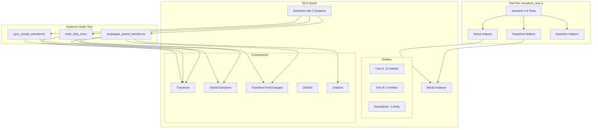
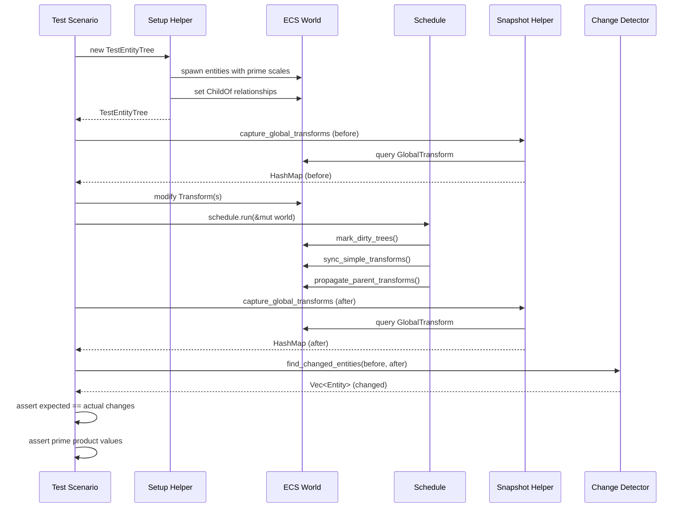
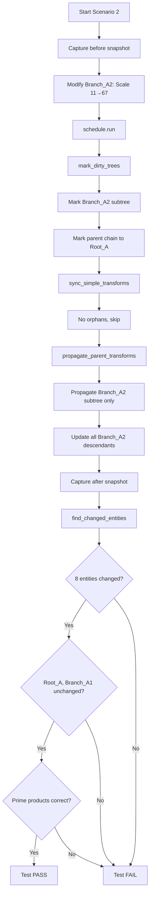

# 設計: transform_system.rsのインテグレーションテスト

## Overview

**Purpose**: `transform_system.rs`の3つのシステム関数（`mark_dirty_trees`、`sync_simple_transforms`、`propagate_parent_transforms`）を統合したエンドツーエンドのインテグレーションテストを実装する。素数スケール値を使用することで、階層的な変換伝播の正確性を検算可能にする。

**Users**: 開発者がコードベースを変更する際に、transform systemの動作が保証されることを確認する。

**Impact**: 既存の`crates/wintf/tests/transform_test.rs`に8つの包括的なテストシナリオを追加し、テストカバレッジを大幅に向上させる。

### Goals
- 3つのシステム関数の統合動作を検証するインテグレーションテストの実装
- 素数スケール値による検算可能なテスト設計
- 変更検出メカニズムによる部分的サブツリー更新の検証
- 階層構造（5階層12エンティティ、3階層5エンティティ、独立1エンティティ）での動作保証

### Non-Goals
- ユニットテストレベルでの個別関数の詳細テスト（既存テストで十分）
- パフォーマンステスト（並列処理の正確性は検証するが、速度は対象外）
- `transform_system.rs`の実装変更
- 新規コンポーネントの追加（テストはHashMapスナップショットで完結）

## Architecture

### Existing Architecture Analysis

**既存のテストファイル構造**:
```
crates/wintf/tests/transform_test.rs
├─ test_transform_to_matrix3x2_identity()
├─ test_transform_to_matrix3x2_translate()
├─ test_transform_to_matrix3x2_scale()
├─ test_transform_to_matrix3x2_rotate_90()
├─ test_transform_to_matrix3x2_combined()
├─ test_transform_to_matrix3x2_with_origin()
└─ test_sync_simple_transforms() ← 限定的な既存インテグレーションテスト
```

**対象システム**:
```
transform_system.rs
├─ mark_dirty_trees<L, G, M>() - ダーティビット伝播
├─ sync_simple_transforms<L, G, M>() - 階層なしエンティティ更新
└─ propagate_parent_transforms<L, G, M>() - 階層的変換伝播
```

**階層コンポーネント**:
- `bevy_ecs::hierarchy::ChildOf` - 親への参照（Relationship）
- `bevy_ecs::hierarchy::Children` - 子リスト（自動管理）

### Architecture Pattern & Boundary Map



**Architecture Integration**:
- Selected pattern: Integration Testing with Helper Functions
- Domain boundaries: テストコードは`tests/`に配置し、本番コード（`src/`）には影響しない
- Existing patterns preserved: 既存テストのスタイル（`test_*`関数、`assert!`マクロ）を継承
- New components rationale: なし（Hashマップで変更検出を実装）
- Steering compliance: テストは`tests/`ディレクトリに配置する原則を遵守

### Technology Stack

| Layer | Choice / Version | Role in Feature | Notes |
|-------|------------------|-----------------|-------|
| Test Framework | Rust built-in test | テスト実行とアサーション | `#[test]`属性 |
| ECS | bevy_ecs 0.17.2 | World/Schedule/Queryの提供 | 階層コンポーネント含む |
| Transform | wintf::ecs::transform | Transform/GlobalTransform型 | 既存実装 |
| Hierarchy | bevy_ecs::hierarchy | ChildOf/Children | bevy標準コンポーネント |
| Math | windows_numerics | Matrix3x2 | スケール値の検証 |
| Collections | std::collections::HashMap | スナップショット保存 | 変更検出用 |

## Components and Interfaces

| Component | Domain/Layer | Intent | Key Dependencies |
|-----------|--------------|--------|------------------|
| TestEntityTree | Test Setup | 素数スケール値でツリー構造を構築 | bevy_ecs, ChildOf |
| SnapshotHelper | Test Utility | GlobalTransform値のスナップショット取得 | HashMap, bevy_ecs |
| ChangeDetector | Test Utility | 変更されたエンティティを列挙 | HashMap |
| ScenarioTests | Test Cases | 8つのシナリオを実装 | 上記全てのヘルパー |

### Test Utilities

#### TestEntityTree

| Field | Detail |
|-------|--------|
| Intent | 素数スケール値を使用した階層構造の構築 |
| Requirements | FR-1 |

**Responsibilities & Constraints**
- ツリーA（12エンティティ、素数2-37）、ツリーB（5エンティティ、素数43-61）、Standalone（素数41）の構築
- 各エンティティに`Transform`、`GlobalTransform`、`TransformTreeChanged`、`ChildOf`/`Children`を適切に付与
- Entityハンドルを保持して、テストでの参照を容易にする

**Contracts**: State [x]

##### State Management
```rust
struct TestEntityTree {
    // Tree A (12 entities)
    root_a: Entity,
    branch_a1: Entity,
    leaf_a1a: Entity,
    leaf_a1b: Entity,
    branch_a2: Entity,
    branch_a2a: Entity,
    leaf_a2a1: Entity,
    branch_a2a2: Entity,
    deep_leaf_a: Entity,
    branch_a2b: Entity,
    leaf_a2b1: Entity,
    leaf_a2b2: Entity,
    
    // Tree B (5 entities)
    root_b: Entity,
    child_b1: Entity,
    grandchild_b1: Entity,
    child_b2: Entity,
    grandchild_b2: Entity,
    
    // Standalone (1 entity)
    standalone: Entity,
}

impl TestEntityTree {
    fn new(world: &mut World) -> Self {
        // 各エンティティを生成し、素数スケール値で初期化
        // ChildOfリレーションシップを設定
    }
    
    fn all_entities(&self) -> Vec<Entity> {
        // 全18エンティティのリストを返す
    }
}
```

**Implementation Notes**
- 素数値は2から順に使用（重複なし）
- `Scale::new(prime, prime)`で均等スケール
- 初期状態で`GlobalTransform`は`Transform`と同じ値に設定
- `TransformTreeChanged`は初期状態でも付与

#### SnapshotHelper

| Field | Detail |
|-------|--------|
| Intent | スケジュール実行前後のGlobalTransform値を保存 |
| Requirements | FR-2 |

**Service Interface**
```rust
fn capture_global_transforms(world: &World) -> HashMap<Entity, Matrix3x2> {
    let mut snapshot = HashMap::new();
    let mut query = world.query::<(Entity, &GlobalTransform)>();
    for (entity, global) in query.iter(world) {
        snapshot.insert(entity, global.0);
    }
    snapshot
}
```

**Implementation Notes**
- スナップショットは各テストシナリオで更新前後に取得
- Hashマップのキーは`Entity`、値は`Matrix3x2`
- コンポーネントは追加しない（テストローカル変数として管理）

#### ChangeDetector

| Field | Detail |
|-------|--------|
| Intent | 2つのスナップショット間で変更されたエンティティを特定 |
| Requirements | FR-2, FR-3 |

**Service Interface**
```rust
fn find_changed_entities(
    before: &HashMap<Entity, Matrix3x2>,
    after: &HashMap<Entity, Matrix3x2>,
) -> Vec<Entity> {
    after.iter()
        .filter(|(entity, g_after)| {
            before.get(entity).map_or(true, |g_before| g_before != *g_after)
        })
        .map(|(entity, _)| *entity)
        .collect()
}
```

**Implementation Notes**
- `Matrix3x2`の完全一致比較（許容誤差なし）
- 新規追加されたエンティティも変更として扱う
- 返り値は変更されたエンティティのリスト

## System Flows

### Test Execution Flow



### Scenario 2 Flow Example (Partial Subtree Change)



## Data Models

### Domain Model

**Entities**:
- `Entity` (bevy_ecs): 識別子

**Components**:
- `Transform`: ローカル変換（`Scale`, `Translate`, `Rotate`, `Skew`, `TransformOrigin`）
- `GlobalTransform`: グローバル変換行列（`Matrix3x2`）
- `TransformTreeChanged`: ダーティマーカー（ZST）
- `ChildOf`: 親エンティティへの参照
- `Children`: 子エンティティのリスト

**Test Data Structure**:
```rust
// ツリーA: 深く広い階層（12エンティティ）
Root_A (2) → Branch_A1 (3) → [Leaf_A1a (5), Leaf_A1b (7)]
         → Branch_A2 (11) → Branch_A2a (13) → [Leaf_A2a1 (17), Branch_A2a2 (19) → Deep_Leaf_A (23)]
                         → Branch_A2b (29) → [Leaf_A2b1 (31), Leaf_A2b2 (37)]

// ツリーB: 中程度の階層（5エンティティ）
Root_B (43) → [Child_B1 (47) → GrandChild_B1 (53),
               Child_B2 (59) → GrandChild_B2 (61)]

// 独立エンティティ（1エンティティ）
Standalone (41)

// () 内は素数スケール値
```

**Invariants**:
- 各エンティティの素数値は一意
- GlobalTransform = 親からルートまでのTransformの積
- 素数の積により、素因数分解で経路追跡が可能

### Test Snapshot Model

```rust
type Snapshot = HashMap<Entity, Matrix3x2>;

// Usage pattern in tests
let before: Snapshot = capture_global_transforms(&world);
// ... modify Transform(s) and run schedule ...
let after: Snapshot = capture_global_transforms(&world);
let changed: Vec<Entity> = find_changed_entities(&before, &after);
```

## Testing Strategy

### Integration Tests (8 scenarios)

#### Scenario 1: 深く広い階層での伝播
- **Setup**: ツリーA全体（初期状態）
- **Action**: スケジュール実行
- **Assert**:
  - 全12エンティティのGlobalTransformが素数の積として正しいこと
  - `Deep_Leaf_A.G = Scale(2*11*13*19*23, ...) = Scale(125774, ...)`

#### Scenario 2: 部分的なサブツリーの変更
- **Setup**: ツリーA
- **Action**: Branch_A2を`Scale(11,11)` → `Scale(67,67)`に変更
- **Assert**:
  - 変更リスト = [Branch_A2, Branch_A2a, Leaf_A2a1, Branch_A2a2, Deep_Leaf_A, Branch_A2b, Leaf_A2b1, Leaf_A2b2] (8エンティティ)
  - Root_A = `Scale(2, 2)` のまま
  - Branch_A1サブツリー = 元の値のまま
  - `Deep_Leaf_A.G = Scale(2*67*13*19*23, ...) = Scale(766178, ...)`

#### Scenario 3: 深い中間ノードの変更
- **Setup**: ツリーA
- **Action**: Branch_A2a2を`Scale(19,19)` → `Scale(71,71)`に変更
- **Assert**:
  - 変更リスト = [Branch_A2a2, Deep_Leaf_A] (2エンティティ)
  - Root_A, Branch_A1, Branch_A2, Branch_A2a, Branch_A2bサブツリー = 元の値のまま
  - `Deep_Leaf_A.G = Scale(2*11*13*71*23, ...) = Scale(470414, ...)`

#### Scenario 4: 独立エンティティの更新
- **Setup**: Standalone
- **Action**: Standaloneを`Scale(41,41)` → `Scale(73,73)`に変更
- **Assert**:
  - 変更リスト = [Standalone] (1エンティティ)
  - ツリーA、ツリーBの全エンティティ = 元の値のまま

#### Scenario 5: 複数子への並列伝播
- **Setup**: ツリーB
- **Action**: Root_Bを`Scale(43,43)` → `Scale(79,79)`に変更
- **Assert**:
  - 変更リスト = [Root_B, Child_B1, GrandChild_B1, Child_B2, GrandChild_B2] (5エンティティ)
  - ツリーA、Standalone = 元の値のまま
  - `GrandChild_B1.G = Scale(79*47*53, ...) = Scale(196789, ...)`

#### Scenario 6: 複数ツリーの同時処理
- **Setup**: 全ツリー
- **Action**: Root_A, Root_B, Standaloneを同時に異なる未使用の素数に変更
- **Assert**:
  - 変更リスト = 全18エンティティ
  - 各ツリーが独立して正しく計算されること

#### Scenario 7: 孤立化とツリー再構築
- **Setup**: ツリーA
- **Action 1**: Branch_A2aから`ChildOf`を削除
- **Assert 1**:
  - 変更リスト = [Branch_A2a, Leaf_A2a1, Branch_A2a2, Deep_Leaf_A] (4エンティティ)
  - `Branch_A2a.G = Scale(13, 13)` （親の影響なし）
  - Root_A, Branch_A1サブツリー, Branch_A2, Branch_A2bサブツリー = 元の値のまま
- **Action 2**: Branch_A2aに`ChildOf(Root_B)`を追加
- **Assert 2**:
  - 変更リスト = [Branch_A2a, Leaf_A2a1, Branch_A2a2, Deep_Leaf_A] (4エンティティ)
  - `Branch_A2a.G = Scale(43*13, ...) = Scale(559, ...)`
  - Root_B, Child_B1, Child_B2サブツリー = 元の値のまま

#### Scenario 8: ダーティマーク最適化
- **Setup**: ツリーA、ツリーB
- **Action**: Branch_A1を`Scale(3,3)` → `Scale(83,83)`に変更
- **Assert**:
  - 変更リスト = [Branch_A1, Leaf_A1a, Leaf_A1b] (3エンティティ)
  - Root_A = `Scale(2, 2)` のまま
  - Branch_A2サブツリー全体 = 元の値のまま
  - ツリーB全体 = 元の値のまま
  - Standalone = 元の値のまま
  - Branch_A2の`TransformTreeChanged.is_changed() == false`

### Test Implementation Pattern

```rust
#[test]
fn test_scenario_2_partial_subtree_change() {
    // Setup
    let mut world = World::new();
    let mut schedule = create_test_schedule();
    let tree = TestEntityTree::new(&mut world);
    
    // Initial run to establish baseline
    schedule.run(&mut world);
    
    // Capture before
    let before = capture_global_transforms(&world);
    
    // Modify Branch_A2
    {
        let mut transform = world.get_mut::<Transform>(tree.branch_a2).unwrap();
        transform.scale = Scale::new(67.0, 67.0);
    }
    
    // Run schedule
    schedule.run(&mut world);
    
    // Capture after
    let after = capture_global_transforms(&world);
    
    // Detect changes
    let changed = find_changed_entities(&before, &after);
    let expected_changed = vec![
        tree.branch_a2,
        tree.branch_a2a,
        tree.leaf_a2a1,
        tree.branch_a2a2,
        tree.deep_leaf_a,
        tree.branch_a2b,
        tree.leaf_a2b1,
        tree.leaf_a2b2,
    ];
    assert_eq!(changed.len(), expected_changed.len());
    for entity in expected_changed {
        assert!(changed.contains(&entity), "Expected {:?} to be changed", entity);
    }
    
    // Verify unchanged
    assert_eq!(before.get(&tree.root_a), after.get(&tree.root_a), "Root_A should not change");
    assert_eq!(before.get(&tree.branch_a1), after.get(&tree.branch_a1), "Branch_A1 should not change");
    
    // Verify prime products
    let deep_leaf_g = world.get::<GlobalTransform>(tree.deep_leaf_a).unwrap();
    let expected_scale = 2.0 * 67.0 * 13.0 * 19.0 * 23.0; // = 766178
    assert_eq!(deep_leaf_g.0.M11, expected_scale);
    assert_eq!(deep_leaf_g.0.M22, expected_scale);
}
```

### Helper Function Tests
- `test_capture_global_transforms()`: スナップショット取得が正しく動作すること
- `test_find_changed_entities()`: 変更検出が正しく動作すること
- `test_prime_scale_calculation()`: 素数の積計算が正しいこと

## Performance Considerations

**Not a performance test**, but some implementation notes:
- ツリー構築は各テストで1回のみ（セットアップコスト最小化）
- スナップショットは18エンティティのみ（小規模）
- HashMap検索はO(1)で高速
- 各テストは1秒以内に完了する想定

## Implementation Checklist

- [ ] `TestEntityTree` struct実装
- [ ] `capture_global_transforms()` 実装
- [ ] `find_changed_entities()` 実装
- [ ] `create_test_schedule()` 実装（3システム登録）
- [ ] Scenario 1 テスト実装
- [ ] Scenario 2 テスト実装
- [ ] Scenario 3 テスト実装
- [ ] Scenario 4 テスト実装
- [ ] Scenario 5 テスト実装
- [ ] Scenario 6 テスト実装
- [ ] Scenario 7 テスト実装
- [ ] Scenario 8 テスト実装
- [ ] ヘルパー関数テスト実装
- [ ] 既存テストが引き続き動作することを確認
- [ ] `cargo test` で全テストpass
