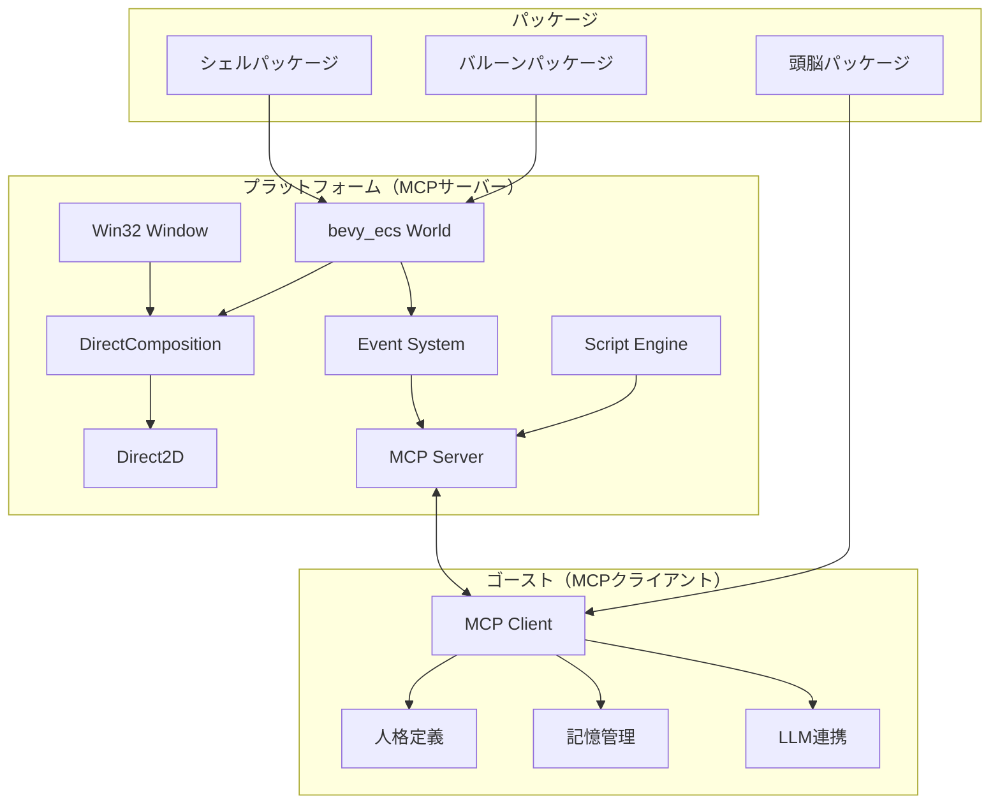
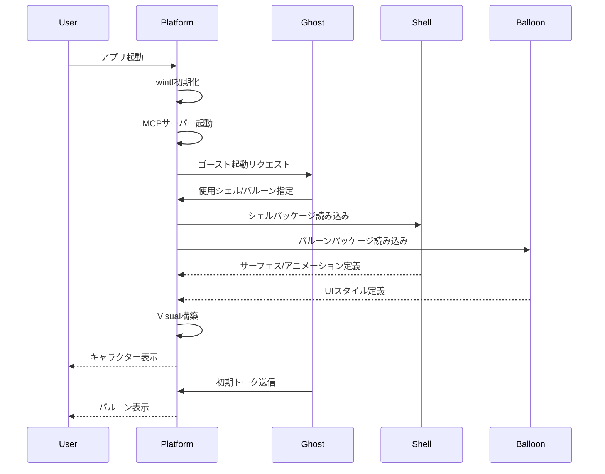
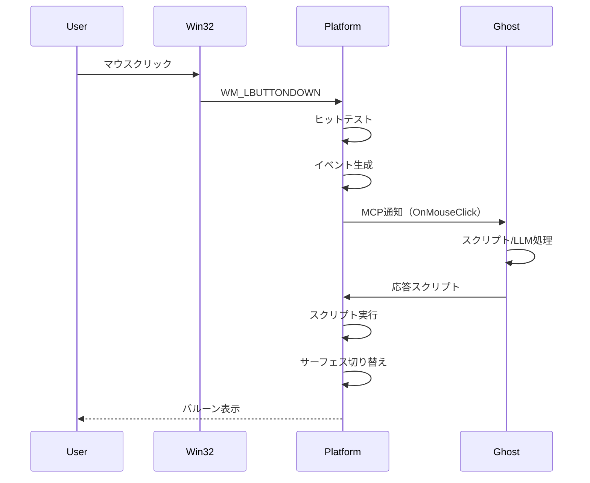
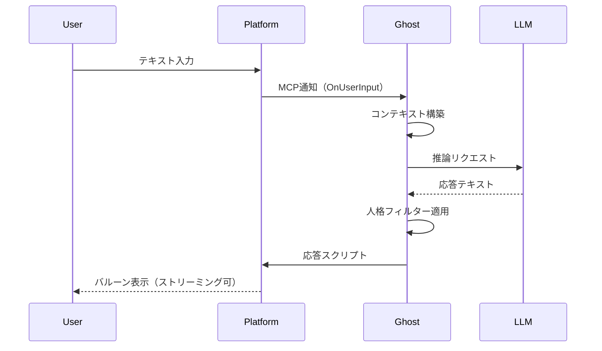
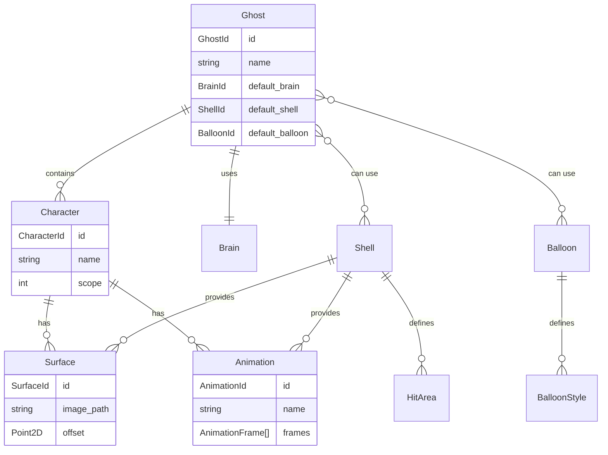

# Technical Design Document

| 項目 | 内容 |
|------|------|
| **Document Title** | 伺的デスクトップマスコットアプリ アーキテクチャ設計書 |
| **Version** | 1.0 |
| **Date** | 2025-11-29 |
| **Requirements Version** | 1.0 |

---

## Overview

### Purpose

本機能は、Windowsデスクトップ上で動作する伺的マスコットアプリケーションのコアプラットフォームを提供する。wintfフレームワーク（bevy_ecs + DirectComposition + Direct2D）を基盤とし、透過ウィンドウ上にキャラクターを表示、対話スクリプトを実行、LLMと連携した応答生成を実現する。

### Users

- **エンドユーザー**: デスクトップマスコットを楽しむ一般ユーザー
- **ゴースト制作者**: 頭脳（スクリプト/LLM人格）を制作するコミュニティ
- **シェル制作者**: キャラクター外見（画像/アニメーション）を制作するアーティスト
- **バルーン制作者**: 会話UIスタイルをデザインするデザイナー

### Impact

wintfフレームワークに以下の拡張を行う：
- 画像サーフェス表示機能（Imageウィジェット）
- イベントシステムの完全実装
- MCPサーバー機能の追加
- スクリプトエンジンの統合

### Goals

- wintfを基盤とした高パフォーマンス描画（60fps、CPU 1%未満）
- MCPプロトコルによるプラットフォーム↔ゴースト分離
- パッケージ（頭脳/シェル/バルーン）の独立配布・交換
- 里々インスパイアDSLによる自然な会話記述
- オフラインLLM/クラウドAPI両対応

### Non-Goals

- SHIORI DLL完全互換（SSPに委譲）
- 32bit Windows対応
- コンテンツ（ゴースト/シェル/バルーン）の国際化（作者責務）
- コンテンツのアクセシビリティ強制（作者責務）

### Implementation Prerequisites

本プロジェクトはwintfフレームワークを基盤とするが、以下の機能はwintfに未実装であり、MVP実装の前提条件として先行実装が必要：

| 優先度 | 機能 | 現状 | 必要な実装 |
|--------|------|------|-----------|
| P0 | Image widget | 未実装 | WIC画像読み込み、D2D描画、透過PNG対応 |
| P0 | アニメーション画像 | 未実装 | GIF/WebPフレーム抽出、タイマー駆動再生 |
| P0 | イベントシステム | 設計のみ | ヒットテスト、マウスイベント配信 |
| P0 | ドラッグ移動 | 未実装 | キャラクターウィンドウのドラッグ移動 |
| P0 | タイプライター表示 | 未対応 | 文字単位の表示制御（現Labelの大幅拡張） |
| P1 | クリックスルー | 未実装 | 透過領域のWM_NCHITTESTハンドリング |
| ✅ | マルチモニタDPI | ほぼ完成 | 追加作業不要 |

**アニメーション画像フォーマット**:
- GIF: WIC標準対応、フレーム抽出可能
- WebP: Windows 10以降WIC対応、アニメーション可能
- APNG: WIC標準非対応（非採用）

**実装順序**:
1. wintf: Image widget + アニメーション（SurfaceRendererの前提）
2. wintf: イベントシステム + ドラッグ（EventDispatcherの前提）
3. wintf: タイプライター表示（BalloonRendererの前提）
3. 本プロジェクト: SurfaceRenderer, EventDispatcher, etc.

### MCP採用方針

**決定**: MCPを採用する（rmcp優先、必要に応じて独自実装へフォールバック）

**根拠**:
- MCPの本質は「JSON-RPCの亜種」であり、仕様変更への追従コストは許容範囲
- SHIORI/SSTPが25年前に同等の概念を実現しており、技術的に枯れた領域
- LLMとの連携（頭脳パッケージ）を考慮すると、MCP準拠が将来的に有利
- 「MCPを無視する積極的理由がない」

**実装戦略**:
1. rmcpで基本実装を試行
2. 問題があれば、MCPサブセットを独自JSON-RPCで実装
3. いずれの場合も、MCPメッセージ形式（JSON-RPC 2.0ベース）は維持

---

## Architecture

### Existing Architecture Analysis

**wintfフレームワーク現状**:

| レイヤー | 現状 | 本プロジェクトでの拡張 |
|---------|------|----------------------|
| ECS基盤 | bevy_ecs 0.17.2 | そのまま活用 |
| レイアウト | taffy統合済み | DPI/マルチモニター対応強化 |
| 描画 | DirectComposition + D2D | サーフェス切り替え、アニメーション追加 |
| テキスト | DirectWrite（縦書き対応） | バルーンレンダリング拡張 |
| ウィジェット | Rectangle, Label | **Image追加必須** |
| イベント | 設計のみ | **完全実装必須** |
| ウィンドウ | Win32、マルチウィンドウ | クリックスルー対応 |

**設計ドキュメント参照**:
- `doc/spec/01-ecs-components.md` — ECSコンポーネント設計
- `doc/spec/06-visual-directcomp.md` — DirectComposition統合
- `doc/spec/08-event-system.md` — イベントシステム設計

### Architecture Pattern & Boundary Map

**選定パターン**: ECS + MCPハイブリッドアーキテクチャ



**Architecture Integration**:

| 項目 | 決定 |
|------|------|
| **選定パターン** | ECS + MCP（research.md参照） |
| **ドメイン境界** | プラットフォーム/ゴースト/パッケージの3層 |
| **既存パターン維持** | wintfのComponent/System分離、Visual/Layout分離 |
| **新規コンポーネント** | MCPServer、ScriptEngine、ImageSurface、Animation |
| **steering準拠** | tech.md記載のRust/DirectComposition/bevy_ecs採用 |

### Technology Stack

| Layer | Choice / Version | Role in Feature | Notes |
|-------|------------------|-----------------|-------|
| Language | Rust 2021 Edition | 全コンポーネント | 型安全性、メモリ安全性 |
| ECS | bevy_ecs 0.17.2 | UIエンティティ管理 | wintf既存 |
| Layout | taffy 0.9.1 | Flexboxレイアウト | wintf既存 |
| Graphics | DirectComposition | 合成・透過 | wintf既存 |
| 2D Render | Direct2D | 描画コマンド | wintf既存 |
| Text | DirectWrite | 縦書き/横書き | wintf既存 |
| Image | WIC | 画像読み込み | wintf既存、拡張必要 |
| Protocol | MCP (rmcp) | プラットフォーム↔ゴースト通信 | **新規** |
| Script | Custom DSL / Lua | 対話スクリプト | **新規** |
| Async | async-executor 1.13.3 | 非同期タスク | wintf既存 |

---

## System Flows

### 起動フロー



### イベント処理フロー



### LLM連携フロー



---

## Requirements Traceability

31個の要件を7つのドメインに分類し、各コンポーネントへマッピングする。

### ドメイン別要件マッピング

| Domain | Requirements | Primary Components |
|--------|--------------|-------------------|
| **描画・表示** | 1, 2, 14, 15 | SurfaceRenderer, AnimationController, VisualSystem |
| **バルーン** | 3 | BalloonRenderer, TextLayout |
| **スクリプト・対話** | 4, 5 | ScriptEngine, EventDispatcher |
| **時間・イベント** | 6 | TimerSystem, EventScheduler |
| **パッケージ管理** | 7, 8, 27, 31 | PackageManager, ManifestParser |
| **設定・永続化** | 9, 25, 30 | ConfigManager, StateStore |
| **通信・連携** | 10, 17-24, 26 | MCPServer, GhostBridge |
| **開発者支援** | 12, 28, 29 | DebugConsole, DAPServer, LSPServer |
| **システム** | 11, 13, 16 | LegacyConverter, TrayIcon, PresenceController |

### 詳細トレーサビリティ（主要要件）

| Requirement | Summary | Components | Interfaces | Flows |
|-------------|---------|------------|------------|-------|
| 1 | キャラクター表示基盤 | SurfaceRenderer, VisualSystem | ISurfaceProvider | 起動フロー |
| 2 | アニメーション | AnimationController | IAnimationDefinition | - |
| 3 | バルーンシステム | BalloonRenderer | IBalloonStyle | イベント処理 |
| 4 | 対話エンジン | ScriptEngine | IScriptContext | LLM連携 |
| 5 | ユーザー入力 | EventDispatcher, HitTester | IInputEvent | イベント処理 |
| 26 | キャラクター間通信 | MCPServer, GhostBridge | IGhostMessage | - |
| 27 | パッケージアーキテクチャ | PackageManager | IManifest | 起動フロー |

---

## Components and Interfaces

### Summary

| Component | Domain/Layer | Intent | Req Coverage | Key Dependencies | Contracts |
|-----------|--------------|--------|--------------|------------------|-----------|
| SurfaceRenderer | Graphics | サーフェス画像の描画 | 1, 2 | D2D, WIC (P0) | Service |
| AnimationController | Graphics | アニメーション状態管理 | 2 | SurfaceRenderer (P0) | State |
| BalloonRenderer | UI | バルーンUI描画 | 3 | TextLayout (P0) | Service |
| TextLayout | UI | テキストレイアウト計算 | 3 | DirectWrite (P0) | Service |
| ScriptEngine | Logic | スクリプト解釈・実行 | 4 | EventDispatcher (P1) | Service |
| EventDispatcher | Core | イベント配信 | 5, 6 | MCPServer (P1) | Event |
| HitTester | Input | ヒット判定 | 5 | ECS (P0) | Service |
| MCPServer | Communication | MCP通信管理 | 10, 26 | async-executor (P0) | API |
| PackageManager | Resource | パッケージ読み込み | 7, 8, 27 | ManifestParser (P0) | Service |
| ConfigManager | Persistence | 設定永続化 | 9, 25 | - | State |
| TimerSystem | Scheduler | タイマー管理 | 6 | ECS (P0) | Event |

---

### Graphics Layer

#### SurfaceRenderer

| Field | Detail |
|-------|--------|
| Intent | サーフェス（キャラクター画像）のDirectComposition描画管理 |
| Requirements | 1.1, 1.2, 1.3, 2.2, 2.3 |

**Responsibilities & Constraints**
- サーフェスIDから対応する画像をロードしVisualに割り当て
- 透過PNGの正しい透過処理
- サーフェス切り替え時のトランジション効果適用
- wintfのVisualGraphics/SurfaceGraphicsコンポーネントを拡張

**Dependencies**
- Inbound: AnimationController — サーフェス切り替え指示 (P0)
- Outbound: D2D/WIC — 画像描画 (P0)
- External: シェルパッケージ — サーフェス画像ファイル (P0)

**Contracts**: Service [x] / State [ ]

##### Service Interface

```rust
/// サーフェスレンダリングサービス
pub trait ISurfaceRenderer {
    /// サーフェスをロードしてVisualに適用
    fn load_surface(&mut self, entity: Entity, surface_id: SurfaceId) -> Result<(), SurfaceError>;
    
    /// サーフェス切り替え（トランジション付き）
    fn switch_surface(
        &mut self, 
        entity: Entity, 
        to: SurfaceId, 
        transition: TransitionType,
    ) -> Result<(), SurfaceError>;
    
    /// サーフェスの有効性確認
    fn is_surface_valid(&self, surface_id: SurfaceId) -> bool;
}

/// サーフェス識別子
#[derive(Clone, Copy, PartialEq, Eq, Hash)]
pub struct SurfaceId(pub u32);

/// トランジション種別
pub enum TransitionType {
    Instant,
    Fade { duration_ms: u32 },
    Slide { direction: Direction, duration_ms: u32 },
}
```

**Implementation Notes**
- wintfの`SurfaceGraphics`コンポーネントを拡張
- 画像キャッシュ機構の実装（メモリ使用量制限）
- デバイスロスト時の再作成対応

---

#### AnimationController

| Field | Detail |
|-------|--------|
| Intent | サーフェスアニメーションの状態管理と再生制御 |
| Requirements | 2.1, 2.4, 2.5, 2.6, 2.7, 2.8 |

**Responsibilities & Constraints**
- アニメーション定義（JSON/YAML）のパース
- フレームタイミング管理（60fps目標）
- 複数キャラクター間の連動アニメーション
- アイドルアニメーション（待機時）の自動再生

**Dependencies**
- Inbound: ScriptEngine — アニメーション開始/停止指示 (P1)
- Outbound: SurfaceRenderer — サーフェス切り替え (P0)
- External: シェルパッケージ — アニメーション定義ファイル (P0)

**Contracts**: State [x] / Event [x]

##### State Management

```rust
/// アニメーション状態コンポーネント
#[derive(Component)]
pub struct AnimationState {
    pub current_animation: Option<AnimationId>,
    pub current_frame: usize,
    pub elapsed_time: Duration,
    pub is_playing: bool,
    pub loop_mode: LoopMode,
}

/// アニメーション定義
pub struct AnimationDefinition {
    pub id: AnimationId,
    pub frames: Vec<AnimationFrame>,
    pub default_interval_ms: u32,
}

pub struct AnimationFrame {
    pub surface_id: SurfaceId,
    pub duration_ms: Option<u32>, // None = default使用
    pub offset: Option<Point2D>,
}
```

##### Event Contract

- Published events: `AnimationStarted`, `AnimationEnded`, `FrameChanged`
- Subscribed events: `PlayAnimation`, `StopAnimation`, `SetIdleAnimation`

---

### UI Layer

#### BalloonRenderer

| Field | Detail |
|-------|--------|
| Intent | バルーン（吹き出し）UIの描画とテキスト表示 |
| Requirements | 3.1-3.10 |

**Responsibilities & Constraints**
- バルーンウィンドウの生成と配置
- スキン（外観）のカスタマイズ
- テキストのタイプライター表示
- 選択肢UI、入力ボックス

**Dependencies**
- Inbound: ScriptEngine — テキスト表示指示 (P0)
- Outbound: TextLayout — テキストレイアウト計算 (P0)
- External: バルーンパッケージ — スタイル定義 (P0)

**Contracts**: Service [x]

##### Service Interface

```rust
/// バルーンサービス
pub trait IBalloonRenderer {
    /// バルーンを表示
    fn show_balloon(&mut self, character: Entity, position: BalloonPosition) -> Entity;
    
    /// テキストを表示（タイプライター効果オプション）
    fn display_text(
        &mut self,
        balloon: Entity,
        text: &str,
        options: TextDisplayOptions,
    ) -> Result<(), BalloonError>;
    
    /// 選択肢を表示
    fn show_choices(
        &mut self,
        balloon: Entity,
        choices: &[Choice],
    ) -> Result<(), BalloonError>;
    
    /// バルーンを閉じる
    fn close_balloon(&mut self, balloon: Entity);
}

pub struct TextDisplayOptions {
    pub typewriter: bool,
    pub typewriter_speed_ms: u32,
    pub vertical: bool,
    pub ruby_enabled: bool,
}

pub struct Choice {
    pub id: ChoiceId,
    pub text: String,
    pub enabled: bool,
}
```

---

### Logic Layer

#### ScriptEngine

| Field | Detail |
|-------|--------|
| Intent | 対話スクリプトの解釈と実行 |
| Requirements | 4.1-4.10 |

**責務境界の明確化**:

プラットフォーム（ScriptEngine）とゴースト（MCPクライアント）の責務分離：

| 責務 | 担当 | 処理内容 |
|------|------|----------|
| スクリプト**提供** | ゴースト | 里々DSL等で会話を記述、イベントに応じてスクリプトを生成 |
| スクリプト**実行** | プラットフォーム | MCPで受信したコマンド列を解釈・実行 |

**MCP送受信形式**: ゴーストからプラットフォームへは「さくらスクリプト相当の実行コマンド列」を送信。里々DSL等の高水準スクリプトはゴースト内部で処理され、プラットフォームには渡されない。

> **Note**: この設計により、ゴーストは任意のスクリプト言語（里々、Lua、LLM直接生成等）を内部で使用可能。プラットフォームは実行コマンドのみを扱うため、ゴースト実装の自由度が確保される。

**MVP対応コマンド範囲**:

MVPゴール: **2体のキャラクターが掛け合い会話できる**

| コマンド | MVP | 説明 |
|----------|-----|------|
| 文字表示 | ✅ | 通常テキスト |
| `\s[n]` | ✅ | サーフェス（表情）切替 |
| `\b[n]` | ✅ | バルーン切替 |
| `\0` `\1` | ✅ | スコープ切替（2体掛け合い） |
| `\w[n]` | ✅ | ウェイト（キャラ表現の中核） |
| `\_w[n]` | ✅ | 絶対ウェイト |
| `\n` | ✅ | 改行 |
| `\e` | ✅ | 発話終了 |
| 選択肢 `\q` | ❌ | MVP後 |
| 同期タグ | ❓ | 2体同時発話に必要なら検討 |
| 音声 `\_v` | ❌ | MVP後 |

> **Note**: スクリプト制御言語の調査（今どきの言語）は現スコープ外。MVP後に検討。

**Responsibilities & Constraints**
- MCPで受信したコマンド列（さくらスクリプト相当）の解釈・実行
- 変数管理（グローバル/ローカル）
- 条件分岐、ループ、関数呼び出し
- 複数キャラクター会話の制御（2体掛け合い）

**Dependencies**
- Inbound: EventDispatcher — イベント受信 (P0)
- Inbound: MCPServer — ゴーストからのコマンド列 (P0)
- Outbound: BalloonRenderer — テキスト表示 (P0)
- Outbound: SurfaceRenderer — サーフェス変更 (P0)

**Contracts**: Service [x]

##### Service Interface

```rust
/// スクリプトエンジン
pub trait IScriptEngine {
    /// スクリプトをロード
    fn load_script(&mut self, source: &str) -> Result<ScriptId, ScriptError>;
    
    /// イベントに対応するスクリプトを実行
    fn execute_event(&mut self, event: &ScriptEvent) -> Result<ScriptResult, ScriptError>;
    
    /// 変数を取得
    fn get_variable(&self, name: &str) -> Option<ScriptValue>;
    
    /// 変数を設定
    fn set_variable(&mut self, name: &str, value: ScriptValue);
}

/// スクリプトイベント
pub struct ScriptEvent {
    pub event_type: EventType,
    pub parameters: HashMap<String, ScriptValue>,
}

/// スクリプト実行結果
pub struct ScriptResult {
    pub commands: Vec<ScriptCommand>,
    pub return_value: Option<ScriptValue>,
}

/// スクリプトコマンド
pub enum ScriptCommand {
    Say { character: CharacterId, text: String },
    Surface { character: CharacterId, surface_id: SurfaceId },
    Animate { character: CharacterId, animation_id: AnimationId },
    Wait { duration_ms: u32 },
    Choice { choices: Vec<Choice> },
    // ... etc
}
```

---

### Communication Layer

#### MCPServer

| Field | Detail |
|-------|--------|
| Intent | プラットフォーム↔ゴースト間のMCP通信管理 |
| Requirements | 10.1-10.5, 26.11-26.20 |

**Responsibilities & Constraints**
- MCPプロトコルの実装（JSON-RPC over stdio/HTTP）
- ゴーストプロセスの管理
- イベントのゴーストへの配信
- ゴースト間メッセージのルーティング

**Dependencies**
- Inbound: EventDispatcher — プラットフォームイベント (P0)
- Outbound: ScriptEngine — ゴーストからの応答 (P0)
- External: ゴーストプロセス — MCP通信 (P0)

**Contracts**: API [x] / Event [x]

##### API Contract（MCP Tools）

| Tool | Description | Parameters | Returns |
|------|-------------|------------|---------|
| `display_text` | バルーンにテキスト表示 | `character`, `text`, `options` | `success` |
| `switch_surface` | サーフェス切り替え | `character`, `surface_id`, `transition` | `success` |
| `play_animation` | アニメーション再生 | `character`, `animation_id` | `success` |
| `get_variable` | 変数取得 | `name` | `value` |
| `set_variable` | 変数設定 | `name`, `value` | `success` |
| `list_ghosts` | 起動中ゴースト一覧 | - | `ghost_list` |
| `send_message` | ゴースト間メッセージ | `to_ghost`, `message` | `success` |

##### Event Contract（MCP Resources/Notifications）

- Published events: `OnMouseClick`, `OnMouseMove`, `OnTimer`, `OnBoot`, `OnClose`
- Subscribed events: `GhostResponse`, `GhostMessage`

---

### Resource Layer

#### PackageManager

| Field | Detail |
|-------|--------|
| Intent | パッケージ（頭脳/シェル/バルーン）の読み込みと管理 |
| Requirements | 7.1-7.7, 8.1-8.5, 27.1-27.27 |

**Responsibilities & Constraints**
- manifest.tomlのパースと検証
- パッケージ依存関係の解決
- パッケージのインストール/アンインストール
- アップデート保護（save/フォルダ等）

**Dependencies**
- Outbound: SurfaceRenderer — シェル素材提供 (P0)
- Outbound: BalloonRenderer — バルーンスタイル提供 (P0)
- Outbound: MCPServer — 頭脳パッケージ情報 (P0)

**Contracts**: Service [x]

##### Service Interface

```rust
/// パッケージマネージャ
pub trait IPackageManager {
    /// パッケージをインストール
    fn install(&mut self, path: &Path) -> Result<PackageId, PackageError>;
    
    /// パッケージをアンインストール
    fn uninstall(&mut self, id: PackageId) -> Result<(), PackageError>;
    
    /// インストール済みパッケージ一覧
    fn list_installed(&self, kind: PackageKind) -> Vec<PackageInfo>;
    
    /// パッケージをロード
    fn load(&mut self, id: PackageId) -> Result<LoadedPackage, PackageError>;
    
    /// アップデート確認
    fn check_update(&self, id: PackageId) -> Result<Option<UpdateInfo>, PackageError>;
}

/// パッケージ種別
pub enum PackageKind {
    Brain,   // 頭脳
    Shell,   // シェル
    Balloon, // バルーン
}

/// マニフェスト構造
#[derive(Deserialize)]
pub struct Manifest {
    pub package: PackageMeta,
    pub dependencies: Option<Dependencies>,
    pub shell: Option<ShellConfig>,
    pub balloon: Option<BalloonConfig>,
    pub brain: Option<BrainConfig>,
}
```

---

## Data Models

### Domain Model



### Logical Data Model

#### パッケージ構造

```
packages/
├── brains/
│   └── {brain-id}/
│       ├── manifest.toml
│       ├── scripts/
│       ├── personality/
│       └── save/          # アップデート保護
├── shells/
│   └── {shell-id}/
│       ├── manifest.toml
│       ├── surfaces/
│       ├── animations/
│       └── hit_areas.toml
└── balloons/
    └── {balloon-id}/
        ├── manifest.toml
        └── styles/
```

#### 設定データ構造

```rust
/// アプリケーション設定
pub struct AppConfig {
    pub language: String,
    pub startup: StartupConfig,
    pub display: DisplayConfig,
    pub performance: PerformanceConfig,
}

/// ゴースト状態（永続化）
pub struct GhostState {
    pub ghost_id: GhostId,
    pub variables: HashMap<String, Value>,
    pub memory: Vec<MemoryEntry>,
    pub statistics: GhostStatistics,
}

/// 記憶エントリ
pub struct MemoryEntry {
    pub timestamp: DateTime,
    pub content: String,
    pub tags: Vec<String>,
    pub importance: f32,
}
```

---

## Error Handling

### Error Strategy

| エラー種別 | 対応 | ユーザー通知 |
|-----------|------|-------------|
| パッケージ読み込み失敗 | フォールバックパッケージ使用 | 警告表示 |
| スクリプトエラー | エラーログ、継続実行 | デバッグモード時のみ表示 |
| MCP通信エラー | リトライ、再接続 | ゴースト側に通知 |
| 描画デバイスロスト | リソース再作成 | 自動復旧 |
| メモリ不足 | キャッシュクリア | 警告表示 |

### Error Categories

```rust
/// プラットフォームエラー
#[derive(Debug, thiserror::Error)]
pub enum PlatformError {
    #[error("Package error: {0}")]
    Package(#[from] PackageError),
    
    #[error("Script error: {0}")]
    Script(#[from] ScriptError),
    
    #[error("Graphics error: {0}")]
    Graphics(#[from] GraphicsError),
    
    #[error("MCP error: {0}")]
    Mcp(#[from] McpError),
}
```

---

## Testing Strategy

### Unit Tests

- ScriptEngine: DSLパース、変数管理、制御構文
- PackageManager: manifest解析、依存関係解決
- AnimationController: フレーム計算、ループ処理
- HitTester: 座標変換、領域判定

### Integration Tests

- パッケージロード → 描画 フロー
- イベント発火 → スクリプト実行 → 表示更新 フロー
- MCP通信 → ゴースト応答 → 表示 フロー

### E2E Tests

- アプリ起動 → ゴースト表示 → 対話 → 終了
- シェル切り替え
- バルーン表示・選択肢選択

### Performance Tests

- 60fps描画維持（アイドル時）
- CPU使用率1%未満（アイドル時）
- メモリ100MB未満（基本状態）

---

## Security Considerations

### サンドボックス設計（NFR-3準拠）

| リソース | 制限 |
|---------|------|
| ファイルシステム | パッケージディレクトリ + save/のみ |
| ネットワーク | 明示的許可が必要 |
| プロセス | スクリプトからの直接起動禁止 |
| システム情報 | 限定的なAPI提供（時刻、天気等） |

### 透過ウィンドウセキュリティ（NFR-3準拠）

```rust
/// ヒットテストポリシー
pub struct HitTestPolicy {
    /// 透過度閾値（これ以上透過ならクリック透過）
    pub transparency_threshold: f32, // default: 0.5
    /// 最小ヒット領域サイズ
    pub minimum_hit_area: Size2D,    // default: 8x8
}
```

---

## Performance & Scalability

### パフォーマンス目標（NFR-6準拠）

| 指標 | 目標値 | 測定方法 |
|------|--------|----------|
| アイドル時CPU | < 1% | タスクマネージャー |
| アイドル時メモリ | < 100MB | タスクマネージャー |
| 描画FPS | 60fps | DirectComposition統計 |
| イベント応答 | < 16ms | 内部計測 |

### 最適化戦略

- **GPU活用**: DirectCompositionによるハードウェア合成
- **遅延初期化**: 必要になるまでリソース作成しない
- **キャッシュ**: サーフェス画像、テキストレイアウト
- **省電力モード**: バッテリー駆動時はFPS低減

---

## Supporting References

### wintf内部型定義

`crates/wintf/src/ecs/` に定義された既存型を継承・拡張する：

- `VisualGraphics` — DirectComposition Visual管理
- `SurfaceGraphics` — Surface管理
- `Arrangement` / `GlobalArrangement` — レイアウト結果
- `TaffyStyle` — レイアウトスタイル

### MCP仕様参照

- [MCP公式仕様](https://modelcontextprotocol.io/)
- rmcp (Rust MCP実装): 評価予定

### 詳細な調査ログ

`research.md` を参照：
- MCPプロトコル調査
- SHIORIプロトコル調査
- アーキテクチャパターン評価
