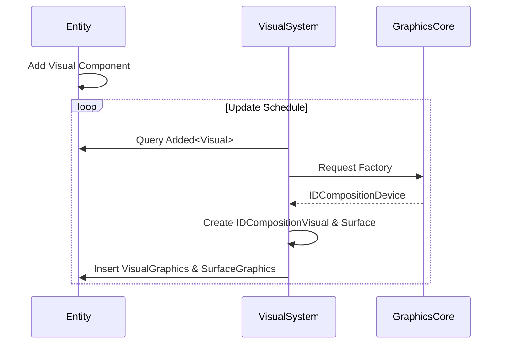
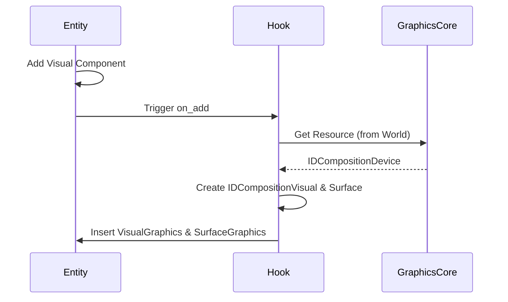

# Design Document: Visual Auto Component Refactor

---
**Purpose**: 実装者間での一貫性を確保し、解釈のずれを防ぐために十分な詳細を提供する。
---

## 概要
この機能は、論理的な`Visual`コンポーネントを導入することで、DirectCompositionのビジュアル管理をリファクタリングする。開発者は`VisualGraphics`や`SurfaceGraphics`リソースを手動で作成する代わりに、エンティティに`Visual`コンポーネントをアタッチするだけでよく、システムが基礎となるGPUリソースを自動的に管理する。

### 目標
- `Visual`コンポーネントをビジュアルノードの論理的定義として導入する。
- `Visual`コンポーネントのライフサイクルに基づいて、`VisualGraphics`と`SurfaceGraphics`の生成と破棄を自動化する。
- リソース生成のための2つの戦略（ECS SystemsとComponent Hooks）を実装し比較する。
- 既存のレンダリング動作を退行（リグレッション）なしに維持する。

### 非目標
- ビジュアルツリーの同期（階層の更新） - `visual-tree-synchronization`仕様に移動。
- サーフェス割り当ての最適化 - `surface-allocation-optimization`仕様に移動。
- アニメーションのサポート。

## アーキテクチャ

### アーキテクチャパターンと境界マップ
設計は**ECS (Entity Component System)**パターンに従う。
- **論理層**: `Visual`コンポーネント（ユーザー向け）。
- **リソース層**: `VisualGraphics`, `SurfaceGraphics`（システム管理、COMをラップ）。
- **インフラストラクチャ**: `GraphicsCore`（デバイスファクトリ）。

**境界**:
- ユーザーは`Visual`と対話する。
- Systems/Hooksは`GraphicsCore`と対話し、`VisualGraphics`/`SurfaceGraphics`を生成する。

### 技術スタック

| Layer | Choice / Version | Role in Feature | Notes |
|-------|------------------|-----------------|-------|
| ECS | Bevy ECS | 状態管理 | |
| Graphics | DirectComposition (windows-rs) | レンダリングバックエンド | |
| Language | Rust | 実装 | |

## システムフロー

### リソース生成 (Systemsアプローチ)


### リソース生成 (Hooksアプローチ)


## 要件トレーサビリティ

| Requirement | Summary | Components | Interfaces | Flows |
|-------------|---------|------------|------------|-------|
| R1 | 論理Visualコンポーネント | `Visual` | `struct Visual` | N/A |
| R1.5 | 自動リソース管理 | `VisualResourceSystem` / `VisualHooks` | `System` / `Hook` | リソース生成 |
| R2 | 柔軟な構成 (Surface) | `VisualResourceSystem` | N/A | 常にSurfaceを生成 (per R2.2) |
| R4 | 初期化と回復 | `VisualResourceSystem` | `GraphicsCore::is_valid` | 生成前に有効性を確認 |
| R5 | 移行 | `Main` | N/A | 手動呼び出しを`Visual`に置き換え |

## コンポーネントとインターフェイス

### 1. 論理Visualコンポーネント

| Component | Domain | Intent | Req Coverage | Key Dependencies |
|-----------|--------|--------|--------------|------------------|
| `Visual` | ECS/Logic | ビジュアルノードを定義する | R1, R2 | なし |

```rust
#[derive(Component, Debug, Clone)]
#[component(on_add = on_visual_added, on_remove = on_visual_removed)] // For Hooks approach
pub struct Visual {
    pub is_visible: bool,
    pub opacity: f32,
    pub transform: Matrix3x2, // or a suitable transform struct
}

impl Default for Visual {
    fn default() -> Self {
        Self {
            is_visible: true,
            opacity: 1.0,
            transform: Matrix3x2::identity(),
        }
    }
}
```

### 2. リソース管理システム (アプローチA)

| Component | Domain | Intent | Req Coverage | Key Dependencies |
|-----------|--------|--------|--------------|------------------|
| `visual_resource_system` | ECS/System | Systems経由でGPUリソースを管理 | R1.5, R4 | `GraphicsCore` (P0) |

**ロジック**:
- `(Entity, Added<Visual>)`をクエリする。
- `GraphicsCore`の有効性を確認する。
- `IDCompositionVisual`と`IDCompositionSurface`を作成する。
- `VisualGraphics`と`SurfaceGraphics`コンポーネントをエンティティに挿入する。

### 3. リソース管理フック (アプローチB)

| Component | Domain | Intent | Req Coverage | Key Dependencies |
|-----------|--------|--------|--------------|------------------|
| `on_visual_added` | ECS/Hook | Hooks経由でGPUリソースを管理 | R1.5, R4 | `GraphicsCore` (P0) |

**ロジック**:
- `HookContext`から`World`にアクセスする。
- `GraphicsCore`リソースを取得する。
- リソースを作成し、`DeferredWorld`を使用してコンポーネントを挿入する。

### 4. 移行ロジック
- **ターゲット**: `crates/wintf/src/ecs/graphics/systems.rs`（または`create_visual_for_target`が使用されている場所）。
- **変更**: `create_visual_for_target`を呼び出す代わりに、ルートエンティティに`Visual`コンポーネントを挿入する。

## データモデル
複雑なデータモデルはない。`Visual`構造体は上記で定義されている。

## 実装計画
1. `components.rs`で`Visual`コンポーネントを定義する。
2. 新しいモジュール`visual_manager.rs`で`visual_resource_system`（アプローチA）を実装する。
3. `components.rs`（または`visual_manager.rs`でリンク）で`on_visual_added`フック（アプローチB）を実装する。
4. テストのためにAとBを切り替えるメカニズム（機能フラグやランタイム設定など）を追加する。
5. `Visual`コンポーネントを使用するように初期化コードをリファクタリングする。
