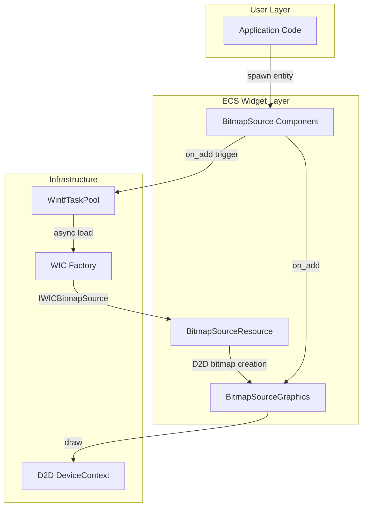
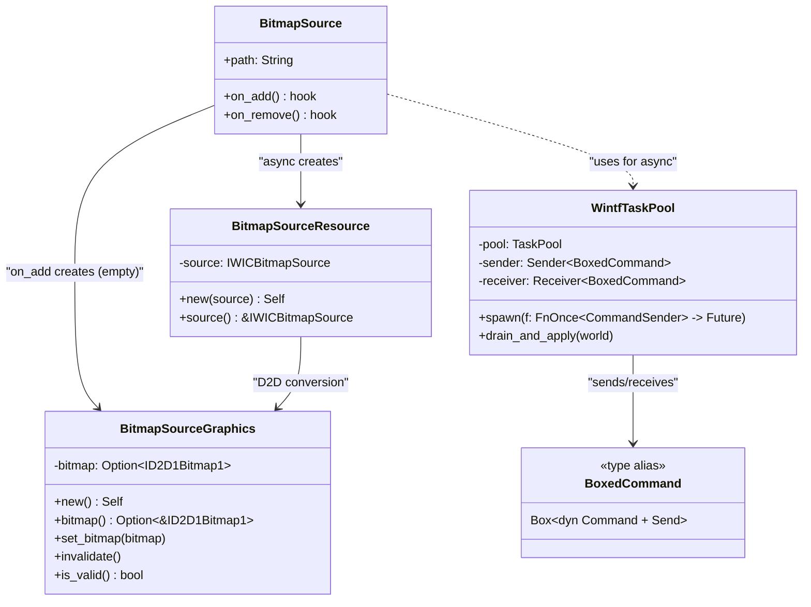
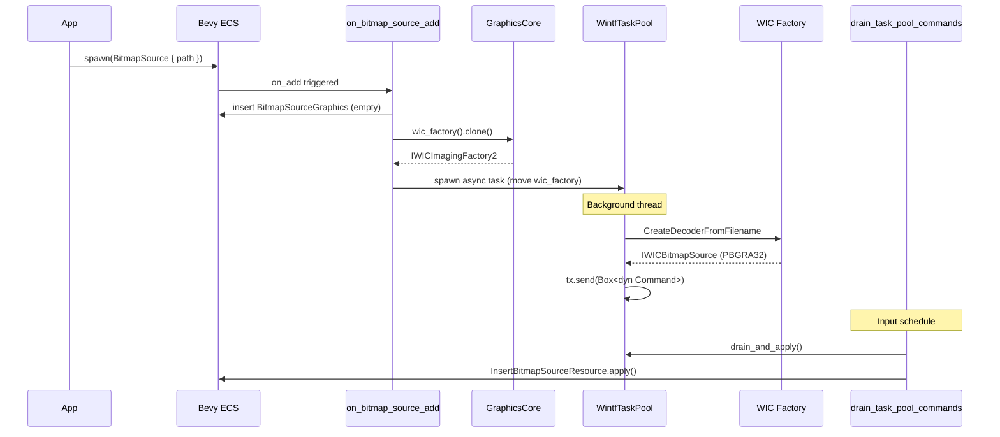
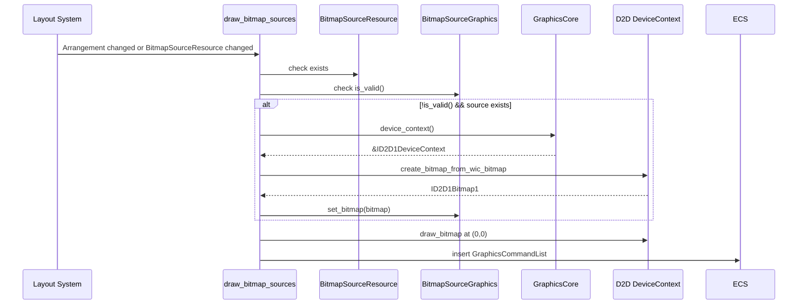
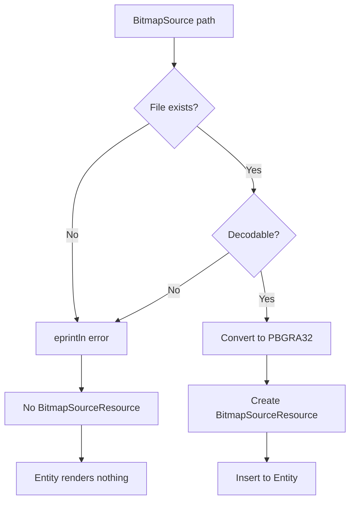
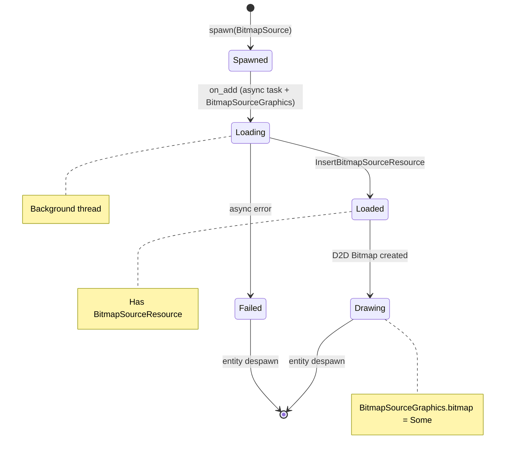

# Technical Design Document: wintf-P0-image-widget

## 1. Overview

### 1.1 Purpose
wintf ECSフレームワークに静止画像表示機能を追加し、非同期ファイル読み込み、WIC/D2D統合、αチャネル透過をサポートする。

### 1.2 Scope
- **In Scope**: 静止画像（PNG, JPEG, BMP, GIF）の非同期読み込み、αチャネル透過、ECS統合
- **Out of Scope**: アニメーション（P1）、スケーリングモード（P1）、ストレッチ/タイル（P1）

### 1.3 Requirements Traceability

| 要件ID | 要件名 | 関連コンポーネント | 関連システム |
|--------|--------|-------------------|--------------|
| R1 | 非同期読み込み | WintfTaskPool, BitmapSource | drain_task_pool_commands |
| R2 | 静止画像読み込み | BitmapSourceResource | load_bitmap_source_async |
| R3 | 透過処理 | BitmapSourceResource | load_bitmap_source_async (WIC変換) |
| R4 | D2D描画 | BitmapSourceGraphics | draw_bitmap_sources |
| R5 | ECS統合 | BitmapSource | on_bitmap_source_add, on_bitmap_source_remove |
| R6 | 将来拡張性 | モジュール構造 | - |

---

## 2. Architecture

### 2.1 High-Level Architecture



### 2.2 Component Diagram



### 2.3 Directory Structure

```
crates/wintf/src/
├── ecs/
│   ├── widget/
│   │   ├── mod.rs              # pub mod bitmap_source 追加
│   │   └── bitmap_source/
│   │       ├── mod.rs          # モジュール公開
│   │       ├── bitmap_source.rs # BitmapSource component
│   │       ├── resource.rs     # BitmapSourceResource, BitmapSourceGraphics
│   │       ├── task_pool.rs    # WintfTaskPool
│   │       └── systems.rs      # systems
│   └── mod.rs                  # widget re-export
├── com/
│   ├── wic.rs                  # 既存（変更なし）
│   └── d2d/mod.rs              # 既存（変更なし）
```

---

## 3. Technology Stack

| 技術 | バージョン | 用途 |
|------|-----------|------|
| bevy_ecs | 0.17.2 | ECSフレームワーク |
| bevy_tasks | workspace | TaskPool |
| std::sync::mpsc | stable | async-to-ECS channel |
| WIC | Windows SDK | 画像デコード |
| Direct2D | Windows SDK | GPU描画 |

---

## 4. System Flows

### 4.1 BitmapSource Loading Flow


```

### 4.2 BitmapSource Rendering Flow



### 4.3 Error Handling Flow



> **Note**: 元画像にαチャネルがない場合も、WIC FormatConverterでPBGRA32に変換され、100%不透明として扱われる。

---

## 5. Components & Interfaces

### 5.1 BitmapSource Component

```rust
/// 画像表示ウィジェット（WIC BitmapSourceベース）
/// 
/// # Example
/// ```rust
/// commands.spawn((
///     BitmapSource::new("assets/logo.png"),
///     BoxSize::fixed(200.0, 100.0),
/// ));
/// ```
#[derive(Component, Debug, Clone)]
#[component(on_add = on_bitmap_source_add, on_remove = on_bitmap_source_remove)]
pub struct BitmapSource {
    /// 画像ファイルパス（相対または絶対）
    pub path: String,
}

impl BitmapSource {
    /// 新しいBitmapSourceコンポーネントを作成
    pub fn new<S: Into<String>>(path: S) -> Self {
        Self { path: path.into() }
    }
}
```

### 5.2 BitmapSourceResource Component

```rust
/// CPU側画像リソース（WIC BitmapSource）
/// 
/// # Thread Safety
/// IWICBitmapSourceはthread-free marshaling対応のため
/// Send + Syncを手動実装する。
#[derive(Component)]
pub struct BitmapSourceResource {
    source: IWICBitmapSource,
}

unsafe impl Send for BitmapSourceResource {}
unsafe impl Sync for BitmapSourceResource {}

impl BitmapSourceResource {
    /// WIC BitmapSourceから作成
    pub fn new(source: IWICBitmapSource) -> Self {
        Self { source }
    }
    
    /// BitmapSourceへの参照を取得
    pub fn source(&self) -> &IWICBitmapSource {
        &self.source
    }
}
```

### 5.3 BitmapSourceGraphics Component

```rust
/// GPU側画像リソース（D2D Bitmap）
/// 
/// BitmapSourceのon_add時にOption::Noneで作成され、
/// BitmapSourceResourceが追加されたらD2D Bitmapを生成する。
/// 
/// # Device Lost対応
/// 既存のVisualGraphics/SurfaceGraphicsと同じパターン:
/// - invalidate_dependent_componentsシステムがDevice Lost時にinvalidate()を呼ぶ
/// - 次フレームでis_valid() == falseを検出しBitmapを再生成
#[derive(Component)]
pub struct BitmapSourceGraphics {
    bitmap: Option<ID2D1Bitmap1>,
}

unsafe impl Send for BitmapSourceGraphics {}
unsafe impl Sync for BitmapSourceGraphics {}

impl BitmapSourceGraphics {
    /// 空のBitmapSourceGraphicsを作成
    pub fn new() -> Self {
        Self { bitmap: None }
    }
    
    /// Bitmapへの参照を取得
    pub fn bitmap(&self) -> Option<&ID2D1Bitmap1> {
        self.bitmap.as_ref()
    }
    
    /// Bitmapを設定
    pub fn set_bitmap(&mut self, bitmap: ID2D1Bitmap1) {
        self.bitmap = Some(bitmap);
    }
    
    /// Device Lost時にBitmapを無効化
    pub fn invalidate(&mut self) {
        self.bitmap = None;
    }
    
    /// Bitmapが有効か判定
    pub fn is_valid(&self) -> bool {
        self.bitmap.is_some()
    }
}
```

### 5.4 WintfTaskPool Resource

```rust
use bevy_ecs::world::Command;
use std::sync::mpsc;

/// Box化されたECSコマンド型
pub type BoxedCommand = Box<dyn Command + Send>;
/// コマンド送信用チャネル型
pub type CommandSender = mpsc::Sender<BoxedCommand>;

/// 非同期タスク実行用リソース
/// 
/// # Design
/// - TaskPoolでバックグラウンド実行
/// - mpsc channelでBox<dyn Command>をECSへ送信
/// - Input scheduleでdrain_and_apply
/// 
/// # Example
/// ```rust
/// task_pool.spawn(|tx| async move {
///     let result = some_async_work().await;
///     let cmd: BoxedCommand = Box::new(MyCommand { result });
///     let _ = tx.send(cmd);
/// });
/// ```
#[derive(Resource)]
pub struct WintfTaskPool {
    pool: TaskPool,
    sender: mpsc::Sender<BoxedCommand>,
    receiver: mpsc::Receiver<BoxedCommand>,
}

impl WintfTaskPool {
    /// 新しいWintfTaskPoolを作成
    pub fn new() -> Self {
        let pool = TaskPool::new();
        let (sender, receiver) = mpsc::channel();
        Self { pool, sender, receiver }
    }
    
    /// 非同期タスクを生成（CommandSenderが自動で渡される）
    pub fn spawn<F, Fut>(&self, f: F)
    where
        F: FnOnce(CommandSender) -> Fut + Send + 'static,
        Fut: Future<Output = ()> + Send,
    {
        let tx = self.sender.clone();
        self.pool.spawn(async move {
            f(tx).await;
        }).detach();
    }
    
    /// 受信したコマンドをすべてWorldに適用
    pub fn drain_and_apply(&self, world: &mut World) {
        for cmd in self.receiver.try_iter() {
            cmd.apply(world);
        }
    }
}
```

### 5.5 InsertBitmapSourceResource Command

```rust
/// 画像読み込み完了時にBitmapSourceResourceを挿入するCommand
struct InsertBitmapSourceResource {
    entity: Entity,
    source: IWICBitmapSource,
}

impl Command for InsertBitmapSourceResource {
    fn apply(self, world: &mut World) {
        if let Some(mut entity_ref) = world.get_entity_mut(self.entity) {
            entity_ref.insert(BitmapSourceResource::new(self.source));
        }
    }
}
```

---

## 6. Data Models

### 6.1 State Machine



### 6.2 Entity Component Mapping

| 状態 | BitmapSource | Visual | BitmapSourceGraphics | BitmapSourceResource | GraphicsCommandList |
|------|--------------|--------|----------------------|----------------------|---------------------|
| Spawned | ✓ | - | - | - | - |
| Loading | ✓ | ✓ | ✓ (None) | - | - |
| Loaded | ✓ | ✓ | ✓ (None) | ✓ | - |
| Drawing | ✓ | ✓ | ✓ (Some) | ✓ | ✓ |
| Failed | ✓ | ✓ | ✓ (None) | - | - |

---

## 7. Error Handling

### 7.1 Error Categories

| カテゴリ | 例 | 対応 |
|----------|---|------|
| ファイルエラー | 不存在、権限なし | eprintln + BitmapSourceResource未生成 |
| フォーマットエラー | 非対応形式、破損 | eprintln + BitmapSourceResource未生成 |
| GPUエラー | Device Lost | invalidate_dependent_componentsで無効化、次フレームで再生成 |

> **Note**: 元画像にαチャネルがない場合はエラーではなく、100%不透明として処理される。

### 7.2 Error Messages

```rust
// ファイル不存在
eprintln!("[BitmapSource] Failed to load '{}': file not found", path);

// デコード失敗
eprintln!("[BitmapSource] Failed to decode '{}': {:?}", path, error);

// D2D bitmap作成失敗
eprintln!("[draw_bitmap_sources] Failed to create D2D bitmap for Entity={}: {:?}", entity, error);
```

---

## 8. Testing Strategy

### 8.1 Unit Tests

| テスト | 対象 | 検証内容 |
|--------|------|----------|
| `test_bitmap_source_component_creation` | BitmapSource | path保持確認 |
| `test_bitmap_source_resource_send_sync` | BitmapSourceResource | Send/Sync trait確認 |
| `test_wintf_task_pool_drain` | WintfTaskPool | channelドレイン動作 |

### 8.2 Integration Tests

| テスト | 対象 | 検証内容 |
|--------|------|----------|
| `test_bitmap_source_on_add_visual_insertion` | on_bitmap_source_add | Visual + BitmapSourceGraphics自動挿入 |
| `test_bitmap_source_loading_success` | load_bitmap_source_async | 正常読み込み |
| `test_bitmap_source_loading_error` | load_bitmap_source_async | エラー時の状態 |
| `test_draw_bitmap_sources_with_arrangement` | draw_bitmap_sources | レイアウト統合 |

### 8.3 Test Resources

```
crates/wintf/tests/assets/
├── test_rgba.png      # αチャネルあり
├── test_rgb.png       # αチャネルなし（変換テスト）
├── test_jpeg.jpg      # JPEG形式
└── invalid.bin        # 不正フォーマット
```

---

## 9. Implementation Notes

### 9.1 GraphicsCore Extension

```rust
// GraphicsCoreInnerにWICファクトリを追加
struct GraphicsCoreInner {
    // ... existing fields ...
    pub wic_factory: IWICImagingFactory2,
}

impl GraphicsCore {
    pub fn new() -> Result<Self> {
        // ... existing initialization ...
        
        // WICファクトリ作成
        let wic_factory: IWICImagingFactory2 = unsafe {
            CoCreateInstance(&CLSID_WICImagingFactory2, None, CLSCTX_INPROC_SERVER)?
        };
        
        // ...
    }
    
    /// WICファクトリへの参照を取得
    /// COM interfaceはClone可能（参照カウント増加）
    pub fn wic_factory(&self) -> Option<&IWICImagingFactory2> {
        self.inner.as_ref().map(|i| &i.wic_factory)
    }
}
```

### 9.2 WIC Format Conversion

```rust
// GUID_WICPixelFormat32bppPBGRA への変換
// 元画像にαチャネルがない場合も100%不透明として変換される
let converter = wic_factory.create_format_converter()?;
converter.init(
    &frame,
    &GUID_WICPixelFormat32bppPBGRA,
    WICBitmapDitherTypeNone,
    None,
    0.0,
    WICBitmapPaletteTypeMedianCut,
)?;
```

### 9.3 Schedule Integration

```rust
// Input schedule での drain_and_apply システム登録
app.add_systems(Input, drain_task_pool_commands);

// PostLayout schedule での draw_bitmap_sources 登録
app.add_systems(PostLayout, draw_bitmap_sources.after(calculate_arrangement));

/// WintfTaskPoolからコマンドをドレインしてWorldに適用
fn drain_task_pool_commands(world: &mut World) {
    // ResourceをWorldから一時的に取り出して処理
    if let Some(task_pool) = world.remove_resource::<WintfTaskPool>() {
        task_pool.drain_and_apply(world);
        world.insert_resource(task_pool);
    }
}
```

### 9.4 Path Resolution (System-wide Policy)

```rust
/// パス解決: 実行ファイル基準
///
/// wintfシステム全体の思想として、相対パスは実行ファイルの
/// ディレクトリを基準とする。カレントディレクトリは実行時に
/// 変動する可能性があるため、使用しない。
fn resolve_path(path: &str) -> std::io::Result<std::path::PathBuf> {
    let path = std::path::Path::new(path);
    
    if path.is_absolute() {
        Ok(path.to_path_buf())
    } else {
        // 実行ファイルのディレクトリを基準に解決
        let exe_path = std::env::current_exe()?;
        let exe_dir = exe_path.parent().ok_or_else(|| {
            std::io::Error::new(std::io::ErrorKind::NotFound, "exe directory not found")
        })?;
        Ok(exe_dir.join(path))
    }
}
```

### 9.5 on_add Hook Pattern

```rust
fn on_bitmap_source_add(mut world: DeferredWorld, hook: HookContext) {
    let entity = hook.entity;
    
    // Visual + BitmapSourceGraphics 自動挿入（Rectangle/Labelパターン踏襲）
    if world.get::<Visual>(entity).is_none() {
        world.commands().entity(entity).insert((
            Visual::default(),
            BitmapSourceGraphics::new(),  // Option<ID2D1Bitmap1> = None
        ));
    }
    
    // GraphicsCoreからWIC Factoryをcloneして取得
    let wic_factory = match world.get_resource::<GraphicsCore>() {
        Some(gc) => match gc.wic_factory() {
            Some(wic) => wic.clone(),  // COM interfaceはClone可能（参照カウント）
            None => {
                eprintln!("[BitmapSource] GraphicsCore not valid");
                return;
            }
        },
        None => {
            eprintln!("[BitmapSource] GraphicsCore not found");
            return;
        }
    };
    
    // 非同期読み込みタスク起動
    if let Some(task_pool) = world.get_resource::<WintfTaskPool>() {
        let path = world.get::<BitmapSource>(entity).unwrap().path.clone();
        
        // wic_factoryをmoveしてタスクに渡す
        task_pool.spawn(move |tx| async move {
            // パス解決: 実行ファイル基準
            let resolved = match resolve_path(&path) {
                Ok(p) => p,
                Err(e) => {
                    eprintln!("[BitmapSource] Failed to resolve path '{}': {:?}", path, e);
                    return;
                }
            };
            
            match load_bitmap_source(&wic_factory, &resolved) {
                Ok(source) => {
                    let cmd: BoxedCommand = Box::new(InsertBitmapSourceResource { entity, source });
                    let _ = tx.send(cmd);
                }
                Err(e) => {
                    eprintln!("[BitmapSource] Failed to load '{}': {:?}", resolved.display(), e);
                }
            }
        });
    }
}
```

---

## 10. Dependencies

### 10.1 New Dependencies
なし（既存依存のみ使用）

### 10.2 Existing Dependencies Used
- `bevy_tasks`: TaskPool
- `windows::Win32::Graphics::Imaging`: WIC API
- `windows::Win32::Graphics::Direct2D`: D2D API

---

## 11. Future Considerations (P1)

- **wintf-P1-image-rendering**: スケーリングモード、ストレッチ、タイル、補間モード
- **アニメーション**: GIF/APNG対応（別Spec予定）
- **ストリーミング**: 大容量画像の段階読み込み
