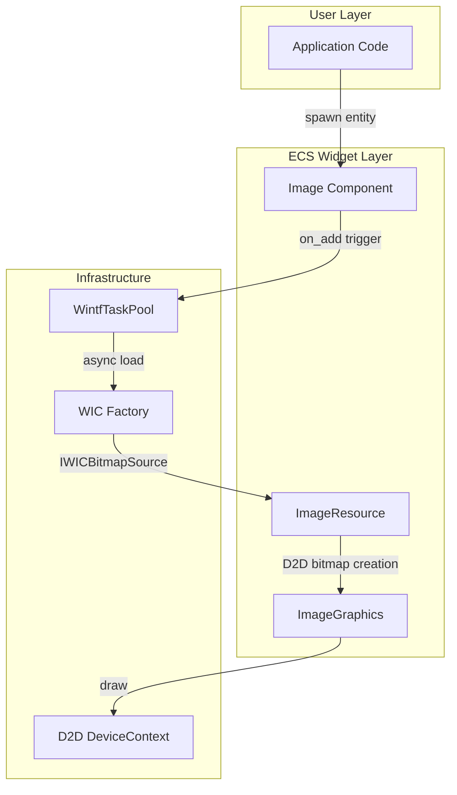
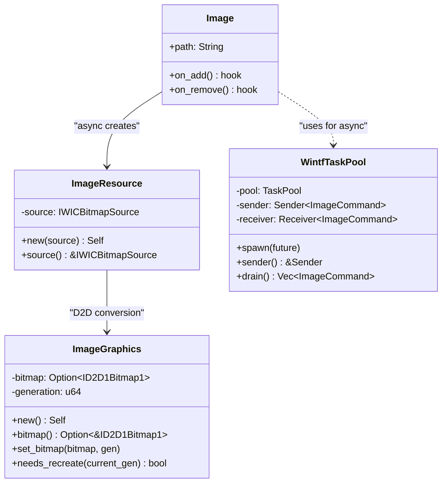
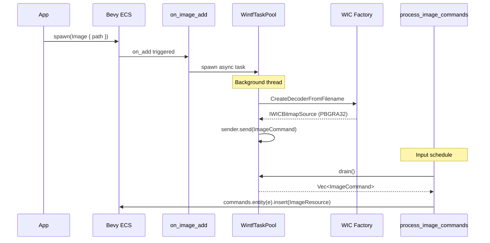
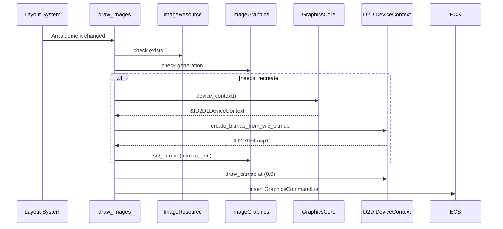
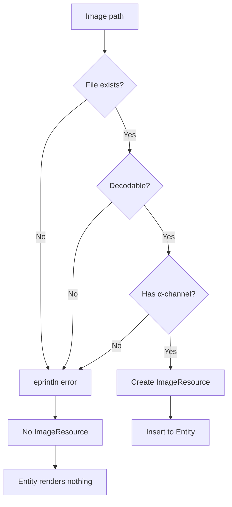

# Technical Design Document: wintf-P0-image-widget

## 1. Overview

### 1.1 Purpose
wintf ECSフレームワークに静止画像表示機能を追加し、非同期ファイル読み込み、WIC/D2D統合、αチャネル透過をサポートする。

### 1.2 Scope
- **In Scope**: 静止画像（PNG, JPEG, BMP, GIF）の非同期読み込み、αチャネル透過、ECS統合
- **Out of Scope**: アニメーション（P1）、スケーリングモード（P1）、ストレッチ/タイル（P1）

### 1.3 Requirements Traceability

| 要件ID | 要件名 | 関連コンポーネント | 関連システム |
|--------|--------|-------------------|--------------|
| R1 | 非同期読み込み | WintfTaskPool, Image | process_image_commands |
| R2 | 静止画像読み込み | ImageResource | load_image_async |
| R3 | 透過処理 | ImageResource | load_image_async (WIC変換) |
| R4 | D2D描画 | ImageGraphics | draw_images |
| R5 | ECS統合 | Image | on_image_add, on_image_remove |
| R6 | 将来拡張性 | モジュール構造 | - |

---

## 2. Architecture

### 2.1 High-Level Architecture



### 2.2 Component Diagram



### 2.3 Directory Structure

```
crates/wintf/src/
├── ecs/
│   ├── widget/
│   │   ├── mod.rs              # pub mod image 追加
│   │   └── image/
│   │       ├── mod.rs          # モジュール公開
│   │       ├── image.rs        # Image component
│   │       ├── resource.rs     # ImageResource, ImageGraphics
│   │       ├── task_pool.rs    # WintfTaskPool
│   │       └── systems.rs      # systems
│   └── mod.rs                  # widget re-export
├── com/
│   ├── wic.rs                  # 既存（変更なし）
│   └── d2d/mod.rs              # 既存（変更なし）
```

---

## 3. Technology Stack

| 技術 | バージョン | 用途 |
|------|-----------|------|
| bevy_ecs | 0.17.2 | ECSフレームワーク |
| bevy_tasks | workspace | TaskPool |
| std::sync::mpsc | stable | async-to-ECS channel |
| WIC | Windows SDK | 画像デコード |
| Direct2D | Windows SDK | GPU描画 |

---

## 4. System Flows

### 4.1 Image Loading Flow



### 4.2 Image Rendering Flow



### 4.3 Error Handling Flow



---

## 5. Components & Interfaces

### 5.1 Image Component

```rust
/// 画像表示ウィジェット
/// 
/// # Example
/// ```rust
/// commands.spawn((
///     Image::new("assets/logo.png"),
///     BoxSize::fixed(200.0, 100.0),
/// ));
/// ```
#[derive(Component, Debug, Clone)]
#[component(on_add = on_image_add, on_remove = on_image_remove)]
pub struct Image {
    /// 画像ファイルパス（相対または絶対）
    pub path: String,
}

impl Image {
    /// 新しいImageコンポーネントを作成
    pub fn new<S: Into<String>>(path: S) -> Self {
        Self { path: path.into() }
    }
}
```

### 5.2 ImageResource Component

```rust
/// CPU側画像リソース（WIC BitmapSource）
/// 
/// # Thread Safety
/// IWICBitmapSourceはthread-free marshaling対応のため
/// Send + Syncを手動実装する。
#[derive(Component)]
pub struct ImageResource {
    source: IWICBitmapSource,
}

unsafe impl Send for ImageResource {}
unsafe impl Sync for ImageResource {}

impl ImageResource {
    /// WIC BitmapSourceから作成
    pub fn new(source: IWICBitmapSource) -> Self {
        Self { source }
    }
    
    /// BitmapSourceへの参照を取得
    pub fn source(&self) -> &IWICBitmapSource {
        &self.source
    }
}
```

### 5.3 ImageGraphics Component

```rust
/// GPU側画像リソース（D2D Bitmap）
#[derive(Component)]
pub struct ImageGraphics {
    bitmap: Option<ID2D1Bitmap1>,
    /// Device Lost検出用generation
    generation: u64,
}

unsafe impl Send for ImageGraphics {}
unsafe impl Sync for ImageGraphics {}

impl ImageGraphics {
    /// 空のImageGraphicsを作成
    pub fn new() -> Self {
        Self {
            bitmap: None,
            generation: 0,
        }
    }
    
    /// Bitmapへの参照を取得
    pub fn bitmap(&self) -> Option<&ID2D1Bitmap1> {
        self.bitmap.as_ref()
    }
    
    /// Bitmapを設定
    pub fn set_bitmap(&mut self, bitmap: ID2D1Bitmap1, generation: u64) {
        self.bitmap = Some(bitmap);
        self.generation = generation;
    }
    
    /// 再作成が必要か判定
    pub fn needs_recreate(&self, current_generation: u64) -> bool {
        self.bitmap.is_none() || self.generation != current_generation
    }
}
```

### 5.4 WintfTaskPool Resource

```rust
/// 非同期タスク実行用リソース
/// 
/// # Design
/// - TaskPoolでバックグラウンド実行
/// - mpsc channelでECS Commandへ変換
/// - Input scheduleでdrain
#[derive(Resource)]
pub struct WintfTaskPool {
    pool: TaskPool,
    sender: mpsc::Sender<ImageCommand>,
    receiver: mpsc::Receiver<ImageCommand>,
}

impl WintfTaskPool {
    /// 新しいWintfTaskPoolを作成
    pub fn new() -> Self {
        let pool = TaskPool::new();
        let (sender, receiver) = mpsc::channel();
        Self { pool, sender, receiver }
    }
    
    /// Senderのクローンを取得
    pub fn sender(&self) -> mpsc::Sender<ImageCommand> {
        self.sender.clone()
    }
    
    /// 受信したコマンドをすべて取得
    pub fn drain(&self) -> Vec<ImageCommand> {
        self.receiver.try_iter().collect()
    }
    
    /// 非同期タスクを生成
    pub fn spawn<F>(&self, future: F)
    where
        F: Future<Output = ()> + Send + 'static,
    {
        self.pool.spawn(future).detach();
    }
}
```

### 5.5 ImageCommand

```rust
/// 非同期完了後のECSコマンド
pub enum ImageCommand {
    /// 画像読み込み成功
    Loaded {
        entity: Entity,
        source: IWICBitmapSource,
    },
    /// 画像読み込み失敗
    Failed {
        entity: Entity,
        error: String,
    },
}
```

---

## 6. Data Models

### 6.1 State Machine

```mermaid
stateDiagram-v2
    [*] --> Spawned: spawn(Image)
    Spawned --> Loading: on_add (async task)
    Loading --> Loaded: ImageCommand::Loaded
    Loading --> Failed: ImageCommand::Failed
    Loaded --> Drawing: ImageGraphics created
    Drawing --> [*]: entity despawn
    Failed --> [*]: entity despawn
    
    note right of Loading: Background thread
    note right of Drawing: Has ImageResource + ImageGraphics
```

### 6.2 Entity Component Mapping

| 状態 | Image | Visual | ImageResource | ImageGraphics | GraphicsCommandList |
|------|-------|--------|---------------|---------------|---------------------|
| Spawned | ✓ | - | - | - | - |
| Loading | ✓ | ✓ | - | - | - |
| Loaded | ✓ | ✓ | ✓ | - | - |
| Drawing | ✓ | ✓ | ✓ | ✓ | ✓ |
| Failed | ✓ | ✓ | - | - | - |

---

## 7. Error Handling

### 7.1 Error Categories

| カテゴリ | 例 | 対応 |
|----------|---|------|
| ファイルエラー | 不存在、権限なし | eprintln + ImageResource未生成 |
| フォーマットエラー | 非対応形式、破損 | eprintln + ImageResource未生成 |
| αチャネルエラー | 32bppPBGRA変換失敗 | eprintln + ImageResource未生成 |
| GPUエラー | Device Lost | generation比較で再生成 |

### 7.2 Error Messages

```rust
// ファイル不存在
eprintln!("[Image] Failed to load '{}': file not found", path);

// デコード失敗
eprintln!("[Image] Failed to decode '{}': {:?}", path, error);

// αチャネル変換失敗
eprintln!("[Image] Failed to convert '{}' to PBGRA32: {:?}", path, error);

// D2D bitmap作成失敗
eprintln!("[draw_images] Failed to create D2D bitmap for Entity={}: {:?}", entity, error);
```

---

## 8. Testing Strategy

### 8.1 Unit Tests

| テスト | 対象 | 検証内容 |
|--------|------|----------|
| `test_image_component_creation` | Image | path保持確認 |
| `test_image_resource_send_sync` | ImageResource | Send/Sync trait確認 |
| `test_wintf_task_pool_drain` | WintfTaskPool | channelドレイン動作 |

### 8.2 Integration Tests

| テスト | 対象 | 検証内容 |
|--------|------|----------|
| `test_image_on_add_visual_insertion` | on_image_add | Visual自動挿入 |
| `test_image_loading_success` | load_image_async | 正常読み込み |
| `test_image_loading_error` | load_image_async | エラー時の状態 |
| `test_draw_images_with_arrangement` | draw_images | レイアウト統合 |

### 8.3 Test Resources

```
crates/wintf/tests/assets/
├── test_rgba.png      # αチャネルあり
├── test_rgb.png       # αチャネルなし（変換テスト）
├── test_jpeg.jpg      # JPEG形式
└── invalid.bin        # 不正フォーマット
```

---

## 9. Implementation Notes

### 9.1 WIC Format Conversion

```rust
// GUID_WICPixelFormat32bppPBGRA への変換（αチャネル必須）
let converter = wic_factory.create_format_converter()?;
converter.init(
    &frame,
    &GUID_WICPixelFormat32bppPBGRA,
    WICBitmapDitherTypeNone,
    None,
    0.0,
    WICBitmapPaletteTypeMedianCut,
)?;
```

### 9.2 Schedule Integration

```rust
// Input schedule での process_image_commands 登録
app.add_systems(Input, process_image_commands);

// PostLayout schedule での draw_images 登録
app.add_systems(PostLayout, draw_images.after(calculate_arrangement));
```

### 9.3 on_add Hook Pattern

```rust
fn on_image_add(mut world: DeferredWorld, hook: HookContext) {
    // Visual自動挿入（Rectangle/Labelパターン踏襲）
    if world.get::<Visual>(hook.entity).is_some() {
        return;
    }
    world.commands().entity(hook.entity).insert(Visual::default());
    
    // 非同期読み込みタスク起動
    if let Some(task_pool) = world.get_resource::<WintfTaskPool>() {
        let path = world.get::<Image>(hook.entity).unwrap().path.clone();
        let entity = hook.entity;
        let sender = task_pool.sender();
        
        task_pool.spawn(async move {
            match load_image_async(&path).await {
                Ok(source) => {
                    let _ = sender.send(ImageCommand::Loaded { entity, source });
                }
                Err(e) => {
                    eprintln!("[Image] Failed to load '{}': {:?}", path, e);
                    let _ = sender.send(ImageCommand::Failed { 
                        entity, 
                        error: e.to_string() 
                    });
                }
            }
        });
    }
}
```

---

## 10. Dependencies

### 10.1 New Dependencies
なし（既存依存のみ使用）

### 10.2 Existing Dependencies Used
- `bevy_tasks`: TaskPool
- `windows::Win32::Graphics::Imaging`: WIC API
- `windows::Win32::Graphics::Direct2D`: D2D API

---

## 11. Future Considerations (P1)

- **wintf-P1-image-rendering**: スケーリングモード、ストレッチ、タイル、補間モード
- **アニメーション**: GIF/APNG対応（別Spec予定）
- **ストリーミング**: 大容量画像の段階読み込み
