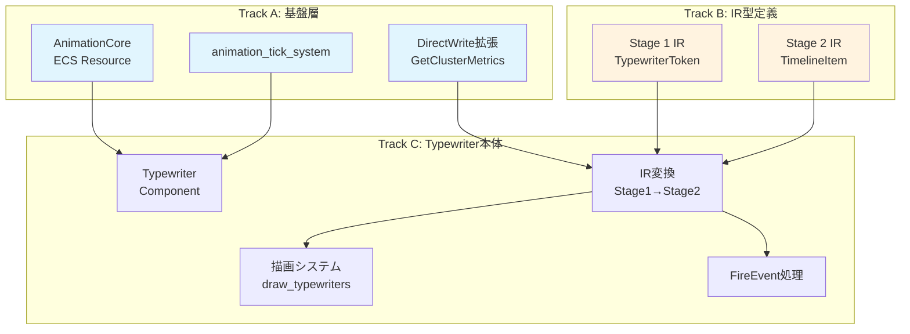
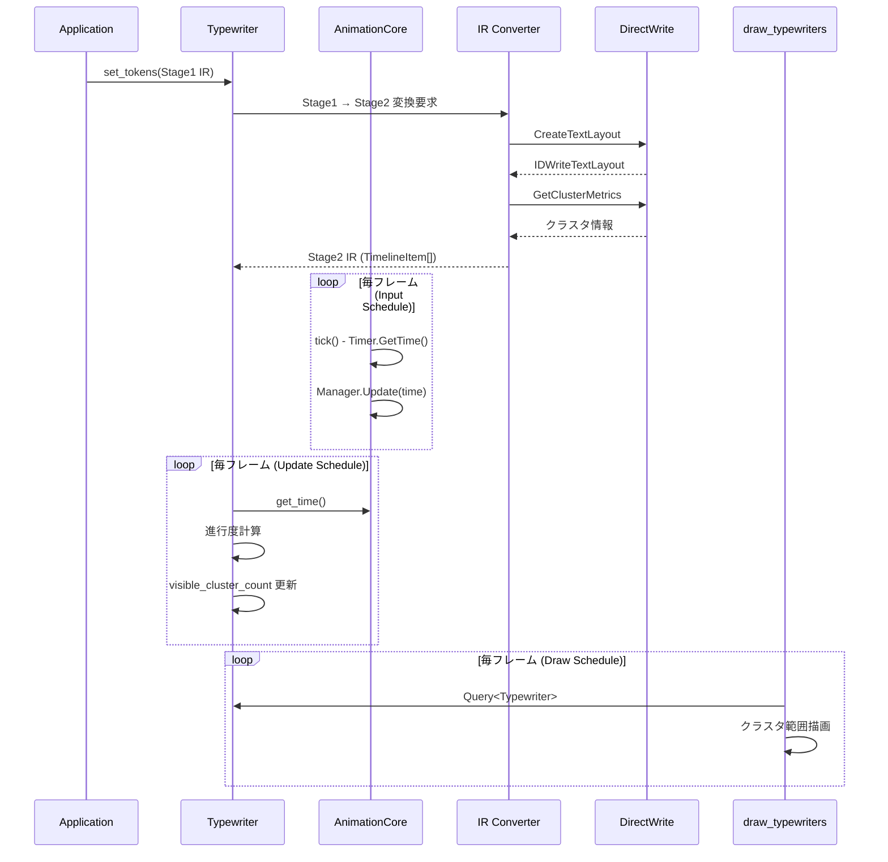
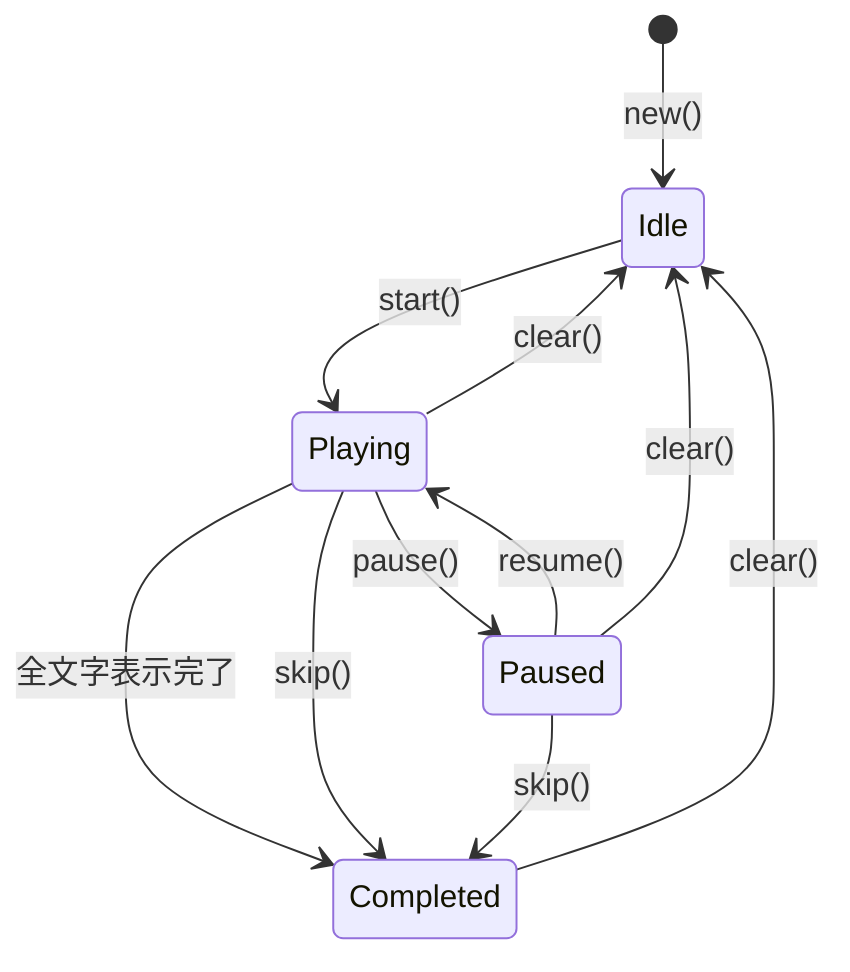
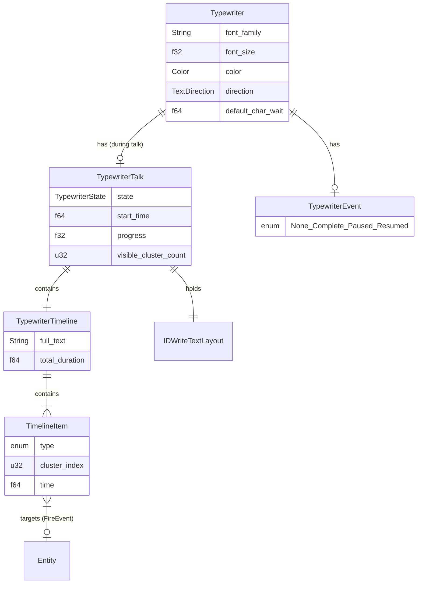

# Design Document: wintf-P0-typewriter

| 項目 | 内容 |
|------|------|
| **Version** | 1.0 |
| **Date** | 2025-12-03 |
| **Status** | Generated |
| **Requirements** | v1.0 Approved |

---

## Overview

**Purpose**: 本機能は wintf フレームワークにタイプライター表示機能を提供し、デスクトップマスコットアプリケーションにおけるキャラクター発話の臨場感を実現する。

**Users**: デスクトップマスコットアプリ開発者が、テキストを一文字ずつ表示するUI演出に使用する。

**Impact**: 既存 `Label` ウィジェットと並行して動作する新規ウィジェット。`AnimationCore` リソースを追加し、アニメーション基盤を確立する。

### Goals

- タイプライター効果によるテキストの一文字ずつ表示
- Windows Animation API ベースの高精度タイミング制御
- 2段階IR設計による柔軟なテキスト/ウェイト/イベント制御
- 既存 Label 互換のスタイル設定

### Non-Goals

- 高度なアニメーション機能（→ `wintf-P0-animation-system` で拡張）
- テキストのフェードイン/アウト効果
- 音声同期

---

## Architecture

### Existing Architecture Analysis

既存アーキテクチャのパターンと制約：

| 層 | 既存パターン | 本設計での活用 |
|----|-------------|---------------|
| COM層 | `animation.rs` - Windows Animation API ラッパー | 拡張（Timer追加） |
| COM層 | `dwrite.rs` - DirectWrite ラッパー | 拡張（Cluster API追加） |
| ECS層 | `Label` + `TextLayoutResource` | 参照パターン |
| ECS層 | `WicCore` - CPU リソースの EcsWorld 初期化 | AnimationCore で踏襲 |
| 描画層 | `draw_labels` システム | 類似パターンで Typewriter 描画 |

### Architecture Pattern & Boundary Map



**Architecture Integration**:
- **選択パターン**: ECS Resource + Component + System（既存 wintf パターン踏襲）
- **境界分離**: Track A/B は並行実装可能、Track C は依存
- **既存パターン維持**: `WicCore` 類似の CPU リソース初期化、`Label` 類似の描画システム
- **ステアリング準拠**: COM→ECS→描画の依存方向を厳守

### Technology Stack

| Layer | Choice / Version | Role in Feature | Notes |
|-------|------------------|-----------------|-------|
| Animation | Windows Animation API (`IUIAnimationTimer`, `IUIAnimationManager2`) | 時刻管理・タイミング制御 | CPUリソース |
| Text | DirectWrite (`IDWriteTextLayout`, `GetClusterMetrics`) | グリフ単位分解 | 既存拡張 |
| ECS | bevy_ecs 0.17.2 | コンポーネント・システム | 既存 |
| Graphics | Direct2D / DirectComposition | 描画・合成 | 既存 |

---

## System Flows

### Typewriter 表示フロー



### 状態遷移



---

## Requirements Traceability

| Requirement | Summary | Components | Interfaces | Flows |
|-------------|---------|------------|------------|-------|
| 1.1-1.5 | 文字単位表示 | Typewriter, TimelineItem | Stage2 IR | 表示フロー |
| 2.1-2.5 | ウェイト制御 | Typewriter, TypewriterToken | Stage1 IR | 時刻計算 |
| 3.1-3.8 | 2段階IR設計 | TypewriterToken, TimelineItem, IR Converter | Stage1/2 IR | 変換フロー |
| 4.1-4.6 | 表示制御 | Typewriter, TypewriterState | 操作API | 状態遷移 |
| 5.1-5.6 | IR駆動イベント | FireEvent, TypewriterProgress | Commands | イベント発火 |
| 6.1-6.5 | Label互換性 | Typewriter | TextStyle trait | - |
| 7.1-7.5 | ECS統合 | AnimationCore, animation_tick_system | Res<AnimationCore> | tick フロー |

---

## Components and Interfaces

| Component | Domain/Layer | Intent | Req Coverage | Key Dependencies | Storage | Contracts |
|-----------|--------------|--------|--------------|------------------|---------|-----------|
| AnimationCore | ECS/Resource | Windows Animation API 統合 | 7.1-7.5 | (なし) | - | Service |
| TypewriterToken | IR/Type | Stage 1 IR 外部インターフェース | 3.1-3.4 | (なし) | - | State |
| TypewriterEvent | ECS/Component | イベント通知 (set pattern) | 5.1-5.5 | (なし) | SparseSet | State |
| TimelineItem | IR/Type | Stage 2 IR 内部タイムライン | 3.5-3.8 | IDWriteTextLayout | - | State |
| Typewriter | ECS/Component | ウィジェット論理状態（スタイル等） | 6.1-6.5 | (なし) | SparseSet | State |
| TypewriterTalk | ECS/Component | 1回のトーク（再生中のみ、終了で解放） | 1.1-1.5, 2.1-2.5, 3.5-3.8, 4.1-4.6, 5.6 | AnimationCore, IDWriteTextLayout | SparseSet | State |
| draw_typewriters | ECS/System | Typewriter 描画 | 1.1-1.5, 6.3 | GraphicsCore, TypewriterTalk | - | - |
| animation_tick_system | ECS/System | AnimationCore 時刻更新 | 7.2-7.3 | AnimationCore | - | - |
| DWriteTextLayoutExt | COM/Trait | DirectWrite クラスタ API | 1.3, 3.5-3.8 | IDWriteTextLayout | - | Service |

### Track A: 基盤層

#### AnimationCore

| Field | Detail |
|-------|--------|
| Intent | Windows Animation API を ECS リソースとして統合 |
| Requirements | 7.1, 7.2, 7.3, 7.4, 7.5 |
| Owner | wintf/ecs |

**Responsibilities & Constraints**
- `IUIAnimationTimer`, `IUIAnimationManager2`, `IUIAnimationTransitionLibrary2` を保持
- `EcsWorld::new()` で初期化（CPU リソースのため即座に可能）
- Device Lost の影響を受けない（`WicCore` と同様）

**Dependencies**
- Inbound: 各アニメーション使用コンポーネント — 時刻取得 (P0)
- External: Windows Animation API — COM (P0)

**Contracts**: Service [x] / State [x]

##### Service Interface

```rust
/// AnimationCore - Windows Animation API 統合リソース
#[derive(Resource)]
pub struct AnimationCore {
    timer: IUIAnimationTimer,
    manager: IUIAnimationManager2,
    transition_library: IUIAnimationTransitionLibrary2,
}

impl AnimationCore {
    /// リソース作成
    pub fn new() -> windows::core::Result<Self>;
    
    /// 現在時刻取得 (f64秒)
    pub fn get_time(&self) -> windows::core::Result<f64>;
    
    /// タイマー更新（毎フレーム呼び出し）
    pub fn tick(&self) -> windows::core::Result<f64>;
    
    /// マネージャー参照
    pub fn manager(&self) -> &IUIAnimationManager2;
    
    /// トランジションライブラリ参照
    pub fn transition_library(&self) -> &IUIAnimationTransitionLibrary2;
}
```

- Preconditions: COM 初期化済み
- Postconditions: 時刻が進行、マネージャー状態更新
- Invariants: Timer/Manager/Library は常に有効

##### State Management

- State model: シングルトンリソース
- Persistence: なし（揮発性）
- Concurrency: `Send + Sync`（COM thread-free marshaling）

**Implementation Notes**
- `WicCore` パターンを踏襲
- `animation_tick_system` を Input スケジュール先頭で実行

---

#### DWriteTextLayoutExt

| Field | Detail |
|-------|--------|
| Intent | DirectWrite TextLayout のクラスタ取得 API 拡張 |
| Requirements | 1.3, 3.5, 3.6, 3.8 |
| Owner | wintf/com/dwrite |

**Responsibilities & Constraints**
- `IDWriteTextLayout` のクラスタメトリクス取得
- 縦書き/横書き両対応の位置情報取得

**Dependencies**
- External: DirectWrite API — COM (P0)

**Contracts**: Service [x]

##### Service Interface

```rust
pub trait DWriteTextLayoutExt {
    /// クラスタメトリクス取得
    fn get_cluster_metrics(&self) -> windows::core::Result<Vec<DWRITE_CLUSTER_METRICS>>;
    
    /// クラスタ数取得
    fn get_cluster_count(&self) -> windows::core::Result<u32>;
    
    /// テキスト位置からヒットテスト（描画位置取得用）
    fn hit_test_text_position(
        &self, 
        text_position: u32, 
        is_trailing_hit: bool
    ) -> windows::core::Result<HitTestResult>;
}

pub struct HitTestResult {
    pub point_x: f32,
    pub point_y: f32,
    pub metrics: DWRITE_HIT_TEST_METRICS,
}
```

---

#### animation_tick_system

| Field | Detail |
|-------|--------|
| Intent | AnimationCore の時刻を毎フレーム更新 |
| Requirements | 7.2, 7.3 |
| Owner | wintf/ecs |

**Implementation Notes**

```rust
/// アニメーションタイマー更新システム
/// Input スケジュール先頭で実行
pub fn animation_tick_system(animation_core: Option<Res<AnimationCore>>) {
    if let Some(core) = animation_core {
        if let Err(e) = core.tick() {
            warn!("Animation tick failed: {:?}", e);
        }
    }
}
```

---

### Track B: IR型定義

#### TypewriterToken (Stage 1 IR)

| Field | Detail |
|-------|--------|
| Intent | 外部インターフェース用の中間表現 |
| Requirements | 3.1, 3.2, 3.3, 3.4 |
| Owner | wintf/ecs/widget/text |

**Contracts**: State [x]

##### State Management

```rust
/// Stage 1 IR - 外部インターフェース
/// areka-P0-script-engine と共有
#[derive(Debug, Clone)]
pub enum TypewriterToken {
    /// 表示するテキスト
    Text(String),
    /// ウェイト（f64秒単位）
    Wait(f64),
    /// イベント発火（対象 Entity の TypewriterEvent を設定）
    FireEvent {
        target: Entity,
        event: TypewriterEvent,
    },
}

/// イベント通知用 enum Component
/// Changed<TypewriterEvent> で検出、処理後に None へ戻す（set パターン）
/// メモリ戦略: SparseSet（動的変更）
#[derive(Component, Debug, Clone, Default, PartialEq)]
#[component(storage = "SparseSet")]
pub enum TypewriterEvent {
    #[default]
    None,
    /// 表示完了
    Complete,
    /// 一時停止
    Paused,
    /// 再開
    Resumed,
}
```

---

#### TimelineItem (Stage 2 IR)

| Field | Detail |
|-------|--------|
| Intent | 内部タイムライン用の中間表現（グリフ単位） |
| Requirements | 3.5, 3.6, 3.7, 3.8 |
| Owner | wintf/ecs/widget/text |

**Contracts**: State [x]

##### State Management

```rust
/// Stage 2 IR - 内部タイムライン
#[derive(Debug)]
pub enum TimelineItem {
    /// グリフ表示（クラスタインデックス）
    Glyph {
        cluster_index: u32,
        /// デフォルトウェイト後の累積時刻
        show_at: f64,
    },
    /// ウェイト
    Wait {
        duration: f64,
        /// ウェイト開始時刻
        start_at: f64,
    },
    /// イベント発火（対象 Entity の TypewriterEvent を設定）
    FireEvent {
        target: Entity,
        event: TypewriterEvent,
        /// 発火時刻
        fire_at: f64,
    },
}

/// Typewriter タイムライン全体
pub struct TypewriterTimeline {
    /// 全文テキスト
    pub full_text: String,
    /// タイムライン項目
    pub items: Vec<TimelineItem>,
    /// 総再生時間
    pub total_duration: f64,
}
```

---

### Track C: Typewriter本体

#### Typewriter

| Field | Detail |
|-------|--------|
| Intent | ウィジェット論理状態（スタイル、デフォルト設定） |
| Requirements | 6.1-6.5 |
| Owner | wintf/ecs/widget/text |

**Responsibilities & Constraints**
- Label 互換スタイル設定（font, color, direction）
- デフォルトウェイト設定
- Entity 生存中は永続

**Dependencies**
- Inbound: Application — スタイル設定 (P0)

**Contracts**: State [x]

##### State Management

```rust
/// ウィジェット論理コンポーネント（永続）
/// メモリ戦略: SparseSet（動的追加/削除）
#[derive(Component)]
#[component(storage = "SparseSet", on_add = on_typewriter_add, on_remove = on_typewriter_remove)]
pub struct Typewriter {
    // === スタイル設定（Label互換） ===
    pub font_family: String,
    pub font_size: f32,
    pub color: D2D1_COLOR_F,
    pub direction: TextDirection,
    
    // === デフォルト設定 ===
    /// デフォルト文字間ウェイト（秒）
    pub default_char_wait: f64,
}
```

---

#### TypewriterTalk

| Field | Detail |
|-------|--------|
| Intent | 1回のトーク（再生中のみ存在、終了で解放） |
| Requirements | 1.1-1.5, 2.1-2.5, 3.5-3.8, 4.1-4.6, 5.6 |
| Owner | wintf/ecs/widget/text |

**Responsibilities & Constraints**
- Stage 2 IR（TextLayout + Timeline）を保持
- 再生状態管理（Playing/Paused/Completed）
- 表示クラスタ数・進行度の計算
- トーク完了時に remove される（リソース解放）

**Dependencies**
- Inbound: Application — Stage 1 IR 設定 (P0)
- Outbound: AnimationCore — 時刻取得 (P0)
- Outbound: DirectWrite — TextLayout 作成 (P0)

**Contracts**: State [x]

##### State Management

```rust
/// 再生状態
#[derive(Debug, Clone, Copy, PartialEq, Default)]
pub enum TypewriterState {
    #[default]
    Playing,
    Paused,
    Completed,
}

/// 1回のトーク（再生中のみ存在）
/// トーク完了・クリア時に remove される
/// メモリ戦略: SparseSet（動的追加/削除）
#[derive(Component)]
#[component(storage = "SparseSet", on_remove = on_typewriter_talk_remove)]
pub struct TypewriterTalk {
    // === リソース ===
    /// TextLayout（このトーク用、描画に使用）
    text_layout: IDWriteTextLayout,
    /// Stage 2 IR タイムライン
    timeline: TypewriterTimeline,
    
    // === 再生状態 ===
    state: TypewriterState,
    /// 再生開始時刻
    start_time: f64,
    /// 一時停止時の経過時間
    paused_elapsed: f64,
    /// 現在の表示クラスタ数
    visible_cluster_count: u32,
    /// 進行度（0.0〜1.0）
    progress: f32,
}

impl TypewriterTalk {
    // === 生成 ===
    pub fn new(
        tokens: Vec<TypewriterToken>,
        typewriter: &Typewriter,
        graphics_core: &GraphicsCore,
        current_time: f64,
    ) -> windows::core::Result<Self>;
    
    // === 操作 API ===
    pub fn pause(&mut self, current_time: f64);
    pub fn resume(&mut self, current_time: f64);
    pub fn skip(&mut self);
    
    // === 状態取得 ===
    pub fn state(&self) -> TypewriterState;
    pub fn progress(&self) -> f32;
    pub fn visible_cluster_count(&self) -> u32;
    pub fn is_completed(&self) -> bool;
    pub fn text_layout(&self) -> &IDWriteTextLayout;
}

fn on_typewriter_talk_remove(hook: DeferredHook) {
    trace!(entity = ?hook.entity, "[TypewriterTalk] Removed - resources released");
}
```

---

#### draw_typewriters

| Field | Detail |
|-------|--------|
| Intent | Typewriter の描画 |
| Requirements | 1.1, 1.2, 6.3 |
| Owner | wintf/ecs/widget/text |

**Implementation Notes**

```rust
/// Typewriter 描画システム
/// Draw スケジュールで実行
pub fn draw_typewriters(
    graphics_core: Option<Res<GraphicsCore>>,
    query: Query<(
        Entity,
        &Typewriter,
        &TypewriterTalk,
        &mut GraphicsCommandList,
    ), Changed<TypewriterTalk>>,
) {
    // 1. GraphicsCore から DeviceContext 取得
    // 2. TypewriterTalk.text_layout() から TextLayout 取得
    // 3. visible_cluster_count までのグリフを描画
    // 4. GraphicsCommandList に記録
}
```

---

## Data Models

### Domain Model



---

## Error Handling

### Error Strategy

| エラー種別 | 対応 |
|-----------|------|
| COM 初期化失敗 | AnimationCore 作成失敗 → ログ出力、リソース未登録 |
| TextLayout 作成失敗 | set_tokens 失敗 → エラーログ、状態変更なし |
| Timer.GetTime 失敗 | tick 失敗 → 警告ログ、前回時刻維持 |
| クラスタメトリクス取得失敗 | Stage 2 IR 変換失敗 → エラーログ |

### Error Categories and Responses

- **System Errors**: COM 関連エラーは `windows::core::Result` で処理、ログ出力して graceful degradation
- **User Errors**: 無効なトークン列は検証時にスキップ

---

## Testing Strategy

### Unit Tests

1. `AnimationCore::new()` - COM リソース作成成功
2. `AnimationCore::tick()` - 時刻取得・更新
3. `DWriteTextLayoutExt::get_cluster_metrics()` - クラスタメトリクス取得
4. `TypewriterToken` → `TimelineItem` 変換
5. `Typewriter` 状態遷移（start/pause/resume/skip/clear）

### Integration Tests

1. AnimationCore + Typewriter 連携（時刻進行による表示更新）
2. Stage 1 IR → Stage 2 IR → 描画フロー
3. FireEvent トークンによるコンポーネント注入
4. 縦書き/横書き描画確認

### E2E Tests

1. サンプルアプリでのタイプライター表示動作確認
2. ウェイト制御の視覚的確認
3. skip 操作の動作確認

---

## Optional Sections

### Performance & Scalability

- **描画最適化**: `Changed<Typewriter>` でのクエリフィルタリング
- **TextLayout キャッシュ**: Stage 2 IR 変換時に作成、再利用
- **差分描画**: visible_cluster_count 変更時のみ CommandList 更新

---

## Supporting References

### 並行実装トラック

要件定義で定義された並行実装可能なトラック構成：

```
Track A: 基盤層（依存なし）  ─┬─ 並行可能
Track B: IR型定義（依存なし）─┘
         ↓
Track C: Typewriter本体（A, B 完了後）
```

詳細は `requirements.md` の「実装トラック（並行可能）」セクションを参照。

### 関連ドキュメント

- 要件定義: `.kiro/specs/wintf-P0-typewriter/requirements.md`
- ギャップ分析: `.kiro/specs/wintf-P0-typewriter/gap-analysis.md`
- 既存 Label 実装: `crates/wintf/src/ecs/widget/text/label.rs`
- 既存 Animation ラッパー: `crates/wintf/src/com/animation.rs`

---

_Document generated by AI-DLC System on 2025-12-03_
