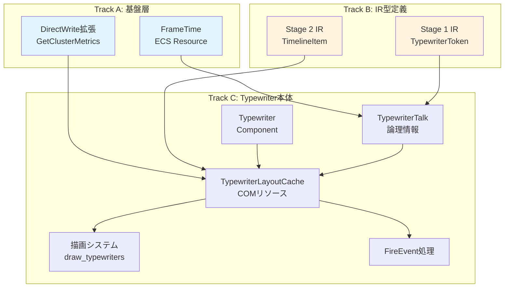
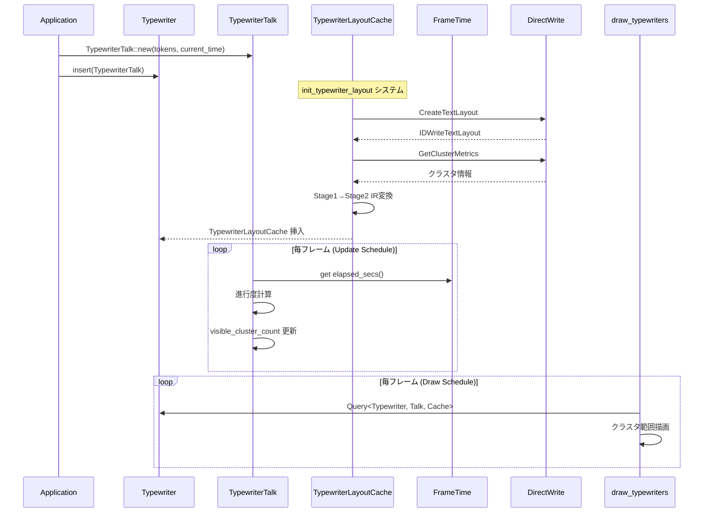
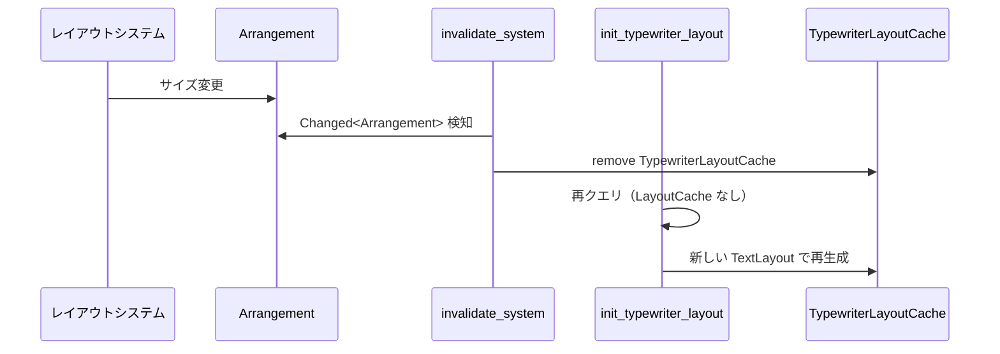
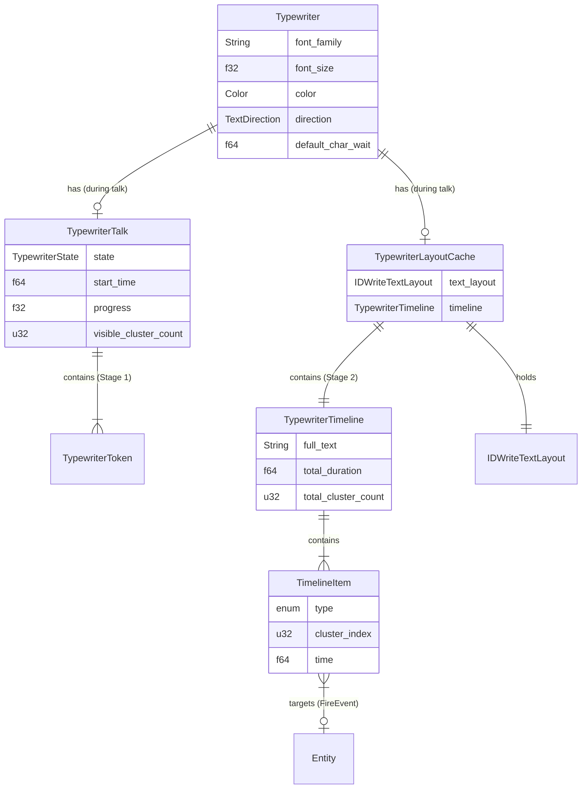

# Design Document: wintf-P0-typewriter

| 項目 | 内容 |
|------|------|
| **Version** | 1.1 |
| **Date** | 2025-12-03 |
| **Status** | ✅ Implemented |
| **Requirements** | v1.1 Implemented |

---

## Overview

**Purpose**: 本機能は wintf フレームワークにタイプライター表示機能を提供し、デスクトップマスコットアプリケーションにおけるキャラクター発話の臨場感を実現する。

**Users**: デスクトップマスコットアプリ開発者が、テキストを一文字ずつ表示するUI演出に使用する。

**Impact**: 既存 `Label` ウィジェットと並行して動作する新規ウィジェット。`FrameTime` リソースで高精度時刻管理を行う。

### Goals

- タイプライター効果によるテキストの一文字ずつ表示
- FrameTime ベースの高精度タイミング制御
- 2段階IR設計による柔軟なテキスト/ウェイト/イベント制御
- 既存 Label 互換のスタイル設定
- Arrangement 変更時のレイアウト追従

### Non-Goals

- 高度なアニメーション機能（→ `wintf-P0-animation-system` で拡張）
- テキストのフェードイン/アウト効果
- 音声同期

### Design Changes from Initial Spec

**時刻管理: AnimationCore → FrameTime**
- 当初設計: Windows Animation API (`IUIAnimationTimer`, `IUIAnimationManager2`)
- 変更理由: STA (Single-Threaded Apartment) 要件により ECS マルチスレッドスケジューラと競合
- 採用設計: `GetSystemTimePreciseAsFileTime` ベースの `FrameTime` リソース

**コンポーネント分離: TypewriterTalk + TypewriterLayoutCache**
- 当初設計: TypewriterTalk が論理情報と COM リソース（TextLayout）を両方保持
- 採用設計: 関心の分離
  - `TypewriterTalk`: 論理情報のみ（トークン列、再生状態、進行度）
  - `TypewriterLayoutCache`: COM リソース（TextLayout、Stage 2 IR タイムライン）
- メリット: デモコードの簡素化、Arrangement 変更時の LayoutCache 再生成

---

## Architecture

### Existing Architecture Analysis

既存アーキテクチャのパターンと制約：

| 層 | 既存パターン | 本設計での活用 |
|----|-------------|---------------|
| COM層 | `dwrite.rs` - DirectWrite ラッパー | 拡張（Cluster API追加） |
| ECS層 | `Label` + `TextLayoutResource` | 参照パターン |
| ECS層 | `FrameTime` - 高精度時刻管理 | 直接使用 |
| 描画層 | `draw_labels` システム | 類似パターンで Typewriter 描画 |

### Architecture Pattern & Boundary Map



**Architecture Integration**:
- **選択パターン**: ECS Resource + Component + System（既存 wintf パターン踏襲）
- **境界分離**: Track A/B は並行実装可能、Track C は依存
- **既存パターン維持**: `Label` 類似の描画システム
- **ステアリング準拠**: COM→ECS→描画の依存方向を厳守

### Technology Stack

| Layer | Choice / Version | Role in Feature | Notes |
|-------|------------------|-----------------|-------|
| Time | GetSystemTimePreciseAsFileTime | 高精度時刻管理 | 100ns精度 |
| Text | DirectWrite (`IDWriteTextLayout`, `GetClusterMetrics`) | グリフ単位分解 | 既存拡張 |
| ECS | bevy_ecs 0.17.2 | コンポーネント・システム | 既存 |
| Graphics | Direct2D / DirectComposition | 描画・合成 | 既存 |

---

## System Flows

### Typewriter 表示フロー



### 状態遷移

```mermaid
stateDiagram-v2
    [*] --> Playing: TypewriterTalk::new()
    Playing --> Paused: pause()
    Paused --> Playing: resume()
    Playing --> Completed: 全文字表示完了
    Playing --> Completed: skip()
    Paused --> Completed: skip()
    Completed --> [*]: remove TypewriterTalk
```

### Arrangement 変更時のレイアウト追従



---

## Requirements Traceability

| Requirement | Summary | Components | Interfaces | Flows |
|-------------|---------|------------|------------|-------|
| 1.1-1.5 | 文字単位表示 | TypewriterTalk, TimelineItem | Stage2 IR | 表示フロー |
| 2.1-2.5 | ウェイト制御 | TypewriterTalk, TypewriterToken | Stage1 IR | 時刻計算 |
| 3.1-3.8 | 2段階IR設計 | TypewriterToken, TimelineItem, LayoutCache | Stage1/2 IR | 変換フロー |
| 4.1-4.6 | 表示制御 | TypewriterTalk, TypewriterState | 操作API | 状態遷移 |
| 5.1-5.6 | IR駆動イベント | FireEvent, TypewriterEvent | Commands | イベント発火 |
| 6.1-6.5 | Label互換性 | Typewriter, Arrangement | TextStyle | レイアウト追従 |
| 7.1-7.5 | ECS統合 | FrameTime, Systems | Res<FrameTime> | tick フロー |

---

## Components and Interfaces

| Component | Domain/Layer | Intent | Req Coverage | Key Dependencies | Storage | Contracts |
|-----------|--------------|--------|--------------|------------------|---------|-----------|
| FrameTime | ECS/Resource | 高精度時刻管理 | 7.1-7.5 | (なし) | - | Service |
| TypewriterToken | IR/Type | Stage 1 IR 外部インターフェース | 3.1-3.4 | (なし) | - | State |
| TypewriterEvent | ECS/Component | イベント通知 | 5.1-5.5 | (なし) | SparseSet | State |
| TimelineItem | IR/Type | Stage 2 IR 内部タイムライン | 3.5-3.8 | IDWriteTextLayout | - | State |
| Typewriter | ECS/Component | ウィジェット論理状態（スタイル等） | 6.1-6.5 | (なし) | SparseSet | State |
| TypewriterTalk | ECS/Component | トーク論理情報（再生状態） | 1.1-1.5, 2.1-2.5, 4.1-4.6, 5.6 | FrameTime | SparseSet | State |
| TypewriterLayoutCache | ECS/Component | 描画リソース（TextLayout, Timeline） | 3.5-3.8, 6.3-6.4 | GraphicsCore, IDWriteTextLayout | SparseSet | State |
| init_typewriter_layout | ECS/System | LayoutCache 自動生成 | 3.5-3.8 | GraphicsCore, Arrangement | - | - |
| invalidate_typewriter_layout | ECS/System | Arrangement変更時LayoutCache無効化 | 6.4 | Arrangement | - | - |
| update_typewriters | ECS/System | 再生状態更新 | 1.1-1.5, 5.2-5.4 | FrameTime | - | - |
| draw_typewriters | ECS/System | Typewriter 描画 | 1.1-1.5, 6.3 | GraphicsCore, TypewriterLayoutCache | - | - |
| DWriteTextLayoutExt | COM/Trait | DirectWrite クラスタ API | 1.3, 3.5-3.8 | IDWriteTextLayout | - | Service |

### Track A: 基盤層

#### FrameTime（既存リソース）

| Field | Detail |
|-------|--------|
| Intent | 高精度時刻管理 ECS リソース |
| Requirements | 7.1, 7.2, 7.3, 7.4, 7.5 |
| Owner | wintf/ecs/graphics |

**Responsibilities & Constraints**
- `GetSystemTimePreciseAsFileTime` で 100ns 精度の時刻取得
- f64秒単位での経過時間管理
- ワールド tick 時に自動更新

**Contracts**: Service [x]

##### Service Interface

```rust
/// FrameTime - 高精度時刻管理リソース
#[derive(Resource)]
pub struct FrameTime { /* ... */ }

impl FrameTime {
    /// 経過時間取得（f64秒）
    pub fn elapsed_secs(&self) -> f64;
    
    /// 時刻更新（内部使用）
    pub fn update(&mut self);
}
```

---

#### DWriteTextLayoutExt

| Field | Detail |
|-------|--------|
| Intent | DirectWrite TextLayout のクラスタ取得 API 拡張 |
| Requirements | 1.3, 3.5, 3.6, 3.8 |
| Owner | wintf/com/dwrite |

**Contracts**: Service [x]

##### Service Interface

```rust
pub trait DWriteTextLayoutExt {
    /// クラスタメトリクス取得
    fn get_cluster_metrics(&self) -> windows::core::Result<Vec<DWRITE_CLUSTER_METRICS>>;
}
```

---

### Track B: IR型定義

#### TypewriterToken (Stage 1 IR)

| Field | Detail |
|-------|--------|
| Intent | 外部インターフェース用の中間表現 |
| Requirements | 3.1, 3.2, 3.3, 3.4 |
| Owner | wintf/ecs/widget/text |

**Contracts**: State [x]

##### State Management

```rust
/// Stage 1 IR - 外部インターフェース
#[derive(Debug, Clone)]
pub enum TypewriterToken {
    /// 表示するテキスト
    Text(String),
    /// ウェイト（f64秒単位）
    Wait(f64),
    /// イベント発火
    FireEvent {
        target: Entity,
        event: TypewriterEventKind,
    },
}

/// イベント種別
#[derive(Debug, Clone, Copy, PartialEq, Default)]
pub enum TypewriterEventKind {
    #[default]
    None,
    Complete,
    Paused,
    Resumed,
}

/// イベント通知用 Component
#[derive(Component, Debug, Clone, Default)]
#[component(storage = "SparseSet")]
pub struct TypewriterEvent(pub TypewriterEventKind);
```

---

#### TimelineItem (Stage 2 IR)

| Field | Detail |
|-------|--------|
| Intent | 内部タイムライン用の中間表現（グリフ単位） |
| Requirements | 3.5, 3.6, 3.7, 3.8 |
| Owner | wintf/ecs/widget/text |

**Contracts**: State [x]

##### State Management

```rust
/// Stage 2 IR - 内部タイムライン
#[derive(Debug, Clone)]
pub enum TimelineItem {
    /// グリフ表示（クラスタインデックス）
    Glyph {
        cluster_index: u32,
        show_at: f64,
    },
    /// ウェイト
    Wait {
        duration: f64,
        start_at: f64,
    },
    /// イベント発火
    FireEvent {
        target: Entity,
        event: TypewriterEventKind,
        fire_at: f64,
    },
}

/// Typewriter タイムライン全体
#[derive(Debug, Clone)]
pub struct TypewriterTimeline {
    pub full_text: String,
    pub items: Vec<TimelineItem>,
    pub total_duration: f64,
    pub total_cluster_count: u32,
}
```

---

### Track C: Typewriter本体

#### Typewriter

| Field | Detail |
|-------|--------|
| Intent | ウィジェット論理状態（スタイル、デフォルト設定） |
| Requirements | 6.1-6.5 |
| Owner | wintf/ecs/widget/text |

**Contracts**: State [x]

##### State Management

```rust
/// ウィジェット論理コンポーネント（永続）
#[derive(Component)]
#[component(storage = "SparseSet", on_add = on_typewriter_add, on_remove = on_typewriter_remove)]
pub struct Typewriter {
    pub font_family: String,
    pub font_size: f32,
    pub color: D2D1_COLOR_F,
    pub direction: TextDirection,
    pub default_char_wait: f64,
}
```

---

#### TypewriterTalk

| Field | Detail |
|-------|--------|
| Intent | 1回のトーク論理情報（再生状態管理） |
| Requirements | 1.1-1.5, 2.1-2.5, 4.1-4.6, 5.6 |
| Owner | wintf/ecs/widget/text |

**Responsibilities & Constraints**
- Stage 1 IR トークン列を保持
- 再生状態管理（Playing/Paused/Completed）
- visible_cluster_count と progress の計算
- トーク完了時に remove される

**Contracts**: State [x]

##### State Management

```rust
/// 再生状態
#[derive(Debug, Clone, Copy, PartialEq, Default)]
pub enum TypewriterState {
    #[default]
    Playing,
    Paused,
    Completed,
}

/// トーク論理情報
#[derive(Component)]
#[component(storage = "SparseSet", on_remove = on_typewriter_talk_remove)]
pub struct TypewriterTalk {
    tokens: Vec<TypewriterToken>,
    state: TypewriterState,
    start_time: f64,
    paused_elapsed: f64,
    visible_cluster_count: u32,
}

impl TypewriterTalk {
    pub fn new(tokens: Vec<TypewriterToken>, current_time: f64) -> Self;
    pub fn pause(&mut self, current_time: f64);
    pub fn resume(&mut self, current_time: f64);
    pub fn skip(&mut self, total_cluster_count: u32);
    pub fn state(&self) -> TypewriterState;
    pub fn progress(&self) -> f32;
    pub fn visible_cluster_count(&self) -> u32;
    pub fn tokens(&self) -> &[TypewriterToken];
}
```

---

#### TypewriterLayoutCache

| Field | Detail |
|-------|--------|
| Intent | 描画リソース（TextLayout, Stage 2 IR） |
| Requirements | 3.5-3.8, 6.3, 6.4 |
| Owner | wintf/ecs/widget/text |

**Responsibilities & Constraints**
- TextLayout と Stage 2 IR タイムラインを保持
- init_typewriter_layout システムで自動生成
- Arrangement 変更時に無効化・再生成

**Contracts**: State [x]

##### State Management

```rust
/// 描画リソース（COM オブジェクト保持）
#[derive(Component)]
#[component(storage = "SparseSet")]
pub struct TypewriterLayoutCache {
    text_layout: IDWriteTextLayout,
    timeline: TypewriterTimeline,
}

impl TypewriterLayoutCache {
    pub fn text_layout(&self) -> &IDWriteTextLayout;
    pub fn timeline(&self) -> &TypewriterTimeline;
}
```

---

#### Systems

##### init_typewriter_layout

```rust
/// TypewriterTalk 追加時に TypewriterLayoutCache を自動生成
/// Draw スケジュールで実行
pub fn init_typewriter_layout(
    mut commands: Commands,
    query: Query<
        (Entity, &Typewriter, &TypewriterTalk, &Arrangement),
        Without<TypewriterLayoutCache>,
    >,
    graphics_core: Option<Res<GraphicsCore>>,
) {
    // 1. Typewriter から TextFormat 作成
    // 2. TypewriterTalk.tokens から全文テキスト抽出
    // 3. Arrangement.size から TextLayout 作成
    // 4. Stage 1 → Stage 2 IR 変換
    // 5. TypewriterLayoutCache を挿入
}
```

##### invalidate_typewriter_layout_on_arrangement_change

```rust
/// Arrangement 変更時に LayoutCache を無効化
/// Draw スケジュールで init_typewriter_layout より先に実行
pub fn invalidate_typewriter_layout_on_arrangement_change(
    mut commands: Commands,
    query: Query<Entity, (With<TypewriterLayoutCache>, Changed<Arrangement>)>,
) {
    // LayoutCache を remove → init_typewriter_layout で再生成
}
```

##### update_typewriters

```rust
/// 再生状態を毎フレーム更新
/// Update スケジュールで実行
pub fn update_typewriters(
    mut commands: Commands,
    frame_time: Option<Res<FrameTime>>,
    mut query: Query<(Entity, &mut TypewriterTalk, &TypewriterLayoutCache)>,
) {
    // 1. FrameTime から経過時間取得
    // 2. タイムラインを走査し visible_cluster_count 更新
    // 3. FireEvent 処理
    // 4. 完了判定
}
```

##### draw_typewriters

```rust
/// Typewriter 描画
/// Draw スケジュールで実行
pub fn draw_typewriters(
    mut commands: Commands,
    query: Query<(Entity, &Typewriter, &TypewriterTalk, &TypewriterLayoutCache)>,
    graphics_core: Option<Res<GraphicsCore>>,
) {
    // 1. visible_cluster_count までのグリフを描画
    // 2. 非表示部分は透明ブラシで SetDrawingEffect
    // 3. GraphicsCommandList に記録
}
```

---

## Data Models

### Domain Model



---

## Error Handling

### Error Strategy

| エラー種別 | 対応 |
|-----------|------|
| TextLayout 作成失敗 | LayoutCache 生成スキップ → 警告ログ |
| クラスタメトリクス取得失敗 | Stage 2 IR 変換失敗 → エラーログ |
| GraphicsCore 未初期化 | システムスキップ → 警告ログ |

### Error Categories and Responses

- **System Errors**: COM 関連エラーは `windows::core::Result` で処理、ログ出力して graceful degradation
- **User Errors**: 無効なトークン列は検証時にスキップ

---

## Testing Strategy

### Unit Tests

1. `TypewriterToken` 型テスト
2. `TimelineItem` 型テスト
3. `TypewriterState` 状態遷移テスト
4. `TypewriterTalk` 操作テスト（pause/resume/skip）

### Integration Tests

1. Stage 1 IR → Stage 2 IR 変換（COM 依存）
2. 描画フロー確認（COM 依存）

### E2E Tests

1. `examples/typewriter_demo.rs` での動作確認
   - 横書き/縦書き両対応
   - pause/resume/skip 操作
   - FireEvent による完了イベント受信

---

## Supporting References

### 並行実装トラック

```
Track A: 基盤層（依存なし）  ─┬─ 並行可能
Track B: IR型定義（依存なし）─┘
         ↓
Track C: Typewriter本体（A, B 完了後）
```

### 関連ドキュメント

- 要件定義: `.kiro/specs/wintf-P0-typewriter/requirements.md`
- タスク: `.kiro/specs/wintf-P0-typewriter/tasks.md`
- 実装: `crates/wintf/src/ecs/widget/text/typewriter.rs`
- デモ: `crates/wintf/examples/typewriter_demo.rs`

---

_Document updated on 2025-12-03 (v1.1 - Implementation Complete)_
