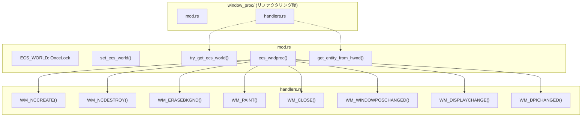
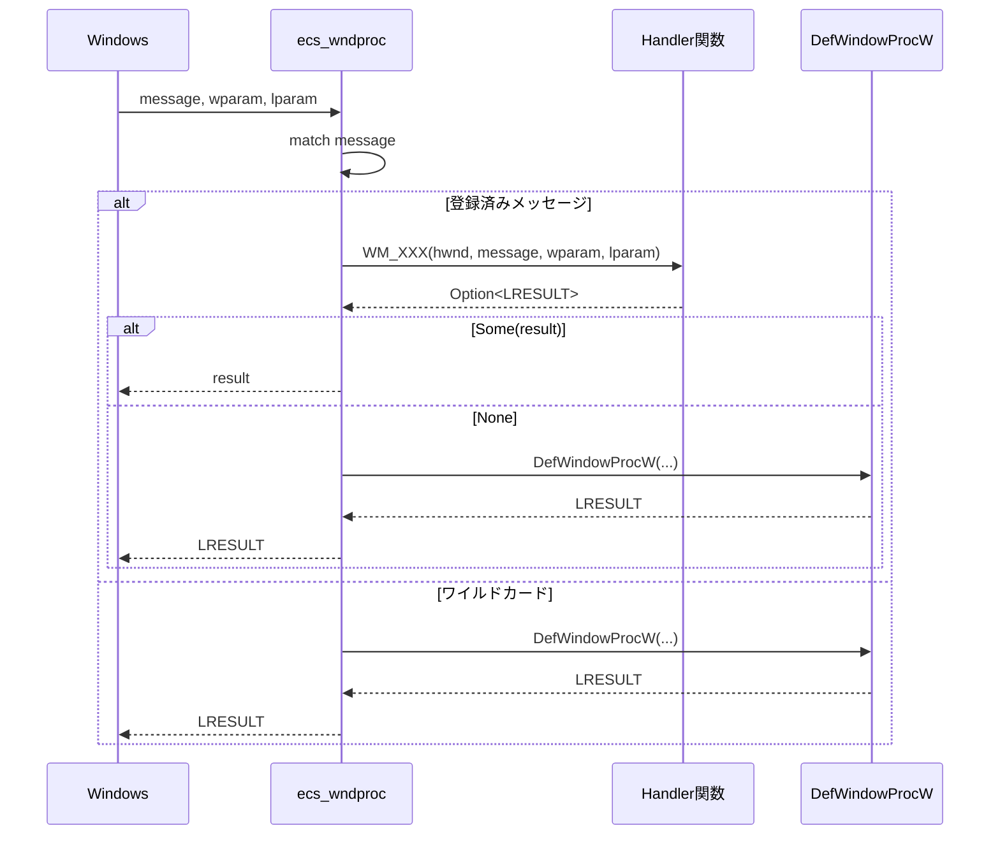

# Design Document: wndproc-message-handler-refactor

## Overview

**Purpose**: `ecs_wndproc`のメッセージ処理を個別のハンドラ関数に分離し、将来のメッセージ追加に備えた保守性の高い構造を実現する。

**Users**: wintfライブラリの開発者が、新しいWindowsメッセージハンドラを追加・修正する際に利用する。

**Impact**: 既存の`window_proc.rs`（366行）を`window_proc/`ディレクトリ構造に変換し、メッセージハンドラを独立した関数として分離する。

### Goals
- メッセージハンドラを個別の関数として分離し、可読性・保守性を向上
- `DefWindowProcW`呼び出しを一元化し、一貫性を確保
- インライン展開により実行時パフォーマンスを維持
- 将来の拡張に備えたモジュール構造を確立

### Non-Goals
- 新しいメッセージハンドラの追加（本仕様はリファクタリングのみ）
- メッセージ処理ロジックの変更
- カテゴリ別サブモジュール分離（将来の仕様で対応）

## Architecture

### Existing Architecture Analysis

現在の`window_proc.rs`は以下の構造：

```
window_proc.rs (366行)
├── SendWeak構造体 + unsafe impl
├── ECS_WORLD: OnceLock<SendWeak>
├── set_ecs_world() - pub
├── try_get_ecs_world() - private
├── ecs_wndproc() - pub extern "system"
│   └── match message {
│       ├── WM_NCCREATE => ...
│       ├── WM_NCDESTROY => ...
│       ├── WM_NCHITTEST => DefWindowProcW
│       ├── WM_ERASEBKGND => ...
│       ├── WM_PAINT => ...
│       ├── WM_CLOSE => ...
│       ├── WM_WINDOWPOSCHANGED => ... (最大)
│       ├── WM_DISPLAYCHANGE => ...
│       ├── WM_DPICHANGED => ...
│       └── _ => DefWindowProcW
│   }
└── get_entity_from_hwnd() - pub
```

**問題点**:
- 単一の大きな`match`式（約320行）
- メッセージ処理の追加・修正が困難
- `DefWindowProcW`呼び出しが複数箇所に分散

### Architecture Pattern & Boundary Map



**Architecture Integration**:
- **Selected pattern**: モジュール分離パターン（責務の分離）
- **Domain boundaries**: `mod.rs`がエントリポイント、`handlers.rs`が処理実装
- **Existing patterns preserved**: ECS World参照パターン、Windows APIコールバックパターン
- **New components rationale**: `handlers.rs`は将来の拡張性確保のため
- **Steering compliance**: 既存のECSモジュール構造に準拠

### Technology Stack

| Layer | Choice / Version | Role in Feature | Notes |
|-------|------------------|-----------------|-------|
| Language | Rust 2021 Edition | 実装言語 | 既存 |
| ECS | bevy_ecs 0.17.2 | Entity管理 | 既存依存、変更なし |
| Windows API | windows 0.62.1 | Win32 API | 既存依存、変更なし |
| Logging | tracing | ログ出力 | 既存依存、変更なし |

## System Flows

### メッセージディスパッチフロー



## Requirements Traceability

| Requirement | Summary | Components | Interfaces | Flows |
|-------------|---------|------------|------------|-------|
| 1.1 | メッセージ受信時にハンドラ呼び出し | ecs_wndproc | - | ディスパッチフロー |
| 1.2 | 8つのメッセージハンドラ | handlers.rs | WM_* functions | - |
| 1.3 | WM_NCHITTEST等はワイルドカード | ecs_wndproc | - | - |
| 2.1 | 関数名=メッセージ定数名 | handlers.rs | - | - |
| 3.1 | 統一シグネチャ | handlers.rs | Handler trait相当 | - |
| 3.2 | Some時はそのまま返す | ecs_wndproc | - | ディスパッチフロー |
| 3.3 | None時はDefWindowProcW | ecs_wndproc | - | ディスパッチフロー |
| 4.1 | #[inline]属性付与 | handlers.rs | - | - |
| 5.1-5.4 | DefWindowProcW一元化 | ecs_wndproc | - | ディスパッチフロー |
| 6.1-6.8 | 既存機能維持 | handlers.rs | 各WM_* | - |
| 7.1-7.2 | unsafe管理 | handlers.rs, mod.rs | - | - |
| 8.1-8.5 | モジュール構造分離 | window_proc/ | - | - |
| 9.1-9.3 | pub(crate)可視性 | mod.rs | - | - |

## Components and Interfaces

### Summary

| Component | Domain/Layer | Intent | Req Coverage | Key Dependencies | Contracts |
|-----------|--------------|--------|--------------|------------------|-----------|
| mod.rs | ECS/Window | エントリポイント、ディスパッチ | 1.1, 3.2-3.3, 5.1-5.4, 8.1, 8.3, 9.1-9.3 | handlers (P0) | - |
| handlers.rs | ECS/Window | メッセージ処理実装 | 1.2, 2.1, 3.1, 4.1, 6.1-6.8, 7.1, 8.2, 8.4-8.5 | mod.rs (P0), ecs::window (P1), ecs::layout (P1) | - |

### ECS / Window Layer

#### mod.rs

| Field | Detail |
|-------|--------|
| Intent | ウィンドウプロシージャのエントリポイントとメッセージディスパッチ |
| Requirements | 1.1, 3.2, 3.3, 5.1-5.4, 8.1, 8.3, 9.1-9.3 |

**Responsibilities & Constraints**
- `ecs_wndproc`関数: Windowsからのコールバックエントリポイント
- メッセージの`match`式によるディスパッチ
- `DefWindowProcW`呼び出しの一元管理
- ECS Worldへの参照管理（`ECS_WORLD`, `set_ecs_world`, `try_get_ecs_world`）

**Dependencies**
- Outbound: `handlers` — メッセージ処理委譲 (P0)
- External: `windows::Win32` — Win32 API (P0)
- External: `bevy_ecs` — Entity型 (P0)

**Module Structure**
```rust
// window_proc/mod.rs

mod handlers;

use bevy_ecs::prelude::*;
use windows::Win32::Foundation::*;
use windows::Win32::UI::WindowsAndMessaging::*;

use std::cell::RefCell;
use std::rc::{Rc, Weak};
use std::sync::OnceLock;

struct SendWeak(Weak<RefCell<crate::ecs::world::EcsWorld>>);
unsafe impl Send for SendWeak {}
unsafe impl Sync for SendWeak {}

static ECS_WORLD: OnceLock<SendWeak> = OnceLock::new();

#[inline]
pub(crate) fn set_ecs_world(world: Weak<RefCell<crate::ecs::world::EcsWorld>>) {
    let _ = ECS_WORLD.set(SendWeak(world));
}

pub(super) fn try_get_ecs_world() -> Option<Rc<RefCell<crate::ecs::world::EcsWorld>>> {
    ECS_WORLD.get().and_then(|weak| weak.0.upgrade())
}

pub(crate) extern "system" fn ecs_wndproc(
    hwnd: HWND,
    message: u32,
    wparam: WPARAM,
    lparam: LPARAM,
) -> LRESULT {
    let result = unsafe {
        match message {
            WM_NCCREATE => handlers::WM_NCCREATE(hwnd, message, wparam, lparam),
            WM_NCDESTROY => handlers::WM_NCDESTROY(hwnd, message, wparam, lparam),
            WM_ERASEBKGND => handlers::WM_ERASEBKGND(hwnd, message, wparam, lparam),
            WM_PAINT => handlers::WM_PAINT(hwnd, message, wparam, lparam),
            WM_CLOSE => handlers::WM_CLOSE(hwnd, message, wparam, lparam),
            WM_WINDOWPOSCHANGED => handlers::WM_WINDOWPOSCHANGED(hwnd, message, wparam, lparam),
            WM_DISPLAYCHANGE => handlers::WM_DISPLAYCHANGE(hwnd, message, wparam, lparam),
            WM_DPICHANGED => handlers::WM_DPICHANGED(hwnd, message, wparam, lparam),
            _ => None,
        }
    };
    
    result.unwrap_or_else(|| unsafe { DefWindowProcW(hwnd, message, wparam, lparam) })
}

#[inline]
pub(crate) fn get_entity_from_hwnd(hwnd: HWND) -> Option<Entity> {
    unsafe {
        let entity_bits = GetWindowLongPtrW(hwnd, GWLP_USERDATA);
        Entity::try_from_bits(entity_bits as u64)
    }
}
```

#### handlers.rs

| Field | Detail |
|-------|--------|
| Intent | 個別メッセージの処理ロジック実装 |
| Requirements | 1.2, 2.1, 3.1, 4.1, 6.1-6.8, 7.1, 8.2, 8.4-8.5 |

**Responsibilities & Constraints**
- 各メッセージハンドラ関数の実装
- `Option<LRESULT>`を返す統一インターフェース
- `#[inline]`属性によるパフォーマンス維持
- `unsafe fn`としてWindows API呼び出しを許可

**Dependencies**
- Inbound: `mod.rs` — ディスパッチ元 (P0)
- Outbound: `super::try_get_ecs_world` — ECS World参照 (P0)
- Outbound: `super::get_entity_from_hwnd` — Entity取得 (P0)
- External: `crate::ecs::window` — Window関連コンポーネント (P1)
- External: `crate::ecs::layout` — レイアウト関連コンポーネント (P1)
- External: `windows::Win32` — Win32 API (P0)

**Handler Interface**
```rust
// window_proc/handlers.rs

#![allow(non_snake_case)]

use tracing::{debug, trace, warn};
use windows::Win32::Foundation::*;
use windows::Win32::UI::WindowsAndMessaging::*;

/// メッセージハンドラの統一シグネチャ
/// - Some(LRESULT): 処理完了、この値を返す
/// - None: DefWindowProcWに委譲
type HandlerResult = Option<LRESULT>;

#[inline]
pub(super) unsafe fn WM_NCCREATE(
    hwnd: HWND,
    _message: u32,
    _wparam: WPARAM,
    lparam: LPARAM,
) -> HandlerResult {
    // Entity IDをGWLP_USERDATAに保存
    let cs = lparam.0 as *const CREATESTRUCTW;
    if !cs.is_null() {
        let entity_bits = (*cs).lpCreateParams as isize;
        SetWindowLongPtrW(hwnd, GWLP_USERDATA, entity_bits);
    }
    None // DefWindowProcWに委譲
}

#[inline]
pub(super) unsafe fn WM_NCDESTROY(
    hwnd: HWND,
    _message: u32,
    _wparam: WPARAM,
    _lparam: LPARAM,
) -> HandlerResult {
    // エンティティ削除、GWLP_USERDATAクリア
    // ... (既存ロジック)
    None // DefWindowProcWに委譲
}

#[inline]
pub(super) unsafe fn WM_ERASEBKGND(
    _hwnd: HWND,
    _message: u32,
    _wparam: WPARAM,
    _lparam: LPARAM,
) -> HandlerResult {
    Some(LRESULT(1)) // 背景消去をスキップ
}

#[inline]
pub(super) unsafe fn WM_PAINT(
    hwnd: HWND,
    _message: u32,
    _wparam: WPARAM,
    _lparam: LPARAM,
) -> HandlerResult {
    use windows::Win32::Graphics::Gdi::ValidateRect;
    let _ = ValidateRect(Some(hwnd), None);
    Some(LRESULT(0))
}

#[inline]
pub(super) unsafe fn WM_CLOSE(
    hwnd: HWND,
    _message: u32,
    _wparam: WPARAM,
    _lparam: LPARAM,
) -> HandlerResult {
    let _ = DestroyWindow(hwnd);
    Some(LRESULT(0))
}

#[inline]
pub(super) unsafe fn WM_WINDOWPOSCHANGED(
    hwnd: HWND,
    _message: u32,
    _wparam: WPARAM,
    lparam: LPARAM,
) -> HandlerResult {
    // ハンドラ内でECS Worldを取得するパターン
    // 統一シグネチャを維持しつつ、必要な場合のみWorldにアクセス
    let entity = super::get_entity_from_hwnd(hwnd)?;
    let world = super::try_get_ecs_world()?;
    
    // ① 第1借用セクション: DPI更新, WindowPosChanged=true, WindowPos/BoxStyle更新
    // ... (既存ロジック)
    
    // ② try_tick_on_vsync() (内部で借用→解放)
    let _ = world.try_tick_on_vsync();
    
    // ③ flush_window_pos_commands() (SetWindowPos実行)
    crate::ecs::window::flush_window_pos_commands();
    
    // ④ 第2借用セクション: WindowPosChanged=false
    // ... (既存ロジック)
    
    None // DefWindowProcWに委譲
}

#[inline]
pub(super) unsafe fn WM_DISPLAYCHANGE(
    _hwnd: HWND,
    _message: u32,
    _wparam: WPARAM,
    _lparam: LPARAM,
) -> HandlerResult {
    // Appリソースのmark_display_change
    // ... (既存ロジック)
    None // DefWindowProcWに委譲
}

#[inline]
pub(super) unsafe fn WM_DPICHANGED(
    hwnd: HWND,
    _message: u32,
    wparam: WPARAM,
    lparam: LPARAM,
) -> HandlerResult {
    // DpiChangeContext設定、SetWindowPos呼び出し
    // ... (既存ロジック)
    Some(LRESULT(0))
}
```

**Implementation Notes**
- `#![allow(non_snake_case)]`: モジュールレベルでlint抑制
- 各関数は`#[inline]`属性付き
- 未使用パラメータには`_`プレフィックス
- 既存ロジックはそのまま移動（変更なし）

## Testing Strategy

### Unit Tests
本リファクタリングは既存ロジックの移動のみであり、新規テストは不要。

### Integration Tests
- `cargo test --all-targets`: 既存テストの通過確認
- サンプルアプリケーション（`areka`, `taffy_flex_demo`）の動作確認

### E2E Tests
- ウィンドウ作成・移動・リサイズ・クローズの動作確認
- マルチモニター間移動時のDPI変更動作確認

## Migration Strategy

### Phase 1: ファイル構造変換
1. `window_proc/`ディレクトリ作成
2. `window_proc.rs`の内容を`window_proc/mod.rs`に移動
3. `handlers.rs`を作成し、ハンドラ関数を移動

### Phase 2: リファクタリング
1. `ecs_wndproc`の`match`式を関数呼び出しに変換
2. `DefWindowProcW`呼び出しを一元化
3. 可視性を`pub(crate)`に変更

### Phase 3: 検証
1. `cargo build`でコンパイル確認
2. `cargo test --all-targets`でテスト通過確認
3. サンプルアプリケーションの動作確認

### Rollback
- `git revert`で元の`window_proc.rs`に戻す
